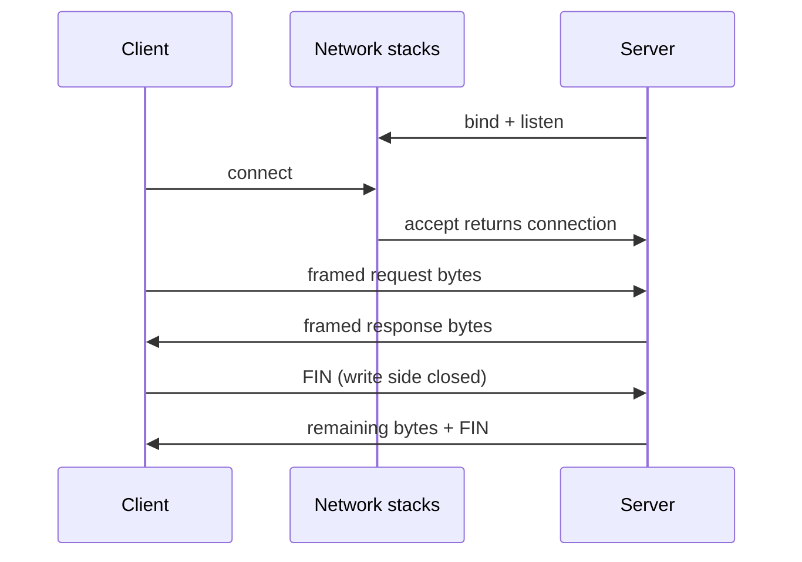

<TLDR>
  <TLDRCell label="what">
    网络编程让不同进程通过套接字交换字节。TCP 提供可靠、有序的字节流，UDP 提供保留边界但不保证送达的数据报。
  </TLDRCell>
  <TLDRCell label="trap">
    一次 `send()` 不对应对端的一次 `recv()`；TCP 没有应用消息边界。没有长度上限、超时和背压的正常路径，也会在慢速或恶意对端面前失效。
  </TLDRCell>
  <TLDRCell label="fix">
    明确定义分帧规则，循环处理部分读写，并为连接、消息大小、等待时间和队列设置边界。把 EOF、超时与协议错误当作不同结果处理。
  </TLDRCell>
</TLDR>

## 是什么，为什么存在

网络编程是两个或多个进程通过网络协议交换数据的程序设计工作。应用不直接操纵以太网帧或 TCP 段，而是通过<Term id="socket">套接字（socket）</Term>调用操作系统的网络栈。套接字把应用看到的读写接口，与地址族、传输协议、本地地址及对端地址关联起来。

你会在 HTTP 服务、数据库客户端、消息代理、游戏会话、设备遥测和服务间 RPC 中遇到它。上层库会隐藏许多系统调用，但不会消除传输层的约束。请求偶尔被截断、进程退出时卡住，或负载增加后内存持续上涨，往往都要回到这些约束来解释。

网络程序首先要选择通信语义，而不是先选 API。TCP 与 UDP 都使用端口把到达主机的数据交给相应进程，但它们给应用的契约不同。混淆两者，代码在本机小样本上也许能工作，到了丢包、拥塞或长连接环境就会暴露问题。

### TCP 是字节流

TCP 在两个端点之间提供可靠、有序的双向字节流。「可靠」表示协议会检测丢失并重传，按顺序向接收应用交付字节；它不表示连接永不失败，也不表示一次写入一定完整到达。超时、复位、主机重启和网络分区仍会让应用面对结果不确定的操作。

字节流没有消息边界。发送方连续写入 `b"red"` 和 `b"blue"`，接收方可能读到 `b"redblue"`，也可能分成更多片段。应用协议必须另外说明一条消息在哪里结束。

### UDP 是数据报

UDP 发送<Term id="datagram">数据报（datagram）</Term>。一次成功的发送对应一个数据报，接收 API 会保留这条边界；如果接收缓冲区太小，多出的内容会被截断，而不是留给下一次读取。

UDP 不承诺送达、顺序或去重。需要这些性质的应用，必须在应用层实现相应机制，或选择已经实现它们的协议。因为 UDP 没有连接握手，`connect()` 用在 UDP 套接字上时通常只是记录默认对端并过滤接收来源，并不会建立 TCP 式连接。

### 套接字是有生命周期的资源

服务器的监听套接字负责排队连接请求。`accept()` 返回一个新的已连接套接字，用于和单个客户端通信；监听套接字继续接收其他连接。客户端通常先解析主机名，再对某个候选地址调用 `connect()`。

套接字占用内核资源，并可能持有端口、缓冲区和协议状态。所有权应当和文件一样明确：谁创建，谁关闭；谁能取消阻塞操作；进程退出时先停止接收新工作，还是立即中断已有连接。上下文管理器能关闭描述符，但完整的服务仍需要关闭顺序。

## 工作原理

### 地址解析得到候选端点

应用通常从主机名与服务名开始，例如 `api.example` 和 `443`。解析器把它们转换为一个或多个候选套接字地址；结果可能同时包含 IPv6 与 IPv4，也可能随位置和时间改变。地址、端口、地址族和传输协议共同决定怎样创建与连接套接字。

不要把 DNS 当作返回单个永久 IP 的字典。`getaddrinfo()` 返回候选列表，客户端要逐个尝试或采用有界的并发连接策略。只取第一项、强制 `AF_INET`，或把解析结果无限缓存，都会把可用的备用路径丢掉。

### TCP 连接把两条单向流配成一对

服务器依次执行 `socket()`、`bind()`、`listen()` 和 `accept()`。客户端创建套接字并执行 `connect()`。连接建立后，两端都能发送和接收；任一方向可以先结束，因此「连接关闭」并不总是一个瞬时的双边事件。



`send()` 把尽可能多的字节复制到本地发送路径，返回值可能小于输入长度。`recv(n)` 返回当前可用的至多 `n` 个字节，而不是「对端上一次发送的内容」。阻塞模式下，两者可能等待；非阻塞模式下，没有进展时会报告稍后重试。

TCP 的确认只说明对端协议栈接收了相关字节，不说明对端业务已经提交事务。客户端在响应到达前失去连接时，不能仅凭 TCP 状态判断服务端是否完成了操作。重试写请求需要应用层幂等语义或幂等键。

### 分帧恢复应用消息

<Term id="message-framing">消息分帧（message framing）</Term>规定如何从字节流中识别完整消息。常见方案包括固定长度、分隔符、长度前缀，以及由上层协议定义的帧格式。选择取决于负载是否允许出现分隔符、最大长度是否已知，以及能否增量解析。

长度前缀协议通常先发送一个固定宽度整数，再发送相应数量的负载字节。多字节整数必须约定字节序；网络协议通常采用<Term id="network-byte-order">网络字节序（network byte order）</Term>，也就是大端序。Python `struct` 格式中的 `!` 明确选择网络字节序。

解析器不能看到长度就立刻分配任意大小的缓冲区。它应先验证长度上限，再等待完整帧。缓冲区中可能只有半个头、一个完整帧加上下一个帧的一部分，或一次包含多个帧；这些都是正常输入形态。

### 阻塞、超时与就绪

阻塞套接字的代码容易理解，但每个等待点都要有结束条件。连接超时、读取超时和整个操作的截止时间不是同一件事：连续收到少量数据可能反复刷新单次读取超时，却永远无法完成一条消息。对外部请求，通常需要覆盖整个操作的单调时钟截止时间。

非阻塞 I/O 把「现在不能继续」变成正常控制流。`selectors`、`poll`、`epoll` 或事件循环通知某个套接字可能可读或可写，但就绪不是完成承诺。处理器仍要读取或写入直到暂时没有进展，并保存尚未处理完的状态。

线程、异步任务和事件循环只是等待策略。它们不会自动提供消息边界、大小限制或取消传播。一个并发模型能承载多少连接，也不能只根据 API 名称推断，必须结合工作负载测量。

## 示例

### 本地 TCP 往返

第一个示例在环回地址上绑定临时端口。服务端只处理一条以换行符结尾的请求，并返回大写结果。`makefile()` 把套接字包装为缓冲流，换行符就是这个小协议的消息边界。

<Depth level="quick">

```python run title="tcp_round_trip.py"
from socket import AF_INET, SOCK_STREAM, create_connection, socket
from threading import Thread


def serve_once(listener):
    connection, _ = listener.accept()
    with connection, connection.makefile("rwb") as stream:
        request = stream.readline()
        stream.write(request.upper())
        stream.flush()


with socket(AF_INET, SOCK_STREAM) as listener:
    listener.bind(("127.0.0.1", 0))
    listener.listen()
    host, port = listener.getsockname()

    server = Thread(target=serve_once, args=(listener,))
    server.start()

    with create_connection((host, port), timeout=1.0) as client:
        with client.makefile("rwb") as stream:
            stream.write(b"ping\n")
            stream.flush()
            reply = stream.readline()

    server.join()

print(f"reply={reply.decode().strip()}")
```

```text
reply=PING
```

</Depth>

端口 `0` 让操作系统选择空闲端口，所以示例不会依赖固定端口。程序只打印协议结果，不打印每次运行都会变化的端口号。线程在监听套接字关闭前完成，资源所有权也能从两个 `with` 块中看出来。

这里的 `readline()` 会等待换行、EOF 或错误。如果对端一直不发送换行且不关闭连接，服务器会一直等待；生产协议还要设置消息长度与截止时间。简单的分隔符协议并没有免除资源限制。

### 观察 UDP 数据报边界

第二个示例向同一个环回端点发送两个数据报，再分别接收它们。两个输出行反映本次真实运行，但不能据此推导公网 UDP 永远按发送顺序抵达。

```python run title="udp_datagrams.py"
from socket import AF_INET, SOCK_DGRAM, socket


with socket(AF_INET, SOCK_DGRAM) as receiver:
    receiver.bind(("127.0.0.1", 0))
    receiver.settimeout(1.0)
    destination = receiver.getsockname()

    with socket(AF_INET, SOCK_DGRAM) as sender:
        sender.sendto(b"alpha", destination)
        sender.sendto(b"beta", destination)

    first, _ = receiver.recvfrom(1024)
    second, _ = receiver.recvfrom(1024)

print(f"datagram 1={first.decode()}")
print(f"datagram 2={second.decode()}")
```

```text
datagram 1=alpha
datagram 2=beta
```

每次 `recvfrom()` 返回一个数据报及其来源地址。接收缓冲区大小为 `1024`，所以真实协议必须保证数据报不会超过限制，或使用能报告截断的 API。把一个过大的数据报拆成两次 `recvfrom()` 来读是行不通的。

### 增量解析长度前缀

下面的解析器使用四字节无符号长度前缀。它故意把两条消息拼成一段字节，再按不规则位置切开，模拟 TCP 可能呈现的读取结果。解析器只在头和负载都完整时产出消息。

```python run title="length_framing.py"
from struct import Struct


HEADER = Struct("!I")
MAX_MESSAGE = 1024


def encode(message):
    return HEADER.pack(len(message)) + message


def extract_messages(buffer):
    messages = []
    while len(buffer) >= HEADER.size:
        (size,) = HEADER.unpack_from(buffer)
        if size > MAX_MESSAGE:
            raise ValueError("message too large")
        frame_size = HEADER.size + size
        if len(buffer) < frame_size:
            break
        messages.append(bytes(buffer[HEADER.size:frame_size]))
        del buffer[:frame_size]
    return messages


wire = encode(b"alpha") + encode(b"beta")
chunks = [wire[:3], wire[3:8], wire[8:]]
buffer = bytearray()

for chunk in chunks:
    buffer.extend(chunk)
    for message in extract_messages(buffer):
        print(f"message={message.decode()}")

print(f"remaining={len(buffer)}")
```

```text
message=alpha
message=beta
remaining=0
```

第一块数据甚至不足四字节头，解析器会保留它。后续块补齐第一帧并带来第二帧，循环因此可能一次产出多条消息。`MAX_MESSAGE` 在读取负载前拒绝异常长度，避免根据不可信字段进行无界分配。

这个示例复制消息并从 `bytearray` 头部删除内容，适合解释协议，不代表高吞吐实现。生产解析器可以用读取偏移量或环形缓冲区减少复制，但必须在测量表明确认解析开销后再增加复杂度。

### 区分超时、数据与 EOF

最后一个示例使用 `socketpair()` 隔离状态转换，不依赖外部网络。第一次读取因为没有数据而超时；发送方写入后关闭写方向，接收方先读到数据，再用空字节串观察到有序 EOF。

```python run title="timeout_and_eof.py"
from socket import SHUT_WR, socketpair


writer, reader = socketpair()
with writer, reader:
    reader.settimeout(0.02)
    try:
        reader.recv(4)
    except TimeoutError:
        print("read timed out")

    writer.sendall(b"done")
    writer.shutdown(SHUT_WR)

    print(f"data={reader.recv(4)!r}")
    print(f"eof={reader.recv(4)!r}")
```

```text
read timed out
data=b'done'
eof=b''
```

超时表示截止时间内没有取得数据，并不证明连接已经断开。`b''` 才表示对端有序关闭了发送方向，而且应当在此前缓冲的数据读完后出现。连接复位通常表现为异常，不能和这两个结果合并成空响应。

## 陷阱

> [!PITFALL]
> 把一次 `recv()` 当作一条完整消息。短消息在环回测试中经常一次读完，这会掩盖半个头、半个负载和多帧合并的情况。
>
> **修复：** 按协议增量解析。测试应主动把头和负载切在每个可能边界，并把多条帧合在一次输入中。

> [!PITFALL]
> 忽略部分写入，或在连接失败后盲目重发业务操作。`send()` 可以只接受输入的一部分；即使 `sendall()` 成功返回，也只说明本地调用完成，不说明业务提交。
>
> **修复：** 阻塞 Python 代码发送完整缓冲区时使用 `sendall()`；非阻塞代码保存剩余切片并等待再次可写。只有应用语义允许时才重试，并为可能产生副作用的请求提供幂等保护。

> [!PITFALL]
> 信任对端声明的长度，或只设置单次读取超时。攻击者可以声明巨型帧，也可以持续发送少量字节，让连接永远达不到完整消息。
>
> **修复：** 在分配前检查帧上限，同时限制累计缓冲区、空闲时间和整个操作时间。超限、超时和格式错误要走可观察且可测试的关闭路径。

> [!PITFALL]
> 为方便测试而监听 `0.0.0.0` 或 `::`，却没有认证与加密。TCP 的可靠性和 UDP 校验都不验证对端身份，也不保护应用数据机密性。
>
> **修复：** 本地工具默认绑定环回地址；确实要对外提供服务时，明确网络边界，并使用经过维护的 TLS 或应用协议实现。不要自行设计加密握手。

> [!PITFALL]
> 只尝试 DNS 返回的第一个 IPv4 地址，或把主机名解析结果永久缓存。第一个候选路径可能不可达，服务地址也可能在程序运行期间变化。
>
> **修复：** 保留 `getaddrinfo()` 给出的地址族信息，使用库提供的多地址连接策略，并设置整体连接截止时间。缓存要遵守解析器和部署环境的更新策略。

> [!PITFALL]
> 关闭套接字时没有确定所有权。一个任务关闭仍被另一个任务使用的描述符，会制造偶发错误；只停止读循环而不释放套接字，则会耗尽进程资源。
>
> **修复：** 让一个组件负责关闭和取消，其他组件通过信号请求它结束。测试正常 EOF、复位、超时、取消和进程停止，确认每条路径都释放监听套接字与已连接套接字。

## AI 时代

**生成代码在这里常犯的错**

生成的套接字代码经常假设 `recv(4096)` 会返回一条完整请求，或者把两个连续 `send()` 误写成有边界的两条 TCP 消息。模型还会只取 `getaddrinfo()` 的第一项并硬编码 `AF_INET`，在开发机上可用，却破坏双栈与备用地址。更危险的版本会按不可信长度直接分配内存、用 `pickle` 解码网络输入，或在超时后重放可能已经执行的写操作。

另一类问题出现在生命周期上：生成的服务器为每个连接无限创建线程或任务，没有并发上限、截止时间和取消路径；异常分支又忘记关闭已接受套接字。它看起来像完整的回显服务器，但慢速客户端足以耗尽描述符、任务或内存。

**让 AI 检查**

- 列出每个 `send`、`recv`、`connect` 和 `accept` 的部分完成、超时、EOF、复位与取消路径，并指出资源由谁关闭。
- 根据协议画出增量解析状态，验证半个头、半个负载、多帧同读、零长度帧和超长声明。
- 跟踪从 DNS 候选到连接建立的策略，确认 IPv6、IPv4、整体截止时间和失败聚合都被覆盖。

**审查清单**

- 对输入大小、连接数、在途任务、缓冲队列和操作时间都设硬边界，并用超限测试触发它们。
- 不把传输层确认当作业务提交；每次自动重试都有明确的幂等依据。
- 在测试中切分和合并字节，模拟慢读、半关闭、复位和所有候选地址失败，并检查描述符最终释放。

**提示词词汇**

使用准确术语：`byte stream`（字节流）、`datagram boundary`（数据报边界）、`message framing`（消息分帧）、`partial read/write`（部分读写）、`network byte order`（网络字节序）、`operation deadline`（操作截止时间）、`half-close`（半关闭）、`backpressure`（背压）和 `idempotent retry`（幂等重试）。要求 AI 给出字节级输入序列与资源所有权表，比「写一个健壮的服务器」更容易暴露遗漏。

<Depth level="deep">

## TCP 关闭有方向

TCP 的两个发送方向可以分别结束。调用 `shutdown(SHUT_WR)` 会告诉本地协议栈不再发送新字节；对端在读完已排队数据后看到 EOF，但本端仍可以继续接收。这个<Term id="half-close">半关闭（half-close）</Term>适合用 EOF 表示请求体结束、响应随后返回的简单协议。

`shutdown()` 不释放描述符，也不代替 `close()`。它改变连接方向的协议状态；最终仍要关闭套接字。反过来，直接关闭包含未发送数据、共享引用或异常状态的套接字，可能产生与有序 FIN 不同的对端结果。

有序 EOF、复位与超时给出的证据不同。EOF 说明对端发送方向已经关闭，复位说明连接被异常终止，超时只说明等待预算用完。三者都不能单独证明某个应用操作是否提交，所以协议需要响应、事务标识或查询接口来解决业务不确定性。

长连接关闭还要考虑正在处理的工作。服务端通常先停止接受新连接或新请求，再等待已有工作到一个有限截止时间，最后取消剩余工作并关闭描述符。若多个任务同时读写一个套接字，关闭协调必须由明确的所有者完成。

`SO_REUSEADDR` 解决的是特定地址复用场景，不是通用的「端口占用修复」。其确切语义依赖平台，不能用来替代正确的进程关闭或绑定策略。生成代码若无条件加入该选项，应先说明要解决的状态和目标平台。

## 背压要跨越每一层

发送方写入套接字，通常只是把数据交给本机内核缓冲区。对端变慢后，缓冲区会填满；阻塞写会等待，非阻塞写会部分完成或报告暂时不可写。这是<Term id="backpressure">背压（backpressure）</Term>开始传回生产者的位置，不是错误。

如果应用在套接字不可写时继续把响应追加到无界用户态队列，内核背压就被队列绕开了。正确的设计会暂停上游读取或计算，并为每个连接与整个进程设置队列高水位。超过预算时，是拒绝新工作、丢弃允许丢失的数据，还是关闭慢连接，取决于协议语义。

<Term id="flow-control">流量控制（flow control）</Term>与拥塞控制也不是同一个概念。流量控制保护接收方不被发送方压垮；拥塞控制保护网络路径。应用背压还要覆盖解析后的对象、数据库调用和工作队列，不能因为 TCP 已有流量控制就省略。

接收方向同样需要边界。即使每条帧都不大，无限积累完整帧也会耗尽内存。读取循环应把数据交给有容量限制的消费者；消费者落后时，暂停读取，让压力逐层传回套接字，而不是继续生成任务。

不要凭「异步」断言性能更好。线程、事件循环和异步 I/O 的成本取决于连接数量、每条连接的计算量、消息大小以及运行时。先测量排队时间、缓冲字节、活跃连接与尾延迟，再选择并发模型或调整水位。

## 多地址连接是一项策略

主机名可能解析出多个 IPv6 与 IPv4 地址。顺序尝试容易被第一个失效路径拖慢；同时连接所有地址又会制造不必要的流量与服务器负担。Happy Eyeballs 一类算法会错开候选尝试，在连接速度与额外工作之间取舍。

成熟客户端库通常比手写循环更了解平台解析器、地址排序和取消细节。应用仍需提供整体截止时间，并记录最终选择的地址族与各候选失败原因。否则，「连接超时」会把 DNS、路由、防火墙和 TLS 问题混成一个无法定位的结果。

解析成功不等于连接成功，TCP 连接成功也不等于应用协议可用。诊断信息应区分解析、建立传输连接、完成安全握手与完成应用握手。每一层都需要自己的错误上下文，但对调用方仍应遵守一个总时间预算。

服务器绑定也涉及地址族策略。只绑定 `127.0.0.1` 不会接受 IPv6 环回连接，只绑定 `::` 是否同时接受 IPv4 映射地址则依赖平台设置。部署配置应显式选择监听地址，并在目标操作系统上验证，而不是从开发机行为外推。

## 按阶段诊断故障

「网络错误」这个标签太宽，无法指导修复。一次请求至少经过名称解析、传输连接、安全握手、应用握手、消息交换和关闭；每个阶段都有不同的超时与错误。记录失败阶段，才能判断应检查 DNS、路由、证书、协议解析，还是业务处理。

| 观察结果 | 能说明什么 | 不能说明什么 |
| --- | --- | --- |
| 解析失败 | 没有得到可用地址 | 服务器进程是否健康 |
| 连接超时 | 截止时间内未建立传输连接 | 请求是否到达其他候选地址 |
| 连接复位 | 对端或中间设备异常终止连接 | 哪一端业务代码先失败 |
| 有序 EOF | 对端关闭了发送方向 | 业务操作是否提交 |
| 协议错误 | 收到的字节违反应用协议 | TCP 传输是否曾经丢包 |
| 操作超时 | 总时间预算已经耗尽 | 连接此后是否会恢复 |

日志应包含阶段、远端地址族、候选序号、已收发字节数、帧状态和关闭原因。连接与请求需要不同的标识，这样多路复用或连接复用时仍能追踪单次操作。错误聚合要保留各候选失败，而不是只返回最后一次异常。

可观测性也有安全边界。记录帧长度和消息类型通常足够诊断分帧，不应顺手写入认证令牌或完整负载。远端地址与错误文本可能同样敏感，应按系统的数据保留规则处理。

指标要对应容量决策。活跃连接数、等待队列长度、每连接缓冲字节、超时阶段和复位率，比一个笼统的「请求失败」计数更能解释背压是否断裂。阈值仍要根据真实流量测量，不能从示例数字复制。

### 上线前注入故障

正常的环回往返覆盖不了网络程序最难的路径。测试夹具应能延迟读取、分割写入、提前 EOF、发送超长帧、触发复位，并让所有地址候选失败。每次注入后都检查任务、线程、缓冲区和描述符是否回到基线。

故障测试还要验证调用方看到的语义。超时是否可重试、取消是否传播、部分响应是否被丢弃，以及错误是否保留阶段信息，都属于 API 契约。只断言「抛出了异常」会漏掉最重要的区别。

</Depth>

<Checkpoint id="foundations/network-programming" />

## 延伸阅读

- [Python 3.14 `socket` 文档](https://docs.python.org/3.14/library/socket.html)
- [Python 3.14 `struct` 文档](https://docs.python.org/3.14/library/struct.html)
- [RFC 9293：传输控制协议（TCP）](https://www.rfc-editor.org/rfc/rfc9293.html)
- [RFC 768：用户数据报协议（UDP）](https://www.rfc-editor.org/rfc/rfc768.html)
- [RFC 8305：Happy Eyeballs Version 2](https://datatracker.ietf.org/doc/html/rfc8305)
