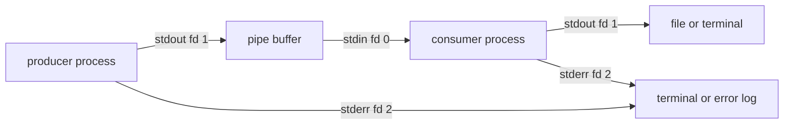

<TLDR>
  <TLDRCell label="what">
    Pipes connect one command's standard output to another command's standard input. Redirections attach standard streams to files or other descriptors before a command runs.
  </TLDRCell>
  <TLDRCell label="when">
    Use them to compose small commands, preserve machine-readable data, separate diagnostics, and make failures visible to automation.
  </TLDRCell>
  <TLDRCell label="how">
    Quote operands, keep data and diagnostics on different streams, read redirections left to right, and define which stage statuses make the whole pipeline fail.
  </TLDRCell>
</TLDR>

## What it is and why it exists

A command-line program normally starts with three <Term id="standard-stream">standard streams</Term>: standard input, standard output, and standard error. They are conventions backed by open file descriptors, numbered `0`, `1`, and `2`. A program can read bytes from input, write result bytes to output, and send diagnostics to error without knowing whether the endpoints are a terminal, a file, or another process.

A <Term id="pipeline">pipeline</Term> uses that separation to compose programs. In `producer | consumer`, the shell connects the producer's standard output to the consumer's standard input through a pipe. Standard error is not part of the pipe unless you redirect it, so a parser can receive clean data while a person or log collector still sees failures.

<Term id="redirection">Redirection</Term> changes an endpoint without changing the program. `< input.txt` supplies a file as standard input, `> output.txt` replaces a file with standard output, `>> output.txt` appends, and `2> errors.log` sends standard error elsewhere. Descriptor duplication such as `2>&1` makes one descriptor refer to the endpoint currently used by another.

The shell supplies composition, but it does not invent a data contract. The producer and consumer must agree on bytes, encoding, record boundaries, and malformed input. A line-oriented consumer is reliable only when embedded newlines cannot appear inside a logical record, or when an escaping format defines how they are represented.

Pipelines appear in interactive investigation, build scripts, release jobs, data imports, and service entrypoints. The same syntax can be a quick convenience or production control flow. Production use needs explicit failure policy because a useful-looking final line does not prove that every earlier stage succeeded.

An <Term id="exit-status">exit status</Term> is separate from both output streams. By convention, `0` means success and a nonzero value describes some kind of failure, with details defined by the command. Reliable automation preserves the status and the diagnostic stream; redirecting or parsing output cannot substitute for either one.

## How it works

### The three channels

The shell starts commands as <Term id="process">processes</Term> and prepares their descriptor tables. A regular program reads descriptor `0` and writes descriptors `1` and `2`; library names such as `stdin`, `stdout`, and `stderr` wrap those conventional descriptors. The program usually does not need to know what kernel object each descriptor references.

The three streams carry different kinds of information:

| Stream | Descriptor | Intended role | Default terminal behavior |
| --- | ---: | --- | --- |
| Standard input | `0` | Input data | Reads from the terminal |
| Standard output | `1` | Successful result data | Displays on the terminal |
| Standard error | `2` | Diagnostics and progress | Displays on the terminal |

The roles are contracts rather than permissions. A program can write diagnostics to standard output, but doing so makes downstream parsing fragile. A well-behaved filter writes only transformed data to standard output and explains rejected input on standard error.

### Pipe setup and concurrent execution

For a two-stage pipeline, the shell creates a pipe with a read end and a write end. It makes the first command's descriptor `1` refer to the write end and the second command's descriptor `0` refer to the read end. It then starts both commands, closes unused copies of the pipe ends, and waits according to its pipeline rules.



The commands usually run concurrently. The producer may block when the finite pipe buffer fills, and the consumer may block while the pipe is empty but a writer still exists. This natural <Term id="backpressure">backpressure</Term> limits bytes in the pipe, but it does not impose an application timeout or cap buffers that either program allocates itself.

A pipe transports bytes, not files or business records. Reads may return fewer bytes than a writer supplied, and several writes can be combined. Many text tools construct a line abstraction above the byte stream, which works only when the chosen format makes line boundaries meaningful.

### Redirections are ordered operations

The shell processes redirections from left to right before the command executes. `>all.log 2>&1` first opens `all.log` for standard output, then duplicates that destination onto standard error. Both streams reach the file.

The visually similar `2>&1 >out.log` does something else. It first duplicates the current standard-output destination onto standard error, then moves only standard output to `out.log`. If standard output was a terminal or a pipe at the first step, standard error keeps that older destination.

Filename expansion and redirection setup belong to the shell. Quote a variable used as a filename, as in `>"$report_path"`, so spaces and wildcard characters remain one operand. Quoting does not validate that the path is authorized or safe to overwrite; scope and overwrite policy are separate checks.

### Pipeline status is a policy choice

Without `pipefail`, Bash reports the status of the last command in a pipeline, subject to inversion with `!`. An upstream command can fail while a downstream command consumes partial input and exits `0`. The whole pipeline then looks successful.

With `set -o pipefail`, the pipeline status is zero only if every stage succeeds; otherwise it is the status of the rightmost failing stage. Bash also exposes the per-stage values in the `PIPESTATUS` array. Read that array immediately after the pipeline because almost any later command, including an assignment, replaces it.

`set -e` is not a replacement for a pipeline contract. Its behavior depends on syntactic context, and expected nonzero statuses are common in tests and searches. Decide which statuses are expected at each boundary, capture them, and report enough context to distinguish empty results from broken input.

## Examples

The examples use GNU Bash 5.2.21 and standard local utilities. Each creates its own temporary workspace and removes it on exit, so no prior files are required.

### Separating results from diagnostics

This report producer writes one data record and one warning. Separate redirections preserve both channels without letting the warning contaminate the data file.

<Depth level="quick">

```bash title="route_streams.sh"
#!/usr/bin/env bash
set -u

workspace=$(mktemp -d)
trap 'rm -rf "$workspace"' EXIT

emit_report() {
  printf '%s\n' 'order=104 state=ready'
  printf '%s\n' 'warning: cache is stale' >&2
}

emit_report >"$workspace/orders.log" 2>"$workspace/warnings.log"

printf 'stdout: '
cat "$workspace/orders.log"
printf 'stderr: '
cat "$workspace/warnings.log"
```

```text
stdout: order=104 state=ready
stderr: warning: cache is stale
```

</Depth>

`>` opens each destination before `emit_report` runs and truncates an existing file. The function's explicit `>&2` changes only that `printf` call. Later commands inherit the script's normal terminal streams, so the two `cat` calls make the saved channels visible.

Use `>>` only when accumulating runs is part of the contract. Appending makes a log durable across invocations, but it also needs rotation, record boundaries, and a policy for concurrent writers. It is not a safer spelling of `>`.

### Filtering records while preserving rejected-input details

The next script feeds valid result rows through `sort` while redirecting the filter's diagnostics to a separate file. The malformed row does not become input to `sort`.

```bash title="filter_orders.sh"
#!/usr/bin/env bash
set -u
set -o pipefail
export LC_ALL=C

workspace=$(mktemp -d)
trap 'rm -rf "$workspace"' EXIT

printf '%s\n' \
  'id,total,state' \
  'O-101,19.50,paid' \
  'malformed-row' \
  'O-103,25.00,paid' \
  'O-104,42.00,pending' >"$workspace/orders.csv"

awk -F, '
  NR == 1 { next }
  NF != 3 { print "invalid row " NR > "/dev/stderr"; next }
  $3 == "paid" { printf "%s %.2f\n", $1, $2 }
' "$workspace/orders.csv" 2>"$workspace/warnings.log" |
  sort -k2,2nr >"$workspace/paid.txt"

printf '%s\n' 'paid orders:'
cat "$workspace/paid.txt"
printf 'diagnostic: '
cat "$workspace/warnings.log"
```

```text
paid orders:
O-103 25.00
O-101 19.50
diagnostic: invalid row 3
```

<TryToBreak items={['an empty input file', 'a total with a comma', 'two malformed rows']} />

`2>"$workspace/warnings.log"` applies to `awk`, while `>"$workspace/paid.txt"` applies to `sort`. Redirections bind to the command beside them, not automatically to the entire pipeline. A group such as `{ command1; command2; } 2>errors.log` is useful when several commands must share one redirected channel.

This fixture calls its format CSV, but the simple `-F,` parser does not implement quoted CSV fields. A comma inside a quoted value would still split the record. When the input contract permits quoting, embedded newlines, or escaped delimiters, use a parser that implements that format instead of extending an `awk` one-liner by guesswork.

### Retaining every stage's status

Here the producer emits usable partial data and then returns status `7`. `grep` succeeds, so a default Bash pipeline would hide the upstream failure. The script copies `PIPESTATUS` immediately and computes the same rightmost-failure rule as `pipefail` for display.

```bash title="check_pipeline.sh"
#!/usr/bin/env bash
set -u
set -o pipefail

workspace=$(mktemp -d)
trap 'rm -rf "$workspace"' EXIT

fetch_orders() {
  printf '%s\n' 'accepted: O-201' 'ignored: O-202'
  printf '%s\n' 'upstream: retry budget exhausted' >&2
  return 7
}

fetch_orders | grep '^accepted:' >"$workspace/accepted.txt"
stages=("${PIPESTATUS[@]}")

pipeline_status=0
for status in "${stages[@]}"; do
  if ((status != 0)); then
    pipeline_status=$status
  fi
done

printf 'pipeline=%d stages=%s\n' "$pipeline_status" "${stages[*]}"
cat "$workspace/accepted.txt"
```

```text
upstream: retry budget exhausted
pipeline=7 stages=7 0
accepted: O-201
```

The diagnostic remains on the script's standard error, while the accepted record passes through the pipe and into a file. Partial output can be useful for diagnosis, but this status says the result is incomplete. A caller should not publish `accepted.txt` as a complete snapshot.

Copying `PIPESTATUS` is the first command after the pipeline. If the script first ran `pipeline_status=$?`, that assignment would update `PIPESTATUS` before it could be copied. When only aggregate success matters, capture `$?`; when stage identity matters, capture `PIPESTATUS` first and derive the aggregate value from the copy.

### Observing left-to-right redirection

The final script runs the same function with two redirection orders. Its second run starts with standard output attached to a pipe, so `2>&1` preserves that pipe for standard error before `>stdout.log` moves standard output away.

```bash title="redirection_order.sh"
#!/usr/bin/env bash
set -u

workspace=$(mktemp -d)
trap 'rm -rf "$workspace"' EXIT

emit_diagnostic() {
  printf '%s\n' 'result: 12 records'
  printf '%s\n' 'error: one source timed out' >&2
}

emit_diagnostic >"$workspace/combined.log" 2>&1
emit_diagnostic 2>&1 >"$workspace/stdout.log" |
  sed 's/^/pipe: /' >"$workspace/stderr.log"

printf '%s\n' 'combined:'
cat "$workspace/combined.log"
printf '%s\n' 'stdout only:'
cat "$workspace/stdout.log"
printf '%s\n' 'pipe capture:'
cat "$workspace/stderr.log"
```

```text
combined:
result: 12 records
error: one source timed out
stdout only:
result: 12 records
pipe capture:
pipe: error: one source timed out
```

The first call makes descriptors `1` and `2` refer to one open file description. The second call makes descriptor `2` refer to the existing pipe and then changes descriptor `1` alone. Read each operator as an ordered descriptor-table update; do not treat `2>&1` as a permanent phrase meaning "combine output."

`&>` is Bash shorthand for sending standard output and standard error to one destination, but it is not the portable POSIX shell spelling. Use `>file 2>&1` when a script targets `/bin/sh`, and test it with the actual shell named by the shebang.

## Pitfalls

### Mixing diagnostics into the data stream

> [!PITFALL]
> `command 2>&1 | parser` sends diagnostics into the parser along with result data. A warning that looks almost like a record can corrupt a count, checksum, import, or generated configuration without causing a syntax error.

**Fix:** keep standard error separate by default. Redirect it to a dedicated log, or duplicate it through a controlled logging path while leaving standard output machine-readable. Test the pipeline with a command that emits both a valid record and a diagnostic.

### Trusting only the last command

> [!PITFALL]
> In default Bash behavior, `download | unpack | verify` can report success when `download` failed but `verify` accepted partial or empty input. A nonempty output file also does not prove that the producer completed.

**Fix:** enable `pipefail` for Bash scripts whose contract treats any failed stage as failure, and capture the status at once. When some statuses are expected, handle them explicitly instead of adding `|| true`, which erases every failure class.

### Reading redirections as an unordered set

> [!PITFALL]
> Swapping `>file 2>&1` and `2>&1 >file` changes where standard error goes. Generated scripts often reorder these tokens during cleanup because both versions look like they mention the same descriptors.

**Fix:** simulate the descriptor table from left to right, writing down the destination after every operator. Add a test command that writes distinct markers to descriptors `1` and `2`, then assert the contents of each destination.

### Storing arbitrary output in a shell variable

> [!PITFALL]
> Command substitution removes trailing newline characters, and shell variables cannot preserve NUL bytes. Unquoted expansion later performs splitting and filename generation, changing one captured value into several arguments.

**Fix:** use a file or pipe for exact or potentially binary data. For a single documented text value, use `value=$(command)`, quote every later expansion as `"$value"`, and validate the command's status separately from the captured bytes.

### Treating early consumer exit as ordinary success

> [!PITFALL]
> A consumer such as `head` may close its read end after enough input. The producer can then receive the <Term id="signal">`SIGPIPE` signal</Term> or an `EPIPE` error, which `pipefail` can surface even when early termination was the intended query.

**Fix:** decide whether truncation is part of the contract and check statuses with that case in mind. Prefer producer-side limiting when the producer supports it. Do not silence the entire pipeline merely because one known producer can report a broken pipe.

## In the AI era

**What generated code gets wrong here**

Models frequently add `2>&1` so logs "show everything," then feed the combined stream into `jq`, `awk`, or a checksum. They also generate `command | tee artifact` and check only `tee`, put `PIPESTATUS` behind an `echo` that has already overwritten it, or reorder redirections without modeling descriptor state. Other failures include an unquoted output path, `|| true` around an entire pipeline, and `head` paired with `pipefail` without deciding whether `SIGPIPE` is expected.

**Ask your AI to check**

- Draw the descriptor destinations after every redirection, in shell evaluation order, for each pipeline stage.
- List the status of every stage, say when `$?` or `PIPESTATUS` is captured, and classify each allowed nonzero status.
- Generate fixtures with data on standard output, a warning on standard error, an upstream failure after partial output, and an early-closing consumer.

**Review checklist**

- Verify that machine-readable output never shares a channel with progress or diagnostics.
- Run every stage-failure case and confirm that no later command overwrites the status before it is recorded.
- Test quoted paths, empty input, large input, malformed records, and intentional early termination against the stated data contract.

**Prompt vocabulary**

Use `standard input (stdin)`, `standard output (stdout)`, `standard error (stderr)`, `file descriptor`, `descriptor duplication`, `pipeline`, `pipefail`, `PIPESTATUS`, `exit status`, `SIGPIPE`, `backpressure`, and `left-to-right redirection`. Ask for a descriptor map, stage-status table, data framing contract, and early-consumer policy; "make the shell command robust" does not specify any of them.

<Depth level="deep">

## File descriptors, pipe lifetime, and exact failure semantics

### Descriptor tables and duplication

A <Term id="file-descriptor">file descriptor</Term> is a process-local integer entry that refers through the kernel to an open file description or another I/O object. Descriptor duplication copies the reference, not the bytes. After `2>&1`, descriptors `1` and `2` can refer to the same underlying open destination while remaining two entries in the process table.

Opening with `>` normally creates the file if needed and truncates it if it exists. `>>` opens it in append mode. These operations happen before the target command starts, so `generate >report` can erase the old report even when `generate` cannot be executed.

That timing matters for input and output using the same path. `transform <data.txt >data.txt` truncates the output during setup, before `transform` reads the input. Write to a separate file, verify it, and replace the original with an explicit operation whose atomicity and recovery behavior fit the filesystem.

Here-documents and here-strings are also input redirections. A here-document lets the shell supply a block of text; quoting its delimiter controls whether the shell expands parameters and substitutions inside it. A here-string is a Bash feature that supplies one expanded string plus a newline, so it is unsuitable when exact trailing bytes matter.

### EOF depends on every writer closing

A pipe reader sees end-of-file only after every descriptor referring to the write end is closed. The obvious producer can exit while another process still holds an inherited write descriptor. The reader then waits because, from the kernel's point of view, more bytes could still arrive.

Shells close pipe ends they do not need when constructing ordinary pipelines. Programs that create subprocesses or manually manage descriptors must do the same. A leaked descriptor can prevent EOF forever, turning a resource leak into a liveness bug.

When all readers close, a write normally raises `SIGPIPE`; if the signal is ignored, the write fails with `EPIPE`. This mechanism tells a producer that no process can receive more bytes. It does not tell the producer whether the consumer finished successfully or merely crashed.

### Capacity, buffering, and record boundaries

Pipe capacity is finite and implementation-dependent. A blocking producer waits when the buffer has no room, which couples its progress to the consumer. Do not build correctness around a remembered capacity value; kernels and per-user limits can change it.

Application libraries may buffer above the kernel pipe. A program that flushes each line on a terminal may switch to block buffering when standard output becomes a pipe, making progress appear to stall. Fix this in the producer through its documented flush or buffering mode, not by assuming the shell will preserve terminal timing.

POSIX gives small writes up to `PIPE_BUF` an atomicity guarantee between writers, subject to the documented blocking mode. That prevents byte interleaving for eligible writes; it does not turn the pipe into a message queue. Larger writes may interleave, and readers can still split or combine reads.

If records may contain newlines, use a format with real framing. NUL-delimited filename protocols are common because Unix pathnames cannot contain NUL, while they can contain spaces and newlines. Every stage must support the same delimiter; inserting one line-oriented tool silently breaks the chain.

### Process boundaries and shell state

Pipeline stages execute in environments where shell variable changes generally do not flow back to the parent shell. In Bash, most stages run in subshell processes, and the `lastpipe` option can alter the last stage under limited job-control conditions. Portable scripts should not depend on a loop at the end of a pipe updating a variable afterward.

This tempting pattern therefore loses state in many shells: `producer | while read -r line; do count=$((count + 1)); done`. Redirecting the loop from a file or process substitution can keep the loop in the current shell in Bash, but each choice changes portability and error handling. Often the clearer design is to make the counting stage print its result and capture that stage explicitly.

Grouping controls both scope and redirection. `{ list; } >file` runs a list in the current shell with one redirection, while `( list ) >file` runs it in a subshell environment. The required spaces and terminators around braces are shell grammar, not style.

### Status timing and `set -e`

The shell stores only a small status value for `$?`, and every foreground pipeline or simple command updates it. Logging, assigning a value, or running `[` before saving the status destroys the evidence you meant to inspect. Capture first, then format the report.

`PIPESTATUS` is Bash-specific and has one element for each command in the most recent foreground pipeline. The array is transient for the same reason as `$?`. A helper function that runs another command before copying it cannot recover the earlier stage statuses.

With `pipefail`, several failing stages collapse to the status of the rightmost failure. That aggregate is enough for a boolean gate but may hide the root stage. Preserve the whole array when diagnosis or status-specific recovery needs the distinction.

`set -e` has exceptions around conditions, lists, negation, and other contexts. Functions can also behave differently depending on where they are called. Use it only with a tested shell-specific policy, and still check expected failure boundaries directly; strict mode is configuration, not a proof of correct control flow.

### Capturing, observing, and publishing output

`tee` copies its standard input to standard output and one or more files. It is useful when a human must see a stream while an artifact is retained, but it becomes another pipeline stage with its own status. Without `pipefail`, successful `tee` can hide a failed producer.

A log assembled with `2>&1` preserves neither the original stream identity nor a total event order. Separate processes write concurrently, libraries buffer differently, and scheduling affects which bytes arrive first. If identity and ordering matter, use structured records with timestamps, sequence information, and an explicit collector protocol.

Command substitution is convenient for one small text value. It removes all trailing newlines from the captured standard output, while standard error continues to its existing destination unless redirected. The substitution's status is available only until another command replaces it, so output capture and error policy must be designed together.

For large or exact output, stream to a bounded consumer or a temporary file rather than placing everything in a shell variable. Verify the producer, flush and close the file, then publish it. A temporary file also creates an inspection point when partial output must be retained after failure.

### A practical reasoning model

Review a pipeline in four passes:

1. Map descriptor `0`, `1`, and `2` for every stage after each redirection.
2. State the byte format, encoding, framing, and maximum accepted input between adjacent stages.
3. Enumerate success, expected nonzero statuses, unexpected failure, early close, and timeout for every stage.
4. Identify who waits, who closes descriptors, where bytes can buffer, and when artifacts become visible to other processes.

This model separates questions that compact shell syntax places on one line. Descriptor routing explains where bytes go; the format contract explains what they mean; status handling explains whether the result is complete; lifetime rules explain whether the pipeline can finish.

</Depth>

<Checkpoint id="foundations/pipes-and-redirection" />

## Further reading

- [GNU Bash Reference Manual: Redirections](https://www.gnu.org/software/bash/manual/html_node/Redirections.html)
- [GNU Bash Reference Manual: Pipelines](https://www.gnu.org/software/bash/manual/html_node/Pipelines.html)
- [GNU Bash Reference Manual: Exit Status](https://www.gnu.org/software/bash/manual/html_node/Exit-Status.html)
- [POSIX.1-2024: Shell Command Language](https://pubs.opengroup.org/onlinepubs/9799919799/utilities/V3_chap02.html)
- [Linux man-pages: `pipe(7)`](https://man7.org/linux/man-pages/man7/pipe.7.html)
