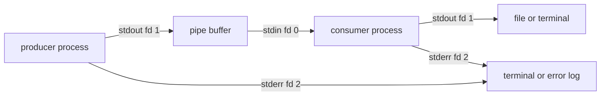

<TLDR>
  <TLDRCell label="what">
    管道把一条命令的标准输出连接到另一条命令的标准输入。重定向在命令运行前，把标准流接到文件或其他描述符。
  </TLDRCell>
  <TLDRCell label="when">
    用它们组合小型命令、保留机器可读数据、分离诊断，并让自动化流程看见失败。
  </TLDRCell>
  <TLDRCell label="how">
    引用操作数，让数据与诊断走不同的流，从左到右读取重定向，并定义哪些阶段的状态会让整条管道失败。
  </TLDRCell>
</TLDR>

## 是什么，为什么存在

命令行程序启动时通常有三个<Term id="standard-stream">标准流（standard stream）</Term>：标准输入、标准输出和标准错误。它们是由打开的文件描述符支持的约定，编号分别为`0`、`1`和`2`。程序可以从输入读取字节，把结果字节写入输出，再把诊断写入错误流，而不必知道端点是终端、文件还是另一个进程。

<Term id="pipeline">管道（pipeline）</Term>利用这种分离来组合程序。在`producer | consumer`中，Shell通过一条管道，把生产者的标准输出连接到消费者的标准输入。除非显式重定向，否则标准错误不会进入管道，因此解析器可以接收干净数据，用户或日志收集器仍能看到故障。

<Term id="redirection">重定向（redirection）</Term>可以改变端点，不必修改程序。`< input.txt`把文件作为标准输入，`> output.txt`用标准输出替换文件，`>> output.txt`追加内容，`2> errors.log`则把标准错误送往别处。`2>&1`这样的描述符复制操作，会让一个描述符引用另一个描述符当时使用的端点。

Shell提供组合机制，但不会凭空建立数据契约。生产者和消费者必须就字节、编码、记录边界和畸形输入达成一致。只有当逻辑记录不可能包含换行符，或者转义格式已经规定换行符的表示方式时，面向行的消费者才可靠。

交互式排查、构建脚本、发布任务、数据导入和服务入口中都会出现管道。同一套语法既可以用于临时查询，也可以构成生产控制流。生产场景需要明确的失败策略，因为最后一行结果看起来合理，并不能证明前面的每个阶段都已成功。

<Term id="exit-status">退出状态（exit status）</Term>独立于两个输出流。按照约定，`0`表示成功，非零值表示某种失败，具体含义由命令定义。可靠的自动化会同时保留状态和诊断流；重定向或解析输出不能替代其中任何一项。

## 工作原理

### 三个通道

Shell把命令启动为<Term id="process">进程（process）</Term>，并准备它们的描述符表。普通程序读取描述符`0`，写入描述符`1`和`2`；`stdin`、`stdout`、`stderr`等库名称封装了这些约定的描述符。程序通常不必知道每个描述符引用了哪种内核对象。

三个流承载不同种类的信息：

| 流 | 描述符 | 预期作用 | 默认终端行为 |
| --- | ---: | --- | --- |
| 标准输入 | `0` | 输入数据 | 从终端读取 |
| 标准输出 | `1` | 成功的结果数据 | 显示在终端上 |
| 标准错误 | `2` | 诊断与进度 | 显示在终端上 |

这些作用属于契约，不是权限限制。程序可以把诊断写进标准输出，但下游解析会因此变得脆弱。行为良好的过滤器只把转换后的数据写入标准输出，并在标准错误中解释被拒绝的输入。

### 管道设置与并发执行

对于两阶段管道，Shell会创建一条带读取端和写入端的管道。它让第一条命令的描述符`1`引用写入端，让第二条命令的描述符`0`引用读取端。随后，它启动两条命令，关闭不需要的管道端副本，再按自身的管道规则等待。



这些命令通常并发运行。有限的管道缓冲区装满时，生产者可能阻塞；管道为空但仍有写入方时，消费者也可能阻塞。这种自然的<Term id="backpressure">背压（backpressure）</Term>限制了管道中的字节量，但不会设置应用级超时，也不会限制任一程序自行分配的缓冲区。

管道传输的是字节，不是文件或业务记录。一次读取可能得到少于某次写入的字节，几次写入也可能被合并。许多文本工具会在字节流之上建立行抽象，但只有所选格式赋予行边界明确含义时，这层抽象才成立。

### 重定向是有序操作

Shell会在命令执行前，从左到右处理重定向。`>all.log 2>&1`先为标准输出打开`all.log`，再把该目标复制给标准错误。两个流最终都进入同一个文件。

看起来相似的`2>&1 >out.log`会产生不同结果。它先把标准输出当前的目标复制给标准错误，再只把标准输出移到`out.log`。如果第一步发生时标准输出指向终端或管道，标准错误会继续使用这个旧目标。

文件名展开和重定向设置由Shell完成。变量用作文件名时应写成`>"$report_path"`，让空格和通配符仍属于一个操作数。引用不会验证路径是否获得授权，也不能判断覆盖是否安全；范围与覆盖策略需要单独检查。

### 管道状态是一项策略选择

未启用`pipefail`时，Bash会报告管道最后一条命令的状态，使用`!`取反的情况除外。上游命令可能失败，而下游命令消费了部分输入后以`0`退出。整条管道看起来就像成功了一样。

启用`set -o pipefail`后，只有每个阶段都成功，管道状态才是零；否则，它取最右侧失败阶段的状态。Bash还通过`PIPESTATUS`数组暴露各阶段的值。管道之后应立即读取该数组，因为几乎任何后续命令都会替换它，赋值也不例外。

`set -e`不能代替管道契约。它的行为取决于语法上下文，而测试与搜索中经常会出现预期的非零状态。应确定每个边界允许哪些状态，捕获实际状态，并报告足够的上下文，以区分空结果与损坏的输入。

## 示例

这些示例使用GNU Bash 5.2.21和标准本地工具。每个示例都会创建自己的临时工作区，并在退出时删除，因此不依赖预先存在的文件。

### 分离结果与诊断

这个报告生成器会写出一条数据记录和一条警告。分别重定向两个通道，可以完整保留两者，同时避免警告污染数据文件。

<Depth level="quick">

```bash title="route_streams.sh"
#!/usr/bin/env bash
set -u

workspace=$(mktemp -d)
trap 'rm -rf "$workspace"' EXIT

emit_report() {
  printf '%s\n' 'order=104 state=ready'
  printf '%s\n' 'warning: cache is stale' >&2
}

emit_report >"$workspace/orders.log" 2>"$workspace/warnings.log"

printf 'stdout: '
cat "$workspace/orders.log"
printf 'stderr: '
cat "$workspace/warnings.log"
```

```text
stdout: order=104 state=ready
stderr: warning: cache is stale
```

</Depth>

`>`会在`emit_report`运行前打开每个目标，并截断已有文件。函数中的显式`>&2`只改变那一次`printf`调用。后面的命令继承脚本正常的终端流，因此两次`cat`调用会显示保存下来的两个通道。

只有当跨多次运行累积内容属于契约时，才应使用`>>`。追加能让日志跨调用保留，但同时也需要轮转机制、记录边界和并发写入策略。它不是比`>`更安全的写法。

### 过滤记录并保留拒绝详情

下一段脚本让有效结果行经过`sort`，同时把过滤器的诊断重定向到单独文件。畸形行不会成为`sort`的输入。

```bash title="filter_orders.sh"
#!/usr/bin/env bash
set -u
set -o pipefail
export LC_ALL=C

workspace=$(mktemp -d)
trap 'rm -rf "$workspace"' EXIT

printf '%s\n' \
  'id,total,state' \
  'O-101,19.50,paid' \
  'malformed-row' \
  'O-103,25.00,paid' \
  'O-104,42.00,pending' >"$workspace/orders.csv"

awk -F, '
  NR == 1 { next }
  NF != 3 { print "invalid row " NR > "/dev/stderr"; next }
  $3 == "paid" { printf "%s %.2f\n", $1, $2 }
' "$workspace/orders.csv" 2>"$workspace/warnings.log" |
  sort -k2,2nr >"$workspace/paid.txt"

printf '%s\n' 'paid orders:'
cat "$workspace/paid.txt"
printf 'diagnostic: '
cat "$workspace/warnings.log"
```

```text
paid orders:
O-103 25.00
O-101 19.50
diagnostic: invalid row 3
```

<TryToBreak items={['空输入文件', '带逗号的总额', '两个畸形行']} />

`2>"$workspace/warnings.log"`作用于`awk`，`>"$workspace/paid.txt"`则作用于`sort`。重定向绑定到相邻命令，不会自动覆盖整条管道。如果多条命令需要共享一个重定向通道，可以使用`{ command1; command2; } 2>errors.log`这样的命令组。

这个测试数据把格式称作CSV，但简单的`-F,`解析器并没有实现带引号的CSV字段。带引号值中的逗号仍会切分记录。输入契约允许引号、内嵌换行或转义分隔符时，应使用真正实现该格式的解析器，不要靠猜测扩展`awk`单行命令。

### 保留每个阶段的状态

这里的生产者先生成可用的部分数据，再返回状态`7`。`grep`会成功，因此Bash的默认管道行为会隐藏上游故障。脚本立即复制`PIPESTATUS`，并为展示目的计算出与`pipefail`相同的最右侧失败规则。

```bash title="check_pipeline.sh"
#!/usr/bin/env bash
set -u
set -o pipefail

workspace=$(mktemp -d)
trap 'rm -rf "$workspace"' EXIT

fetch_orders() {
  printf '%s\n' 'accepted: O-201' 'ignored: O-202'
  printf '%s\n' 'upstream: retry budget exhausted' >&2
  return 7
}

fetch_orders | grep '^accepted:' >"$workspace/accepted.txt"
stages=("${PIPESTATUS[@]}")

pipeline_status=0
for status in "${stages[@]}"; do
  if ((status != 0)); then
    pipeline_status=$status
  fi
done

printf 'pipeline=%d stages=%s\n' "$pipeline_status" "${stages[*]}"
cat "$workspace/accepted.txt"
```

```text
upstream: retry budget exhausted
pipeline=7 stages=7 0
accepted: O-201
```

诊断仍写到脚本的标准错误，已接受记录则经过管道进入文件。部分输出可用于诊断，但这个状态说明结果并不完整。调用方不应把`accepted.txt`作为完整快照发布。

复制`PIPESTATUS`是管道之后的第一条命令。如果脚本先执行`pipeline_status=$?`，该赋值会在复制之前更新`PIPESTATUS`。只关心聚合结果时，可以捕获`$?`；需要区分阶段时，应先捕获`PIPESTATUS`，再根据副本推导聚合值。

### 观察从左到右的重定向

最后一个脚本用两种重定向顺序运行同一个函数。第二次运行开始时，标准输出连接到管道，因此`2>&1`会先为标准错误保留这条管道，之后`>stdout.log`才把标准输出移走。

```bash title="redirection_order.sh"
#!/usr/bin/env bash
set -u

workspace=$(mktemp -d)
trap 'rm -rf "$workspace"' EXIT

emit_diagnostic() {
  printf '%s\n' 'result: 12 records'
  printf '%s\n' 'error: one source timed out' >&2
}

emit_diagnostic >"$workspace/combined.log" 2>&1
emit_diagnostic 2>&1 >"$workspace/stdout.log" |
  sed 's/^/pipe: /' >"$workspace/stderr.log"

printf '%s\n' 'combined:'
cat "$workspace/combined.log"
printf '%s\n' 'stdout only:'
cat "$workspace/stdout.log"
printf '%s\n' 'pipe capture:'
cat "$workspace/stderr.log"
```

```text
combined:
result: 12 records
error: one source timed out
stdout only:
result: 12 records
pipe capture:
pipe: error: one source timed out
```

第一次调用让描述符`1`和`2`引用同一个打开文件描述。第二次调用让描述符`2`引用已有管道，再单独改变描述符`1`。应把每个操作符理解为对描述符表的有序更新，不要把`2>&1`当作恒定表示“合并输出”的短语。

`&>`是Bash把标准输出与标准错误发送到同一目标的简写，但它不是可移植的POSIX Shell写法。脚本以`/bin/sh`为目标时，应使用`>file 2>&1`，并通过shebang实际指定的Shell测试。

## 陷阱

### 把诊断混入数据流

> [!PITFALL]
> `command 2>&1 | parser`会把诊断与结果数据一起送入解析器。一条外观接近记录的警告可能破坏计数、校验和、导入结果或生成的配置，却不一定产生语法错误。

**修复方法：** 默认让标准错误保持独立。可以把它重定向到专用日志，或者通过受控日志路径复制，同时让标准输出继续保持机器可读。测试管道时，使用一条既生成有效记录又生成诊断的命令。

### 只相信最后一条命令

> [!PITFALL]
> 按照Bash的默认行为，`download | unpack | verify`中的`download`可能已经失败，而`verify`接受部分输入或空输入后仍报告成功。有内容的输出文件同样不能证明生产者已经完整结束。

**修复方法：** 对于任何阶段失败都应视作失败的Bash脚本，启用`pipefail`并立即捕获状态。如果某些状态属于预期，应显式处理它们，不要添加会抹掉全部故障类别的`|| true`。

### 把重定向当作无序集合

> [!PITFALL]
> 交换`>file 2>&1`和`2>&1 >file`会改变标准错误的目标。生成的脚本经常在整理格式时重排这些词元，因为两个版本看起来都提到了相同描述符。

**修复方法：** 从左到右模拟描述符表，在每个操作符后写下当前目标。增加一条分别向描述符`1`与`2`写入不同标记的测试命令，再断言每个目标的内容。

### 把任意输出存进Shell变量

> [!PITFALL]
> 命令替换会删除末尾的换行符，Shell变量也无法保留NUL字节。之后若使用未引用展开，还会发生单词切分与文件名生成，把一个捕获值变成多个参数。

**修复方法：** 对精确数据或可能含二进制的数据使用文件或管道。对于契约明确的单一文本值，可以写`value=$(command)`，之后始终以`"$value"`展开，并独立于捕获字节检查命令状态。

### 把消费者提前退出当作普通成功

> [!PITFALL]
> `head`等消费者取得足够输入后，可能关闭读取端。生产者随后会收到<Term id="signal">`SIGPIPE`信号（signal）</Term>或`EPIPE`错误；即使提前终止原本就是查询目标，`pipefail`也可能暴露这个状态。

**修复方法：** 先确定截断是否属于契约，再据此检查状态。如果生产者支持限制输出，应优先在生产者一侧设置限制。不要因为一个已知生产者可能报告管道破裂，就静默处理整条管道。

<Depth level="deep">

## 文件描述符、管道生命周期与精确失败语义

### 描述符表与复制

<Term id="file-descriptor">文件描述符（file descriptor）</Term>是进程内的整数表项，它通过内核引用打开文件描述或其他I/O对象。描述符复制操作复制的是引用，不是字节。执行`2>&1`后，描述符`1`与`2`可以引用同一个底层打开目标，同时仍是进程表中的两个表项。

使用`>`打开文件时，文件不存在通常会被创建，已经存在则会被截断。`>>`以追加模式打开文件。这些操作发生在目标命令启动之前，因此即使`generate`无法执行，`generate >report`也可能擦除旧报告。

输入和输出使用同一路径时，这个时机会直接影响结果。`transform <data.txt >data.txt`在设置期间就会截断输出，早于`transform`读取输入。应写入单独文件，验证结果，再通过显式操作替换原文件；该操作的原子性与恢复行为还要符合文件系统环境。

Here-document和here-string也属于输入重定向。Here-document让Shell提供一段文本；是否引用结束标记，会决定Shell是否在内容中展开参数与替换。Here-string是Bash功能，会提供一个展开后的字符串和一个换行符，因此不适合末尾字节必须精确的场景。

### EOF取决于每个写入方关闭

只有引用管道写入端的每个描述符都关闭后，读取方才会看到文件结束（EOF）。明显的生产者可能已经退出，但另一个进程仍持有继承的写入描述符。此时内核认为仍可能有更多字节到达，所以读取方会继续等待。

Shell构建普通管道时，会关闭不需要的管道端。创建子进程或手动管理描述符的程序也必须这样做。泄漏的描述符可能让EOF永远不出现，把资源泄漏变成活性故障。

所有读取方关闭后，写入操作通常会触发`SIGPIPE`；如果该信号被忽略，写入会以`EPIPE`失败。这套机制告诉生产者，已经没有进程能够接收更多字节。它不能说明消费者已经成功完成，还是刚刚崩溃。

### 容量、缓冲与记录边界

管道容量有限，而且取决于实现。缓冲区没有剩余空间时，阻塞式生产者会等待，于是它的进度与消费者相互关联。不要把正确性建立在记忆中的容量值上；内核版本与每用户限制都可能改变它。

应用库可能在内核管道之上继续缓冲。程序连接终端时可能每行刷新一次，标准输出改接管道后却切换成块缓冲，进度看起来就像停住。应通过生产者的正式刷新或缓冲选项修复，不能假设Shell会保留终端下的时序。

在文档规定的阻塞模式条件下，POSIX为不超过`PIPE_BUF`的小型写入提供写入方之间的原子性保证。这能避免符合条件的写入发生字节交错，却不会把管道变成消息队列。更大的写入可能交错，读取方也仍然可以拆分或合并读取。

记录可能包含换行符时，应使用具有真正分帧规则的格式。NUL分隔的文件名协议很常见，因为Unix路径名可以包含空格和换行，却不能包含NUL。每个阶段都必须支持相同分隔符；插入一个面向行的工具，就会悄悄破坏整条链。

### 进程边界与Shell状态

管道阶段在不同执行环境中运行，Shell变量的变化通常不会回到父Shell。在Bash中，大多数阶段运行于子Shell进程；`lastpipe`选项可以在有限的作业控制条件下改变最后一个阶段。可移植脚本不应依赖管道末尾的循环在之后更新变量。

因此，这种看似自然的写法会在许多Shell中丢失状态：`producer | while read -r line; do count=$((count + 1)); done`。在Bash中，让循环从文件或进程替换读取，可以使循环留在当前Shell，但每种选择都会改变可移植性与错误处理。更清楚的设计通常是让计数阶段输出结果，再显式捕获该阶段。

命令组同时控制作用域与重定向。`{ list; } >file`在当前Shell中以一项重定向运行命令列表，`( list ) >file`则在子Shell环境中运行。大括号周围所需的空格与终止符属于Shell语法，不是代码风格。

### 状态时机与`set -e`

Shell只在`$?`中存放一个很小的状态值，每条前台管道或简单命令都会更新它。在保存状态之前记录日志、赋值或运行`[`，都会破坏原本要检查的证据。先捕获，再格式化报告。

`PIPESTATUS`是Bash专有数组，最近一条前台管道中的每条命令各占一个元素。它与`$?`一样短暂。辅助函数若在复制数组前先运行另一条命令，就无法恢复之前的阶段状态。

启用`pipefail`后，多个失败阶段会折叠为最右侧失败的状态。这个聚合值足以充当布尔门禁，却可能隐藏根因所在的阶段。当诊断或按状态恢复需要区分阶段时，应保留整个数组。

`set -e`在条件、命令列表、取反和其他上下文中存在例外。函数的行为也可能随调用位置变化。只能在经过测试、针对具体Shell的策略中使用它，而且仍要直接检查预期的故障边界；严格模式是一项配置，不是控制流正确性的证明。

### 捕获、观察与发布输出

`tee`会把标准输入复制到标准输出和一个或多个文件。需要让用户看到流并保留产物时，它很实用，但它本身会成为另一个带状态的管道阶段。没有`pipefail`时，成功的`tee`会隐藏失败的生产者。

用`2>&1`拼成的日志既不保留原始流身份，也不保证完整事件顺序。不同进程并发写入，库采用不同缓冲策略，调度也会影响哪些字节先到。如果身份与顺序都很重要，应使用带时间戳和序列信息的结构化记录，并定义明确的收集器协议。

命令替换适合一个小型文本值。它会删除捕获的标准输出末尾的所有换行符；除非另行重定向，标准错误继续写往原目标。替换操作的状态也只能保留到下一条命令，因此输出捕获与错误策略必须一起设计。

对于大型或需要精确保留的输出，应流式写入有界消费者或临时文件，不要把全部内容放进Shell变量。验证生产者，刷新并关闭文件，然后再发布。部分输出在故障后也需要保留时，临时文件还能提供检查点。

### 一套实用推理模型

可以分四轮审查一条管道：

1. 在每次重定向之后，为每个阶段映射描述符`0`、`1`和`2`。
2. 说明相邻阶段之间的字节格式、编码、分帧方式与最大可接受输入。
3. 为每个阶段枚举成功、预期非零状态、意外失败、提前关闭与超时。
4. 找出谁负责等待、谁关闭描述符、字节会在哪里缓冲，以及产物何时对其他进程可见。

这套模型把紧凑Shell语法放在一行中的多个问题拆开。描述符路由说明字节去向，格式契约说明字节含义，状态处理说明结果是否完整，生命周期规则则说明管道能否结束。

</Depth>

<Checkpoint id="foundations/pipes-and-redirection" />

## 延伸阅读

- [GNU Bash参考手册：重定向](https://www.gnu.org/software/bash/manual/html_node/Redirections.html)
- [GNU Bash参考手册：管道](https://www.gnu.org/software/bash/manual/html_node/Pipelines.html)
- [GNU Bash参考手册：退出状态](https://www.gnu.org/software/bash/manual/html_node/Exit-Status.html)
- [POSIX.1-2024：Shell命令语言](https://pubs.opengroup.org/onlinepubs/9799919799/utilities/V3_chap02.html)
- [Linux man-pages：`pipe(7)`](https://man7.org/linux/man-pages/man7/pipe.7.html)
