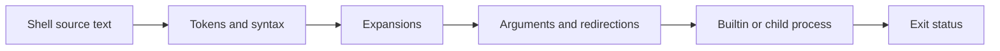

<TLDR>
  <TLDRCell label="what">
    A shell reads command language, expands it into arguments and redirections, starts programs, and reports their exit status.
  </TLDRCell>
  <TLDRCell label="when">
    Use it for navigation, inspection, repeatable local tasks, and small automation whose inputs and failure behavior you can define.
  </TLDRCell>
  <TLDRCell label="how">
    Quote expansions, pass arguments in arrays, inspect status immediately, validate paths, and use `--` before option-like operands.
  </TLDRCell>
</TLDR>

## What it is and why it exists

A shell is a command-language interpreter and a process-control tool. It turns text such as `git status` into a program name plus an <Term id="argument">argument</Term> list, arranges input and output, starts a <Term id="process">process</Term>, and makes the result available to the caller. An interactive terminal and a script file use the same language, though interactive features can differ.

This topic uses GNU Bash because it is installed locally and its behavior can be executed and checked. Many fundamentals also apply to POSIX shells, including quoting, parameter expansion, the current directory, and zero-versus-nonzero status. Bash-specific features in the examples, such as arrays, `[[ ... ]]`, and `pipefail`, are named explicitly rather than presented as portable `sh` syntax.

The shell exists to compose programs without embedding each one in another application. It lets you navigate a filesystem, connect commands, select files, set an execution environment, and branch on success. That convenience comes with a parsing boundary: the shell first interprets characters, then programs receive an argument array that no longer contains the original quote marks.

You meet this boundary in terminal commands, package scripts, build systems, continuous-integration jobs, containers, deployment hooks, and generated maintenance scripts. A command that looks plausible can still act on the wrong files if spaces split one value, a wildcard expands unexpectedly, or a leading hyphen becomes an option. Shell correctness therefore starts before the target program runs.

Shell is a good fit for short orchestration around existing programs. Once a script needs complex data structures, substantial parsing, concurrency, or a large domain model, a general-purpose language usually gives clearer types and error handling. The boundary is about maintainability and input risk, not a fixed line-count rule.

## How it works

### From text to a command

Bash does not pass a command line to a program as one unchanged string. It reads input, recognizes operators and words, parses compound syntax, performs expansions, applies redirections, and then executes a builtin, function, or external program. Each stage can change what the next stage sees.



Quotes guide the shell while it builds words; they are normally removed before execution. In `printf '%s\n' "team notes.txt"`, the program receives two arguments after `printf`: the format and one filename. It does not receive the literal double-quote characters.

Operators have meaning before ordinary arguments are formed. A semicolon ends one command, `&&` and `||` conditionally connect commands, `|` forms a pipeline, and `>` requests a redirection. Quoting an operator character can make it ordinary data, but adding quotes after a string has already been parsed cannot undo an unsafe construction.

### Current directory and paths

Every process has a current working directory used to resolve relative paths. `pwd` reports the shell's current location, `cd directory` changes it inside the current shell, `cd ..` moves to the parent path, and `cd -` returns to the previous directory in Bash. An absolute path begins at `/`; a relative path begins at the current directory.

`cd` must be a shell builtin because an external child process cannot change its parent's current directory. A script run as `bash script.sh` can change its own working directory without moving the caller's interactive shell. A sourced script runs inside the caller and can change that caller's directory, variables, and options, so sourcing creates a much wider contract.

`PWD` usually records the shell's logical path, which can preserve symbolic-link components. `pwd -P` asks for a physical path with symbolic links resolved where possible. Choose intentionally when identity matters; a displayed path string is not by itself proof that two references name different filesystem objects.

Use `--` when a command supports it and operands may begin with `-`. For example, `rm -- "$name"` ends option parsing before the filename. Quoting and `--` solve different problems: quoting preserves one argument, while `--` prevents that argument from being interpreted as an option.

### Variables and the environment

A shell assignment has no spaces around `=`: `region='eu west'`. The name is a shell variable, and `$region` or `${region}` performs parameter expansion. Braces mark the name boundary in text such as `${region}_backup` and support operators for defaults, required values, lengths, and substring processing.

Shell variables belong to the current shell unless exported. `export REGION=$region` marks `REGION` for inclusion in the environment inherited by later child processes. A child can change its own copy, but it cannot rewrite the parent's variable or environment after it has started.

Environment values are strings. Programs impose their own interpretation on values such as `PATH`, `LANG`, or `HTTP_PROXY`; the shell does not validate those contracts. Avoid putting secrets directly on command lines because process listings, logs, and histories can expose them, and remember that exported secrets flow to every descendant unless the environment is narrowed.

`$?` is a special parameter, not a durable variable. It expands to the status of the most recently completed foreground pipeline and is overwritten by the next command. If you need it, assign `status=$?` immediately or place the command directly in an `if` condition.

### Quoting rules

Single quotes preserve every character until the next single quote. Variables and command substitutions do not expand inside them, and a single quote cannot appear directly inside a single-quoted string. Use them for fixed text such as format strings and literal wildcard characters.

Double quotes preserve a value as part of one shell word while still allowing parameter expansion, arithmetic expansion, and <Term id="command-substitution">command substitution</Term>. In nearly all ordinary uses, `"$variable"` is the safe default. The important exceptions are places where you deliberately want the shell to produce several arguments and have chosen a structured mechanism for doing so.

An unquoted expansion can undergo <Term id="word-splitting">word splitting</Term> and <Term id="pathname-expansion">pathname expansion</Term>. Whitespace can turn one value into several arguments, then wildcard characters in those pieces can match directory entries. The two stages compound: a value that merely contains text can become a different-sized argument list based on the current directory.

Backslash protects one following character outside quotes, with context-dependent rules inside double quotes. It is useful for a small literal, but long backslash-heavy commands are hard to audit. Prefer single or double quotes that match the intended expansion behavior.

### Positional parameters and arrays

Scripts and functions receive positional parameters as `$1`, `$2`, and so on, with `$#` holding the count. Validate required arguments before use. `${1-}` supplies an empty fallback when strict unset-variable checking is active, while `${1:?message}` stops expansion with a message when a required value is unset or empty.

`"$@"` is the correct way to forward all positional parameters. Inside double quotes it expands each original parameter as a separate argument, preserving empty values and spaces. `"$*"` instead joins them into one word using the first character of `IFS`, and unquoted `$@` exposes them to further splitting and globbing.

Bash arrays preserve argument boundaries. Build a command as `command=(program --flag "$value")`, append with `command+=("$path")`, and execute it with `"${command[@]}"`. Do not flatten the array into a string and pass it through `eval`; that asks the shell to parse data as new source code.

Arrays also make optional arguments explicit. Add a flag only when its condition holds, then print the array with `printf '%q '` for diagnostics. `%q` produces a shell-reusable representation for Bash logging, but the displayed escaping is not the original input and should not be confused with program output.

### Expansion order

Bash performs several expansions in a defined sequence. Brace expansion happens first, then tilde expansion, parameter and variable expansion, arithmetic expansion, and command substitution; word splitting and pathname expansion follow where applicable, and quote removal happens last. The context can suppress stages, which is why memorizing a single slogan is not enough.

Parameter expansion inside double quotes does not undergo word splitting or pathname expansion. The right-hand side of an ordinary variable assignment also has special expansion rules and stays one assigned value. When an expanded value is later used as an unquoted command argument, however, the dangerous stages become active again.

Command substitution, written `$(command)`, captures standard output and removes trailing newline characters. It does not automatically preserve an array of output lines or filenames. Never parse arbitrary filenames with `for file in $(find ...)`; use a NUL-delimited interface or the tool's direct `-exec` support when filenames are the data.

Pathname expansion matches wildcard patterns such as `*`, `?`, and bracket expressions against directory entries. In default Bash, an unmatched pattern remains literal; options such as `nullglob` or `failglob` change that behavior. A script that relies on one policy should set it locally and test both matching and nonmatching cases.

### Commands, builtins, and processes

Bash can execute reserved syntax, aliases in interactive contexts, functions, builtins, and external programs. `type -a name` shows how a name resolves, while `command name` can bypass a same-named function in common cases. A script should not assume that an interactive alias will exist.

An external command normally runs in a child process with an argument vector, current directory, open file descriptors, and environment inherited from the shell. Shell builtins run inside the shell process because operations such as `cd`, `export`, and `read` need to modify shell state. Functions also run in the current shell unless placed in a subshell or pipeline context that creates another process environment.

The shell searches `PATH` for a command name that contains no slash. For privileged or security-sensitive automation, a controlled `PATH` and explicit program choices reduce ambiguity. Checking `command -v program` can produce a clearer startup error, but it does not freeze the filesystem against later replacement.

Use a subshell `( commands )` when directory or option changes should not escape a block. Braces `{ commands; }` group commands in the current shell, so assignments and `cd` remain afterward. The final semicolon before `}` is syntax, not decoration.

### Exit status and control flow

By convention, status `0` means success and a nonzero status means some form of failure or false result. The meaning of a particular nonzero value belongs to the command's documented interface. Bash commonly uses `126` when a located command cannot execute and `127` when it cannot find the command; signal termination is commonly represented as `128 + signal number`.

Use `if command; then ... else status=$?; ... fi` when both branches matter. This keeps the check next to the command and preserves the failure status at the beginning of the `else` branch. `command && next` is suitable when `next` should run only after success, while `command || recover` is suitable for an intentional recovery path.

Do not use `command || true` merely to silence a failure. It replaces the visible result with success and can let later destructive work proceed. If a failure is acceptable, name the expected statuses, record relevant context, and reject every other outcome.

A pipeline normally reports the last command's status. With Bash `set -o pipefail`, it reports the rightmost nonzero status if any command fails, or zero when all succeed. That policy is often better for data pipelines, but early consumer exit and `SIGPIPE` can make a producer fail intentionally, so pipeline semantics still need a per-script decision.

### Shell options and cleanup

`set -u` reports many expansions of unset variables, and `set -o pipefail` exposes failures hidden by the final pipeline command. `set -e` asks Bash to exit after some unhandled failures, but its exceptions depend on syntactic context such as tests, lists, and pipelines. The common `set -euo pipefail` header is a useful policy only when the script is designed and tested under those exact semantics.

Explicit control flow remains necessary around expected failures. Capture a status in an `if`, distinguish not-found from permission-denied when the command documents them, and print diagnostic context to standard error. A strict option cannot infer which failures are business-acceptable.

`trap` registers shell code for signals or pseudo-events such as `EXIT`. A common safe pattern creates a temporary directory with `mktemp -d`, stores its exact path, and removes that exact quoted path in an `EXIT` trap. Traps should be short, idempotent where practical, and careful not to overwrite the status they are meant to preserve.

Temporary paths and cleanup are security boundaries. Do not invent a predictable path in a shared directory, and do not run recursive deletion against an empty, unresolved, or overly broad variable. Resolve the exact target with read-only checks before mutation and keep deletions confined to resources the script created or was explicitly authorized to manage.

## Examples

The four examples use only temporary directories and local shell state. They were syntax-checked with `bash -n` and executed with GNU Bash 5.2.21; each output below is the captured output of the adjacent file.

### Navigate without losing filename boundaries

The first script creates a small project containing a directory, an option-looking name, and a name with a space. Every path expansion is quoted, and `--` separates options from operands where the command accepts it.

<Depth level="quick">

```bash title="workspace_report.sh"
#!/usr/bin/env bash
set -u

LC_ALL=C
workspace=$(mktemp -d)
trap 'rm -rf -- "$workspace"' EXIT

mkdir -p -- "$workspace/project/docs"
printf 'draft\n' > "$workspace/project/--draft.txt"
printf 'notes\n' > "$workspace/project/team notes.txt"

cd -- "$workspace/project"
printf 'directory=%s\n' "${PWD##*/}"
printf 'entries:\n'
for path in ./*; do
  printf '  %s\n' "${path#./}"
done

cd -- docs
printf 'parent=%s current=%s\n' "$(basename -- "$OLDPWD")" "${PWD##*/}"
```

```text
directory=project
entries:
  --draft.txt
  docs
  team notes.txt
parent=project current=docs
```

<TryToBreak items={['a project path containing spaces', 'an entry beginning with a hyphen', 'an empty directory with no glob matches']} />

</Depth>

`./*` expands to one word per matching entry, and quoting `"$path"` preserves each match as one later argument. The display removes only the known `./` prefix. For an empty directory, default Bash leaves `./*` unmatched and literal, so production code that permits emptiness should choose `nullglob`, `failglob`, or an explicit existence test.

The final line uses `OLDPWD`, which Bash updates after a successful `cd`. Its expansion remains one argument to `basename` even if the parent path contains spaces. The script does not print the randomized temporary prefix, keeping the observable output stable.

### Compare quoted and unquoted expansion

This script makes word splitting and pathname expansion visible without acting on external files. The same two variable values produce either two arguments or four, depending on quoting.

```bash title="quote_arguments.sh"
#!/usr/bin/env bash
set -u

LC_ALL=C
workspace=$(mktemp -d)
trap 'rm -rf -- "$workspace"' EXIT
cd -- "$workspace"
touch north.csv south.csv

show_args() {
  printf 'count=%d\n' "$#"
  printf '  <%s>\n' "$@"
}

label='Q1 report'
pattern='*.csv'

printf 'quoted:\n'
show_args "$label" "$pattern"
printf 'unquoted:\n'
show_args $label $pattern

command=(printf 'selected=<%s>\n')
command+=("$label")
"${command[@]}"
```

```text
quoted:
count=2
  <Q1 report>
  <*.csv>
unquoted:
count=4
  <Q1>
  <report>
  <north.csv>
  <south.csv>
selected=<Q1 report>
```

In the unquoted call, `$label` splits at the space and `$pattern` expands against the current directory. Neither transformation is performed by `show_args`; its `$#` and `"$@"` reveal the arguments Bash constructed before the function began.

The array stores the command and its data as distinct elements. Executing `"${command[@]}"` preserves that structure without a second parsing pass. This is the normal replacement for assembling a command string.

### Capture status before it changes

The service check returns three documented statuses. The loop captures failure inside `else`, then the script compares default pipeline status with Bash's `pipefail` policy.

```bash title="inspect_status.sh"
#!/usr/bin/env bash
set -u

check_service() {
  case $1 in
    api) return 0 ;;
    worker) return 3 ;;
    *) return 64 ;;
  esac
}

for service in api worker unknown; do
  if check_service "$service"; then
    status=0
  else
    status=$?
  fi
  printf '%s status=%d\n' "$service" "$status"
done

set +o pipefail
false | true
printf 'pipeline default=%d\n' "$?"

set -o pipefail
false | true
status=$?
printf 'pipeline pipefail=%d\n' "$status"
```

```text
api status=0
worker status=3
unknown status=64
pipeline default=0
pipeline pipefail=1
```

The first `printf` after each check would overwrite `$?`, so the failure branch saves it first. A real service function should document what `3` and `64` mean rather than treating all nonzero results as interchangeable.

`false | true` shows why pipeline policy matters. Default Bash reports the final `true`, while `pipefail` exposes the earlier `false`. The script stores that result before printing it, because the printing command creates a new status.

### Validate a name before removal

The cleanup function accepts one cache-entry name, rejects separators and unexpected characters, checks that the target is a regular file, and passes `--` before the operand. Its authority is limited to the temporary directory it created.

```bash title="safe_remove.sh"
#!/usr/bin/env bash
set -u

workspace=$(mktemp -d)
trap 'rm -rf -- "$workspace"' EXIT
printf 'old\n' > "$workspace/-stale.tmp"

remove_cache_entry() {
  local name=$1
  case $name in
    ''|*[!A-Za-z0-9._-]*) return 64 ;;
  esac

  local target=$workspace/$name
  [[ -f $target ]] || return 66
  rm -- "$target"
}

for name in -stale.tmp ../outside missing.tmp; do
  if remove_cache_entry "$name"; then
    printf '%s: removed\n' "$name"
  else
    status=$?
    printf '%s: refused status=%d\n' "$name" "$status"
  fi
done
```

```text
-stale.tmp: removed
../outside: refused status=64
missing.tmp: refused status=66
```

Validation operates on the small input language the task actually needs: a single entry name, not an arbitrary path. That makes traversal attempts invalid before concatenation. For a production tree operation, symlinks, races, mount boundaries, authorization, and recovery still require a stronger design.

The leading hyphen is accepted as filename data. The quoted full path would already contain a directory prefix, but `--` makes the option boundary explicit and survives later refactoring to a relative operand. The distinct statuses let the caller separate invalid input from a missing entry.

## Pitfalls

### Expanding data without quotes

> [!PITFALL]
> `for item in $items` and `command $path` do not preserve values as arguments. Whitespace, empty strings, `IFS`, and wildcard characters can change the argument count based on both input and directory contents.

**Fix:** keep lists in Bash arrays and expand values as `"$value"`, `"${items[@]}"`, or `"$@"`. Test spaces, tabs, empty values, literal `*`, and leading hyphens; do not repair the symptom by globally changing `IFS`.

### Re-parsing a command string

> [!PITFALL]
> Building `command="tool --name $name"` and executing it with `eval "$command"` treats data as shell source. Quotes or substitutions inside untrusted data gain syntax on the second parse, creating command injection and boundary bugs.

**Fix:** use an argument array and execute `"${command[@]}"`. If the requirement truly accepts a shell program, name that trust boundary, run it with restricted authority, and do not describe it as accepting an ordinary filename or label.

### Reading `$?` too late

> [!PITFALL]
> Logging, assigning through a command, or running `[` before saving `$?` replaces the status you meant to inspect. A pipeline can also look successful because its last command succeeded after an earlier command failed.

**Fix:** place the command directly in `if` or capture `status=$?` as the next simple command. Decide whether `pipefail` matches the pipeline contract, preserve standard error, and test each stage's failure rather than only the happy path.

### Treating `set -e` as exception handling

> [!PITFALL]
> `set -e` does not mean “exit after every nonzero status.” Bash suppresses or changes its effect in several testing and list contexts, and a later refactor can move the same command across one of those boundaries.

**Fix:** use strict options as a declared script policy, then write explicit `if` branches around expected failures and cleanup. Run tests for functions, command substitutions, pipelines, `&&` or `||` lists, and traps under the exact Bash version used in production.

### Trusting a quoted path without validating scope

> [!PITFALL]
> Quotes keep a path in one argument, but they do not prove the target is authorized, nonempty, below an intended root, or safe across symbolic links. `rm -rf -- "$target"` is still dangerous when `target` resolves too broadly.

**Fix:** accept the narrowest input shape, resolve and inspect exact targets before mutation, reject roots and out-of-scope paths, and keep a recovery plan. For destructive automation, show the matched set or offer a dry run before changing data.

## In the AI era

**What generated code gets wrong here**

Models often interpolate a user value into one command string, add `eval` when quoting fails, or write `for file in $(find ...)`, so spaces and metacharacters become syntax. They also generate `set -euo pipefail` as a ritual without testing its context-sensitive behavior, read `$?` after a logging command, or emit `rm -rf "$dir"/*` without proving what `dir` is. Another common failure is using `source` for a configuration file that was intended to contain data, which executes the file as shell code.

**Ask your AI to check**

- Trace source text through parameter expansion, word splitting, pathname expansion, quote removal, and the final argument vector for each external command.
- List every input that can influence a path, option, command name, environment value, or sourced file, then state its validation and authority boundary.
- Enumerate nonzero statuses for simple commands and pipelines, showing where each is captured, ignored, transformed, or returned.

**Review checklist**

- Test argument boundaries with spaces, empty strings, wildcards, newlines, and leading-hyphen names.
- Replace generated command strings with arrays and reject any unexplained `eval`, `bash -c`, or `source` boundary.
- Force each command and pipeline stage to fail, then verify status propagation, diagnostics, cleanup, and mutation scope.

**Prompt vocabulary**

Use the exact terms `argument vector`, `parameter expansion`, `double-quoted expansion`, `word splitting`, `pathname expansion`, `command substitution`, `option terminator`, `exit status`, `pipeline status`, `pipefail`, `subshell`, and `environment inheritance`. Ask for an expansion trace and a failure-status table; “make this shell command safe” does not identify the parsing or authority boundary.

<Depth level="deep">

## The parsing and process boundary

### Source characters are not arguments

A shell program has two distinct interfaces: source text enters the shell parser, then an argument vector enters each executed program. Security and correctness bugs appear when code treats those interfaces as interchangeable. A quote character in source can protect data, but a quote character stored inside a variable is usually just data because quote recognition happened earlier.

Suppose `name` contains the five characters `a`, space, `b`, `*`, and `c`. In `tool "$name"`, double quotes suppress splitting and globbing, so `tool` receives one data argument. In `tool $name`, splitting can first create `a` and `b*c`, after which the second word may expand to zero, one, or many directory matches depending on shell options and files.

This is why “add quotes around the variable value” is ambiguous advice. Quotes must appear in shell source around the expansion: `"$name"`. Storing literal quote marks inside `name` cannot retroactively group words, and passing the string to `eval` merely creates a second parser invocation with injection risk.

### Assignment and expansion contexts

The shell recognizes assignment words by grammar and command position. `name=value` sets a shell variable, while `name = value` attempts to execute a command named `name` with `=` and `value` as arguments. Before an external command, `MODE=check tool` supplies `MODE` only in that command's environment without permanently exporting the assignment in the surrounding shell.

Expansion behavior depends on context. Ordinary assignment values do not undergo word splitting and pathname expansion in Bash, so `name=$input` stores one value. Later writing `tool $name` leaves the assignment context and activates those stages; correctness must be checked where the value is consumed, not only where it entered the script.

Default and required-value operators encode input policy close to expansion. `${cache_dir:-/tmp/cache}` uses a fallback when the value is unset or empty, while `${cache_dir:?cache_dir is required}` stops when it is unset or empty. The colon changes how empty values are treated, which matters when empty means “current directory,” “disable the feature,” or “invalid.”

### Command substitution is text capture

`$(command)` waits for the command and substitutes its standard output after removing trailing newlines. Embedded newlines remain, but an unquoted substitution then exposes them to word splitting. The construct does not return the command's argument array, record boundaries, standard error, or a typed result.

When a command produces one small textual value, quote the substitution: `revision=$(git rev-parse --verify HEAD)` and later use `"$revision"`. Capture its status through the surrounding assignment or an `if`; do not run another command before examining failure. For filenames or arbitrary records, prefer NUL-delimited streams, `mapfile` with a stated delimiter, or direct tool-to-tool interfaces.

Nested command substitutions also hide execution cost and failure. A line with three substitutions starts three pieces of work before the outer command runs, and default pipeline or `errexit` rules may not propagate failures as a reader expects. Split important work into named steps when each result needs its own status and diagnostic context.

### `IFS`, splitting, and glob policy

For unquoted eligible expansions, Bash uses characters in `IFS` to divide text into fields. The default includes space, tab, and newline, with detailed rules for whitespace versus non-whitespace separators. Changing `IFS` globally can alter unrelated reads and expansions, so delimiter changes should be local and restored or scoped to one command.

Word splitting is not a record parser. Consecutive whitespace, empty fields, embedded newlines, and backslash conventions can lose information. Read structured data with a parser for that format; read arbitrary paths with a NUL delimiter because a Unix filename may contain every byte except NUL and `/` within one path component.

After splitting, pathname expansion interprets wildcard characters against filesystem state. Options change the unmatched case: default Bash retains the pattern, `nullglob` removes it, and `failglob` reports an error. `dotglob` changes whether a leading `*` can include hidden names, so cleanup code must never assume `*` means “every entry.”

Use a scoped array capture when globbing is the intended operation. Set the needed option in a subshell, assign `matches=(./*.log)`, verify the count and targets, then pass `"${matches[@]}"`. This makes “expand a pattern” an explicit operation rather than an accidental side effect of an unquoted variable.

### Status belongs to an execution unit

Every simple command produces a status, including assignments, functions, builtins, and external commands. Lists and compound commands derive a status from their constituent commands according to shell grammar. An `if` condition expects commands, not a separate Boolean type, so success status directly controls the branch.

The status of `! command` is logically inverted. The status of `left && right` is `left` when `left` fails and otherwise comes from `right`; for `left || right`, it is `left` when `left` succeeds and otherwise comes from `right`. These rules are useful for control flow but can hide the original failing operation when dense chains mix work and recovery.

For a Bash pipeline, `PIPESTATUS` is an array holding the status of each stage from the most recent foreground pipeline. Like `$?`, it is volatile: even a diagnostic command changes the current status context. Copy the values immediately when detailed stage attribution matters.

Background commands add another lifetime boundary. Starting `command &` reports whether the job was started, not whether its eventual work succeeded. Save `$!`, call `wait "$pid"`, and handle that wait status; otherwise a script can exit successfully while abandoned background work fails later.

### `errexit` is grammar-sensitive

Bash's `errexit` option has documented exceptions for commands used as tests, nonfinal pipeline elements without `pipefail`, parts of `&&` and `||` lists, and other grammar contexts. Functions and command substitutions introduce further surprises because caller context and option inheritance affect behavior. It is a control-flow feature, not a substitute for a result model.

A reliable strict-mode script keeps expected nonzero results inside explicit conditions. It tests failure paths at the boundary where a function, pipeline, or substitution is used and does not assume an isolated unit test predicts every caller context. If a reusable function requires particular shell options, document and assert that contract or contain the function in a script that owns the options.

Cleanup must preserve the status that caused exit. An `EXIT` trap can begin with `status=$?`, perform bounded cleanup, and finish with `exit "$status"` when preserving the result is required. Cleanup commands can fail too, so decide whether to report them without masking the primary failure or whether cleanup failure must become the final status.

### Environment and authority

The environment crosses a process boundary but carries no provenance. A script may inherit `PATH`, locale settings, proxy variables, credential helpers, and tool-specific configuration from a terminal, CI runner, or service manager. Reproducible automation sets or clears the values that affect its contract and records the remaining assumptions.

Locale can change sorting, character classes, decimal formatting, and diagnostic language. The examples use `LC_ALL=C` only where deterministic glob ordering matters. A production script should not override user-facing locale globally unless bytewise behavior is truly part of its interface.

Command lookup is also an authority decision. An attacker-controlled working directory or `PATH` can select an unintended executable, while inherited functions and startup files can modify interactive behavior. Run automation in a known shell mode, use a controlled environment, and prefer least privilege over trying to quote away an authorization problem.

Sourcing a file is equivalent to executing it in the current shell. It can run commands, alter traps and options, replace functions, change directories, and exit the caller. If a configuration format is meant to hold data, parse a data format with a narrow schema instead of sourcing arbitrary assignments.

### Safer mutation boundaries

Before a mutating command, determine the exact operand list without mutation. Validate business identifiers before turning them into paths, reject empty or broad targets, decide how symbolic links and mount points should behave, and record who authorized the operation. Quoting begins this process but does not complete it.

Use `--` before operands wherever the command supports it, even when validation currently rejects leading hyphens. That keeps the argument contract robust when input policy changes. Do not assume every command supports `--`; confirm the specific interface and use an unambiguous path form such as `./-name` when required.

For repeated or high-impact changes, prefer staging and atomic replacement over in-place mutation. Provide a dry-run that uses the same selection logic, but treat its output as evidence rather than a guarantee against races. Backups, versioned directories, and rollback pointers solve recovery problems that shell quoting cannot.

The final review artifact should show three things: the exact argument vector conceptually passed to each command, the status policy for every failure, and the authority boundary for every mutation. If any of those remains implicit, plausible-looking shell code is not yet ready to run unattended.

</Depth>

<Checkpoint id="foundations/shell-basics" />

## Further reading

- [Bash Reference Manual: Shell Operation](https://www.gnu.org/software/bash/manual/html_node/Shell-Operation.html)
- [Bash Reference Manual: Quoting](https://www.gnu.org/software/bash/manual/html_node/Quoting.html)
- [Bash Reference Manual: Shell Parameter Expansion](https://www.gnu.org/software/bash/manual/html_node/Shell-Parameter-Expansion.html)
- [Bash Reference Manual: Exit Status](https://www.gnu.org/software/bash/manual/html_node/Exit-Status.html)
- [POSIX Shell Command Language](https://pubs.opengroup.org/onlinepubs/9799919799/utilities/V3_chap02.html)
