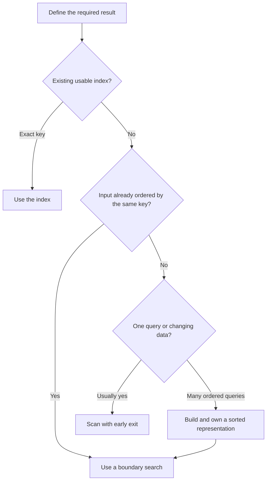

<TLDR>
  <TLDRCell label="what">
    Searching selects data; sorting establishes an order. Choose between a scan, an index, and a sorted representation from the data's current shape and the operations that follow.
  </TLDRCell>
  <TLDRCell label="trap">
    Binary search is correct only under the same ordering contract that produced the data. Duplicates, mutation, and an inconsistent comparator can silently break that contract.
  </TLDRCell>
  <TLDRCell label="fix">
    Define the key, direction, tie policy, mutation policy, and query workload first. Then test boundaries, duplicate keys, absent targets, and whether the original input must remain unchanged.
  </TLDRCell>
</TLDR>

## What it is and why it exists

Searching finds an element, a position, or a range that satisfies a condition. Sorting rearranges elements according to an ordering relation. They are paired because an up-front sort can make later searches predictable and logarithmic, while a one-off search often needs no sort at all.

You meet these operations whenever a product list is ranked, a request is found by identifier, a time window is sliced from events, or two records must be presented in a repeatable order. Library calls make the syntax small, but they do not choose the business key, resolve ties, or prove that the input satisfies a search algorithm's precondition.

The first choice is not “which named algorithm is fastest?” It is “what shape is the data in, and what will happen to it next?” An unsorted array, a stream, a hash index, and a sorted array expose different operations even when they contain the same logical records.

A linear scan works on almost any iterable and can stop as soon as it finds a match. Sorting requires collecting and comparing elements, but it creates an ordered representation that supports binary search, ordered output, grouping, and range boundaries. A hash map can beat both for repeated exact-key lookup, but it does not automatically provide ordered traversal or range queries.

The workload matters as much as input size. Sorting ten thousand records for one lookup adds work that a scan avoids. Sorting once for thousands of lookups can be a sensible trade, provided the sorted representation remains valid while those queries run.

Correctness also depends on the requested result. “Find price 1,250” might mean any matching product, the first matching position, the last matching position, or the half-open range containing every match. Those are different contracts, especially when keys repeat.

Sorting has a similar ambiguity. “Sort by priority” does not say whether lower numbers come first, how equal priorities are ordered, whether equal records retain input order, or whether the original collection may be mutated. An implementation cannot recover those decisions from the verb “sort.”

This topic uses arrays because random access makes the contrast clear. The principles carry to database indexes, search service postings, ordered files, and tree-based collections, but their storage and update costs differ.

## How it works

### Start from the data shape

An array gives constant-time indexed access, which binary search needs to inspect a middle element cheaply. A linked list can be ordered, but repeatedly walking to the middle removes the usual benefit of binary search. A stream may support only one forward pass, making a scan or an incremental selection algorithm the natural choice.

Data shape also includes ownership and freshness. A sorted snapshot is useful only while callers know which mutations it reflects. If records change after the snapshot is built, searching the old order can return a plausible but wrong boundary.

Separate the source from the representation built for a task. One array might preserve arrival order for audit purposes, while another array holds references sorted by price for range lookup. The representations can share record objects without sharing their sequence order.

### Linear search needs no order

Linear search examines candidates in encounter order until the predicate succeeds or the input ends. For `n` elements it performs at most `n` predicate checks, so its worst-case time is `O(n)`. Its extra space can remain `O(1)` when it returns one element or position.

Early exit is part of the contract. A search for the first matching event should stop at the first match; filtering the entire input produces all matches and necessarily visits the rest. If the predicate is expensive or the source is lazy, confusing those operations has a visible cost.

A scan is not a fallback to apologize for. It is often the correct algorithm for small inputs, one query, freshly changing data, or conditions that do not follow an existing order. Its precondition is weak: the program only needs a way to visit each candidate.

### A comparator defines the order

A <Term id="comparator">comparator</Term> maps a pair of elements to a negative number, zero, or a positive number. The sign means “left before right,” “equal for ordering,” or “left after right.” The magnitude normally has no meaning.

A usable comparator must be consistent. Comparing an element with itself yields equality; reversing a pair reverses the sign; and if `a` comes before `b` and `b` before `c`, then `a` must come before `c`. Violating these properties leaves a sorting routine without one coherent order to produce.

Comparator equality is not necessarily object equality. Two orders can compare equal because they share priority and total even though their identifiers differ. A <Term id="stable-sort">stable sort</Term> retains their relative input order, which is valuable when that earlier order carries meaning.

Stability does not invent a missing tie-breaker. If records arrive from a source with no guaranteed order, preserving that arbitrary order does not make pagination repeatable. Add a final unique key such as an identifier when the business contract needs one total, reproducible order.

### Sorting changes the available operations

Comparison sorting generally takes `O(n log n)` comparisons in the typical general-purpose case. It may allocate extra storage or mutate the input, depending on the algorithm and API. Those two behaviors are separate from how the comparator orders values.

After sorting, adjacent values can be grouped and boundary searches can isolate ranges. The up-front cost is useful when several later operations exploit the same order. If every update forces a full re-sort, include those updates in the workload calculation rather than considering query cost alone.

Maintaining a sorted array incrementally has mixed costs. Binary search can locate an insertion position in `O(log n)`, but opening a slot may shift `O(n)` elements. Over a sequence of operations, reason about the total and the <Term id="amortized-complexity">amortized complexity</Term>, not just the cheapest step.

### Binary search preserves a boundary

Binary search does not merely “look in the middle.” It maintains an interval in which the answer is known to lie, inspects one middle element, and discards the half that cannot contain the answer. Each iteration must make the interval strictly smaller.

A lower-bound search returns the first position whose key is greater than or equal to the target. Using a half-open interval `[low, high)` makes empty inputs and insertion after the last element natural: both endpoints may equal the array length.

For a lower bound, positions before `low` are known to have keys less than the target. Positions at or after `high` are known to have keys greater than or equal to it. The loop ends when `low === high`; that position is the boundary, even when no element equals the target.

An upper bound changes the equality rule and returns the first position whose key is greater than the target. The range of elements equal to a target is then `[lowerBound, upperBound)`. The same two-boundary pattern handles numeric intervals without scanning over every unrelated record.

Binary search requires the array and its key extractor to agree with the order used for sorting. Sorting case-insensitively and searching with case-sensitive comparisons breaks the invariant. So does sorting ascending and moving the wrong endpoint as though the order were descending.



The diagram is a decision aid, not a universal priority list. A measured workload can justify another representation, and memory limits can rule one out. The important point is to make the preconditions and ownership explicit.

### Choose by operation mix

| Need | Suitable starting point | Important cost or condition |
| --- | --- | --- |
| One match in unsorted data | Linear search | Up to `n` checks; can stop early |
| All matches in unsorted data | Filter or collect during a scan | Visits the whole input |
| Many exact-key lookups | Hash index | Extra storage; no inherent range order |
| Many range queries | Sorted array plus boundary search | Build and freshness costs |
| Frequent ordered insertions | Balanced search tree or specialized index | More structure and pointer/storage overhead |

The table names starting points rather than automatic answers. Input size, locality, comparison cost, memory, update frequency, and the required output order can change the decision. Measure the complete operation mix after correctness is established.

### Keep the result contract visible

Name search functions after the boundary or selection they return. `lowerBound()`, `firstOpenTicketForTeam()`, and `productsInPriceRange()` reveal more than `find()` because callers can see which promise to test.

Keep units in the names or types as well. A range over integer cents, a timestamp in milliseconds, and a locale-collated label need different comparison policies even though all can occupy array slots.

When a representation has preconditions, place them next to its construction and tests. A comment at one distant call site cannot protect every later binary search from stale or differently ordered data.

## Examples

The examples build from one scan to stable multi-key sorting and then a range lookup over a sorted snapshot. Each file was run with Node 24.14.0, and the adjacent output is the exact process output.

### Stop after the first useful match

The ticket list is in arrival order, not team order. One team lookup does not justify sorting the collection, and returning `undefined` gives the caller an explicit absent case.

<Depth level="quick">

```js run title="find_ticket.js"
const tickets = [
  { id: "INC-104", team: "payments", openedAt: "2026-09-04T09:12:00Z", open: true },
  { id: "INC-101", team: "search", openedAt: "2026-09-04T08:05:00Z", open: true },
  { id: "INC-099", team: "payments", openedAt: "2026-09-04T07:40:00Z", open: false },
  { id: "INC-108", team: "payments", openedAt: "2026-09-04T09:30:00Z", open: true },
];

function firstOpenTicketForTeam(items, team) {
  for (const ticket of items) {
    if (ticket.open && ticket.team === team) {
      return ticket;
    }
  }
  return undefined;
}

const ticket = firstOpenTicketForTeam(tickets, "payments");

console.log(ticket?.id ?? "none");
console.log(firstOpenTicketForTeam(tickets, "identity")?.id ?? "none");
```

```text
INC-104
none
```

<TryToBreak items={['an empty ticket list', 'two open tickets for the same team', 'a team with only closed tickets']} />

</Depth>

The function returns `INC-104` because “first” refers to input order. It does not claim to return the oldest timestamp or the smallest identifier. If the domain needs either of those meanings, the predicate alone is insufficient and the contract must name the selection rule.

The missing team traverses the entire array and returns `undefined`. If this lookup happens repeatedly over a stable collection, a map from team to the desired ticket may be worth building. That changes update and memory costs, so it is a representation decision rather than a local loop rewrite.

### Rank without mutating arrival order

The next example ranks orders by ascending priority number, then descending total. `toSorted()` creates a new array, so the original arrival sequence remains available for audit output.

```js run title="rank_orders.js"
const orders = [
  { id: "A-17", priority: 2, total: 80 },
  { id: "B-04", priority: 1, total: 120 },
  { id: "C-31", priority: 2, total: 50 },
  { id: "D-09", priority: 1, total: 120 },
];

function compareOrders(left, right) {
  const byPriority = left.priority - right.priority;
  if (byPriority !== 0) return byPriority;

  return right.total - left.total;
}

const ranked = orders.toSorted(compareOrders);

console.log(ranked.map((order) => order.id).join(", "));
console.log(orders.map((order) => order.id).join(", "));
console.log(ranked[0].id === "B-04" && ranked[1].id === "D-09");
```

```text
B-04, D-09, A-17, C-31
A-17, B-04, C-31, D-09
true
```

`B-04` and `D-09` compare equal on both declared keys. Node 24 follows JavaScript's stable sorting requirement, so they keep their input order. That guarantee is enough only because arrival order is meaningful in this example.

The second output confirms that `orders` was not rearranged. The objects themselves are still shared references: `toSorted()` copies the sequence, not every record. Mutating `ranked[0].total` would also change the object observed through `orders`.

### Find a half-open price range

The final example creates a deterministic price index with SKU as a tie-breaker. One lower-bound function then finds both endpoints of `[minimum, maximum)`, so the upper price is deliberately excluded.

```js run title="price_range.js"
const products = [
  { sku: "P-40", cents: 1250 },
  { sku: "P-12", cents: 750 },
  { sku: "P-31", cents: 1250 },
  { sku: "P-08", cents: 500 },
  { sku: "P-22", cents: 900 },
];

const byPrice = products.toSorted(
  (left, right) => left.cents - right.cents || left.sku.localeCompare(right.sku),
);

function lowerBound(items, target, keyOf) {
  let low = 0;
  let high = items.length;

  while (low < high) {
    const middle = low + Math.floor((high - low) / 2);
    if (keyOf(items[middle]) < target) low = middle + 1;
    else high = middle;
  }

  return low;
}

function productsInPriceRange(items, minimum, maximum) {
  const start = lowerBound(items, minimum, (product) => product.cents);
  const end = lowerBound(items, maximum, (product) => product.cents);
  return items.slice(start, end);
}

console.log(byPrice.map((product) => `${product.sku}:${product.cents}`).join(", "));
console.log(productsInPriceRange(byPrice, 750, 1250).map((product) => product.sku));
console.log(productsInPriceRange(byPrice, 1250, 1300).map((product) => product.sku));
```

```text
P-08:500, P-12:750, P-22:900, P-31:1250, P-40:1250
[ 'P-12', 'P-22' ]
[ 'P-31', 'P-40' ]
```

The first query includes prices 750 and 900 but excludes 1,250. The second query includes both products at 1,250, which shows that a boundary search handles duplicates without guessing which equal element an arbitrary exact-match search might return.

When `minimum === maximum`, both boundaries are identical and `slice()` returns an empty array. When the interval lies above every product, both boundaries equal `items.length`. Neither case needs a special branch because the half-open contract already defines it.

## Pitfalls

### Using a Boolean comparator

> [!PITFALL]
> Generated and handwritten code often uses `(a, b) => a.price > b.price`. That returns only `false` or `true`, which become `0` or `1`; it never reports that `a` belongs before `b`, so the comparator contract is broken.

**Fix:** return a negative, zero, or positive number and test the comparator in both argument orders. For multiple keys, compare one key at a time and continue only when the result is zero.

### Forgetting the default ordering

> [!PITFALL]
> JavaScript's default array sort compares string forms. The numeric array `[2, 11, 3]` therefore becomes `[11, 2, 3]`, which is valid lexicographic order but usually the wrong numeric order.

**Fix:** supply an explicit comparator such as `(a, b) => a - b` for finite numbers. Decide separately how domain values such as `NaN`, missing fields, and locale-sensitive strings are ordered.

### Searching under a different order

> [!PITFALL]
> A binary search can look reasonable and still be wrong when its comparison differs from the sort. Case folding, locale collation, ascending versus descending direction, null placement, and key normalization all belong to the same contract.

**Fix:** centralize the key and comparison policy, or expose a sorted-index abstraction that owns both construction and lookup. Test a target around every boundary where normalization or special values change behavior.

### Treating any duplicate as the answer

> [!PITFALL]
> A textbook exact-match binary search may return whichever equal element it encounters first. That is not necessarily the first, last, newest, cheapest, or only matching record.

**Fix:** ask for a lower bound, upper bound, or equal range by name. Define interval endpoints as inclusive or exclusive, then test repeated keys at the beginning, middle, and end of the collection.

### Mutating a shared collection by sorting

> [!PITFALL]
> JavaScript's `sort()` rearranges the array it is called on. A view that sorts a shared array can silently change arrival order for audit logs, caches, or another component.

**Fix:** make ownership explicit and use `toSorted()` when the source order must survive. Remember that the new array is shallow; copy records too only when independent record mutation is part of the contract.

### Paying for an index that is always stale

> [!PITFALL]
> Sorting before every lookup can cost more than scanning, while sorting once and ignoring later updates makes results incorrect. Quoting only the `O(log n)` search cost hides both failure modes.

**Fix:** count builds, queries, inserts, deletes, and invalidations together. Give the derived order an owner and a refresh rule, then benchmark the complete workload with representative comparison costs and data sizes.

<Depth level="deep">

## Ordering contracts and boundary proofs

### Strict weak order versus total order

Many sorting APIs need a consistent ordering but allow distinct records to compare equal. That creates equivalence classes: all priority-1 orders may be equivalent until another key is considered. A stable algorithm preserves the earlier sequence within such a class.

A total order distinguishes every pair except values considered identical by the domain. Adding a unique identifier as the final tie-breaker commonly creates one, but only if identifier comparison is itself consistent. A total order is useful for deterministic pagination, merge operations, and reproducible output.

Do not add a random or current-time tie-breaker. The comparator may be called several times for the same pair, and changing its answer invalidates the sorting assumptions. Compute any ranking data before sorting and keep it fixed for the operation.

Locale-aware string comparison needs the same discipline. Construct one collation policy with its locale and options, then use it for both ordering and compatible boundary searches. A database, runtime, and client can apply different collation rules even when all display the same text.

### Lower-bound invariant

Consider a sorted key sequence and target `t`. The lower-bound loop starts with `[low, high) = [0, n)`. It preserves two facts:

1. Every index strictly below `low` has a key less than `t`.
2. Every index at or above `high` has a key greater than or equal to `t`.

At each step, `middle` lies inside the non-empty interval. If its key is less than `t`, every position through `middle` can be rejected, so `low = middle + 1` preserves the first fact. Otherwise `middle` might be the answer, so `high = middle` preserves the second fact without discarding it.

Both assignments shorten the interval. Because its length is a non-negative integer, the loop must terminate. At termination `low === high`; the two facts meet at exactly the first position whose key is not less than `t`.

This proof explains details that can otherwise look ceremonial. Using `high = middle - 1` with the same half-open invariant would discard a possible answer. Using `low = middle` in the less-than branch can leave a one-element interval unchanged and make the loop run forever.

The number of remaining candidates is at most halved on each iteration. After `k` iterations it is at most `n / 2^k`, so no more than `ceil(log2(n + 1))` iterations are needed to reduce any initial interval to empty. This bound counts key inspections; an expensive key extractor can still dominate elapsed time.

### Duplicate ranges from two boundaries

Lower bound partitions keys into “less than target” and “not less than target.” Upper bound partitions them into “not greater than target” and “greater than target.” Combining the boundaries yields every equal key in one half-open slice.

For application ranges, two lower bounds are often enough. The example asks for prices in `[minimum, maximum)`, so it searches for the first key at least `minimum` and the first key at least `maximum`. Changing the upper endpoint to inclusive would require an upper bound for `maximum` instead.

Half-open ranges compose cleanly. Adjacent ranges `[a, b)` and `[b, c)` neither overlap nor leave a gap, and their lengths are endpoint differences. This is why array slicing and many iterator APIs use the same convention.

### Representation lifecycle

A sorted snapshot has a construction moment and a freshness policy. Immutable source data makes the policy simple: the snapshot stays valid. Mutable sources need eager updates, version checks, invalidation, or reconstruction.

Inserting into a sorted array illustrates why a fast search is not a fast update. Lower bound locates the slot with logarithmically many inspections, but the array may shift every later element. A balanced tree, B-tree, skip list, or database index chooses different storage to change that tradeoff.

An exact-key hash index makes another trade. It can provide expected constant-time lookup, but range order must be stored separately. Maintaining both a map and a sorted representation can be correct when the workload needs both, provided one owner updates them atomically or rebuilds them from a shared source version.

The smallest correct representation is usually easiest to own. Begin with the scan when it meets the workload, record evidence when it does not, and introduce an index with explicit invariants rather than scattering caches and local sorts through call sites.

### Tests derived from the contract

Example-based tests should cover every stated boundary. For a lower bound, include an empty array, one element below and above the target, a target before the first key, a target after the last key, and duplicates that touch each end.

Property-based tests can state broader facts. The returned index is between zero and the array length; every earlier key is less than the target; every later key is greater than or equal to it. Those properties test the contract without duplicating the implementation loop.

Comparator tests can generate triples `a`, `b`, and `c`. Check self-comparison, sign reversal, and transitivity, then confirm that the produced sequence never decreases under the comparator. Add domain cases for missing values, normalization, and ties.

Mutation tests should keep a reference to the source sequence and compare it after sorting. Freshness tests should modify the source after building an index and assert the documented behavior: eager update, rejected stale version, rebuild, or immutable source. “It happened to find the new record” is not a freshness contract.

</Depth>

<Checkpoint id="foundations/sorting-and-searching" />

## Further reading

- [ECMAScript specification: `Array.prototype.sort`](https://tc39.es/ecma262/multipage/indexed-collections.html#sec-array.prototype.sort)
- [MDN: `Array.prototype.sort()`](https://developer.mozilla.org/en-US/docs/Web/JavaScript/Reference/Global_Objects/Array/sort)
- [MDN: `Array.prototype.toSorted()`](https://developer.mozilla.org/en-US/docs/Web/JavaScript/Reference/Global_Objects/Array/toSorted)
- [Algorithms, 4th edition: analysis of algorithms](https://algs4.cs.princeton.edu/11model/)
- [Algorithms, 4th edition: quicksort](https://algs4.cs.princeton.edu/23quicksort/)
