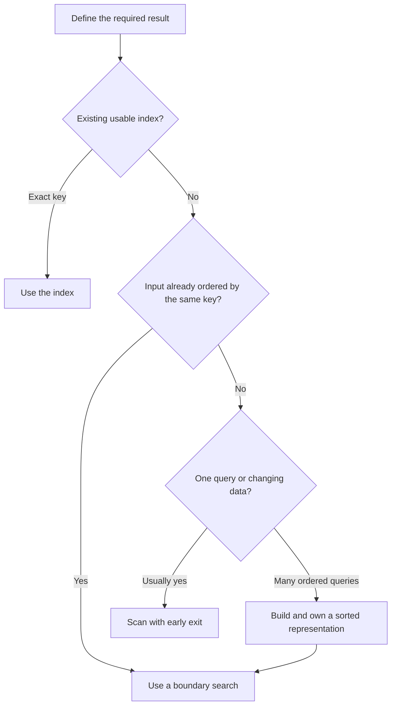

<TLDR>
  <TLDRCell label="what">
    查找（searching）从数据中选出结果，排序（sorting）建立顺序。应根据数据当前的形态和后续操作，在扫描、索引和有序表示之间选择。
  </TLDRCell>
  <TLDRCell label="trap">
    只有数据与二分查找采用同一套顺序契约时，查找结果才正确。重复键、数据变更或不一致的比较函数，都可能悄悄破坏这份契约。
  </TLDRCell>
  <TLDRCell label="fix">
    先定义键、方向、同值处理、修改策略和查询负载，再测试边界、重复键、目标缺失，以及是否必须保留原始输入。
  </TLDRCell>
</TLDR>

## 是什么，为什么存在

查找会找到满足条件的元素、位置或范围。排序则按一种顺序关系重新排列元素。两者经常配合使用：预先排序可让后续查找具有可预测的对数复杂度，而一次性查找往往根本不需要排序。

商品列表排名、按标识查找请求、从事件中截取时间窗口，以及稳定呈现两条记录时，都会用到这些操作。库函数让语法变得简短，却不会替你选择业务键、处理相同键，也不能证明输入满足查找算法的前置条件。

首先要问的不是“哪个知名算法最快”，而是“数据是什么形态，接下来要对它做什么”。无序数组、数据流、哈希索引和有序数组即使保存相同的逻辑记录，也会提供不同的操作。

线性扫描几乎适用于所有可迭代对象，并且找到匹配项后就能停止。排序需要先收集并比较元素，但会建立一种有序表示，从而支持二分查找、有序输出、分组和范围边界。哈希表更适合反复进行精确键查找，却不会自动提供有序遍历或范围查询。

输入规模和负载同样重要。为了查找一次而排序一万条记录，会增加一次扫描本可避免的工作。如果排序一次后要查找数千次，这项交换就可能合理，前提是查询期间有序表示一直有效。

正确性还取决于具体要什么结果。“查找价格为1,250的商品”可能是返回任一匹配商品、第一处匹配位置、最后一处匹配位置，或包含全部匹配项的半开范围。这些是不同契约，键重复时尤其如此。

排序也存在类似歧义。“按优先级排序”没有说明数字较小的是否靠前、同优先级如何排列、比较结果相等的记录是否保留输入顺序，也没有说明能否修改原集合。实现无法从“排序”这个动词中还原这些决策。

这里用数组说明问题，因为随机访问能清楚表现算法差异。同样的原则也适用于数据库索引、搜索服务的倒排列表、有序文件和基于树的集合，但它们的存储与更新成本不同。

## 工作原理

### 先看数据形态

数组支持常数时间的索引访问，二分查找因此可以低成本检查中间元素。链表也能保持有序，但反复遍历到中间位置，会消除二分查找通常具有的优势。数据流可能只支持向前读取一次，此时扫描或增量选择算法更自然。

数据形态还包括所有权与新鲜度。有序快照只有在调用方知道它反映了哪些修改时才有用。快照建立后若记录发生变化，在旧顺序中查找可能返回看似合理但实际错误的边界。

应把数据源和为特定任务建立的表示分开。一个数组可以为审计保留到达顺序，另一个数组则保存按价格排序的引用以供范围查找。两种表示可以共享记录对象，而不共享排列顺序。

### 线性查找不要求有序

线性查找按遇到顺序检查候选项，直到谓词成立或输入结束。对于`n`个元素，它最多执行`n`次谓词检查，因此最坏时间复杂度为`O(n)`。只返回一个元素或位置时，额外空间可以保持为`O(1)`。

提前停止属于操作契约。查找第一条匹配事件时，应在首次匹配后停止；过滤整个输入会产出所有匹配项，必然继续访问余下元素。如果谓词计算成本很高或数据源是惰性的，混淆两种操作会产生明显代价。

扫描不是需要道歉的退路。面对小型输入、一次查询、持续变化的数据，或者不符合现有顺序的条件时，它往往就是正确算法。它的前置条件很弱：程序只需能够访问每个候选项。

### 比较函数定义顺序

<Term id="comparator">比较函数（comparator）</Term>把一对元素映射为负数、0或正数，符号依次表示“左侧靠前”“顺序相等”和“左侧靠后”。返回值的绝对值通常没有意义。

可用的比较函数必须保持一致。元素与自身比较时结果相等；颠倒一对元素时符号随之颠倒；若`a`在`b`前、`b`又在`c`前，则`a`必须在`c`前。违反这些性质后，排序过程就没有一个连贯顺序可供生成。

比较结果相等不一定表示对象相等。两张订单可能拥有相同优先级与总额，却有不同标识。<Term id="stable-sort">稳定排序（stable sort）</Term>会保留它们在输入中的相对顺序；如果之前的顺序具有业务含义，这项保证就很有价值。

稳定性不会凭空生成缺失的同值排序规则。如果记录来自不保证顺序的数据源，保留这份任意顺序也无法让分页结果可重复。当业务契约需要完整且可重复的顺序时，应增加标识等唯一键作为最后一个排序条件。

### 排序会改变可用操作

常见的通用比较排序通常需要`O(n log n)`次比较。采用的算法与API不同，操作可能分配额外存储，也可能修改输入。这两种行为与比较函数怎样排列值是彼此独立的决策。

排序完成后，相邻值可以分组，边界查找也能隔离范围。当多个后续操作都能利用同一顺序时，预付成本才有意义。如果每次更新都迫使程序完整重排，就要把更新计入负载，不能只考虑查询成本。

增量维护有序数组包含不同量级的成本。二分查找可以在`O(log n)`时间内定位插入位置，但腾出空位可能需要移动`O(n)`个元素。分析一系列操作时，应考虑总成本与<Term id="amortized-complexity">摊还复杂度（amortized complexity）</Term>，不能只看最便宜的一步。

### 二分查找维持边界

二分查找不只是“看看中间”。它维持一个已知包含答案的区间，检查一个中间元素，再丢弃不可能包含答案的半边。每轮迭代都必须让区间严格缩小。

下界查找会返回键大于或等于目标值的第一个位置。采用半开区间`[low, high)`后，空输入与尾部插入都会自然表示：两个端点都可以等于数组长度。

对于下界，`low`之前的位置都已知小于目标值，`high`及其后的位置都已知大于或等于目标值。循环在`low === high`时结束；即使没有元素等于目标值，该位置仍然是正确边界。

上界查找会改变相等时的分支规则，返回键大于目标值的第一个位置。因此，与目标相等的元素范围是`[lowerBound, upperBound)`。同样的双边界模式也能处理数值区间，不必扫描每条无关记录。

二分查找要求数组、键提取函数与排序时采用的顺序一致。按忽略大小写的规则排序，却用区分大小写的比较来查找，会破坏循环不变量。升序排序后又像处理降序数据那样移动错误端点，也会造成同样问题。



这张图用于辅助决策，不是通用优先级列表。实测负载可能支持另一种表示，内存限制也可能排除某种选择。关键是明确写出前置条件和所有权。

### 根据操作组合选择

| 需求 | 合适的起点 | 重要成本或条件 |
| --- | --- | --- |
| 在无序数据中找一个匹配项 | 线性查找 | 最多检查`n`次；可以提前停止 |
| 在无序数据中找全部匹配项 | 扫描时过滤或收集 | 必须访问完整输入 |
| 大量精确键查找 | 哈希索引 | 需要额外存储；不自带范围顺序 |
| 大量范围查询 | 有序数组配合边界查找 | 需要考虑构建与新鲜度成本 |
| 频繁进行有序插入 | 平衡搜索树或专用索引 | 结构更复杂，也有指针或存储开销 |

表中列出的是起点，不是自动答案。输入规模、局部性、比较成本、内存、更新频率和所需输出顺序都会改变决策。先建立正确性，再用完整操作组合进行测量。

### 让结果契约清晰可见

查找函数名应说明它返回的边界或选择结果。`lowerBound()`、`firstOpenTicketForTeam()`和`productsInPriceRange()`都比`find()`更明确，因为调用方能直接看出需要测试哪项承诺。

名称或类型中还应保留单位。整数分、毫秒时间戳和按区域规则比较的标签即使都能放进数组，也需要不同的比较策略。

表示有前置条件时，应把条件放在构建逻辑与测试旁边。只在远处某个调用位置留下注释，无法保护后续每次二分查找，避免它接收过期或顺序不同的数据。

## 示例

下面的示例从一次扫描开始，再实现稳定的多键排序，最后在有序快照中查找范围。每个文件都用Node 24.14.0运行，紧随代码的输出就是进程真实输出。

### 找到第一个有用结果后停止

工单列表按到达顺序排列，并没有按团队排序。一次团队查找不值得重排集合；返回`undefined`则把缺失情况明确交给调用方。

<Depth level="quick">

```js run title="find_ticket.js"
const tickets = [
  { id: "INC-104", team: "payments", openedAt: "2026-09-04T09:12:00Z", open: true },
  { id: "INC-101", team: "search", openedAt: "2026-09-04T08:05:00Z", open: true },
  { id: "INC-099", team: "payments", openedAt: "2026-09-04T07:40:00Z", open: false },
  { id: "INC-108", team: "payments", openedAt: "2026-09-04T09:30:00Z", open: true },
];

function firstOpenTicketForTeam(items, team) {
  for (const ticket of items) {
    if (ticket.open && ticket.team === team) {
      return ticket;
    }
  }
  return undefined;
}

const ticket = firstOpenTicketForTeam(tickets, "payments");

console.log(ticket?.id ?? "none");
console.log(firstOpenTicketForTeam(tickets, "identity")?.id ?? "none");
```

```text
INC-104
none
```

<TryToBreak items={['空工单列表', '同一团队有两张未关闭工单', '某团队只有已关闭工单']} />

</Depth>

函数返回`INC-104`，因为“第一张”指输入顺序中的第一张。它没有声称会返回时间戳最早或标识最小的工单。如果领域需要其中一种含义，只有谓词还不够，契约必须写明选择规则。

查找不存在的团队会遍历完整数组，然后返回`undefined`。如果要在稳定集合中反复执行这种查找，就可以考虑建立从团队到目标工单的映射。这样做会改变更新成本与内存成本，因此它属于表示选择，而不只是局部重写循环。

### 排名时不修改到达顺序

下一个示例先按优先级数字升序排列订单，再按总额降序排列。`toSorted()`会创建新数组，因此原始到达顺序仍可供审计输出使用。

```js run title="rank_orders.js"
const orders = [
  { id: "A-17", priority: 2, total: 80 },
  { id: "B-04", priority: 1, total: 120 },
  { id: "C-31", priority: 2, total: 50 },
  { id: "D-09", priority: 1, total: 120 },
];

function compareOrders(left, right) {
  const byPriority = left.priority - right.priority;
  if (byPriority !== 0) return byPriority;

  return right.total - left.total;
}

const ranked = orders.toSorted(compareOrders);

console.log(ranked.map((order) => order.id).join(", "));
console.log(orders.map((order) => order.id).join(", "));
console.log(ranked[0].id === "B-04" && ranked[1].id === "D-09");
```

```text
B-04, D-09, A-17, C-31
A-17, B-04, C-31, D-09
true
```

`B-04`和`D-09`在两个已声明的键上都比较相等。Node 24遵守JavaScript的稳定排序要求，所以它们保留输入顺序。这项保证在本例中足够，是因为到达顺序本身具有意义。

第二行输出确认`orders`没有被重排，但两个数组仍然共享其中的对象引用。`toSorted()`复制的是序列，不是每条记录。修改`ranked[0].total`时，通过`orders`观察到的对象也会变化。

### 查找半开价格范围

最后一个示例以SKU作为同价格时的排序条件，建立确定的价格索引。然后用同一个下界函数查找`[minimum, maximum)`的两个端点，因此上限价格有意不包含在结果中。

```js run title="price_range.js"
const products = [
  { sku: "P-40", cents: 1250 },
  { sku: "P-12", cents: 750 },
  { sku: "P-31", cents: 1250 },
  { sku: "P-08", cents: 500 },
  { sku: "P-22", cents: 900 },
];

const byPrice = products.toSorted(
  (left, right) => left.cents - right.cents || left.sku.localeCompare(right.sku),
);

function lowerBound(items, target, keyOf) {
  let low = 0;
  let high = items.length;

  while (low < high) {
    const middle = low + Math.floor((high - low) / 2);
    if (keyOf(items[middle]) < target) low = middle + 1;
    else high = middle;
  }

  return low;
}

function productsInPriceRange(items, minimum, maximum) {
  const start = lowerBound(items, minimum, (product) => product.cents);
  const end = lowerBound(items, maximum, (product) => product.cents);
  return items.slice(start, end);
}

console.log(byPrice.map((product) => `${product.sku}:${product.cents}`).join(", "));
console.log(productsInPriceRange(byPrice, 750, 1250).map((product) => product.sku));
console.log(productsInPriceRange(byPrice, 1250, 1300).map((product) => product.sku));
```

```text
P-08:500, P-12:750, P-22:900, P-31:1250, P-40:1250
[ 'P-12', 'P-22' ]
[ 'P-31', 'P-40' ]
```

第一次查询包含价格750和900，却排除1,250。第二次查询包含价格为1,250的两件商品，说明边界查找可以处理重复键，而不必猜测任意精确匹配算法会返回哪个相等元素。

当`minimum === maximum`时，两个边界相同，`slice()`返回空数组。当区间位于所有商品之后时，两个边界都等于`items.length`。半开区间契约已经定义了这两种情况，不需要特殊分支。

## 陷阱

### 使用布尔比较函数

> [!PITFALL]
> 生成代码和手写代码都常出现`(a, b) => a.price > b.price`。它只返回`false`或`true`，转换为数值后是`0`或`1`；它永远不会报告`a`应排在`b`前，因此违反了比较函数契约。

**修复方法：** 返回负数、0或正数，并交换参数顺序测试比较函数。需要比较多个键时，应逐键比较，仅当当前结果为0时才继续。

### 忘记默认顺序

> [!PITFALL]
> JavaScript的数组默认排序会比较字符串形式。因此，数值数组`[2, 11, 3]`会变成`[11, 2, 3]`；这是有效的字典序，却通常不是所需的数值顺序。

**修复方法：** 对有限数值提供`(a, b) => a - b`这样的显式比较函数。`NaN`、字段缺失与受区域设置影响的字符串等领域值怎样排列，应另外定义。

### 查找采用另一套顺序

> [!PITFALL]
> 如果查找所用比较方式与排序不同，二分查找即使看似合理也会出错。大小写折叠、区域排序规则、升序或降序、空值位置与键规范化都属于同一份契约。

**修复方法：** 集中管理键与比较策略，或者提供同时负责构建和查找的有序索引抽象。针对规范化或特殊值改变行为的每处边界，都要测试附近的目标。

### 把任一重复项当成答案

> [!PITFALL]
> 教科书式精确匹配二分查找可能返回最先遇到的任一相等元素。它不一定是第一条、最后一条、最新、最便宜或唯一的匹配记录。

**修复方法：** 明确要求下界、上界或相等范围。先定义区间端点是否包含，再测试集合开头、中间和结尾的重复键。

### 排序时修改共享集合

> [!PITFALL]
> JavaScript的`sort()`会重排调用它的数组。视图若对共享数组排序，可能悄悄改变审计日志、缓存或另一组件依赖的到达顺序。

**修复方法：** 明确所有权；必须保留源顺序时使用`toSorted()`。新数组只是浅拷贝；只有契约还要求独立修改记录时，才需要继续复制记录对象。

### 为持续过期的索引付费

> [!PITFALL]
> 每次查找前排序可能比扫描更昂贵；只排序一次却忽略后续更新，又会给出错误结果。只引用查找的`O(log n)`成本，会同时隐藏这两类问题。

**修复方法：** 一起统计构建、查询、插入、删除与失效操作。为派生顺序指定所有者和刷新规则，再用具有代表性的比较成本与数据规模对完整负载进行基准测试。

<Depth level="deep">

## 顺序契约与边界证明

### 严格弱序与全序

许多排序API需要一致顺序，却允许不同记录比较相等。这样会形成等价类，例如在考虑另一键之前，所有优先级为1的订单都可以等价。稳定算法会在这种等价类中保留之前的排列顺序。

全序（total order）会区分领域中不视为相同的每一对值。把唯一标识作为最后一个同值排序条件，通常可以建立全序，但前提是标识比较本身也一致。确定性分页、合并操作和可重复输出都适合采用全序。

不要加入随机值或当前时间作为同值排序条件。比较函数可能对同一对元素执行多次，答案变化会破坏排序假设。排序前应计算好所需的排名数据，并让它在本次操作中保持不变。

按区域设置比较字符串也需要同样的纪律。应建立一套包含区域与选项的排序规则，再同时用于排序及兼容的边界查找。数据库、运行时与客户端即使显示相同文本，也可能采用不同排序规则。

### 下界不变量

设有序键序列的目标为`t`。下界循环从`[low, high) = [0, n)`开始，并保持两个事实：

1. 严格位于`low`之前的每个索引，其键都小于`t`。
2. 位于`high`或之后的每个索引，其键都大于或等于`t`。

每轮的`middle`都位于非空区间中。如果它的键小于`t`，就能排除直到`middle`的所有位置，因此`low = middle + 1`会保持第一条事实。否则`middle`可能就是答案，于是`high = middle`会保持第二条事实，同时不会丢掉该位置。

两种赋值都会缩短区间。区间长度是非负整数，所以循环必然终止。终止时`low === high`，两条事实相接的位置恰好是键不小于`t`的第一处。

这项证明解释了一些看似程式化的细节。若维持同一个半开区间不变量，却使用`high = middle - 1`，就会丢掉可能的答案。在小于分支中使用`low = middle`，则可能让单元素区间不再变化，导致无限循环。

剩余候选项的数量每轮最多减半。`k`轮后最多剩下`n / 2^k`项，因此把任意初始区间缩为空区间，最多需要`ceil(log2(n + 1))`轮。这个上界统计键检查次数；若键提取成本很高，它仍可能主导实际耗时。

### 用两个边界处理重复范围

下界把键划分为“小于目标”与“不小于目标”两部分。上界则划分为“不大于目标”与“大于目标”两部分。组合两个边界，就能用一个半开切片取得全部相等键。

对于应用中的范围，两个下界往往就够了。示例要求价格位于`[minimum, maximum)`，所以分别查找第一项不小于`minimum`和第一项不小于`maximum`的位置。如果上端点也要包含，就应对`maximum`使用上界查找。

半开范围很容易组合。相邻范围`[a, b)`与`[b, c)`既不重叠，也没有空缺，长度就是端点之差。数组切片和许多迭代器API都采用同一约定，原因正在于此。

### 表示的生命周期

有序快照有一个构建时刻，也有一套新鲜度策略。数据源不可变时策略很简单：快照会持续有效。可变数据源则需要即时更新、版本检查、失效或重新构建。

向有序数组插入数据，可以说明快速查找为何不等于快速更新。下界只用对数数量的检查就能定位槽位，但数组可能要移动后面的每个元素。平衡树、B树、跳表或数据库索引会通过不同存储结构改变这种交换关系。

精确键哈希索引采用另一种交换。它可以提供预期为常数时间的查找，但范围顺序必须另行保存。负载同时需要两种能力时，可以同时维护映射和有序表示，前提是由一个所有者原子更新它们，或根据同一个数据源版本重新构建。

最小且正确的表示通常最容易管理。如果扫描已经满足负载，就应从扫描开始；证据表明它不再满足后，再引入具有明确不变量的索引，不要把缓存和局部排序分散到各个调用位置。

### 从契约推导测试

基于示例的测试应覆盖每个已声明边界。测试下界时，应包括空数组、位于目标上下的单元素数组、第一键之前的目标、最后一键之后的目标，以及触及两端的重复键。

基于性质的测试可以表达更广的事实。返回索引位于0和数组长度之间；之前的每个键都小于目标；之后的每个键都大于或等于目标。这些性质无需复写实现循环，就能检验操作契约。

比较函数测试可以生成`a`、`b`、`c`三元组。检查自比较、符号反转与传递性，再确认输出序列按比较函数从不递减。还要加入字段缺失、规范化和同值等领域情况。

修改测试应保留源序列的引用，并在排序后进行比较。新鲜度测试则应在建立索引后修改数据源，再断言文档规定的行为：即时更新、拒绝过期版本、重新构建或禁止修改数据源。“它碰巧找到了新记录”并不是新鲜度契约。

</Depth>

<Checkpoint id="foundations/sorting-and-searching" />

## 延伸阅读

- [ECMAScript规范：`Array.prototype.sort`](https://tc39.es/ecma262/multipage/indexed-collections.html#sec-array.prototype.sort)
- [MDN：`Array.prototype.sort()`](https://developer.mozilla.org/en-US/docs/Web/JavaScript/Reference/Global_Objects/Array/sort)
- [MDN：`Array.prototype.toSorted()`](https://developer.mozilla.org/en-US/docs/Web/JavaScript/Reference/Global_Objects/Array/toSorted)
- [《算法》第4版：算法分析](https://algs4.cs.princeton.edu/11model/)
- [《算法》第4版：快速排序](https://algs4.cs.princeton.edu/23quicksort/)
