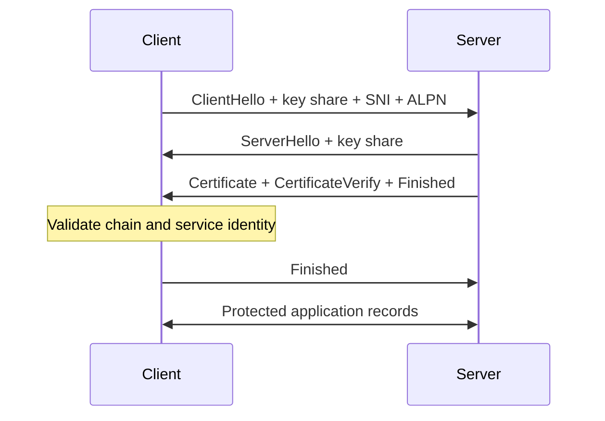

<TLDR>
  <TLDRCell label="what">
    TLS authenticates a peer and protects bytes against reading or modification in transit. Those guarantees hold only after certificate and hostname verification succeeds.
  </TLDRCell>
  <TLDRCell label="trap">
    Encryption, a valid certificate chain, and the intended hostname are separate checks. Disabling one can leave an encrypted connection to an impersonator.
  </TLDRCell>
  <TLDRCell label="fix">
    Preserve the requested hostname, use the right trust store, keep verification enabled, and record the failed connection phase instead of bypassing it.
  </TLDRCell>
</TLDR>

## What it is and why it exists

Transport Layer Security (TLS) is a protocol that runs above a reliable transport, normally TCP, and below an application protocol such as HTTP. It turns a byte stream into an authenticated, confidential, integrity-protected channel. The application still defines requests, permissions, transactions, and message limits.

Without TLS, an observer on the path can read traffic, while an active attacker can alter bytes or impersonate a destination. TLS counters those threats by authenticating handshake data, agreeing fresh traffic keys, and protecting later records with authenticated encryption. It doesn't hide every observable fact: addresses, timing, sizes, and often the server name can remain visible.

A server normally proves its identity with an X.509 certificate containing a public key and names it is authorized to serve. The certificate is public; the corresponding private key is the secret. A signature from an issuer connects that certificate to a configured trust decision.

Two validations answer different questions. A <Term id="certificate-chain">certificate chain</Term> asks whether the presented identity leads through acceptable issuers to a trust anchor. <Term id="hostname-verification">Hostname verification</Term> asks whether the certificate covers the service name the client intended to reach.

A chain can be valid for `payments.example` and still be wrong for `login.example`. Conversely, a certificate can name the requested host but lead only to an unknown private root. A secure client requires both checks, plus validity dates, signatures, key usages, and certificate constraints.

TLS commonly authenticates only the server. The application authenticates its user with a session, token, or another credential after the channel is ready. Mutual TLS can also request a client certificate, but certificate identity still needs an explicit mapping to application authorization.

You meet TLS in HTTPS, database connections, mail submission, service meshes, message brokers, VPN control channels, and custom protocols. Mature libraries usually configure safe verification defaults. The dangerous moment is when a connection fails and someone treats `rejectUnauthorized: false` as a repair instead of evidence that trust or identity is misconfigured.

## How it works

TLS 1.3 begins with a <Term id="tls-handshake">TLS handshake</Term>. The peers negotiate protocol parameters, the server proves possession of its private key, and both sides derive traffic secrets from the same authenticated transcript. Application bytes flow only after the client accepts the server's identity and verifies the handshake.

The main handshake path can be followed in this order:

1. The client opens a transport connection to one selected address.
2. `ClientHello` offers TLS versions, cipher suites, key shares, and extensions such as SNI and ALPN.
3. `ServerHello` selects parameters and contributes the server's key share.
4. The server sends its certificate chain and a signature over the handshake transcript.
5. The client validates the chain, service name, certificate purpose, and time window.
6. Each peer verifies a `Finished` value and switches to protected application records.



Server Name Indication (SNI) tells a multi-tenant endpoint which certificate and configuration the client expects. Application-Layer Protocol Negotiation (ALPN) selects a protocol such as `h2` or `http/1.1`. Neither extension by itself authenticates the peer; the certificate and transcript checks do that.

The <Term id="key-agreement">key agreement</Term> in a normal TLS 1.3 handshake uses ephemeral Diffie-Hellman keys. Each endpoint combines its private ephemeral key with the other's public share and arrives at the same secret without sending that secret. The TLS key schedule then derives separate keys for handshake traffic, client application traffic, and server application traffic.

The certificate signature doesn't encrypt application data and isn't used as the bulk traffic key. It authenticates the server's handshake contribution and binds the agreed parameters to the certified key. Fast symmetric authenticated encryption protects the records after key derivation.

| Mechanism | What it establishes | What it does not establish |
| --- | --- | --- |
| DNS resolution | Candidate addresses for a name | That an address owns the name |
| Transport connect | A path to an address and port | The intended service identity |
| Chain validation | A path to a trusted root under certificate policy | That the leaf covers the requested name |
| Hostname verification | The requested service identity appears in the certificate | The user's application permissions |
| Handshake `Finished` | Both peers derived keys over the same transcript | That a business operation is authorized |

TLS records carry a content type and protected payload. Authenticated encryption detects changes as well as hiding plaintext; a record with an invalid tag is rejected. Sequence-dependent nonces and keys are managed by the protocol implementation, which is one reason application code should not construct a home-grown encrypted stream.

Session resumption lets a client and server use a previously issued ticket or pre-shared key to reduce repeat-handshake work. Resumption still has policy, lifetime, and key-rotation boundaries. TLS 1.3 early data, when enabled, can be replayed and must be restricted to operations designed for that risk.

## Examples

These examples use Node 24 and the local OpenSSL command to create short-lived test certificates. They bind only to a loopback address, suppress OpenSSL's random key-generation progress, and print deterministic observations rather than certificate serial numbers or generated secrets.

### Inspecting certificate names

The first program creates a certificate with a legacy common name and two Subject Alternative Name entries. `X509Certificate.checkHost()` tests certificate name matching only; it doesn't build a trust chain or check whether the certificate is currently valid.

<Depth level="quick">

```javascript run title="x509_hostname.mjs"
import { execFileSync } from "node:child_process";
import { X509Certificate } from "node:crypto";
import { mkdtempSync, readFileSync, rmSync } from "node:fs";
import { tmpdir } from "node:os";
import { join } from "node:path";

const work = mkdtempSync(join(tmpdir(), "codewiki-cert-"));
const key = join(work, "server.key");
const cert = join(work, "server.crt");

try {
  execFileSync("openssl", [
    "req", "-x509", "-newkey", "rsa:2048", "-nodes", "-days", "1",
    "-subj", "/CN=legacy.internal",
    "-addext", "subjectAltName=DNS:api.internal,DNS:*.svc.internal",
    "-keyout", key, "-out", cert,
  ], { stdio: "ignore" });

  const x509 = new X509Certificate(readFileSync(cert));
  console.log(`subject: ${x509.subject}`);
  console.log(`api: ${x509.checkHost("api.internal")}`);
  console.log(`service: ${x509.checkHost("orders.svc.internal")}`);
  console.log(`legacy: ${x509.checkHost("legacy.internal")}`);
} finally {
  rmSync(work, { recursive: true });
}
```

```text
subject: CN=legacy.internal
api: api.internal
service: *.svc.internal
legacy: undefined
```

<TryToBreak items={['a wildcard two labels below its suffix', 'an IP address stored only as a DNS name', 'a common name that conflicts with the SAN extension']} />

</Depth>

The exact `api.internal` name matches, and a one-label wildcard matches `orders.svc.internal`. The common name doesn't rescue `legacy.internal` because the SAN extension defines the service identities here. Production clients should let their TLS library apply the current service-identity rules rather than inventing suffix tests.

### Separating trust from hostname checks

This loopback server presents a leaf certificate signed by a generated private root. The three clients change one condition at a time: both root and name are correct, the root isn't trusted, or the root is trusted but the service name is wrong.

```javascript run title="local_tls.mjs"
import { execFileSync } from "node:child_process";
import { mkdtempSync, readFileSync, rmSync } from "node:fs";
import { tmpdir } from "node:os";
import { join } from "node:path";
import { connect, createServer } from "node:tls";
const work = mkdtempSync(join(tmpdir(), "codewiki-tls-"));
const file = (name) => join(work, name);
const quiet = { stdio: "ignore" };
execFileSync("openssl", ["req", "-x509", "-newkey", "rsa:2048", "-nodes", "-days", "1", "-subj", "/CN=Demo Root CA", "-addext", "basicConstraints=critical,CA:TRUE", "-addext", "keyUsage=critical,keyCertSign,cRLSign", "-keyout", file("root.key"), "-out", file("root.crt")], quiet);
execFileSync("openssl", ["req", "-newkey", "rsa:2048", "-nodes", "-subj", "/CN=unused.internal", "-addext", "subjectAltName=DNS:api.internal", "-keyout", file("server.key"), "-out", file("server.csr")], quiet);
execFileSync("openssl", ["x509", "-req", "-in", file("server.csr"), "-CA", file("root.crt"), "-CAkey", file("root.key"), "-CAcreateserial", "-days", "1", "-copy_extensions", "copy", "-out", file("server.crt")], quiet);
const server = createServer({
  key: readFileSync(file("server.key")),
  cert: readFileSync(file("server.crt")),
}, (socket) => socket.end("ready\n"));
server.on("tlsClientError", () => {});
await new Promise((resolve) => server.listen(0, "127.0.0.1", resolve));
const port = server.address().port;
function attempt(label, options) {
  return new Promise((resolve) => {
    const client = connect({ host: "127.0.0.1", port, ...options }, () => {
      console.log(`${label}: authorized=${client.authorized}`);
      client.end();
      resolve();
    });
    client.once("error", (error) => {
      console.log(`${label}: ${error.code}`);
      resolve();
    });
  });
}
const ca = readFileSync(file("root.crt"));
await attempt("trusted", { ca, servername: "api.internal" });
await attempt("untrusted", { servername: "api.internal" });
await attempt("wrong-host", { ca, servername: "billing.internal" });
await new Promise((resolve) => server.close(resolve));
rmSync(work, { recursive: true });
```

```text
trusted: authorized=true
untrusted: UNABLE_TO_VERIFY_LEAF_SIGNATURE
wrong-host: ERR_TLS_CERT_ALTNAME_INVALID
```

The successful client connects to `127.0.0.1` but verifies `api.internal` through the explicit `servername`. This preserves the distinction between routing and identity. The other errors identify different repairs: distribute the intended root for the first, or use a certificate covering the intended service name for the second.

The private root is passed only to this client. Replacing the process trust store with a one-off leaf certificate would make rotation brittle, while adding a development root to a machine-wide store would widen trust for every affected application.

### Demonstrating ephemeral key agreement

This program uses Node's X25519 primitive to isolate the mathematical agreement behind a TLS 1.3 key share. It isn't a TLS implementation: there is no certificate, transcript signature, key schedule, record nonce, or authenticated encryption.

```javascript run title="x25519_agreement.mjs"
import { diffieHellman, generateKeyPairSync } from "node:crypto";

function ephemeralPair() {
  return generateKeyPairSync("x25519");
}

const alice = ephemeralPair();
const bob = ephemeralPair();
const aliceSecret = diffieHellman({
  privateKey: alice.privateKey,
  publicKey: bob.publicKey,
});
const bobSecret = diffieHellman({
  privateKey: bob.privateKey,
  publicKey: alice.publicKey,
});

const nextBob = ephemeralPair();
const nextSecret = diffieHellman({
  privateKey: alice.privateKey,
  publicKey: nextBob.publicKey,
});

console.log(`same shared secret: ${aliceSecret.equals(bobSecret)}`);
console.log(`rotating one key changes it: ${!aliceSecret.equals(nextSecret)}`);
```

```text
same shared secret: true
rotating one key changes it: true
```

The peers derive equal bytes from different private inputs and exchanged public keys. Replacing one ephemeral pair changes the result. TLS feeds such input into a transcript-bound derivation schedule instead of using the raw shared secret directly.

Fresh ephemeral keys support <Term id="forward-secrecy">forward secrecy</Term>: later compromise of a certificate private key alone doesn't reveal earlier session keys. That property depends on ephemeral secrets being erased and on the negotiated handshake mode; this small example proves neither operational condition.

## Pitfalls

### Disabling certificate verification

> [!PITFALL]
> Options such as `rejectUnauthorized: false`, an always-successful verify callback, or a permissive command-line flag remove peer authentication. Traffic may still look encrypted while an active attacker terminates a separate TLS connection and reads or changes everything.

**Fix:** preserve the failing error code and repair the trust root, chain, clock, or requested hostname. If an isolated diagnostic must bypass verification, keep it outside production configuration and never reuse its client object for real credentials.

### Confusing the connected address with the service name

> [!PITFALL]
> Connecting to a pinned IP and then verifying that IP can break the intended hostname check and omit the SNI needed by virtual hosting. Replacing an HTTPS hostname with a resolved address is not an equivalent request.

**Fix:** use the approved address for routing while retaining the original service name for SNI, certificate verification, and the application authority. Test these values independently through proxies and custom DNS hooks.

### Treating any signed chain as trusted

> [!PITFALL]
> A server can send a self-signed root or an unrelated private chain, but presentation doesn't make that root trusted. Trusting every root supplied by the peer lets the peer choose the authority that vouches for itself.

**Fix:** configure trust anchors out of band through the platform store or a narrowly scoped private-CA bundle. Send leaf and intermediate certificates from the server; don't depend on the peer to supply the client's trust decision.

### Pinning a replaceable leaf certificate

> [!PITFALL]
> Exact leaf-certificate pinning can turn normal renewal, emergency reissuance, or a key change into an outage. A backup pin that has never been deployed and tested may fail at the moment it is needed.

**Fix:** prefer ordinary PKI validation unless the threat model justifies pinning. When pinning is required, define the stable object being pinned, overlap old and new material, test recovery, and ship an expiration plan before enforcement.

### Sending an incomplete chain

> [!PITFALL]
> A server may work on a developer machine because its store already contains the missing intermediate, then fail on a clean device. Serving the root doesn't reliably compensate for omitting the issuer needed to connect the leaf.

**Fix:** configure the server with the leaf followed by the required intermediates, and test from a minimal trust store. Monitor expiry for the whole deployed chain and rehearse renewal before the current certificate's final validity window.

### Treating TLS as application authorization

> [!PITFALL]
> A valid server channel doesn't prove that a request is allowed, and a valid client certificate doesn't automatically define a user or role. TLS also can't protect plaintext after a terminating proxy or keep secrets out of endpoint logs.

**Fix:** authorize every operation using an application identity and policy. Document each TLS termination boundary, authenticate the next hop when needed, and redact sensitive data at every endpoint that can see plaintext.

<Depth level="deep">

## Certificate validation and TLS 1.3 secrets

### Building a certificate path

The server normally sends its leaf certificate and the intermediate certificates needed to reach a root. The root is usually omitted because the client already has to trust it independently. The received list is evidence for path building, not a command to trust its last element.

Path validation verifies signatures from leaf toward a trust anchor and checks more than cryptographic syntax. Certificate validity times, Basic Constraints, path-length limits, Key Usage, Extended Key Usage, name constraints, and policy can reject an otherwise well-formed signature chain. Implementations may build a path using locally cached intermediates, so clean-store testing matters.

A trust store is policy, not a bag of certificates. A public Web client generally uses platform or runtime roots; an internal service may add a private organization root for a limited client. Replacing defaults with the private bundle can accidentally stop public services from validating, while machine-wide installation expands the private root's power beyond one application.

Revocation is not a universal synchronous lookup performed identically by every TLS client. CRLs, OCSP, stapling, short-lived certificates, and browser-specific mechanisms have different availability and privacy tradeoffs. State the revocation behavior of the actual client instead of assuming that chain success proves a certificate has never been revoked.

### Matching the reference identity

The reference identity comes from the secure application configuration or requested URL before DNS resolution. DNS produces routing candidates; it must not rewrite the identity the certificate is expected to cover. Redirects and proxy tunnels can intentionally change the next reference identity, but that transition belongs to protocol policy.

Modern service identity checks use the Subject Alternative Name extension. A DNS wildcard represents only the allowed label position under its suffix; substring and raw suffix comparisons are wrong. `badexample.com` must not match `example.com`, and `a.b.example.com` must not match `*.example.com`.

An IP literal needs an appropriate IP-address identity entry; putting its textual form in a DNS-name entry isn't interchangeable. Internationalized names also require the library's specified normalization and comparison rules. Passing a display Unicode form through custom lowercase logic is not a replacement for standards-based matching.

Common Name fallback belongs to compatibility history, not a new identity design. Certificates should carry the required identities in SAN, and clients should use maintained verification functions. The quick example deliberately shows that a common name doesn't override a present SAN extension.

### Authenticating the handshake transcript

TLS hashes the ordered handshake messages into a transcript. The server's `CertificateVerify` signs context plus that transcript hash, proving that the certified private key participated in this handshake. A later `Finished` value authenticates the transcript with a key derived from the handshake secrets.

This construction binds negotiation and identity to the resulting keys. An attacker can't freely change an offered version, cipher choice, extension, or key share without making transcript authentication fail. TLS also includes downgrade defenses, while endpoints should still disable protocol versions their policy no longer accepts.

TLS 1.3 cipher-suite names identify the authenticated-encryption and hash algorithms, not the certificate type or key-exchange group. Those are negotiated through other fields. Configuration reviews that infer every handshake property from one cipher-suite string are using the TLS 1.2 mental model.

### Deriving and rotating traffic secrets

Ephemeral Diffie-Hellman output is input to an HKDF-based key schedule. TLS derives distinct secrets for handshake encryption, client application traffic, server application traffic, exporter use, and resumption. Domain-separated labels and the transcript prevent one raw secret from being reused directly for unrelated purposes.

Client and server traffic use separate keys and sequence spaces. Implementations derive nonces and enforce record limits; applications should use supported rekeying or connection-lifetime controls instead of resetting counters. Copying one side's bytes into a custom symmetric cipher would discard the protocol's context and safety limits.

Certificate-key compromise and session-key compromise have different blast radii. With a fresh ephemeral exchange, possession of the server's long-term signing key later is insufficient to reconstruct erased past shared secrets. A live endpoint compromise, retained ephemeral keys, weak randomness, or exported session secrets can still expose traffic.

Long-lived connections also rotate application traffic secrets with TLS 1.3 `KeyUpdate`. This updates record-protection material without re-running certificate authentication. Operational limits should account for library behavior, record counts, connection age, and deployment draining rather than assuming one connection remains safe forever.

### Resumption and early data

A session ticket is a credential for resumption, not merely a performance hint. Servers need ticket-key rotation, bounded lifetimes, and isolation between security domains. Sharing ticket protection keys too broadly can make one compromised service able to resume sessions belonging to another.

Resumption can combine a pre-shared key with a new ephemeral exchange. The `psk_dhe_ke` mode preserves forward-secrecy properties for the new connection better than PSK-only agreement. Clients should verify what their library negotiates rather than assuming every abbreviated handshake has identical properties.

TLS 1.3 permits a client to send 0-RTT early data before the new handshake finishes. That data lacks the ordinary replay protection of one established connection: an attacker may cause the server side to receive it more than once. Restrict early data to explicitly replay-safe operations, or leave it disabled.

Application “idempotent” labels deserve scrutiny. A nominal read can consume a one-time token, write an audit entry, warm a costly cache, or trigger rate limits. Anti-replay infrastructure narrows risk but doesn't turn an arbitrary transaction into a replay-safe one.

### Client certificates and authorization

In mutual TLS, the server requests a client certificate and validates its chain and proof of private-key possession. That authenticates a certificate identity under the server's trust policy. It does not decide which tenant, role, route, or operation the identity may use.

Identity mapping should use stable certificate fields defined by the issuing policy, not a display string chosen ad hoc. Renewal must preserve or deliberately change that mapping. Proxies that terminate mutual TLS need an authenticated, integrity-protected way to convey the verified identity downstream; an arbitrary inbound header is not evidence.

Client private keys require narrow access and a rotation path. Exporting one shared key into every workload erases per-client attribution and expands the compromise radius. Hardware-backed keys can limit extraction, but they don't replace issuer policy, certificate expiry, or application authorization.

### Diagnosing the real connection phase

“TLS failed” is still too broad for operations. Record the target authority, selected address family, proxy hop, protocol version, ALPN result, and a safe error category without logging private keys, session secrets, or full sensitive certificates. Keep transport timeout, handshake timeout, and application deadline distinct under one overall budget.

| Symptom | Likely phase | Evidence to inspect |
| --- | --- | --- |
| Connection refused | Transport connect | Address, port, listener, firewall |
| Handshake timeout | TLS negotiation or stalled peer | Phase timer, bytes exchanged, proxy path |
| Unknown issuer | Path building | Sent intermediates and configured roots |
| Expired certificate | Certificate validity | Endpoint clock and full deployed chain |
| Name mismatch | Service identity | Reference name, SNI, and SAN entries |
| No shared protocol | Version, cipher, or ALPN negotiation | Both endpoint policies and proxy support |

Command-line probes are diagnostic clients with their own defaults. When using `openssl s_client`, pass the intended SNI and verification name, configure the relevant CA input, and inspect the final verification result. A displayed certificate chain or completed TCP connection alone is not success.

Test the deployed path, not only the origin process. A load balancer may terminate TLS and open another protected or plaintext hop; a service mesh may issue a different certificate; a CDN may select certificates from SNI. Every termination creates a new peer identity, trust policy, key boundary, and plaintext endpoint.

Automation should make certificate renewal boring but observable. Monitor remaining validity, served chain, name coverage, and handshake error rates from more than one client environment. Rehearse overlap and rollback so rotation doesn't depend on disabling checks during an incident.

A safe incident response restores the declared trust and identity contract. It doesn't create a second, weaker client configuration that quietly survives the incident.

</Depth>

<Checkpoint id="foundations/tls-connections" />

## Further reading

- [RFC 8446: The Transport Layer Security Protocol Version 1.3](https://www.rfc-editor.org/rfc/rfc8446.html)
- [RFC 5280: Internet X.509 PKI certificate and CRL profile](https://www.rfc-editor.org/rfc/rfc5280.html)
- [RFC 9525: Service Identity in TLS](https://www.rfc-editor.org/rfc/rfc9525.html)
- [Node.js v24 TLS documentation](https://nodejs.org/docs/latest-v24.x/api/tls.html)
- [Node.js v24 `X509Certificate` documentation](https://nodejs.org/docs/latest-v24.x/api/crypto.html#class-x509certificate)
- [OpenSSL 3.0 certificate verification options](https://docs.openssl.org/3.0/man1/openssl-verification-options/)
