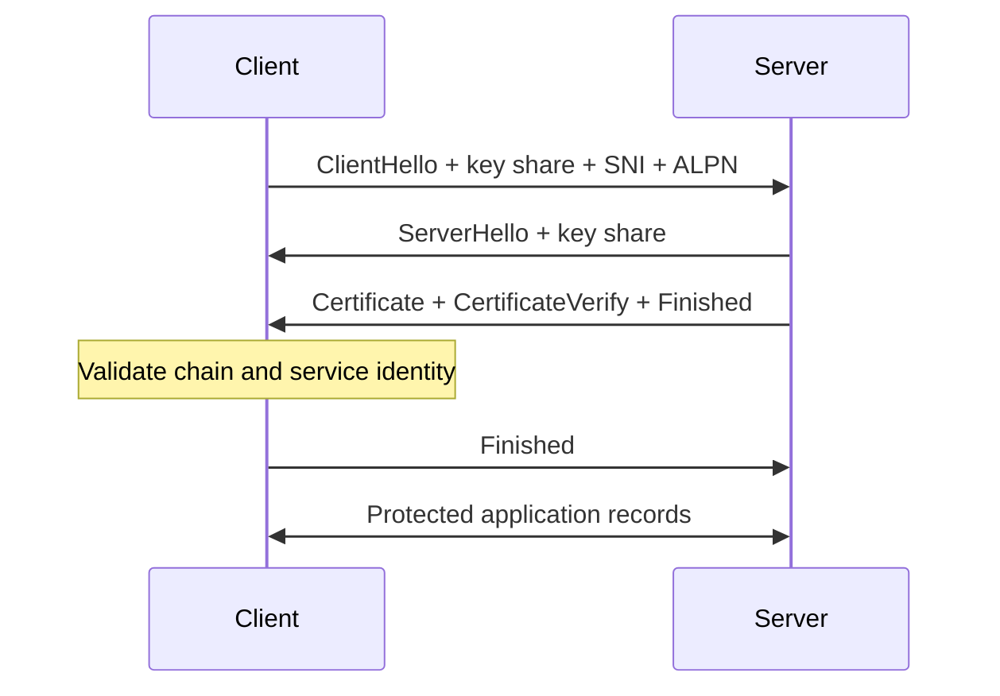

<TLDR>
  <TLDRCell label="what">
    TLS 会认证对端，并防止传输中的字节被读取或篡改。只有证书和主机名校验成功后，这些保证才成立。
  </TLDRCell>
  <TLDRCell label="trap">
    加密、有效证书链和目标主机名是三项独立检查。关闭其中一项，仍可能得到一条通往冒充者的加密连接。
  </TLDRCell>
  <TLDRCell label="fix">
    保留请求使用的主机名，使用正确的信任库，保持校验开启，并记录失败阶段，不要绕过错误。
  </TLDRCell>
</TLDR>

## 是什么，为什么存在

传输层安全（Transport Layer Security，TLS）运行在可靠传输协议之上、HTTP 等应用协议之下，通常使用 TCP。它把字节流变成经过认证、具备机密性和完整性保护的通道。请求、权限、事务和消息上限仍由应用定义。

没有 TLS 时，路径上的观察者可以读取流量，主动攻击者则能修改字节或冒充目标。TLS 通过认证握手数据、协商新的流量密钥，再用认证加密保护后续记录来抵御这些威胁。它不会隐藏所有可观察信息；地址、时序、大小以及服务器名称通常仍会暴露。

服务器通常用 X.509 证书证明身份。证书包含公钥和获准提供服务的名称；证书本身公开，对应私钥才是秘密。签发者的签名把这张证书连接到客户端配置的信任决策。

两种校验回答不同问题。<Term id="certificate-chain">证书链（certificate chain）</Term>校验判断所提供身份能否经过可接受的签发者到达信任锚。<Term id="hostname-verification">主机名校验（hostname verification）</Term>则判断证书是否覆盖客户端原本要访问的服务名称。

一条证书链可以对 `payments.example` 有效，却不适用于 `login.example`。反过来，证书可能包含请求主机，但只能连接到一个未知的私有根。安全客户端需要两项校验同时成功，还要检查有效期、签名、密钥用途和证书约束。

TLS 通常只认证服务器。通道就绪后，应用再通过会话、令牌或其他凭据认证用户。双向 TLS 还可以请求客户端证书，但证书身份仍需明确映射到应用授权。

HTTPS、数据库连接、邮件提交、服务网格、消息代理、VPN 控制通道和自定义协议都会用到 TLS。成熟库一般提供安全的默认校验配置。真正危险的时刻是连接失败后，有人把 `rejectUnauthorized: false` 当成修复，而不是信任或身份配置错误的证据。

## 工作原理

TLS 1.3 从<Term id="tls-handshake">TLS 握手（TLS handshake）</Term>开始。双方协商协议参数，服务器证明自己持有私钥，再从同一份经过认证的握手记录中派生流量秘密。只有客户端接受服务器身份并验证握手后，应用字节才开始传输。

主要握手路径可以按以下顺序理解：

1. 客户端与一个已选地址建立传输连接。
2. `ClientHello` 提供 TLS 版本、密码套件、密钥份额，以及 SNI 和 ALPN 等扩展。
3. `ServerHello` 选择参数，并给出服务器的密钥份额。
4. 服务器发送证书链，以及覆盖握手记录的签名。
5. 客户端校验证书链、服务名称、证书用途和有效时间窗口。
6. 双方各自验证 `Finished` 值，然后切换到受保护的应用记录。



服务器名称指示（Server Name Indication，SNI）告诉多租户端点客户端期望哪张证书和哪套配置。应用层协议协商（Application-Layer Protocol Negotiation，ALPN）会选择 `h2` 或 `http/1.1` 等协议。两个扩展本身都不认证对端，真正完成认证的是证书和握手记录检查。

普通 TLS 1.3 握手中的<Term id="key-agreement">密钥协商（key agreement）</Term>使用临时 Diffie-Hellman 密钥。每个端点把自己的临时私钥与对端的公开份额组合，在不发送共同秘密的情况下得到相同结果。TLS 密钥计划再分别派生握手流量、客户端应用流量和服务器应用流量所需的密钥。

证书签名不会加密应用数据，也不是批量流量使用的密钥。它认证服务器的握手贡献，并把协商参数绑定到经过认证的密钥。完成密钥派生后，高效的对称认证加密负责保护记录。

| 机制 | 确立的事实 | 无法确立的事实 |
| --- | --- | --- |
| DNS 解析 | 一个名称的候选地址 | 某个地址拥有该名称 |
| 传输连接 | 通往某个地址与端口的路径 | 目标服务身份 |
| 证书链校验 | 按证书策略到达受信根的路径 | 叶证书覆盖请求名称 |
| 主机名校验 | 证书中存在请求的服务身份 | 用户的应用权限 |
| 握手 `Finished` | 双方根据同一握手记录派生了密钥 | 某项业务操作已经获得授权 |

TLS 记录携带内容类型和受保护负载。认证加密既隐藏明文，也能检测修改；认证标签无效的记录会被拒绝。协议实现负责管理与序列有关的 nonce 和密钥，这正是应用代码不应自制加密字节流的原因之一。

会话恢复让客户端和服务器使用之前签发的票据或预共享密钥，以减少重复握手工作。恢复仍有策略、生命周期和密钥轮换边界。启用 TLS 1.3 早期数据后，数据可能被重放，因此必须只用于能承担这种风险的操作。

## 示例

以下示例使用 Node 24，并调用本地 OpenSSL 命令创建短期测试证书。它们只绑定回环地址，隐藏 OpenSSL 生成随机密钥时的进度，并输出确定的观察结果，不输出证书序列号或生成的秘密。

### 检查证书名称

第一个程序创建一张证书，其中包含旧式通用名称和两个主题备用名称。`X509Certificate.checkHost()` 只检查证书名称匹配；它不会构建信任链，也不检查证书当前是否有效。

<Depth level="quick">

```javascript run title="x509_hostname.mjs"
import { execFileSync } from "node:child_process";
import { X509Certificate } from "node:crypto";
import { mkdtempSync, readFileSync, rmSync } from "node:fs";
import { tmpdir } from "node:os";
import { join } from "node:path";

const work = mkdtempSync(join(tmpdir(), "codewiki-cert-"));
const key = join(work, "server.key");
const cert = join(work, "server.crt");

try {
  execFileSync("openssl", [
    "req", "-x509", "-newkey", "rsa:2048", "-nodes", "-days", "1",
    "-subj", "/CN=legacy.internal",
    "-addext", "subjectAltName=DNS:api.internal,DNS:*.svc.internal",
    "-keyout", key, "-out", cert,
  ], { stdio: "ignore" });

  const x509 = new X509Certificate(readFileSync(cert));
  console.log(`subject: ${x509.subject}`);
  console.log(`api: ${x509.checkHost("api.internal")}`);
  console.log(`service: ${x509.checkHost("orders.svc.internal")}`);
  console.log(`legacy: ${x509.checkHost("legacy.internal")}`);
} finally {
  rmSync(work, { recursive: true });
}
```

```text
subject: CN=legacy.internal
api: api.internal
service: *.svc.internal
legacy: undefined
```

<TryToBreak items={['位于通配符后缀下两级的名称', '只保存为 DNS 名称的 IP 地址', '与 SAN 扩展冲突的通用名称']} />

</Depth>

完整的 `api.internal` 名称能够匹配，单标签通配符也能匹配 `orders.svc.internal`。因为这里由 SAN 扩展定义服务身份，所以通用名称无法让 `legacy.internal` 通过。生产客户端应由 TLS 库应用当前服务身份规则，不要自行编写后缀测试。

### 分开检查信任与主机名

这个回环服务器提供一张由临时私有根签发的叶证书。三个客户端每次只改变一个条件：根和名称都正确、根不受信任，或者根受信任但服务名称错误。

```javascript run title="local_tls.mjs"
import { execFileSync } from "node:child_process";
import { mkdtempSync, readFileSync, rmSync } from "node:fs";
import { tmpdir } from "node:os";
import { join } from "node:path";
import { connect, createServer } from "node:tls";
const work = mkdtempSync(join(tmpdir(), "codewiki-tls-"));
const file = (name) => join(work, name);
const quiet = { stdio: "ignore" };
execFileSync("openssl", ["req", "-x509", "-newkey", "rsa:2048", "-nodes", "-days", "1", "-subj", "/CN=Demo Root CA", "-addext", "basicConstraints=critical,CA:TRUE", "-addext", "keyUsage=critical,keyCertSign,cRLSign", "-keyout", file("root.key"), "-out", file("root.crt")], quiet);
execFileSync("openssl", ["req", "-newkey", "rsa:2048", "-nodes", "-subj", "/CN=unused.internal", "-addext", "subjectAltName=DNS:api.internal", "-keyout", file("server.key"), "-out", file("server.csr")], quiet);
execFileSync("openssl", ["x509", "-req", "-in", file("server.csr"), "-CA", file("root.crt"), "-CAkey", file("root.key"), "-CAcreateserial", "-days", "1", "-copy_extensions", "copy", "-out", file("server.crt")], quiet);
const server = createServer({
  key: readFileSync(file("server.key")),
  cert: readFileSync(file("server.crt")),
}, (socket) => socket.end("ready\n"));
server.on("tlsClientError", () => {});
await new Promise((resolve) => server.listen(0, "127.0.0.1", resolve));
const port = server.address().port;
function attempt(label, options) {
  return new Promise((resolve) => {
    const client = connect({ host: "127.0.0.1", port, ...options }, () => {
      console.log(`${label}: authorized=${client.authorized}`);
      client.end();
      resolve();
    });
    client.once("error", (error) => {
      console.log(`${label}: ${error.code}`);
      resolve();
    });
  });
}
const ca = readFileSync(file("root.crt"));
await attempt("trusted", { ca, servername: "api.internal" });
await attempt("untrusted", { servername: "api.internal" });
await attempt("wrong-host", { ca, servername: "billing.internal" });
await new Promise((resolve) => server.close(resolve));
rmSync(work, { recursive: true });
```

```text
trusted: authorized=true
untrusted: UNABLE_TO_VERIFY_LEAF_SIGNATURE
wrong-host: ERR_TLS_CERT_ALTNAME_INVALID
```

成功的客户端连接到 `127.0.0.1`，但通过显式的 `servername` 校验 `api.internal`。这保留了路由与身份的区别。其余两个错误需要不同的修复：前者应分发预期根，后者则要使用覆盖预期服务名称的证书。

私有根只传给这个客户端。用一次性叶证书替换进程信任库会使轮换变得脆弱，而把开发根加入整台机器的信任库，则会扩大所有受影响应用的信任范围。

### 演示临时密钥协商

这个程序使用 Node 的 X25519 原语，单独展示 TLS 1.3 密钥份额背后的数学协商。它不是 TLS 实现，其中没有证书、握手记录签名、密钥计划、记录 nonce 或认证加密。

```javascript run title="x25519_agreement.mjs"
import { diffieHellman, generateKeyPairSync } from "node:crypto";

function ephemeralPair() {
  return generateKeyPairSync("x25519");
}

const alice = ephemeralPair();
const bob = ephemeralPair();
const aliceSecret = diffieHellman({
  privateKey: alice.privateKey,
  publicKey: bob.publicKey,
});
const bobSecret = diffieHellman({
  privateKey: bob.privateKey,
  publicKey: alice.publicKey,
});

const nextBob = ephemeralPair();
const nextSecret = diffieHellman({
  privateKey: alice.privateKey,
  publicKey: nextBob.publicKey,
});

console.log(`same shared secret: ${aliceSecret.equals(bobSecret)}`);
console.log(`rotating one key changes it: ${!aliceSecret.equals(nextSecret)}`);
```

```text
same shared secret: true
rotating one key changes it: true
```

双方使用不同的私有输入和交换的公钥，派生出相同字节。替换一组临时密钥后，结果也随之改变。TLS 会把这类输入送入绑定握手记录的派生计划，而不是直接使用原始共同秘密。

新的临时密钥支持<Term id="forward-secrecy">前向保密（forward secrecy）</Term>：以后只有证书私钥泄露时，无法还原过去的会话密钥。该属性还取决于临时秘密是否删除，以及实际协商的握手模式；这个小例子并未证明这两个运行条件。

## 陷阱

### 关闭证书校验

> [!PITFALL]
> `rejectUnauthorized: false`、始终返回成功的验证回调或宽松的命令行参数都会移除对端认证。流量看起来仍然经过加密，但主动攻击者可以终止另一条 TLS 连接，读取或修改全部内容。

**修复方法：** 保留失败错误码，并修复信任根、证书链、时钟或请求主机名。如果隔离诊断必须绕过校验，应把它留在生产配置之外，也绝不能让对应客户端对象处理真实凭据。

### 混淆连接地址与服务名称

> [!PITFALL]
> 连接到固定 IP 后再校验该 IP，可能破坏预期主机名检查，也可能遗漏虚拟主机所需的 SNI。把 HTTPS 主机名替换成解析地址并不是等价请求。

**修复方法：** 用获准地址进行路由，同时保留原始服务名称，用于 SNI、证书校验和应用 authority。经过代理和自定义 DNS 钩子时，要分别测试这些值。

### 把任意签名链当作受信任链

> [!PITFALL]
> 服务器可以发送自签名根或无关私有链，但发送行为不会使该根获得信任。信任对端提供的每个根，等于让对端自行选择为自己背书的权威。

**修复方法：** 通过平台信任库或范围严格的私有 CA 包，在连接之外配置信任锚。服务器应发送叶证书和中间证书，不要依靠对端来提供客户端自己的信任决策。

### 固定会被替换的叶证书

> [!PITFALL]
> 精确固定叶证书会把正常续期、紧急重签或密钥变更变成服务中断。从未部署和测试的备用 pin，可能在真正需要时失效。

**修复方法：** 除非威胁模型确实要求固定，否则优先使用常规 PKI 校验。必须固定时，要定义被固定的稳定对象，让旧材料与新材料重叠，测试恢复流程，并在强制执行前交付到期方案。

### 发送不完整的证书链

> [!PITFALL]
> 服务器在开发机上可能正常工作，因为本地信任库已经有缺失的中间证书，到了干净设备却会失败。发送根证书也无法可靠弥补叶证书缺少必要签发者的问题。

**修复方法：** 服务器配置应先放叶证书，再放必要的中间证书，并使用最小信任库测试。监控整条部署链的到期时间，在当前证书进入最后有效窗口前演练续期。

### 把 TLS 当作应用授权

> [!PITFALL]
> 有效的服务器通道不能证明请求已经获准，有效的客户端证书也不会自动定义用户或角色。TLS 还无法保护终止代理之后的明文，也不能阻止端点日志记录秘密。

**修复方法：** 使用应用身份和策略为每项操作授权。记录每个 TLS 终止边界，必要时认证下一跳，并在每个能看到明文的端点移除敏感数据。

<Depth level="deep">

## 证书校验与 TLS 1.3 秘密

### 构建证书路径

服务器通常发送叶证书，以及到达根所需的中间证书。根一般不会发送，因为客户端必须已经独立信任它。收到的列表是构建路径的证据，不是要求客户端信任最后一项的命令。

路径校验从叶证书向信任锚验证签名，检查内容不只是密码学语法。证书有效期、基本约束、路径长度限制、密钥用途、扩展密钥用途、名称约束和策略，都可能拒绝一条签名格式正确的证书链。实现还可能用本地缓存的中间证书构建路径，因此必须使用干净信任库测试。

信任库是一项策略，不是证书集合。公开 Web 客户端通常使用平台或运行时根；内部服务可以只为特定客户端加入组织私有根。用私有包替换默认值，可能让公开服务突然无法验证；在整台机器安装私有根，又会把它的权力扩大到单个应用之外。

吊销不是每个 TLS 客户端都会用相同方式执行的同步查询。CRL、OCSP、装订、短期证书和浏览器专用机制在可用性与隐私方面各有取舍。应说明实际客户端的吊销行为，不要假设证书链成功就能证明证书从未被吊销。

### 匹配参考身份

参考身份来自 DNS 解析之前的安全应用配置或请求 URL。DNS 只产生路由候选，不能改写证书应覆盖的身份。重定向和代理隧道可以有意改变下一项参考身份，但这种转换属于协议策略。

现代服务身份检查使用主题备用名称扩展。DNS 通配符只能表示其后缀下获准的一个标签位置；子字符串和原始后缀比较都是错误的。`badexample.com` 不能匹配 `example.com`，`a.b.example.com` 也不能匹配 `*.example.com`。

IP 字面量需要适当的 IP 地址身份条目，把其文本形式放进 DNS 名称条目并不等价。国际化名称也必须遵循库指定的规范化和比较规则。用自定义小写逻辑处理展示用 Unicode 形式，无法替代标准匹配。

通用名称回退属于兼容性历史，不是新的身份设计。证书应把所需身份放在 SAN 中，客户端则应使用持续维护的验证函数。快速示例特意展示了通用名称不会覆盖已有 SAN 扩展。

### 认证握手记录

TLS 会把有序握手消息计算成一份哈希记录。服务器的 `CertificateVerify` 对上下文和该记录哈希签名，以此证明经过认证的私钥参与了本次握手。之后的 `Finished` 值再用握手秘密派生的密钥认证记录。

这种构造把协商与身份绑定到所得密钥。攻击者无法任意改变提供的版本、密码选择、扩展或密钥份额，否则握手记录认证就会失败。TLS 还包含降级防御，但端点仍应关闭策略不再接受的协议版本。

TLS 1.3 密码套件名称只说明认证加密与哈希算法，不说明证书类型或密钥交换组。后两项由其他字段协商。如果配置审查从一个密码套件字符串推断全部握手属性，使用的仍是 TLS 1.2 思维模型。

### 派生与轮换流量秘密

临时 Diffie-Hellman 输出是基于 HKDF 的密钥计划输入。TLS 会分别派生握手加密、客户端应用流量、服务器应用流量、导出用途和会话恢复所需的秘密。区分用途的标签与握手记录能防止原始秘密直接复用于无关目的。

客户端和服务器流量使用不同密钥与序列空间。实现负责派生 nonce 并执行记录上限；应用应使用支持的换钥或连接生命周期控制，不要重置计数器。把一端字节复制到自定义对称密码中，会丢掉协议上下文和安全限制。

证书密钥泄露与会话密钥泄露的影响范围不同。使用新的临时协商时，以后只取得服务器长期签名密钥，不足以还原已经删除的过去共同秘密。但在线端点失陷、临时密钥被保留、随机性不足或会话秘密被导出，仍会暴露流量。

TLS 1.3 的 `KeyUpdate` 还能为长期连接轮换应用流量秘密。它会更新记录保护材料，但不会再次执行证书认证。运行限制应考虑库行为、记录数量、连接时长和部署排空，而不是假设一条连接永远安全。

### 会话恢复与早期数据

会话票据是用于恢复的凭据，不只是性能提示。服务器需要轮换票据密钥、限制生命周期，并隔离不同安全域。票据保护密钥共享范围过大时，一个受侵服务可能恢复属于另一个服务的会话。

恢复可以把预共享密钥与新的临时协商结合。相比只使用 PSK 的协商，`psk_dhe_ke` 模式能更好地保留新连接的前向保密属性。客户端应验证库实际协商的结果，不要假设每种缩短握手都有相同属性。

TLS 1.3 允许客户端在新握手完成前发送 0-RTT 早期数据。这类数据不具备单条已建立连接通常具有的重放保护，攻击者可能让服务器多次收到它。早期数据应限制在明确可安全重放的操作上，否则就保持关闭。

应用对「幂等」的标记需要仔细检查。名义上的读取也可能消耗一次性令牌、写入审计记录、预热昂贵缓存或触发速率限制。抗重放设施可以缩小风险，但不会把任意事务变成可安全重放的操作。

### 客户端证书与授权

在双向 TLS 中，服务器请求客户端证书，并校验其证书链和私钥持有证明。这会在服务器信任策略下认证一个证书身份，却不会决定该身份能使用哪个租户、角色、路由或操作。

身份映射应使用签发策略定义的稳定证书字段，不能临时选择展示字符串。续期必须保留或有意改变这种映射。终止双向 TLS 的代理需要通过经过认证、受完整性保护的方式把已验证身份传给下游；任意入站请求头不能作为证据。

客户端私钥需要严格的访问范围和轮换路径。把一把共享密钥导出到所有工作负载，会抹去逐客户端归因能力，并扩大失陷范围。硬件保护密钥可以限制提取，却不能替代签发者策略、证书到期或应用授权。

### 诊断真实连接阶段

「TLS 失败」对于运维仍然过于宽泛。应记录目标 authority、已选地址族、代理跳、协议版本、ALPN 结果和安全错误类别，但不能记录私钥、会话秘密或完整敏感证书。在一个总体预算下，传输超时、握手超时和应用截止时间仍要保持区别。

| 表现 | 可能的阶段 | 应检查的证据 |
| --- | --- | --- |
| 连接被拒绝 | 传输连接 | 地址、端口、监听器、防火墙 |
| 握手超时 | TLS 协商或对端停滞 | 阶段计时器、交换字节、代理路径 |
| 未知签发者 | 路径构建 | 已发送中间证书和已配置根 |
| 证书过期 | 证书有效期 | 端点时钟和完整部署链 |
| 名称不匹配 | 服务身份 | 参考名称、SNI 和 SAN 条目 |
| 没有共同协议 | 版本、密码或 ALPN 协商 | 两端策略与代理支持情况 |

命令行探测器是带有自身默认值的诊断客户端。使用 `openssl s_client` 时，应传入预期 SNI 和验证名称，配置相关 CA 输入，并检查最终验证结果。显示了证书链或完成 TCP 连接，都不能单独代表成功。

测试应覆盖实际部署路径，而不只是源站进程。负载均衡器可能终止 TLS，再建立一条受保护或明文的下一跳；服务网格可能签发另一张证书；CDN 也可能根据 SNI 选择证书。每次终止都会产生新的对端身份、信任策略、密钥边界和明文端点。

自动化应让证书续期平常而且可观察。应从多个客户端环境监控剩余有效期、实际提供的证书链、名称覆盖和握手错误率。提前演练重叠与回滚，轮换才不会在事故中依赖关闭校验。

安全的事故响应应恢复既定信任与身份契约。它不会创建一套更弱的客户端配置，并任由这套配置在事故之后继续存在。

</Depth>

<Checkpoint id="foundations/tls-connections" />

## 延伸阅读

- [RFC 8446：传输层安全协议 1.3](https://www.rfc-editor.org/rfc/rfc8446.html)
- [RFC 5280：互联网 X.509 PKI 证书与 CRL 配置文件](https://www.rfc-editor.org/rfc/rfc5280.html)
- [RFC 9525：TLS 中的服务身份](https://www.rfc-editor.org/rfc/rfc9525.html)
- [Node.js v24 TLS 文档](https://nodejs.org/docs/latest-v24.x/api/tls.html)
- [Node.js v24 `X509Certificate` 文档](https://nodejs.org/docs/latest-v24.x/api/crypto.html#class-x509certificate)
- [OpenSSL 3.0 证书校验选项](https://docs.openssl.org/3.0/man1/openssl-verification-options/)
