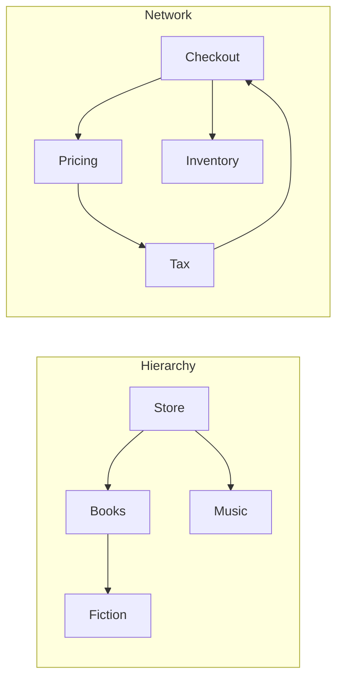

<TLDR>
  <TLDRCell label="what">
    A tree models one rooted hierarchy; a graph models general connections. Both consist of vertices and edges, but only a tree guarantees one path from the root to each node.
  </TLDRCell>
  <TLDRCell label="trap">
    A tree-shaped traversal can loop forever or repeat work on a graph because graphs may contain cycles and shared destinations.
  </TLDRCell>
  <TLDRCell label="fix">
    Define direction, identity, and edge meaning first. Use a visited set, choose DFS for branch-oriented work, and choose BFS for layer order or an unweighted shortest path.
  </TLDRCell>
</TLDR>

## What it is and why it exists

A <Term id="tree">tree</Term> is a collection of nodes joined by parent-child edges. In a rooted tree, one node is the root, every other node has exactly one parent, and no edge sequence returns to a node already on that sequence. Those constraints create a hierarchy with one path from the root to every node.

A <Term id="graph">graph</Term> is the more general model: a set of vertices and a set of edges connecting them. An edge may be directed or undirected, and it may carry a label or weight. Graphs can contain cycles, several paths to one vertex, disconnected components, and vertices with no edges.

The names “node” and “vertex” are often interchangeable. Tree APIs usually say node because parent, child, ancestor, and descendant are central. Graph algorithms usually say vertex because an edge need not express ownership or hierarchy.

These models exist because many relationships cannot be represented honestly as one flat sequence. File systems, syntax trees, menus, and organizational units are naturally hierarchical. Package dependencies, road routes, social links, build steps, and web pages form general networks instead.

A tree is also a graph with additional invariants. This is useful because a tree algorithm can omit machinery that the invariants make unnecessary. Once a “tree” allows shared children, back-links, or several parents, however, it must be treated as a graph even if its records still have a field named `children`.

Traversal turns the model into an operation. It chooses a start vertex, visits reachable vertices in a defined strategy, and performs work such as collecting names, finding a target, validating dependencies, or reconstructing a route. The order is part of the algorithm's contract, not a cosmetic detail.

Depth-first search and breadth-first search answer different questions. DFS follows one branch before returning, which matches recursive structure and backtracking. BFS visits by distance in edges from the start, which makes it the right baseline for shortest paths in an unweighted graph.

Before choosing either one, define what an edge means. A dependency edge may point from a service to what it needs or in the reverse direction. A road may be one-way. Reversing that convention changes reachability and can make correct traversal code answer the wrong business question.

## How it works

### Roots, vertices, and edges

A rooted tree gives traversal a natural starting point. A node with no children is a leaf; a node's depth is the number of edges from the root. The tree's height is the greatest node depth, although some APIs count levels instead and therefore differ by one.

A graph has no required root. The application supplies a start vertex, or it starts a traversal from every unvisited vertex when it must cover disconnected components. Reachability is always relative to edge direction and the chosen start.

The same five records can have different meanings under different edges:



The hierarchy has one incoming parent edge for each non-root node. The service network has two outgoing dependencies from `Checkout` and a cycle through `Pricing` and `Tax`. A visited set is optional for a proven tree but essential for a general graph traversal.

### Representations are contracts

An object with nested `children` fields stores a tree directly. It makes downward traversal simple, but a child normally needs an explicit parent reference if code must move upward. Adding parent references creates a cycle in the in-memory object graph even though the logical data is still a tree.

An <Term id="adjacency-list">adjacency list</Term> maps each vertex to its outgoing neighbors. In JavaScript, a `Map` from stable identifiers to arrays is a direct representation. It stores only edges that exist and makes neighbor iteration explicit.

An adjacency matrix gives every ordered pair of vertices a cell. It makes an edge existence check direct but allocates space for all pairs, including missing edges. This can be appropriate for a small dense graph, whereas an adjacency list usually fits sparse dependency and route data better.

| Representation | Natural operation | Important contract |
| --- | --- | --- |
| Nested children | Walk a rooted hierarchy downward | Each logical node has one parent |
| Adjacency list | Iterate the current vertex's neighbors | Missing key and empty neighbor list are defined |
| Adjacency matrix | Test or update a vertex pair | Vertex-to-index mapping stays stable |
| Edge list | Stream or sort all connections | Neighbor lookup needs another index or a scan |

Vertex identity deserves an explicit rule. Two object instances may describe the same database entity, while two records with the same display name may be distinct. A traversal's visited set should use the stable identity that the domain treats as one vertex, such as a service ID or station code.

Neighbor order also affects observable traversal order. DFS and BFS specify which frontier to process next, not how unordered neighbors should be arranged. If output order matters, store an order, sort with a documented key, or state that any valid order is acceptable.

### Depth-first search uses a stack

<Term id="depth-first-search">Depth-first search</Term> takes one unvisited neighbor and continues from it before returning to alternatives. Recursive DFS uses the language's call stack. Iterative DFS stores the same pending work in an explicit stack and avoids tying graph depth to the runtime recursion limit.

A basic iterative DFS follows this state transition:

1. Put the start vertex on a stack.
2. Pop one vertex; skip it if it has already been visited.
3. Mark it visited and perform the visit action.
4. Push its neighbors in the reverse of the desired visitation order.
5. Continue until the stack is empty.

Pushing in reverse matters because a stack is last-in, first-out. If neighbors are `[pricing, inventory]` and `pricing` should be visited first, push `inventory` and then `pricing`. A recursive loop visits the array from left to right without this reversal because each call completes before the loop advances.

DFS is a natural fit for evaluating recursive structure, finding connected components, detecting cycles, and exploring a search space with backtracking. Plain DFS visitation order is not automatically a dependency installation order. Topological sorting needs a directed acyclic graph and records completion order, not merely discovery order.

### Breadth-first search uses a queue

<Term id="breadth-first-search">Breadth-first search</Term> visits the start, then vertices one edge away, then vertices two edges away, and so on. A queue preserves this layer order. Enqueueing an unvisited neighbor records work for a later layer while older queued vertices remain first.

A basic BFS follows a slightly different transition:

1. Mark the start seen and enqueue it.
2. Dequeue one vertex and perform the visit action.
3. For each unseen neighbor, mark it seen, record its parent if needed, and enqueue it.
4. Continue until the queue is empty or the requested goal is reached.

Marking on enqueue prevents two vertices in the same layer from adding the same neighbor twice. It also makes the first recorded parent the one that discovered the vertex at minimum edge distance. Marking only after dequeue can duplicate frontier entries and complicate parent reconstruction.

In an unweighted graph, BFS discovers every reachable vertex using the fewest edges from the start. A parent map stores the edge by which each vertex was first discovered. Following parents backward from a goal and reversing the collected sequence reconstructs one shortest path.

This guarantee counts edges, not time, price, or risk. If edges have unequal costs, a two-edge route can be worse than a three-edge route. Nonnegative weighted shortest paths require an algorithm such as Dijkstra's, together with a priority queue and a precise weight contract.

### Visited state makes traversal finite

A visited set records semantic vertex identity, not how many paths lead there. On a cycle `A -> B -> C -> A`, the second encounter with `A` stops that branch. On a diamond, it prevents a shared destination from being fully processed once through each parent.

Sometimes one Boolean state is insufficient. Directed cycle detection distinguishes unseen vertices, vertices active on the current DFS path, and fully completed vertices. Encountering an active vertex is a back edge and proves a directed cycle; encountering a completed vertex does not.

Traversal state should belong to one traversal unless the API deliberately maintains an index across calls. Reusing a visited set accidentally can make a second search skip valid vertices. Hiding the set in module state also makes concurrent or interleaved traversals interfere with each other.

## Examples

These examples use only built-in JavaScript collections. Each file was executed with local Node 24, and each `text` block is the resulting standard output.

### Rendering a category tree in preorder

The catalog is a rooted tree represented by nested children. Preorder visits a node before its descendants, so the parent label is available before indented child lines are emitted.

<Depth level="quick">

```js run title="category_tree.js"
const catalog = {
  name: "Store",
  children: [
    {
      name: "Books",
      children: [{ name: "Fiction", children: [] }, { name: "Computing", children: [] }],
    },
    { name: "Music", children: [] },
  ],
};

function preorder(root) {
  const lines = [];

  function visit(node, depth) {
    lines.push(`${"  ".repeat(depth)}${node.name}`);
    for (const child of node.children) visit(child, depth + 1);
  }

  visit(root, 0);
  return lines;
}

console.log(preorder(catalog).join("\n"));
```

```text
Store
  Books
    Fiction
    Computing
  Music
```

<TryToBreak items={['a leaf as the root', 'an empty children array', 'a chain deeper than the runtime call stack']} />

</Depth>

Every recursive call receives a depth owned by its path, so sibling nodes use the same indentation and children add one level. The code relies on the tree contract: each record has a `children` array and no child points back to an ancestor.

If data comes from an API, validate those assumptions before recursion. A missing `children` field is a schema error; a cycle means the logical input is a graph and requires visited tracking or rejection.

### Walking cyclic service dependencies with DFS

This adjacency list contains `pricing -> tax -> catalog -> pricing`. The visited set makes the walk terminate, while the explicit stack removes dependence on the call stack.

```js run title="dependency_dfs.js"
const dependencies = new Map([
  ["checkout", ["pricing", "inventory"]],
  ["pricing", ["tax"]],
  ["tax", ["catalog"]],
  ["catalog", ["pricing"]],
  ["inventory", ["catalog"]],
]);

function depthFirst(graph, start) {
  const visited = new Set();
  const order = [];
  const stack = [start];

  while (stack.length > 0) {
    const service = stack.pop();
    if (visited.has(service)) continue;

    visited.add(service);
    order.push(service);

    const next = graph.get(service) ?? [];
    for (let index = next.length - 1; index >= 0; index -= 1) {
      stack.push(next[index]);
    }
  }

  return order;
}

console.log(depthFirst(dependencies, "checkout").join(" -> "));
```

```text
checkout -> pricing -> tax -> catalog -> inventory
```

Reversing neighbor pushes preserves the adjacency arrays' left-to-right order in this DFS result. The result is a reachability order only. The cycle means no valid topological order exists, and this function does not attempt to produce one.

The `?? []` policy treats a missing map entry as a vertex with no outgoing edges. That may be convenient for partial data, but a dependency validator might instead report every referenced service that lacks its own entry.

### Reconstructing an unweighted route with BFS

The route map uses directed connections. BFS records a parent when a place is first enqueued, then follows those parents backward only if the goal was discovered.

```js run title="shortest_route.js"
const routes = new Map([
  ["Depot", ["Museum", "Station"]],
  ["Museum", ["Park"]],
  ["Station", ["Harbor"]],
  ["Park", ["Harbor"]],
  ["Harbor", []],
]);

function shortestPath(graph, start, goal) {
  const queue = [start];
  const seen = new Set([start]);
  const parent = new Map([[start, null]]);
  let head = 0;

  while (head < queue.length) {
    const place = queue[head];
    head += 1;
    if (place === goal) break;

    for (const neighbor of graph.get(place) ?? []) {
      if (seen.has(neighbor)) continue;
      seen.add(neighbor);
      parent.set(neighbor, place);
      queue.push(neighbor);
    }
  }

  if (!parent.has(goal)) return null;

  const path = [];
  for (let place = goal; place !== null; place = parent.get(place)) {
    path.push(place);
  }
  return path.reverse();
}

const harborRoute = shortestPath(routes, "Depot", "Harbor");
const airportRoute = shortestPath(routes, "Depot", "Airport");
console.log(harborRoute.join(" -> "));
console.log(airportRoute ?? "No route");
```

```text
Depot -> Station -> Harbor
No route
```

`Harbor` is first discovered from `Station`, at distance two. The alternative through `Museum` and `Park` uses three edges and cannot replace that parent. An absent target returns `null` rather than a partial route.

The head index avoids removing the first array element on every dequeue. The consumed prefix remains allocated until the function returns, which is appropriate for this bounded traversal. A long-lived streaming queue should use a queue abstraction that can reclaim storage.

## Pitfalls

### Treating graph data as a tree

> [!PITFALL]
> Following every `children` or neighbor reference recursively without visited state assumes unique parents and no cycles. Shared records are processed repeatedly, while a back-link can recurse until the runtime throws or the process exhausts resources.

**Fix:** validate a promised tree at its boundary, or traverse it as a graph with stable vertex identities. Test a self-loop, a two-vertex cycle, and a diamond in which two parents share one destination.

### Marking BFS vertices after dequeue

> [!PITFALL]
> If a vertex becomes seen only when removed from the queue, several vertices can enqueue it first. The traversal may still find reachable vertices, but it wastes frontier space and can overwrite or duplicate parent information.

**Fix:** mark a neighbor seen in the same step that enqueues it, and set its parent once. Test a diamond graph and assert both the path and the number of queued vertices.

### Using an array front as an unbounded queue

> [!PITFALL]
> Repeated `shift()` calls move the logical front of an array through index operations. On a large frontier, queue maintenance can dominate the simple edge work the traversal was meant to perform.

**Fix:** keep a head index for a traversal-scoped array, as in the route example, or use a tested deque for a long-lived queue. Put an explicit bound on externally supplied graph size.

### Calling BFS a weighted shortest-path algorithm

> [!PITFALL]
> BFS minimizes the number of edges. It does not minimize travel time, latency, price, or any other unequal edge weight, even when it returns a plausible-looking route.

**Fix:** state whether every edge has equal cost. Use a suitable weighted algorithm for nonnegative weights, reject invalid weights, and test a case where the cheapest route has more edges.

### Mistaking DFS discovery order for dependency order

> [!PITFALL]
> A DFS visit sequence can place a dependent before its prerequisite, and a cyclic dependency graph has no topological order at all. Reversing the visit array does not repair an algorithm that never tracked completion or cycles.

**Fix:** request topological sorting explicitly, use three-state cycle detection, and fail with a useful cycle path. Test independent components as well as a dependency cycle.

### Recursing over unbounded depth

> [!PITFALL]
> Recursive traversal consumes one call frame per active level. A valid but adversarial chain can exceed the runtime stack even though the total graph easily fits in memory.

**Fix:** use an explicit stack when depth is not tightly bounded, and enforce input limits appropriate to the service. Test a long chain rather than only balanced sample trees.

## In the AI era

**What generated code gets wrong here**

Generated code often applies a neat recursive tree walk to graph-shaped API data without validating unique parents or adding visited state. Models also produce BFS with `shift()`, mark vertices after dequeue, overwrite parents, or use display labels as identity. A common dependency helper returns DFS discovery order as a “topological sort” and silently accepts cycles.

**Ask your AI to check**

- State whether edges are directed, what each direction means, how vertices are identified, and whether weights are equal.
- Trace the algorithm on a self-loop, a diamond, a disconnected vertex, and an absent goal; show stack or queue state at each step.
- Name the visitation invariant, derive time and space bounds from the chosen representation, and identify any runtime stack or input-size limit.

**Review checklist**

- Confirm that representation, direction, identity, neighbor order, and missing-vertex behavior match the domain contract.
- Verify visited timing and ownership, plus parent or completion state used for paths, cycles, or topological order.
- Run adversarial fixtures: empty graph, start equals goal, cycle, shared destination, disconnected component, and deep chain.

**Prompt vocabulary**

Use `rooted tree`, `directed graph`, `vertex identity`, `edge direction`, `adjacency list`, `depth-first search (DFS)`, `breadth-first search (BFS)`, `visited set`, `discovery time`, `completion time`, `frontier`, `parent map`, `unweighted shortest path`, and `topological sort`. Ask for an invariant and a traced counterexample; “walk this data” leaves the essential contracts unspecified.

<Depth level="deep">

## Traversal invariants, complexity, and edge cases

### A useful invariant for each frontier

For iterative DFS, every vertex on the stack is discovered or scheduled for discovery, and every vertex in `visited` has already had its visit action applied. The exact stack may contain duplicates when marking happens on pop, but each vertex is processed once because later copies are skipped.

For BFS that marks on enqueue, every queued vertex is already in `seen`, has at most one recorded parent, and has a distance no smaller than any vertex before it. When a vertex first enters the queue, its parent is in the previous layer. This layer invariant is the reason first discovery gives minimum edge count.

State the invariant before changing visitation timing. Marking on pop can be correct for some DFS variants, but copying that choice into BFS changes queue size and parent behavior. An optimization is safe only if the invariant still holds.

### Complexity follows the representation

Let `V` be the number of reachable vertices and `E` the number of outgoing edges examined. With an adjacency list and a visited set whose operations meet their usual constant-time expectation, DFS and BFS take `O(V + E)` time: each vertex is processed once and each stored edge is inspected once.

An undirected adjacency list normally stores each logical edge twice, once in each endpoint's list. The traversal still has linear `O(V + E)` form because the factor of two is constant. Be explicit about whether `E` means logical edges or stored adjacency entries when reporting counts.

Visited state, parents, and the frontier can each use `O(V)` extra space. DFS frontier size is related to pending branches and can reach `V`; recursive DFS also consumes call frames proportional to active depth. BFS can hold an entire wide layer, so a shallow graph is not necessarily memory-cheap.

With an adjacency matrix, enumerating all possible neighbors of one vertex scans a row of `V` cells. A full traversal therefore takes `O(V²)` cell checks even when few edges exist. The matrix may still be suitable when the graph is dense or constant-position edge lookup dominates traversal.

These are operation counts, not latency promises. Hash behavior, allocation, cache locality, callbacks, and data loading can dominate a real program. Measure the complete workload before using traversal order as a performance conclusion.

### Forests and disconnected graphs

One traversal covers only vertices reachable from its start. To enumerate a disconnected graph, loop through every known vertex and launch a traversal whenever that vertex is still unseen. The resulting set of traversal trees is a forest.

The outer iteration order then determines component order. If the graph comes from a database or hash-based collection with no stable order guarantee, reproducible output requires an explicit sort or documented canonical key.

An isolated vertex still belongs to the graph even though it has no edges. A representation that derives vertices only from edge endpoints can lose isolated records. Keep an explicit vertex set when isolated entities matter.

### Cycles need more than reachability state

A Boolean visited set is enough to avoid repeating vertices, but not enough to explain a directed cycle. A three-color DFS uses white for unseen, gray for active on the current path, and black for completed. An edge to gray identifies a back edge.

To report the cycle, retain parents for active vertices and walk them back from the current vertex to the gray destination. A useful error names the concrete loop, such as `pricing -> tax -> catalog -> pricing`, rather than merely returning `false`.

In an undirected graph, the edge back to the immediate parent is expected and is not a cycle by itself. Cycle detection must distinguish that parent edge from an edge to another previously visited vertex. Directed and undirected algorithms are therefore not interchangeable wrappers around the same condition.

### Shortest paths need a weight contract

BFS is equivalent to assigning every edge weight one. It can stop when the goal is dequeued, or when the goal is first enqueued if the parent and discovery semantics are clear. The path is one of possibly several equal-length answers, selected by neighbor order.

Dijkstra's algorithm extends the frontier with tentative distances and a minimum-priority queue for nonnegative weights. Negative weights invalidate its settled-distance invariant. Graphs with negative edges need a different algorithm, and reachable negative cycles may mean no finite shortest path exists.

Weights also need domain units. Combining seconds, money, and risk into one number without a documented policy does not create a meaningful optimum. Validate missing values, non-finite numbers, and whether direction changes the weight.

### Mutation and snapshot semantics

Changing adjacency while traversing makes the result depend on timing. Adding an edge to a vertex already processed may never expose its destination; removing a queued vertex may leave stale work. A live graph API must specify which mutations become visible.

The simplest contract is a snapshot: build or acquire an immutable view, traverse it, and publish results tied to that version. If copying is too expensive, use a graph version, read lock, persistent data structure, or restart policy appropriate to the system.

User callbacks are also mutations in disguise. A visit function may modify the same records or adjacency map unless the API prevents it. Keep traversal bookkeeping private and document whether callbacks may alter graph state.

### Identity and serialization boundaries

Using object identity in a `Set` works only while every reference to one logical vertex uses the same object instance. Deserializing two copies of `{ id: "tax" }` creates distinct objects. A stable scalar ID avoids that accidental split.

The reverse error merges distinct vertices under a non-unique label. Two stations named “Central” are not one vertex if their station codes differ. Identity should come from a domain key with uniqueness guarantees, not from a convenient display string.

Avoid deriving identity with `JSON.stringify()` unless canonical serialization is itself the contract. Property order, irrelevant fields, and cyclic objects make it fragile. Normalize at the boundary and keep the traversal generic over the resulting stable key.

</Depth>

<Checkpoint id="foundations/trees-and-graphs" />

## Further reading

- [MDN: `Map`](https://developer.mozilla.org/en-US/docs/Web/JavaScript/Reference/Global_Objects/Map)
- [MDN: `Set`](https://developer.mozilla.org/en-US/docs/Web/JavaScript/Reference/Global_Objects/Set)
- [NIST Dictionary: breadth-first search](https://xlinux.nist.gov/dads/HTML/breadthfirst.html)
- [NIST Dictionary: depth-first search](https://xlinux.nist.gov/dads/HTML/depthfirst.html)
- [Princeton Algorithms: graphs](https://algs4.cs.princeton.edu/40graphs/)
