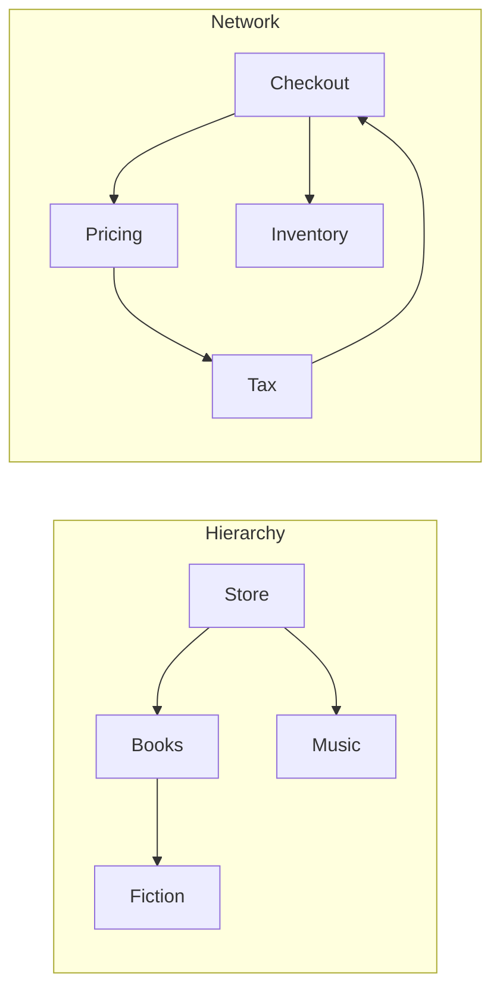

<TLDR>
  <TLDRCell label="what">
    树用于表示一个有根层级，图用于表示一般连接。二者都由顶点和边组成，但只有树保证从根到每个节点都只有一条路径。
  </TLDRCell>
  <TLDRCell label="trap">
    图可能包含环，也可能有多条路径通向同一目标。把树的遍历方式直接用于图，可能导致无限循环或重复工作。
  </TLDRCell>
  <TLDRCell label="fix">
    先定义方向、标识和边的含义。使用已访问集合；处理分支型工作时选择 DFS，需要按层访问或寻找无权最短路径时选择 BFS。
  </TLDRCell>
</TLDR>

## 是什么，为什么存在

<Term id="tree">树（tree）</Term>是由父子边连接的一组节点。在有根树中，一个节点是根，其余每个节点恰好有一个父节点，而且沿边形成的序列不会回到序列中已有的节点。这些约束形成了层级，并保证从根到每个节点都只有一条路径。

<Term id="graph">图（graph）</Term>是更一般的模型：它由一组顶点和一组连接顶点的边构成。边可以有向或无向，也可以携带标签或权重。图可以包含环、通向同一顶点的多条路径、彼此断开的连通分量，以及没有任何边的顶点。

「节点」和「顶点」经常可以互换。树 API 通常使用节点，因为父节点、子节点、祖先和后代是核心概念。图算法通常使用顶点，因为边不一定表示所有权或层级。

这些模型之所以存在，是因为许多关系无法诚实地表示成一个扁平序列。文件系统、语法树、菜单和组织单元天然具有层级。包依赖、道路路线、社交关系、构建步骤和网页则形成一般网络。

树也是满足额外不变量的一种图。这些不变量让树算法可以省略不必要的机制。不过，一棵「树」一旦允许共享子节点、反向链接或多个父节点，即使记录仍有名为 `children` 的字段，也必须按图处理。

遍历把模型转化为操作。它选择起始顶点，按明确策略访问可达顶点，并执行收集名称、寻找目标、验证依赖或重建路线等工作。顺序属于算法契约，不是表面上的展示细节。

深度优先搜索与广度优先搜索回答不同问题。DFS 会先沿一个分支前进再返回，适合递归结构和回溯。BFS 按顶点与起点之间的边数逐层访问，因此是无权图最短路径的正确基线。

选择算法前，还要定义边的含义。依赖边可以从服务指向其依赖项，也可以采用相反方向。道路可能单向通行。颠倒约定会改变可达性，即使遍历代码本身正确，也可能回答错误的业务问题。

## 工作原理

### 根、顶点与边

有根树为遍历提供了天然起点。没有子节点的节点称为叶子；节点深度是它与根之间的边数。树高是最大的节点深度，但有些 API 会改为计算层数，因此结果相差 1。

图不要求存在根。应用需要提供起始顶点；如果必须覆盖断开的连通分量，就要从每个尚未访问的顶点启动遍历。可达性始终取决于边的方向和所选起点。

同样的五条记录可以在不同边关系下表达不同含义：



层级中每个非根节点都有一条入边表示其父节点。服务网络中，`Checkout` 有两条出边表示依赖，还存在一个经过 `Pricing` 与 `Tax` 的环。对于已经证明是树的数据，已访问集合可以省略；对于一般图遍历，它不可缺少。

### 表示形式也是契约

带有嵌套 `children` 字段的对象可以直接存储树。它很适合向下遍历，但代码如果还要向上移动，子节点通常需要显式保存父节点引用。即使逻辑数据仍是一棵树，增加父节点引用也会在内存对象图中形成环。

<Term id="adjacency-list">邻接表（adjacency list）</Term>把每个顶点映射到它的出边邻居。在 JavaScript 中，可以直接用一个从稳定标识映射到数组的 `Map` 表示。它只存储实际存在的边，也让邻居迭代保持明确。

邻接矩阵会为每一对有序顶点分配一个单元格。它可以直接检查边是否存在，却要为全部顶点对分配空间，包括不存在的边。小型稠密图可能适合矩阵，而稀疏的依赖与路线数据通常更适合邻接表。

| 表示形式 | 自然操作 | 重要契约 |
| --- | --- | --- |
| 嵌套子节点 | 向下遍历有根层级 | 每个逻辑节点只有一个父节点 |
| 邻接表 | 迭代当前顶点的邻居 | 明确定义缺失键和空邻居列表 |
| 邻接矩阵 | 检查或更新一对顶点 | 顶点到索引的映射保持稳定 |
| 边列表 | 流式处理或排序全部连接 | 查找邻居还需索引或扫描 |

顶点标识必须有明确规则。两个对象实例可能描述同一个数据库实体，而两个显示名称相同的记录也可能是不同实体。遍历使用的已访问集合应采用领域认可的稳定标识，例如服务 ID 或车站代码。

邻居顺序也会影响可观察的遍历结果。DFS 和 BFS 只规定接下来处理哪种前沿结构，不会规定怎样排列原本无序的邻居。如果输出顺序有意义，就要存储顺序、按有文档说明的键排序，或者明确接受任意有效顺序。

### 深度优先搜索使用栈

<Term id="depth-first-search">深度优先搜索（depth-first search，DFS）</Term>会选取一个未访问邻居继续前进，然后才返回处理其他选择。递归 DFS 使用语言的调用栈。迭代 DFS 则把待处理工作存入显式栈，避免把图的深度绑定到运行时递归限制。

基本的迭代 DFS 按以下方式转换状态：

1. 把起始顶点放入栈。
2. 弹出一个顶点；如果已经访问，就跳过。
3. 把它标为已访问并执行访问操作。
4. 按期望访问顺序的逆序压入邻居。
5. 持续处理，直到栈为空。

之所以要逆序压栈，是因为栈遵循后进先出。如果邻居为 `[pricing, inventory]`，且希望先访问 `pricing`，就要依次压入 `inventory` 和 `pricing`。递归循环无需反转，因为每次调用都会在循环继续前完成。

DFS 很适合计算递归结构、寻找连通分量、检测环，以及通过回溯探索搜索空间。单纯的 DFS 访问顺序不会自动变成依赖安装顺序。拓扑排序要求输入是有向无环图，还要记录完成顺序，而不只是发现顺序。

### 广度优先搜索使用队列

<Term id="breadth-first-search">广度优先搜索（breadth-first search，BFS）</Term>先访问起点，再访问相距一条边的顶点，然后访问相距两条边的顶点，并逐层继续。队列能保持这种层级顺序。加入一个未访问邻居，会把它留给之后的层处理，同时让较早入队的顶点继续排在前面。

基本的 BFS 采用稍有不同的状态转换：

1. 把起始顶点标为已发现并加入队列。
2. 从队列取出一个顶点并执行访问操作。
3. 对每个未发现邻居，将其标为已发现；如果需要则记录父节点，然后入队。
4. 持续处理，直到队列为空或找到指定目标。

入队时就做标记，可以防止同一层中的多个顶点重复加入同一个邻居。这也能保证第一次记录的父节点来自以最小边数发现该顶点的路径。等到出队后才标记，可能产生重复的前沿项，也会让父节点重建更复杂。

在无权图中，BFS 会按最少边数发现从起点可达的每个顶点。父节点映射保存每个顶点第一次被发现时使用的边。从目标反向跟随父节点，再反转收集到的序列，就能重建一条最短路径。

这项保证计算的是边数，而不是时间、价格或风险。如果边的成本不同，两条边的路线也可能差于三条边的路线。非负权重的最短路径需要 Dijkstra 等算法、优先队列以及明确的权重契约。

### 已访问状态保证遍历终止

已访问集合记录顶点的语义标识，不记录有多少条路径通向它。在环 `A -> B -> C -> A` 中，第二次遇到 `A` 时就会终止该分支。在菱形结构中，它能避免同一个共享目标经由每个父节点都被完整处理一次。

有时一个布尔状态还不够。有向环检测要区分未发现顶点、当前 DFS 路径上的活跃顶点，以及已经完成的顶点。遇到活跃顶点的边是反向边，可以证明存在有向环；遇到已完成顶点则不能得出这一结论。

除非 API 有意跨调用维护索引，否则遍历状态应只属于一次遍历。意外复用已访问集合，会让第二次搜索跳过有效顶点。把集合藏在模块状态中，还会让并发或交错执行的遍历彼此干扰。

## 示例

这些示例只使用 JavaScript 内置集合。每个文件都使用本地 Node 24 执行，紧随其后的 `text` 块就是对应的标准输出。

### 用前序遍历呈现分类树

这个目录是一棵用嵌套子节点表示的有根树。前序遍历会先访问节点再访问其后代，因此可以先输出父标签，再输出带缩进的子行。

<Depth level="quick">

```js run title="category_tree.js"
const catalog = {
  name: "Store",
  children: [
    {
      name: "Books",
      children: [{ name: "Fiction", children: [] }, { name: "Computing", children: [] }],
    },
    { name: "Music", children: [] },
  ],
};

function preorder(root) {
  const lines = [];

  function visit(node, depth) {
    lines.push(`${"  ".repeat(depth)}${node.name}`);
    for (const child of node.children) visit(child, depth + 1);
  }

  visit(root, 0);
  return lines;
}

console.log(preorder(catalog).join("\n"));
```

```text
Store
  Books
    Fiction
    Computing
  Music
```

<TryToBreak items={['把叶子作为根', '空 children 数组', '深度超过运行时调用栈的链']} />

</Depth>

每次递归调用都接收其所在路径拥有的深度，因此兄弟节点使用相同缩进，子节点则增加一级。代码依赖树契约：每条记录都有 `children` 数组，而且子节点不会指回祖先。

如果数据来自 API，应在递归前验证这些假设。缺少 `children` 字段属于模式错误；存在环则表示逻辑输入是一张图，需要跟踪已访问状态或直接拒绝。

### 用 DFS 遍历有环的服务依赖

这个邻接表包含 `pricing -> tax -> catalog -> pricing`。已访问集合让遍历能够终止，显式栈则消除了对调用栈的依赖。

```js run title="dependency_dfs.js"
const dependencies = new Map([
  ["checkout", ["pricing", "inventory"]],
  ["pricing", ["tax"]],
  ["tax", ["catalog"]],
  ["catalog", ["pricing"]],
  ["inventory", ["catalog"]],
]);

function depthFirst(graph, start) {
  const visited = new Set();
  const order = [];
  const stack = [start];

  while (stack.length > 0) {
    const service = stack.pop();
    if (visited.has(service)) continue;

    visited.add(service);
    order.push(service);

    const next = graph.get(service) ?? [];
    for (let index = next.length - 1; index >= 0; index -= 1) {
      stack.push(next[index]);
    }
  }

  return order;
}

console.log(depthFirst(dependencies, "checkout").join(" -> "));
```

```text
checkout -> pricing -> tax -> catalog -> inventory
```

逆序压入邻居，让这次 DFS 的结果保留邻接数组从左到右的顺序。这个结果只表示可达性顺序。环的存在说明图没有有效的拓扑顺序，而且这个函数也没有尝试生成拓扑顺序。

`?? []` 策略把缺失的映射项当作没有出边的顶点。对于不完整数据，这可能很方便；但依赖验证器也可能选择报告所有只有引用、没有自身条目的服务。

### 用 BFS 重建无权路线

路线映射使用有向连接。BFS 第一次把地点加入队列时记录其父节点；只有发现目标后，才会反向跟随父节点。

```js run title="shortest_route.js"
const routes = new Map([
  ["Depot", ["Museum", "Station"]],
  ["Museum", ["Park"]],
  ["Station", ["Harbor"]],
  ["Park", ["Harbor"]],
  ["Harbor", []],
]);

function shortestPath(graph, start, goal) {
  const queue = [start];
  const seen = new Set([start]);
  const parent = new Map([[start, null]]);
  let head = 0;

  while (head < queue.length) {
    const place = queue[head];
    head += 1;
    if (place === goal) break;

    for (const neighbor of graph.get(place) ?? []) {
      if (seen.has(neighbor)) continue;
      seen.add(neighbor);
      parent.set(neighbor, place);
      queue.push(neighbor);
    }
  }

  if (!parent.has(goal)) return null;

  const path = [];
  for (let place = goal; place !== null; place = parent.get(place)) {
    path.push(place);
  }
  return path.reverse();
}

const harborRoute = shortestPath(routes, "Depot", "Harbor");
const airportRoute = shortestPath(routes, "Depot", "Airport");
console.log(harborRoute.join(" -> "));
console.log(airportRoute ?? "No route");
```

```text
Depot -> Station -> Harbor
No route
```

`Harbor` 第一次经由 `Station` 被发现，距离为两条边。经过 `Museum` 和 `Park` 的替代路线需要三条边，无法取代这个父节点。目标不存在时返回 `null`，而不是一条不完整路线。

头索引避免每次出队都删除数组的第一个元素。已消费的前缀会一直分配到函数返回，这对于有界遍历很合适。长期运行的流式队列则应使用能够回收存储空间的队列抽象。

## 陷阱

### 把图数据当作树

> [!PITFALL]
> 不跟踪已访问状态，直接递归跟随每个 `children` 字段或邻居引用，相当于假设父节点唯一且不存在环。共享记录会被反复处理，反向链接则可能一直递归，直到运行时抛错或进程耗尽资源。

**修复：** 在边界处验证承诺为树的数据，或者用稳定顶点标识按图遍历。测试自环、双顶点环，以及两个父节点共享一个目标的菱形结构。

### 等到出队后才标记 BFS 顶点

> [!PITFALL]
> 如果一个顶点只有在移出队列时才成为已发现状态，多个顶点可能先后把它加入队列。遍历或许仍能找到可达顶点，却会浪费前沿空间，也可能覆盖或重复父节点信息。

**修复：** 邻居入队时就同步标为已发现，而且只设置一次父节点。用菱形图测试，并同时断言路径和入队顶点数量。

### 把数组头部用作无界队列

> [!PITFALL]
> 反复调用 `shift()`，会通过索引操作不断移动数组的逻辑头部。当前沿很大时，维护队列的成本可能超过遍历原本简单的边处理。

**修复：** 像路线示例一样，为遍历期间使用的数组保留头索引；长期队列则使用经过测试的双端队列。还要对外部提供的图设置明确规模上限。

### 把 BFS 当成带权最短路径算法

> [!PITFALL]
> BFS 最小化的是边数。它不会最小化行程时间、延迟、价格或其他不相等的边权重，即使返回的路线看起来很合理。

**修复：** 明确所有边是否成本相等。非负权重应采用合适的带权算法，拒绝非法权重，并测试最便宜路线拥有更多边的情况。

### 把 DFS 发现顺序当成依赖顺序

> [!PITFALL]
> DFS 访问序列可能把依赖方放在被依赖项前面，而且有环依赖图根本不存在拓扑顺序。一个算法如果从未跟踪完成状态和环，反转访问数组也无法修复它。

**修复：** 明确要求拓扑排序，使用三状态环检测，并在失败时返回有用的环路径。除了依赖环，也要测试独立的连通分量。

### 对无界深度使用递归

> [!PITFALL]
> 递归遍历会为每一层活跃调用消耗一个栈帧。即使整张图能轻松放入内存，一条有效但带有对抗性的长链也可能超过运行时栈限制。

**修复：** 深度没有严格上限时使用显式栈，并执行符合服务约束的输入限制。除了平衡样例树，还要测试长链。

<Depth level="deep">

## 遍历不变量、复杂度与边界

### 每种前沿都有对应不变量

对于迭代 DFS，栈上的每个顶点都已经被发现或等待发现，而 `visited` 中的每个顶点都已执行过访问操作。如果弹出时才做标记，栈中可能出现重复项，但后续副本会被跳过，因此每个顶点只处理一次。

对于入队时标记的 BFS，每个已入队顶点都在 `seen` 中，最多拥有一个已记录父节点，而且距离不会小于排在它前面的顶点。顶点第一次入队时，其父节点位于前一层。正是这个分层不变量保证第一次发现得到最少边数。

改变标记时机前，应先写出不变量。弹出时标记对某些 DFS 变体可能正确，但把这个选择照搬到 BFS 会改变队列规模和父节点行为。只有不变量仍然成立，优化才安全。

### 复杂度来自表示形式

令 `V` 为可达顶点数，`E` 为检查的出边数。使用邻接表和操作符合通常常数时间预期的已访问集合时，DFS 与 BFS 的时间复杂度都是 `O(V + E)`：每个顶点处理一次，每条已存储边检查一次。

无向邻接表通常把每条逻辑边存储两次，在两个端点的列表中各存一次。遍历仍具有线性的 `O(V + E)` 形式，因为系数 2 是常数。报告计数时，应说明 `E` 表示逻辑边还是已存储的邻接项。

已访问状态、父节点和前沿各自都可能使用 `O(V)` 额外空间。DFS 前沿规模与待处理分支有关，最大可达 `V`；递归 DFS 还会消耗与活跃深度成正比的调用帧。BFS 可能保留完整的宽层，因此图很浅不代表内存开销一定很低。

使用邻接矩阵时，枚举一个顶点的所有潜在邻居需要扫描包含 `V` 个单元格的一行。完整遍历因此需要 `O(V²)` 次单元格检查，即使实际边很少。图很稠密，或者固定位置的边查找比遍历更重要时，矩阵仍可能合适。

这些数字描述操作次数，不是延迟承诺。哈希行为、分配、缓存局部性、回调和数据加载都可能主导真实程序。在根据遍历顺序得出性能结论前，应测量完整负载。

### 森林与断开的图

一次遍历只覆盖从起点可达的顶点。要枚举断开的图，应循环处理每个已知顶点，并在该顶点尚未访问时启动一次遍历。由此产生的一组遍历树称为森林。

此时，外层迭代顺序会决定连通分量的顺序。如果图来自不保证稳定顺序的数据库或基于哈希的集合，可复现输出就需要显式排序或有文档说明的规范键。

孤立顶点即使没有任何边，仍然属于图。只根据边的端点推导顶点的表示方式可能丢失孤立记录。孤立实体有意义时，应保留显式顶点集合。

### 检测环需要更多状态

布尔已访问集合足以避免重复顶点，却不足以解释有向环。三色 DFS 用白色表示未发现、灰色表示当前路径中活跃、黑色表示已经完成。指向灰色顶点的边就是反向边。

要报告具体环，应保留活跃顶点的父节点，并从当前顶点反向走到灰色目标。有用的错误会指出 `pricing -> tax -> catalog -> pricing` 这样的实际回路，而不只是返回 `false`。

在无向图中，返回直接父节点的边是预期行为，本身不构成环。环检测必须区分父边与指向其他已访问顶点的边。因此，有向和无向算法不能只是套在同一个条件外面的两个包装器。

### 最短路径需要权重契约

BFS 相当于把每条边的权重都设为 1。它可以在目标出队时停止；如果父节点与发现语义明确，也可以在目标第一次入队时停止。答案可能是多条等长路径中的一条，具体由邻居顺序选定。

Dijkstra 算法通过暂定距离和最小优先队列扩展前沿，适用于非负权重。负权重会破坏其已确定距离不变量。带负边的图需要其他算法，而可达负环可能意味着根本不存在有限最短路径。

权重还必须有明确的领域单位。把秒数、金额和风险组合成一个没有政策说明的数字，并不能产生有意义的最优解。应验证缺失值、非有限数字，以及方向是否会改变权重。

### 修改与快照语义

遍历期间改变邻接关系，会让结果取决于时机。给已经处理的顶点增加边，可能永远无法暴露其目标；删除已入队顶点，则可能留下过时工作。实时图 API 必须说明哪些修改对遍历可见。

最简单的契约是快照：构建或获取不可变视图，完成遍历，再发布与该版本关联的结果。如果复制成本过高，可以使用图版本、读锁、持久化数据结构或符合系统需求的重启策略。

用户回调也可能暗中产生修改。除非 API 加以阻止，否则访问函数可能改变同一批记录或邻接映射。应让遍历记账状态保持私有，并说明回调是否可以修改图状态。

### 标识与序列化边界

只有同一个逻辑顶点始终使用同一对象实例时，在 `Set` 中使用对象标识才有效。反序列化两份 `{ id: "tax" }` 会创建不同对象。稳定的标量 ID 可以避免这种意外分裂。

相反的错误会用不唯一标签合并不同顶点。如果两个车站的代码不同，即使都叫「Central」，也不是同一个顶点。标识应来自具有唯一性保证的领域键，而不是方便显示的字符串。

除非规范序列化本身就是契约，否则不要用 `JSON.stringify()` 推导标识。属性顺序、无关字段和循环对象都会让它变得脆弱。应在边界处规范化数据，并让遍历只处理得到的稳定键。

</Depth>

<Checkpoint id="foundations/trees-and-graphs" />

## 延伸阅读

- [MDN：`Map`](https://developer.mozilla.org/en-US/docs/Web/JavaScript/Reference/Global_Objects/Map)
- [MDN：`Set`](https://developer.mozilla.org/en-US/docs/Web/JavaScript/Reference/Global_Objects/Set)
- [NIST 词典：广度优先搜索](https://xlinux.nist.gov/dads/HTML/breadthfirst.html)
- [NIST 词典：深度优先搜索](https://xlinux.nist.gov/dads/HTML/depthfirst.html)
- [Princeton Algorithms：图](https://algs4.cs.princeton.edu/40graphs/)
