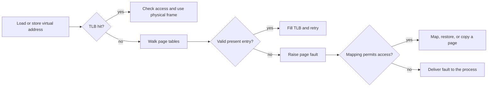

<TLDR>
  <TLDRCell label="what">
    <Term id="virtual-memory">Virtual memory</Term> gives each process a protected address space whose pages can be backed by RAM, files, swap, or nothing until first use.
  </TLDRCell>
  <TLDRCell label="trap">
    A successful allocation or a large virtual size does not prove that physical memory is resident, while a page fault does not by itself mean a crash or disk access.
  </TLDRCell>
  <TLDRCell label="fix">
    Follow the chain from mapping and page permissions to residency, reclaim, cgroup limits, and the exact fault signal; measure the working set under the real workload.
  </TLDRCell>
</TLDR>

## What it is and why it exists

Virtual memory is the translation layer between addresses used by a running program and the storage that currently holds their contents. An address such as `0x7ffd...` is meaningful inside one process's virtual address space. It is not a direct label for a RAM chip location, and the same numeric address in another process can name unrelated data.

The operating system and the processor's memory-management unit divide an address space into pages. Page tables describe whether a virtual page is present, which physical frame backs it, and whether the current access may read, write, or execute. The kernel owns these mappings; ordinary code sees a mostly contiguous address model even when the backing frames are scattered.

This indirection solves several concrete problems. A process can be relocated without rewriting every pointer, inaccessible pages can guard one process from another, and selected pages can be shared deliberately. File contents can also appear as memory, while pages that are not currently useful can be reclaimed and restored later.

Virtual memory does not create unlimited memory. Address-space capacity, physical RAM, swap, allocator metadata, page tables, commit policy, resource limits, and cgroup limits are separate constraints. A machine can have free virtual addresses but no acceptable backing for another write, or enough host RAM while one container has reached its own limit.

You meet the abstraction whenever an allocator returns memory, a loader maps an executable or shared library, a process calls `mmap()`, or a debugger reports an invalid address. It also explains why process monitors disagree: virtual size counts mapped address ranges, while residency metrics count some form of present physical pages.

Memory failures therefore cross layers. `new` can reject a request immediately, a later write can fault while materializing a promised page, reclaim can stall the thread, a cgroup can kill a process, and an invalid pointer can raise `SIGSEGV`. The source line alone does not tell you which path occurred.

During an incident, "how much memory did this process allocate?" is only the starting point. Ask which ranges it mapped, which pages it touched, which pages remain resident, which are shared, what can be reclaimed, and which limit applies. Those distinctions turn a vague memory incident into testable hypotheses.

## How it works

### Address spaces and mappings

A process receives a set of virtual address ranges called mappings or virtual memory areas. Each range has boundaries, access permissions, and a backing policy. Executable code, read-only constants, writable data, stacks, allocator arenas, shared libraries, and memory-mapped files usually occupy different ranges.

The familiar "stack and heap" picture is only a sketch. A runtime may create several thread stacks and allocator arenas, reserve large sparse regions, or map files directly. Address-space layout randomization also moves many ranges between executions, so hard-coded addresses are not a valid interface.

On Linux, `/proc/<pid>/maps` shows ranges and permissions, while `/proc/<pid>/smaps` adds per-range accounting. Reading these files is observation, not ownership. Access depends on credentials, namespaces, and procfs policy, and the numbers can change while you read them.

### Pages and translation

A virtual address is conceptually split into a virtual page number and an offset within that page. Translation changes the page number into a physical frame number but preserves the offset. The system's base page size is architecture and configuration dependent; `sysconf(_SC_PAGESIZE)` asks the running system instead of assuming 4 KiB.

Page-table entries carry more than a frame number. They can record presence, writable and executable permissions, accessed and dirty state, and architecture-specific controls. Operating systems also keep mapping metadata that says what should happen when an entry is absent.

The processor caches recent translations in a translation lookaside buffer, or TLB. A TLB hit avoids walking the page-table hierarchy. This cache is distinct from CPU data caches and the operating system's page cache, even though all three affect memory-access latency.



The diagram separates a TLB miss from a page fault. A page-table walk can find a valid present entry and continue without kernel fault handling. Conversely, a present page with incompatible permissions can still fault on a write or instruction fetch.

### Reservation, commitment, and residency

An allocator usually manages blocks inside mappings obtained from the operating system. A successful `malloc()` or `new` says that the allocator accepted the request according to its current policy. It does not universally say that every page has a private physical frame ready, that swap exists, or that a future access cannot be killed by an external limit.

Mapping a large anonymous range can initially reserve address space and metadata. Physical pages are commonly supplied on demand when code first reads or writes them. Zero-filled reads may use a shared zero page, while the first write needs private storage.

Commit policy decides how aggressively the kernel promises backing for writable mappings. The details vary across operating systems and Linux configurations. Portable application logic should still treat allocation failure, mapping failure, and process termination as distinct outcomes rather than assuming one universal reservation contract.

### Anonymous memory, files, and swap

Anonymous pages hold data with no file as their durable source, such as many heap and stack pages. File-backed pages represent bytes from an executable, shared library, or mapped data file. Both can be resident in RAM; "file-backed" does not mean every access reaches a storage device.

The page cache keeps file contents in physical memory so later file reads or mapped accesses can reuse them. A clean file-backed page can often be discarded because the file can supply it again. A dirty file-backed page normally needs writeback before its frame can be reused.

Dirty anonymous data has no original file copy. If the system supports and chooses swapping, it can write such a page to swap and restore it later. Without usable swap, reclaim must find other pages, throttle work, reject requests, or invoke an out-of-memory policy when pressure cannot be resolved.

| Page kind | Recoverable source | Typical reclaim action |
| --- | --- | --- |
| Clean file-backed | File or executable | Drop the frame and read again if needed |
| Dirty file-backed | Modified file data | Write back, then drop when safe |
| Clean anonymous zero page | Known zero content | Recreate or remap a shared zero page |
| Dirty anonymous | No ordinary source file | Keep resident, compress, or write to swap |
| Pinned or locked | Owner requires residency | Not normally reclaimable until unpinned |

This table is a model, not a fixed eviction order. Kernel policy considers recent use, dirty state, writeback cost, NUMA placement, memory-control groups, and other constraints. Application evidence must come from the target system.

### Faults are control flow

A <Term id="page-fault">page fault</Term> is a processor exception that asks the kernel to resolve a memory access. A minor fault can map an already available page without reading it from storage. A major fault requires I/O according to the accounting interface, but even that metric needs a stated operating system and measurement source.

Demand-zero allocation, file pages already in cache, and <Term id="copy-on-write">copy-on-write</Term> can all produce recoverable faults. The kernel installs or changes a page-table entry and restarts the instruction. These faults are normal behavior, though a high fault rate can still cost time.

If no mapping covers the address, or its permissions reject the access, the kernel cannot satisfy the instruction under that mapping contract. Linux commonly delivers `SIGSEGV` or `SIGBUS`, depending on the cause. That terminal memory fault is different from an out-of-memory kill, which is a resource policy decision rather than an invalid-address report.

### Measurements describe different sets

Virtual size sums address ranges and can include untouched reservations, file mappings, shared libraries, and guard regions. <Term id="resident-set-size">Resident set size (RSS)</Term> estimates pages from the process that are currently resident, but shared pages may be counted in several processes. Proportional set size divides shared-page cost among mappers and is often more useful for aggregate attribution.

Even proportional accounting is a sampled view of changing state. Allocator caches can keep pages mapped after application objects die, and a garbage-collected runtime can retain capacity for reuse. A leak is an ownership pattern over time, not one large snapshot.

Working set means the pages a workload actively needs over a relevant interval. When that set fits available physical memory, inactive cache can be reclaimed with limited refaulting. When it does not fit, repeated eviction and refault can dominate useful work, a condition often called thrashing.

<Term id="cache-locality">Cache locality</Term> still matters inside this model. Sequential access may reuse cache lines, TLB entries, and nearby pages more effectively than pointer chasing. Big-O space or time does not express those physical effects, so representation choices need workload measurements.

## Examples

The examples use Linux process interfaces from small C++23 programs. They were compiled locally with GCC 13.3.0 using `g++ -std=c++23 -Wall -Wextra -pedantic`; the displayed output came from Linux 7.0.0-30-generic on a system with 4096-byte base pages.

### Inspect the shape without printing unstable addresses

This program reads its own `/proc/self/maps`. It reports stable properties of this run instead of copying randomized address ranges into the lesson.

<Depth level="quick">

```cpp run title="address_space.cpp"
#include <fstream>
#include <iostream>
#include <string>
#include <unistd.h>

int main() {
    std::ifstream maps("/proc/self/maps");
    if (!maps) {
        std::cerr << "cannot read /proc/self/maps\n";
        return 1;
    }
    bool has_heap = false;
    bool has_stack = false;
    bool has_executable = false;

    std::string line;
    while (std::getline(maps, line)) {
        has_heap = has_heap || line.contains("[heap]");
        has_stack = has_stack || line.contains("[stack]");

        const auto separator = line.find(' ');
        if (separator != std::string::npos && line.size() > separator + 3) {
            has_executable = has_executable || line[separator + 3] == 'x';
        }
    }

    std::cout << "page_size=" << sysconf(_SC_PAGESIZE) << '\n';
    std::cout << std::boolalpha;
    std::cout << "has_heap_mapping=" << has_heap << '\n';
    std::cout << "has_stack_mapping=" << has_stack << '\n';
    std::cout << "has_executable_mapping=" << has_executable << '\n';
}
```

```text
page_size=4096
has_heap_mapping=true
has_stack_mapping=true
has_executable_mapping=true
```

<TryToBreak items={['a system with a different base page size', 'a container with restricted procfs access', 'a non-Linux operating system']} />

</Depth>

The output proves only that this process had mappings labelled as a heap and stack and at least one executable range when sampled. It does not say that every byte in those ranges was resident. Another runtime or allocator can organize mappings differently while still implementing the same language behavior.

The program queries page size rather than embedding `4096`. It also avoids treating any displayed address as durable. A debugger can use exact ranges from the current process, but application configuration should not.

### Materialize anonymous pages on first write

`mmap()` creates a private anonymous range for 64 base pages. The loop writes one byte in each page, then `getrusage()` reports faults incurred between the two snapshots.

```cpp run title="touch_pages.cpp"
#include <cstddef>
#include <iostream>
#include <sys/mman.h>
#include <sys/resource.h>
#include <unistd.h>

int main() {
    const auto page_size = static_cast<std::size_t>(sysconf(_SC_PAGESIZE));
    constexpr std::size_t page_count = 64;
    const std::size_t length = page_size * page_count;

    auto* memory = static_cast<unsigned char*>(mmap(
        nullptr, length, PROT_READ | PROT_WRITE,
        MAP_PRIVATE | MAP_ANONYMOUS, -1, 0));
    if (memory == MAP_FAILED) return 1;

    rusage before{};
    rusage after{};
    getrusage(RUSAGE_SELF, &before);

    std::size_t checksum = 0;
    for (std::size_t page = 0; page < page_count; ++page) {
        memory[page * page_size] = 1;
        checksum += memory[page * page_size];
    }

    getrusage(RUSAGE_SELF, &after);
    std::cout << "mapped_pages=" << page_count << '\n';
    std::cout << "checksum=" << checksum << '\n';
    std::cout << "minor_faults_delta=" << after.ru_minflt - before.ru_minflt << '\n';
    std::cout << "major_faults_delta=" << after.ru_majflt - before.ru_majflt << '\n';

    munmap(memory, length);
}
```

```text
mapped_pages=64
checksum=64
minor_faults_delta=64
major_faults_delta=0
```

On this run, first writes caused 64 minor faults and no major faults. The checksum keeps the memory operations observable. The exact fault count is not a C++ or Linux API guarantee because page size, huge-page policy, prior activity, and kernel fault handling can change it.

The range was large enough to cover 64 pages as soon as `mmap()` succeeded, but those pages did not all need private frames at that instant. First writes materialized them. Repeating the loop over already-present pages would test a different state and should not be described as allocation cost.

### Observe copy-on-write isolation after `fork()`

Before `fork()`, the process writes `A` into a private anonymous mapping. The child changes its view to `C` and sends that byte through a pipe; the parent then reads its own mapping.

```cpp run title="copy_on_write.cpp"
#include <iostream>
#include <sys/mman.h>
#include <sys/wait.h>
#include <unistd.h>

int main() {
    const long page_size = sysconf(_SC_PAGESIZE);
    auto* page = static_cast<char*>(mmap(
        nullptr, page_size, PROT_READ | PROT_WRITE,
        MAP_PRIVATE | MAP_ANONYMOUS, -1, 0));
    if (page == MAP_FAILED) return 1;
    page[0] = 'A';

    int channel[2];
    if (pipe(channel) == -1) return 1;
    const pid_t child = fork();
    if (child == -1) return 1;

    if (child == 0) {
        close(channel[0]);
        page[0] = 'C';
        if (write(channel[1], page, 1) != 1) _exit(2);
        close(channel[1]);
        _exit(0);
    }

    close(channel[1]);
    char child_value = '?';
    const ssize_t bytes = read(channel[0], &child_value, 1);
    close(channel[0]);
    int status = 0;
    waitpid(child, &status, 0);

    std::cout << "child_value=" << child_value << '\n';
    std::cout << "parent_value=" << page[0] << '\n';
    std::cout << "transfer_ok=" << std::boolalpha << (bytes == 1) << '\n';
    munmap(page, page_size);
}
```

```text
child_value=C
parent_value=A
transfer_ok=true
```

After `fork()`, both processes initially have mappings with the same content. Linux can keep physical pages shared while their mappings are private and unchanged. The child's write causes copy-on-write handling, so the parent continues to observe `A`.

This example demonstrates isolation, not the exact number of copied bytes or page faults. Page granularity, huge pages, and kernel policy affect physical work. It also uses a pipe because the child's ordinary variables and output buffers are not a shared result channel.

## Pitfalls

### Treating virtual size as physical consumption

> [!PITFALL]
> A dashboard labels virtual size as "memory used," and an alert fires when a runtime reserves a large sparse arena. The range may be mostly untouched, file-backed, shared, or protected guard space.

**Fix:** compare mapping boundaries with RSS, proportional set size, private dirty pages, and cgroup charge. Sample the same workload over time, and attribute growth to specific ranges or allocation stacks before declaring a leak.

### Assuming successful allocation settles the budget

> [!PITFALL]
> Generated code treats a non-null allocation as proof that all requested bytes are physically available. It then touches the range during a latency-sensitive request and encounters page-fault stalls or a memory-limit kill.

**Fix:** validate sizes for overflow, bound the admitted workload, and decide whether memory must be prefaulted outside the critical path. Test under the production cgroup or resource limit, including concurrent requests and the configured swap policy.

### Calling reusable page cache a leak

> [!PITFALL]
> Low `free` memory leads an operator to drop caches or restart a healthy service. The system was using otherwise idle RAM for file data that it could reclaim.

**Fix:** inspect available memory, reclaim and refault rates, I/O pressure, private dirty growth, and workload latency together. Remove an application cache only when its ownership and hit-rate evidence show that its retained data is the problem.

### Collapsing every memory failure into OOM

> [!PITFALL]
> A `SIGSEGV`, `std::bad_alloc`, major-fault spike, and cgroup OOM event are reported as one "out of memory" condition. These outcomes have different causes and repairs.

**Fix:** preserve the exact signal or exception, fault address and access type when available, allocator error, kernel log, and cgroup `memory.events`. Reconcile the address with the process map before changing capacity.

### Applying machine-wide tuning without a workload

> [!PITFALL]
> Disabling swap, forcing huge pages, locking memory, or changing overcommit globally is offered as a universal performance fix. The change shifts failure modes and can harm unrelated services.

**Fix:** state the target latency, working-set size, fault pattern, cgroup boundary, and rollback condition. Reproduce the pressure in an isolated environment, change one policy at a time, and retain before-and-after fault, reclaim, I/O, and latency measurements.

<Depth level="deep">

## Page faults, reclaim, and failure paths

### Page-table walks and TLB reach

Modern page tables are usually hierarchical because a flat table for every possible virtual page would waste memory. Successive groups of virtual-address bits select entries at successive levels, and the final offset selects a byte inside the mapped page. Large-page entries can terminate the walk earlier and cover a wider range.

Page-table memory is real overhead. A sparse reservation may need little lower-level page-table storage until more of the range is populated, while touching scattered pages can allocate additional table pages. Virtual size alone therefore cannot predict page-table cost.

TLB reach is the amount of memory whose translations fit in the processor's TLB at once. Larger pages can increase reach and reduce translation misses, but they also change allocation granularity, internal waste, compaction pressure, and copy-on-write cost. A huge-page policy needs measurements rather than a promise that fewer TLB misses always wins.

Changing a mapping or its permissions may require invalidating cached translations on several CPUs. That coordination can be visible in workloads that map, unmap, or protect ranges frequently. It is another reason to separate useful data access from mapping churn during profiling.

### A demand-fault sequence

For a permitted access to a non-present anonymous page, a simplified path is:

1. The processor cannot complete translation and records the faulting address and access type.
2. The kernel locates the virtual memory area covering that address.
3. It checks that the mapping permits the read, write, or instruction fetch.
4. It finds or allocates suitable backing, such as a zero page, private frame, cached file page, or swapped page.
5. It installs a page-table entry and updates accounting.
6. The processor retries the instruction, which now observes the mapping.

Several branches can sleep, perform I/O, reclaim another page, or fail. The application usually does not receive a callback for a successfully resolved ordinary fault, but its latency includes the work. A profiler or operating-system counter is needed to see the path.

A fault can also be a deliberate interface. Guard pages detect stack overflow or out-of-bounds access by withholding permission, and copy-on-write starts with a read-only shared mapping so a write traps into the kernel. Treating all faults as bugs would erase these designs.

### Reclaim and refault

Under pressure, the kernel looks for physical frames it can repurpose. Recently used information helps approximate which pages are likely to matter again, but hardware access bits, reclaim generations, cgroup policy, and kernel version shape the implementation. Application code should rely on observed behavior and documented controls, not one timeless LRU story.

Dropping a clean cached file page frees a frame without first writing page contents. If code needs the data again, the kernel can find it in the file, but the resulting I/O may be expensive. A high refault rate says the system discarded pages that soon became useful again.

Dirty pages need somewhere for their modified contents. File-backed data can be written to its file according to filesystem and writeback rules. Anonymous data may go to swap or compressed memory if configured; otherwise it competes for residency until it is freed or the system takes another failure path.

Reclaim work can be asynchronous or charged directly to an allocating thread. A request can therefore slow down before any allocation API returns an error. Correlate application tail latency with reclaim stalls, page faults, and storage pressure instead of looking only for crashes.

### Copy-on-write and post-fork growth

Private mappings inherited across `fork()` commonly begin by referring to the same physical pages. Page-table permissions arrange for a later write to fault. The kernel then gives the writer a private copy or otherwise preserves the required private semantics.

This makes process creation cheaper than eagerly copying all present data, but it does not make child memory free. If parent and child both modify much of a large resident heap, sharing falls and total physical use can rise sharply. Background threads and runtime housekeeping can dirty pages that application code expected to remain shared.

Metrics can make the transition look confusing. Each process's RSS can include a shared page, while proportional accounting divides it. After copy-on-write, two private pages replace the shared relationship, so aggregate charge changes even if each process keeps the same virtual address and content size.

Forking a large multithreaded runtime also has correctness constraints beyond memory accounting. Only async-signal-safe work is generally safe in the child before an immediate `exec()` in many environments. Choose a supported process-launch API rather than treating copy-on-write savings as the only design criterion.

### Swap is a policy tool, not extra RAM

Swap provides backing for some anonymous pages and can preserve file cache or absorb cold application state. It is much slower than RAM and shares bandwidth with other storage work on many systems. Its presence can delay an OOM event, but sustained swapping can make latency unacceptable long before capacity is technically exhausted.

No swap changes the available failure paths; it does not guarantee predictable low latency. The system can still reclaim file cache, perform direct reclaim, throttle, or kill work under pressure. Conversely, some latency-sensitive deployments keep swap with strict monitoring because an occasional cold-page eviction is preferable to an abrupt kill.

Judge the policy at the actual boundary. A host may have swap while a memory cgroup limits or accounts it separately, and a container's `/proc/meminfo` view may not describe its usable allowance. Record `memory.current`, configured maxima, swap controls, and `memory.events` with host pressure data.

### Allocation failure, OOM, and invalid access

An allocation request can fail because its size is impossible, size arithmetic wrapped, the address space is fragmented or exhausted, a resource limit applies, or the allocator cannot extend its arenas. Checked arithmetic belongs before the request. A wrapped byte count can create a small allocation followed by a large out-of-bounds write, which is a correctness and security defect rather than ordinary pressure.

An OOM policy begins after the kernel cannot satisfy a request under the applicable reclaim and constraint rules. Linux may select a process to kill at the system or memory-cgroup scope. The victim need not be the thread whose source line best explains the growth, so retain allocation ownership data and cgroup membership.

Invalid access follows an address and permission path instead. Use the signal metadata, core dump, sanitizer report, and current mappings to ask whether the address was unmapped, outside an object, read-only, non-executable, or backed by a truncated file. Buying more RAM does not repair a dangling pointer.

Recovery promises must match the runtime. Catching `std::bad_alloc` can handle some immediate C++ allocation failures, but it cannot make arbitrary code safe after heap corruption or intercept an external `SIGKILL`. Reserve a narrow emergency path only when it has been designed and tested without further unbounded allocation.

### A diagnostic evidence table

| Observation | Useful next evidence | What it does not prove |
| --- | --- | --- |
| Virtual size rises | `/proc/<pid>/maps`, range owner, reservation policy | Physical use or a leak |
| RSS rises | `smaps` categories, private dirty pages, PSS, cgroup charge | Which object retained the page |
| Minor faults rise | Faulting stacks, first-touch phase, copy-on-write activity | Storage reads or failure |
| Major faults rise | File or swap I/O, refaults, storage latency | Invalid pointer access |
| `memory.events` changes | cgroup limits, pressure, OOM records, peer workloads | Host-wide exhaustion |
| `SIGSEGV` or `SIGBUS` | Fault address, access type, maps, core or sanitizer trace | Out-of-memory pressure |

Start with a timeline and one boundary. A process snapshot, host-wide `free`, and container event counter describe different scopes. Normalize them to the same process generation, cgroup, namespace, and time interval before drawing a causal link.

Prefer counters that answer the current hypothesis. `vmstat` can expose system paging and runnable pressure, `pidstat -r` can follow process faults and residency, and `/proc/<pid>/smaps_rollup` can summarize mapping categories. Tools and fields vary, so record their versions and exact commands in an incident report.

Heap profilers and garbage-collector reports answer ownership questions above the mapping layer. They may show live objects, retained paths, native allocations, or allocator arenas, but they do not replace kernel residency data. Reconcile both views when application objects shrink while RSS remains high.

### Testing memory contracts

Turn a memory expectation into a budget with named terms. Include maximum input bytes, decoded expansion, per-request state, cache capacity, concurrency, allocator overhead, and a margin for code, stacks, page tables, and shared runtime state. State whether the limit concerns virtual range, commit, resident charge, or peak total.

Test at the same enforcement boundary used in production. A host with abundant RAM will not reproduce a cgroup kill at `memory.max`, and a unit test that allocates without touching pages will miss first-touch cost. Include warm and cold cache states, concurrent peaks, cancellation, and cleanup after partial failure.

Measure latency as well as survival. A workload that avoids OOM by spending seconds in direct reclaim has still violated a millisecond service objective. Capture fault and reclaim counters beside request percentiles so the tradeoff is visible.

Finally, test release and reuse. After the workload subsides, determine whether application ownership falls, whether the allocator retains reusable arenas, and whether the kernel reclaims pages under pressure. A stable high-water mark can be acceptable; an unbounded owner with the same surface metric is not.

</Depth>

<Checkpoint id="foundations/virtual-memory" />

## Further reading

- [Linux kernel documentation: memory-management concepts](https://docs.kernel.org/admin-guide/mm/concepts.html)
- [Linux kernel documentation: page tables](https://docs.kernel.org/mm/page_tables.html)
- [Linux kernel documentation: the `/proc` filesystem](https://docs.kernel.org/filesystems/proc.html)
- [Linux man-pages: `mmap(2)`](https://man7.org/linux/man-pages/man2/mmap.2.html)
- [Linux man-pages: `/proc/<pid>/smaps`](https://man7.org/linux/man-pages/man5/proc_pid_smaps.5.html)
