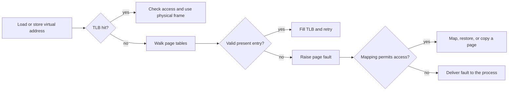

<TLDR>
  <TLDRCell label="what">
    <Term id="virtual-memory">虚拟内存（virtual memory）</Term>为每个进程提供受保护的地址空间，其中的页可以由RAM、文件、交换空间提供后备，也可以等到首次使用时再取得后备。
  </TLDRCell>
  <TLDRCell label="trap">
    分配成功或虚拟内存很大，并不能证明物理内存已经驻留；发生缺页也不一定表示程序崩溃或访问了磁盘。
  </TLDRCell>
  <TLDRCell label="fix">
    从映射与页权限开始，依次检查驻留、回收、cgroup限制和具体故障信号；在真实工作负载下测量工作集。
  </TLDRCell>
</TLDR>

## 是什么，为什么存在

虚拟内存是运行中程序所用地址与当前保存内容的存储位置之间的转换层。`0x7ffd...`这样的地址只在某个进程的虚拟地址空间中有意义。它不是RAM芯片位置的直接标签；另一个进程中的相同数值地址可以表示毫不相关的数据。

操作系统与处理器的内存管理单元把地址空间分成页。页表描述虚拟页是否存在、由哪个物理页框提供后备，以及当前访问能否读取、写入或执行。映射由内核管理；即使后备页框分散，普通代码看到的地址模型仍大体连续。

这层间接关系解决了几个具体问题。进程可以移动位置，而不必重写每个指针；不可访问的页可以把不同进程隔离开；指定的页也可以有意共享。文件内容还能表现为内存，当前用不到的页则可以回收，之后再恢复。

虚拟内存不会创造无限容量。地址空间容量、物理RAM、交换空间、分配器元数据、页表、提交策略、资源限制与cgroup限制是不同约束。机器可能仍有空闲虚拟地址，却无法为下一次写入提供可接受的后备；主机RAM也可能充足，但某个容器已经达到自身限制。

分配器返回内存、加载器映射可执行文件或共享库、进程调用`mmap()`，以及调试器报告非法地址时，都会遇到这层抽象。它也解释了进程监控工具为何给出不同数字：虚拟大小统计映射的地址范围，驻留指标则统计某种意义上的现存物理页。

因此，内存故障会跨越多个层次。`new`可以立即拒绝请求，之后的写入可能在兑现已承诺页面时发生缺页，回收可能阻塞线程，cgroup可以终止进程，非法指针则可能触发`SIGSEGV`。只看源码行无法判断实际走了哪条路径。

发生事故时，“这个进程分配了多少内存”只是起点。还要问它映射了哪些范围、接触了哪些页、哪些页仍驻留、哪些页共享、哪些内容可以回收，以及哪个限制正在生效。这些区别能把模糊的内存事故变成可以验证的假设。

## 工作原理

### 地址空间与映射

进程得到一组虚拟地址范围，称为映射或虚拟内存区域。每个范围都有边界、访问权限和后备策略。可执行代码、只读常量、可写数据、栈、分配器arena、共享库和内存映射文件通常位于不同范围。

常见的“栈和堆”示意图只是简化模型。运行时可能创建多个线程栈和分配器arena、预留大型稀疏区域，或者直接映射文件。地址空间布局随机化还会在各次执行之间移动许多范围，因此硬编码地址不是有效接口。

在Linux上，`/proc/<pid>/maps`显示范围与权限，`/proc/<pid>/smaps`则增加逐范围统计。读取这些文件只是在观察，并不表示所有权。访问能力取决于凭据、命名空间和procfs策略，数字还可能在读取过程中变化。

### 页与地址转换

从概念上说，虚拟地址由虚拟页号和页内偏移组成。地址转换把虚拟页号换成物理页框号，但保留页内偏移。系统的基础页大小取决于体系结构与配置；应使用`sysconf(_SC_PAGESIZE)`查询运行中的系统，而不是假定为4 KiB。

页表项不只保存页框号。它还可以记录页是否存在、能否写入和执行、是否被访问或修改，以及体系结构特有的控制信息。操作系统还会保留映射元数据，用来决定页表项缺失时应当怎样处理。

处理器会在转译后备缓冲器（translation lookaside buffer，TLB）中缓存近期地址转换。TLB命中可以避免遍历页表层级。它与CPU数据缓存、操作系统页缓存是三种不同缓存，尽管三者都会影响内存访问延迟。



图中区分了TLB未命中与缺页。页表遍历可以找到有效的现存页表项，不需要内核处理缺页就能继续。反过来，页即使已经存在，写入或取指权限不匹配时仍会触发故障。

### 预留、提交与驻留

分配器通常在从操作系统取得的映射中管理内存块。`malloc()`或`new`成功，表示分配器按照当前策略接受了请求。它不一定表示每个页都已经准备好私有物理页框、系统存在交换空间，或者未来访问不会被外部限制终止。

映射大型匿名区域时，最初可能只预留地址空间和元数据。物理页通常按需提供，在代码首次读取或写入时才出现。填零读取可以使用共享零页，首次写入则需要私有存储。

提交策略决定内核承诺可写映射后备时有多激进。不同操作系统和Linux配置的细节并不相同。可移植的应用逻辑仍应把分配失败、映射失败和进程终止视为不同结果，不能假定一种通用的预留契约。

### 匿名内存、文件与交换空间

匿名页保存没有文件作为持久来源的数据，例如许多堆页和栈页。文件后备页表示可执行文件、共享库或映射数据文件中的字节。两者都可以驻留在RAM中；“文件后备”不表示每次访问都会到达存储设备。

页缓存把文件内容保留在物理内存中，后续文件读取或映射访问就能复用。干净的文件后备页通常可以直接丢弃，因为文件能够再次提供内容。脏的文件后备页一般要先回写，之后才能复用它的页框。

脏的匿名数据没有原始文件副本。如果系统支持并选择换页，可以把这类页写入交换空间，之后再恢复。没有可用交换空间时，回收必须寻找其他页、限制工作速度、拒绝请求；压力无法化解时，也可能启动内存耗尽策略。

| 页类型 | 可恢复来源 | 常见回收动作 |
| --- | --- | --- |
| 干净文件后备页 | 文件或可执行文件 | 丢弃页框，需要时再次读取 |
| 脏文件后备页 | 已修改的文件数据 | 回写，安全后再丢弃 |
| 干净匿名零页 | 已知的全零内容 | 重建或重新映射共享零页 |
| 脏匿名页 | 没有普通来源文件 | 保持驻留、压缩或写入交换空间 |
| 固定或锁定页 | 所有者要求驻留 | 解除固定之前通常不能回收 |

这张表是分析模型，不是固定的淘汰顺序。内核策略会考虑近期使用情况、脏状态、回写成本、NUMA位置、内存控制组和其他约束。应用证据必须来自目标系统。

### 缺页也是控制流

<Term id="page-fault">缺页（page fault）</Term>是处理器异常，请求内核处理一次内存访问。次缺页不必从存储读取，就能映射已经可用的页。主缺页按照统计接口的定义需要I/O，但解释这一指标时仍要说明操作系统与测量来源。

按需填零分配、已经在缓存中的文件页和<Term id="copy-on-write">写时复制（copy-on-write）</Term>都可能产生可恢复缺页。内核安装或修改页表项，再重新执行指令。这些缺页属于正常行为，但很高的缺页率仍然可能耗时。

如果没有映射覆盖该地址，或者映射权限拒绝访问，内核就无法按映射契约满足指令。根据原因，Linux通常会发送`SIGSEGV`或`SIGBUS`。这种终止性内存故障不同于内存耗尽终止；后者是资源策略决定，不是非法地址报告。

### 不同指标描述不同集合

虚拟大小汇总地址范围，可能包含从未接触的预留区域、文件映射、共享库和保护页。<Term id="resident-set-size">驻留集大小（resident set size，RSS）</Term>估算进程中当前驻留的页，但共享页可能在多个进程中重复统计。比例集大小会在各映射者之间分摊共享页成本，做汇总归因时通常更有用。

即使比例统计也只是不断变化状态的一次采样。应用对象消失后，分配器缓存仍可能让页保持映射；垃圾回收运行时也可能保留容量以便复用。内存泄漏是所有权随时间变化的模式，不能由一张大快照确定。

工作集指工作负载在某段相关时间内活跃使用的页。当工作集能放入可用物理内存时，可以回收不活跃缓存，而不产生大量再次缺页。工作集放不下时，反复淘汰与再次缺页可能占据大部分运行时间，这种状态通常称为颠簸。

这个模型中仍要考虑<Term id="cache-locality">缓存局部性（cache locality）</Term>。顺序访问可能比指针追踪更有效地复用缓存行、TLB项和相邻页。Big-O空间或时间不会表达这些物理影响，因此数据表示仍需根据工作负载测量。

## 示例

下面的示例通过几个小型C++23程序使用Linux进程接口。它们在本地使用GCC 13.3.0与`g++ -std=c++23 -Wall -Wextra -pedantic`编译；显示的输出来自基础页为4096字节的Linux 7.0.0-30-generic。

### 检查形状，但不输出不稳定地址

这个程序读取自己的`/proc/self/maps`。它报告本次运行中的稳定性质，不会把随机化的地址范围复制到教程里。

<Depth level="quick">

```cpp run title="address_space.cpp"
#include <fstream>
#include <iostream>
#include <string>
#include <unistd.h>

int main() {
    std::ifstream maps("/proc/self/maps");
    if (!maps) {
        std::cerr << "cannot read /proc/self/maps\n";
        return 1;
    }
    bool has_heap = false;
    bool has_stack = false;
    bool has_executable = false;

    std::string line;
    while (std::getline(maps, line)) {
        has_heap = has_heap || line.contains("[heap]");
        has_stack = has_stack || line.contains("[stack]");

        const auto separator = line.find(' ');
        if (separator != std::string::npos && line.size() > separator + 3) {
            has_executable = has_executable || line[separator + 3] == 'x';
        }
    }

    std::cout << "page_size=" << sysconf(_SC_PAGESIZE) << '\n';
    std::cout << std::boolalpha;
    std::cout << "has_heap_mapping=" << has_heap << '\n';
    std::cout << "has_stack_mapping=" << has_stack << '\n';
    std::cout << "has_executable_mapping=" << has_executable << '\n';
}
```

```text
page_size=4096
has_heap_mapping=true
has_stack_mapping=true
has_executable_mapping=true
```

<TryToBreak items={['基础页大小不同的系统', '限制procfs访问的容器', '非Linux操作系统']} />

</Depth>

输出只能证明采样时这个进程具有标记为堆与栈的映射，并且至少有一个可执行范围。它不能证明这些范围中的每个字节都已驻留。其他运行时或分配器可以采用不同映射结构，同时仍保持相同语言行为。

程序查询页大小，没有硬编码`4096`。它也没有把显示出来的任何地址当成持久值。调试器可以使用当前进程的准确范围，应用配置却不应这样做。

### 在首次写入时兑现匿名页

`mmap()`为64个基础页创建私有匿名范围。循环向每一页写入一个字节，再由`getrusage()`报告两次快照之间发生的缺页。

```cpp run title="touch_pages.cpp"
#include <cstddef>
#include <iostream>
#include <sys/mman.h>
#include <sys/resource.h>
#include <unistd.h>

int main() {
    const auto page_size = static_cast<std::size_t>(sysconf(_SC_PAGESIZE));
    constexpr std::size_t page_count = 64;
    const std::size_t length = page_size * page_count;

    auto* memory = static_cast<unsigned char*>(mmap(
        nullptr, length, PROT_READ | PROT_WRITE,
        MAP_PRIVATE | MAP_ANONYMOUS, -1, 0));
    if (memory == MAP_FAILED) return 1;

    rusage before{};
    rusage after{};
    getrusage(RUSAGE_SELF, &before);

    std::size_t checksum = 0;
    for (std::size_t page = 0; page < page_count; ++page) {
        memory[page * page_size] = 1;
        checksum += memory[page * page_size];
    }

    getrusage(RUSAGE_SELF, &after);
    std::cout << "mapped_pages=" << page_count << '\n';
    std::cout << "checksum=" << checksum << '\n';
    std::cout << "minor_faults_delta=" << after.ru_minflt - before.ru_minflt << '\n';
    std::cout << "major_faults_delta=" << after.ru_majflt - before.ru_majflt << '\n';

    munmap(memory, length);
}
```

```text
mapped_pages=64
checksum=64
minor_faults_delta=64
major_faults_delta=0
```

这次运行中，首次写入产生了64次次缺页，没有主缺页。校验和让内存操作保持可观察。具体缺页数不是C++或Linux API的保证，因为页大小、大页策略、之前的活动与内核缺页处理都可能改变结果。

`mmap()`成功时，这个范围已经足够覆盖64个页，但当时不需要让每一页都取得私有页框。首次写入才兑现了它们。再次循环访问已经存在的页，测试的是另一种状态，不应称为分配成本。

### 观察`fork()`之后的写时复制隔离

调用`fork()`前，进程先向私有匿名映射写入`A`。子进程把自己的视图改为`C`，再通过管道发送这个字节；父进程随后读取自己的映射。

```cpp run title="copy_on_write.cpp"
#include <iostream>
#include <sys/mman.h>
#include <sys/wait.h>
#include <unistd.h>

int main() {
    const long page_size = sysconf(_SC_PAGESIZE);
    auto* page = static_cast<char*>(mmap(
        nullptr, page_size, PROT_READ | PROT_WRITE,
        MAP_PRIVATE | MAP_ANONYMOUS, -1, 0));
    if (page == MAP_FAILED) return 1;
    page[0] = 'A';

    int channel[2];
    if (pipe(channel) == -1) return 1;
    const pid_t child = fork();
    if (child == -1) return 1;

    if (child == 0) {
        close(channel[0]);
        page[0] = 'C';
        if (write(channel[1], page, 1) != 1) _exit(2);
        close(channel[1]);
        _exit(0);
    }

    close(channel[1]);
    char child_value = '?';
    const ssize_t bytes = read(channel[0], &child_value, 1);
    close(channel[0]);
    int status = 0;
    waitpid(child, &status, 0);

    std::cout << "child_value=" << child_value << '\n';
    std::cout << "parent_value=" << page[0] << '\n';
    std::cout << "transfer_ok=" << std::boolalpha << (bytes == 1) << '\n';
    munmap(page, page_size);
}
```

```text
child_value=C
parent_value=A
transfer_ok=true
```

`fork()`之后，两个进程的映射最初具有相同内容。只要私有映射没有修改，Linux就可以继续共享物理页。子进程写入时触发写时复制处理，所以父进程仍看到`A`。

这个示例展示的是隔离，不是复制的准确字节数或缺页数。页粒度、大页和内核策略都会影响物理工作。它还使用管道传递结果，因为子进程的普通变量与输出缓冲区不是共享结果通道。

## 陷阱

### 把虚拟大小当作物理占用

> [!PITFALL]
> 仪表盘把虚拟大小标成“已用内存”，运行时预留大型稀疏arena时就触发告警。该范围可能大部分从未接触，也可能由文件提供后备、与其他进程共享，或者只是受保护的守卫空间。

**修复：** 把映射边界与RSS、比例集大小、私有脏页和cgroup记账对照。在同一工作负载下持续采样；先把增长归因到具体范围或分配栈，再断定发生泄漏。

### 假定分配成功就解决了预算

> [!PITFALL]
> 生成代码把非空的分配结果当作所有请求字节都已物理可用的证明。之后，它在延迟敏感的请求中接触该范围，遇到缺页阻塞或内存限制终止。

**修复：** 检查大小计算是否溢出，限制接纳的工作量，并决定是否要在关键路径之外预先触页。测试必须使用生产环境的cgroup或资源限制，还要包含并发请求与实际配置的交换策略。

### 把可复用页缓存称为泄漏

> [!PITFALL]
> `free`很低，运维人员便丢弃缓存或重启健康服务。系统其实只是在用闲置RAM缓存文件数据，需要时可以回收。

**修复：** 同时检查可用内存、回收与再次缺页速率、I/O压力、私有脏页增长和工作负载延迟。只有所有权与命中率证明确实是应用缓存保留的数据造成问题时，才应删除该缓存。

### 把所有内存故障都归为OOM

> [!PITFALL]
> `SIGSEGV`、`std::bad_alloc`、主缺页激增和cgroup OOM事件都被报告成同一种“内存不足”。这些结果的原因与修复方式并不相同。

**修复：** 保留准确的信号或异常、可取得时的故障地址与访问类型、分配器错误、内核日志，以及cgroup的`memory.events`。改变容量前，先把地址与进程映射对应起来。

### 脱离工作负载修改整机策略

> [!PITFALL]
> 禁用交换空间、强制使用大页、锁定内存或全局修改overcommit，被当成通用性能修复。这些变化会转移故障方式，还可能损害无关服务。

**修复：** 写明目标延迟、工作集大小、缺页模式、cgroup边界和回滚条件。在隔离环境中复现压力，每次只改变一项策略，并保留修改前后的缺页、回收、I/O和延迟测量。

<Depth level="deep">

## 缺页、回收与故障路径

### 页表遍历与TLB覆盖范围

现代页表通常采用层级结构，因为为每个可能的虚拟页建立扁平表会浪费内存。虚拟地址中连续的几组位依次选择各层条目，最后的偏移选择映射页中的字节。大页条目可以更早结束遍历，并覆盖更宽范围。

页表内存本身也是真实开销。稀疏预留区域在大量页真正出现之前，可能只需要少量底层页表存储；接触分散的页则可能分配更多页表页。因此，虚拟大小不能单独预测页表成本。

TLB覆盖范围是处理器的TLB能同时保存地址转换的内存量。大页可以扩大覆盖范围并减少转换未命中，但也会改变分配粒度、内部浪费、内存规整压力和写时复制成本。大页策略需要测量，不能只凭“TLB未命中更少一定更快”来决定。

修改映射或权限时，可能需要让多个CPU上缓存的地址转换失效。频繁映射、解除映射或修改保护的工作负载能观察到这种协调成本。这也是性能分析时应区分有效数据访问与映射抖动的原因。

### 一次请求缺页的过程

对于允许访问但尚未存在的匿名页，可以把简化流程写成：

1. 处理器无法完成地址转换，记录故障地址与访问类型。
2. 内核找到覆盖该地址的虚拟内存区域。
3. 内核检查映射是否允许读取、写入或取指。
4. 内核寻找或分配合适后备，例如零页、私有页框、已缓存文件页或交换出去的页。
5. 内核安装页表项并更新统计。
6. 处理器重试指令，此时指令能看到该映射。

其中几条分支可能休眠、执行I/O、回收另一个页，或者失败。普通缺页成功解决时，应用通常收不到回调，但它的延迟仍包含这些工作。必须借助分析器或操作系统计数器才能看到这条路径。

故障也可以是有意设计的接口。守卫页通过拒绝权限检测栈溢出或越界访问；写时复制则从只读共享映射开始，让写入陷入内核。把所有故障都视为bug，会忽略这些设计。

### 回收与再次缺页

发生压力时，内核会寻找可以改作他用的物理页框。近期使用信息有助于近似判断哪些页可能再次用到，但硬件访问位、回收代次、cgroup策略和内核版本都会影响实现。应用代码应依赖观察结果与文档化控制，不能依赖一套永远不变的LRU故事。

丢弃干净的缓存文件页不必先写出页内容，就能释放页框。如果代码再次需要数据，内核可以从文件中找到它，但产生的I/O可能很昂贵。再次缺页率很高，说明系统丢弃的页很快又派上了用场。

脏页需要存放修改后内容的位置。文件后备数据可以按照文件系统与回写规则写回文件。匿名数据可以在配置允许时进入交换空间或压缩内存；否则，它会持续竞争驻留空间，直到被释放或系统选择另一条故障路径。

回收工作可以异步执行，也可能直接计入发起分配的线程。于是，请求可能在任何分配API返回错误前就开始变慢。应把应用尾延迟与回收阻塞、缺页和存储压力关联起来，不能只寻找崩溃。

### 写时复制与`fork()`后的增长

通过`fork()`继承的私有映射通常从引用相同物理页开始。页表权限会让后续写入触发故障。然后，内核为写入方提供私有副本，或者采用其他方式保持要求的私有语义。

这比立即复制所有现存数据更便宜，但不表示子进程的内存免费。如果父子进程都修改大型驻留堆的大部分内容，共享程度会下降，物理内存总量可能快速上升。后台线程与运行时维护也可能弄脏应用原以为会保持共享的页。

指标会让这个变化显得费解。每个进程的RSS都可能包含同一个共享页，而比例统计会分摊它。写时复制之后，两个私有页取代共享关系；即使各进程仍使用相同虚拟地址和内容大小，汇总记账也会改变。

大型多线程运行时调用`fork()`，还会遇到内存统计之外的正确性约束。在许多环境中，子进程立即执行`exec()`之前通常只能安全地执行异步信号安全操作。应选择运行时支持的进程启动API，而不是只考虑写时复制能节省多少内存。

### 交换空间是策略工具，不是额外RAM

交换空间能为一部分匿名页提供后备，可以保留文件缓存，也可以容纳冷的应用状态。它比RAM慢得多，在许多系统上还会与其他存储工作共享带宽。交换空间可以推迟OOM事件，但持续换页会在容量真正耗尽前就让延迟变得不可接受。

没有交换空间会改变可用故障路径，却不能保证稳定低延迟。系统在压力下仍可能回收文件缓存、执行直接回收、限制速度或终止任务。相反，有些延迟敏感部署会在严格监控下保留交换空间，因为偶尔淘汰冷页比突然终止更合适。

应在实际边界上评估策略。主机可能配置了交换空间，而内存cgroup会单独限制或统计它；容器看到的`/proc/meminfo`也未必表示自己可用的额度。要把`memory.current`、配置的上限、交换控制和`memory.events`与主机压力数据一起记录。

### 分配失败、OOM与非法访问

分配请求可能因大小不可能满足、大小计算回绕、地址空间碎片化或耗尽、资源限制生效，或者分配器无法扩展arena而失败。请求前必须执行经过检查的算术。回绕后的字节数可能造成小额分配，之后却发生大规模越界写入；这是正确性与安全缺陷，不是普通内存压力。

内核在适用的回收和约束规则下无法满足请求后，才会进入OOM策略。Linux可以在系统或内存cgroup范围内选择要终止的进程。被选中的进程未必是最能解释增长的那条源码所在进程，因此必须保留分配所有权与cgroup成员信息。

非法访问走的是地址与权限路径。应结合信号元数据、核心转储、sanitizer报告和当前映射，判断地址是未映射、超出对象、只读、不可执行，还是由已经截断的文件提供后备。购买更多RAM无法修复悬空指针。

恢复承诺必须符合运行时实际能力。捕获`std::bad_alloc`可以处理一部分即时C++分配失败，但不能让堆损坏后的任意代码恢复安全，也不能拦截外部`SIGKILL`。只有在紧急路径已经设计并测试，而且不再执行无界分配时，才应预留这种窄路径。

### 诊断证据表

| 观察结果 | 有用的下一步证据 | 不能证明的结论 |
| --- | --- | --- |
| 虚拟大小上升 | `/proc/<pid>/maps`、范围所有者、预留策略 | 物理占用或泄漏 |
| RSS上升 | `smaps`分类、私有脏页、PSS、cgroup记账 | 哪个对象保留了页 |
| 次缺页上升 | 故障栈、首次触页阶段、写时复制活动 | 存储读取或失败 |
| 主缺页上升 | 文件或交换I/O、再次缺页、存储延迟 | 非法指针访问 |
| `memory.events`变化 | cgroup限制、压力、OOM记录、同组工作负载 | 主机整体耗尽 |
| `SIGSEGV`或`SIGBUS` | 故障地址、访问类型、映射、核心转储或sanitizer追踪 | 内存耗尽压力 |

应从一条时间线和一个边界开始。进程快照、主机范围的`free`与容器事件计数器描述的范围不同。建立因果关系前，要把它们归一到同一进程代次、cgroup、命名空间和时间区间。

选择真正能回答当前假设的计数器。`vmstat`可以显示系统换页与可运行任务压力，`pidstat -r`可以跟踪进程缺页和驻留情况，`/proc/<pid>/smaps_rollup`则能汇总映射分类。工具和字段会变化，因此事故报告要记录版本与准确命令。

堆分析器与垃圾回收报告回答映射层之上的所有权问题。它们可能显示存活对象、保留路径、原生分配或分配器arena，但不能代替内核驻留数据。应用对象减少而RSS保持不变时，应把两个视图对应起来。

### 测试内存契约

把内存预期改写成包含具名项目的预算。应计入最大输入字节数、解码膨胀、单请求状态、缓存容量、并发量、分配器开销，并为代码、栈、页表和共享运行时状态留出余量。还要说明限制针对虚拟范围、提交量、驻留记账还是峰值总量。

测试应使用与生产相同的执行边界。RAM充足的主机无法复现达到`memory.max`时的cgroup终止；只分配但不触页的单元测试也会漏掉首次触页成本。还要覆盖冷暖缓存状态、并发峰值、取消，以及部分失败后的清理。

不仅要测量能否存活，还要测量延迟。工作负载即使避免了OOM，如果在直接回收中停顿数秒，也已经违反毫秒级服务目标。把缺页和回收计数器与请求百分位放在一起，才能看清取舍。

最后还要测试释放与复用。工作负载消退后，检查应用所有权是否下降、分配器是否保留可复用arena，以及内核是否会在压力下回收页面。稳定的高水位可能可以接受；表面指标相同但所有权无界增长则不能接受。

</Depth>

<Checkpoint id="foundations/virtual-memory" />

## 延伸阅读

- [Linux内核文档：内存管理概念](https://docs.kernel.org/admin-guide/mm/concepts.html)
- [Linux内核文档：页表](https://docs.kernel.org/mm/page_tables.html)
- [Linux内核文档：`/proc`文件系统](https://docs.kernel.org/filesystems/proc.html)
- [Linux man-pages：`mmap(2)`](https://man7.org/linux/man-pages/man2/mmap.2.html)
- [Linux man-pages：`/proc/<pid>/smaps`](https://man7.org/linux/man-pages/man5/proc_pid_smaps.5.html)
