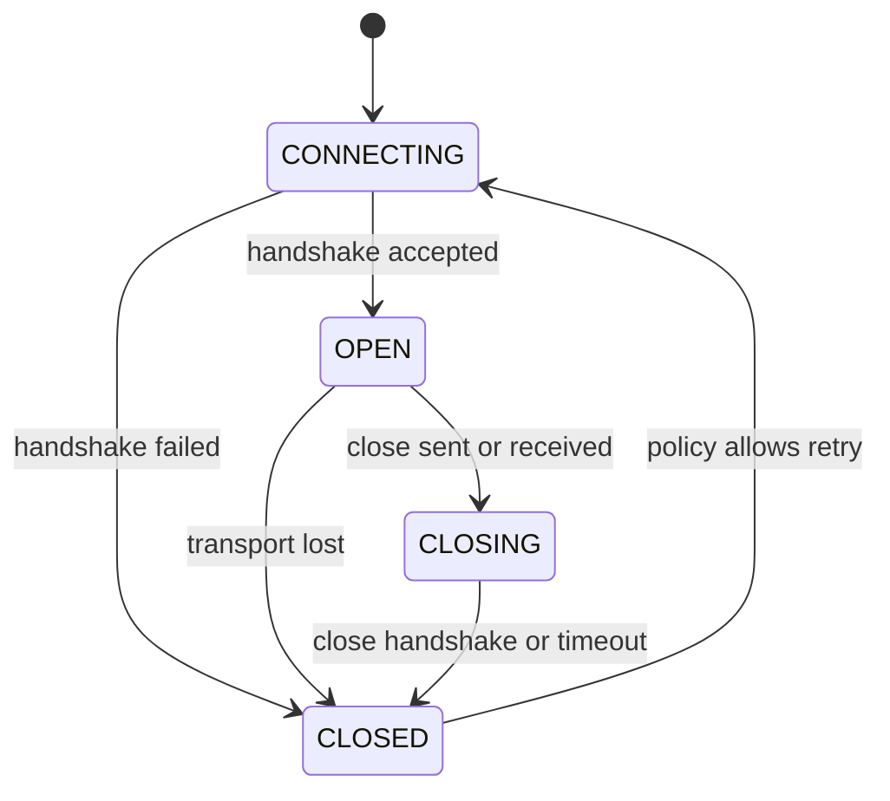

<TLDR>
  <TLDRCell label="what">
    After one handshake, WebSocket provides a persistent, full-duplex message channel where either endpoint can send text or binary messages.
  </TLDRCell>
  <TLDRCell label="trap">
    Restoring a connection does not restore its messages; after a break, the sender may not know whether the last message caused a side effect.
  </TLDRCell>
  <TLDRCell label="fix">
    Define an application protocol, handle delivery with message IDs, acknowledgements, deduplication, and resume cursors, and bound queued bytes.
  </TLDRCell>
</TLDR>

## What it is and why it exists

WebSocket is a two-way message protocol built on a reliable byte stream. Once connected, client and server can send messages without creating a new HTTP request for each update. In browsers, the `WebSocket` API presents the connection through `open`, `message`, `error`, and `close` events, with `send()` and `close()` as its main operations.

It addresses the mismatch between frequent two-way updates and HTTP's request-response model. Chat, collaborative editing, multiplayer game state, and live monitoring commonly need both server pushes and client commands. Polling can implement them, but empty responses, polling intervals, and repeated request headers become protocol costs; WebSocket puts the exchange on one continuing connection.

WebSocket does not provide rooms, event names, request IDs, retries, persistence, or exactly-once delivery. It preserves message boundaries but does not understand business meaning. The application still defines the message shape, authorization rules, and recovery protocol.

If data moves only from server to browser and ordinary HTTP semantics fit, Server-Sent Events can be simpler. If interactions are sparse and caching matters, ordinary HTTP is often easier to operate. WebSocket fits cases where both sides continuously send latency-sensitive messages and the team is prepared to manage long-lived connection state.

| Need | Ordinary HTTP | Server-Sent Events | WebSocket |
| --- | --- | --- | --- |
| Client-initiated data | Start a request each time | Use another HTTP request | Send on the existing connection |
| Server-initiated push | Polling or streaming response | Built in | Built in |
| Message direction | Response after request | Server to client | Two-way |
| Application recovery | Defined by the application | Defined by the application | Defined by the application |

Do not choose a transport from a "real-time" label. First state the message directions, update frequency, intermediaries, offline recovery, and capacity limits. Those requirements tell you whether WebSocket fits.

## How it works

A WebSocket moves through connecting, open, closing, and closed states. A successful network connection only proves that the transport path works. An application commonly must authenticate, confirm the subprotocol, and restore state before treating it as a usable session.



### Classic handshake on the wire

These are the central fields on the classic HTTP/1.1 path. A real request can also carry `Origin`, cookies, extensions, and other HTTP fields. Field order has no meaning.

```text
GET /chat HTTP/1.1
Host: server.example.com
Upgrade: websocket
Connection: Upgrade
Sec-WebSocket-Key: dGhlIHNhbXBsZSBub25jZQ==
Sec-WebSocket-Version: 13

HTTP/1.1 101 Switching Protocols
Upgrade: websocket
Connection: Upgrade
Sec-WebSocket-Accept: s3pPLMBiTxaQ9kYGzzhZRbK+xOo=
Sec-WebSocket-Protocol: chat.v1
```

The client generates a random key for each handshake; the server cannot hard-code the value from this example. The client validates the status, `Upgrade`, `Connection`, and accept value. If it requested a subprotocol, it also validates the server's selection.

A failed handshake is still an HTTP response. Before upgrading, the server can reject authentication, origin, or an unsupported version, and the connection never enters `OPEN`.

### Opening handshake

The classic <Term id="websocket-handshake">WebSocket handshake</Term> starts as an HTTP/1.1 request. The client sends `Upgrade: websocket`, a version, and a random `Sec-WebSocket-Key`. On acceptance, the server returns `101 Switching Protocols` and a `Sec-WebSocket-Accept` derived from that key and a fixed GUID. This calculation proves that the responder understands the WebSocket handshake; it is not authentication.

A client can offer a list of <Term id="websocket-subprotocol">WebSocket subprotocols</Term> in `Sec-WebSocket-Protocol`. The server selects at most one of them, and the browser exposes the result as `socket.protocol`. A subprotocol is suitable for fixing a message format or application protocol version, but not for carrying an access token.

Production deployments normally use `wss://`, which protects the handshake and later frames with TLS. RFC 8441 also defines how to establish WebSocket through HTTP/2 extended `CONNECT`, so the literal HTTP/1.1 `101` might not appear along the real proxy path. The application API hides that difference, but gateway configuration and observability tools need to understand the path in use.

### Frames, messages, and order

WebSocket encodes one application message as one or more frames. A text message must be valid UTF-8; the application assigns meaning to a binary message. Fragmentation lets a message span frames, and receiving APIs normally emit `message` only after assembling the complete message.

The frame header includes a final bit, opcode, mask bit, and payload length. Frames from a browser client to a server must be masked; server frames must not be masked. Masking counters a class of infrastructure attacks and does not encrypt anything. Libraries implement these rules, so application code should not construct frames itself.

Text and binary frames carry application data. Close, Ping, and Pong are <Term id="control-frame">control frames</Term> and can appear between fragments of a message. The browser API has no method for sending protocol Ping. If the application needs to confirm that its event loop and business handling remain alive, it needs an application heartbeat.

WebSocket preserves message order and boundaries, but the transport is still one ordered byte stream. Packet loss makes later bytes wait for retransmission, and a large message can occupy an application's processing path. One WebSocket does not automatically become several independent channels.

### Text and binary payloads

Text fits inspectable control messages and size-bounded JSON envelopes. Binary fits payloads with a defined encoding. Choosing binary does not compress data by itself; encoding, compression extensions, and application content type are separate decisions.

The receiver checks message type and size before decoding. Converting all binary data to strings, or feeding every text message to a JSON parser, lets protocol errors cross into business code.

The browser's `binaryType` decides whether binary messages arrive as `Blob` or `ArrayBuffer`. Fixing that choice when the connection starts gives the message handler one input contract.

### Closing and failure

A normal close is a two-way handshake. The initiator sends a Close frame with a status code and optional reason, the peer responds with a Close frame, and the underlying connection then ends. `1000` means normal closure. Applications choosing private status codes should use the `4000`-`4999` range and document each meaning.

A <Term id="close-code">close code</Term> describes why a protocol endpoint saw the connection end; it does not prove whether the last business message committed. `1006` is a reserved value used by APIs to report an abnormal close and cannot be sent in a Close frame. The `error` event also omits detailed network information on purpose, which prevents browsers from leaking cross-origin information.

A network break, process exit, or proxy timeout can bypass the close handshake. The client then knows only that the connection failed. It cannot infer how far the peer processed messages from the `close` event alone. Recovery depends on application acknowledgements, replayability, and server-kept progress.

## Examples

These examples check a handshake, complete a real local message exchange, then turn reconnection and send-buffer limits into testable pure functions. Every output was produced with Node 24.14.0; the second example uses `ws` 8.21.3 on the server.

<Depth level="quick">

### Verify the handshake accept value

RFC 6455 provides a fixed handshake test vector. The server appends the protocol GUID to the client key, computes SHA-1, then encodes the digest with Base64.

```javascript run title="handshake_accept.js"
import { createHash } from 'node:crypto';

const key = 'dGhlIHNhbXBsZSBub25jZQ==';
const guid = '258EAFA5-E914-47DA-95CA-C5AB0DC85B11';
const accept = createHash('sha1')
  .update(key + guid)
  .digest('base64');

console.log(accept);
console.log(accept === 's3pPLMBiTxaQ9kYGzzhZRbK+xOo=');
```

```text
s3pPLMBiTxaQ9kYGzzhZRbK+xOo=
true
```

The result exactly matches the `Sec-WebSocket-Accept` in the RFC. SHA-1 appears here because the handshake specifies it, not because the application is using SHA-1 to store passwords or sign business data.

This value only ties the response to this upgrade request. The server must still authenticate a session, ticket, or first authentication message separately, and it must check a browser request's `Origin`.

</Depth>

### Complete a local two-way exchange

This program creates a local server with `ws` and uses Node 24's global `WebSocket` as the client. Install `ws`, then run `node loopback_websocket.js`. It selects the `codewiki.v1` subprotocol, exchanges one `join` and one `ack`, and completes a normal close.

```javascript run title="loopback_websocket.js"
import { WebSocketServer } from 'ws';

const server = new WebSocketServer({ port: 0, host: '127.0.0.1' });

server.on('connection', (socket) => {
  console.log(`server protocol: ${socket.protocol}`);
  socket.on('message', (data) => {
    const message = JSON.parse(data.toString());
    console.log(`server received: ${message.type} ${message.room}`);
    socket.send(JSON.stringify({ type: 'ack', id: 7 }));
  });
});

server.on('listening', () => {
  const address = server.address();
  const socket = new WebSocket(
    `ws://127.0.0.1:${address.port}`,
    ['codewiki.v1'],
  );

  socket.addEventListener('open', () => {
    console.log(`client protocol: ${socket.protocol}`);
    socket.send(JSON.stringify({ type: 'join', room: 'blue' }));
  });
  socket.addEventListener('message', ({ data }) => {
    const message = JSON.parse(data);
    console.log(`client received: ${message.type} ${message.id}`);
    socket.close(1000, 'done');
  });
  socket.addEventListener('close', ({ code, reason }) => {
    console.log(`closed: ${code} ${reason}`);
    server.close();
  });
});
```

```text
server protocol: codewiki.v1
client protocol: codewiki.v1
server received: join blue
client received: ack 7
closed: 1000 done
```

The server listens on an ephemeral port, so the example does not occupy a fixed one. `socket.protocol` in the server's `connection` callback matches the client's value, showing that both endpoints accepted the same application protocol version.

The client can call `send()` only after `open`. Once it receives the `ack`, it starts closing with `1000` and the reason `done`. The server library answers with a Close frame, so the final `close` event retains that code and reason.

The code deliberately demonstrates only the connection lifecycle. A production handler also validates the JSON shape, checks room authorization, limits message size, and releases listeners and session state on every exit path.

### Bound reconnection and pending data

Reconnection delay and send admission work better as pure policy than as timers scattered across event callbacks. The next functions use capped exponential backoff with a fixed random input for repeatable output. `maySend()` checks both connection state and `bufferedAmount`.

```javascript run title="reconnect_policy.js"
const limits = {
  baseDelayMs: 500,
  maxDelayMs: 8000,
  maxBufferedBytes: 64 * 1024,
};

function reconnectDelay(attempt, random = 0.5) {
  const ceiling = Math.min(
    limits.maxDelayMs,
    limits.baseDelayMs * 2 ** attempt,
  );
  return Math.round(ceiling * (0.5 + random * 0.5));
}

function maySend(socket, bytes) {
  return socket.readyState === WebSocket.OPEN &&
    socket.bufferedAmount + bytes <= limits.maxBufferedBytes;
}

const fakeSocket = {
  readyState: WebSocket.OPEN,
  bufferedAmount: 60 * 1024,
};

console.log([0, 1, 2, 3].map((attempt) => reconnectDelay(attempt)));
console.log(maySend(fakeSocket, 2 * 1024));
console.log(maySend(fakeSocket, 8 * 1024));
```

```text
[ 375, 750, 1500, 3000 ]
true
false
```

The fixed `random = 0.5` gives every run the same delays. A real client samples a new random value for each attempt so a population of clients does not reconnect together. Once it reaches the delay cap, the policy should retain jitter and still accept a cancellation signal.

`bufferedAmount` is the number of application-data bytes handed to the API but not yet transmitted to the network. It is neither server acknowledgement nor round-trip latency. The `false` branch needs an explicit action, such as pausing the producer, rejecting a retryable command, or closing a slow connection according to product policy.

This policy does not keep an arbitrary number of outgoing messages. If the product needs an offline queue, specify entry and byte limits, expiry, persistence location, and which messages may be replayed on a new connection.

## Pitfalls

> [!PITFALL]
> Calling `send()` while `CONNECTING`, or putting every message produced during an outage into an unbounded array. The first raises a state error; the second consumes more memory for as long as the network remains slow.

**Fix:** Send only while `OPEN`, and give a queue both item and byte limits. When it reaches a limit, apply a documented overload policy. Do not assume that "save it and send it later" is a safe default.

> [!PITFALL]
> Reconnecting immediately and replaying every unacknowledged message unchanged. The server may have committed the last command while its acknowledgement was lost on the return path, so replay can duplicate a payment, post, or job.

**Fix:** Use capped backoff with jitter. Give side-effecting commands stable message IDs, have the server deduplicate them and return resumable acknowledgements, and replay only when the protocol permits it.

> [!PITFALL]
> Treating the browser handshake's `Origin` as user identity, or skipping origin checks because the request has a cookie. A hostile page can induce a signed-in browser to make a cross-site WebSocket, while a non-browser client can forge `Origin`.

**Fix:** Treat the <Term id="origin">origin</Term> allowlist and authentication as separate checks. Use `wss://`, keep long-lived tokens out of URLs, and authorize each class of message instead of authorizing only once at connection time.

> [!PITFALL]
> Using traffic alone to decide that a connection is healthy, or assuming browser code can send protocol Ping. A connection can fail in a proxy, NAT, or half-open TCP state, and browsers expose no Ping API.

**Fix:** When the business needs end-to-end liveness, define an application heartbeat carrying a time or sequence number and enforce an overall timeout. A server library can separately use protocol Ping/Pong to test transport endpoints. The two heartbeats answer different questions.

> [!PITFALL]
> Calling `JSON.parse()` on each `message` and trusting its `type`, identifiers, and payload. A valid WebSocket peer can still send malformed JSON, an oversized message, or a command that the current user may not perform.

**Fix:** Limit message size before parsing, catch decode errors, then validate structure and authorization for the message type. An unknown type should produce a controlled error or policy close, not fall through to a default business branch.

> [!PITFALL]
> Marking client state as "synchronized" when a `close` event arrives. The close handshake says how the connection ended, not how far business consumption progressed.

**Fix:** Have the server acknowledge stable message IDs and maintain a monotonically increasing resume cursor for server pushes. On reconnect, restore identity and subscriptions before filling the gap from the last confirmed position.

## In the AI era

**What generated code gets wrong here**

Generated WebSocket wrappers often reduce reconnect to `onclose = connect`, without backoff, cancellation, or single-connection ownership; a manual close then opens another connection. Models also create an unbounded `pendingMessages` array and flush it on every `open`, but provide no message IDs, acknowledgements, or deduplication. On security, they put access tokens in query strings, check identity only at connection time, then trust arbitrary message types and room IDs.

**Ask your AI to check**

- List every timer creation, listener registration, and cleanup in the connection state machine, and prove that one session has at most one active connection.
- Trace one side-effecting message when the break occurs before sending, after server commit, and before the acknowledgement arrives.
- State hard limits for inbound message size, pending bytes, reconnect attempts, and heartbeat timeout, including the action triggered by each limit.

**Review checklist**

- Test the inbound path with malformed JSON, an unknown message type, an unauthorized room, and a payload above the limit.
- Stop the peer from reading and observe whether `bufferedAmount`, application queues, and memory remain bounded.
- Force a disconnect during connection, authentication, subscription, sending, and acknowledgement, then check for duplicate side effects and resource leaks.

**Prompt vocabulary**

Use the exact terms `opening handshake`, `subprotocol negotiation`, `message framing`, `close handshake`, `abnormal closure`, `application heartbeat`, `exponential backoff with jitter`, `delivery ambiguity`, `idempotency key`, and `backpressure`. Asking for state transitions and a byte budget exposes more omissions than "write a robust WebSocket client."

<Depth level="deep">

## The application protocol sets reliability

WebSocket <Term id="message-framing">message framing</Term> tells a receiver only where one text or binary message ends. The application still defines an envelope, including what fields such as `type`, `id`, `payload`, and protocol version mean. Its parser should reject missing fields, unknown versions, and values that violate type constraints.

A message ID supports correlation and deduplication; it does not create exactly-once delivery by itself. If the server commits a command but the connection breaks before the acknowledgement returns, the client sees the same result as if the server never received it. A reliable protocol either lets the client query the result or makes a retry with the same idempotency key return the first commit's result.

Server pushes often use another recovery mechanism. The server assigns monotonically increasing cursors, and the client saves its last confirmed cursor only after local processing completes. On reconnect, the client supplies that cursor when restoring the subscription. If the retention window has passed, the protocol should explicitly require a full snapshot instead of silently skipping events.

Acknowledgements must also be bounded. Retaining every sent but unacknowledged message forever merely rebuilds an unbounded buffer at the application layer. Specify the maximum in-flight count, acknowledgement timeout, expiry policy, and who owns those records after the connection closes.

### Subprotocols and evolution

`Sec-WebSocket-Protocol` works for negotiating incompatible application protocols such as `chat.v1` and `chat.v2`. A server cannot return a value the client did not offer, and a client should reject a connection missing a required subprotocol. Format incompatibility then fails during the handshake rather than randomly on the first business message.

Compatible changes can still use a version or capability field in the message envelope. Adding an optional field is usually safer than changing an existing field's meaning. Before removing a message type, verify that no active client version sends or depends on it.

### Connection ownership

One connection manager should own socket creation, timers, and listeners. UI components subscribe to domain events instead of each calling `connect()` themselves; otherwise a rerender can leave a second connection behind.

Closing must distinguish a temporary failure from a caller's request to stop. Only the first enters the reconnect policy. The second cancels reconnect timers, clears queues that may be discarded, and invalidates existing callbacks.

Give every new connection a generation ID. An asynchronous callback checks that it still belongs to the current generation before changing state. This prevents a late `close` from an old connection from closing its replacement.

## Capacity, security, and operations boundaries

### End-to-end backpressure

The classic `WebSocket` API has no automatic <Term id="backpressure">backpressure</Term>. `send()` hands data to an implementation-managed queue, and `bufferedAmount` only gives a snapshot of currently queued bytes. There is no standard drained event. Polling that value still needs a cancellation condition and time budget.

Real capacity control spans the producer, serialization, WebSocket buffer, server handler, and downstream dependencies. Limiting one stage while its predecessor queues forever only moves the memory problem. Each connection needs at least an inbound message limit, in-flight handler limit, and pending-byte limit.

The overload action depends on message semantics. State snapshots may be coalesced to the newest value, audit events normally cannot be dropped, and side-effecting commands should be rejected with a visible failure. Put that action in the protocol so slow-consumer tests do not depend on guesswork.

### Identity and authorization

The browser constructor does not let application code add an arbitrary `Authorization` request header. Common choices are an existing secure session, a short-lived single-use connection ticket, or an authentication message sent immediately after opening. Every option needs a time and message limit before authentication completes.

Origin validation can prevent an untrusted browser page from borrowing user credentials, but it does not identify the user. Authentication answers "who," while message-level authorization answers "may this identity act on this resource." A connection lasting hours does not make permissions permanent; revocation and token expiry need a disconnect or reauthentication path.

TLS protects transport confidentiality and integrity, not business authorization. Logs should not record full connection URLs, tokens, or sensitive payloads. Error replies should also stay bounded so they do not expose internal authorization structure to an untrusted peer.

### Failure test matrix

Testing only normal `open`, `message`, and `close` events does not verify the recovery protocol. Tests break the connection at protocol boundaries and inspect business state and resources, rather than merely waiting for an event.

| Injection point | Result to verify |
| --- | --- |
| Before handshake response | No application message is sent; retry follows its budget |
| Before authentication succeeds | Unauthenticated messages are limited; timers are cleaned up |
| After command write | The result stays unknown; the client does not claim failure blindly |
| After server commit | The same idempotency key causes no duplicate side effect |
| Before acknowledgement returns | The client can query or replay safely |
| During the close handshake | Final cleanup runs exactly once |

Next, make the server stop reading without closing the connection. That path exposes an unbounded outgoing queue that an ordinary disconnect test often misses.

Finally, check whether observability distinguishes handshake rejection, authentication failure, policy close, abnormal close, and reconnect exhaustion. Recording every outcome as `socket error` makes capacity failures look like random network trouble.

### Heartbeats, proxies, and scaling

Protocol Ping/Pong can show that WebSocket endpoints respond, but it does not prove a business consumer processed a message. An application heartbeat passes through the business event loop and is better at detecting a stalled application. Both need jittered intervals or centralized scheduling so every connection does not produce a spike at once.

Proxies and load balancers can have independent idle timeouts and maximum connection ages. The heartbeat interval must be shorter than the shortest effective idle timeout along the path, then verified through the real deployment. Do not wrap a repeatable proxy disconnect as a "random network error" and retry forever.

Each connection terminates in one service process. Broadcasting across instances needs a shared event source or proxy-level routing, and subscription and presence data need explicit owners. Presence should expire because a crashed process may never emit an offline notification.

Before scaling, quantify connection count, per-connection memory, pending bytes, message rate, and slow-consumer count. A small WebSocket frame header does not make a connection free; TLS, library buffers, application queues, and subscription indexes commonly dominate the capacity budget.

</Depth>

<Checkpoint id="foundations/websocket" />

## Further reading

- [RFC 6455: The WebSocket Protocol](https://datatracker.ietf.org/doc/html/rfc6455)
- [WHATWG WebSockets Standard](https://websockets.spec.whatwg.org/)
- [MDN: WebSocket API](https://developer.mozilla.org/en-US/docs/Web/API/WebSocket)
- [MDN: `bufferedAmount`](https://developer.mozilla.org/en-US/docs/Web/API/WebSocket/bufferedAmount)
- [Node.js 24: global `WebSocket`](https://nodejs.org/docs/latest-v24.x/api/globals.html#websocket)
- [`ws` API documentation](https://github.com/websockets/ws/blob/master/doc/ws.md)
