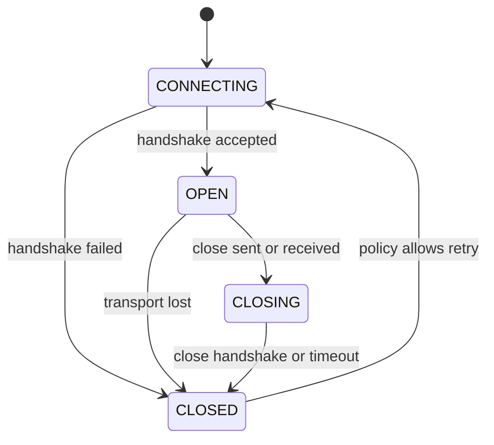

<TLDR>
  <TLDRCell label="what">
    WebSocket在一次握手后提供持久的全双工消息通道，任一端都能主动发送文本或二进制消息。
  </TLDRCell>
  <TLDRCell label="trap">
    连接恢复不等于消息恢复；断线时，发送方可能无法判断最后一条消息是否已经产生副作用。
  </TLDRCell>
  <TLDRCell label="fix">
    明确应用消息协议，用消息标识、确认、去重和恢复游标处理交付语义，并限制待发送字节。
  </TLDRCell>
</TLDR>

## 是什么，为什么存在

WebSocket是建立在可靠字节流之上的双向消息协议。连接建立后，客户端和服务端都能主动发送消息，不必为每次更新创建新的HTTP请求。浏览器中的`WebSocket` API把连接表现为`open`、`message`、`error`和`close`事件，以及`send()`与`close()`两个主要操作。

它解决的是频繁双向更新与HTTP请求—响应模型之间的不匹配。聊天、协作编辑、多人游戏状态和实时监控通常既有服务器推送，也有客户端命令。轮询可以实现这些功能，但空响应、轮询间隔和重复请求头都会成为协议负担；WebSocket把这段通信放在一条持续连接上。

WebSocket并不自动提供房间、事件名称、请求标识、重试、持久化或“恰好一次”交付。它保留消息边界，却不理解消息的业务含义。应用仍需定义消息结构、授权规则和恢复协议。

如果数据只从服务器流向浏览器，而且普通HTTP语义更合适，Server-Sent Events可能更简单。如果交互稀疏、缓存很重要，普通HTTP往往更容易运维。WebSocket适合双方都需要低等待时间地持续发消息，并且团队愿意管理长连接状态的场景。

| 需求 | 普通HTTP | Server-Sent Events | WebSocket |
| --- | --- | --- | --- |
| 客户端主动发送 | 每次发起请求 | 另用HTTP请求 | 在既有连接上发送 |
| 服务器主动推送 | 轮询或流式响应 | 原生支持 | 原生支持 |
| 消息方向 | 请求后响应 | 服务器到客户端 | 双向 |
| 应用恢复协议 | 应用定义 | 应用定义 | 应用定义 |

传输方式不是按“实时”标签选择的。先写清消息方向、更新频率、中间代理、离线恢复和容量上限，再决定WebSocket是否合适。

## 工作原理

一个WebSocket会经历连接、开放、关闭中和关闭几个状态。网络连接成功只表示传输路径可用；应用通常还要完成身份认证、子协议确认和状态恢复，才应把连接视为可用会话。



### 线上的经典握手

下面是经典HTTP/1.1路径的核心字段。真实请求还可能带有`Origin`、cookie、扩展和其他HTTP字段；字段顺序没有语义。

```text
GET /chat HTTP/1.1
Host: server.example.com
Upgrade: websocket
Connection: Upgrade
Sec-WebSocket-Key: dGhlIHNhbXBsZSBub25jZQ==
Sec-WebSocket-Version: 13

HTTP/1.1 101 Switching Protocols
Upgrade: websocket
Connection: Upgrade
Sec-WebSocket-Accept: s3pPLMBiTxaQ9kYGzzhZRbK+xOo=
Sec-WebSocket-Protocol: chat.v1
```

客户端为每次握手生成随机key，服务端不能把示例中的固定值写死。客户端必须校验状态、`Upgrade`、`Connection`和接受值；请求了子协议时，还要校验服务端选择的值。

握手失败仍是HTTP响应。服务端可以在升级前返回认证失败、来源拒绝或版本不支持，连接也不会进入`OPEN`状态。

### 开启握手

<Term id="websocket-handshake">WebSocket握手（WebSocket handshake）</Term>从HTTP/1.1请求开始。客户端发送`Upgrade: websocket`、版本和随机的`Sec-WebSocket-Key`；服务端接受后返回`101 Switching Protocols`，并给出由该key与固定GUID计算出的`Sec-WebSocket-Accept`。这个计算证明响应方理解WebSocket握手，它不是身份认证。

客户端可以在`Sec-WebSocket-Protocol`中提供一组<Term id="websocket-subprotocol">WebSocket子协议（WebSocket subprotocol）</Term>。服务端只能选择其中一个或不选择，浏览器随后通过`socket.protocol`暴露结果。子协议适合固定消息格式或应用协议版本，不能拿来传访问令牌。

生产环境通常使用`wss://`，让握手和后续帧都受TLS保护。RFC 8441还定义了经由HTTP/2扩展`CONNECT`建立WebSocket的方式，因此真实代理路径不一定出现字面上的HTTP/1.1 `101`。应用API会隐藏这层差异，但网关配置与观测工具必须理解实际使用的路径。

### 帧、消息与顺序

WebSocket把应用消息编码成一个或多个帧。文本消息必须是有效UTF-8，二进制消息的含义由应用决定。分片允许一条消息跨越多个帧；接收API通常在完整消息组装好之后才触发`message`事件。

帧头包含结束位、操作码、掩码位和负载长度。浏览器客户端发往服务端的帧必须掩码，服务端帧不得掩码；掩码用于避免特定的基础设施攻击，并不提供加密。库会处理这些规则，应用代码不应自行拼帧。

文本帧与二进制帧承载应用数据。关闭、Ping和Pong属于<Term id="control-frame">控制帧（control frame）</Term>，可在分片消息之间出现。浏览器API不提供发送协议级Ping的方法；如果应用要确认事件循环和业务处理仍然存活，需要定义应用级心跳。

WebSocket保留消息顺序和消息边界，但底层仍是一个有序字节流。丢包会让后续字节等待重传，一条很大的消息也可能占住应用的处理路径。一个WebSocket不会自动变成多个相互独立的通道。

### 文本与二进制负载

文本适合可检查的控制消息和体积受限的JSON envelope，二进制适合已有明确编码的负载。选择二进制不会自动压缩数据；编码、压缩扩展和应用内容类型是不同决策。

接收方应在解码前检查消息类型和大小。把二进制无条件转成字符串，或把文本无条件交给JSON解析器，都会让协议错误进入业务代码。

浏览器的`binaryType`决定二进制消息以`Blob`还是`ArrayBuffer`交付。连接建立后就固定这一选择，能让消息处理器保持单一输入契约。

### 关闭与失败

正常关闭是一次双向握手。发起方发送带状态码和可选原因的Close帧，对端回复Close帧，随后底层连接结束。`1000`表示正常关闭；应用使用私有状态码时，应从`4000`–`4999`范围选择并记录其含义。

<Term id="close-code">关闭状态码（close code）</Term>描述协议端点看到的结束原因，不证明最后一条业务消息是否提交。`1006`是API用来报告异常关闭的保留值，不能放进Close帧发送。`error`事件也故意不暴露丰富的网络细节，避免浏览器泄露跨源信息。

网络中断、进程退出和代理超时可能跳过关闭握手。此时客户端只能知道连接失效，不能仅凭`close`事件判断对端处理到了哪条消息。恢复必须依赖应用层确认、可重放性和服务器保存的进度。

## 示例

下面三个示例依次检查握手、完成一次真实的本地消息交换，再把重连与发送缓冲限制写成可测试的纯函数。所有输出均在Node 24.14.0中实际生成；第二个示例的服务端使用`ws` 8.21.3。

<Depth level="quick">

### 验证握手接受值

RFC 6455给出了一组固定的握手测试值。服务端拼接客户端key与协议GUID，计算SHA-1，再把摘要编码为Base64。

```javascript run title="handshake_accept.js"
import { createHash } from 'node:crypto';

const key = 'dGhlIHNhbXBsZSBub25jZQ==';
const guid = '258EAFA5-E914-47DA-95CA-C5AB0DC85B11';
const accept = createHash('sha1')
  .update(key + guid)
  .digest('base64');

console.log(accept);
console.log(accept === 's3pPLMBiTxaQ9kYGzzhZRbK+xOo=');
```

```text
s3pPLMBiTxaQ9kYGzzhZRbK+xOo=
true
```

结果与RFC中的`Sec-WebSocket-Accept`完全一致。这里使用SHA-1是协议规定的握手算法，不是在用SHA-1保存密码或签名业务数据。

这个值只能把响应与本次升级请求关联起来。服务端仍需另外验证会话、票据或首条认证消息，并检查浏览器请求的`Origin`。

</Depth>

### 完成本地双向交换

这个程序用`ws`创建本地服务端，用Node 24的全局`WebSocket`作为客户端。先安装`ws`，再执行`node loopback_websocket.js`；程序选择`codewiki.v1`子协议，交换一个`join`与一个`ack`，最后完成正常关闭。

```javascript run title="loopback_websocket.js"
import { WebSocketServer } from 'ws';

const server = new WebSocketServer({ port: 0, host: '127.0.0.1' });

server.on('connection', (socket) => {
  console.log(`server protocol: ${socket.protocol}`);
  socket.on('message', (data) => {
    const message = JSON.parse(data.toString());
    console.log(`server received: ${message.type} ${message.room}`);
    socket.send(JSON.stringify({ type: 'ack', id: 7 }));
  });
});

server.on('listening', () => {
  const address = server.address();
  const socket = new WebSocket(
    `ws://127.0.0.1:${address.port}`,
    ['codewiki.v1'],
  );

  socket.addEventListener('open', () => {
    console.log(`client protocol: ${socket.protocol}`);
    socket.send(JSON.stringify({ type: 'join', room: 'blue' }));
  });
  socket.addEventListener('message', ({ data }) => {
    const message = JSON.parse(data);
    console.log(`client received: ${message.type} ${message.id}`);
    socket.close(1000, 'done');
  });
  socket.addEventListener('close', ({ code, reason }) => {
    console.log(`closed: ${code} ${reason}`);
    server.close();
  });
});
```

```text
server protocol: codewiki.v1
client protocol: codewiki.v1
server received: join blue
client received: ack 7
closed: 1000 done
```

服务端监听随机端口，所以示例不会占用固定端口。`connection`回调中的`socket.protocol`与客户端的`socket.protocol`相同，说明双方接受了同一个应用协议版本。

`open`之后才能调用`send()`。收到`ack`后，客户端以`1000`和原因`done`发起关闭；服务端库回复Close帧，因此最终`close`事件保留了相同的状态码与原因。

代码刻意只演示连接生命周期。生产处理器还必须验证JSON结构、检查房间权限、限制消息大小，并在每种退出路径释放监听器和会话状态。

### 限制重连与待发送数据

重连延迟和发送准入最好是纯策略，而不是散落在事件回调中的计时器。下面的函数使用有上限的指数退避，并以固定随机输入得到可重复输出；`maySend()`则同时检查连接状态与`bufferedAmount`。

```javascript run title="reconnect_policy.js"
const limits = {
  baseDelayMs: 500,
  maxDelayMs: 8000,
  maxBufferedBytes: 64 * 1024,
};

function reconnectDelay(attempt, random = 0.5) {
  const ceiling = Math.min(
    limits.maxDelayMs,
    limits.baseDelayMs * 2 ** attempt,
  );
  return Math.round(ceiling * (0.5 + random * 0.5));
}

function maySend(socket, bytes) {
  return socket.readyState === WebSocket.OPEN &&
    socket.bufferedAmount + bytes <= limits.maxBufferedBytes;
}

const fakeSocket = {
  readyState: WebSocket.OPEN,
  bufferedAmount: 60 * 1024,
};

console.log([0, 1, 2, 3].map((attempt) => reconnectDelay(attempt)));
console.log(maySend(fakeSocket, 2 * 1024));
console.log(maySend(fakeSocket, 8 * 1024));
```

```text
[ 375, 750, 1500, 3000 ]
true
false
```

固定的`random = 0.5`让每次执行得到相同延迟；真实客户端应为每次尝试采样随机值，使大量客户端不会同时重连。达到延迟上限后，策略仍应保留随机扰动，并接受取消信号。

`bufferedAmount`是已经交给API、尚未发到网络的应用数据字节数。它不是服务器确认，也不是往返时延。`false`分支必须有明确动作，例如暂停上游、拒绝可重试命令，或按产品规则关闭慢连接。

这个策略没有保存任意数量的待发消息。若产品需要离线队列，应明确条目和字节上限、过期时间、持久化位置，以及哪些消息允许在新连接上重放。

## 陷阱

> [!PITFALL]
> 在`CONNECTING`状态调用`send()`，或把断线期间的所有消息放进无界数组。前者会抛出状态错误，后者会在慢网络下持续占用内存。

**修复方法：** 只在`OPEN`状态发送，并给队列同时设置条目上限与字节上限。达到上限时执行明确的过载策略；不要把“暂存以后再发”当成天然安全的默认行为。

> [!PITFALL]
> 断线后立即重连，并把所有未确认消息原样重放。服务端可能已经提交最后一条命令，只是确认在回程中丢失，重放会重复扣款、发帖或触发任务。

**修复方法：** 使用带随机扰动和上限的退避。为有副作用的命令分配稳定消息标识，让服务端去重并返回可恢复的确认；只有协议明确允许时才重放。

> [!PITFALL]
> 把浏览器握手中的`Origin`当作用户身份，或者因为请求带有cookie就跳过来源检查。恶意页面可以诱导已登录的浏览器建立跨站WebSocket，非浏览器客户端还可以伪造`Origin`。

**修复方法：** 把<Term id="origin">源（origin）</Term>允许列表与身份认证作为两项独立检查。使用`wss://`，避免把长期令牌放进URL，并对每类消息执行授权，而不是只在连接时授权一次。

> [!PITFALL]
> 只依赖流量来判断连接健康，或假设浏览器代码能发送协议级Ping。连接可能在代理、NAT或半开TCP状态中失效，而浏览器没有Ping API。

**修复方法：** 若业务需要端到端存活检测，定义包含时间或序号的应用级心跳，并设定总超时。服务端库可以另用协议级Ping/Pong检测传输端点；两种心跳解决的问题不同。

> [!PITFALL]
> 收到`message`后直接`JSON.parse()`并信任`type`、标识和负载。一个合法WebSocket对端仍然可以发送畸形JSON、超大消息或当前用户无权执行的命令。

**修复方法：** 在解析前限制消息大小，捕获解码错误，再按消息类型校验结构和权限。未知类型应产生受控错误或策略关闭，而不是落入默认业务分支。

> [!PITFALL]
> 看到`close`事件就把客户端状态标成“已同步”。关闭握手只描述连接如何结束，不携带业务消费进度。

**修复方法：** 让服务端确认稳定的消息标识，并为服务器推送维护单调递增的恢复游标。重连后先恢复身份与订阅，再从最后确认位置补齐缺口。

<Depth level="deep">

## 应用协议决定可靠性

WebSocket的<Term id="message-framing">消息分帧（message framing）</Term>只告诉接收方一条文本或二进制消息在哪里结束。应用还要定义envelope，例如`type`、`id`、`payload`和协议版本各自表示什么。解析器应拒绝缺字段、未知版本和不符合类型约束的数据。

消息标识解决的是关联与去重，不会单独创造“恰好一次”。客户端发送命令后，如果服务端提交成功但连接在确认返回前中断，客户端看到的结果与“服务端从未收到”相同。可靠协议必须允许查询结果，或让同一幂等键的重试返回第一次提交的结果。

服务器推送通常使用另一种恢复机制。服务端为事件分配单调递增游标，客户端只在完成本地处理后保存最后确认游标。重连时，客户端携带该游标恢复订阅；若保留窗口已经过去，协议应明确要求全量快照，而不是悄悄跳过事件。

确认也需要有界。无限保存所有已发送但未确认的消息只是在应用层重建了一个无界缓冲区。应规定最大在途数量、确认超时、过期策略，以及连接关闭后由谁拥有这些记录。

### 子协议与演进

`Sec-WebSocket-Protocol`适合协商不兼容的应用协议，例如`chat.v1`或`chat.v2`。服务端不能返回客户端没有提供的值，客户端也应拒绝缺少必需子协议的连接。这样，格式不兼容会在握手阶段失败，而不是在第一条业务消息时随机报错。

兼容变更仍可放在消息envelope的版本或能力字段中。新增可选字段通常比改变现有字段含义安全；删除消息类型前，要先确认所有活跃客户端版本都不再发送或依赖它。

### 连接所有权

连接管理器应当是创建套接字、计时器和监听器的唯一所有者。界面组件只订阅领域事件，不直接各自调用`connect()`；否则一次重新渲染就可能留下第二条连接。

关闭操作要区分“临时故障”和“调用方要求停止”。只有前者进入重连策略，后者应取消重连计时器、清空允许丢弃的队列，并让已有回调失效。

每次新连接都应带有generation标识。异步回调先确认自己仍属于当前generation，再修改状态，这可以阻止旧连接迟到的`close`事件关闭新连接。

## 容量、安全与运维边界

### 端到端背压

经典`WebSocket` API没有自动<Term id="backpressure">背压（backpressure）</Term>。`send()`会把数据交给实现排队，`bufferedAmount`只提供当前排队字节的快照，也没有标准的“已排空”事件。持续轮询这个值时仍需取消条件和时间预算。

真正的容量控制要贯穿生产者、序列化、WebSocket缓冲、服务端处理器和下游依赖。限制一个环节却让前一个环节无限排队，只会移动内存问题。每个连接至少要有入站消息上限、在途处理上限和待发字节上限。

过载动作取决于消息语义。状态快照可能允许合并为最新值，审计事件通常不允许丢弃，有副作用的命令则应拒绝并让调用方看见失败。把动作写进协议，才能测试慢消费者而不靠猜测。

### 身份与授权

浏览器构造函数不能让应用任意添加`Authorization`请求头。常见选择是已有安全会话、短期单次连接票据，或连接建立后立即发送认证消息；无论哪种方式，都要限制认证完成前可用的时间和消息数量。

来源校验只能防住不受信任的浏览器页面借用用户凭据，不能识别用户。身份认证回答“是谁”，消息级授权回答“能对这个资源做什么”。连接持续数小时也不代表权限持续有效；权限撤销与令牌过期要有断开或重新认证路径。

TLS保护传输机密性和完整性，不会验证业务消息是否允许。日志不应记录完整连接URL、令牌或敏感payload。错误回复也应保持有限，避免把内部授权结构暴露给不受信任的对端。

### 故障测试矩阵

只测正常的`open`、`message`和`close`无法验证恢复协议。测试要在协议边界主动切断连接，并观察业务状态与资源，而不只是等待某个事件出现。

| 注入位置 | 应验证的结果 |
| --- | --- |
| 握手返回前 | 没有应用消息发送，重试遵守预算 |
| 认证成功前 | 未认证消息受限，计时器会清理 |
| 命令写出后 | 结果保持未知，不盲目声明失败 |
| 服务端提交后 | 相同幂等键不会重复副作用 |
| 确认返回前 | 客户端能查询或安全重放 |
| 关闭握手期间 | 最终清理只执行一次 |

再让服务端停止读取而不关闭连接。这条路径会暴露无界待发队列，但普通断线测试通常看不到它。

最后检查观察指标能否区分握手拒绝、认证失败、策略关闭、异常关闭和重连耗尽。把所有结果都记成`socket error`，会让容量故障看起来像随机网络问题。

### 心跳、代理与扩容

协议级Ping/Pong能检查WebSocket端点是否响应，但不保证某个业务消费者已经处理消息。应用级心跳经过业务事件循环，更适合检测应用卡死。两者都应有随机化间隔或集中调度，避免所有连接在同一时刻产生尖峰。

代理和负载均衡器可能有独立的空闲超时与最大连接时长。心跳间隔必须小于路径上最短的有效空闲超时，并通过真实部署链路验证。不要把代理断开包装成“网络偶发错误”而无限重试。

每条连接在某一个服务进程中终止。多实例广播需要共享事件源或代理层路由，订阅和在线状态也需要明确所有者。在线状态应带过期时间，因为进程崩溃可能来不及发送离线通知。

扩容前先量化连接数、每连接内存、待发字节、消息速率和慢消费者数量。WebSocket的帧头较小并不意味着连接成本为零；TLS、库缓冲、应用队列和订阅索引往往才是容量预算的主体。

</Depth>

<Checkpoint id="foundations/websocket" />

## 延伸阅读

- [RFC 6455：WebSocket协议](https://datatracker.ietf.org/doc/html/rfc6455)
- [WHATWG WebSockets标准](https://websockets.spec.whatwg.org/)
- [MDN：WebSocket API](https://developer.mozilla.org/en-US/docs/Web/API/WebSocket)
- [MDN：`bufferedAmount`](https://developer.mozilla.org/en-US/docs/Web/API/WebSocket/bufferedAmount)
- [Node.js 24：全局`WebSocket`](https://nodejs.org/docs/latest-v24.x/api/globals.html#websocket)
- [`ws` API文档](https://github.com/websockets/ws/blob/master/doc/ws.md)
