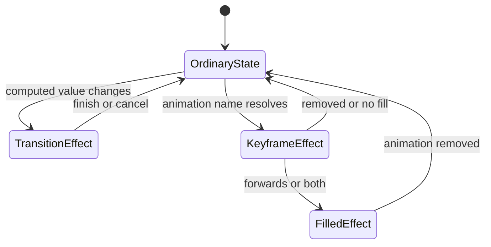

<TLDR>
  <TLDRCell label="what">
    A CSS transition interpolates when a property value changes; a CSS keyframe animation defines a timeline that can repeat and contain several stages.
  </TLDRCell>
  <TLDRCell label="trap">
    `animation-fill-mode: forwards` does not write the endpoint into ordinary styles, and `transition: all` silently animates properties added later.
  </TLDRCell>
  <TLDRCell label="fix">
    Name the animated properties, put persistent end states in ordinary rules, and provide a `prefers-reduced-motion` path that does not depend on end events.
  </TLDRCell>
</TLDR>

## What it is and why it exists

CSS animation changes an element's presented values over time. Its job is not the abstract goal of “making a page move.” It carries an interface between states that people can understand: a button confirms a save, a notice enters view, an activity indicator keeps signaling progress, or list items arrive in sequence.

CSS provides two main mechanisms. A <Term id="css-transition">CSS transition</Term> observes a property's before and after values and interpolates when that value changes. A keyframe animation describes several positions in one cycle with `@keyframes`, then starts and controls that timeline with the `animation-*` properties.

A transition usually fits when a pseudo-class, media query, attribute, or class already represents the state and the element only needs to move from its current value to a target. A keyframe animation is more direct when the effect starts automatically, repeats, alternates, or passes through three or more explicit stages. Neither mechanism should own business state, focus management, or an accessible name.

Animation should communicate useful feedback while allowing people to reduce non-essential motion. Color or opacity can also signal state, but you cannot assume that everyone can safely or comfortably accept scaling, translation, or continuous rotation.

## How it works

The browser first resolves computed property values through the cascade and inheritance, then samples intermediate values for animatable properties along a timeline. An animation effect participates in producing computed values. It does not rewrite declarations in your stylesheet or update DOM state for you. The visual result after an animation and the application's real state are therefore separate concerns.

The state diagram separates ordinary styles, active effects, and filling effects. Every path must eventually be able to return to an interface described by ordinary styles and DOM state.



### Transitions respond to value changes

A transition compares values before and after a style update. The browser generates one only when the property is listed in `transition-property`, its duration is greater than `0s`, its values differ, and those values can transition. Declaring `transition` alone creates no motion; a pseudo-class, class, attribute, or script must still change the target value.

In the shorthand, the first time is the duration and the second is the delay. Each comma-separated group describes one property, so `opacity 120ms linear, transform 240ms ease 40ms` generates two transitions with different timing. Naming the properties keeps the component's visual contract visible in the rule.

When interrupted and reversed, a transition continues from its current presented value instead of jumping back to the old endpoint first. Moving rapidly in and out of a hover target can therefore stay coherent, but a test that covers only one complete run is insufficient.

### Keyframes define one cycle

A <Term id="keyframe">keyframe</Term> uses `from`, `to`, or a percentage to mark property values within one animation cycle. The browser interpolates between adjacent keyframes. If `0%` or `100%` is missing, it constructs that endpoint from the property's computed value.

The `animation` shorthand combines a name, duration, <Term id="timing-function">timing function</Term>, delay, iteration count, direction, fill mode, and play state. The initial duration is `0s`, so `animation-name` alone produces no sustained change. Commas separate multiple animations; if several write the same property, the later animation in the list takes priority.

A timing function maps linear time progress to visual progress. `linear` keeps a constant rate, `cubic-bezier()` supplies a continuous curve, and `steps()` makes discrete jumps. An animation's easing is applied to each interval between adjacent keyframes, not once to the entire multi-stage timeline.

### Fill modes only extend an effect

The default `animation-fill-mode: none` lets an animation affect presentation only during its active phase. `backwards` can apply the first frame during a delay, `forwards` can keep producing the final-frame effect after the end, and `both` combines those behaviors. None of them writes the final frame into a class, inline style, or component state.

When an animation represents a persistent state change, an ordinary rule should express the end state and the animation should describe only the route there. The interface then remains correct when animation is disabled, canceled, or never generated.

### Events only observe effects

Transitions can emit `transitionrun`, `transitionstart`, `transitionend`, and `transitioncancel`; keyframe animations have corresponding start, iteration, end, and cancel events. Several properties or animations on one element can emit separate events, so a handler must inspect `propertyName` or `animationName`.

End events work well for removing temporary classes or recording visual completion. They should not be the only place that commits business state. The code still needs a deterministic completion path when no effect is generated, the effect is canceled, or the element stops rendering.

## Examples

### Trigger a transition from state

The button's `aria-pressed` value expresses the real state and acts as the CSS selector. The transition is feedback for the state change; JavaScript does not control individual frames.

<Depth level="quick">

```html run title="state-transition.html"
<button id="save" class="save-button" aria-pressed="false">
  Save
</button>

<style>
  .save-button {
    transform: translateY(0);
    background: #334155;
    color: white;
    border: 0;
    border-radius: 0.375rem;
    padding: 0.5rem 0.875rem;
    font: inherit;
    cursor: pointer;
    box-shadow: 0 1px 2px rgb(0 0 0 / 20%);
    transition: transform 120ms linear, background-color 120ms linear;
  }

  .save-button[aria-pressed="true"] {
    transform: translateY(-4px);
    background: #047857;
  }
</style>

<script>
  const button = document.querySelector('#save');
  console.log(`before: saved=${button.ariaPressed}`);

  button.addEventListener('transitionend', (event) => {
    if (event.propertyName === 'transform') {
      console.log(`after: saved=${button.ariaPressed}; event=transform`);
    }
  });

  button.addEventListener('click', () => {
    button.ariaPressed = String(button.ariaPressed !== 'true');
  });

  requestAnimationFrame(() => requestAnimationFrame(() => button.click()));
</script>
```

```text
before: saved=false
after: saved=true; event=transform
```

</Depth>

The browser actually creates separate transitions for `transform` and `background-color`, so it emits two `transitionend` events. The handler filters by `propertyName` and records completion once. The button's `aria-pressed` state still updates correctly if the CSS does not load.

### Express a multi-stage entry with keyframes

The notice fades in, moves slightly past its target, and then settles. Three stages make keyframes clearer than a script that switches several classes in sequence.

```html run title="keyframe-entry.html"
<p id="notice" class="notice" role="status">Profile saved</p>

<style>
  .notice {
    opacity: 0;
    transform: translateY(12px);
    width: fit-content;
    margin: 0;
    padding: 0.625rem 0.875rem;
    border: 1px solid #86efac;
    border-radius: 0.375rem;
    background: #f0fdf4;
    color: #14532d;
    font: 1rem/1.4 system-ui;
  }

  .notice.is-visible {
    animation: reveal 120ms ease-out both;
  }

  @keyframes reveal {
    0% { opacity: 0; transform: translateY(12px); }
    70% { opacity: 1; transform: translateY(-2px); }
    100% { opacity: 1; transform: translateY(0); }
  }
</style>

<script>
  const notice = document.querySelector('#notice');

  notice.addEventListener('animationstart', (event) => {
    console.log(`animationstart: ${event.animationName}`);
  });

  notice.addEventListener('animationend', () => {
    console.log(`animationend: opacity=${getComputedStyle(notice).opacity}`);
  });

  requestAnimationFrame(() => notice.classList.add('is-visible'));
</script>
```

```text
animationstart: reveal
animationend: opacity=1
```

`both` lets the first frame cover the brief interval before the start and retains the final-frame effect after the end. The ordinary `.notice` rule is still hidden here, so removing `is-visible` returns to hidden. If the notice must remain visible permanently, visibility should be a separate state instead of a long-lived fill effect.

### Generate staggered delays with a custom property

Every item reuses one animation and supplies only an index through a custom property. Duration and stagger spacing remain under CSS control, so the template does not generate complete `animation` strings.

```html run title="staggered-list.html"
<ol id="steps">
  <li class="step" style="--index: 0">Validate</li>
  <li class="step" style="--index: 1">Save</li>
  <li class="step" style="--index: 2">Notify</li>
</ol>

<style>
  #steps {
    display: grid;
    gap: 0.25rem;
    margin: 0;
    padding: 0;
    list-style: none;
  }
  .step {
    opacity: 0;
    animation: arrive 100ms ease-out both;
    animation-delay: calc(var(--index) * 40ms);
  }

  @keyframes arrive {
    from { opacity: 0; transform: translateY(6px); }
    to { opacity: 1; transform: translateY(0); }
  }
</style>

<script>
  const steps = [...document.querySelectorAll('.step')];
  const delays = steps.map((step) => getComputedStyle(step).animationDelay);
  console.log(`delays: ${delays.join(', ')}`);

  const finished = steps.map((step) => new Promise((resolve) => {
    step.addEventListener('animationend', resolve, { once: true });
  }));

  Promise.all(finished).then(() => {
    const opacities = steps.map((step) => getComputedStyle(step).opacity);
    console.log(`completed: ${opacities.join(', ')}`);
  });
</script>
```

```text
delays: 0s, 0.04s, 0.08s
completed: 1, 1, 1
```

The delays increase through `0ms`, `40ms`, and `80ms`, but the DOM and content order do not change. A stagger should remain a visual enhancement; reading order, keyboard order, and business processing must not wait for it.

### Provide a stable reduced-motion path

The rotation only signals that background synchronization continues; it is not the sole carrier of information. Under a reduced-motion preference, you can remove the spin while preserving status text and layout.

```html run title="reduced-motion.html"
<p class="busy" role="status">
  <span id="orbit" class="orbit" aria-hidden="true"></span>
  Syncing
</p>

<style>
  .busy {
    display: inline-flex;
    align-items: center;
    gap: 0.5rem;
    margin: 0;
    color: #0f172a;
    font: 1rem/1.4 system-ui;
  }

  .orbit {
    display: inline-block;
    flex: none;
    width: 0.75rem;
    height: 0.75rem;
    border: 2px solid #94a3b8;
    border-top-color: #0f172a;
    border-radius: 50%;
    animation: orbit 600ms linear infinite;
  }

  @keyframes orbit {
    to { transform: rotate(1turn); }
  }

  @media (prefers-reduced-motion: reduce) {
    .orbit { animation: none; }
  }
</style>

<script>
  const reduced = matchMedia('(prefers-reduced-motion: reduce)').matches;
  const name = getComputedStyle(document.querySelector('#orbit')).animationName;
  console.log(`${reduced ? 'reduce' : 'no-preference'}: ${name}`);
</script>
```

```text
no-preference: orbit
reduce: none
```

The two output lines are real results from the same page under two browser media-preference configurations. The reduced-motion branch does not hide “Syncing” or force every transition to a near-zero duration. It removes only the non-essential rotation.

## Pitfalls

> [!PITFALL]
> `transition: all` makes color, size, or position properties added later participate automatically. During debugging, it becomes difficult to see which change expanded the animation's scope.
>
> **Fix:** write `transition-property`, or list each property in the shorthand. During review, compare the list with the properties actually changed by the state rules.

> [!PITFALL]
> Applying an ordinary fade-out directly to an element with `display: none` removes it from rendering immediately, so there is no visible exit. Cleanup that depends on the corresponding end event may not run either.
>
> **Fix:** separate visual exit from final hiding and complete the hiding directly on the no-animation path. Before adopting `transition-behavior: allow-discrete` and `@starting-style`, verify CSS Transitions Level 2 behavior in your target browsers.

> [!PITFALL]
> Two animations that both write `transform` do not automatically combine translation, scaling, and rotation. A later animation can replace the earlier effect, and keyframes can overwrite a component's existing centering transform.
>
> **Fix:** let one animation own the complete `transform`, or put separate effects on nested wrappers. Inspect the element's existing computed transform before adding animation.

> [!PITFALL]
> `animation-fill-mode: forwards` looks as if it saved the endpoint, but it only keeps the animation effect in the cascade after completion. Remove the class or override the effect at a higher priority, and the element returns to its ordinary style.
>
> **Fix:** express a persistent endpoint with a class, attribute, or component state. Use fill modes only around delay and active-phase boundaries, not as data-state storage.

> [!PITFALL]
> JavaScript that commits business state only after `transitionend` or `animationend` can stall when duration is zero, no animation is generated, the animation is canceled, or the element is removed. Multiple properties also produce multiple transition-end events.
>
> **Fix:** commit business state first and treat the end event as a visual-cleanup signal. Filter by property or animation name, provide a timeout or immediate path, and test reduced motion and rapid reversal.

> [!PITFALL]
> Using `translateZ(0)` or leaving `will-change` in place to “force the GPU” is not a stable performance guarantee. Browsers choose layer promotion, and extra layers can consume memory and add compositing work.
>
> **Fix:** prefer properties that normally avoid layout work, then verify them with performance tools on a target device. Use `will-change` briefly only when measurement shows a benefit, and remove it after the effect.

## In the AI era

**What generated code gets wrong here**

Models often copy `transition: all` into generic components, treat `forwards` as a state commit, or add an animation that replaces an existing `transform`. Generated modals and notices also set an exit class and `display: none` in the same task, then wait for a `transitionend` that can never arrive. Another common failure is a global `0.01ms !important` reset, which both hides event dependencies and indiscriminately changes essential and non-essential feedback.

**Ask your AI to check**

- List every property written by each transition and keyframe, and identify whether it replaces an existing `transform` or ordinary state rule.
- Trace end events through normal, reduced-motion, cancellation, and rapid-reversal paths, confirming that business state completes in all four.
- Record the animation in browser performance tools, check frames for layout or paint work, and report evidence instead of claiming that it “uses the GPU.”

**Review checklist**

- Enable reduced motion in the operating system or developer tools and verify that content, focus, and completion state remain correct.
- Trigger entry and exit repeatedly and quickly; check for stale classes, duplicate end-event handling, or an element left at an intermediate value.
- Compare `transition-property`, keyframe endpoints, and the ordinary final-state rule; all three must describe the same state machine.

**Prompt vocabulary**

Use the exact terms `CSS transition`, `keyframe`, `timing function`, `computed value`, `animation fill mode`, `transitionend`, `prefers-reduced-motion`, and `compositing`. Ask for a “state change, generated animation, finish-or-cancel timeline”; “make the animation smoother” is too vague to produce a verifiable change.

<Depth level="deep">

## How animation effects enter the cascade

CSS animations contribute values to the cascade. An active CSS animation usually overrides ordinary non-`!important` declarations, while an `!important` declaration can override the animated value. Transitions have a higher cascade priority than animations. When both target one property, the visible result may not come from the selector that looks most specific in the source.

Multiple keyframe animations on one element are list values. If several supply the same property at the same moment, the later animation in the list takes priority; this is not general automatic addition. Assign properties or wrapper layers explicitly for complex composition instead of relying on a picture that happens to emerge from declaration order.

A fill mode extends the animation effect outside the active interval, so a filling value may keep overriding an ordinary declaration changed later. Long-lived `forwards` effects make a completed animation continue to influence debugging. Let an ordinary state rule own a persistent endpoint so the animation class can be removed safely after completion.

A transition is instead generated from the difference between before-change and after-change styles. It continues from the current presented value when reversed midway and may shorten that reverse. Event count and total duration therefore cannot be inferred only from the static CSS string; observe the real interaction sequence.

## Decide rendering cost by measurement

A property change can require style calculation, layout, paint, or compositing. The exact path depends on the property, element, browser, and current layer state. `transform` and `opacity` can often avoid layout, but that does not mean every element already has a separate GPU layer or that many translucent layers and large-scale transforms are cheap.

Start a performance review by recording the real interaction. In browser Performance tools, inspect Style, Layout, and Paint work on the main thread, then use Layers or rendering diagnostics as needed. Record long frames and affected regions on a low-end target device. Without trace evidence, do not promise that an approach is “fastest” or maintains a fixed frame rate.

Layout properties are not absolutely forbidden. Expanding a disclosure may need to change document flow; faking collapse with scaling would preserve the old layout space. Make semantics and final layout correct first, then compare the measured frame cost of viable implementations.

`will-change` is a hint that lets a browser prepare for a likely change, not a command to create a compositing layer. Applying it too early or broadly extends resource use. Restrict it to effects that are imminent and measurably benefit, then restore `auto` afterward.

</Depth>

<Checkpoint id="frontend/css-animation" />

## Further reading

- [CSS Animations Level 1](https://www.w3.org/TR/css-animations-1/)
- [CSS Transitions Level 2](https://drafts.csswg.org/css-transitions-2/)
- [CSS Easing Functions Level 2](https://drafts.csswg.org/css-easing-2/)
- [`prefers-reduced-motion` in Media Queries Level 5](https://drafts.csswg.org/mediaqueries-5/#prefers-reduced-motion)
- [WCAG 2.2: Understanding Animation from Interactions](https://www.w3.org/WAI/WCAG22/Understanding/animation-from-interactions.html)
