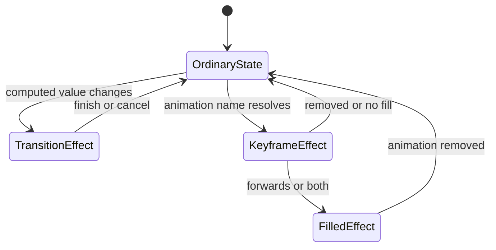

<TLDR>
  <TLDRCell label="what">
    CSS过渡在属性值变化时插入中间值；CSS关键帧动画则定义一条可重复、可分段控制的时间线。
  </TLDRCell>
  <TLDRCell label="trap">
    `animation-fill-mode: forwards`不会把终点写回普通样式，`transition: all`也会让后来新增的属性意外参与过渡。
  </TLDRCell>
  <TLDRCell label="fix">
    明确列出参与动画的属性，把最终状态写进普通规则，并为`prefers-reduced-motion`提供不会依赖结束事件的路径。
  </TLDRCell>
</TLDR>

## 是什么，为什么存在

CSS动画（CSS animation）让浏览器随时间改变元素的呈现值。它解决的不是“让页面动起来”这一抽象目标，而是把界面从一个可解释的状态带到另一个状态：按钮确认保存、通知进入视野、进度状态持续提示，或列表按顺序出现。

CSS提供两种主要机制。<Term id="css-transition">CSS过渡（CSS transition）</Term>观察属性的前值与后值，在值发生变化时生成插值过程。关键帧动画通过`@keyframes`描述一个周期内的多个位置，再由`animation-*`属性启动并控制这条时间线。

状态已经由伪类、媒体查询、属性或类名表达，而且只需从当前值到目标值时，过渡通常更合适。效果需要自动开始、重复、交替，或者经过三个以上明确阶段时，关键帧动画更直接。二者都只改变呈现，不应承担业务状态、焦点管理或可访问名称。

动画必须传达有用的反馈，同时允许用户减少非必要运动。颜色或透明度变化也能表达状态，但不能假设每个人都能安全、舒适地接受缩放、平移或持续旋转。

## 工作原理

浏览器先通过层叠与继承得到属性的计算值，再在时间线上为可动画属性求中间值。动画效果会参与计算值的生成，但它不会改写样式表中的声明，也不会替你修改DOM状态。动画结束后的视觉结果和应用真实状态因此必须分开考虑。

下面的状态图区分了普通样式、活动效果与填充效果。所有路径最终都要能回到由普通样式和DOM状态描述的界面。



### 过渡响应值变化

过渡比较一次样式更新前后的值。属性被列入`transition-property`、持续时间大于`0s`、前后值不同且可插值时，浏览器才会为它生成过渡。仅仅给元素声明`transition`不会产生运动；还需要伪类、类名、属性或脚本造成目标值变化。

简写中第一个时间值是持续时间，第二个时间值是延迟。逗号分隔的每一组描述一个属性，因此`opacity 120ms linear, transform 240ms ease 40ms`会生成两条时间参数不同的过渡。明确列出属性能把组件的视觉契约保留在规则中。

中途反转时，新的过渡从当前呈现值接续，而不是先跳回旧端点。快速移入再移出悬停目标时，这条规则通常能得到连贯反馈；测试不能只覆盖完整播放一次的路径。

### 关键帧定义一个周期

<Term id="keyframe">关键帧（keyframe）</Term>用`from`、`to`或百分比标出一个动画周期中的属性值。浏览器在相邻关键帧之间插值；缺少`0%`或`100%`时，会用元素对应属性的计算值补出端点。

`animation`简写把名称、持续时间、<Term id="timing-function">缓动函数（timing function）</Term>、延迟、迭代次数、方向、填充模式和播放状态组合起来。持续时间的初始值是`0s`，所以只写`animation-name`看不到持续变化。多条动画用逗号分隔；若它们同时写同一个属性，列表中靠后的动画效果取得优先权。

缓动函数把线性时间进度映射为视觉进度。`linear`保持匀速，`cubic-bezier()`提供连续曲线，`steps()`则产生离散台阶。动画上的缓动会分别作用于相邻关键帧区间，而不是只把整条多段时间线当成一段。

### 填充模式只延长效果

默认的`animation-fill-mode: none`只让动画在活动阶段影响呈现。`backwards`可在延迟期间应用首帧，`forwards`可在结束后继续提供末帧效果，`both`同时包含两者。这些值没有把末帧写进类名、行内样式或组件状态。

如果动画代表持久状态变化，普通规则应表达最终状态，动画只负责到达它的过程。这样即使动画被禁用、取消或从未生成，界面仍处于正确状态。

### 事件只观察效果

过渡可发出`transitionrun`、`transitionstart`、`transitionend`与`transitioncancel`，关键帧动画有对应的开始、迭代、结束与取消事件。一个元素上的多个属性或动画可以分别发出事件，处理器必须检查`propertyName`或`animationName`。

结束事件适合清理临时类名或记录视觉完成，不适合成为提交业务状态的唯一入口。效果没有生成、被取消或元素停止渲染时，代码仍需有确定的完成路径。

## 示例

### 由状态变化触发过渡

按钮的`aria-pressed`同时表达真实状态并作为CSS选择器。过渡只是状态切换时的反馈，脚本不需要控制每一帧。

<Depth level="quick">

```html run title="state-transition.html"
<button id="save" class="save-button" aria-pressed="false">
  Save
</button>

<style>
  .save-button {
    transform: translateY(0);
    background: #334155;
    color: white;
    border: 0;
    border-radius: 0.375rem;
    padding: 0.5rem 0.875rem;
    font: inherit;
    cursor: pointer;
    box-shadow: 0 1px 2px rgb(0 0 0 / 20%);
    transition: transform 120ms linear, background-color 120ms linear;
  }

  .save-button[aria-pressed="true"] {
    transform: translateY(-4px);
    background: #047857;
  }
</style>

<script>
  const button = document.querySelector('#save');
  console.log(`before: saved=${button.ariaPressed}`);

  button.addEventListener('transitionend', (event) => {
    if (event.propertyName === 'transform') {
      console.log(`after: saved=${button.ariaPressed}; event=transform`);
    }
  });

  button.addEventListener('click', () => {
    button.ariaPressed = String(button.ariaPressed !== 'true');
  });

  requestAnimationFrame(() => requestAnimationFrame(() => button.click()));
</script>
```

```text
before: saved=false
after: saved=true; event=transform
```

</Depth>

浏览器实际为`transform`和`background-color`分别生成过渡，所以会产生两个`transitionend`事件。处理器按`propertyName`过滤，只记录一次完成状态。即使CSS没有加载，按钮的`aria-pressed`仍然会被正确更新。

### 用关键帧表达多段进入过程

通知先淡入并上移过头，再回到静止位置。这是三个阶段，所以关键帧比在脚本里连续切换多个类名更清楚。

```html run title="keyframe-entry.html"
<p id="notice" class="notice" role="status">Profile saved</p>

<style>
  .notice {
    opacity: 0;
    transform: translateY(12px);
    width: fit-content;
    margin: 0;
    padding: 0.625rem 0.875rem;
    border: 1px solid #86efac;
    border-radius: 0.375rem;
    background: #f0fdf4;
    color: #14532d;
    font: 1rem/1.4 system-ui;
  }

  .notice.is-visible {
    animation: reveal 120ms ease-out both;
  }

  @keyframes reveal {
    0% { opacity: 0; transform: translateY(12px); }
    70% { opacity: 1; transform: translateY(-2px); }
    100% { opacity: 1; transform: translateY(0); }
  }
</style>

<script>
  const notice = document.querySelector('#notice');

  notice.addEventListener('animationstart', (event) => {
    console.log(`animationstart: ${event.animationName}`);
  });

  notice.addEventListener('animationend', () => {
    console.log(`animationend: opacity=${getComputedStyle(notice).opacity}`);
  });

  requestAnimationFrame(() => notice.classList.add('is-visible'));
</script>
```

```text
animationstart: reveal
animationend: opacity=1
```

`both`让首帧能覆盖开始前的短暂间隙，并在结束后保持末帧效果。这里普通`.notice`规则仍是隐藏状态，因此移除`is-visible`会回到隐藏；若通知之后必须永久可见，就应把可见性写成独立状态，而不是长期依赖填充。

### 用自定义属性生成错峰延迟

每一项复用同一条动画，只通过自定义属性提供序号。持续时间与错峰间隔仍由CSS统一管理，模板不必生成完整的`animation`字符串。

```html run title="staggered-list.html"
<ol id="steps">
  <li class="step" style="--index: 0">Validate</li>
  <li class="step" style="--index: 1">Save</li>
  <li class="step" style="--index: 2">Notify</li>
</ol>

<style>
  #steps {
    display: grid;
    gap: 0.25rem;
    margin: 0;
    padding: 0;
    list-style: none;
  }
  .step {
    opacity: 0;
    animation: arrive 100ms ease-out both;
    animation-delay: calc(var(--index) * 40ms);
  }

  @keyframes arrive {
    from { opacity: 0; transform: translateY(6px); }
    to { opacity: 1; transform: translateY(0); }
  }
</style>

<script>
  const steps = [...document.querySelectorAll('.step')];
  const delays = steps.map((step) => getComputedStyle(step).animationDelay);
  console.log(`delays: ${delays.join(', ')}`);

  const finished = steps.map((step) => new Promise((resolve) => {
    step.addEventListener('animationend', resolve, { once: true });
  }));

  Promise.all(finished).then(() => {
    const opacities = steps.map((step) => getComputedStyle(step).opacity);
    console.log(`completed: ${opacities.join(', ')}`);
  });
</script>
```

```text
delays: 0s, 0.04s, 0.08s
completed: 1, 1, 1
```

这里的延迟按`0ms`、`40ms`、`80ms`递增，但DOM顺序和内容顺序没有改变。错峰只应作为视觉增强；读取顺序、键盘顺序和业务处理顺序不应等待动画。

### 为减少动态效果提供稳定路径

旋转只表示后台同步仍在进行，不承载唯一信息。减少动态效果时可以移除旋转，同时保留状态文本和布局。

```html run title="reduced-motion.html"
<p class="busy" role="status">
  <span id="orbit" class="orbit" aria-hidden="true"></span>
  Syncing
</p>

<style>
  .busy {
    display: inline-flex;
    align-items: center;
    gap: 0.5rem;
    margin: 0;
    color: #0f172a;
    font: 1rem/1.4 system-ui;
  }

  .orbit {
    display: inline-block;
    flex: none;
    width: 0.75rem;
    height: 0.75rem;
    border: 2px solid #94a3b8;
    border-top-color: #0f172a;
    border-radius: 50%;
    animation: orbit 600ms linear infinite;
  }

  @keyframes orbit {
    to { transform: rotate(1turn); }
  }

  @media (prefers-reduced-motion: reduce) {
    .orbit { animation: none; }
  }
</style>

<script>
  const reduced = matchMedia('(prefers-reduced-motion: reduce)').matches;
  const name = getComputedStyle(document.querySelector('#orbit')).animationName;
  console.log(`${reduced ? 'reduce' : 'no-preference'}: ${name}`);
</script>
```

```text
no-preference: orbit
reduce: none
```

两行输出来自同一页面在两个浏览器媒体偏好配置下的实际结果。减少动态效果分支没有隐藏“Syncing”，也没有把所有过渡强行缩短到接近零；它只移除了非必要旋转。

## 陷阱

> [!PITFALL]
> 使用`transition: all`会让组件以后新增的颜色、尺寸或位置属性自动参与过渡，调试时很难看出是谁扩大了动画范围。
>
> **修复：** 写出`transition-property`，或者在简写中逐项列出属性。代码审查时把列表与状态规则实际改变的属性逐一对照。

> [!PITFALL]
> 直接对`display: none`的元素做普通淡出，会立即停止渲染，因而没有可见的离场过程；依赖对应结束事件的清理逻辑也可能不运行。
>
> **修复：** 把视觉离场与最终隐藏分成明确状态，并为无动画路径直接完成隐藏。采用`transition-behavior: allow-discrete`与`@starting-style`前，要按目标浏览器验证CSS Transitions Level 2行为。

> [!PITFALL]
> 两个动画都写`transform`时，它们不会自动把平移、缩放与旋转拼起来。后出现的动画可能覆盖前一个效果，关键帧也可能覆盖组件原有的居中变换。
>
> **修复：** 让一个动画拥有完整的`transform`，或把不同效果放到嵌套包装元素上。开始动画前检查元素已有的计算变换。

> [!PITFALL]
> `animation-fill-mode: forwards`看起来像保存了终点，但它只是让动画效果在结束后继续参与层叠。删除类名或被更高优先级规则覆盖时，元素仍会回到普通样式。
>
> **修复：** 用类名、属性或组件状态表达持久终点。填充模式只处理延迟与活动阶段边界，不作为数据状态存储。

> [!PITFALL]
> JavaScript只等待`transitionend`或`animationend`才提交业务状态，会在持续时间为零、动画未生成、动画被取消或元素被移除时卡住。多个属性还会触发多个过渡结束事件。
>
> **修复：** 先提交业务状态，再把结束事件当作视觉清理信号；按属性或动画名称过滤，并提供超时或立即完成路径。测试减少动态效果分支和快速反转。

> [!PITFALL]
> 通过`translateZ(0)`或长期设置`will-change`来“强制GPU”不是稳定的性能保证。图层提升由浏览器决定，额外图层还会消耗内存并增加合成工作。
>
> **修复：** 优先改变通常不要求重新布局的属性，再用目标设备上的性能工具验证。只有测量显示收益时才短期使用`will-change`，并在动画结束后撤销。

<Depth level="deep">

## 动画效果如何参与层叠

CSS动画产生的值会加入层叠。普通的非`!important`声明通常会被正在运行的CSS动画覆盖，而`!important`声明可以覆盖动画值。过渡在层叠中的优先级又高于动画，因此同一属性同时发生过渡和关键帧动画时，眼前的结果未必来自代码中看起来更具体的选择器。

同一元素上的多条关键帧动画是列表值。若多条动画在同一时刻为同一属性提供值，列表中靠后的动画取得优先权；这不是通用的自动相加机制。复杂组合应明确分配属性或包装层，不要依赖声明顺序碰巧得到的画面。

填充模式把动画效果延伸到活动区间之外，所以填充中的值仍可能压过后来修改的普通声明。长期保留`forwards`会让已经结束的动画继续影响调试结果。持久终点最好由普通状态规则拥有，动画完成后可以安全移除动画类。

过渡则由前后两次样式变化之间的差异生成。它从当前呈现值接续中途反转，并可能缩短反向过程。因而事件次数和总时长不能仅从静态CSS字符串推断；需要在实际交互序列中观察。

## 用测量判断渲染成本

属性变化可能要求重新计算样式、布局、绘制或合成，具体路径取决于属性、元素、浏览器和当前图层状态。`transform`与`opacity`常能避免布局工作，但这不等于每个元素都已在独立GPU图层，也不保证大量透明层或大面积缩放便宜。

性能审查应先记录真实交互。用浏览器的Performance工具查看主线程中的Style、Layout与Paint事件，再检查Layers或渲染诊断信息。记录低端目标设备上的长帧与受影响区域；没有录制证据时，不给出“最快”或固定帧率承诺。

布局属性并非绝对禁止。折叠区域的高度变化可能必须影响文档流，使用缩放假装折叠反而会保留布局空间。先保证语义和最终布局正确，再比较实现的实际帧成本。

`will-change`是让浏览器提前准备某种变化的提示，不是创建合成层的命令。过早或广泛使用会延长资源占用。把它限制在即将发生且测量确认受益的效果上，并在效果结束后恢复为`auto`。

</Depth>

<Checkpoint id="frontend/css-animation" />

## 延伸阅读

- [CSS Animations Level 1](https://www.w3.org/TR/css-animations-1/)
- [CSS Transitions Level 2](https://drafts.csswg.org/css-transitions-2/)
- [CSS Easing Functions Level 2](https://drafts.csswg.org/css-easing-2/)
- [Media Queries Level 5中的`prefers-reduced-motion`](https://drafts.csswg.org/mediaqueries-5/#prefers-reduced-motion)
- [WCAG 2.2：理解由交互触发的动画](https://www.w3.org/WAI/WCAG22/Understanding/animation-from-interactions.html)
