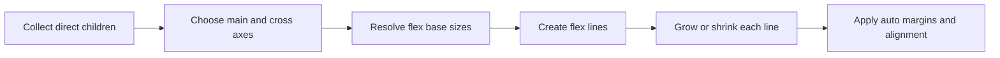

<TLDR>
  <TLDRCell label="what">
    Flexbox is a one-dimensional layout model. A container lays out its direct children on the main axis, then aligns them on the cross axis.
  </TLDRCell>
  <TLDRCell label="trap">
    `flex: 1` does not automatically override a content-based minimum size, and `order` or reverse directions do not change DOM or keyboard order.
  </TLDRCell>
  <TLDRCell label="fix">
    Identify the axes and available space, then state each item's base size and flexibility; when text must truly shrink, inspect `min-inline-size: 0`.
  </TLDRCell>
</TLDR>

## What it is and why it exists

CSS Flexible Box Layout, usually called Flexbox, arranges and distributes space in one direction. After you set `display: flex`, the element becomes a <Term id="flex-container">flex container</Term> and its direct children become <Term id="flex-item">flex items</Term>. Deeper descendants do not automatically participate in that container's flex layout.

Flexbox solves one-dimensional layout when content sizes are not fixed. Navigation labels vary in length, text in a media object may overflow, and a button group may need to wrap in a narrow container. Floats and positioning require manual width and alignment compensation for those cases; Flexbox puts free space, shrinking, and alignment in one model.

One-dimensional does not mean one line forever. With `flex-wrap`, a container can create multiple flex lines, but each line still calculates flexible sizes independently. CSS Grid is usually a better fit when items must obey explicit row and column tracks at the same time; a row of controls, a column of panels, or a content-driven wrapping list fits Flexbox.

Flexbox changes presentation, not document meaning. DOM order still determines the normal reading and keyboard order, and containers and items keep their semantics. Layout rules should support correct HTML structure, not use visual reordering to patch a bad structure.

## How it works

Flex layout first establishes an independent flex formatting context and collects the container's direct children. Each item has a flex base size, a grow factor, a shrink factor, and a minimum size. The browser calculates these values per line before it performs alignment.

The flow below shows the order people most often confuse. Sizing happens before alignment, so `justify-content` handles only the space left after flexing and auto margins.



### Main and cross axes

The <Term id="main-axis">main axis</Term> comes from `flex-direction`. `row` follows the writing mode's inline axis, while `column` follows its block axis; `row-reverse` and `column-reverse` swap main-start and main-end. The main axis is not always horizontal because writing mode and text direction affect it.

The <Term id="cross-axis">cross axis</Term> is perpendicular to the main axis. `justify-content` distributes space on the main axis, while `align-items` and `align-self` align items on the cross axis. Memorizing these properties as horizontal and vertical breaks as soon as a container uses `flex-direction: column` or a vertical writing mode.

`gap` creates fixed gutters between adjacent items or flex lines, but it does not add space around the container's edges. `padding` still owns that outer inset. An `auto` margin on the main axis absorbs positive free space before alignment, which makes it useful for pushing the last control in a toolbar to the end.

### Base sizes and flexible space

`flex-basis` supplies the main-axis size at the start of flexing. `auto` consults the item's main-size property and content, a length gives an explicit base, and a zero base makes growth ratios less dependent on intrinsic content sizes. It is not the final size; minimums, maximums, content, and available space can still change the result.

With positive free space, unfrozen items receive space in proportion to `flex-grow`. With negative free space, the browser weights reduction by `flex-shrink` multiplied by the flex base size. Wider items therefore take more of the reduction when shrink factors match, instead of every item losing the same number of pixels.

The `flex` shorthand keeps these three inputs together. `flex: initial` does not grow but can shrink, `flex: auto` flexes from an automatic base, and `flex: none` disables flexible sizing. A single positive number is common for equal shares of free space, but you must still inspect the automatic minimum size and box model.

### Wrapping and alignment

The default `flex-wrap: nowrap` puts every item on one flex line. When space is short, items try to shrink; they overflow only after minimum-size constraints stop further reduction. `wrap` creates lines from the available main-axis space, and each line grows or shrinks independently, so items on different flex lines do not form guaranteed columns.

`align-items` controls the cross-axis position of items within a line. `align-content` controls how multiple flex lines as a group occupy the container's cross-axis space. Its values become visibly different only when there are multiple lines and distributable cross-axis space. Use `align-self` when one item needs different alignment.

The default `align-items: stretch` stretches only items whose cross size is `auto`, and minimum and maximum sizes still constrain it. Once you give an item an explicit height, adding `stretch` usually has no visible effect. The property is not broken; the item has supplied its own cross size.

## Examples

### Push a toolbar control with an auto margin

This toolbar has one flex line. The first two links stay in source order, while the button's logical start margin absorbs free space and pushes it toward main-end; `gap` supplies only the fixed gutters between items.

<Depth level="quick">

```html run title="toolbar.html"
<nav class="toolbar" aria-label="Project">
  <a href="#docs">Docs</a>
  <a href="#examples">Examples</a>
  <button class="search" type="button">Search</button>
</nav>

<style>
  .toolbar {
    display: flex;
    align-items: center;
    gap: 12px;
    inline-size: 360px;
    padding: 8px;
  }

  .search {
    margin-inline-start: auto;
  }
</style>

<script>
  const toolbar = document.querySelector('.toolbar');
  const style = getComputedStyle(toolbar);
  const labels = [...toolbar.children].map((item) => item.textContent.trim());

  console.log(`display=${style.display}; direction=${style.flexDirection}; gap=${style.gap}`);
  console.log(`items=${labels.length}; first=${labels.at(0)}; last=${labels.at(-1)}`);
</script>
```

```text
display=flex; direction=row; gap=12px
items=3; first=Docs; last=Search
```

</Depth>

The output confirms the default `row` main axis and unchanged source order for all three items. `margin-inline-start` replaces `margin-left` so the rule follows the logical start edge when writing direction changes.

### Give cards an equal zero base

The container is `420px` wide, and two `12px` gaps consume `24px`, leaving `396px` for three cards. `flex: 1 1 0` gives them the same zero base, while `min-inline-size: 0` lets the card with longer content actually shrink.

```html run title="equal-cards.html"
<section class="cards" aria-label="Plans">
  <article class="card">Free</article>
  <article class="card">Team</article>
  <article class="card">Enterprise</article>
</section>

<style>
  .cards {
    display: flex;
    gap: 12px;
    inline-size: 420px;
  }

  .card {
    box-sizing: border-box;
    flex: 1 1 0;
    min-inline-size: 0;
    padding: 8px;
    background: #e2e8f0;
  }
</style>

<script>
  const cards = [...document.querySelectorAll('.card')];
  const widths = cards.map((card) => card.getBoundingClientRect().width);
  const style = getComputedStyle(cards[0]);

  console.log(`widths=${widths.join(',')}`);
  console.log(`grow=${style.flexGrow}; shrink=${style.flexShrink}; basis=${style.flexBasis}`);
</script>
```

```text
widths=132,132,132
grow=1; shrink=1; basis=0px
```

The measured border-box widths are all `132px`. That result depends on the equal padding and box model in this example; if cards have different borders, padding, or minimum sizes, `flex: 1` alone does not guarantee equal outer widths.

### Let long text shrink

The avatar stays `48px` wide and the text receives the remaining width. A flex item's default automatic minimum can use the content's min-content size, so a long unbreakable repository name pushes the row wider; setting the text item's logical minimum width to zero gives ellipsis a space in which to work.

```html run title="profile-row.html"
<article class="profile">
  " />
  <div class="details">
    <strong>Ada</strong>
    <div class="repository">frontend-platform-with-a-very-long-unbroken-name</div>
  </div>
</article>

<style>
  .profile {
    display: flex;
    gap: 12px;
    inline-size: 320px;
  }
  .avatar {
    flex: none;
    inline-size: 48px;
    block-size: 48px;
  }
  .details {
    flex: 1 1 auto;
    min-inline-size: 0;
  }
  .repository {
    overflow: hidden;
    text-overflow: ellipsis;
    white-space: nowrap;
  }
</style>

<script>
  const row = document.querySelector('.profile');
  const avatar = document.querySelector('.avatar');
  const details = document.querySelector('.details');
  const repository = document.querySelector('.repository');

  console.log(`row=${row.clientWidth}; avatar=${avatar.clientWidth}; details=${details.clientWidth}`);
  console.log(`truncated=${repository.scrollWidth > repository.clientWidth}`);
</script>
```

```text
row=320; avatar=48; details=260
truncated=true
```

The row consists exactly of the `48px` avatar, `12px` gap, and `260px` text item. `truncated=true` proves that the content's scroll width exceeds its visible width instead of asking you to infer ellipsis behavior from a screenshot.

### Keep source order across wrapped lines

Each step has a `104px` base, so the `224px` container fits two items and one `8px` gap per line. The fifth item enters a third line, but wrapping does not change DOM order.

```html run title="wrapped-tags.html"
<ul class="pipeline" aria-label="Pipeline">
  <li>Build</li>
  <li>Test</li>
  <li>Package</li>
  <li>Deploy</li>
  <li>Observe</li>
</ul>

<style>
  .pipeline {
    display: flex;
    flex-wrap: wrap;
    gap: 8px;
    inline-size: 224px;
    margin: 0;
    padding: 0;
    list-style: none;
  }
  .pipeline li {
    box-sizing: border-box;
    flex: 0 0 104px;
    block-size: 28px;
    padding: 4px;
    background: #dbeafe;
  }
</style>

<script>
  const pipeline = document.querySelector('.pipeline');
  const steps = [...pipeline.children];
  const containerTop = pipeline.getBoundingClientRect().top;
  const rows = steps.map((step) => step.getBoundingClientRect().top - containerTop);

  console.log(`rows=${rows.join(',')}`);
  console.log(`source-order=${steps.map((step) => step.textContent).join('>')}`);
</script>
```

```text
rows=0,0,36,36,72
source-order=Build>Test>Package>Deploy>Observe
```

Adjacent line tops differ by `36px`: the `28px` item height plus the `8px` gap. If items on separate flex lines need strict column alignment, use Grid tracks instead of relying on content to produce matching widths by accident.

## Pitfalls

> [!PITFALL]
> A text item can still push through the container after you set `flex-shrink: 1`. The usual cause is the <Term id="automatic-minimum-size">automatic minimum size</Term>, which stops it from shrinking below its min-content size.
>
> **Fix:** set `min-inline-size: 0` only on the item whose content may shrink, then decide whether long words, URLs, or code should wrap, clip, or scroll. Do not add `overflow: hidden` to the whole component blindly; it can clip focus outlines and popovers.

> [!PITFALL]
> Giving every item `flex: 1` does not necessarily produce equal outer widths. Automatic minimums, different padding or borders, explicit minimums, and unbreakable content can all change the result.
>
> **Fix:** decide whether the content boxes or border boxes must be equal, then normalize `box-sizing` and box-model inputs. Use a zero `flex-basis` when content bases should not differ, inspect minimum sizes, and measure the final border boxes with representative content.

> [!PITFALL]
> `justify-content` often appears to do nothing because there is no positive main-axis free space, or because an `auto` margin has already absorbed it. Alignment cannot create space while items are shrinking or overflowing.
>
> **Fix:** inspect the container's main size, final item sizes, `gap`, and margins in developer tools. Resolve sizing and overflow first, then choose how `justify-content` distributes what remains.

> [!PITFALL]
> `align-content` does not center items within one line. Changing it usually has no visible effect when the container does not wrap, creates only one flex line, or has no extra cross-axis space.
>
> **Fix:** use `align-items` within a line and `align-self` for an exceptional item. Use `align-content` only to distribute cross-axis space between multiple flex lines.

> [!PITFALL]
> `order`, `row-reverse`, and `column-reverse` change visual positions without synchronizing the DOM, speech, or sequential focus order. The left-to-right screen order can oppose the order produced by the Tab key.
>
> **Fix:** make DOM order match the reading and interaction logic. Reserve visual reordering for changes that do not alter meaning, and test every responsive breakpoint with a keyboard and screen reader.

## In the AI era

**What generated code gets wrong here**

Models often put `flex: 1` on both an avatar and its text but omit the text item's `min-inline-size: 0`, so the first long URL breaks the card. They also treat `justify-content: space-between` as a general column system and produce uneven holes after items wrap. Another common failure uses `order` or `row-reverse` to rearrange a mobile layout without checking whether keyboard focus still follows the visual order.

**Ask your AI to check**

- List each flex container's main axis, cross axis, wrapping mode, and direct flex items, and identify nested descendants that the container does not actually control.
- Test the layout with the longest label, an unbreakable URL, a replaced element, and the narrowest supported width; report which item hits an automatic minimum-size constraint.
- List interactive elements in DOM, visual, and Tab order, then explain every difference introduced by `order` or a reversed main axis.

**Review checklist**

- Check overflow, wrapping, and logical margins in a narrow container, with enlarged text, and in both text directions.
- Inspect computed `flex-grow`, `flex-shrink`, `flex-basis`, minimum size, and border-box width instead of guessing final sizes from the shorthand.
- Complete the interaction with a keyboard and confirm that visual order agrees with reading and focus order.

**Prompt vocabulary**

Use the exact terms `flex container`, `flex item`, `main axis`, `cross axis`, `flex base size`, `free space`, `automatic minimum size`, `single-line`, and `multi-line`. Ask the model "which box owns layout" and "which size constraint prevents shrinking"; "fix the responsive Flexbox" is too vague to verify.

<Depth level="deep">

## Automatic minimums decide whether items shrink

A flex item's main-axis minimum size defaults to `auto`. For a non-scroll item, that can produce a content-based floor from content size suggestions, specified sizes, and the aspect ratio of replaced elements. The default keeps short labels and images from collapsing into unreadable boxes, but it also causes many text-overflow bugs.

`flex-shrink` participates only in distributing negative free space; it does not bypass a minimum. When the algorithm's target falls below the floor, that item is clamped and frozen, and the browser redistributes the remaining reduction to other items. If every item reaches its floor, the container must overflow.

`min-inline-size: 0` expresses the intent better than `min-width: 0` because it follows the writing mode's inline axis. In a common `flex-direction: row` container, the inline axis is also the main axis; after a switch to `column`, the block-axis minimum is usually the one to inspect. Do not copy a zero minimum onto every descendant: apply it to the item that owns shrinkable content.

Images, videos, and other replaced elements also have intrinsic sizes and aspect ratios. When they must stay at a fixed thumbnail size, `flex: none` with explicit logical dimensions is more complete than `flex-shrink: 0` alone. When they may shrink responsively, give them maximum sizes and object-fit behavior that match the component.

## `flex-basis` and the main size

When `flex-basis` is `auto`, the browser consults the main-size property. A `row` container commonly consults `width`, and a `column` container commonly consults `height`; if that main size is also `auto`, content contributes to the base. A non-`auto` `flex-basis` becomes the starting point for flexing, though minimum and maximum sizes still clamp the target.

A zero base means "distribute from the same starting point," while an automatic base means "preserve content or the main size before sharing the remainder." Neither choice is universally better. A button group may need automatic bases to respect label differences, while pricing cards may need zero bases to form equal columns.

A percentage `flex-basis` needs a definite inner main size on the flex container as its reference. If that reference is indefinite, the percentage basis is treated as content. This is why the same child component can size differently inside an explicitly sized panel and a content-driven panel; inspect where the parent receives a definite size too.

Do not reduce `width` and `flex-basis` appearing together to a slogan that one always overrides the other. `flex-basis` selects the flex base, while `width` can still affect an `auto` base, a minimum-size suggestion, or another box-model constraint. Final sizes and computed values in developer tools are more reliable than a property-precedence mnemonic.

## Each flex line distributes space independently

Wrapping first collects items into lines using their outer hypothetical main sizes, then resolves flexible lengths on each line. Three items on the first line and two on the second do not share one sum of grow factors. That is why wrapped cards with `flex-grow: 1` often become wider on the final line.

Positive free space is distributed by grow factors. Negative free space is weighted by the shrink factor multiplied by the flex base size, preventing narrow and wide items with the same factor from losing an identical pixel count. After minimum or maximum constraints clamp an item, the algorithm freezes some items and continues distributing instead of ending with one division.

`gap`, margins, borders, and padding all reduce the space available to content boxes. Subtracting only the gaps while calculating equal columns can miss the other outer sizes. A reliable check records the container's inner main size, every item's outer target size, and every gutter.

Multiple lines are a collection of independent one-dimensional layouts, not a two-dimensional track system. When a design requires one column to share a width across lines, items to occupy row and column coordinates, or the last line to reuse earlier column lines, use Grid. Flexbox fits a line that should distribute naturally from its own content.

## Writing modes and source order

`row` follows the current writing mode's inline direction; it is not a fixed left-to-right instruction. `direction: rtl` changes inline-start, and `row-reverse` reverses the main axis again. Guessing screen order from property names alone becomes unreliable when both apply, so use logical properties and inspect the actual browser result.

The Flexbox specification defines `order` for modified document order in visual layout but requires non-visual media to keep source order. Sequential focus also normally follows document structure, not the repainted box positions. Put an important process in correct DOM order so an unstyled page, assistive technology, and automated tests receive the same meaning.

For responsive design, source order should satisfy the narrowest, most linear reading experience. A wider view can spread content with Grid areas or alignment that does not change meaning, without reordering primary actions. When a decorative item really must move visually, review that separately from the order of interactive controls.

## Nested containers own separate layouts

A flex container turns only its direct child boxes into flex items. Ordinary descendants inside an item continue in their own formatting context; an item becomes another flex container only when it also gets `display: flex`, establishing independent axes and sizing for its direct children.

An `align-items` rule on the outer container therefore does not align grandchildren. Find which direct parent box owns the elements you need to arrange, then put container properties on that parent. This ownership check matters whenever a component gains an extra wrapper.

Continuous text directly inside a flex container is wrapped in an anonymous flex item, but you cannot select and style that anonymous box like an ordinary element. Wrap the text in a semantic element when you need to control its flexibility, minimum size, or alignment.

## Debug from constraints

Most Flexbox failures are not a missing alignment property. They begin with the wrong layout owner or an overlooked size constraint. Checking in browser-algorithm order finds the cause faster than adding more shorthands.

1. In the element panel, confirm the actual flex container and its direct items, including any unexpected wrappers.
2. Mark main-start and main-end from `flex-direction`, `writing-mode`, and `direction`.
3. Record the container's inner main size and every item's `flex-basis`, intrinsic content size, minimum, and maximum.
4. Decide whether the current line has positive or negative free space, then inspect growth, shrinkage, auto margins, and `gap`.
5. Check `justify-content`, `align-items`, `align-content`, and source order last; alignment cannot repair the sizing conflict from the previous step.

Developer tools' Flex overlay is useful for seeing axes, lines, and gaps, while computed styles confirm shorthand expansion and minimum sizes. Test data should include short content, the longest real content, an unbreakable string, an image, and localized text. A layout that survives only placeholder copy is not finished.

</Depth>

<Checkpoint id="frontend/css-flexbox" />

## Further reading

- [CSS Flexible Box Layout Module Level 1](https://www.w3.org/TR/css-flexbox-1/)
- [CSS Box Alignment Module Level 3](https://www.w3.org/TR/css-align-3/)
- [MDN: Basic concepts of flexbox](https://developer.mozilla.org/en-US/docs/Web/CSS/Guides/Flexible_box_layout/Basic_concepts)
- [MDN: Controlling ratios of flex items along the main axis](https://developer.mozilla.org/en-US/docs/Web/CSS/Guides/Flexible_box_layout/Controlling_ratios_of_flex_items_along_the_main_axis)
- [MDN: Ordering flex items](https://developer.mozilla.org/en-US/docs/Web/CSS/Guides/Flexible_box_layout/Ordering_flex_items)
