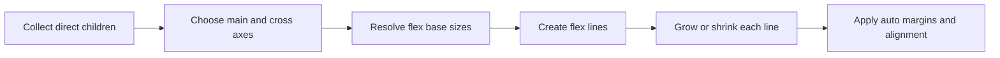

<TLDR>
  <TLDRCell label="what">
    Flexbox 是一维布局模型。容器沿主轴排列直接子元素，再沿交叉轴对齐它们。
  </TLDRCell>
  <TLDRCell label="trap">
    `flex: 1` 不会自动突破内容的最小尺寸，`order` 和反向排列也不会改变 DOM 与键盘顺序。
  </TLDRCell>
  <TLDRCell label="fix">
    先确定轴与可用空间，再明确项目的基准尺寸和伸缩规则；文本项目需要真正收缩时，检查 `min-inline-size: 0`。
  </TLDRCell>
</TLDR>

## 是什么，为什么存在

弹性盒布局（CSS Flexible Box Layout，通常简称 Flexbox）让一个容器沿一个方向排列和分配空间。设置 `display: flex` 后，元素成为 <Term id="flex-container">Flex 容器</Term>，它的直接子元素成为 <Term id="flex-item">Flex 项目</Term>。更深层的后代不会自动参与这个容器的 Flex 布局。

Flexbox 解决的是内容尺寸不固定时的一维布局。导航栏中的链接长短不同，媒体对象中的正文可能溢出，按钮组也可能需要在窄容器中换行。用浮动或定位处理这些情况，需要手动补偿宽度和对齐；Flexbox 把剩余空间、收缩和对齐写进同一套模型。

一维不等于永远只有一行。启用 `flex-wrap` 后，容器可以产生多条 Flex 行，但每一行仍独立计算弹性尺寸。需要让项目同时服从明确的行轨道和列轨道时，CSS Grid 通常更合适；组件内部的一排控件、一列面板或内容驱动的换行列表则适合 Flexbox。

Flexbox 改变呈现，不改变文档含义。项目的 DOM 顺序仍决定正常阅读顺序和键盘顺序，容器与项目也保留各自的语义。布局规则应服务于正确的 HTML 结构，而不是用视觉重排修补错误的结构。

## 工作原理

Flex 布局先建立一个独立的 Flex 格式化上下文，再收集容器的直接子元素。每个项目都有一个弹性基准尺寸、伸长因子、收缩因子和最小尺寸。浏览器按行计算这些值，然后才执行对齐。

下面的流程把最容易混淆的顺序画出来。尺寸分配发生在对齐之前，所以 `justify-content` 只处理弹性计算和自动外边距之后仍然剩下的空间。



### 主轴与交叉轴

<Term id="main-axis">主轴</Term>由 `flex-direction` 决定。`row` 与文字的行内轴同向，`column` 与块轴同向；`row-reverse` 和 `column-reverse` 交换主轴的起点与终点。主轴并不总是水平方向，书写模式和文字方向都会影响它。

<Term id="cross-axis">交叉轴</Term>垂直于主轴。`justify-content` 沿主轴分配剩余空间，`align-items` 和 `align-self` 沿交叉轴对齐项目。不要把这些属性记成水平和垂直，否则切换到 `flex-direction: column` 或竖排书写模式时很容易写反。

`gap` 在相邻项目或相邻 Flex 行之间创建固定间隔，但不会在容器边缘增加一圈空间。外边缘留白仍由 `padding` 负责。主轴上的 `auto` 外边距会先吸收正的剩余空间，因此常用于把工具栏中的最后一个按钮推到末端。

### 基准尺寸与弹性空间

`flex-basis` 给出弹性计算开始时的主轴尺寸。`auto` 会参考项目的主尺寸属性和内容，长度值给出明确基准，零基准则让伸长比例较少受内容固有尺寸影响。它不是最终尺寸；最小值、最大值、内容和可用空间仍可能改变结果。

有正剩余空间时，未冻结项目按 `flex-grow` 比例获得空间。有负剩余空间时，浏览器使用 `flex-shrink` 乘以弹性基准尺寸得到缩减权重。较宽项目因此会在相同收缩因子下承担更多缩减，而不是每个项目减去完全相同的像素数。

`flex` 简写让这三个输入保持在一起。`flex: initial` 表示不伸长但可以收缩，`flex: auto` 允许从自动基准伸缩，`flex: none` 禁止弹性伸缩。单个正数形式常用于等分剩余空间，但还要同时检查自动最小尺寸和盒模型。

### 换行与对齐

默认的 `flex-wrap: nowrap` 把所有项目放在一条 Flex 行中。空间不足时，项目会尝试收缩；受到最小尺寸限制后仍放不下才会溢出。`wrap` 根据主轴可用空间建立多条行，每条行单独执行伸长或收缩，所以不同 Flex 行上的项目不保证列宽对齐。

`align-items` 控制一条行内各项目的交叉轴位置，`align-content` 控制多条 Flex 行作为整体怎样占据容器的交叉轴空间。只有出现多条行并且交叉轴还有可分配空间时，`align-content` 的差别才容易看见。想让单个项目例外对齐，应使用 `align-self`。

默认的 `align-items: stretch` 只会拉伸交叉轴尺寸为 `auto` 的项目，并且仍受最小值与最大值约束。给项目写了明确高度后，再增加 `stretch` 通常看不到变化。这不是属性失效，而是项目已经提供了自己的交叉轴尺寸。

## 示例

### 工具栏中的自动外边距

这个工具栏只有一条 Flex 行。前两个链接按源顺序排列，按钮的逻辑起始外边距吸收剩余空间，把按钮推向主轴末端；`gap` 只负责项目之间的固定间隔。

<Depth level="quick">

```html run title="toolbar.html"
<nav class="toolbar" aria-label="Project">
  <a href="#docs">Docs</a>
  <a href="#examples">Examples</a>
  <button class="search" type="button">Search</button>
</nav>

<style>
  .toolbar {
    display: flex;
    align-items: center;
    gap: 12px;
    inline-size: 360px;
    padding: 8px;
  }

  .search {
    margin-inline-start: auto;
  }
</style>

<script>
  const toolbar = document.querySelector('.toolbar');
  const style = getComputedStyle(toolbar);
  const labels = [...toolbar.children].map((item) => item.textContent.trim());

  console.log(`display=${style.display}; direction=${style.flexDirection}; gap=${style.gap}`);
  console.log(`items=${labels.length}; first=${labels.at(0)}; last=${labels.at(-1)}`);
</script>
```

```text
display=flex; direction=row; gap=12px
items=3; first=Docs; last=Search
```

</Depth>

输出确认容器采用默认的 `row` 主轴，并且三个项目的源顺序没有变化。这里使用 `margin-inline-start` 而不是 `margin-left`，同一规则可以随书写方向切换逻辑起始边。

### 等宽卡片的零基准

容器宽度为 `420px`，两个 `12px` 间隔占去 `24px`，三个卡片平分剩下的 `396px`。`flex: 1 1 0` 为它们提供相同的零基准，`min-inline-size: 0` 允许内容较长的卡片真正收缩。

```html run title="equal-cards.html"
<section class="cards" aria-label="Plans">
  <article class="card">Free</article>
  <article class="card">Team</article>
  <article class="card">Enterprise</article>
</section>

<style>
  .cards {
    display: flex;
    gap: 12px;
    inline-size: 420px;
  }

  .card {
    box-sizing: border-box;
    flex: 1 1 0;
    min-inline-size: 0;
    padding: 8px;
    background: #e2e8f0;
  }
</style>

<script>
  const cards = [...document.querySelectorAll('.card')];
  const widths = cards.map((card) => card.getBoundingClientRect().width);
  const style = getComputedStyle(cards[0]);

  console.log(`widths=${widths.join(',')}`);
  console.log(`grow=${style.flexGrow}; shrink=${style.flexShrink}; basis=${style.flexBasis}`);
</script>
```

```text
widths=132,132,132
grow=1; shrink=1; basis=0px
```

测得的外框宽度都是 `132px`。这项结论依赖示例中相同的内边距和盒模型；若卡片的边框、内边距或最小尺寸不同，只写 `flex: 1` 不能保证外框仍然等宽。

### 允许长文本收缩

头像保持 `48px`，正文获得余下宽度。Flex 项目默认的自动最小尺寸可能采用内容的最小内容尺寸，长且不可断开的仓库名于是会把整行撑开；把正文的逻辑最小宽度设为零后，省略号才有可用的收缩空间。

```html run title="profile-row.html"
<article class="profile">
  " />
  <div class="details">
    <strong>Ada</strong>
    <div class="repository">frontend-platform-with-a-very-long-unbroken-name</div>
  </div>
</article>

<style>
  .profile {
    display: flex;
    gap: 12px;
    inline-size: 320px;
  }
  .avatar {
    flex: none;
    inline-size: 48px;
    block-size: 48px;
  }
  .details {
    flex: 1 1 auto;
    min-inline-size: 0;
  }
  .repository {
    overflow: hidden;
    text-overflow: ellipsis;
    white-space: nowrap;
  }
</style>

<script>
  const row = document.querySelector('.profile');
  const avatar = document.querySelector('.avatar');
  const details = document.querySelector('.details');
  const repository = document.querySelector('.repository');

  console.log(`row=${row.clientWidth}; avatar=${avatar.clientWidth}; details=${details.clientWidth}`);
  console.log(`truncated=${repository.scrollWidth > repository.clientWidth}`);
</script>
```

```text
row=320; avatar=48; details=260
truncated=true
```

行宽正好由 `48px` 头像、`12px` 间隔和 `260px` 正文组成。`truncated=true` 证明内容的滚动宽度大于可见宽度，而不是仅凭截图猜测省略号是否生效。

### 多行项目仍按源顺序排列

每个步骤的基准宽度为 `104px`，`224px` 容器一行能放两个项目和一个 `8px` 间隔。第五个项目进入第三行，但 DOM 顺序没有因换行发生改变。

```html run title="wrapped-tags.html"
<ul class="pipeline" aria-label="Pipeline">
  <li>Build</li>
  <li>Test</li>
  <li>Package</li>
  <li>Deploy</li>
  <li>Observe</li>
</ul>

<style>
  .pipeline {
    display: flex;
    flex-wrap: wrap;
    gap: 8px;
    inline-size: 224px;
    margin: 0;
    padding: 0;
    list-style: none;
  }
  .pipeline li {
    box-sizing: border-box;
    flex: 0 0 104px;
    block-size: 28px;
    padding: 4px;
    background: #dbeafe;
  }
</style>

<script>
  const pipeline = document.querySelector('.pipeline');
  const steps = [...pipeline.children];
  const containerTop = pipeline.getBoundingClientRect().top;
  const rows = steps.map((step) => step.getBoundingClientRect().top - containerTop);

  console.log(`rows=${rows.join(',')}`);
  console.log(`source-order=${steps.map((step) => step.textContent).join('>')}`);
</script>
```

```text
rows=0,0,36,36,72
source-order=Build>Test>Package>Deploy>Observe
```

相邻行顶端相差 `36px`，也就是 `28px` 项目高度加 `8px` 间隔。若要让不同 Flex 行形成严格对齐的列，应该改用 Grid 轨道，而不是依赖内容碰巧得到相同宽度。

## 陷阱

> [!PITFALL]
> 文本项目已经设置 `flex-shrink: 1`，仍然可能把容器撑破。原因通常不是收缩因子失效，而是 <Term id="automatic-minimum-size">自动最小尺寸</Term>阻止项目缩到最小内容尺寸以下。
>
> **修复：**只在确实允许内容收缩的项目上设置 `min-inline-size: 0`，并为长单词、URL 或代码决定换行、裁剪或滚动策略。不要给整个组件盲目加 `overflow: hidden`，它可能裁掉焦点轮廓和弹出内容。

> [!PITFALL]
> 给所有项目写 `flex: 1`，不一定得到相同的外框宽度。自动最小尺寸、不同的内边距和边框、明确的最小值以及不可断内容都可能使结果不同。
>
> **修复：**先明确要等分的是内容盒还是外框，再统一 `box-sizing` 和盒模型输入。需要忽略内容基准时使用零 `flex-basis`，同时检查最小尺寸，并在代表性内容下测量最终外框。

> [!PITFALL]
> `justify-content` 看似没有生效，常见原因是主轴没有正剩余空间，或者一个 `auto` 外边距已经把空间全部吸收。项目仍在收缩或溢出时，对齐属性无法再创造空间。
>
> **修复：**在开发者工具中查看容器主轴尺寸、项目最终尺寸、`gap` 和外边距。先解决尺寸与溢出，再选择 `justify-content` 的分配方式。

> [!PITFALL]
> `align-content` 不负责单行内项目的居中。容器没有换行、只生成一条 Flex 行，或交叉轴没有多余空间时，改变它通常没有可见效果。
>
> **修复：**用 `align-items` 对齐行内项目，用 `align-self` 覆盖单个项目。只有需要分配多条 Flex 行之间的交叉轴空间时才用 `align-content`。

> [!PITFALL]
> `order`、`row-reverse` 和 `column-reverse` 能改变视觉位置，却不会把 DOM、朗读或顺序焦点同步重排。屏幕上的左右顺序可能与按 Tab 键移动的顺序相反。
>
> **修复：**让 DOM 顺序本身符合阅读和操作逻辑。视觉重排只用于不影响含义的小变化，并使用键盘和屏幕阅读器检查每个响应式断点。

## AI 时代

**生成代码在这里容易犯的错误**

模型经常给头像和正文都加上 `flex: 1`，却漏掉正文需要的 `min-inline-size: 0`，长 URL 一出现就把卡片撑破。它们也会把 `justify-content: space-between` 当成通用分栏方案，在项目换行后制造每行不同的空洞；另一种常见错误是用 `order` 或 `row-reverse` 调整移动端布局，却没有检查键盘焦点与可视顺序是否一致。

**要求 AI 检查**

- 列出每个 Flex 容器的主轴、交叉轴、换行方式和所有直接 Flex 项目，并指出哪些嵌套后代其实不受该容器控制。
- 用最长标签、不可断 URL、替换元素和最窄支持宽度测试布局，报告哪个项目受到自动最小尺寸限制。
- 按 DOM、视觉和 Tab 三种顺序列出交互元素，再说明任何 `order` 或反向主轴规则造成的差异。

**审查清单**

- 在窄容器、放大文字和两种文字方向下检查溢出、换行与逻辑边距。
- 查看计算后的 `flex-grow`、`flex-shrink`、`flex-basis`、最小尺寸和外框宽度，不从简写猜最终尺寸。
- 只用键盘走完交互，并确认视觉顺序与阅读和焦点顺序一致。

**提示词词汇**

使用准确术语 `flex container`（Flex 容器）、`flex item`（Flex 项目）、`main axis`（主轴）、`cross axis`（交叉轴）、`flex base size`（弹性基准尺寸）、`free space`（自由空间）、`automatic minimum size`（自动最小尺寸）、`single-line`（单行）和 `multi-line`（多行）。要求模型说明“哪一个盒子拥有布局”和“哪一个尺寸约束阻止收缩”，比要求“修好响应式 Flexbox”更容易验证。

<Depth level="deep">

## 自动最小尺寸决定能否收缩

Flex 项目的主轴最小尺寸默认是 `auto`。对于非滚动项目，它可能根据内容建议尺寸、指定尺寸和替换元素的纵横比计算一个内容相关下限。这项默认值可以避免短标签和图片被压得无法识别，但也正是许多文本溢出的来源。

`flex-shrink` 只参与分配负剩余空间，不会绕过最小尺寸。算法算出的目标尺寸低于下限时，项目会被钳制并冻结，浏览器再把仍需缩减的空间分给其他项目。若所有项目都到达下限，容器只能溢出。

`min-inline-size: 0` 比 `min-width: 0` 更能表达意图，因为它随书写模式指向行内轴。在常见的 `flex-direction: row` 中，行内轴也是主轴；若容器改成 `column`，需要检查的通常变成块轴最小尺寸。不要把零最小值复制到所有后代，只给确实承担可收缩内容的项目。

图片、视频和其他替换元素还带有固有尺寸与纵横比。若它们必须保持固定缩略图尺寸，`flex: none` 配合明确的逻辑宽高通常比只写 `flex-shrink: 0` 更完整；若允许响应式缩小，则应给出最大尺寸和适合该组件的对象适配规则。

## `flex-basis` 与主尺寸

当 `flex-basis` 是 `auto` 时，浏览器会查看主尺寸属性。例如，`row` 容器通常参考 `width`，`column` 容器通常参考 `height`；主尺寸也是 `auto` 时，内容参与确定基准。把 `flex-basis` 改成非 `auto` 值后，该值成为弹性计算的起点，但最小值和最大值仍会钳制目标尺寸。

零基准适合表达“从同一起点分配空间”，自动基准适合表达“先保留内容或主尺寸，再分配余量”。两者没有普遍的优劣。按钮组可能需要自动基准以保留标签差异，价格卡片可能需要零基准以形成相同列宽。

百分比 `flex-basis` 需要一个确定的容器主轴内部尺寸作为参照。参照尺寸不确定时，百分比基准按内容处理；这就是同一个子组件放进明确宽度面板和内容驱动面板后可能得到不同结果的原因。调试时应同时检查父容器的确定尺寸来源。

`width` 与 `flex-basis` 同时出现时，不要简单概括为一个总会覆盖另一个。`flex-basis` 选择弹性基准，`width` 仍可能通过 `auto` 基准、最小尺寸建议或其他盒模型约束影响结果。开发者工具中的最终尺寸和计算值比“属性优先级”口诀可靠。

## 每条 Flex 行独立分配空间

换行算法先根据项目的外部假设主尺寸把项目收集到多条行中，再对每条行分别解析弹性长度。第一行的三个项目与第二行的两个项目不会共享一个伸长因子总和。因此，`flex-grow: 1` 的换行卡片常在最后一行变得更宽。

正剩余空间按伸长因子分配。负剩余空间则按收缩因子乘以弹性基准尺寸后的权重分配，这项缩放避免窄项目和宽项目在相同因子下都减少同样的像素。每次最小值或最大值钳制项目后，算法会冻结部分项目并继续分配，而不是一次除法就结束。

`gap`、外边距、边框和内边距都会减少可供内容盒使用的空间。计算等宽布局时只减去 `gap` 仍可能漏掉其他外部尺寸。最稳妥的检查方式是同时记录容器内部主尺寸、每个项目外部目标尺寸和所有间隔。

多行形成的是一组独立的一维布局，不是二维轨道系统。若设计要求同一列跨行共享宽度、项目按行列坐标定位，或最后一行必须沿用前几行的列线，应使用 Grid。Flexbox 更适合让每行根据自身内容自然分配。

## 书写模式与源顺序

`row` 跟随当前书写模式的行内方向，不等同于固定的从左到右。`direction: rtl` 会改变行内起点，`row-reverse` 又会反转主轴；两者叠加时，只凭属性名猜屏幕顺序很容易出错。逻辑属性和实际浏览器检查可以减少这种假设。

Flexbox 规范定义了 `order` 修改有序序组后的呈现顺序，但明确要求非视觉媒体继续使用源顺序。顺序焦点通常也遵循文档结构，而不是重新绘制后的盒子位置。把重要流程写成正确 DOM 顺序，能让无样式页面、辅助技术和自动化测试得到同一语义。

响应式设计中，源顺序应满足最窄和最线性的阅读方式。宽屏可以用 Grid 区域或不改变含义的对齐把内容摆开，而不必重排关键操作。确需视觉移动装饰性项目时，要把它与交互控件的顺序问题分开审查。

## 嵌套容器各自拥有布局

一个 Flex 容器只把直接子盒变成 Flex 项目。项目内部的普通后代仍按自身格式化上下文布局；若某个项目同时设置 `display: flex`，它才会成为另一个容器，为自己的直接子元素建立一套独立的轴和尺寸计算。

因此，把 `align-items` 写在外层容器上不会对齐孙元素。先找到需要排列的元素由哪个直接父盒拥有，再把容器属性写在那个父盒上。组件多出一层包装时，这项所有权检查尤其重要。

直接位于 Flex 容器中的连续文本会被包进匿名 Flex 项目，但这个匿名盒不能像普通元素一样单独选择和设置样式。需要控制该文本的伸缩、最小尺寸或对齐时，应使用符合语义的元素把它显式包起来。

## 从约束开始调试

Flexbox 问题通常不是缺少另一个对齐属性，而是误判了参与布局的盒子或尺寸约束。按浏览器算法的顺序检查，比反复添加简写更快定位根因。

1. 在元素面板确认真正的 Flex 容器及其直接项目，排除多余包装层。
2. 根据 `flex-direction`、`writing-mode` 和 `direction` 标出主轴起点与终点。
3. 记录容器内部主尺寸，以及每个项目的 `flex-basis`、固有内容尺寸、最小值和最大值。
4. 判断当前行拥有正剩余空间还是负剩余空间，再检查伸长、收缩、自动外边距和 `gap`。
5. 最后检查 `justify-content`、`align-items`、`align-content` 和源顺序；对齐无法修复前一步的尺寸矛盾。

开发者工具的 Flex 覆盖层适合观察轴、行和间隔，计算样式适合确认简写展开与最小尺寸。测试数据至少应包含短内容、最长真实内容、不可断字符串、图片和本地化文本。布局只在占位文案下成立，不算完成。

</Depth>

<Checkpoint id="frontend/css-flexbox" />

## 延伸阅读

- [CSS Flexible Box Layout Module Level 1](https://www.w3.org/TR/css-flexbox-1/)
- [CSS Box Alignment Module Level 3](https://www.w3.org/TR/css-align-3/)
- [MDN：Flexbox 基本概念](https://developer.mozilla.org/en-US/docs/Web/CSS/Guides/Flexible_box_layout/Basic_concepts)
- [MDN：控制主轴上的 Flex 项目比例](https://developer.mozilla.org/en-US/docs/Web/CSS/Guides/Flexible_box_layout/Controlling_ratios_of_flex_items_along_the_main_axis)
- [MDN：Flex 项目的排序](https://developer.mozilla.org/en-US/docs/Web/CSS/Guides/Flexible_box_layout/Ordering_flex_items)
