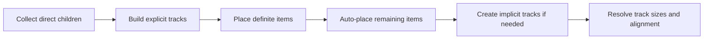

<TLDR>
  <TLDRCell label="what">
    CSS Grid is a two-dimensional layout model. A grid container places its direct children into a grid made of row and column tracks.
  </TLDRCell>
  <TLDRCell label="trap">
    `1fr` does not automatically override content minimums, and `dense` packing or explicit lines can make visual order diverge from DOM and keyboard order.
  </TLDRCell>
  <TLDRCell label="fix">
    Define source order and track constraints first, then inspect implicit tracks, longest content, and the narrowest container; use `minmax(0, 1fr)` or `min-inline-size: 0` when shrinking is intentional.
  </TLDRCell>
</TLDR>

## What it is and why it exists

CSS Grid Layout is a two-dimensional layout model for alignment across rows and columns. An element with `display: grid` becomes a <Term id="grid-container">grid container</Term>, and its direct children become <Term id="grid-item">grid items</Term>. Deeper descendants do not automatically participate in that grid.

Grid solves structures shared across two axes. A page shell can make its header span a sidebar and main content, a card collection can share column widths, and form labels can align across rows. With a one-dimensional layout, each row often calculates sizes independently and cannot guarantee that the next row follows the same columns.

Flexbox is usually more direct when layout distributes space mainly in one direction; Grid is usually clearer when both rows and columns are constraints. They can be nested: Grid can own the two-dimensional structure between components while Flexbox owns one row of buttons inside a component.

Grid changes presentation, not document meaning. Source order should still express content and task order, and HTML elements still need correct heading, navigation, main-content, and control semantics. Do not use grid placement to patch a faulty DOM structure.

## How it works

A grid consists of row and column tracks between adjacent grid lines. A <Term id="grid-track">grid track</Term> is the space between two neighboring grid lines; row and column lines enclose grid cells, and contiguous rectangular cells form a grid area. An item can enter the next available cell automatically or be placed explicitly by line or named area.

The flow below is a debugging model, not a literal transcription of the browser's specification algorithm. Establish the explicit grid and definitely positioned items first, then let auto-placement fill positions; overflow beyond the boundary creates implicit tracks, after which the browser has enough information to resolve track sizes and alignment.



### Explicit and implicit grids

The part defined by `grid-template-columns`, `grid-template-rows`, or `grid-template-areas` is the <Term id="explicit-grid">explicit grid</Term>. `grid-template-columns: 12rem 1fr` explicitly creates two columns, while `grid-template-rows: auto 1fr auto` creates three rows. Positive line numbers start from the explicit grid's start edge; negative numbers count backward from its end edge.

When items outnumber explicit cells or are assigned beyond the explicit boundary, the browser creates <Term id="implicit-grid">implicit grid</Term> tracks. `grid-auto-rows` and `grid-auto-columns` size those tracks; without them, implicit tracks are auto-sized. Unexpected horizontal scrolling often comes not from the template columns but from an item that created an implicit column.

### Track sizing and `fr`

Tracks can use fixed lengths, percentages, content keywords, or flexible units. `fr` represents a share of flexible leftover space in the grid container, not a fraction of the entire container width. Fixed tracks and `gap` consume space first, then remaining space is divided by `fr` ratios, so the two flexible tracks in `200px 1fr 2fr` receive a `1:2` ratio.

Content can still impose a floor on a track. A plain `1fr` track has an automatic minimum, so a long unbreakable string or intrinsically sized content may force it wider. Use `minmax(0, 1fr)` only when the design genuinely allows that content region to shrink, then choose a wrapping, clipping, or scrolling policy for the item.

`minmax(minimum, maximum)` gives a track a range. `repeat(auto-fit, minmax(min(100%, 16rem), 1fr))` creates as many columns as the container can hold while allowing a column to fall to `100%` when the container is narrower than `16rem`. The inner `min()` prevents the minimum track size itself from exceeding the container.

Both `auto-fill` and `auto-fit` calculate how many repeated tracks fit. With fewer items than tracks, `auto-fill` preserves empty tracks; `auto-fit` collapses them so existing items can use the released space. They look the same while items occupy every track, so test with fewer items before choosing one.

### Placement and named areas

`grid-column` and `grid-row` position items by grid line, with the ending line excluded from the span. `grid-column: 1 / 3` spans the two column tracks between lines 1 and 3, while `grid-column: span 2` spans two tracks from an automatic or specified start. `-1` means the final line of the explicit grid, not the end of an indefinitely growing implicit grid.

`grid-template-areas` draws rectangular areas with repeated names, and items enter them through `grid-area`. Every template row must have the same number of cells, and each repeated name must form one rectangle; otherwise the entire declaration is invalid. Named areas fit stable page shells, while grid lines fit repeated items and programmatic spans.

Items without a definite position use the auto-placement algorithm. The default `grid-auto-flow: row` searches along the inline direction before creating a new row; `column` swaps the primary filling direction. Adding `dense` lets later, smaller items backfill earlier holes, changing visual order without changing DOM order.

### Alignment and gaps

`justify-items` and `justify-self` align items within their grid areas on the inline axis; `align-items` and `align-self` do so on the block axis. The inline axis is not always horizontal, nor is the block axis always vertical; `writing-mode` and text direction affect both. `place-items` is shorthand for `align-items` and `justify-items`.

`justify-content` and `align-content` align the track collection, not individual items inside tracks. They produce a visible difference only when the container has distributable space on the relevant axis. `gap` creates gutters only between tracks; `padding` still owns the inset around the container's edges.

### Named lines and maintainable constraints

Numeric lines fit small, stable grids, but numbers in a page shell hide what each boundary means. Square brackets give one grid line one or more names, and items can then use those names for placement. Names belong to lines rather than tracks, so `content-start` and `content-end` express the two edges of the content track.

```css
.workspace {
  display: grid;
  grid-template-columns:
    [sidebar-start] minmax(12rem, 18rem)
    [sidebar-end content-start] minmax(0, 1fr)
    [content-end];
  gap: clamp(1rem, 3vw, 2rem);
}

.workspace > main {
  grid-column: content-start / content-end;
  min-inline-size: 0;
}
```

This template constrains the sidebar between `12rem` and `18rem` and lets the content track shrink to a zero floor. `clamp()` adjusts only the gutter, not the number of tracks. Named boundaries communicate intent better than `grid-column: 2 / 3` and reduce cascading edits when a new track is inserted.

The same name can occur on several lines, and `repeat()` can generate repeated names; a name plus an integer then selects a particular occurrence. Prefer unique names in a simple shell. For repeated grids, favor auto-placement and `span` instead of generating a brittle absolute line number for every item.

### Spans, overlap, and paint order

Several items can occupy the same grid area without `position: absolute`. They still participate in grid sizing and overlap in normal painting order; grid items can also use `z-index` to state their stacking order. Overlap fits a title or status badge on an image, but it must not leave an obscured interactive control in the focus order.

```css
.hero {
  display: grid;
  grid-template: "stack" minmax(14rem, 40vh) / minmax(0, 1fr);
}

.hero > img,
.hero > .caption {
  grid-area: stack;
}

.hero > .caption {
  z-index: 1;
  align-self: end;
  padding: 1rem;
}
```

The image and caption share the `stack` area, and the caption uses `z-index` to sit above the image. Source order should still put the image before the caption that describes it; if an overlay opens and closes, its hidden state must coordinate visibility, pointer hit testing, and keyboard focus.

## Examples

### Build a page shell with named areas

This shell has one fixed sidebar and one flexible main column. Its header spans both columns, and the script reads browser-computed tracks and item widths to confirm that the gap has already been removed from flexible space.

<Depth level="quick">

```html run title="named-shell.html"
<section class="page-shell">
  <header>Header</header>
  <nav>Navigation</nav>
  <main>Main</main>
</section>

<style>
  .page-shell {
    display: grid;
    grid-template-columns: 180px 1fr;
    grid-template-rows: 40px 120px;
    grid-template-areas:
      "header header"
      "nav main";
    column-gap: 16px;
    inline-size: 620px;
  }
  header { grid-area: header; }
  nav { grid-area: nav; }
  main { grid-area: main; }
</style>

<script>
  const shell = document.querySelector('.page-shell');
  const nav = document.querySelector('nav');
  const main = document.querySelector('main');
  const columns = getComputedStyle(shell).gridTemplateColumns.split(' ');

  console.log(`columns=${columns.join(',')}`);
  console.log(`header=${document.querySelector('header').clientWidth}; nav=${nav.clientWidth}; main=${main.clientWidth}`);
</script>
```

```text
columns=180px,424px
header=620; nav=180; main=424
```

</Depth>

After the `620px` container gives `180px` to the sidebar and `16px` to the gap, the main column receives `424px`. Named areas neither copy content nor change source order; they only map the three direct children into grid areas.

### Respond to the card container's width

The card grid uses `auto-fit`: the wide container holds four columns, while the narrow container holds two. The example changes the container's own logical width, so it verifies component space rather than one fixed viewport breakpoint.

```html run title="responsive-cards.html"
<section class="cards" aria-label="Plans">
  <article>Free</article>
  <article>Team</article>
  <article>Business</article>
  <article>Enterprise</article>
</section>

<style>
  .cards {
    display: grid;
    grid-template-columns:
      repeat(auto-fit, minmax(min(100%, 160px), 1fr));
    gap: 12px;
    inline-size: 700px;
  }
  .cards article {
    box-sizing: border-box;
    min-inline-size: 0;
    padding: 8px;
  }
</style>

<script>
  const cards = document.querySelector('.cards');
  const tracks = () => getComputedStyle(cards).gridTemplateColumns;

  console.log(`wide=${tracks()}`);
  cards.style.inlineSize = '340px';
  console.log(`narrow=${tracks()}`);
</script>
```

```text
wide=166px 166px 166px 166px
narrow=164px 164px
```

Three `12px` gaps in the `700px` container leave `664px`, making each column `166px`. At `340px`, one gap leaves `328px` and each column becomes `164px`; the remaining items enter the next row.

### Observe `dense` visual reordering

The two wide items span two columns each. `dense` lets the later narrow item C backfill the hole in the first row, so coordinate-sorted visual order no longer matches DOM order.

```html run title="dense-placement.html"
<section class="queue" aria-label="Processing order">
  <div class="wide">A</div>
  <div class="wide">B</div>
  <button type="button">C</button>
  <button type="button">D</button>
</section>

<style>
  .queue {
    display: grid;
    grid-template-columns: repeat(3, 80px);
    grid-auto-rows: 32px;
    grid-auto-flow: row dense;
    gap: 8px;
  }
  .wide { grid-column: span 2; }
</style>

<script>
  const items = [...document.querySelector('.queue').children];
  const visual = [...items].sort((left, right) =>
    left.offsetTop - right.offsetTop || left.offsetLeft - right.offsetLeft
  );

  console.log(`dom=${items.map((item) => item.textContent).join('>')}`);
  console.log(`visual=${visual.map((item) => item.textContent).join('>')}`);
</script>
```

```text
dom=A>B>C>D
visual=A>C>B>D
```

Keyboard focus still visits buttons C and D in DOM order, and assistive technology does not rewrite reading order from visual coordinates. `dense` fits decorative collections whose order does not matter, not forms, procedures, or action rows that need reordering.

### Let long content actually shrink

The second track uses `minmax(0, 1fr)`, and the item that owns the text also has a zero logical minimum. The unbreakable repository name therefore stays inside a `200px` track, where the component deliberately chooses ellipsis.

```html run title="shrinkable-result.html"
<article class="result">
  <div class="icon" aria-hidden="true">CSS</div>
  <div class="details">
    <strong>Repository</strong>
    <div class="repository">frontend-platform-with-a-very-long-name</div>
  </div>
</article>

<style>
  .result {
    display: grid;
    grid-template-columns: 48px minmax(0, 1fr);
    gap: 12px;
    inline-size: 260px;
  }
  .details { min-inline-size: 0; }
  .repository {
    overflow: hidden;
    text-overflow: ellipsis;
    white-space: nowrap;
  }
</style>

<script>
  const row = document.querySelector('.result');
  const icon = document.querySelector('.icon');
  const details = document.querySelector('.details');
  const repository = document.querySelector('.repository');

  console.log(`row=${row.clientWidth}; icon=${icon.clientWidth}; details=${details.clientWidth}`);
  console.log(`truncated=${repository.scrollWidth > repository.clientWidth}`);
</script>
```

```text
row=260; icon=48; details=200
truncated=true
```

The `260px` width is exactly the `48px` icon, `12px` gap, and `200px` details track. `truncated=true` proves that the content is wider than its visible area; `text-overflow: ellipsis` alone could not produce that result without shrinkable space.

## Pitfalls

> [!PITFALL]
> Treating `1fr` as “divide unconditionally” lets long content force the container wider. A track's automatic minimum can still use the item's min-content contribution.

**Fix:** find the item that actually owns the content. When the design allows shrinking, use `minmax(0, 1fr)` or `min-inline-size: 0`, then choose wrapping, clipping, or scrolling explicitly instead of hiding every overflow.

> [!PITFALL]
> Adding `gap` to `repeat(3, 33.333%)` usually exceeds the container because the percentage tracks already consume nearly all available width and the gutters are added afterward.

**Fix:** use `repeat(3, 1fr)` to divide leftover space. If percentage tracks are required, include gutters in the sizing calculation and measure the container's scroll width at the narrowest supported width.

> [!PITFALL]
> `grid-auto-flow: dense` may place a later item in an earlier hole. Screen order changes, but DOM, reading, and sequential focus order normally do not follow it.

**Fix:** make source order satisfy content and task logic first. Use `dense` only for order-independent items, then check the result with a keyboard, a screen reader, and an unstyled page.

> [!PITFALL]
> A leftover `grid-column: 2` or `1 / 4` can create implicit columns after a responsive template changes to one column. Generated code often edits the container template but forgets to reset item placement.

**Fix:** inspect the template and every explicit placement together for each layout variant. View actual tracks in developer tools and assert that an accidental implicit column does not make `scrollWidth` exceed `clientWidth`.

> [!PITFALL]
> If rows in `grid-template-areas` have different cell counts or a repeated name is not rectangular, the browser drops the entire declaration. A spelling mismatch can also disconnect an item's `grid-area` from the template.

**Fix:** tokenize and compare every row, then confirm that each name makes one rectangle. Read `getComputedStyle(container).gridTemplateAreas` instead of trusting a source template that merely looks grid-shaped.

## In the AI era

**What generated code gets wrong here**

Models often infer many fixed grid lines from a screenshot and carry desktop `grid-column: 1 / 4` rules into a one-column breakpoint, where the browser quietly creates implicit columns. They also combine `repeat(3, 33.333%)` with `gap`, causing horizontal scrolling, or assume `1fr` must contain long URLs, intrinsic images, and `white-space: nowrap`. To match a screenshot, generated code may reorder interactive elements with `dense` or arbitrary lines without checking Tab order.

**Ask your AI to check**

- List the explicit tracks, implicit tracks, and `getComputedStyle(...).gridTemplateColumns` result at every target container width.
- Replace sample content with the longest real string and intrinsic media, compare `scrollWidth` with `clientWidth`, and identify which item contributes the minimum size.
- List interactive elements in DOM order, visual-coordinate order, and Tab order, highlighting differences caused by `dense` or explicit placement.

**Review checklist**

- Verify track count, spans, gaps, and overflow at the narrowest, middle, and widest containers instead of resizing only the page viewport.
- Inspect each responsive template together with its item-placement rules and confirm that no accidental implicit row or column appears.
- Disable CSS and complete the task by keyboard alone, confirming that source order remains coherent and focus does not jump against visual order.

**Prompt vocabulary**

Use the exact terms `grid container`, `grid item`, `explicit grid`, `implicit grid`, `track sizing`, `auto-placement`, `automatic minimum size`, `source order`, and `subgrid`. Ask the AI to state container widths, computed tracks, and DOM order; “make it a responsive Grid” is too vague to expose conflicting constraints.

<Depth level="deep">

## Subgrid shares parent tracks

An ordinary nested grid calculates its tracks independently, so headings and action rows in adjacent cards may not align. A <Term id="subgrid">subgrid</Term> makes a nested grid adopt the parent's track sizes on a selected axis. Children still belong to the nested grid, but their lines correspond to the parent tracks spanned by that nested grid.

Each card below spans three parent row tracks, then uses those rows as its own subgrid. Titles, content, and footers from different cards therefore contribute to one set of parent row sizes, while each card still handles its column direction independently.

```css
.catalog {
  display: grid;
  grid-template-columns: repeat(3, minmax(0, 1fr));
  grid-template-rows: auto 1fr auto;
  gap: 1rem;
}

.card {
  display: grid;
  grid-row: span 3;
  grid-template-rows: subgrid;
}
```

`subgrid` replaces an independent track list on the selected axis, so the same declaration cannot append another set of local sizes. A subgrid uses the parent grid's gutters by default but can set its own `gap`. Use it for an axis that genuinely needs cross-component alignment; an ordinary nested grid is clearer when each card should keep its own rhythm.

Subgrid changes neither semantics nor ownership. Each card still needs a complete, sensible DOM order, and the parent tracks must provide the positions it is meant to span. Inspect parent and subgrid overlays together when debugging instead of looking only at the inner computed style.

</Depth>

<Checkpoint id="frontend/css-grid" />

## Further reading

- [CSS Grid Layout Module Level 2](https://www.w3.org/TR/css-grid-2/)
- [CSS Box Alignment Module Level 3](https://www.w3.org/TR/css-align-3/)
- [MDN: Basic concepts of grid layout](https://developer.mozilla.org/en-US/docs/Web/CSS/Guides/Grid_layout/Basic_concepts_of_grid_layout)
- [MDN: Relationship of grid layout with other layout methods](https://developer.mozilla.org/en-US/docs/Web/CSS/Guides/Grid_layout/Relationship_of_grid_layout_with_other_layout_methods)
- [MDN: Auto-placement in grid layout](https://developer.mozilla.org/en-US/docs/Web/CSS/Guides/Grid_layout/Auto-placement_in_grid_layout)
