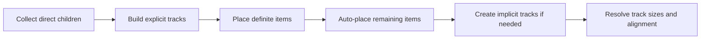

<TLDR>
  <TLDRCell label="what">
    CSS Grid 是二维布局模型。网格容器把直接子元素放入行轨道与列轨道组成的网格中。
  </TLDRCell>
  <TLDRCell label="trap">
    `1fr` 不会自动突破内容的最小尺寸；`dense` 与显式网格线还可能让视觉顺序偏离 DOM 和键盘顺序。
  </TLDRCell>
  <TLDRCell label="fix">
    先定义源顺序与轨道约束，再检查隐式轨道、最长内容和最窄容器；需要真正收缩时使用 `minmax(0, 1fr)` 或 `min-inline-size: 0`。
  </TLDRCell>
</TLDR>

## 是什么，为什么存在

CSS Grid Layout 是用于行列同时对齐的二维布局模型。元素设置 `display: grid` 后会成为<Term id="grid-container">网格容器（grid container）</Term>，它的直接子元素则成为<Term id="grid-item">网格项目（grid item）</Term>。更深层的后代不会自动参与这个网格。

Grid 解决的是跨两个轴共享结构的问题。页面外壳可以让页头跨过侧栏和主内容，卡片集合可以共享列宽，表单标签也可以跨行对齐。只用一维布局时，每一行往往单独计算尺寸，很难保证下一行仍遵守同一组列。

当布局主要沿一个方向分配空间时，Flexbox 通常更直接；当行和列都属于设计约束时，Grid 通常更清楚。两者可以嵌套：Grid 管组件之间的二维结构，Flexbox 管单个组件内部的一行按钮。

Grid 只改变呈现，不改变文档语义。源顺序仍应表达内容与任务顺序，HTML 元素仍要使用正确的标题、导航、主内容和控件语义。不要用网格定位修补错误的 DOM 结构。

## 工作原理

网格由相邻网格线之间的行轨道和列轨道组成。一个<Term id="grid-track">网格轨道（grid track）</Term>是两条相邻网格线之间的空间；行线与列线围成网格单元格，连续的矩形单元格构成网格区域。项目可以自动进入下一个可用单元格，也可以通过网格线或命名区域显式放置。

下面是适合调试的心智模型，不是浏览器规范算法的逐步复刻。先确定显式网格和已指定位置的项目，再由自动放置补齐位置；超出边界时产生隐式轨道，之后才有足够信息解析轨道尺寸与对齐。



### 显式网格与隐式网格

通过 `grid-template-columns`、`grid-template-rows` 或 `grid-template-areas` 定义的部分是<Term id="explicit-grid">显式网格（explicit grid）</Term>。`grid-template-columns: 12rem 1fr` 明确创建两列，而 `grid-template-rows: auto 1fr auto` 明确创建三行。正整数网格线编号从显式网格的起边开始，负数编号从显式网格的终边反向计算。

项目多于显式单元格，或被指定到显式边界之外时，浏览器会创建<Term id="implicit-grid">隐式网格（implicit grid）</Term>轨道。`grid-auto-rows` 与 `grid-auto-columns` 控制这些轨道的尺寸；未指定时，它们使用自动尺寸。意外出现的水平滚动常常不是模板列本身，而是某个项目创建了隐式列。

### 轨道尺寸与 `fr`

固定长度、百分比、内容关键字和弹性单位都可以定义轨道。`fr` 表示网格容器中弹性可用空间的一份，不是整个容器宽度的一份。固定轨道与 `gap` 先占用空间，剩余空间再按 `fr` 比例分配，因此 `200px 1fr 2fr` 中两条弹性轨道取得的比例是 `1:2`。

内容仍会给轨道施加下限。普通的 `1fr` 轨道最小值相当于 `auto`，长而不可断的字符串或带固有尺寸的内容可能把轨道撑宽。只有设计确实允许内容区域缩小时，才把轨道写成 `minmax(0, 1fr)`，并为项目选择换行、裁剪或滚动策略。

`minmax(minimum, maximum)` 为轨道声明范围。`repeat(auto-fit, minmax(min(100%, 16rem), 1fr))` 会创建容器容得下的列，并让列在容器比 `16rem` 更窄时降到 `100%`。内层 `min()` 防止最小轨道尺寸本身比容器更宽。

`auto-fill` 与 `auto-fit` 都会计算容得下的重复轨道。项目不足时，`auto-fill` 保留空轨道；`auto-fit` 折叠空轨道，让已有项目使用释放出的空间。项目正好填满所有轨道时，两者看起来相同，因此要用项目较少的用例验证选择。

### 放置与命名区域

`grid-column` 与 `grid-row` 使用网格线定位项目，结束线不包含在跨度内。`grid-column: 1 / 3` 跨过第 1 条到第 3 条线之间的两条列轨道，而 `grid-column: span 2` 从自动或指定的起点跨两条轨道。`-1` 指显式网格的最后一条线，不是隐式网格不断增长后的最后一条线。

`grid-template-areas` 用重复名称画出矩形区域，项目再用 `grid-area` 进入对应区域。模板的每一行必须有相同数量的单元格，同名区域必须组成一个矩形；否则整项声明无效。命名区域适合稳定的页面外壳，网格线更适合重复项目和程序化跨度。

没有明确位置的项目交给自动放置算法。默认的 `grid-auto-flow: row` 先沿行内方向寻找空位，再创建新行；`column` 交换主要填充方向。加上 `dense` 后，后面的较小项目可以回填前面的空洞，这会改变视觉顺序，却不会改变 DOM 顺序。

### 对齐与间隔

`justify-items` 与 `justify-self` 在网格区域的行内轴上对齐项目，`align-items` 与 `align-self` 在块轴上对齐项目。行内轴不一定是水平方向，块轴也不一定是垂直方向；`writing-mode` 与文字方向都会影响它们。`place-items` 是 `align-items` 和 `justify-items` 的简写。

`justify-content` 与 `align-content` 对齐的是整组轨道，而不是轨道内的单个项目。只有容器相应轴上还有可分配空间时，它们才产生可见差异。`gap` 只创建轨道之间的沟槽，容器外缘的留白仍由 `padding` 负责。

### 网格线名称与可维护约束

数字网格线适合局部、稳定的小网格，但页面外壳中的数字会隐藏边界含义。方括号可以为同一条线指定一个或多个名称，项目随后用名称定位。名称属于网格线，不是轨道，所以 `content-start` 与 `content-end` 表达的是内容轨道的两侧。

```css
.workspace {
  display: grid;
  grid-template-columns:
    [sidebar-start] minmax(12rem, 18rem)
    [sidebar-end content-start] minmax(0, 1fr)
    [content-end];
  gap: clamp(1rem, 3vw, 2rem);
}

.workspace > main {
  grid-column: content-start / content-end;
  min-inline-size: 0;
}
```

这段模板把侧栏限制在 `12rem` 到 `18rem`，并允许内容轨道缩到零下限。`clamp()` 只调整沟槽，不改变轨道数量。具名边界比 `grid-column: 2 / 3` 更能说明意图，也能减少插入新轨道后的连锁修改。

同一个名称可以出现在多条线上，`repeat()` 也可能生成重复名称；此时可以用名称和序号选择具体出现位置。简单外壳最好让名称唯一。重复网格应优先采用自动放置和 `span`，避免为每个项目生成脆弱的绝对线号。

### 跨度、重叠与绘制顺序

多个项目可以占据同一网格区域，这种重叠不需要 `position: absolute`。它们仍参与网格尺寸计算，并按正常绘制顺序叠放；网格项目还可以用 `z-index` 明确叠放层级。重叠适合图片上的标题或状态标记，但不能让被遮挡的交互控件继续留在焦点顺序中。

```css
.hero {
  display: grid;
  grid-template: "stack" minmax(14rem, 40vh) / minmax(0, 1fr);
}

.hero > img,
.hero > .caption {
  grid-area: stack;
}

.hero > .caption {
  z-index: 1;
  align-self: end;
  padding: 1rem;
}
```

这里的图片和说明共享名为 `stack` 的区域，说明通过 `z-index` 位于上层。源顺序仍应先放图片，再放与它相关的说明；如果覆盖层会打开、关闭，隐藏状态必须同步处理可见性、指针命中和键盘焦点。

## 示例

### 用命名区域搭建页面外壳

这个外壳有一条固定侧栏和一条弹性主列。页头占据两列，脚本读取浏览器计算后的轨道和项目宽度，以确认 `gap` 已经从弹性空间中扣除。

<Depth level="quick">

```html run title="named-shell.html"
<section class="page-shell">
  <header>Header</header>
  <nav>Navigation</nav>
  <main>Main</main>
</section>

<style>
  .page-shell {
    display: grid;
    grid-template-columns: 180px 1fr;
    grid-template-rows: 40px 120px;
    grid-template-areas:
      "header header"
      "nav main";
    column-gap: 16px;
    inline-size: 620px;
  }
  header { grid-area: header; }
  nav { grid-area: nav; }
  main { grid-area: main; }
</style>

<script>
  const shell = document.querySelector('.page-shell');
  const nav = document.querySelector('nav');
  const main = document.querySelector('main');
  const columns = getComputedStyle(shell).gridTemplateColumns.split(' ');

  console.log(`columns=${columns.join(',')}`);
  console.log(`header=${document.querySelector('header').clientWidth}; nav=${nav.clientWidth}; main=${main.clientWidth}`);
</script>
```

```text
columns=180px,424px
header=620; nav=180; main=424
```

</Depth>

容器的 `620px` 减去 `180px` 侧栏和 `16px` 间隔后，主列得到 `424px`。命名区域没有复制内容，也没有改变源顺序；它只把三个直接子元素映射到网格区域。

### 让卡片列响应容器宽度

卡片网格使用 `auto-fit`，宽容器可放四列，窄容器只能放两列。示例直接修改容器的逻辑宽度，因此验证的是组件自身可用空间，而不是某个固定视口断点。

```html run title="responsive-cards.html"
<section class="cards" aria-label="Plans">
  <article>Free</article>
  <article>Team</article>
  <article>Business</article>
  <article>Enterprise</article>
</section>

<style>
  .cards {
    display: grid;
    grid-template-columns:
      repeat(auto-fit, minmax(min(100%, 160px), 1fr));
    gap: 12px;
    inline-size: 700px;
  }
  .cards article {
    box-sizing: border-box;
    min-inline-size: 0;
    padding: 8px;
  }
</style>

<script>
  const cards = document.querySelector('.cards');
  const tracks = () => getComputedStyle(cards).gridTemplateColumns;

  console.log(`wide=${tracks()}`);
  cards.style.inlineSize = '340px';
  console.log(`narrow=${tracks()}`);
</script>
```

```text
wide=166px 166px 166px 166px
narrow=164px 164px
```

`700px` 容器中的三个 `12px` 间隔留下 `664px`，所以每列是 `166px`。容器降到 `340px` 后，一个间隔留下 `328px`，每列是 `164px`；其余项目进入下一行。

### 看见 `dense` 的视觉重排

两个宽项目各跨两列。`dense` 允许后出现的窄项目 C 回填第一行的空洞，因此视觉坐标排序不再等于 DOM 顺序。

```html run title="dense-placement.html"
<section class="queue" aria-label="Processing order">
  <div class="wide">A</div>
  <div class="wide">B</div>
  <button type="button">C</button>
  <button type="button">D</button>
</section>

<style>
  .queue {
    display: grid;
    grid-template-columns: repeat(3, 80px);
    grid-auto-rows: 32px;
    grid-auto-flow: row dense;
    gap: 8px;
  }
  .wide { grid-column: span 2; }
</style>

<script>
  const items = [...document.querySelector('.queue').children];
  const visual = [...items].sort((left, right) =>
    left.offsetTop - right.offsetTop || left.offsetLeft - right.offsetLeft
  );

  console.log(`dom=${items.map((item) => item.textContent).join('>')}`);
  console.log(`visual=${visual.map((item) => item.textContent).join('>')}`);
</script>
```

```text
dom=A>B>C>D
visual=A>C>B>D
```

键盘焦点仍按按钮 C、D 的 DOM 次序移动，辅助技术也不会因视觉坐标而重写阅读顺序。`dense` 适合顺序无关的装饰性集合，不适合用来重新安排表单、步骤或操作按钮。

### 让长内容真正收缩

第二条轨道使用 `minmax(0, 1fr)`，承载文本的项目也把逻辑最小宽度设为零。这样不可断的仓库名留在 `200px` 轨道内，并由组件明确选择省略显示。

```html run title="shrinkable-result.html"
<article class="result">
  <div class="icon" aria-hidden="true">CSS</div>
  <div class="details">
    <strong>Repository</strong>
    <div class="repository">frontend-platform-with-a-very-long-name</div>
  </div>
</article>

<style>
  .result {
    display: grid;
    grid-template-columns: 48px minmax(0, 1fr);
    gap: 12px;
    inline-size: 260px;
  }
  .details { min-inline-size: 0; }
  .repository {
    overflow: hidden;
    text-overflow: ellipsis;
    white-space: nowrap;
  }
</style>

<script>
  const row = document.querySelector('.result');
  const icon = document.querySelector('.icon');
  const details = document.querySelector('.details');
  const repository = document.querySelector('.repository');

  console.log(`row=${row.clientWidth}; icon=${icon.clientWidth}; details=${details.clientWidth}`);
  console.log(`truncated=${repository.scrollWidth > repository.clientWidth}`);
</script>
```

```text
row=260; icon=48; details=200
truncated=true
```

`260px` 宽度恰好由 `48px` 图标、`12px` 间隔和 `200px` 详情轨道组成。`truncated=true` 证明内容宽于可见区域；只有 `text-overflow: ellipsis` 而没有可收缩空间时，这个结果不会成立。

## 陷阱

> [!PITFALL]
> 把 `1fr` 理解成“无条件平分”会让长内容撑破容器。轨道的自动最小值仍可能采用项目的最小内容尺寸。

**修复：** 找到实际承载内容的项目。设计允许收缩时使用 `minmax(0, 1fr)` 或 `min-inline-size: 0`，再明确选择换行、裁剪或滚动，而不是把所有溢出一律隐藏。

> [!PITFALL]
> `repeat(3, 33.333%)` 再加 `gap` 通常超过容器，因为百分比轨道已经接近占满可用宽度，沟槽还会额外加入。

**修复：** 等分剩余空间时使用 `repeat(3, 1fr)`。确实需要百分比轨道时，把沟槽纳入尺寸计算，并在最窄支持宽度实测容器的滚动宽度。

> [!PITFALL]
> `grid-auto-flow: dense` 可以把后面的项目放进前面的空洞。屏幕上的顺序会变化，但 DOM、阅读和顺序焦点通常不会随之变化。

**修复：** 让源顺序先满足内容和任务逻辑。只对顺序无关的项目使用 `dense`，并用键盘、屏幕阅读器和无样式页面检查结果。

> [!PITFALL]
> 响应式模板改成一列后，遗留的 `grid-column: 2` 或 `1 / 4` 仍会创建隐式列。生成代码经常只改容器模板，却忘记重置项目放置规则。

**修复：** 在每个布局变体同时检查模板与所有显式放置。开发者工具中查看实际轨道，并断言 `scrollWidth` 没有因意外隐式列超过 `clientWidth`。

> [!PITFALL]
> `grid-template-areas` 中行长度不一致，或同名区域不是矩形时，浏览器会丢弃整条声明。拼写错误还会让项目的 `grid-area` 名称与模板脱节。

**修复：** 把每行按单元格分词比较，并确认每个名称只形成一个矩形。读取 `getComputedStyle(container).gridTemplateAreas`，不要只凭源码看起来像一张网格。

## AI 时代

**生成代码在这里常犯的错**

模型常从截图反推大量固定网格线，把桌面端的 `grid-column: 1 / 4` 原样留到单列断点，于是浏览器悄悄创建隐式列。它也常用 `repeat(3, 33.333%)` 配合 `gap` 造成水平滚动，或假设 `1fr` 一定能压住长 URL、固有宽度图片和 `white-space: nowrap`。为了贴近截图，生成代码还会使用 `dense` 或任意网格线重排交互元素，却不检查 Tab 顺序。

**让 AI 检查**

- 列出每个目标容器宽度下的显式轨道、隐式轨道和 `getComputedStyle(...).gridTemplateColumns` 结果。
- 用最长真实字符串和固有尺寸媒体替换示例内容，比较 `scrollWidth` 与 `clientWidth`，并指出哪个项目施加最小尺寸。
- 按 DOM 顺序、视觉坐标顺序和 Tab 顺序分别列出交互元素，标出由 `dense` 或显式放置造成的差异。

**审查清单**

- 在最窄、中间和最宽容器下验证轨道数量、跨度、间隔与溢出，而不只缩放整页视口。
- 同时检查每个响应式模板和项目放置规则，确认没有意外隐式行列。
- 禁用 CSS 并只用键盘完成任务，确认源顺序仍然正确，焦点不会逆着视觉顺序跳动。

**提示词词汇**

使用准确术语：`grid container`（网格容器）、`grid item`（网格项目）、`explicit grid`（显式网格）、`implicit grid`（隐式网格）、`track sizing`（轨道尺寸计算）、`auto-placement`（自动放置）、`automatic minimum size`（自动最小尺寸）、`source order`（源顺序）和 `subgrid`（子网格）。要求 AI 给出容器宽度、计算轨道和 DOM 顺序；“把它做成响应式 Grid”不足以暴露约束冲突。

<Depth level="deep">

## 子网格共享父级轨道

普通嵌套网格会独立计算自己的轨道，因此相邻卡片中的标题和操作区不一定对齐。<Term id="subgrid">子网格（subgrid）</Term>让嵌套网格在选定轴上采用父网格的轨道尺寸。子元素仍属于嵌套网格，但它们的网格线与父级中被该嵌套网格跨过的轨道对应。

下面的卡片各自跨过父网格的三条行轨道，再把这些行作为自己的子网格。不同卡片的标题、内容和页脚因此参与同一组父级行尺寸，而列方向仍由每张卡片自己处理。

```css
.catalog {
  display: grid;
  grid-template-columns: repeat(3, minmax(0, 1fr));
  grid-template-rows: auto 1fr auto;
  gap: 1rem;
}

.card {
  display: grid;
  grid-row: span 3;
  grid-template-rows: subgrid;
}
```

`subgrid` 取代所选轴上的独立轨道列表，所以不能再在同一声明中追加一组自有尺寸。子网格默认采用父网格的沟槽，但可以在子网格上另设 `gap`。它适合确实需要跨组件对齐的轴；如果每张卡片的内部节奏应独立，普通嵌套网格更清楚。

子网格不会改变语义或所有权。卡片仍应保持完整、合理的 DOM 顺序，父级轨道也必须为预期跨度提供位置。调试时同时查看父网格和子网格覆盖层，避免只检查内层计算样式。

</Depth>

<Checkpoint id="frontend/css-grid" />

## 延伸阅读

- [CSS Grid Layout Module Level 2](https://www.w3.org/TR/css-grid-2/)
- [CSS Box Alignment Module Level 3](https://www.w3.org/TR/css-align-3/)
- [MDN：网格布局的基本概念](https://developer.mozilla.org/en-US/docs/Web/CSS/Guides/Grid_layout/Basic_concepts_of_grid_layout)
- [MDN：网格布局与其他布局方法的关系](https://developer.mozilla.org/en-US/docs/Web/CSS/Guides/Grid_layout/Relationship_of_grid_layout_with_other_layout_methods)
- [MDN：网格自动放置](https://developer.mozilla.org/en-US/docs/Web/CSS/Guides/Grid_layout/Auto-placement_in_grid_layout)
