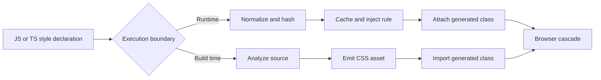

<TLDR>
  <TLDRCell label="what">
    CSS-in-JS lets JavaScript or TypeScript describe styles, then turns those descriptions into CSS rules or class names either while the app runs or during the build.
  </TLDRCell>
  <TLDRCell label="trap">
    A generated class name scopes a selector, but it does not cancel the cascade, remove browser rendering costs, or make server and client output deterministic.
  </TLDRCell>
  <TLDRCell label="fix">
    Choose the execution boundary deliberately, keep finite variants static, route frequently changing values through CSS custom properties, and test the emitted CSS.
  </TLDRCell>
</TLDR>

## What it is and why it exists

<Term id="css-in-js">CSS-in-JS</Term> is a family of techniques in which application code declares styles and a library or compiler produces CSS. The authoring form might be a tagged template, a JavaScript object, a function of component props, or a typed recipe. The browser still receives CSS declarations, selectors, and values; JavaScript is the authoring and delivery mechanism, not a replacement for CSS.

The approach gives a component an explicit dependency on its styles. Generated class names reduce accidental selector collisions, while ordinary imports make it easier to remove a component and the styles used only by that component. A JavaScript boundary also makes component state, theme tokens, and variants available to the styling layer.

You meet CSS-in-JS most often in component libraries and React applications, but the label covers different execution models. A runtime library creates or selects rules while components render. A build-time system analyzes source files and emits CSS assets before deployment. Some tools combine extraction with a small runtime for values that cannot be known during the build.

That distinction matters more than template syntax. It decides which expressions are legal, how much styling code reaches the client, when rules become available, and what server rendering must collect. Treat "CSS-in-JS" as a design space, not as one API with one performance profile.

Use it when component ownership, typed tokens, or a programmatic variant API removes real coordination work. Plain stylesheets, CSS Modules, Sass, and utility classes remain reasonable when the cascade already expresses the design cleanly. Co-location is useful, but it is not enough by itself to justify a runtime dependency.

## How it works

Every implementation must connect an authored style description to a browser-visible rule. The main choice is whether that connection happens during rendering or during compilation.



### Runtime generation

A runtime engine reads a style declaration when a component is created or rendered. It serializes the declaration, derives an identifier, checks a cache, and inserts a rule into a stylesheet when necessary. The component receives the corresponding class name. Libraries differ in when they do each step, so inspect the library's output rather than assuming every render creates a new `<style>` element.

<Term id="style-injection">Style injection</Term> is the act of adding generated rules to a document or server-side style collector. Caching is important because the same normalized style should reuse a rule. Interpolations based on props may create more rule combinations, especially when the input has many possible values.

Runtime generation can evaluate arbitrary application state. That flexibility is useful for values that genuinely depend on live JavaScript, but it also ties style availability to the component lifecycle. The library's server-rendering integration must collect the same rules that the client expects.

### Build-time extraction

With <Term id="static-extraction">static extraction</Term>, a compiler evaluates supported declarations during the build and writes ordinary CSS. Application code imports generated class names or calls an API whose possible results the compiler understands. The browser downloads the emitted stylesheet without needing a client-side rule generator for those declarations.

Extraction imposes an analyzability boundary. Literal objects, tokens, and finite variant maps are straightforward inputs. A value obtained from a request, browser measurement, or arbitrary runtime function cannot be turned into one fixed rule during the build. Tools handle that boundary with CSS custom properties, inline styles, predeclared variants, or a documented runtime layer.

"Zero runtime" describes the styling system's rule-generation path, not the entire application. Extracted CSS still has transfer, parse, cascade, style calculation, layout, and paint costs. The useful claim is narrower: static declarations do not require that library to generate rules in the browser.

### The cascade still decides the result

Both paths end in the CSS cascade. A unique class reduces name collisions, but normal origin, layer, importance, specificity, scoping proximity, and source-order rules still choose the winning declaration. Global selectors can affect generated elements, and generated selectors can override other styles.

Insertion order becomes part of behavior when selectors have equal priority. Code splitting, streaming, multiple caches, or mixing styling systems can change that order if the integration does not define it. Cascade layers and a documented style insertion point are more reliable than escalating specificity until a test happens to pass.

### Discrete state and continuous values

Finite states such as `tone="danger"`, `size="small"`, and `disabled` work well as predeclared classes or data-attribute selectors. Their set is bounded, so a compiler can emit every rule and a runtime engine can reuse a small cache. This also makes unsupported states visible to types and tests.

Values such as a drag coordinate, color-picker result, or progress percentage have a large or unbounded domain. Generating a class for every value grows the rule set and asks the styling engine to repeat work. Keep the structural rule stable and pass the changing value through a validated CSS custom property or inline style.

## Examples

These examples expose the mechanics with small, dependency-free programs. They are teaching models, not APIs to copy into production; a maintained library must also parse nested selectors, at-rules, escaping, prefixes, concurrency, and server integration.

### Hashing and caching one runtime rule

The first model normalizes an object, hashes the resulting declaration string, and caches the rule by class name. Sorting properties makes object insertion order irrelevant. The second call returns the same class without adding another entry.

<Depth level="quick">

```javascript run title="runtime-styles.js"
const insertedRules = new Map();

function toKebabCase(name) {
  return name.replace(/[A-Z]/g, (letter) => `-${letter.toLowerCase()}`);
}

function serialize(style) {
  return Object.entries(style)
    .sort(([left], [right]) => left.localeCompare(right))
    .map(([name, value]) => `${toKebabCase(name)}:${value}`)
    .join(";");
}

function hash(text) {
  let value = 2166136261;
  for (const character of text) {
    value ^= character.charCodeAt(0);
    value = Math.imul(value, 16777619);
  }
  return (value >>> 0).toString(36);
}

function classFor(style) {
  const declarations = serialize(style);
  const className = `cw-${hash(declarations)}`;
  const inserted = !insertedRules.has(className);
  insertedRules.set(className, `.${className}{${declarations}}`);
  return { className, inserted, cssText: insertedRules.get(className) };
}

const buttonStyle = {
  backgroundColor: "#2563eb",
  color: "white",
  padding: "0.5rem 0.75rem",
};

const first = classFor(buttonStyle);
const second = classFor(buttonStyle);
console.log(first.className);
console.log(first.cssText);
console.log(`inserted again: ${second.inserted}`);
```

```text
cw-ix791b
.cw-ix791b{background-color:#2563eb;color:white;padding:0.5rem 0.75rem}
inserted again: false
```

</Depth>

Production engines need collision handling and a complete CSS serializer; this tiny hash has neither. The useful observation is the data flow: equivalent declarations need a stable identity and a shared cache. If the server and client normalize differently, the class identity can diverge even when the intended CSS looks the same.

### Selecting finite variants

A build-time recipe can emit a bounded set of classes and leave runtime code to select among them. This plain JavaScript model validates both axes instead of silently falling back when generated code invents a variant name.

```javascript run title="variant-classes.js"
const buttonRecipe = {
  base: "button",
  tone: {
    primary: "button_tone_primary",
    quiet: "button_tone_quiet",
  },
  size: {
    small: "button_size_small",
    medium: "button_size_medium",
  },
};

function buttonClass({ tone = "primary", size = "medium" } = {}) {
  const toneClass = buttonRecipe.tone[tone];
  const sizeClass = buttonRecipe.size[size];
  if (!toneClass || !sizeClass) throw new RangeError("unknown button variant");
  return [buttonRecipe.base, toneClass, sizeClass].join(" ");
}

console.log(buttonClass());
console.log(buttonClass({ tone: "quiet", size: "small" }));

try {
  buttonClass({ tone: "warning" });
} catch (error) {
  console.log(`${error.name}: ${error.message}`);
}
```

```text
button button_tone_primary button_size_medium
button button_tone_quiet button_size_small
RangeError: unknown button variant
```

Real recipe tools often generate these names and TypeScript types together. The important boundary is still visible here: the CSS covers a finite state space, while runtime code only chooses a valid combination. A design-system component should document defaults and invalid combinations instead of accepting arbitrary strings.

### Passing a continuous value

Progress can change to many values, so it should not require a new class at every update. One stable rule reads `--progress`; application code clamps the input and sets only that custom property. The same numeric value also drives the accessibility state.

```javascript run title="dynamic-css-variables.js"
function progressProps(input) {
  const value = Math.min(100, Math.max(0, Number(input)));
  if (!Number.isFinite(value)) throw new TypeError("progress must be numeric");

  return {
    className: "progress",
    style: { "--progress": `${value}%` },
    "aria-valuenow": value,
  };
}

const rule = ".progress { inline-size: var(--progress); }";
console.log(rule);

for (const input of [-15, 45, 120]) {
  console.log(JSON.stringify(progressProps(input)));
}
```

```text
.progress { inline-size: var(--progress); }
{"className":"progress","style":{"--progress":"0%"},"aria-valuenow":0}
{"className":"progress","style":{"--progress":"45%"},"aria-valuenow":45}
{"className":"progress","style":{"--progress":"100%"},"aria-valuenow":100}
```

TypeScript can describe the custom-property key, but a type annotation does not clamp a runtime value or attach a unit. Validation belongs where untrusted or loosely typed data enters the component. The CSS should also provide a fallback when the property may be absent.

### Collecting deterministic server styles

Server rendering needs the HTML and the rules used by that render. This model collects finite variant rules in a request-local registry, deduplicates by class name, and sorts before serialization. A real integration may preserve a different defined order, especially when order carries cascade meaning.

```javascript run title="style-registry.js"
function createStyleRegistry() {
  const rules = new Map();

  return {
    use(className, cssText) {
      rules.set(className, `.${className}{${cssText}}`);
      return className;
    },
    flush() {
      return [...rules.entries()]
        .sort(([left], [right]) => left.localeCompare(right))
        .map(([, rule]) => rule)
        .join("\n");
    },
  };
}

function renderCard(registry, tone, label) {
  const variants = {
    neutral: ["card-neutral", "background:#f3f4f6;color:#111827"],
    urgent: ["card-urgent", "background:#fee2e2;color:#991b1b"],
  };
  const selected = variants[tone];
  if (!selected) throw new RangeError("unknown card tone");
  const className = registry.use(...selected);
  return `<article class="${className}">${label}</article>`;
}

const registry = createStyleRegistry();
const html = [
  renderCard(registry, "urgent", "Retry payment"),
  renderCard(registry, "neutral", "Receipt ready"),
].join("");

console.log(html);
console.log(registry.flush());
```

```text
<article class="card-urgent">Retry payment</article><article class="card-neutral">Receipt ready</article>
.card-neutral{background:#f3f4f6;color:#111827}
.card-urgent{background:#fee2e2;color:#991b1b}
```

The registry is created per render so concurrent requests do not leak rules into one another. Its output order is deterministic for this model, and repeated uses of a class overwrite the same map entry. Framework integrations add streaming, nonce handling, cache adoption, and cleanup rules that this example intentionally omits.

## Pitfalls

### Declaring styled components during render

> [!PITFALL]
> Creating a styled component inside another component's render path creates a new component identity on repeated renders in runtime systems that expose a `styled` factory.

React can remount the subtree, which loses focus, selection, uncontrolled input state, and local component state. The styling library may also repeat registration work. This is a correctness problem before it is a micro-optimization.

**Fix:** declare stable styled components at module scope. If a style depends on props, pass the prop to a module-scoped declaration or select a predeclared variant. Verify identity with a focus-preservation test instead of relying on a visual snapshot.

### Generating a class for every live value

> [!PITFALL]
> Interpolating mouse coordinates, animation progress, or arbitrary colors into rules can create a growing collection of nearly identical classes.

The exact cache behavior depends on the library, so there is no universal threshold at which this becomes slow. The smell is semantic: the value is instance data with a broad domain, while a class represents a reusable style category.

**Fix:** use finite classes for states and variants. Put high-cardinality values in validated CSS custom properties or inline styles, then record a browser performance trace if the update path matters.

### Forwarding styling-only props to the DOM

> [!PITFALL]
> Generated wrappers often pass `variant`, `isOpen`, or theme-only props through to a native element even though those fields exist only to choose styles.

This can produce invalid markup, React warnings, misleading DOM snapshots, or accidental string attributes. Different libraries use transient-prop conventions or prop-filter callbacks, and the details are not interchangeable.

**Fix:** follow the selected library's documented filtering mechanism and inspect the rendered DOM. Prefer `data-*` or ARIA attributes only when the value has real DOM semantics; do not rename every leaked prop to `data-*` merely to suppress a warning.

### Assuming generated classes escape the cascade

> [!PITFALL]
> Hashing a class name prevents an accidental name match, but global selectors, cascade layers, specificity, inheritance, and source order still affect the element.

Adding `!important` or nesting selectors until the generated rule wins makes ownership harder to understand. It can also break consumers that need a supported override point.

**Fix:** define the component's override contract, put style systems into deliberate cascade layers or insertion points, and inspect computed styles when rules conflict. Test the application shell and third-party content together because isolation claims fail at their boundaries.

### Treating server integration as a copy-paste detail

> [!PITFALL]
> A server can emit correct HTML while omitting used rules, duplicating them on hydration, or assigning different generated identifiers on the client.

Random values, locale-dependent serialization, browser-only branches, a shared global registry, and misordered streaming flushes can all make output nondeterministic. Support also varies by library and version, including React Server Component behavior.

**Fix:** use the library's current integration for the chosen framework and rendering mode. Compare server HTML and style output across repeated renders, test hydration with warnings treated as failures, and verify that the first rendered screen remains styled with JavaScript delayed.

### Hiding runtime expressions from an extractor

> [!PITFALL]
> Build-time tools cannot extract arbitrary values assembled through dynamic property names, uncontrolled function calls, or source files excluded from their scanner.

Generated code often looks plausible because its styling call type-checks, yet the production CSS lacks the corresponding rule. Development behavior may differ if a plugin or watcher scans a wider set of files.

**Fix:** keep extractable declarations in the syntax and file set documented by the tool. Run a production build, search the emitted CSS for each important variant, and test a value that is not the default. Route truly runtime data through the tool's supported variable or inline-style escape hatch.

## In the AI era

Use an agent to run a migration spike on one stateful, server-rendered component before changing the whole styling system. It can port the component with the versions in the lockfile, route continuous values through CSS custom properties, and compare the production result with the existing rendering contract: CSS in the first response, stable class identifiers across repeated renders, clean hydration, filtered DOM props, computed styles, and supported overrides. If the spike preserves that contract, the same transformation can expand to similar components; if it does not, the emitted HTML and CSS provide a concrete reason to revise or reject the migration.

<Depth level="deep">

## Choosing an execution boundary

Start with the values a component must express. When every state is known as a small variant set, static CSS plus class or data-attribute selection is usually enough. When the value is only known at runtime, first ask whether CSS already has an input channel for it, such as a custom property, media query, container query, inherited property, or state selector.

Runtime rule generation is justified when a maintained library provides capabilities the static path cannot express cleanly. That decision includes its cache, server collector, Content Security Policy support, debugging output, and upgrade path. Template syntax alone says little about those operational costs.

Use a production artifact and a browser trace to compare candidates. Count the styling JavaScript delivered to the route, inspect when CSS becomes available, and record style recalculation during the actual interaction. Do not transplant bundle sizes or timing numbers from another application; library version, compiler configuration, component count, and rendered state space change the result.

| Concern | Runtime generation | Build-time extraction |
| --- | --- | --- |
| Rule creation | During application execution | During the build for supported declarations |
| Dynamic inputs | Can evaluate runtime JavaScript | Uses variants, variables, inline styles, or a runtime escape hatch |
| Client dependency | Usually includes a styling runtime | Static declarations need no client rule generator |
| Server work | Collect and serialize rules used by the render | Link or inline emitted CSS assets |
| Main failure mode | Unbounded rules or server/client mismatch | Missing CSS for code the extractor cannot analyze |

The table describes execution boundaries, not quality rankings. A runtime system with stable static declarations can be a better fit than a poorly integrated extractor. A build-time system can still ship too much CSS or make overrides obscure.

### Themes and tokens

A theme is usually a mapping from semantic names such as `surface`, `textMuted`, and `dangerBorder` to CSS values. Keep component declarations on semantic tokens so a theme change does not require rewriting component logic. CSS custom properties are a useful output format because they inherit, participate in the cascade, and can switch under an attribute or media query without regenerating component classes.

Type safety can prove that a token name exists in the source model. It cannot prove that foreground and background colors have adequate contrast, that a length has the intended unit, or that a user-supplied string is safe to place into CSS. Those remain validation and browser-testing responsibilities.

Theme switching before hydration needs special attention. If the server chooses one theme and client startup chooses another, users may see a flash and React may report a mismatch. Prefer a server-readable preference or a small, documented pre-paint mechanism, then test the no-script and slow-script paths.

## Server rendering without guesses

Runtime CSS-in-JS usually needs a registry or cache scoped to one server render. Components register rules as the tree renders; the integration serializes those rules into the response and lets the client adopt them. A process-global mutable registry risks cross-request leakage and output that depends on request order.

Determinism covers more than the hash function. The same source transformation, plugin configuration, input props, locale, theme, and rule ordering must reach both sides. Values based on `Date.now()`, randomness, browser measurements, or client-only storage should not choose the initial class unless the server receives an equivalent value.

Streaming adds timing to the contract. Rules for a chunk must arrive before or with the markup that uses them, and late chunks must not reorder equal-priority rules unpredictably. Use the framework and library's supported streaming integration instead of designing a collector from a string concatenation example.

Test server rendering at the network boundary. Fetch the HTML without running JavaScript, confirm that above-the-fold elements have their rules, then hydrate while capturing console errors. Navigate to a code-split route and back to detect duplicate insertion, stale registries, and order changes.

Build-time extraction moves most of this work into asset production, but delivery can still fail. A route may omit a CSS chunk, preload the wrong asset, or place a late stylesheet after an override layer. Inspect the generated manifest and response instead of relying on the source import.

## Ownership, overrides, and migration

Decide which styles the component owns and which callers may override. Structural invariants, internal states, and semantic tokens usually belong to the component. Layout imposed by a parent, such as grid placement or outer margin, is often easier to manage outside it. A documented `className` escape hatch is useful only when source order and specificity make its behavior predictable.

Avoid exposing generated class strings as a public contract. Hashes and compiler names may change between builds, and internal selectors may disappear during refactoring. Tests should query semantic roles, labels, states, or intentional data attributes; visual tests can cover the rendered appearance.

A migration between CSS-in-JS systems is not a syntax replacement. Inventory global rules, theme delivery, variant behavior, server collection, style order, and consumer overrides first. Move a small vertical slice through production build and hydration before converting shared primitives.

Keep the old and new systems in explicit cascade layers or insertion regions during the transition. Without that boundary, migration order can change which equal-specificity rule wins, producing regressions that look unrelated to the component being moved. Remove the old runtime only after route-level artifacts show that no remaining component imports it.

</Depth>

<Checkpoint id="frontend/css-in-js" />

## Further reading

- [W3C: CSS Cascading and Inheritance Level 6](https://www.w3.org/TR/css-cascade-6/)
- [W3C: CSS Object Model](https://www.w3.org/TR/cssom-1/)
- [MDN: CSS custom properties](https://developer.mozilla.org/en-US/docs/Web/CSS/--*)
