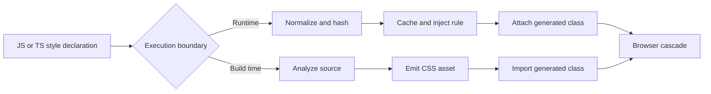

<TLDR>
  <TLDRCell label="what">
    CSS-in-JS 让 JavaScript 或 TypeScript 描述样式，再在应用运行时或构建期间把这些描述转换成 CSS 规则或类名。
  </TLDRCell>
  <TLDRCell label="trap">
    生成的类名可以限制选择器作用范围，却不会让层叠失效，也不会消除浏览器渲染成本或自动保证服务端与客户端输出一致。
  </TLDRCell>
  <TLDRCell label="fix">
    明确选择执行边界，让有限变体保持静态，把频繁变化的值放进 CSS 自定义属性，并检查最终生成的 CSS。
  </TLDRCell>
</TLDR>

## 是什么，为什么存在

<Term id="css-in-js">CSS-in-JS</Term> 是一类用应用代码声明样式，再由库或编译器生成 CSS 的技术。编写形式可以是标签模板、JavaScript 对象、接收组件属性的函数或带类型的配方。浏览器最终接收的仍是 CSS 声明、选择器和值；JavaScript 负责样式的编写和交付，并没有取代 CSS。

这种方式让组件明确依赖自身样式。生成的类名减少了意外的选择器重名，普通模块导入则更容易在删除组件时一并清理只供它使用的样式。JavaScript 边界还能把组件状态、主题令牌和变体提供给样式层。

CSS-in-JS 最常见于组件库和 React 应用，但这个名称涵盖不同的执行模型。运行时库在组件渲染时创建或选择规则；构建时系统在部署前分析源文件并生成 CSS 资源。有些工具采用混合方式，为构建时无法确定的值保留一小段运行时代码。

这个区别比模板语法更重要。它决定哪些表达式可用、多少样式代码会进入客户端、规则何时可用，以及服务端渲染必须收集什么。应把 CSS-in-JS 看作一组设计选择，而不是只有一种 API 和一种性能特征的单一方案。

如果组件所有权、类型化令牌或可编程变体 API 能减少实际协作成本，就可以选用它。如果现有层叠已经能清楚表达设计，普通样式表、CSS Modules、Sass 和工具类也都合理。样式与组件放在一起很有用，但仅凭这一点不足以引入运行时依赖。

## 工作原理

每种实现都要把编写时的样式描述连接到浏览器可见的规则。主要区别是这一步发生在渲染期间还是编译期间。



### 运行时生成

运行时引擎会在组件创建或渲染时读取样式声明。它把声明序列化，生成标识符，查询缓存，并在需要时向样式表插入规则。组件则得到对应的类名。不同库执行每一步的时机并不相同，因此应该检查库的实际输出，不能假定每次渲染都会创建新的 `<style>` 元素。

<Term id="style-injection">样式注入（style injection）</Term>是把生成规则加入文档或服务端样式收集器的过程。缓存很重要，因为相同的规范化样式应该复用同一条规则。根据属性插值时可能产生更多规则组合，输入值范围很大时尤其如此。

运行时生成可以计算任意应用状态。这种灵活性适合确实依赖实时 JavaScript 的值，但也会让样式能否及时出现取决于组件生命周期。库的服务端渲染集成必须收集客户端预期的同一组规则。

### 构建时提取

<Term id="static-extraction">静态提取（static extraction）</Term>会在构建期间计算工具支持的声明，并写出普通 CSS。应用代码导入生成的类名，或调用编译器能够理解全部可能结果的 API。浏览器下载生成的样式表，这些声明不再需要客户端规则生成器。

提取要求源码可分析。字面量对象、令牌和有限变体映射都很直接。来自请求、浏览器测量或任意运行时函数的值，无法在构建期间变成一条固定规则。工具通常用 CSS 自定义属性、行内样式、预声明变体或明确记录的运行时层来跨过这条边界。

「零运行时」描述的是样式系统生成规则的路径，并不是说整个应用没有运行时代码。提取出的 CSS 仍有传输、解析、层叠、样式计算、布局和绘制成本。更准确的说法是：静态声明不需要该库在浏览器中生成规则。

### 最终结果仍由层叠决定

两条路径最终都进入 CSS 层叠。唯一类名可以减少重名，但声明来源、层、重要性、优先级、作用域邻近性和源码顺序等普通规则仍会决定谁胜出。全局选择器可以影响带生成类名的元素，生成的选择器也可以覆盖其他样式。

当选择器优先级相同时，插入顺序就会成为行为的一部分。如果集成没有定义顺序，代码分割、流式传输、多个缓存或混用样式系统都可能改变它。使用层叠层和明确记录的样式插入点，比不断提高优先级直到测试通过更可靠。

### 离散状态与连续值

`tone="danger"`、`size="small"` 和 `disabled` 等有限状态适合使用预声明类或数据属性选择器。它们的集合有明确边界，因此编译器可以生成所有规则，运行时引擎也只需复用一小组缓存。这样还可以通过类型和测试发现不受支持的状态。

拖动坐标、颜色选择器结果或进度百分比等值拥有很大甚至无界的取值范围。每个值都生成类名会让规则集不断增长，也会让样式引擎重复工作。应让结构规则保持稳定，再通过经过验证的 CSS 自定义属性或行内样式传入变化值。

## 示例

下面用不依赖第三方包的小程序展示内部机制。它们是教学模型，不是应该复制到生产环境的 API；成熟的库还要处理嵌套选择器、条件规则、转义、前缀、并发和服务端集成。

### 对运行时规则做哈希和缓存

第一个模型会规范化对象，对得到的声明字符串计算哈希，再按类名缓存规则。属性排序让对象的插入顺序不影响结果。第二次调用得到相同类名，也不会新增缓存项。

<Depth level="quick">

```javascript run title="runtime-styles.js"
const insertedRules = new Map();

function toKebabCase(name) {
  return name.replace(/[A-Z]/g, (letter) => `-${letter.toLowerCase()}`);
}

function serialize(style) {
  return Object.entries(style)
    .sort(([left], [right]) => left.localeCompare(right))
    .map(([name, value]) => `${toKebabCase(name)}:${value}`)
    .join(";");
}

function hash(text) {
  let value = 2166136261;
  for (const character of text) {
    value ^= character.charCodeAt(0);
    value = Math.imul(value, 16777619);
  }
  return (value >>> 0).toString(36);
}

function classFor(style) {
  const declarations = serialize(style);
  const className = `cw-${hash(declarations)}`;
  const inserted = !insertedRules.has(className);
  insertedRules.set(className, `.${className}{${declarations}}`);
  return { className, inserted, cssText: insertedRules.get(className) };
}

const buttonStyle = {
  backgroundColor: "#2563eb",
  color: "white",
  padding: "0.5rem 0.75rem",
};

const first = classFor(buttonStyle);
const second = classFor(buttonStyle);
console.log(first.className);
console.log(first.cssText);
console.log(`inserted again: ${second.inserted}`);
```

```text
cw-ix791b
.cw-ix791b{background-color:#2563eb;color:white;padding:0.5rem 0.75rem}
inserted again: false
```

</Depth>

生产级引擎需要处理哈希冲突，还要有完整的 CSS 序列化器；这个小程序两者都没有。这里需要观察的是数据流：等价声明需要稳定标识和共享缓存。如果服务端与客户端的规范化方式不同，即使预期 CSS 相同，类名也可能不一致。

### 选择有限变体

构建时配方可以生成一组有明确边界的类，运行时代码只负责选择。这个纯 JavaScript 模型会验证两个变体维度，而不是在生成代码虚构变体名称时悄悄回退。

```javascript run title="variant-classes.js"
const buttonRecipe = {
  base: "button",
  tone: {
    primary: "button_tone_primary",
    quiet: "button_tone_quiet",
  },
  size: {
    small: "button_size_small",
    medium: "button_size_medium",
  },
};

function buttonClass({ tone = "primary", size = "medium" } = {}) {
  const toneClass = buttonRecipe.tone[tone];
  const sizeClass = buttonRecipe.size[size];
  if (!toneClass || !sizeClass) throw new RangeError("unknown button variant");
  return [buttonRecipe.base, toneClass, sizeClass].join(" ");
}

console.log(buttonClass());
console.log(buttonClass({ tone: "quiet", size: "small" }));

try {
  buttonClass({ tone: "warning" });
} catch (error) {
  console.log(`${error.name}: ${error.message}`);
}
```

```text
button button_tone_primary button_size_medium
button button_tone_quiet button_size_small
RangeError: unknown button variant
```

实际配方工具通常会一起生成这些类名和 TypeScript 类型。这里的边界仍然很清楚：CSS 覆盖有限状态空间，运行时代码只选择有效组合。设计系统组件应该记录默认值和无效组合，而不是接受任意字符串。

### 传入连续值

进度可能变化成许多值，因此每次更新不应该创建新类。一条稳定规则读取 `--progress`，应用代码负责限制输入范围，并且只设置这个自定义属性。同一个数值还用于无障碍状态。

```javascript run title="dynamic-css-variables.js"
function progressProps(input) {
  const value = Math.min(100, Math.max(0, Number(input)));
  if (!Number.isFinite(value)) throw new TypeError("progress must be numeric");

  return {
    className: "progress",
    style: { "--progress": `${value}%` },
    "aria-valuenow": value,
  };
}

const rule = ".progress { inline-size: var(--progress); }";
console.log(rule);

for (const input of [-15, 45, 120]) {
  console.log(JSON.stringify(progressProps(input)));
}
```

```text
.progress { inline-size: var(--progress); }
{"className":"progress","style":{"--progress":"0%"},"aria-valuenow":0}
{"className":"progress","style":{"--progress":"45%"},"aria-valuenow":45}
{"className":"progress","style":{"--progress":"100%"},"aria-valuenow":100}
```

TypeScript 可以描述自定义属性键，却不会限制运行时数值，也不会自动补上单位。验证应放在不可信或弱类型数据进入组件的位置。如果属性可能缺失，CSS 还应该提供回退值。

### 收集确定性的服务端样式

服务端渲染需要同时得到 HTML 和本次渲染用到的规则。这个模型把有限变体规则放进本次请求专用的注册表，按类名去重，并在序列化前排序。实际集成可能规定另一种顺序，尤其是顺序会影响层叠时。

```javascript run title="style-registry.js"
function createStyleRegistry() {
  const rules = new Map();

  return {
    use(className, cssText) {
      rules.set(className, `.${className}{${cssText}}`);
      return className;
    },
    flush() {
      return [...rules.entries()]
        .sort(([left], [right]) => left.localeCompare(right))
        .map(([, rule]) => rule)
        .join("\n");
    },
  };
}

function renderCard(registry, tone, label) {
  const variants = {
    neutral: ["card-neutral", "background:#f3f4f6;color:#111827"],
    urgent: ["card-urgent", "background:#fee2e2;color:#991b1b"],
  };
  const selected = variants[tone];
  if (!selected) throw new RangeError("unknown card tone");
  const className = registry.use(...selected);
  return `<article class="${className}">${label}</article>`;
}

const registry = createStyleRegistry();
const html = [
  renderCard(registry, "urgent", "Retry payment"),
  renderCard(registry, "neutral", "Receipt ready"),
].join("");

console.log(html);
console.log(registry.flush());
```

```text
<article class="card-urgent">Retry payment</article><article class="card-neutral">Receipt ready</article>
.card-neutral{background:#f3f4f6;color:#111827}
.card-urgent{background:#fee2e2;color:#991b1b}
```

注册表按每次渲染创建，因此并发请求不会相互泄漏规则。这个模型的输出顺序是确定的，同一类名重复使用时只会覆盖同一个映射项。框架集成还要处理流式传输、nonce、缓存接管和清理规则，这个示例有意省略了它们。

## 陷阱

### 在渲染期间声明样式组件

> [!PITFALL]
> 对于提供 `styled` 工厂的运行时系统，在一个组件的渲染路径中创建样式组件，会在重复渲染时创建新的组件标识。

React 可能重新挂载子树，导致焦点、选择范围、非受控输入状态和组件局部状态丢失。样式库也可能重复执行注册工作。它首先是正确性问题，然后才是微小的性能优化问题。

**修复：**在模块作用域声明标识稳定的样式组件。如果样式依赖属性，就把属性传给模块级声明，或选择预声明变体。用焦点保留测试验证组件标识，不能依赖视觉快照。

### 为每个实时值生成类名

> [!PITFALL]
> 把鼠标坐标、动画进度或任意颜色插入规则，可能产生越来越多近乎相同的类。

具体缓存行为取决于所用库，因此不存在通用的变慢阈值。问题在于语义不匹配：值是取值范围很大的实例数据，类名表示的却应该是可复用样式类别。

**修复：**有限状态和变体使用有限类名。高基数值应放进经过验证的 CSS 自定义属性或行内样式；如果更新路径很重要，再录制浏览器性能轨迹。

### 把样式专用属性传给 DOM

> [!PITFALL]
> 生成的包装组件经常把 `variant`、`isOpen` 或只供主题使用的属性继续传给原生元素，尽管这些字段只用于选择样式。

这可能产生无效标记、React 警告、误导性的 DOM 快照或意外的字符串属性。不同库会使用临时属性约定或属性过滤回调，具体做法不能互换。

**修复：**采用当前库文档规定的过滤机制，并检查渲染后的 DOM。只有当值确实具有 DOM 语义时才使用 `data-*` 或 ARIA 属性；不要为了压掉警告而把每个泄漏属性都改名成 `data-*`。

### 误以为生成类名能绕过层叠

> [!PITFALL]
> 类名哈希可以避免意外重名，但全局选择器、层叠层、优先级、继承和源码顺序仍会影响元素。

不断添加 `!important` 或嵌套选择器，直到生成规则胜出，会让样式所有权更难理解，也可能破坏使用方需要的受支持覆盖点。

**修复：**定义组件的覆盖契约，把各样式系统放进有意设计的层叠层或插入点，规则冲突时检查计算样式。应用外壳与第三方内容要一起测试，因为所谓隔离通常会在边界处失效。

### 把服务端集成当成可直接粘贴的细节

> [!PITFALL]
> 服务端可能输出正确的 HTML，却漏掉已使用的规则，在水合时重复插入规则，或在客户端生成不同的标识符。

随机值、依赖区域设置的序列化、只在浏览器执行的分支、共享的全局注册表，以及顺序错误的流式刷新，都可能让输出不确定。不同库和版本的支持也不同，包括对 React 服务端组件的支持。

**修复：**针对所选框架和渲染模式使用当前版本库的集成方案。比较多次渲染的服务端 HTML 与样式输出，把水合警告当作失败处理，并在延迟 JavaScript 时确认首屏样式仍然存在。

### 让提取器看不到运行时表达式

> [!PITFALL]
> 构建时工具无法提取通过动态属性名、不受控函数调用，或扫描范围之外的源文件所组装出的任意值。

生成的代码可能看似合理，因为样式调用可以通过类型检查，生产 CSS 却没有对应规则。如果开发插件或监视器扫描了更多文件，开发环境的表现还可能不同。

**修复：**把可提取声明写在工具文档支持的语法和文件范围内。执行生产构建，在生成的 CSS 中查找每个重要变体，并测试一个非默认值。真正的运行时数据应通过工具支持的变量或行内样式出口传入。

## AI 时代

**生成代码在这里常犯的错**

模型会混用名称相似的库 API，在 React 组件内部声明 `styled()`，还会从另一个主要版本虚构属性过滤选项。它们也常把每个属性都变成模板插值，其中包括本应使用自定义属性的高基数值。服务端示例经常取自旧路由或旧渲染模式，页面跳转后看起来正确，首次响应却没有完整样式。

**让 AI 检查**

- 写明组件使用的样式包、包版本、框架渲染模式和具体服务端集成方式。
- 把每个动态值归类为有限变体或高基数实例值，再说明对应 CSS 在哪里生成。
- 执行生产构建，比较服务端与客户端的类标识、规则顺序和渲染后的 DOM 属性。

**审查清单**

- 在组件函数体中搜索样式工厂调用，并测试带焦点或状态的后代组件是否发生重新挂载。
- 检查生产 CSS、首次服务端响应和水合日志，查找缺失、重复或重新排序的规则。
- 在浏览器计算样式面板中检查生成选择器，同时考虑全局 CSS、层叠层、主题和使用方可用的覆盖方式。

**提示词词汇**

使用准确术语：`runtime CSS-in-JS`（运行时 CSS-in-JS）、`build-time extraction`（构建时提取）、`static extraction`（静态提取）、`style injection`（样式注入）、`deterministic class name`（确定性类名）、`style registry`（样式注册表）、`prop forwarding`（属性转发）、`finite variant`（有限变体）、`high-cardinality value`（高基数值）、`CSS custom property`（CSS 自定义属性）、`cascade layer`（层叠层）、`hydration mismatch`（水合不匹配）。应要求 AI 给出生成的 HTML 和 CSS，不能停在编写时的代码片段。

<Depth level="deep">

## 选择执行边界

先列出组件必须表达的值。如果每种状态都属于一小组已知变体，静态 CSS 加类名或数据属性选择通常已经足够。如果某个值只能在运行时得到，先检查 CSS 是否已有合适的输入渠道，例如自定义属性、媒体查询、容器查询、继承属性或状态选择器。

只有当一个持续维护的库能提供静态路径难以清楚表达的能力时，才有理由在运行时生成规则。决策范围还包括缓存、服务端收集器、内容安全策略支持、调试输出和升级路径。仅看模板语法无法判断这些运维成本。

应使用生产构建产物和浏览器轨迹比较候选方案。统计路由收到的样式相关 JavaScript，检查 CSS 何时可用，并记录真实交互期间的样式重新计算。不要照搬其他应用的包体积或耗时数字；库版本、编译器配置、组件数量和实际渲染的状态空间都会改变结果。

| 关注点 | 运行时生成 | 构建时提取 |
| --- | --- | --- |
| 规则创建 | 应用执行期间 | 在构建期间处理工具支持的声明 |
| 动态输入 | 可以计算运行时 JavaScript | 使用变体、变量、行内样式或运行时出口 |
| 客户端依赖 | 通常包含样式运行时 | 静态声明不需要客户端规则生成器 |
| 服务端工作 | 收集并序列化本次渲染用到的规则 | 链接或内联生成的 CSS 资源 |
| 主要失败方式 | 规则无限增长，或服务端与客户端不匹配 | 提取器无法分析代码，导致 CSS 缺失 |

这张表描述的是执行边界，不是质量排名。声明稳定的运行时系统可能比集成不良的提取器更适合项目。构建时系统也可能输出过多 CSS，或让覆盖方式变得含糊。

### 主题与令牌

主题通常把 `surface`、`textMuted` 和 `dangerBorder` 等语义名称映射到 CSS 值。组件声明应依赖语义令牌，这样切换主题时无需改写组件逻辑。CSS 自定义属性适合作为输出格式，因为它们可以继承并参与层叠，还能在属性或媒体查询下切换，无需重新生成组件类。

类型系统可以证明源模型中存在某个令牌名称，却不能证明前景色与背景色的对比度足够、长度使用了正确单位，或用户提供的字符串适合放进 CSS。这些仍然要靠验证和浏览器测试。

在水合前切换主题需要特别处理。如果服务端选择一种主题，而客户端启动时选择另一种，用户可能看到闪烁，React 也可能报告不匹配。应优先使用服务端可以读取的偏好，或小型且有明确说明的绘制前机制，并测试禁用脚本和慢脚本路径。

## 不靠猜测完成服务端渲染

运行时 CSS-in-JS 通常需要一个仅供本次服务端渲染使用的注册表或缓存。组件在渲染树的过程中注册规则；集成层把规则序列化进响应，再让客户端接管。进程级全局可变注册表可能造成跨请求泄漏，输出也会受请求顺序影响。

确定性不只涉及哈希函数。两端必须使用相同的源码转换、插件配置、输入属性、区域设置、主题和规则顺序。除非服务端能得到等价值，否则不应该让基于 `Date.now()`、随机数、浏览器测量或客户端存储的值决定初始类名。

流式传输还把时序纳入契约。某个区块使用的规则必须早于或同时于其标记到达，后续区块也不能以不可预测的方式重排同优先级规则。应采用框架与样式库支持的流式集成，不要根据拼接字符串的示例自行设计收集器。

服务端渲染要在网络边界测试。在不运行 JavaScript 的情况下获取 HTML，确认首屏元素已有对应规则，再执行水合并收集控制台错误。进入代码分割路由后返回，可以发现重复插入、残留注册表和顺序变化。

构建时提取把大部分工作移到资源生成阶段，但交付仍可能失败。路由可能漏掉 CSS 区块、预加载错误资源，或把后到的样式表放在覆盖层之后。应该检查生成清单和响应，不能只看源码导入。

## 所有权、覆盖与迁移

需要明确组件拥有哪些样式，又允许调用方覆盖哪些样式。结构不变量、内部状态和语义令牌通常属于组件。由父元素施加的布局，例如网格定位或外边距，通常放在组件外部更容易管理。只有当源码顺序和优先级让行为可以预测时，公开的 `className` 出口才真正有用。

不要把生成的类名字符串公开成契约。哈希和编译器名称可能随构建改变，内部选择器也可能在重构时消失。测试应该查询语义角色、标签、状态或有意保留的数据属性；视觉测试可以覆盖实际外观。

CSS-in-JS 系统之间的迁移不只是替换语法。应先清点全局规则、主题传递、变体行为、服务端收集、样式顺序和使用方覆盖。先让一个小型垂直切片经过生产构建与水合，再转换共享基础组件。

迁移期间，应把新旧系统放进明确的层叠层或插入区域。如果没有这条边界，迁移顺序可能改变同优先级规则的胜负，造成看似与当前组件无关的回归。只有路由级构建产物证明没有组件继续导入旧运行时后，才能移除它。

</Depth>

<Checkpoint id="frontend/css-in-js" />

## 延伸阅读

- [W3C：CSS 层叠与继承 Level 6](https://www.w3.org/TR/css-cascade-6/)
- [W3C：CSS 对象模型](https://www.w3.org/TR/cssom-1/)
- [MDN：CSS 自定义属性](https://developer.mozilla.org/en-US/docs/Web/CSS/--*)
