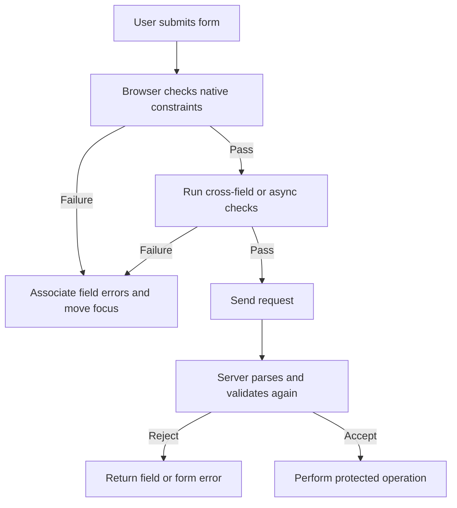

<TLDR>
  <TLDRCell label="what">
    Form validation checks input against explicit rules and gives users actionable feedback; browser validation improves interaction, while server validation decides whether to accept the data.
  </TLDRCell>
  <TLDRCell label="trap">
    Client-side constraints can be bypassed, and a custom error remains active until code explicitly clears it with an empty string.
  </TLDRCell>
  <TLDRCell label="fix">
    Start with native HTML constraints, add cross-field and asynchronous rules, associate errors with controls, and validate independently on the server.
  </TLDRCell>
</TLDR>

## What it is and why it exists

Form validation is the process of comparing user input with a set of constraints and using the result for feedback or a submission decision. HTML can already express common rules for required values, types, lengths, numeric ranges, and formats. JavaScript should add only the cross-field, business, or asynchronous rules that native attributes cannot express.

The browser's built-in <Term id="constraint-validation">constraint validation</Term> solves two immediate problems: it catches obvious mistakes before a request is sent and exposes consistent control state to keyboard, touch, and assistive-technology users. It is not a trust boundary. A user can modify the DOM, construct an HTTP request directly, or call an interface that bypasses interactive validation, so the server must validate again under its own authoritative rules.

Validation is not sanitization either. Validation answers whether a value satisfies the current contract, normalization converts equivalent inputs to one form, and escaping or safe output APIs handle risks when a value enters HTML, SQL, a command, or another context. Combining those jobs in one regular expression usually misses edge cases and hides the security control that actually matters.

You meet form validation in registration, checkout, search filters, file uploads, and settings. Rules should come from the data contract and task requirements, not from a component library's defaults. Decide which fields are required, which values are allowed, and which layer has authority before building the interface.

A successful validation describes only the relationship between the current input and current rules; it does not guarantee that the data remains usable later. Recheck any decision that depends on inventory, account state, or permission when the operation executes.

## How it works

The browser first determines which form controls participate, then computes state from each control's type, current value, and constraint attributes. Common declarations include `required`, `type="email"`, `minlength`, `maxlength`, `min`, `max`, `step`, and `pattern`. Disabled controls and some read-only or special controls do not participate in the same checks, so a dynamic form must keep control state and rules synchronized.

Every validated control exposes a <Term id="validity-state">ValidityState</Term>. Boolean properties such as `valueMissing`, `typeMismatch`, `patternMismatch`, `rangeUnderflow`, `rangeOverflow`, `stepMismatch`, and `customError` explain why a check failed, while `valid` means every applicable constraint passed. Reading a specific flag is more stable than parsing localized error text.

`checkValidity()` runs the checks and returns a Boolean. It also dispatches an `invalid` event for invalid controls but does not proactively show browser feedback. `reportValidity()` performs the same checks and displays browser feedback for failures that were not canceled. A normal submit button triggers interactive validation; `novalidate` disables that step.

`setCustomValidity(message)` connects application rules to the same state model. A non-empty message makes `customError` true, and only an empty string clears that custom error. A control's <Term id="validation-message">validation message</Term> can supply error text, but the browser localizes it; automated tests should usually assert validity flags, error associations, and focus instead of fixed wording.



Error feedback needs semantics, text, and navigation. A label says what the field is, a nearby message says what went wrong and how to fix it, `aria-describedby` associates them, and `aria-invalid="true"` exposes the current failure state. A long form can also provide an error summary with links to fields; changing only a border color neither explains the problem nor guarantees that assistive technology learns about it.

Feedback timing is also part of validation design. After submission, show every problem the user must fix and move focus to an error summary or the first invalid control. During typing, provide only stable, timely feedback that does not repeatedly interrupt the user; asynchronous checks must also handle cancellation, out-of-order responses, and network failure.

### Three layers with separate jobs

The first layer is the set of field constraints HTML can express directly. Keep them in markup so a page retains basic behavior before application JavaScript loads and so tests and assistive technology can inspect the same semantics. Duplicating `required` or `min` in JavaScript does not strengthen the contract; it creates another place to drift.

The second layer holds combined browser rules, such as an end date not preceding a start date or one selection making another field required. Write the result back to control validity and update visible messages at the same time. A combined rule must observe every field it depends on, not only the field that displays the error.

The third layer is the authoritative server rule set. It covers every field constraint and business state, including concurrent changes the client cannot judge reliably. The layers may share test cases or rule data, but each still needs an explicit input shape and failure output.

### Submission interfaces change the path

When a user activates a submit button, the browser runs interactive constraint validation before dispatching `submit`; a failure prevents that event. `requestSubmit()` simulates this path and preserves the selected submit button's name, value, and override attributes. It is usually a better automation interface than calling the handler directly when code must represent a real submission.

`form.submit()` is lower level and bypasses both constraint validation and the `submit` event. Legacy and generated code often uses it to “continue submitting,” skipping the checks it just added. If custom asynchronous rules need to continue after success, prevent recursion and choose an explicit, reviewed submission path.

`novalidate` and a submit button's `formnovalidate` are product decisions, not debugging switches. They fit deliberate incomplete-data actions such as “save draft,” but the server must know which contract applies to that operation. Final submission and draft saving should not differ only in button text.

Resetting a form also means resetting validation presentation. Native `reset` restores control defaults but does not automatically remove application-owned error nodes, `aria-invalid`, or request counters. Put value state and presentation state in one reset flow so a visually empty new form does not keep announcing an old error.

## Examples

### Native constraints as the first layer

This registration form declares its basic contract with types and attributes. `checkValidity()` examines two invalid values and then two valid values on the same DOM.

<Depth level="quick">

```html run title="native-signup.html"
<form id="signup">
  <label>
    Email
    <input id="email" name="email" type="email" required />
  </label>
  <label>
    Invite code
    <input
      id="invite"
      name="invite"
      pattern="[A-Z]{4}-[0-9]{2}"
      title="Four uppercase letters, a hyphen, and two digits"
      required
    />
  </label>
  <button>Join</button>
</form>

<script>
  const form = document.querySelector('#signup');
  const email = document.querySelector('#email');
  const invite = document.querySelector('#invite');

  email.value = 'not-an-email';
  invite.value = 'ab-1';
  console.log(`invalid data: ${form.checkValidity()}`);

  email.value = 'reader@example.com';
  invite.value = 'WIKI-26';
  console.log(`valid data: ${form.checkValidity()}`);
</script>
```

```text
invalid data: false
valid data: true
```

</Depth>

Native attributes give the browser, password managers, and assistive technology one basic semantic contract. The `pattern` covers only the invite code's syntax; the server still decides whether that code exists or has expired. The `title` describes the expected format, but visible instructions are usually easier to discover before input.

### A cross-field constraint

The postal-code format depends on the country, which one static `pattern` cannot express. This function computes the whole result every time and clears the old error with an empty string.

```html run title="cross-field.html"
<form id="address">
  <label>
    Country
    <select id="country" name="country">
      <option value="US">United States</option>
      <option value="FR">France</option>
    </select>
  </label>
  <label>
    Postal code
    <input id="postal" name="postal" required />
  </label>
</form>

<script>
  const country = document.querySelector('#country');
  const postal = document.querySelector('#postal');
  const formats = {
    US: { pattern: /^\d{5}$/, message: 'Use a 5-digit US ZIP code' },
    FR: { pattern: /^\d{5}$/, message: 'Use a 5-digit French postal code' }
  };

  function validatePostalCode() {
    const rule = formats[country.value];
    const message = rule.pattern.test(postal.value) ? '' : rule.message;
    postal.setCustomValidity(message);
  }

  postal.value = '75A01';
  validatePostalCode();
  console.log(`first: ${postal.validationMessage}`);

  postal.value = '75001';
  validatePostalCode();
  console.log(`second: valid=${postal.validity.valid}`);
</script>
```

```text
first: Use a 5-digit US ZIP code
second: valid=true
```

A real interface should call `validatePostalCode()` when the country or postal code changes and once more before submission. The example demonstrates how to connect the constraint; it is not a worldwide postal-code library. Production rules should come from an explicitly maintained data contract, and regions you cannot validate should not be rejected arbitrarily.

### Accessible error feedback

This form disables the browser's interactive bubbles and renders errors in the page. Native validity state remains available, and each error message is connected to its field by an existing `aria-describedby` relationship.

```html run title="accessible-errors.html"
<form id="profile" novalidate>
  <label for="display-name">Display name</label>
  <input id="display-name" name="displayName" required
         aria-describedby="display-name-error" />
  <p id="display-name-error" hidden></p>

  <label for="contact-email">Email</label>
  <input id="contact-email" name="email" type="email" required
         aria-describedby="contact-email-error" />
  <p id="contact-email-error" hidden></p>

  <button>Save</button>
</form>

<script>
  const form = document.querySelector('#profile');
  const fields = [...form.elements].filter(
    (element) => element instanceof HTMLInputElement
  );

  form.addEventListener('submit', (event) => {
    event.preventDefault();

    for (const field of fields) {
      const invalid = !field.validity.valid;
      const error = document.querySelector(`#${field.id}-error`);
      field.setAttribute('aria-invalid', String(invalid));
      error.hidden = !invalid;
      error.textContent = invalid ? field.validationMessage : '';
    }

    const invalidFields = fields.filter((field) => !field.validity.valid);
    invalidFields[0]?.focus();
    console.log(`errors: ${invalidFields.length}`);
    console.log(`focus: ${document.activeElement.id}`);
  });

  document.querySelector('#contact-email').value = 'wrong';
  form.requestSubmit();
</script>
```

```text
errors: 2
focus: display-name
```

Use `novalidate` only when the page supplies complete replacement feedback. This code updates every field state before moving focus once, so the first error does not interrupt the loop. After a successful real submission, the interface should also clear stale messages and confirm completion with an explicit status.

### Prevent stale asynchronous results

Username-availability requests can resolve out of order. An increasing request number invalidates older results, so the slower `alice` response cannot overwrite the newer `alicia` state.

```html run title="async-availability.html"
<label for="username">Username</label>
<input id="username" name="username" />

<script>
  const input = document.querySelector('#username');
  const availability = new Map([
    ['alice', false],
    ['alicia', true]
  ]);
  let latestRequest = 0;

  async function validateUsername(name) {
    const request = ++latestRequest;
    const delay = name === 'alice' ? 30 : 10;
    await new Promise((resolve) => setTimeout(resolve, delay));

    if (request !== latestRequest) {
      console.log(`ignored: ${name}`);
      return;
    }

    const message = availability.get(name) ? '' : 'Username is already taken';
    input.setCustomValidity(message);
    console.log(`${name}: ${input.validity.valid ? 'valid' : message}`);
  }

  Promise.all([
    validateUsername('alice'),
    validateUsername('alicia')
  ]).then(() => console.log(`final: valid=${input.validity.valid}`));
</script>
```

```text
alicia: valid
ignored: alice
final: valid=true
```

The request number resolves the application-state race but does not cancel network work. Production code can also use `AbortController` to cancel obsolete requests and distinguish timeout or offline state from “username taken.” Even when the client reports availability, the server must enforce uniqueness atomically when it creates the account.

## Pitfalls

> [!PITFALL]
> Treating client validation as a security check lets a direct request bypass every rule. DOM attributes, JavaScript, and hidden fields are all controlled by the client.

**Fix:** Parse the request independently on the server and validate types, ranges, allowed values, permissions, and current state against the same business contract. Client rules provide early feedback, not authorization; concurrent invariants such as database uniqueness also belong at the authoritative layer.

> [!PITFALL]
> After `setCustomValidity()` receives one non-empty message, the control stays invalid even when the user fixes the input. Changing text in a page-level `<p>` does not change native validity state.

**Fix:** Recompute the complete rule whenever a related field changes and call `setCustomValidity('')` on success. Update visible text and `aria-invalid` at the same time instead of maintaining three drifting Boolean states.

> [!PITFALL]
> Adding `novalidate` or canceling `invalid` without equivalent feedback creates a form that fails silently or submits bad data directly.

**Fix:** Keep native interaction unless you need a custom presentation. A replacement must cover field messages, the error summary, focus movement, keyboard use, and assistive-technology notification, then be tested through the full submit path in target browsers.

> [!PITFALL]
> Showing an error or starting a remote request on every keystroke reports problems before the user finishes and can produce out-of-order results with stale messages.

**Fix:** Required and format errors usually appear after blur or the first submission, then update promptly as the user repairs them. Debounce or deliberately trigger remote checks, and ignore obsolete responses with an identity token or cancellation mechanism.

> [!PITFALL]
> Programmatic tests can create false confidence. `form.submit()` bypasses constraint validation, while script-assigned values do not exercise `minlength` and `maxlength` checks the same way as user-provided input.

**Fix:** Use `requestSubmit()` when simulating a submit button and cover length rules with end-to-end tests that type through the browser. Unit tests should still exercise shared business-validation functions and the server validator directly.

## In the AI era

**What generated code gets wrong here**

Generated code often hand-writes one regular expression per field even when it duplicates HTML attributes, then omits server validation. It may insert `role="alert"` repeatedly during `input`, forget to clear `setCustomValidity()`, use `form.submit()` to bypass checks, or let a slow asynchronous response overwrite newer input. Another common failure is adding only a red border to invalid controls, without label association, an error explanation, or predictable focus handling.

**Ask your AI to check**

- List the authoritative source of every rule and identify whether both client and server enforce it.
- Trace every write to `setCustomValidity()` and prove that each failure path has a matching clear path.
- Simulate two out-of-order asynchronous responses and explain why the final field state belongs to the latest input.

**Review checklist**

- Test the server with missing values, boundary values, duplicate field names, and hand-built requests, not only the browser form.
- Complete failure, repair, and resubmission using only the keyboard, checking labels, error associations, announcements, and focus order.
- Check whether conditional fields, programmatic assignment, `novalidate`, `submit()`, and network failures change the validation contract.

**Prompt vocabulary**

Use the exact terms `constraint validation`, `ValidityState`, `validationMessage`, `custom validity`, `interactive validation`, `error summary`, `server-side validation`, `stale async response`, and `authoritative constraint`. Ask the AI for a rule matrix and failure paths; “make the form robust” is too vague to expose missing cases.

<Depth level="deep">

## Server authority and the trust boundary

The server receives request data, not the browser's form object. Its parser can encounter missing fields, duplicate keys, unexpected arrays, very long strings, bad encodings, or numbers that cannot be converted. Server validation should start from this untrusted raw shape, explicitly decide the allowed shape of every field, and only then normalize and apply business rules.

The client and server can share rule definitions, but a client-supplied “passed” flag is never evidence. A shared schema must still account for runtime differences such as whether an empty string becomes `null`, how a date's time zone is interpreted, and whether localized numeric separators are allowed. Rules that change over time, including account-name uniqueness, inventory, and discount eligibility, must be checked again close to the server write.

An error response should distinguish field-level errors from form-level errors and use stable field keys instead of display labels. The client maps those keys to controls and puts problems that belong to no single field in the summary. User-facing text should not leak internal queries, stack traces, or sensitive account state; logs can retain enough request correlation for diagnosis.

A validation failure should not become an application crash. The server should return an explicit failure status, preserve input the user can safely reuse, and let the client rebuild error associations. Authorization, CSRF protection, rate limiting, output encoding, and parameterized queries remain separate controls; a “validated form” does not replace any of them.

## State consistency in dynamic forms

Conditional fields change which data currently matters. If selecting “business account” reveals a tax identifier, the interface must update visibility, `required`, disabled state, and errors together. Hiding a control that remains required can create an error the user cannot repair; hiding it without disabling it can also submit stale data.

Dynamic lists also need stable field identities. If errors are stored only by array index, deleting the middle item can move a message from the old third item to the new second one. Use a stable item key for client error mapping, then let the server return locatable paths for the current payload.

A multi-step form must not confuse “passed this page” with “the whole transaction is valid.” Editing an earlier field can invalidate a later step, so final submission must validate the complete data set. Draft saving may use a looser contract, but it should carry an explicit draft state and must not reuse the final-submission success message.

The test matrix should cover enabling and disabling conditional branches, adding and deleting items, back-and-forward navigation, refresh recovery, and server rejection. Add rapid input, out-of-order responses, cancellation, and offline behavior for asynchronous fields. The goal is not to enumerate every DOM event but to prove that each rule has one unambiguous result after every state transition.

## Test the complete contract

### The rule table

Start by writing each rule as a table row: field, input shape, empty-value policy, boundaries, dependent fields, client feedback timing, and server error key. This translates product language into executable conditions and exposes differing client and server interpretations of an empty string, missing value, or array.

Derive at least one passing case, one failing case, and boundary cases from every rule. Rules that depend on current time or remote state also need a fixed clock or service response so results do not drift with the environment. Generated data can extend coverage, but it does not replace a readable set of contract examples.

Browser and server tests can consume the same language-neutral input cases and assert their own structured results. Do not share a Boolean that says data was already validated; share the inputs and expectations. That shape can reveal a rule missing from one layer instead of making both layers trust one faulty implementation.

### The browser interaction matrix

Browser tests should locate controls by label and simulate real input instead of modifying component internals. Cover mouse, keyboard submission, and a touch-equivalent path, then confirm that browser-blocked submission still produces understandable feedback. Run the core paths in every browser engine the project supports.

Accessibility assertions should inspect names, descriptions, states, and focus, not only whether error text exists in the DOM. After an error appears, the control still needs a visible label, the message needs a stable ID association, and repairing the field must remove the stale failure description. Links in an error summary must also focus the correct control.

Localization changes `validationMessage`, and browser versions can adjust exact wording. End-to-end tests should assert validity flags, a non-empty message, and navigation results; exact text belongs only to copy the product owns. This verifies behavior without treating a browser translation as an application API.

### The server rejection matrix

Server tests must bypass the interface and send requests directly. Remove required keys, duplicate names, change value types, exceed length limits, and combine states the client interface never generates. Every rejection should produce a stable status and parseable error shape rather than an unhandled exception.

Concurrent rules need concurrent tests. If two requests claim the same username or final inventory item, at most one operation may succeed and the loser needs a usable business error. A check-then-write sequence without a database constraint or transaction can pass sequential tests and still fail under real load.

Also verify that successful responses do not echo secret fields and failure logs do not record passwords or complete payment data. Error messages should guide repair without confirming account existence or internal state an attacker should not learn. Security review follows the full data flow, not only one validation function.

### Regression evidence

A credible validation change preserves the rule table, browser interaction results, server test results, and relevant accessibility checks. Reviewers can use that evidence to see which layers changed and whether a new field also updated error mapping, translations, and monitoring.

</Depth>

<Checkpoint id="frontend/form-validation" />

## Further reading

- [MDN: HTML constraint validation and the Constraint Validation API](https://developer.mozilla.org/en-US/docs/Web/HTML/Guides/Constraint_validation)
- [MDN: `HTMLFormElement.reportValidity()`](https://developer.mozilla.org/en-US/docs/Web/API/HTMLFormElement/reportValidity)
- [WAI Forms Tutorial: User Notifications](https://www.w3.org/WAI/tutorials/forms/notifications/)
