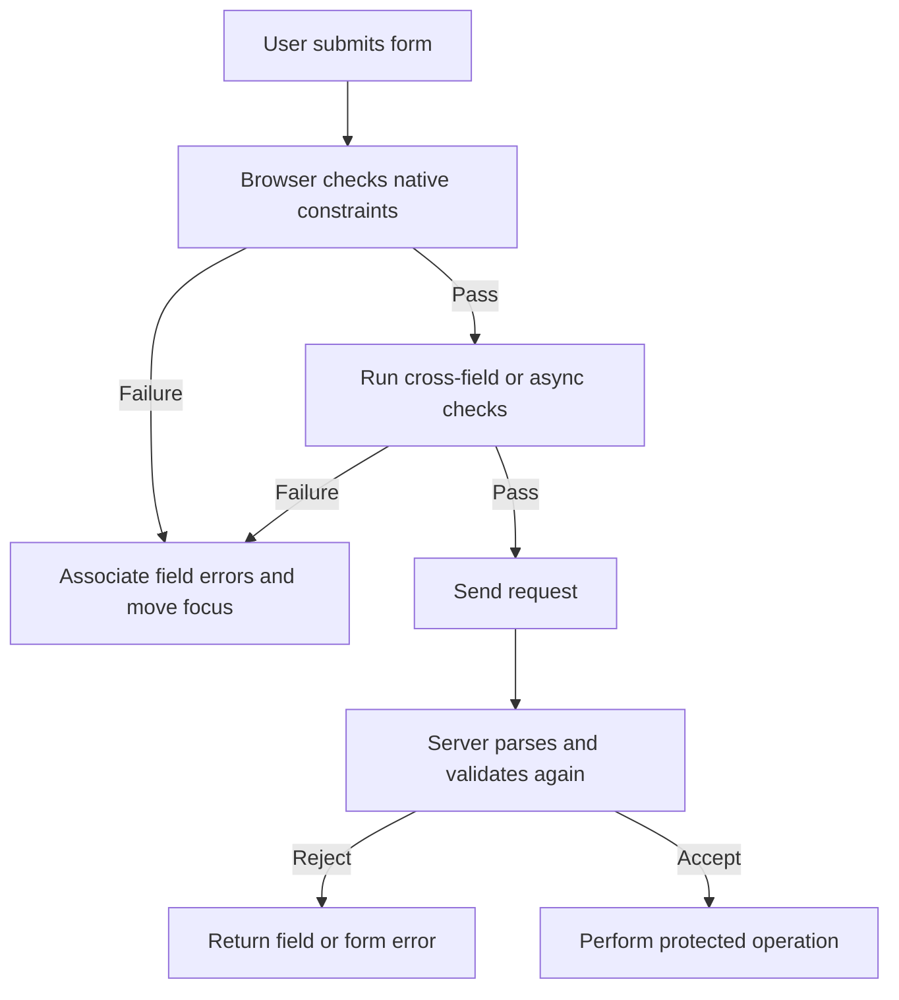

<TLDR>
  <TLDRCell label="what">
    表单验证根据明确规则检查输入，并把可修复的问题反馈给用户；浏览器验证改善交互，服务器验证才负责接受或拒绝数据。
  </TLDRCell>
  <TLDRCell label="trap">
    客户端约束可以被绕过，自定义错误也会一直保持，直到代码用空字符串显式清除。
  </TLDRCell>
  <TLDRCell label="fix">
    先使用原生HTML约束，再补充跨字段和异步规则；让错误与控件关联，并在服务器上独立复验。
  </TLDRCell>
</TLDR>

## 是什么，为什么存在

表单验证（form validation）是把用户输入与一组约束比较，并把结果用于反馈或提交决策的过程。HTML已经能表达必填、类型、长度、数值范围和格式等常见规则。JavaScript只需补充原生属性表达不了的跨字段、业务或异步规则。

浏览器内建的<Term id="constraint-validation">约束验证（constraint validation）</Term>解决两个直接问题：在发送请求前发现明显错误，并给键盘、触摸和辅助技术用户提供一致的控件状态。它不是信任边界。用户可以修改DOM、直接构造HTTP请求，或调用绕过交互验证的接口，所以服务器必须按自己的权威规则重新验证。

验证也不等于清理输入。验证回答“这个值是否符合当前契约”，规范化会把等价输入转换成统一形式，转义或安全的输出API则处理值进入HTML、SQL或命令等不同上下文时的风险。把这些工作混成一个正则表达式，通常既遗漏边界情况，也掩盖真正的安全控制。

你会在注册、结账、搜索筛选、文件上传和设置页面遇到表单验证。规则应来自数据契约和任务需求，而不是组件库的默认配置。字段是否必填、允许哪些值、错误由谁裁决，都应在写界面前说清楚。

一次验证通过只描述当前输入与当前规则的关系，不保证数据之后仍然可用。凡是依赖库存、账户状态或权限的决定，都要在执行操作时再次确认。

## 工作原理

浏览器先确定哪些表单控件参与验证，再根据控件类型、当前值和约束属性计算状态。常用声明包括`required`、`type="email"`、`minlength`、`maxlength`、`min`、`max`、`step`与`pattern`。被禁用的控件和部分只读或特殊控件不会参加同一套检查，因此动态表单必须同步更新控件状态和规则。

每个可验证控件都有一个<Term id="validity-state">有效性状态（ValidityState）</Term>。其中的`valueMissing`、`typeMismatch`、`patternMismatch`、`rangeUnderflow`、`rangeOverflow`、`stepMismatch`与`customError`等布尔值说明失败原因，`valid`表示所有适用约束都通过。读取具体标志比解析本地化错误文字稳定。

`checkValidity()`执行检查并返回布尔值；遇到无效控件时还会派发`invalid`事件，但不会主动显示浏览器提示。`reportValidity()`执行相同检查，并对未取消的失败显示浏览器反馈。正常的提交按钮会触发交互式验证，`novalidate`会关闭这一步。

`setCustomValidity(message)`把应用规则接入同一个状态模型。非空消息让`customError`成为`true`，空字符串才表示该自定义错误已经消失。控件的<Term id="validation-message">验证消息（validation message）</Term>可用于错误文本，但它由浏览器本地化；自动化测试更适合断言有效性标志、错误关联和焦点，而不是固定文案。



错误反馈应同时包含语义、文字和导航。标签说明字段是什么，字段附近的消息说明哪里不对以及怎样修复，`aria-describedby`把二者关联，`aria-invalid="true"`表示当前失败状态。长表单还可以提供带字段链接的错误摘要；只改变边框颜色既无法说明原因，也不能保证辅助技术获知变化。

反馈时机同样属于验证设计。提交后应展示所有需要修复的问题，并把焦点移到错误摘要或第一个无效控件。输入过程中只适合给出稳定、及时且不会反复打断用户的反馈；异步检查还必须处理取消、乱序响应和网络失败。

### 三层规则各司其职

第一层是HTML能直接表达的字段约束。它们应留在标记中，让没有加载应用脚本的页面仍保留基本行为，也让测试和辅助技术能检查同一份语义。用JavaScript复制`required`或`min`不会增强契约，只会增加漂移机会。

第二层是浏览器中的组合规则，例如结束日期不早于开始日期，或某个选择使另一个字段变成必填。这一层应把结果写回控件有效性，并同步更新可见消息。组合规则需要监听所有依赖字段，而不只是最终显示错误的字段。

第三层是服务器权威规则。它覆盖所有字段约束和业务状态，并处理客户端无法可靠判断的并发变化。三层可以共享测试用例或规则数据，但每一层仍要明确自己的输入类型与失败输出。

### 提交接口改变验证路径

用户激活提交按钮时，浏览器先运行交互式约束验证；失败时不会派发`submit`事件。`requestSubmit()`模拟这条路径，还会保留所选提交按钮的名称、值和覆盖属性。自动化代码需要模拟真实提交时，它通常比直接调用处理函数更合适。

`form.submit()`是更低层的接口，会绕过约束验证和`submit`事件。旧代码和生成代码常用它“继续提交”，结果跳过了刚写好的检查。需要在通过自定义异步规则后继续时，应防止递归，再使用明确且经过审查的提交路径。

`novalidate`与提交按钮上的`formnovalidate`是产品决策，不是调试开关。它们适合“保存草稿”等刻意允许不完整数据的操作，但服务器必须知道当前操作采用哪套契约。最终提交和草稿保存不应只靠按钮文字区分。

重置表单也需要重置验证呈现。原生`reset`会恢复控件默认值，却不会自动删除应用添加的错误节点、`aria-invalid`或请求编号。把值状态和呈现状态放进同一个重置流程，才能避免一个看似空白的新表单仍读出旧错误。

## 示例

### 原生约束作为第一层

这个注册表单用类型和属性声明基本契约。`checkValidity()`在同一份DOM上先检查两组错误值，再检查两组有效值。

<Depth level="quick">

```html run title="native-signup.html"
<form id="signup">
  <label>
    Email
    <input id="email" name="email" type="email" required />
  </label>
  <label>
    Invite code
    <input
      id="invite"
      name="invite"
      pattern="[A-Z]{4}-[0-9]{2}"
      title="Four uppercase letters, a hyphen, and two digits"
      required
    />
  </label>
  <button>Join</button>
</form>

<script>
  const form = document.querySelector('#signup');
  const email = document.querySelector('#email');
  const invite = document.querySelector('#invite');

  email.value = 'not-an-email';
  invite.value = 'ab-1';
  console.log(`invalid data: ${form.checkValidity()}`);

  email.value = 'reader@example.com';
  invite.value = 'WIKI-26';
  console.log(`valid data: ${form.checkValidity()}`);
</script>
```

```text
invalid data: false
valid data: true
```

</Depth>

原生属性让浏览器、密码管理器和辅助技术共享同一份基础语义。`pattern`只负责邀请代码的语法；代码是否存在、是否过期仍要由服务器判断。`title`描述预期格式，但可见的字段说明通常更容易在输入前发现。

### 跨字段约束

邮政编码格式取决于国家，单个静态`pattern`无法表达这个依赖。下面的函数每次都计算完整结果，并用空字符串清除旧错误。

```html run title="cross-field.html"
<form id="address">
  <label>
    Country
    <select id="country" name="country">
      <option value="US">United States</option>
      <option value="FR">France</option>
    </select>
  </label>
  <label>
    Postal code
    <input id="postal" name="postal" required />
  </label>
</form>

<script>
  const country = document.querySelector('#country');
  const postal = document.querySelector('#postal');
  const formats = {
    US: { pattern: /^\d{5}$/, message: 'Use a 5-digit US ZIP code' },
    FR: { pattern: /^\d{5}$/, message: 'Use a 5-digit French postal code' }
  };

  function validatePostalCode() {
    const rule = formats[country.value];
    const message = rule.pattern.test(postal.value) ? '' : rule.message;
    postal.setCustomValidity(message);
  }

  postal.value = '75A01';
  validatePostalCode();
  console.log(`first: ${postal.validationMessage}`);

  postal.value = '75001';
  validatePostalCode();
  console.log(`second: valid=${postal.validity.valid}`);
</script>
```

```text
first: Use a 5-digit US ZIP code
second: valid=true
```

真实界面应在国家或邮政编码变化时调用`validatePostalCode()`，提交前再调用一次。示例只演示约束连接方式，不是全球邮政编码库。生产规则应来自明确维护的数据契约，无法验证的地区不应被随意拒绝。

### 可访问的错误反馈

这个表单关闭浏览器的交互式气泡，由页面自己渲染错误。原生有效性状态仍然可用，错误消息通过已有的`aria-describedby`关系连接到字段。

```html run title="accessible-errors.html"
<form id="profile" novalidate>
  <label for="display-name">Display name</label>
  <input id="display-name" name="displayName" required
         aria-describedby="display-name-error" />
  <p id="display-name-error" hidden></p>

  <label for="contact-email">Email</label>
  <input id="contact-email" name="email" type="email" required
         aria-describedby="contact-email-error" />
  <p id="contact-email-error" hidden></p>

  <button>Save</button>
</form>

<script>
  const form = document.querySelector('#profile');
  const fields = [...form.elements].filter(
    (element) => element instanceof HTMLInputElement
  );

  form.addEventListener('submit', (event) => {
    event.preventDefault();

    for (const field of fields) {
      const invalid = !field.validity.valid;
      const error = document.querySelector(`#${field.id}-error`);
      field.setAttribute('aria-invalid', String(invalid));
      error.hidden = !invalid;
      error.textContent = invalid ? field.validationMessage : '';
    }

    const invalidFields = fields.filter((field) => !field.validity.valid);
    invalidFields[0]?.focus();
    console.log(`errors: ${invalidFields.length}`);
    console.log(`focus: ${document.activeElement.id}`);
  });

  document.querySelector('#contact-email').value = 'wrong';
  form.requestSubmit();
</script>
```

```text
errors: 2
focus: display-name
```

`novalidate`只适合在页面提供了完整替代反馈时使用。这里先更新所有字段状态，再移动一次焦点，避免第一个错误出现后就中断循环。实际提交成功后还要清理旧消息，并用明确状态确认任务完成。

### 防止异步结果倒灌

用户名可用性检查可能乱序返回。递增的请求编号让较旧的结果失效，因此较慢的`alice`响应不会覆盖较新的`alicia`状态。

```html run title="async-availability.html"
<label for="username">Username</label>
<input id="username" name="username" />

<script>
  const input = document.querySelector('#username');
  const availability = new Map([
    ['alice', false],
    ['alicia', true]
  ]);
  let latestRequest = 0;

  async function validateUsername(name) {
    const request = ++latestRequest;
    const delay = name === 'alice' ? 30 : 10;
    await new Promise((resolve) => setTimeout(resolve, delay));

    if (request !== latestRequest) {
      console.log(`ignored: ${name}`);
      return;
    }

    const message = availability.get(name) ? '' : 'Username is already taken';
    input.setCustomValidity(message);
    console.log(`${name}: ${input.validity.valid ? 'valid' : message}`);
  }

  Promise.all([
    validateUsername('alice'),
    validateUsername('alicia')
  ]).then(() => console.log(`final: valid=${input.validity.valid}`));
</script>
```

```text
alicia: valid
ignored: alice
final: valid=true
```

请求编号解决的是应用状态竞态，不会取消网络工作。生产代码可以再用`AbortController`取消不需要的请求，并把超时或离线状态与“用户名已占用”区分开。即使客户端显示可用，服务器创建账户时仍须原子地执行唯一性约束。

## 陷阱

> [!PITFALL]
> 把客户端验证当成安全检查，会让直接请求绕过所有规则。DOM属性、JavaScript和隐藏字段都由客户端控制。

**修复方法：** 服务器独立解析请求，并按相同业务契约验证类型、范围、允许值、权限和当前状态。客户端规则负责提前反馈，不负责授权；数据库唯一约束等并发不变量也必须留在权威层。

> [!PITFALL]
> `setCustomValidity()`设置过一次非空消息后，即使用户已经修正输入，控件仍然无效。只改页面上的`<p>`文本不会改变原生有效性状态。

**修复方法：** 每次相关字段变化时重新计算完整规则，通过时调用`setCustomValidity('')`。同时更新可见消息和`aria-invalid`，不要维护三套互相漂移的布尔状态。

> [!PITFALL]
> 加上`novalidate`或取消`invalid`事件，却没有实现等价反馈，会得到一个静默失败或直接提交错误数据的表单。

**修复方法：** 优先保留原生交互。确实需要自定义呈现时，必须覆盖字段消息、错误摘要、焦点移动、键盘操作和辅助技术通知，并在目标浏览器中测试整个提交路径。

> [!PITFALL]
> 每次按键都立即显示错误或触发远程请求，会在用户尚未输完时反复报错，还可能产生乱序结果与过时消息。

**修复方法：** 必填与格式错误通常在失焦或首次提交后显示，用户修正时再及时更新。远程检查应防抖或按需求触发，并通过请求标识或取消机制忽略过期响应。

> [!PITFALL]
> 程序化测试可能给出虚假的信心。`form.submit()`会绕过约束验证，而脚本设置的值不会触发`minlength`和`maxlength`对用户输入执行的那套检查。

**修复方法：** 需要模拟提交按钮时使用`requestSubmit()`，并用真实键盘输入覆盖长度规则的端到端测试。单元测试仍应直接测试共享的业务验证函数和服务器验证器。

<Depth level="deep">

## 服务器权威与信任边界

服务器收到的是请求数据，不是浏览器里的表单对象。解析器可能遇到缺失字段、重复键、意外数组、超长字符串、错误编码或无法转换的数字。服务器验证应从不可信的原始结构开始，明确决定每个字段允许的形状，再进行规范化和业务检查。

客户端与服务器可以共享规则定义，但不能让客户端的“已通过”标记成为证据。共享模式也要考虑运行时差异，例如空字符串是否变成`null`、时区如何解释日期、数字格式是否允许本地化分隔符。对账户名唯一性、库存和优惠资格这类随时间变化的规则，服务器必须在写入附近重新判断。

错误响应应区分字段级错误和表单级错误，并使用稳定字段键而不是显示标签。客户端把字段键映射到控件，把无法归属单个字段的问题放进摘要。返回给用户的文字不能泄露内部查询、堆栈或敏感账户状态；日志则应保留足够的请求关联信息供诊断。

验证失败不应被当成异常崩溃。服务器应返回明确的失败状态，保留用户可以安全重用的输入，并让客户端重新建立错误关联。授权、CSRF防护、速率限制、输出编码和参数化查询仍是独立控制，不能因为“表单已经验证”而省略。

## 动态表单的状态一致性

条件字段会改变哪些数据当前有意义。例如选择“公司账户”后才出现税号字段时，界面要同时更新可见性、`required`、禁用状态和错误消息。只隐藏一个仍为必填的控件，可能让用户无法修复错误；反过来，只隐藏而不禁用，也可能继续提交过期值。

动态列表还需要稳定的字段标识。删除中间一项后，如果错误只按数组索引保存，原本属于第三项的消息可能跳到第二项。使用稳定项目键映射客户端错误，提交时再由服务器根据当前载荷返回可定位的路径。

多步骤表单不应把“通过当前页面”误认为“整个事务有效”。返回上一步修改字段后，后续步骤可能重新失效；最后提交前必须验证完整数据。草稿保存可以采用较宽松的契约，但应明确标记草稿状态，不能复用最终提交的成功提示。

测试矩阵至少覆盖条件分支的开启与关闭、添加与删除、前后导航、刷新恢复和服务器拒绝。对异步字段，再加入快速输入、乱序响应、取消与离线场景。目标不是枚举每个DOM事件，而是证明一个规则在所有状态转换后仍只有一个明确结果。

## 测试完整契约

### 规则表

先把每条规则写成表格：字段、输入形状、空值策略、边界、依赖字段、客户端反馈时机和服务器错误键。这个表格把产品语言转换成可执行条件，也能暴露客户端与服务器对空字符串、缺失值或数组的不同解释。

从每条规则至少派生一个通过用例、一个失败用例和边界用例。依赖当前时间或远程状态的规则还要固定时钟或服务响应，避免测试结果随环境漂移。随机数据可以扩展覆盖范围，但不能替代一组可读的契约示例。

浏览器与服务器可以消费同一组语言无关的输入样例，断言各自的结构化结果。不要共享已经验证过的布尔结果；共享的是输入与期望。这样才能发现某一层遗漏规则，而不是让两层共同相信同一个错误实现。

### 浏览器交互矩阵

浏览器测试应通过标签找到控件并模拟真实输入，而不是直接修改组件内部状态。覆盖鼠标、键盘提交和触摸等效路径，并确认浏览器阻止无效提交时页面仍给出可理解的反馈。至少在项目支持的浏览器引擎中运行核心路径。

无障碍断言应检查名称、描述、状态和焦点，不只检查错误文字是否存在于DOM。错误出现后，控件必须仍有可见标签，消息必须能通过稳定ID关联，修正后旧关联不能继续描述失败。错误摘要中的链接还要把焦点带到正确控件。

本地化会改变`validationMessage`，浏览器版本也可能调整具体措辞。端到端测试应断言`validity`标志、消息非空和导航结果；只有产品自己拥有的文案才适合精确匹配。这样测试既验证行为，也不会把浏览器翻译当成应用API。

### 服务器拒绝矩阵

服务器测试必须绕开界面直接发送请求。删除必填键、重复同名键、改变值类型、超过长度限制，并组合客户端界面不会生成的状态。每种拒绝都应产生稳定状态码和可解析错误结构，而不是未处理异常。

并发规则需要并发测试。两个请求同时认领同一用户名或最后一件库存时，最多一个操作可以成功，失败方收到可处理的业务错误。先检查再写入而没有数据库约束或事务保护，会在顺序测试中通过，却在真实负载下失效。

还要验证成功路径不会回显秘密字段，失败日志不会记录密码或完整支付数据。错误消息应足以指导修复，但不能确认攻击者不应知道的账户存在性或内部状态。安全审查关注的是整个数据流，不只是一个验证函数。

### 回归证据

一次可信的验证改动应保留规则表、浏览器交互结果、服务器测试结果和相关无障碍检查。代码审查者据此确认契约在哪些层发生变化，并判断新增字段是否同时更新了错误映射、翻译和监控。

</Depth>

<Checkpoint id="frontend/form-validation" />

## 延伸阅读

- [MDN：HTML约束验证与Constraint Validation API](https://developer.mozilla.org/en-US/docs/Web/HTML/Guides/Constraint_validation)
- [MDN：`HTMLFormElement.reportValidity()`](https://developer.mozilla.org/en-US/docs/Web/API/HTMLFormElement/reportValidity)
- [WAI表单教程：用户通知](https://www.w3.org/WAI/tutorials/forms/notifications/)
