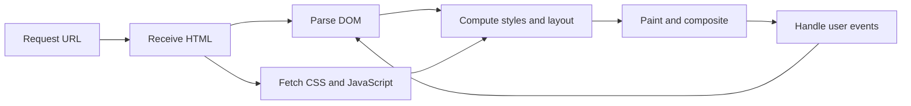

<TLDR>
  <TLDRCell label="what">
    Frontend code runs in a browser: HTML describes content and meaning, CSS controls presentation and layout, and JavaScript handles state and interaction.
  </TLDRCell>
  <TLDRCell label="trap">
    A page that looks right may still have inaccessible structure, fail on a narrow screen, or handle untrusted data unsafely.
  </TLDRCell>
  <TLDRCell label="fix">
    Start with usable semantic HTML, add resilient CSS and only the JavaScript you need, then verify each layer in browser developer tools.
  </TLDRCell>
</TLDR>

## What it is and why it exists

Frontend development owns the interface in a user agent. For most websites, that user agent is a browser: it receives resources from a server, turns a document into an interactive page, and turns user actions into navigation, form submissions, or script events. Frontend is not a synonym for visual styling. It also covers content structure, input methods, state feedback, network boundaries, and presentation across devices.

Browsers understand three core languages natively. You can put them in one HTML file or split them into separate resources, but their responsibilities stay the same:

- HTML (HyperText Markup Language) describes the structure and meaning of content such as headings, navigation, forms, and buttons.
- CSS (Cascading Style Sheets) uses selectors, the cascade, and layout rules to determine how elements are presented.
- JavaScript reads and updates page state, responds to events, and works with the browser or server through Web APIs when needed.

This separation lets the same content survive different environments. HTML can preserve reading order if styles fail to load, CSS can adapt to screen width without changing document meaning, and JavaScript can add immediate feedback after the basic action works. Mixing structure, presentation, and behavior expands the scope of every change and makes failures harder to locate.

Frameworks do not replace these foundations. React, Vue, or Svelte still produces DOM nodes, applies CSS, and updates the interface through browser events. Once you understand the platform layer, you can diagnose hydration mismatches, style overflow, lost focus, or duplicate event handling instead of merely changing component syntax.

The same foundation problems appear in static content pages, forms, dashboards, and single-page applications: whether the content has the right semantics, whether layout respects content and container constraints, whether interactions maintain explicit state, and whether failures have a recovery path. Solve those problems on the browser platform first, then decide whether you need a build tool or framework.

## How it works

A browser starts with a URL. It parses the address, sends an HTTP request, and reads the response. An HTML response can reference stylesheets, scripts, fonts, and images, causing more requests. The server decides what to return, the browser decides how to parse and present it, and HTTP messages form the boundary between them.

A page is not a downloaded picture. The browser parses HTML into the <Term id="document-object-model">Document Object Model (DOM)</Term>, includes applicable CSS rules in style calculation, then lays out, paints, and composites the boxes that need to appear. JavaScript can query or change the DOM, and those changes can lead to more style and rendering work.



### HTML establishes document meaning

HTML elements form a tree. Parent-child relationships group content, while element names express roles. For example, `<button>` includes keyboard operation, focus behavior, and button semantics; a `<div>` with a click listener has none of those by default. Browsers, search engines, and assistive technologies all depend on this tree, not only the pixels on screen.

Attributes supply information an element needs. A link gets its destination from `href`, a form control contributes its `name` to submitted data, and an image gets a text alternative from `alt`. ARIA can supplement missing accessibility information, but it does not automatically add keyboard behavior and should not override accurate native semantics.

### CSS computes the presentation

A CSS declaration does not win merely because its selector matches. The <Term id="css-cascade">CSS cascade</Term> also compares origin, layer, importance, specificity, scoping proximity, and source order; inheritance and initial values then help produce computed styles. The Computed panel in developer tools is closer to the browser's answer than a visual scan of the stylesheet.

Layout turns computed styles and content sizes into box positions and dimensions. Normal flow should be the starting point. Flexbox and Grid handle more explicit distribution relationships, while positioning suits local cases that need to leave ordinary flow. A fixed pixel width usually describes one screenshot; flexible sizes, sensible minimums, and media queries describe a range of environments.

### JavaScript connects events and state

JavaScript runs inside the browser host environment and manipulates the page through the DOM and other Web APIs. An <Term id="event-handler">event handler</Term> receives an event object, reads current state, and performs a necessary update. Visible text, a button's `aria-pressed` attribute, and application data must describe the same state, or different users receive contradictory feedback.

Scripts are not the browser's only execution path. Links can navigate directly, a form with an `action` can submit without scripting, and HTML constraints can catch basic input errors first. JavaScript can enhance those capabilities, but the server must still treat all client data as untrusted and validate it again.

### The development loop

A reliable beginner workflow needs only a few observable steps. Change one responsibility layer at a time, then verify the result in the browser:

1. Inspect DOM structure, attributes, and final computed styles in the Elements panel.
2. Read errors in the Console panel and add minimal, disposable diagnostic output.
3. Confirm request URLs, status codes, response types, and cache behavior in the Network panel.
4. Repeat the core task with a keyboard, a narrow viewport, and JavaScript disabled.

Source files are inputs. The DOM, computed styles, network responses, and observable behavior in the browser are the runtime result. Looking only at editor text cannot reveal that a server returned the wrong MIME type, a selector lost in the cascade, or an event never fired.

## Examples

These examples start with one actionable information card, then add responsive layout and form state. Each is a complete HTML file that you can open directly in a browser. The output blocks show actual console output from headless Chromium.

### A semantic information card

The first page uses native elements to represent content and an action. Clicking the button updates visible text, accessible state, and the status message together instead of changing color alone.

<Depth level="quick">

```html run title="profile-card.html"
<!doctype html>
<html lang="en">
  <meta charset="utf-8">
  <meta name="viewport" content="width=device-width">
  <title>Profile card</title>
  <style>
    body { font: 1rem/1.5 system-ui; }
    .profile { max-inline-size: 24rem; padding: 1rem; border: 1px solid #888; }
    .skills { display: flex; flex-wrap: wrap; gap: 0.5rem; padding: 0; }
    .skills li { list-style: none; padding: 0.25rem 0.5rem; background: #eee; }
  </style>
  <main>
    <article class="profile">
      <h1>Lin Chen</h1>
      <p>Builds accessible design systems.</p>
      <ul class="skills" aria-label="Skills">
        <li>HTML</li>
        <li>CSS</li>
        <li>JavaScript</li>
      </ul>
      <button id="follow" type="button" aria-pressed="false">Follow</button>
      <p id="status" aria-live="polite">Not following</p>
    </article>
  </main>
  <script>
    const button = document.querySelector('#follow');
    const status = document.querySelector('#status');
    button.addEventListener('click', () => {
      button.ariaPressed = 'true';
      button.textContent = 'Following';
      status.textContent = 'Following Lin Chen';
    });
    button.click();
    console.log(`${button.textContent} | ${status.textContent}`);
  </script>
</html>
```

```text
Following | Following Lin Chen
```

</Depth>

`<article>` says this information makes sense as an independent unit, the list groups related skills, and `<button>` supplies native action semantics. `aria-live` makes the status message eligible for assistive technology announcements, though you must test announcement timing with a real screen reader. The code writes plain text with `textContent`, so the string is not reparsed as HTML.

### A card grid that shrinks with its container

The second page puts three cards in an automatically fitting Grid. `min(100%, 14rem)` lets a track keep shrinking when its container is narrower than `14rem`, preventing the minimum track itself from creating horizontal scroll.

```html run title="responsive-cards.html"
<!doctype html>
<html lang="en">
  <meta charset="utf-8">
  <meta name="viewport" content="width=device-width">
  <title>Responsive cards</title>
  <style>
    * { box-sizing: border-box; }
    body { margin: 0; font: 1rem/1.5 system-ui; }
    .catalog {
      display: grid;
      grid-template-columns: repeat(auto-fit, minmax(min(100%, 14rem), 1fr));
      gap: 1rem;
      padding: 1rem;
    }
    .product { min-inline-size: 0; padding: 1rem; border: 1px solid #888; }
    .product h2 { overflow-wrap: anywhere; }
  </style>
  <main class="catalog">
    <article class="product"><h2>Notebook</h2><p>Recycled paper</p></article>
    <article class="product"><h2>Mechanical pencil</h2><p>0.5 mm lead</p></article>
    <article class="product"><h2>Desk organizer</h2><p>Three trays</p></article>
  </main>
  <script>
    const catalog = document.querySelector('.catalog');
    const columns = getComputedStyle(catalog).gridTemplateColumns.split(' ').length;
    const overflow = document.documentElement.scrollWidth > innerWidth;
    console.log(`columns=${columns}; horizontal-overflow=${overflow}`);
  </script>
</html>
```

```text
columns=3; horizontal-overflow=false
```

This output comes from an `800 × 600` viewport. With enough width the browser resolves three columns; at narrower widths, the same rule reduces the column count. The check looks for horizontal overflow instead of claiming that one fixed breakpoint maps to a particular device.

### An order form with constraints

The third page lets HTML own the input type and range, while JavaScript derives a summary from the validated value. It reads `valueAsNumber` so the quantity is not concatenated as a string. The currency formatting is for example output and is not an accounting implementation.

```html run title="order-form.html"
<!doctype html>
<html lang="en">
  <meta charset="utf-8">
  <meta name="viewport" content="width=device-width">
  <title>Order form</title>
  <form id="order-form">
    <label for="quantity">Notebook quantity</label>
    <input id="quantity" name="quantity" type="number"
           min="1" max="9" value="2" required>
    <button type="submit">Update summary</button>
  </form>
  <p id="summary" aria-live="polite"></p>
  <script>
    const unitPrice = 12.5;
    const form = document.querySelector('#order-form');
    const quantityInput = document.querySelector('#quantity');
    const summary = document.querySelector('#summary');

    form.addEventListener('submit', (event) => {
      event.preventDefault();
      if (!form.reportValidity()) return;

      const quantity = quantityInput.valueAsNumber;
      const total = quantity * unitPrice;
      summary.textContent = `${quantity} notebooks: $${total.toFixed(2)}`;
    });

    form.requestSubmit();
    console.log(summary.textContent);
  </script>
</html>
```

```text
2 notebooks: $25.00
```

`required`, `min`, and `max` provide a first layer of browser constraints. The script keeps the submit event as the single update entry point, so clicking the button, pressing Enter, or calling `requestSubmit()` follows the same logic. A real order still needs the server to parse the quantity again, look up a trusted price, and validate inventory.

### Event delegation for a control group

The last page puts one listener on the buttons' common parent. After an event bubbles to the list, `closest()` finds the button that caused the action. Adding another button of the same kind does not require another listener.

```html run title="filter-controls.html"
<!doctype html>
<html lang="en">
  <meta charset="utf-8">
  <meta name="viewport" content="width=device-width">
  <title>Filter controls</title>
  <ul id="filters" aria-label="Task filters">
    <li><button type="button" data-filter="all" aria-pressed="true">All</button></li>
    <li><button type="button" data-filter="open" aria-pressed="false">Open</button></li>
    <li><button type="button" data-filter="done" aria-pressed="false">Done</button></li>
  </ul>
  <p id="selection" aria-live="polite">Showing all tasks</p>
  <script>
    const filters = document.querySelector('#filters');
    const selection = document.querySelector('#selection');

    filters.addEventListener('click', (event) => {
      const button = event.target.closest('button[data-filter]');
      if (!button || !filters.contains(button)) return;

      for (const candidate of filters.querySelectorAll('button')) {
        candidate.ariaPressed = String(candidate === button);
      }
      selection.textContent = `Showing ${button.dataset.filter} tasks`;
    });

    const openButton = filters.querySelector('[data-filter="open"]');
    openButton.click();
    console.log(`filter=${openButton.dataset.filter}; pressed=${openButton.ariaPressed}`);
  </script>
</html>
```

```text
filter=open; pressed=true
```

Event delegation depends on event propagation; it does not mean handling every click blindly at an arbitrary ancestor. The guard limits handling to buttons with `data-filter` and confirms that the button still belongs to this list. The visible filter result, each button's pressed state, and the application's actual filter should all derive from one state source.

## Pitfalls

### Simulating a native control with a generic container

> [!PITFALL]
> Adding a click listener and button styles to a `<div>` does not give it button keyboard operation, focus rules, disabled state, or assistive-technology semantics.

This code often works only with a mouse. Adding `role`, `tabindex`, and keyboard listeners recreates behavior the browser already supplies and vendors have tested for interoperability.

**Fix:** use `<button type="button">` for an action, `<a href>` for navigation, and the corresponding form control for data entry. Use ARIA to supplement semantics only when the platform has no matching element, and then implement the complete interaction required by that role.

### Fixing dimensions to one mockup

> [!PITFALL]
> Giving the main container a fixed width or recreating a screenshot with absolute positioning produces overlap and horizontal scroll when text grows, zoom increases, or the viewport narrows.

A mockup supplies one sample, not a complete layout algorithm. Real content includes longer translated labels, system font differences, browser zoom, and user-defined text sizes.

**Fix:** start with normal flow and express constraints with `max-inline-size`, percentages, `min()`, Flexbox, or Grid. Test at the narrowest supported width, at `200%` zoom, and with the longest real content, then confirm the result with an overflow check.

### Passing untrusted strings to `innerHTML`

> [!PITFALL]
> Using `innerHTML` to insert a name or status string parses that string as markup. If the data comes from a URL, form, or API, the call can become a cross-site scripting entry point.

Even when today's example data is hard-coded, a copied component may soon receive remote content. Removing the word `<script>` is not reliable HTML sanitization because dangerous behavior has many other syntax positions.

**Fix:** use `textContent` for plain text and DOM methods or a reviewed template for fixed structure. If the product must accept rich text, define an allowlist policy, use a maintained purpose-built sanitizer, and add defense in depth such as a Content Security Policy.

### Making JavaScript the only entry point

> [!PITFALL]
> Writing navigation as an element whose click calls `location`, or removing a form's `action` and relying entirely on script, removes the baseline capability when loading, execution, or assistive-technology paths fail.

A script may not run because of the network, an extension, a syntax error, or an earlier thrown exception. Empty containers and fake links provide no recovery path in that state.

**Fix:** make links navigate, forms submit, and content read correctly first, then intercept and enhance with JavaScript. This is <Term id="progressive-enhancement">progressive enhancement</Term>. Whether a no-script submission must remain available is an explicit product decision based on the task and server capability.

### Stacking tools before understanding the platform

> [!PITFALL]
> Adding a framework, state library, and complex build configuration before building one static page expands the failure surface without automatically improving semantics, layout, or accessibility.

Tools can have valid jobs, including module dependency management, type checking, code splitting, and production optimization. The mistake is substituting package installation for requirements analysis and hiding native browser failures behind several abstraction layers.

**Fix:** validate the task with minimal HTML, CSS, and JavaScript, then choose tools for constraints that have actually appeared. When introducing a tool, record the problem it solves, development and production commands, output boundary, and removal cost.

## In the AI era

**What generated code gets wrong here**

Models often turn screenshots into piles of non-semantic `<div>` elements, fixed pixel coordinates, and mouse-only click handlers. They also omit a button's `type`, causing an accidental form submission; insert API data through `innerHTML`; register the same event repeatedly on every render; or replace browser and server validation with one regular expression. The result typically covers the ideal screenshot but has no defined behavior for focus order, long text, narrow viewports, network failure, or a script that never runs.

**Ask your AI to check**

- List the native HTML semantics, keyboard operation, accessible name, and focus result for every interactive element.
- Check overflow at a `320px` viewport, `200%` zoom, and with the longest content; identify the exact box and CSS constraint that causes any overflow.
- Trace the source of every string entering the DOM, confirm that plain text uses `textContent`, and identify every HTML parsing sink.

**Review checklist**

- Disable CSS and JavaScript, then confirm that content order and the product's baseline task remain clear.
- Complete every action with a keyboard and check Enter, Space, Tab, visible focus, and dynamic state announcements.
- Verify real responses, runtime errors, DOM, and computed styles in the Network, Console, and Elements panels instead of reviewing generated source alone.

**Prompt vocabulary**

Use the exact terms `semantic HTML`, `native control`, `DOM order`, `CSS cascade`, `intrinsic sizing`, `event delegation`, `progressive enhancement`, and `untrusted input`. Ask the model for state transitions, failure paths, and browser verification steps. That is more reviewable than asking it to “make the page responsive and accessible.”

<Depth level="deep">

## From source files to pixels

### Parsing and resource loading

The HTML parser builds the DOM incrementally from a byte stream. When it finds references to external stylesheets, images, or scripts, the browser schedules the corresponding requests. Resource discovery, priority, and caching all affect when those resources become available. Source order alone does not reveal every network completion time, so inspect the actual request timeline in the Network panel.

An ordinary external classic script blocks HTML parsing while it downloads and executes unless it has `defer` or `async`. Deferred scripts execute in document order after parsing. Async scripts execute as soon as their download finishes and do not preserve order relative to each other. Module scripts have defer-like timing by default and load through a module dependency graph; reserve `async` for independent work that may run out of order.

CSS generally does not stop the HTML parser from continuing to build the DOM, but stylesheets affect first rendering and can introduce waits between scripts and styles. The useful question is not whether you memorized “CSS blocks rendering.” Identify the resources needed for the page, observe the dependency chain, and keep non-critical work from delaying the content the user needs first.

### Style, layout, and paint

Selector matching is only one input to style calculation. The browser also resolves inheritance, custom properties, and cascade results before calculating geometry for each formatting context. Repeatedly reading layout-dependent properties and immediately writing styles can force several synchronous layouts in one task. Batching reads and writes is usually easier to reason about.

After layout, the browser records paint work for visible content and combines some results into the final frame. A DOM change does not necessarily pass through every stage: changing text may affect layout and paint, while changing some composited properties can avoid layout. Do not promise performance from a property name. Use a browser performance recording on the target device to determine the actual cost.

The browser's main thread also runs JavaScript, dispatches input, and completes rendering work. Synchronous script that does not yield for a long time delays input feedback and the next frame. Remove unnecessary work first, then split large tasks or move them to an appropriate background capability. Compare recordings of the real interaction before and after the change.

## The progressive-enhancement boundary

Progressive enhancement does not require every application to retain all functionality without JavaScript. It requires you to identify the task's minimum useful layer and make the result predictable if an enhancement fails. A content site can often retain full reading and navigation, while a complex editor may provide read-only content or an explicit loading failure.

The three platform layers suit different responsibilities:

| Layer | Primary responsibility | What to check on failure |
| --- | --- | --- |
| HTML | Content, semantics, link targets, form data shape | Whether reading order and baseline actions work |
| CSS | Cascade, layout, visual state, media adaptation | Whether content stays readable and state stays distinguishable |
| JavaScript | State transitions, async enhancement, client coordination | Whether a fallback, retry, or explicit error exists |

Feature detection is more resilient than guessing support from a browser name. CSS can wrap enhancements in `@supports`, and JavaScript can check whether a required API exists. Existence is not the same as correct behavior, though, so test critical paths in real browsers from the support matrix.

Network boundaries are also frontend design. Loading, empty results, permission denial, timeouts, and malformed data are distinct states and should not all become a blank region. The client can improve feedback and retry behavior, but the server must enforce authentication, authorization, data integrity, trusted prices, and similar rules.

## Learning order

Order your learning path by dependencies rather than tool popularity:

1. Build content, links, images, and forms with semantic HTML; learn basic keyboard and accessibility-tree checks.
2. Learn normal flow, the box model, the cascade, intrinsic sizing, Flexbox, Grid, and responsive constraints.
3. Learn JavaScript values, functions, modules, DOM events, asynchronous control flow, and error handling.
4. Use developer tools to debug the network, DOM, computed styles, events, and performance, then automate behavioral tests.
5. Choose Vite, TypeScript, or a UI framework when the project develops module organization, type-scale, routing, or rendering-boundary problems.

Each step should produce small pages you can open and verify directly. When something breaks, reduce it to one minimal file, determine whether the fault belongs to HTML, CSS, JavaScript, the network, or the toolchain, then carry the fix back into the project. That habit survives tool versions better than memorizing a framework command.

</Depth>

<Checkpoint id="frontend/getting-started" />

## Further reading

- [HTML Living Standard](https://html.spec.whatwg.org/multipage/)
- [MDN: How the web works](https://developer.mozilla.org/en-US/docs/Learn_web_development/Getting_started/Web_standards/How_the_web_works)
- [MDN: HTML](https://developer.mozilla.org/en-US/docs/Web/HTML)
- [MDN: CSS cascade](https://developer.mozilla.org/en-US/docs/Web/CSS/CSS_cascade/Cascade)
- [MDN: Introduction to the DOM](https://developer.mozilla.org/en-US/docs/Web/API/Document_Object_Model/Introduction)
