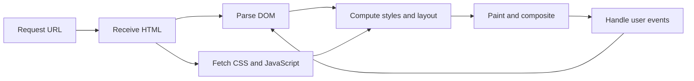

<TLDR>
  <TLDRCell label="what">
    前端代码在浏览器中运行：HTML 描述内容与语义，CSS 决定呈现与布局，JavaScript 处理状态和交互。
  </TLDRCell>
  <TLDRCell label="trap">
    页面看起来正确，不代表结构可访问、布局能适应窄屏，也不代表浏览器收到不可信数据时仍然安全。
  </TLDRCell>
  <TLDRCell label="fix">
    先写可用的语义化 HTML，再添加有弹性的 CSS 和必要的 JavaScript；用浏览器开发者工具逐层验证。
  </TLDRCell>
</TLDR>

## 是什么，为什么存在

前端开发负责用户代理中的界面。对大多数网站而言，这个用户代理就是浏览器；它接收服务器返回的资源，把文档转换成可交互的页面，再把用户操作转换成导航、表单提交或脚本事件。前端不是“做视觉效果”的同义词，它同时处理内容结构、输入方式、状态反馈、网络边界和不同设备上的呈现。

浏览器原生理解三类核心语言。它们可以放进一个 HTML 文件，也可以拆成独立资源，但职责并没有因此改变：

- HTML（HyperText Markup Language）描述内容的结构和含义，例如标题、导航、表单与按钮。
- CSS（Cascading Style Sheets）根据选择器、层叠和布局规则计算元素怎样呈现。
- JavaScript 读取和更新页面状态，响应事件，并在需要时通过 Web API 与浏览器或服务器协作。

这三层分工让同一份内容适应不同环境。HTML 可以在样式加载失败时保留阅读顺序，CSS 可以在不改变文档含义的情况下适应屏幕宽度，JavaScript 则可以在基础操作已经成立之后增加即时反馈。把结构、呈现和行为混在一起，会让修改范围扩大，也更难判断故障属于哪一层。

框架不会替代这些基础。React、Vue 或 Svelte 最终仍然生成 DOM 节点、应用 CSS，并通过浏览器事件更新界面。理解平台层以后，你才能判断框架代码为什么出现水合差异、样式溢出、焦点丢失或重复事件处理，而不是只会更换组件写法。

你会在静态内容页、表单、仪表盘和单页应用中遇到同一组基础问题：内容是否有正确语义，布局是否受内容和容器约束，交互是否维护明确状态，以及失败后是否仍有可恢复路径。这些问题应先在浏览器平台上解决，再决定是否需要构建工具或框架。

## 工作原理

浏览器从一个 URL 开始工作。它解析地址，发出 HTTP 请求并读取响应；HTML 响应还可能引用样式表、脚本、字体和图片，从而触发更多请求。服务器决定返回什么，浏览器决定怎样解析和呈现，二者之间以 HTTP 消息为边界。

页面不是一张被下载的图片。浏览器把 HTML 解析为<Term id="document-object-model">文档对象模型（Document Object Model，DOM）</Term>，把适用的 CSS 规则参与样式计算，再为需要显示的盒子执行布局、绘制与合成。JavaScript 可以查询或修改 DOM，修改结果又可能触发后续样式和渲染工作。



### HTML 建立文档含义

HTML 元素组成一棵树。父子关系表达内容分组，元素名称表达角色；例如 `<button>` 自带键盘操作、焦点能力和按钮语义，而带点击监听器的 `<div>` 默认没有这些行为。浏览器、搜索引擎和辅助技术都依赖这棵树，不只依赖屏幕上的像素。

属性补充元素所需的信息。链接通过 `href` 给出导航目标，表单控件通过 `name` 进入提交数据，图片通过 `alt` 提供文本替代。ARIA 可以补充缺少的无障碍信息，却不会自动添加键盘行为，也不应覆盖已经准确的原生语义。

### CSS 计算呈现结果

一条 CSS 声明是否生效，不只取决于选择器是否匹配。<Term id="css-cascade">CSS 层叠（CSS cascade）</Term>还要比较来源、层、重要性、优先级、作用域邻近性和源码顺序，然后继承与默认值共同产生计算样式。开发者工具中的 Computed 面板比目测样式表更接近浏览器实际采用的答案。

布局把计算样式和内容尺寸转换成盒子的位置与大小。正常流应当是起点；Flexbox 和 Grid 负责更明确的分配关系，定位则适合脱离普通流的局部需求。固定像素宽度通常只描述一个截图，有弹性的尺寸、合理的最小值和媒体查询才能表达一组环境。

### JavaScript 连接事件与状态

JavaScript 在浏览器主机环境中运行，并通过 DOM 与其他 Web API 操作页面。<Term id="event-handler">事件处理器（event handler）</Term>接收事件对象，读取当前状态，执行必要的更新。界面上可见的文字、按钮的 `aria-pressed` 属性和应用保存的数据必须表达同一个状态，否则不同用户会得到互相矛盾的反馈。

脚本不是浏览器的唯一执行路径。链接可以直接导航，带 `action` 的表单可以在没有脚本时提交，HTML 约束可以先处理基本输入错误。JavaScript 适合增强这些能力，但服务器仍必须把所有客户端数据视为不可信输入并重新验证。

### 开发循环

一个可靠的入门循环只需要几个可观察步骤。每次只改变一个责任层，再用浏览器确认结果：

1. 在 Elements 面板检查 DOM 结构、属性和最终计算样式。
2. 在 Console 面板读取错误，并输出最小、可删除的诊断信息。
3. 在 Network 面板确认请求 URL、状态码、响应类型和缓存行为。
4. 用键盘、窄视口和禁用 JavaScript 的条件重新走一遍核心任务。

源文件是输入，浏览器中的 DOM、计算样式、网络响应和可观察行为才是运行结果。只检查编辑器中的代码，无法发现服务器返回了错误 MIME 类型、选择器被覆盖或事件根本没有触发。

## 示例

三个例子从一张可操作的信息卡开始，逐步加入响应式布局和表单状态。它们都是完整 HTML 文件，可以直接在浏览器打开；输出块记录的是 Chromium 无头浏览器中的实际控制台输出。

### 语义化信息卡

第一个页面用原生元素表达内容和操作。按钮点击后同时更新可见文本、可访问状态和状态消息，而不是只改变颜色。

<Depth level="quick">

```html run title="profile-card.html"
<!doctype html>
<html lang="en">
  <meta charset="utf-8">
  <meta name="viewport" content="width=device-width">
  <title>Profile card</title>
  <style>
    body { font: 1rem/1.5 system-ui; }
    .profile { max-inline-size: 24rem; padding: 1rem; border: 1px solid #888; }
    .skills { display: flex; flex-wrap: wrap; gap: 0.5rem; padding: 0; }
    .skills li { list-style: none; padding: 0.25rem 0.5rem; background: #eee; }
  </style>
  <main>
    <article class="profile">
      <h1>Lin Chen</h1>
      <p>Builds accessible design systems.</p>
      <ul class="skills" aria-label="Skills">
        <li>HTML</li>
        <li>CSS</li>
        <li>JavaScript</li>
      </ul>
      <button id="follow" type="button" aria-pressed="false">Follow</button>
      <p id="status" aria-live="polite">Not following</p>
    </article>
  </main>
  <script>
    const button = document.querySelector('#follow');
    const status = document.querySelector('#status');
    button.addEventListener('click', () => {
      button.ariaPressed = 'true';
      button.textContent = 'Following';
      status.textContent = 'Following Lin Chen';
    });
    button.click();
    console.log(`${button.textContent} | ${status.textContent}`);
  </script>
</html>
```

```text
Following | Following Lin Chen
```

</Depth>

`<article>` 表明这组信息可以独立理解，列表表达同类技能，`<button>` 则提供原生操作语义。`aria-live` 让状态消息具备被辅助技术通知的条件，但通知时机仍需用真实屏幕阅读器测试。代码使用 `textContent` 写入纯文本，不会把字符串重新解释成 HTML。

### 随容器收缩的卡片网格

第二个页面把三张卡片放入自动适配的 Grid。`min(100%, 14rem)` 允许轨道在容器窄于 `14rem` 时继续收缩，避免最小轨道自身制造横向滚动。

```html run title="responsive-cards.html"
<!doctype html>
<html lang="en">
  <meta charset="utf-8">
  <meta name="viewport" content="width=device-width">
  <title>Responsive cards</title>
  <style>
    * { box-sizing: border-box; }
    body { margin: 0; font: 1rem/1.5 system-ui; }
    .catalog {
      display: grid;
      grid-template-columns: repeat(auto-fit, minmax(min(100%, 14rem), 1fr));
      gap: 1rem;
      padding: 1rem;
    }
    .product { min-inline-size: 0; padding: 1rem; border: 1px solid #888; }
    .product h2 { overflow-wrap: anywhere; }
  </style>
  <main class="catalog">
    <article class="product"><h2>Notebook</h2><p>Recycled paper</p></article>
    <article class="product"><h2>Mechanical pencil</h2><p>0.5 mm lead</p></article>
    <article class="product"><h2>Desk organizer</h2><p>Three trays</p></article>
  </main>
  <script>
    const catalog = document.querySelector('.catalog');
    const columns = getComputedStyle(catalog).gridTemplateColumns.split(' ').length;
    const overflow = document.documentElement.scrollWidth > innerWidth;
    console.log(`columns=${columns}; horizontal-overflow=${overflow}`);
  </script>
</html>
```

```text
columns=3; horizontal-overflow=false
```

该输出来自 `800 × 600` 的视口。宽度足够时，浏览器解析出三列；在更窄视口中，同一条规则会减少列数。这里检查横向溢出，而不是断言某个固定断点一定对应某台设备。

### 带约束的订单表单

第三个页面让 HTML 负责输入类型和范围，让 JavaScript 负责根据已验证的值派生摘要。程序读取 `valueAsNumber`，避免把数量当字符串拼接；金额格式只用于示例显示，不承担会计计算。

```html run title="order-form.html"
<!doctype html>
<html lang="en">
  <meta charset="utf-8">
  <meta name="viewport" content="width=device-width">
  <title>Order form</title>
  <form id="order-form">
    <label for="quantity">Notebook quantity</label>
    <input id="quantity" name="quantity" type="number"
           min="1" max="9" value="2" required>
    <button type="submit">Update summary</button>
  </form>
  <p id="summary" aria-live="polite"></p>
  <script>
    const unitPrice = 12.5;
    const form = document.querySelector('#order-form');
    const quantityInput = document.querySelector('#quantity');
    const summary = document.querySelector('#summary');

    form.addEventListener('submit', (event) => {
      event.preventDefault();
      if (!form.reportValidity()) return;

      const quantity = quantityInput.valueAsNumber;
      const total = quantity * unitPrice;
      summary.textContent = `${quantity} notebooks: $${total.toFixed(2)}`;
    });

    form.requestSubmit();
    console.log(summary.textContent);
  </script>
</html>
```

```text
2 notebooks: $25.00
```

`required`、`min` 和 `max` 提供浏览器内置的第一层约束。脚本保留提交事件作为唯一更新入口，所以用户点击按钮、按 Enter 或代码调用 `requestSubmit()` 都走同一逻辑。真实下单仍要由服务器重新解析数量、查询可信价格并验证库存。

### 用事件委托管理一组控件

最后一个页面把一个监听器放在按钮列表的共同父元素上。事件冒泡到列表后，`closest()` 找到实际触发操作的按钮；以后增加同类按钮时，不需要再注册一份监听器。

```html run title="filter-controls.html"
<!doctype html>
<html lang="en">
  <meta charset="utf-8">
  <meta name="viewport" content="width=device-width">
  <title>Filter controls</title>
  <ul id="filters" aria-label="Task filters">
    <li><button type="button" data-filter="all" aria-pressed="true">All</button></li>
    <li><button type="button" data-filter="open" aria-pressed="false">Open</button></li>
    <li><button type="button" data-filter="done" aria-pressed="false">Done</button></li>
  </ul>
  <p id="selection" aria-live="polite">Showing all tasks</p>
  <script>
    const filters = document.querySelector('#filters');
    const selection = document.querySelector('#selection');

    filters.addEventListener('click', (event) => {
      const button = event.target.closest('button[data-filter]');
      if (!button || !filters.contains(button)) return;

      for (const candidate of filters.querySelectorAll('button')) {
        candidate.ariaPressed = String(candidate === button);
      }
      selection.textContent = `Showing ${button.dataset.filter} tasks`;
    });

    const openButton = filters.querySelector('[data-filter="open"]');
    openButton.click();
    console.log(`filter=${openButton.dataset.filter}; pressed=${openButton.ariaPressed}`);
  </script>
</html>
```

```text
filter=open; pressed=true
```

事件委托依赖事件传播，不等于在任意祖先上盲目处理所有点击。守卫条件把处理范围限制在带 `data-filter` 的按钮，并确认按钮仍属于当前列表。可见筛选结果、每个按钮的按下状态和应用中的实际过滤条件还应由同一状态来源派生。

## 陷阱

### 用通用容器模拟原生控件

> [!PITFALL]
> 给 `<div>` 添加点击监听器和按钮样式，并不会让它获得按钮的键盘操作、焦点规则、禁用状态和辅助技术语义。

这种代码常常只能由鼠标完成操作。继续补 `role`、`tabindex` 和键盘监听，会重新实现浏览器已经提供且经过互操作测试的行为。

**修复：**操作使用 `<button type="button">`，导航使用带 `href` 的 `<a>`，数据输入使用对应的表单控件。只有平台没有匹配元素时，才使用 ARIA 补充语义，并同时实现该角色要求的完整交互。

### 按单张设计稿固定尺寸

> [!PITFALL]
> 把主要容器写成固定宽度，或通过绝对定位复刻截图，会在文字变长、缩放增大或视口变窄时产生重叠与横向滚动。

设计稿给出一个样本，不是完整布局算法。真实内容包含翻译后的长标签、系统字体差异、浏览器缩放和用户自定义字号。

**修复：**从正常流开始，用 `max-inline-size`、百分比、`min()`、Flexbox 或 Grid 表达约束。至少测试最窄支持宽度、`200%` 缩放和最长真实内容，并用溢出检查确认结果。

### 把不可信字符串交给 `innerHTML`

> [!PITFALL]
> 为了插入一段名字或状态文字而使用 `innerHTML`，会让字符串被解析成标记；数据来自 URL、表单或 API 时，这可能形成跨站脚本攻击入口。

即使当前示例数据写死，复制后的组件也可能很快接入远程内容。简单地删除 `<script>` 字样不是可靠的 HTML 清理，因为危险行为还有许多其他语法位置。

**修复：**纯文本使用 `textContent`，固定结构使用 DOM 方法或受审查的模板。确实要接受富文本时，应定义允许的标记策略，采用维护中的专用清理器，并结合内容安全策略等纵深防护。

### 让 JavaScript 成为唯一入口

> [!PITFALL]
> 把导航写成点击后调用 `location` 的元素，或删除表单的 `action` 后完全依赖脚本，会让加载失败、执行异常和辅助技术路径失去基础能力。

脚本可能因为网络、扩展、语法错误或前面抛出的异常而没有执行。此时空容器和假链接无法提供恢复路径。

**修复：**先让链接能导航、表单能提交、内容能阅读，再用 JavaScript 拦截并增强体验。这就是<Term id="progressive-enhancement">渐进增强（progressive enhancement）</Term>；是否需要保留无脚本提交，要根据产品任务和服务端能力明确决定。

### 在理解平台前堆叠工具

> [!PITFALL]
> 为一个静态页面先加入框架、状态库和复杂构建配置，会增加故障面，却不会自动改善语义、布局或可访问性。

工具可能有合理用途，例如模块依赖、类型检查、代码分割和生产优化。问题在于用安装包替代需求分析，使浏览器原生错误被藏在多层抽象之后。

**修复：**先用最小 HTML、CSS 和 JavaScript 验证任务，再为已经出现的约束选择工具。引入工具时记录它解决的问题、开发与生产命令、输出边界和移除成本。

## AI 时代

**生成代码在这里容易犯什么错**

模型经常根据截图生成大量无语义 `<div>`、固定像素坐标和只响应鼠标的点击处理器。它还会遗漏按钮的 `type`，导致按钮在表单中意外提交；用 `innerHTML` 插入 API 数据；在每次渲染时重复注册事件；或用一条正则表达式取代浏览器与服务器各自的验证。生成结果通常能覆盖理想截图，却没有焦点顺序、长文本、窄视口、网络失败和脚本未运行时的行为。

**让 AI 检查这些内容**

- 列出每个交互元素的原生 HTML 语义、键盘操作、可访问名称和焦点结果。
- 在 `320px` 视口、`200%` 缩放和最长内容下检查溢出，并指出造成溢出的具体盒子和 CSS 约束。
- 追踪每个进入 DOM 的字符串来源，确认纯文本使用 `textContent`，并标出所有 HTML 解析入口。

**审查清单**

- 禁用 CSS 和 JavaScript 后，确认内容顺序与产品要求的基础任务仍然明确。
- 用键盘完成所有操作，检查 Enter、Space、Tab、焦点可见性和动态状态通知。
- 在 Network、Console 和 Elements 面板中验证真实响应、运行错误、DOM 与计算样式，而不是只看生成的源码。

**提示词词汇**

使用精确术语 `semantic HTML`（语义化 HTML）、`native control`（原生控件）、`DOM order`（DOM 顺序）、`CSS cascade`（CSS 层叠）、`intrinsic sizing`（固有尺寸）、`event delegation`（事件委托）、`progressive enhancement`（渐进增强）和 `untrusted input`（不可信输入）。要求模型给出状态转换、失败路径和浏览器验证步骤，比“把页面做得响应式且无障碍”更容易得到可审查的结果。

<Depth level="deep">

## 从源文件到像素

### 解析与资源加载

HTML 解析器按字节流逐步建立 DOM。遇到外部样式表、图片或脚本引用时，浏览器调度相应请求；资源发现、优先级和缓存共同影响它们何时可用。不能从源码顺序直接推导所有网络完成顺序，应在 Network 面板中查看真实请求时间线。

普通外部经典脚本会在下载和执行期间阻塞 HTML 解析，除非使用 `defer` 或 `async`。`defer` 脚本按文档顺序在解析完成后执行，`async` 脚本下载完成即可执行，不保证彼此顺序。模块脚本默认具有类似 `defer` 的执行时机，并按模块依赖图加载；只有互不依赖且允许乱序的任务才适合 `async`。

CSS 通常不会阻止 HTML 解析器继续建立 DOM，但样式表会影响首次渲染，脚本与样式表之间也可能存在等待关系。这里的关键不是背一句“CSS 阻塞渲染”，而是识别页面所需资源、观察依赖链，并避免让非关键资源挡住用户最先需要的内容。

### 样式、布局与绘制

选择器匹配只是样式计算的输入之一。浏览器还要解析继承、自定义属性和层叠结果，再根据格式化上下文计算几何尺寸。读取布局相关属性后立刻反复写样式，可能迫使浏览器在一次任务中多次同步布局；批量读取和写入通常更容易推理。

布局之后，浏览器为需要显示的内容生成绘制记录，并把部分结果组合为最终帧。一次 DOM 修改不一定经过全部阶段：改变文本可能影响布局与绘制，只改变某些合成属性可能绕过布局。不要根据属性名称承诺性能，应使用目标设备上的浏览器性能录制判断实际成本。

浏览器主线程还要执行 JavaScript、分发输入并完成渲染相关工作。长时间不返回的同步脚本会推迟输入反馈与下一帧。先删除不必要工作，再把大任务切分或移到合适的后台能力；优化前后都要以真实交互的录制结果为依据。

## 渐进增强的责任边界

渐进增强不是要求每个应用在无 JavaScript 时保持全部功能。它要求先识别任务的最低可用层，再让增强失败时的结果可预测。内容站点通常能保留完整阅读和导航，复杂编辑器可能只提供只读内容或明确的加载失败说明。

三个平台层适合承担不同责任：

| 层 | 主要责任 | 失败时应检查 |
| --- | --- | --- |
| HTML | 内容、语义、链接目标、表单数据形状 | 阅读顺序与基础操作是否成立 |
| CSS | 层叠、布局、视觉状态、媒体适配 | 内容是否仍可读，状态是否仍可辨认 |
| JavaScript | 状态转换、异步增强、客户端协调 | 是否有回退、重试或明确错误 |

能力检测比根据浏览器名称猜测支持情况更稳妥。CSS 可以用 `@supports` 包围增强规则，JavaScript 可以检查所需 API 是否存在；但检测存在性不等于验证行为，关键路径仍需在支持矩阵中的真实浏览器上测试。

网络边界也属于前端设计。加载中、空结果、权限拒绝、超时和格式错误都是不同状态，不应全部变成空白区域。客户端可以改善反馈与重试，但认证、授权、数据完整性和可信价格等规则必须由服务器执行。

## 学习顺序

学习路线应按依赖关系排列，而不是按工具热度排列：

1. 先用语义化 HTML 构建内容、链接、图片和表单，学习键盘与无障碍树的基本检查。
2. 再学习正常流、盒模型、层叠、固有尺寸、Flexbox、Grid 和响应式约束。
3. 掌握 JavaScript 的值、函数、模块、DOM 事件、异步流程与错误处理。
4. 使用开发者工具调试网络、DOM、计算样式、事件和性能，并为行为编写自动化测试。
5. 当项目出现模块组织、类型规模、路由或渲染边界问题时，再选择 Vite、TypeScript 或界面框架。

每一步都应产出可以直接打开和验证的小页面。遇到问题时先把它缩减为一个最小文件，确认属于 HTML、CSS、JavaScript、网络还是工具链，再把修复带回项目。这个习惯比记住某个框架命令更能跨越工具版本变化。

</Depth>

<Checkpoint id="frontend/getting-started" />

## 延伸阅读

- [HTML Living Standard](https://html.spec.whatwg.org/multipage/)
- [MDN：Web 的工作方式](https://developer.mozilla.org/en-US/docs/Learn_web_development/Getting_started/Web_standards/How_the_web_works)
- [MDN：HTML](https://developer.mozilla.org/en-US/docs/Web/HTML)
- [MDN：CSS 层叠](https://developer.mozilla.org/en-US/docs/Web/CSS/CSS_cascade/Cascade)
- [MDN：DOM 简介](https://developer.mozilla.org/en-US/docs/Web/API/Document_Object_Model/Introduction)
