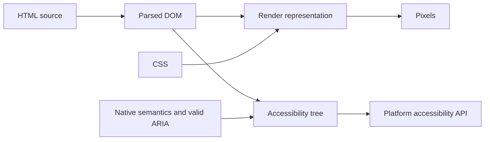

<TLDR>
  <TLDRCell label="what">
    <Term id="semantic-html">Semantic HTML</Term> uses elements for their defined purposes, so structure and behavior do not depend on class names or visual styling.
  </TLDRCell>
  <TLDRCell label="trap">
    Replacing every `<div>` with `<section>`, or piling ARIA onto native elements, does not improve semantics; a wrong role can override correct native semantics.
  </TLDRCell>
  <TLDRCell label="fix">
    Choose the native element that best matches the content or interaction, then verify the result in the DOM, accessibility tree, and keyboard path.
  </TLDRCell>
</TLDR>

## What it is and why it exists

Semantic HTML uses elements to say what content is, how parts relate, and what a control can do. `<nav>` identifies major navigation, `<article>` identifies independently reusable content, and `<button>` identifies a control that triggers an action. By contrast, `<div>` and `<span>` are general containers with no added meaning.

Semantics are not appearance. CSS can make an `<h2>` smaller than body text, but it remains a level-two heading; a `<div>` styled like a button is still not a button. A class can name a design-system role, but the browser does not derive an HTML contract from names such as `card-title` or `primary-nav`.

After parsing the markup, the browser builds a <Term id="document-object-model">Document Object Model (DOM)</Term>. Element names, nesting, and attributes then participate in form submission, keyboard interaction, page navigation, and accessibility API mappings. Semantic markup puts these capabilities in one declaration instead of making scripts recreate browser behavior.

Assistive technology can navigate by headings, control names, and <Term id="landmark">landmarks</Term>. Developers can also read the structure directly from element names. Semantic elements are not an SEO ranking switch, however, and they do not repair vague copy, a broken heading hierarchy, or an unlabeled form control.

You use these elements in page shells, article lists, navigation, forms, disclosure controls, and search results. Start element selection from the content and behavior, not from default styling or the ARIA role you hope to produce.

## How it works

The HTML parser turns source into a DOM. Valid element relationships become parent-child relationships in the tree; invalid nesting may be repaired, leaving an actual DOM that differs from the source. Template indentation alone is incomplete evidence, so check the browser-generated DOM during a semantic review.

The browser converts the DOM and CSS into a visual presentation while mapping relevant nodes to platform accessibility APIs. The latter result is commonly called the accessibility tree. Native elements, accessible names, states, and necessary ARIA contribute to that tree, but visual position does not define document meaning.

These common structural elements have distinct jobs. An implicit role describes a usual mapping, not a promise that every element with that tag becomes a landmark; context and an accessible name can change the result.

| Element | Content responsibility | Common implicit role or behavior |
| --- | --- | --- |
| `<header>` | Introductory information for a page or content unit | Usually `banner` at page scope |
| `<nav>` | Major navigation links | `navigation` |
| `<main>` | Content unique to the current document | `main` |
| `<article>` | Complete content that can be distributed or reused alone | `article` |
| `<section>` | A generic section with a clear theme | Usually `region` when it has an accessible name |
| `<aside>` | Content indirectly related to its surroundings | `complementary` |
| `<footer>` | Footer information for a page or content unit | Usually `contentinfo` at page scope |

The meanings of `<header>` and `<footer>` depend on their nearest content scope. A page header can be a `banner` landmark, while a `<header>` inside an `<article>` is only that article's introduction. Do not add `role="banner"` to every local header, or the page acquires a set of false top-level landmarks.

Content ownership separates `<section>` from `<article>`. Content that could leave the page for a feed, search result, or another aggregator suits `<article>`; a chapter that depends on the current document's theme suits `<section>`. If a wrapper exists only for layout, neither is right: use `<div>`.

Choose a structural element by asking, in order:

1. Is this the content unique to the whole document? Use one visible `<main>`.
2. Is this major navigation or independently reusable content? Consider `<nav>` or `<article>`, respectively.
3. Is this a named thematic section or supplementary content? Consider `<section>` or `<aside>`.
4. Does the wrapper exist only for layout, styling, or a script hook? Keep a `<div>` or `<span>`.

Heading elements express hierarchy, not font size. Levels `<h1>` through `<h6>` should reflect real containment in the page. Browsers do not implement a general outline algorithm that resets heading levels inside each nested `<section>`, so writing another `<h1>` mechanically in every section does not work.

Interactive elements also carry behavior contracts. A `<button>` enters sequential focus order, responds to keyboard activation, supports `disabled`, and has a defined `type` inside forms; an `<a>` with `href` supports navigation, address copying, and opening in a new tab. Simulating these capabilities with `<div>` means rebuilding a control and commonly missing edge cases.

An <Term id="accessible-name">accessible name</Term> answers "what is this control or region called?" It can come from element text, an associated `<label>`, `aria-labelledby`, or, where appropriate, `aria-label`. Name sources have precedence, so casual ARIA can hide clear visible text that already supplied the name.

## Examples

All four examples run in a browser and show their real console output immediately after the code. They move from page structure to automated auditing, but each finding still needs interpretation against content intent.

### Establish page landmarks

This page provides a skip link before declaring its header, primary navigation, main content, supplementary content, and footer. The script reads the DOM the browser produced instead of guessing structure from class names.

<Depth level="quick">

```html run title="page-landmarks.html"
<!doctype html>
<html lang="en">
  <head>
    <meta charset="utf-8" />
    <title>Weekend market</title>
  </head>
  <body>
    <a href="#content">Skip to content</a>
    <header><a href="/">City guide</a></header>
    <nav aria-label="Primary">
      <a href="/markets">Markets</a>
      <a href="/maps">Maps</a>
    </nav>
    <main id="content">
      <h1>Weekend market</h1>
      <p>Open Saturday from 08:00 to 13:00.</p>
    </main>
    <aside aria-labelledby="travel-title">
      <h2 id="travel-title">Getting there</h2>
      <p>Use the east gate from the tram stop.</p>
    </aside>
    <footer><small>Updated weekly</small></footer>
    <script>
      const names = ['HEADER', 'NAV', 'MAIN', 'ASIDE', 'FOOTER'];
      const regions = [...document.body.children]
        .filter((element) => names.includes(element.tagName))
        .map((element) => element.tagName.toLowerCase());
      console.log(`regions: ${regions.join(' > ')}`);
      console.log(`main heading: ${document.querySelector('main h1').textContent}`);
    </script>
  </body>
</html>
```

```text
regions: header > nav > main > aside > footer
main heading: Weekend market
```

</Depth>

The skip link targets the main content itself, so keyboard users can bypass repeated navigation. `aria-label="Primary"` distinguishes the navigation landmark; `aria-labelledby` reuses the supplementary region's visible heading instead of maintaining a second name.

The source has one visible `<main>`, and it is not nested inside `<article>`, `<aside>`, `<header>`, `<footer>`, or `<nav>`. A page may contain other `<main>` elements carrying `hidden`, but exposing multiple main regions at once breaks page navigation.

### Express independent content and its sections

Each release can be read outside the list, so the outer units are `<article>` elements. "Breaking changes" depends on the first release's context, making it a headed `<section>` within that article.

```html run title="release-notes.html"
<main>
  <h1>Release notes</h1>
  <article>
    <header>
      <h2>Reader 2.4</h2>
      <p>Published <time datetime="2026-09-04">4 September 2026</time></p>
    </header>
    <p>This release adds offline bookmarks.</p>
    <section aria-labelledby="breaking-title">
      <h3 id="breaking-title">Breaking changes</h3>
      <p>The export file now uses UTF-8.</p>
    </section>
    <footer><a href="/reader/2.4">Full release</a></footer>
  </article>
  <article>
    <h2>Reader 2.3</h2>
    <p>This release fixes duplicate highlights.</p>
  </article>
</main>

<script>
  const articles = document.querySelectorAll('article');
  const sections = articles[0].querySelectorAll(':scope > section');
  const published = document.querySelector('time').dateTime;
  console.log(`articles: ${articles.length}`);
  console.log(`first article sections: ${sections.length}`);
  console.log(`machine date: ${published}`);
</script>
```

```text
articles: 2
first article sections: 1
machine date: 2026-09-04
```

The inner `<header>` and `<footer>` describe their nearest `<article>`, not the page. `<time datetime>` preserves a readable date and a machine-readable value; it does not validate the date against business rules.

The heading levels also follow the nesting: the page title is `<h1>`, each release is `<h2>`, and the release's internal section is `<h3>`. Changing the last heading to another `<h1>` would not be repaired automatically by `<section>`.

### Use native interaction behavior

The form action uses `<button>`, while supplementary instructions use `<details>` and `<summary>`. The script activates the button and opens the disclosure, producing output from browser-provided native properties and events.

```html run title="native-controls.html"
<form id="editor">
  <label for="title">Title</label>
  <input id="title" name="title" value="Semantic HTML" />
  <button type="submit">Save article</button>
</form>

<details id="help">
  <summary>Formatting help</summary>
  <p>Use a short, descriptive heading.</p>
</details>

<div class="status">Not saved</div>

<script>
  const form = document.querySelector('#editor');
  const button = form.querySelector('button');
  const status = document.querySelector('.status');
  const help = document.querySelector('#help');

  form.addEventListener('submit', (event) => {
    event.preventDefault();
    console.log(`submitted by: ${event.submitter.textContent}`);
  });

  console.log(`tab index: button=${button.tabIndex}, status=${status.tabIndex}`);
  button.click();
  help.open = true;
  console.log(`details open: ${help.open}`);
</script>
```

```text
tab index: button=0, status=-1
submitted by: Save article
details open: true
```

The button enters focus order by default, while the ordinary status container does not. `type="submit"` makes the button's form relationship explicit; a generic design-system button that omits `type` may submit accidentally when placed in a form.

`<details>` already supplies open state and keyboard behavior. There is no need to generate `<div role="button">` first and then synchronize `aria-expanded`. Custom styles can still target native elements, but they must preserve visible focus and state differences.

### Audit generated markup

This small audit checks four common generated-code failures. It runs against a deliberately defective DOM and produces stable output, making it useful as a quick regression check after code review.

```html run title="semantic-audit.html"
<nav><a href="/">Home</a></nav>
<nav><a href="/account">Account</a></nav>
<main>
  <section><div class="heading">News</div></section>
  <div onclick="saveDraft()">Save draft</div>
</main>
<main>Duplicate content</main>

<script>
  function saveDraft() {}

  const findings = [];
  const visibleMains = [...document.querySelectorAll('main')]
    .filter((element) => !element.hidden);
  if (visibleMains.length !== 1) {
    findings.push(`${visibleMains.length} visible main elements`);
  }

  const navigations = [...document.querySelectorAll('nav')];
  const unnamed = navigations.filter((element) =>
    !element.hasAttribute('aria-label') &&
    !element.hasAttribute('aria-labelledby'));
  if (navigations.length > 1 && unnamed.length > 0) {
    findings.push(`${unnamed.length} unnamed navigation regions`);
  }

  for (const section of document.querySelectorAll('section')) {
    if (!section.querySelector('h1, h2, h3, h4, h5, h6')) {
      findings.push('section missing a heading');
    }
  }

  if (document.querySelector('div[onclick]')) {
    findings.push('div handles click without native control semantics');
  }
  console.log(findings.join('\n'));
</script>
```

```text
2 visible main elements
2 unnamed navigation regions
section missing a heading
div handles click without native control semantics
```

Audit rules can only flag candidates. Multiple navigation regions need distinct names, but product context determines what those names should be; some unheaded `<section>` elements should become `<div>`, not receive a hidden heading.

Follow automation by inspecting the browser's accessibility tree and completing the main task with a keyboard. A script can prove a DOM shape, but it cannot replace checking names, roles, states, and action results.

## Pitfalls

> [!PITFALL]
> A `<div>` with a click listener implements only the mouse path when used as a button. It has no button role, sequential focus, Enter and Space activation, disabled state, or form behavior by default.

**Fix:** Use `<button type="button">` or an explicit submit button for an action, and an `<a>` with `href` for navigation. Build a custom control only when the platform lacks a suitable native element, then implement the complete ARIA pattern and keyboard interaction.

> [!PITFALL]
> Turning every layout wrapper into `<section>` or `<article>` creates false sections with no theme or heading. More tags do not produce stronger semantics.

**Fix:** A `<section>` needs an explainable theme and usually a visible heading; an `<article>` needs independence. Keep `<div>` for a layer that only supplies a grid, spacing, script hook, or styling boundary.

> [!PITFALL]
> Redundant or conflicting ARIA on native elements can erase their capabilities. An incompatible role on `<button>`, or `role="banner"` on every article header, gives assistive technology a false model.

**Fix:** Start with a native element and its allowed attributes, then add only a genuinely missing name, state, or relationship. Check the permitted rules in ARIA in HTML and confirm the resulting name and role in the accessibility tree.

> [!PITFALL]
> Depending on the abandoned HTML outline algorithm makes every nested section start with `<h1>`. Mainstream browsers do not infer a usable heading hierarchy from `<section>` depth.

**Fix:** Choose `<h1>` through `<h6>` from the actual document hierarchy, never from font size. When a component cannot know its nesting depth, let its caller provide the heading element or level and review the heading list on the composed page.

> [!PITFALL]
> Describing semantic elements as an SEO ranking shortcut turns a verifiable structural benefit into an unsupported search promise. Structured data, page quality, and HTML semantics are separate mechanisms.

**Fix:** Use semantic elements to describe content accurately and implement verified structured data separately. Check crawl results, indexing tools, and observed search performance instead of claiming that one tag raises ranking by itself.

<Depth level="deep">

## DOM, render, and accessibility trees

Source is not the tree the browser finally uses. The parser fills in some omitted elements, rearranges certain invalid nesting, and creates DOM nodes. The Elements panel shows that parsed result, making it better evidence of parent-child relationships than template indentation.

The DOM is not pixels either. CSS and layout systems read the DOM and create internal structures for presentation; pseudo-elements, visual reordering, and hiding rules affect display but do not automatically change source content relationships. Visual order from CSS Grid or Flexbox does not rewrite DOM order.

The accessibility tree is another derived result. The browser computes platform objects from native semantics, text, labels, states, and ARIA, and assistive technology consumes those objects. Exact tree shape is a browser and platform implementation detail, so review final names, roles, states, and relationships rather than demanding identical internal nodes across browsers.



These three paths explain why a screenshot cannot prove correct semantics. A custom-painted `<div>` may look like a button without producing the corresponding accessibility object; a footer moved visually to the top may remain last in DOM and heading order.

Evaluate hidden content case by case. `hidden` or `display: none` normally removes both visual rendering and accessibility exposure, while a visually-hidden utility class may intentionally retain an accessible name. Moving content off-screen, making it transparent, or covering it elsewhere has no single semantic result, so inspect target browsers.

## Headings without an automatic outline

Older material described an HTML document-outline algorithm: every `<section>` or `<article>` could start with `<h1>`, and nesting would derive the final level. Browsers and assistive technology did not implement that model interoperably, and the HTML Living Standard no longer relies on it. Production pages must provide meaningful heading levels directly.

Heading hierarchy describes content relationships. It neither requires exactly one `<h1>` nor requires levels to increase forever. A new subtopic normally sits one level below its parent, and returning to a peer section after that subtopic is a normal decrease. The real error is a level with no structural reason, such as jumping from the page title to `<h4>` solely for its default size.

Reusable components make level selection harder. A card component should not hard-code one heading level for every page merely because its mockup has a fixed font size. Let the caller supply a heading tag, or have the component render only its content while the parent that owns page structure supplies the heading.

During review, list the page's headings and temporarily ignore CSS. Reading only heading text and levels should still reveal the rough page structure. Then check whether each `<section>` truly has a theme and whether its name should create a `region` landmark; too many landmarks also add navigation noise.

## Prefer element contracts

Treat element selection as a set of contracts, not a tag-replacement table. The content contract says what the information is, the interaction contract says how the user operates it, and the platform contract says which states and events the browser provides. The best element usually satisfies most of these needs together.

Text-level semantics follow the same rule. `<strong>` marks importance, `<em>` marks stress emphasis, `<mark>` marks relevance in the current context, and `<code>` identifies a code fragment; use CSS when you only want bold, italic, or a background color. `<figure>` suits content referenced as one unit and `<figcaption>` captions that unit, but not every image needs a `<figure>` wrapper.

Machine-readable attributes do not guarantee business correctness. `<time datetime="2026-09-04">` exposes a standardized string but does not confirm an event date; `<data value="SKU-42">` connects display text to a machine value but does not validate an inventory identifier. The semantic layer expresses data, while the application and server still enforce constraints.

ARIA fills gaps in accessibility semantics; it does not add native behavior. `role="button"` does not make Space trigger a click, provide `disabled`, submit a form, or supply default high-contrast styling. Before building a custom control, reconsider whether native `<button>`, `<input>`, `<select>`, `<details>`, or `<dialog>` already fits the task.

## Verify semantics in layers

Semantic review needs several kinds of evidence because each tool covers one layer:

1. Use an HTML validator and source checks to find disallowed attributes, duplicate IDs, and invalid nesting.
2. Inspect the parsed DOM, element order, headings, and association attributes in the Elements panel.
3. Inspect final names, roles, states, and landmarks in the Accessibility panel, then sample important paths with a screen reader.
4. Complete real tasks with a keyboard to verify focus order, activation keys, skip links, error recovery, and back navigation.

Automated tests should prefer locating controls by role and accessible name because that query resembles the interface users receive. A test still cannot prove that copy is clear, the number of landmarks is useful, or a heading names the right topic. Put mechanical failures in lint rules and content judgments in a review checklist instead of chasing one "accessibility score."

Component and page tests catch different failures. A component test can verify button type, name source, and state changes; only a composed page exposes duplicate `<main>` elements, conflicting heading levels, identically named navigation, and visual order that departs from DOM order. Run at least one page-level check after generated components are assembled.

</Depth>

<Checkpoint id="frontend/html-semantic-tags" />

## Further reading

- [HTML Living Standard: Sections](https://html.spec.whatwg.org/multipage/sections.html)
- [W3C: ARIA in HTML](https://www.w3.org/TR/html-aria/)
- [WAI-ARIA APG: Landmark Regions](https://www.w3.org/WAI/ARIA/apg/practices/landmark-regions/)
- [MDN: HTML elements reference](https://developer.mozilla.org/en-US/docs/Web/HTML/Reference/Elements)
