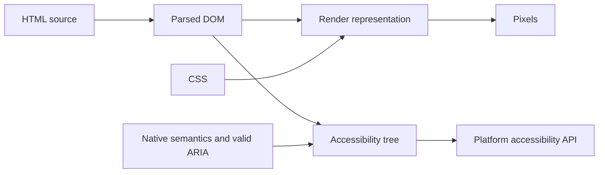

<TLDR>
  <TLDRCell label="what">
    <Term id="semantic-html">语义化 HTML（semantic HTML）</Term>是按元素的既定用途组织内容，让结构和行为不依赖类名或视觉样式。
  </TLDRCell>
  <TLDRCell label="trap">
    把所有 `<div>` 换成 `<section>`，或在原生元素上堆叠 ARIA，并不会自动改善语义；错误角色还会覆盖正确的原生语义。
  </TLDRCell>
  <TLDRCell label="fix">
    先判断内容和交互的职责，再选择含义最接近的原生元素；用 DOM、可访问性树和键盘操作验证结果。
  </TLDRCell>
</TLDR>

## 是什么，为什么存在

语义化 HTML 使用元素表达内容是什么、各部分怎样关联，以及某个控件能做什么。`<nav>` 表示主要导航，`<article>` 表示可独立复用的内容，`<button>` 表示可触发操作的控件。相反，`<div>` 与 `<span>` 是没有额外含义的通用容器。

语义不是外观。一个 `<h2>` 可以被 CSS 画得比正文更小，它仍是二级标题；一个带有按钮样式的 `<div>` 仍不是按钮。样式类可以说明设计系统中的角色，但浏览器不会因为类名是 `card-title` 或 `primary-nav` 就获得对应的 HTML 契约。

浏览器解析标记后构建<Term id="document-object-model">文档对象模型（Document Object Model，DOM）</Term>。元素名称、嵌套关系和属性随后参与表单提交、键盘交互、页面导航与可访问性 API 映射。语义化标记把这些能力放在同一个声明中，减少脚本重复实现浏览器行为的需要。

辅助技术可以借助标题、控件名称和<Term id="landmark">地标（landmark）</Term>浏览页面。开发者也能从元素名称直接看出结构。不过，语义化元素不是 SEO 排名开关，也不会修复含糊的文案、错误的标题层级或缺失的表单标签。

你会在页面外壳、文章列表、导航、表单、披露控件和搜索结果中使用这些元素。选择元素时应从内容与行为开始，而不是从默认样式或希望出现的 ARIA 角色开始。

## 工作原理

HTML 解析器根据源码生成 DOM。有效的元素关系会成为树中的父子关系；无效嵌套则可能被解析器修正，实际 DOM 因而不同于源码。模板缩进不足以证明结构正确，语义审查必须查看浏览器生成的 DOM。

浏览器把 DOM 与 CSS 转换为视觉呈现，同时把相关节点映射到平台可访问性 API。后一个结果常被称为可访问性树。原生元素、可访问名称、状态和必要的 ARIA 会共同影响这棵树，但视觉位置不负责定义文档含义。

常用结构元素的职责如下。隐式角色描述常见映射，不等于每个同名元素都会成为地标；上下文与可访问名称会改变结果。

| 元素 | 内容职责 | 常见隐式角色或行为 |
| --- | --- | --- |
| `<header>` | 页面或一段内容的介绍信息 | 页面范围内通常映射为 `banner` |
| `<nav>` | 主要导航链接 | `navigation` |
| `<main>` | 当前文档独有的主体内容 | `main` |
| `<article>` | 可独立分发或复用的完整内容 | `article` |
| `<section>` | 有明确主题的通用章节 | 有可访问名称时通常为 `region` |
| `<aside>` | 与周围内容间接相关的补充内容 | `complementary` |
| `<footer>` | 页面或一段内容的页尾信息 | 页面范围内通常映射为 `contentinfo` |

`<header>` 和 `<footer>` 的含义取决于最近的内容范围。页面级 `<header>` 可以是 `banner` 地标，而 `<article>` 内的 `<header>` 只是该文章的介绍部分。不要给每个局部页眉手工补 `role="banner"`，否则页面会出现一批错误的顶级地标。

`<section>` 与 `<article>` 的区别在内容所有权。可以脱离当前页面进入订阅源、搜索结果或另一个聚合页的内容适合 `<article>`；依赖当前文档主题的章节适合 `<section>`。只为布局包一层时，两者都不合适，使用 `<div>` 即可。

选择结构元素时，可以依次判断：

1. 这是整个文档独有的主体吗？使用一个可见的 `<main>`。
2. 这是主要导航，还是可独立复用的内容？分别考虑 `<nav>` 与 `<article>`。
3. 这是有名称、有主题的章节或补充内容吗？考虑 `<section>` 或 `<aside>`。
4. 这一层只服务于布局、样式或脚本挂载吗？保留 `<div>` 或 `<span>`。

标题元素表达层级，而不是字号。`<h1>` 到 `<h6>` 的级别应反映页面中的实际包含关系。浏览器没有实现一种会让每个嵌套 `<section>` 自动重置标题级别的通用大纲算法，因此不能在每个章节中机械地再写一个 `<h1>`。

交互元素还带有行为契约。`<button>` 进入顺序焦点、响应键盘激活、支持 `disabled`，并且在表单中有明确的 `type`；带 `href` 的 `<a>` 支持导航、复制地址和在新标签页打开。用 `<div>` 模拟这些能力需要重写一套容易遗漏边界情况的控件。

可访问名称（<Term id="accessible-name">accessible name</Term>）回答“这个控件或区域叫什么”。名称可以来自元素文字、关联的 `<label>`、`aria-labelledby`，或在合适场景中来自 `aria-label`。名称来源有优先级，随意添加 ARIA 可能遮蔽本来清楚的可见文字。

## 示例

下面四个示例都在浏览器中运行，并把真实控制台输出列在代码之后。它们从页面结构逐步走到自动审计，但检查结果仍需结合内容意图解释。

### 建立页面地标

这个页面先提供跳过链接，再依次声明页眉、主导航、主体、补充内容和页脚。脚本读取浏览器实际生成的 DOM，而不是根据类名猜测结构。

<Depth level="quick">

```html run title="page-landmarks.html"
<!doctype html>
<html lang="en">
  <head>
    <meta charset="utf-8" />
    <title>Weekend market</title>
  </head>
  <body>
    <a href="#content">Skip to content</a>
    <header><a href="/">City guide</a></header>
    <nav aria-label="Primary">
      <a href="/markets">Markets</a>
      <a href="/maps">Maps</a>
    </nav>
    <main id="content">
      <h1>Weekend market</h1>
      <p>Open Saturday from 08:00 to 13:00.</p>
    </main>
    <aside aria-labelledby="travel-title">
      <h2 id="travel-title">Getting there</h2>
      <p>Use the east gate from the tram stop.</p>
    </aside>
    <footer><small>Updated weekly</small></footer>
    <script>
      const names = ['HEADER', 'NAV', 'MAIN', 'ASIDE', 'FOOTER'];
      const regions = [...document.body.children]
        .filter((element) => names.includes(element.tagName))
        .map((element) => element.tagName.toLowerCase());
      console.log(`regions: ${regions.join(' > ')}`);
      console.log(`main heading: ${document.querySelector('main h1').textContent}`);
    </script>
  </body>
</html>
```

```text
regions: header > nav > main > aside > footer
main heading: Weekend market
```

</Depth>

跳过链接的目标是主体本身，因此键盘用户可以绕过重复导航。`aria-label="Primary"` 区分导航地标；`aria-labelledby` 则复用补充区域的可见标题，避免维护两份名称。

源码中只有一个可见 `<main>`，并且它没有嵌套在 `<article>`、`<aside>`、`<header>`、`<footer>` 或 `<nav>` 中。页面可以有其他带 `hidden` 属性的 `<main>`，但同时暴露多个主体会破坏页面导航。

### 表达独立内容与内部章节

每条发布记录可以脱离列表单独阅读，因此外层使用 `<article>`。第一条记录中的“Breaking changes”依赖该记录的上下文，所以它是带标题的 `<section>`。

```html run title="release-notes.html"
<main>
  <h1>Release notes</h1>
  <article>
    <header>
      <h2>Reader 2.4</h2>
      <p>Published <time datetime="2026-09-04">4 September 2026</time></p>
    </header>
    <p>This release adds offline bookmarks.</p>
    <section aria-labelledby="breaking-title">
      <h3 id="breaking-title">Breaking changes</h3>
      <p>The export file now uses UTF-8.</p>
    </section>
    <footer><a href="/reader/2.4">Full release</a></footer>
  </article>
  <article>
    <h2>Reader 2.3</h2>
    <p>This release fixes duplicate highlights.</p>
  </article>
</main>

<script>
  const articles = document.querySelectorAll('article');
  const sections = articles[0].querySelectorAll(':scope > section');
  const published = document.querySelector('time').dateTime;
  console.log(`articles: ${articles.length}`);
  console.log(`first article sections: ${sections.length}`);
  console.log(`machine date: ${published}`);
</script>
```

```text
articles: 2
first article sections: 1
machine date: 2026-09-04
```

文章内的 `<header>` 和 `<footer>` 描述最近的 `<article>`，不是整页。`<time datetime>` 同时保留可读日期与机器可读值；它不会验证日期是否符合业务规则。

标题级别也反映嵌套：页面标题是 `<h1>`，每篇记录是 `<h2>`，记录内部章节是 `<h3>`。把内部标题改成另一个 `<h1>` 不会由 `<section>` 自动修正。

### 使用原生交互行为

表单操作使用 `<button>`，补充信息使用 `<details>` 与 `<summary>`。脚本触发按钮并切换披露控件，输出来自浏览器提供的原生属性与事件。

```html run title="native-controls.html"
<form id="editor">
  <label for="title">Title</label>
  <input id="title" name="title" value="Semantic HTML" />
  <button type="submit">Save article</button>
</form>

<details id="help">
  <summary>Formatting help</summary>
  <p>Use a short, descriptive heading.</p>
</details>

<div class="status">Not saved</div>

<script>
  const form = document.querySelector('#editor');
  const button = form.querySelector('button');
  const status = document.querySelector('.status');
  const help = document.querySelector('#help');

  form.addEventListener('submit', (event) => {
    event.preventDefault();
    console.log(`submitted by: ${event.submitter.textContent}`);
  });

  console.log(`tab index: button=${button.tabIndex}, status=${status.tabIndex}`);
  button.click();
  help.open = true;
  console.log(`details open: ${help.open}`);
</script>
```

```text
tab index: button=0, status=-1
submitted by: Save article
details open: true
```

按钮默认进入焦点顺序，普通状态容器不会。`type="submit"` 明确了按钮与表单的关系；组件库中的通用按钮若省略 `type`，放进表单后可能意外提交。

`<details>` 已提供展开状态和键盘操作，不需要先生成一个 `<div role="button">` 再同步 `aria-expanded`。自定义样式仍然可以作用于原生元素，但要保留可见焦点与状态差异。

### 审查生成的标记

这段小型审计器检查四种常见的生成代码问题。它操作故意有缺陷的 DOM，并给出稳定输出，适合作为代码审查后的快速回归检查。

```html run title="semantic-audit.html"
<nav><a href="/">Home</a></nav>
<nav><a href="/account">Account</a></nav>
<main>
  <section><div class="heading">News</div></section>
  <div onclick="saveDraft()">Save draft</div>
</main>
<main>Duplicate content</main>

<script>
  function saveDraft() {}

  const findings = [];
  const visibleMains = [...document.querySelectorAll('main')]
    .filter((element) => !element.hidden);
  if (visibleMains.length !== 1) {
    findings.push(`${visibleMains.length} visible main elements`);
  }

  const navigations = [...document.querySelectorAll('nav')];
  const unnamed = navigations.filter((element) =>
    !element.hasAttribute('aria-label') &&
    !element.hasAttribute('aria-labelledby'));
  if (navigations.length > 1 && unnamed.length > 0) {
    findings.push(`${unnamed.length} unnamed navigation regions`);
  }

  for (const section of document.querySelectorAll('section')) {
    if (!section.querySelector('h1, h2, h3, h4, h5, h6')) {
      findings.push('section missing a heading');
    }
  }

  if (document.querySelector('div[onclick]')) {
    findings.push('div handles click without native control semantics');
  }
  console.log(findings.join('\n'));
</script>
```

```text
2 visible main elements
2 unnamed navigation regions
section missing a heading
div handles click without native control semantics
```

审计规则只能发现候选问题。例如，多个导航需要不同名称，但只有产品上下文能决定名称该是什么；某些没有标题的 `<section>` 实际上应该改成 `<div>`，而不是补一个隐藏标题。

自动检查之后还要查看浏览器的可访问性树，并只用键盘完成主要任务。脚本能证明 DOM 形状，不能代替对名称、角色、状态和操作结果的检查。

## 陷阱

> [!PITFALL]
> 把带点击事件的 `<div>` 写成按钮，只实现了鼠标路径。它默认没有按钮角色、顺序焦点、Enter 与 Space 激活、禁用状态或表单行为。

**修复方法：** 操作使用 `<button type="button">` 或明确的提交按钮，导航使用带 `href` 的 `<a>`。只有在平台没有合适原生元素时才创建自定义控件，并完整实现相应的 ARIA 模式与键盘交互。

> [!PITFALL]
> 把每个布局容器都改成 `<section>` 或 `<article>`，会制造没有主题、没有标题的伪章节。标签更多不等于语义更强。

**修复方法：** `<section>` 需要可说明的主题，通常还有可见标题；`<article>` 需要独立性。只负责网格、间距、脚本挂载或样式隔离的层继续使用 `<div>`。

> [!PITFALL]
> 在原生元素上重复或冲突地声明 ARIA 可能删除其能力。例如，给 `<button>` 写不兼容的角色，或给文章内每个 `<header>` 写 `role="banner"`，都会误导辅助技术。

**修复方法：** 先使用原生元素及其允许的属性，再添加确有缺口的名称、状态或关系。对照 ARIA in HTML 的允许规则，并在可访问性树中确认最终名称与角色。

> [!PITFALL]
> 依赖已经废弃的 HTML 大纲算法，会让每个嵌套章节都从 `<h1>` 开始。主流浏览器不会根据 `<section>` 深度自动推导可用的标题层级。

**修复方法：** 按实际文档层级选择 `<h1>` 到 `<h6>`，不要按字号选。组件无法提前知道嵌套深度时，让调用方传入标题元素或级别，并在组合后的页面上审查标题列表。

> [!PITFALL]
> 把语义化元素描述为 SEO 排名捷径，会把可验证的结构收益变成无法保证的搜索结果。结构化数据、页面质量与 HTML 语义也不是同一个机制。

**修复方法：** 用语义元素准确描述内容，并单独实现经过验证的结构化数据。通过抓取结果、索引工具和实际搜索表现检查 SEO，不要声称某个标签本身会提高排名。

<Depth level="deep">

## DOM、渲染树与可访问性树

源码不是浏览器最终使用的树。解析器会补全某些省略元素，重新排列某些无效嵌套，并生成 DOM 节点。开发者工具的 Elements 面板显示的是解析结果，因此它比模板缩进更适合确认父子关系。

DOM 还不是像素。CSS 与布局系统读取 DOM，形成用于呈现的内部结构；伪元素、视觉重排与隐藏规则会影响显示，但不会自动改变源码中的内容关系。CSS Grid 或 Flexbox 的视觉顺序也不会重写 DOM 顺序。

可访问性树是另一种派生结果。浏览器从原生语义、文本、标签、状态与 ARIA 中计算平台对象，辅助技术再读取这些对象。具体树形结构属于浏览器与平台实现细节，审查重点应是最终名称、角色、状态与关系，而不是要求不同浏览器显示完全相同的内部节点。



这三条路径解释了为什么截图不能证明语义正确。一个自绘 `<div>` 可能看起来像按钮，却没有相应的可访问性对象；一个视觉上移到顶部的页脚，DOM 与标题顺序仍可能留在末尾。

隐藏内容需要逐项判断。`hidden` 或 `display: none` 通常同时移除视觉呈现和可访问性暴露；视觉隐藏工具类则可能有意保留可访问名称。把内容移出屏幕、设为透明或覆盖在别处并没有统一语义，必须在目标浏览器中检查。

## 没有自动大纲的标题

旧资料曾描述一种 HTML 文档大纲算法：每个 `<section>` 或 `<article>` 都可以从 `<h1>` 开始，由嵌套关系推导最终层级。浏览器与辅助技术没有以可互操作方式实现该模型，HTML Living Standard 也已移除相关依赖。生产页面必须直接提供有意义的标题级别。

标题层级是内容关系，不要求页面只能出现一个 `<h1>`，也不要求永远逐级增加。新子主题通常比父主题低一级；结束子主题后回到同级章节属于正常回退。真正的问题是级别没有表达关系，例如从页面标题直接跳到一个仅因样式需要而选择的 `<h4>`。

可复用组件会让层级选择变难。卡片组件不应因为设计稿字号固定就硬编码一个适用于所有页面的标题级别。可以让调用方传入标题标签，或让组件只渲染内容，由拥有页面结构的父级提供标题。

审查时先列出页面标题，暂时忽略 CSS。只读标题文本与级别，应当仍能理解页面的大致结构。随后检查每个 `<section>` 是否真的有主题，以及它的名称是否需要成为 `region` 地标；地标过多同样会增加导航噪声。

## 元素契约优先

元素选择可以看成一组契约，而不是标签替换表。内容契约说明信息是什么，交互契约说明用户怎样操作，平台契约说明浏览器原生提供哪些状态和事件。最合适的元素通常同时满足这三项中的大部分。

文本级语义也遵循这个规则。`<strong>` 表示重要性，`<em>` 表示重读，`<mark>` 表示当前语境中的相关标记，`<code>` 表示代码片段；只想加粗、倾斜或背景色时应由 CSS 负责。`<figure>` 适合可作为一个整体引用的内容，`<figcaption>` 是该整体的说明，并非每张图片都必须包进 `<figure>`。

机器可读属性不会自动保证业务正确。`<time datetime="2026-09-04">` 能暴露标准化字符串，但不会确认活动日期；`<data value="SKU-42">` 能把显示文字关联到机器值，但不会验证库存标识。语义层负责表达，应用与服务器仍负责约束。

ARIA 只补充缺失的可访问性语义，不增加原生行为。`role="button"` 不会让 Space 触发点击，也不会提供 `disabled`、表单提交或高对比模式下的默认样式。遇到自定义控件，先再次确认原生 `<button>`、`<input>`、`<select>`、`<details>` 或 `<dialog>` 是否已经符合任务。

## 分层验证语义

语义审查需要多种证据，因为每种工具只覆盖一层：

1. 使用 HTML 验证器和源码检查发现不允许的属性、重复 ID 与无效嵌套。
2. 在 Elements 面板检查解析后的 DOM、元素顺序、标题与关联属性。
3. 在 Accessibility 面板检查最终名称、角色、状态和地标，并用屏幕阅读器抽查关键路径。
4. 用键盘完成真实任务，验证焦点顺序、激活键、跳过链接、错误恢复与返回导航。

自动化测试应优先按角色与可访问名称定位控件，因为这种查询接近用户获得的接口。测试仍不能证明文案清楚、地标数量合适或标题主题准确。把失败规则写进 lint，把内容判断留在审查清单，两者配合比单独追求一个“可访问性分数”可靠。

组件测试与整页测试关注不同故障。组件测试能确认按钮类型、名称来源和状态切换；整页测试才能发现重复 `<main>`、标题级别冲突、同名导航和视觉顺序偏离 DOM 顺序。生成代码进入页面组合后，应至少再跑一次整页检查。

</Depth>

<Checkpoint id="frontend/html-semantic-tags" />

## 延伸阅读

- [HTML Living Standard：章节与结构](https://html.spec.whatwg.org/multipage/sections.html)
- [W3C：ARIA in HTML](https://www.w3.org/TR/html-aria/)
- [WAI-ARIA APG：地标区域](https://www.w3.org/WAI/ARIA/apg/practices/landmark-regions/)
- [MDN：HTML 元素参考](https://developer.mozilla.org/en-US/docs/Web/HTML/Reference/Elements)
