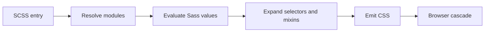

<TLDR>
  <TLDRCell label="what">
    Sass is a <Term id="css-preprocessor">CSS preprocessor</Term>: it turns SCSS or indented syntax into CSS that browsers can read during a build.
  </TLDRCell>
  <TLDRCell label="when">
    Sass fits styles that need explicit module boundaries, parameterized reuse, or a finite set of CSS rules generated from maps. Keep runtime theme values in CSS custom properties.
  </TLDRCell>
  <TLDRCell label="how">
    For new code, use SCSS, `@use`, `@forward`, and built-in modules. Compile real entry points and review the emitted selectors and declarations, not only the source files.
  </TLDRCell>
</TLDR>

## What it is and why it exists

Sass is a styling language that runs during a build. You write `.scss` or `.sass` files; Dart Sass resolves modules, evaluates values, expands selectors, and emits ordinary CSS. A browser neither executes Sass nor sees `$variable`, `@mixin`, or `@use`.

SCSS is the more common syntax today. It uses CSS braces and semicolons, so valid CSS can generally go into an SCSS file before you add Sass features. The indented syntax uses the `.sass` extension and replaces braces and semicolons with indentation. A project should make its chosen format explicit.

Sass deals with build-time reuse and organization. It can hold design values in maps, accept parameters through a <Term id="mixin">mixin</Term>, generate a finite set of rules in a compile-time loop, and use <Term id="sass-module">Sass modules</Term> to show where names come from. Its output is still governed by the ordinary <Term id="css-cascade">CSS cascade</Term>, inheritance, and browser support.

Native CSS now has custom properties, nesting, color functions, and more calculation features, so every project doesn't need Sass. If the problem is switching theme values in the browser, a <Term id="css-custom-property">CSS custom property</Term> is usually more direct. Sass still has a clear role when you publish a configurable styling API, share parameterized patterns, or generate fixed rules from structured data.

You will meet Sass in component libraries, established design systems, and build-tool styling pipelines. Evaluate code at two levels: whether the SCSS states a clear module contract, and whether the compiled CSS has the expected selectors, order, and size.

## How it works

The Sass compiler starts at one or more entry files. It resolves modules referenced by `@use` and `@forward`, evaluates variables, functions, conditions, and loops, then expands nested rules and mixins into CSS. By default, each module loads once per compilation.

None of this creates a browser runtime. Sass variables disappear after compilation, conditional branches retain only the selected output, and loops become concrete rules. To react to attributes, the cascade, or JavaScript in the page, emit CSS custom properties, classes, or attribute selectors instead of expecting Sass variables to remain available.



You can read a compilation in this order:

1. Read top-level variables, `@use`, and `@forward` from an entry file.
2. Resolve module URLs and load each module under its namespace.
3. Evaluate Sass values and run functions, mixins, and control directives.
4. Expand nested selectors and merge or copy reused declarations.
5. Emit CSS in evaluated order for later tools and the browser.

### Two source syntaxes

SCSS uses the `.scss` extension, resembles CSS, and is the format used in the examples below. The indented syntax uses `.sass`. It isn't an old compiler; it is another representation of the same language. The file extension tells the parser which syntax to apply.

Don't use "Sass" only as the name of the indented syntax. Sass is also the name of the language and toolchain, while SCSS is one syntax. Team documentation can say "the project compiles SCSS with Dart Sass" to keep the three names distinct.

### Compile-time values

Sass values include numbers, strings, colors, lists, maps, booleans, and `null`. Numbers may carry units, and the compiler checks whether some unit operations make sense. Maps work well for a finite group of tokens or configuration. Built-in modules such as `sass:map` and `sass:math` make the source of each operation visible.

Variables begin with `$` and name bindings used during Sass evaluation. `!default` lets a module consumer override a public variable when the module is first loaded with `@use`. It is module configuration, not an imitation of the browser cascade, and it doesn't make the value mutable after page load.

| Requirement | Sass value | CSS custom property |
| --- | --- | --- |
| Generate finite rules at build time | Fits | Doesn't run loops |
| Change at runtime by DOM or theme | Frozen after compilation | Fits |
| Calculate inside media declarations | Can emit a result | Browser can resolve it |
| Update from JavaScript | Not directly updateable | Update through style APIs |

### Nesting and the parent selector

Nesting combines an inner selector with its outer selector. `&` stands for the current outer selector and can form pseudo-classes, pseudo-elements, or suffixes that follow a naming convention. It is source shorthand; no component hierarchy remains in the CSS.

Deeper nesting creates longer selectors and can raise specificity or structural coupling. The reliable review is to inspect the output, rather than enforce one depth limit across every codebase. If a component class is already clear on its own, keep it as a top-level rule.

### Functions, mixins, and extension

A function returns one Sass value through `@return`. It fits unit conversion, map lookup, and validated calculations. A mixin emits declarations or rules through `@include` and can accept a content block through `@content`. Both support positional, named, and default arguments.

`@extend` uses a different mechanism: it rewrites selector relationships so one selector matches styles for another. A placeholder selector such as `%name` emits nothing until extended. Extension can avoid repeated declarations, but its effect across modules or complex selectors can be hard to infer at the call site, so inspect the emitted selector list.

| Tool | Output | Suitable contract |
| --- | --- | --- |
| `@function` | One Sass value | A validated calculation or lookup |
| `@mixin` | Declarations and rules | A parameterized style pattern |
| `@extend` | Merged selectors | A clear "is also a" selector relationship |

### Module boundaries

`@use` loads a module and creates a namespace from its filename by default. Access the module's variables, functions, and mixins through that namespace, which makes their origin visible. Members whose names start with `_` or `-` are private implementation details and aren't available outside the module.

`@forward` exposes another module's public members to consumers and often creates one stable library entry point. It doesn't automatically put those members in the forwarding file's own scope; that file needs `@use` if it also consumes them. A library can narrow its public surface with `show`, `hide`, or prefixes.

`@use ... with (...)` configures variables marked `!default` only on the first load. Later code in the same compilation can't reload that module under a second configuration. For two themes, generate CSS custom properties or compile separate entries instead of trying to instantiate one Sass module twice.

## Examples

All four examples below were compiled with Dart Sass 1.104.0 from `/tmp/codewiki-run/sass/`. The transcripts use the default expanded format with source maps disabled, which keeps them easy to compare line by line.

### Variables, arithmetic, and nesting

The first entry uses two compile-time variables to produce card rules. `&__title` appends a component suffix, while `&:focus-within` attaches a pseudo-class to `.card`.

<Depth level="quick">

```scss title="basics.scss"
$accent: #6750a4;
$space: 0.5rem;

.card {
  padding: $space * 3;
  border: 1px solid $accent;

  &__title {
    color: $accent;
  }

  &:focus-within {
    outline: 2px solid $accent;
    outline-offset: 2px;
  }
}
```

```text
.card {
  padding: 1.5rem;
  border: 1px solid #6750a4;
}
.card__title {
  color: #6750a4;
}
.card:focus-within {
  outline: 2px solid #6750a4;
  outline-offset: 2px;
}
```

</Depth>

The output contains neither `$accent` nor `$space`. Each nested block becomes a separate CSS rule, which shows that source indentation doesn't provide component encapsulation in the browser.

### Validated functions and mixins

This entry uses `sass:math` for intentional division and `sass:map` for breakpoint lookup. The function rejects input without a `px` unit, while the mixin rejects unknown names, so callers see mistakes during the build.

```scss title="responsive.scss"
@use "sass:map";
@use "sass:math";

$breakpoints: (
  compact: 36rem,
  wide: 64rem,
);

@function rem($pixels) {
  @if math.unit($pixels) != "px" {
    @error "rem() expects a px value";
  }

  @return math.div($pixels, 16px) * 1rem;
}

@mixin from($name) {
  $width: map.get($breakpoints, $name);

  @if $width == null {
    @error "Unknown breakpoint: #{$name}";
  }

  @media (min-width: $width) {
    @content;
  }
}

.product-grid {
  display: grid;
  gap: rem(12px);

  @include from(wide) {
    grid-template-columns: repeat(3, minmax(0, 1fr));
  }
}
```

```text
.product-grid {
  display: grid;
  gap: 0.75rem;
}
@media (min-width: 64rem) {
  .product-grid {
    grid-template-columns: repeat(3, minmax(0, 1fr));
  }
}
```

The declarations in `@content` land inside the emitted media query. `rem(12px)` has become `0.75rem`; the browser won't run that function again.

### Configuring local modules

The module example has two local modules and one entry point. `_tokens.scss` declares configurable values and a mixin. Its leading underscore marks it as a partial by convention, while consumers still refer to it as `"tokens"`.

```scss title="_tokens.scss"
$brand: #0f766e !default;
$radius: 0.375rem !default;
$focus-width: 3px !default;

@mixin focus-ring {
  outline: $focus-width solid $brand;
  outline-offset: 2px;
}
```

`_button.scss` exposes one mixin. It reads members through the `tokens` namespace instead of relying on global injection.

```scss title="_button.scss"
@use "tokens";

@mixin base {
  padding: 0.5rem 0.875rem;
  border: 0;
  border-radius: tokens.$radius;
  background: tokens.$brand;
  color: white;

  &:focus-visible {
    @include tokens.focus-ring;
  }
}
```

The entry configures `tokens` before loading `button`, which depends on it indirectly. This order ensures that `button` receives the same configured module.

```scss title="main.scss"
@use "tokens" with (
  $brand: #7c3aed,
  $radius: 0.75rem,
);
@use "button";

.button {
  @include button.base;
}
```

```text
.button {
  padding: 0.5rem 0.875rem;
  border: 0;
  border-radius: 0.75rem;
  background: #7c3aed;
  color: white;
}
.button:focus-visible {
  outline: 3px solid #7c3aed;
  outline-offset: 2px;
}
```

Configuration changes the brand color and radius without modifying either module file. `$focus-width` keeps its default, so the output still uses `3px`.

### Generating runtime theme tokens

The final entry enumerates themes from a Sass map but emits CSS custom properties. Enumeration happens during the build; the browser chooses a theme at runtime from the `data-theme` attribute.

```scss title="themes.scss"
@use "sass:meta";

$themes: (
  light: (
    surface: #ffffff,
    text: #1f2937,
  ),
  dark: (
    surface: #111827,
    text: #f9fafb,
  ),
);

@each $name, $tokens in $themes {
  [data-theme="#{$name}"] {
    @each $token, $value in $tokens {
      --#{$token}: #{meta.inspect($value)};
    }
  }
}

.panel {
  background: var(--surface);
  color: var(--text);
}
```

```text
[data-theme=light] {
  --surface: #ffffff;
  --text: #1f2937;
}

[data-theme=dark] {
  --surface: #111827;
  --text: #f9fafb;
}

.panel {
  background: var(--surface);
  color: var(--text);
}
```

Interpolation writes each Sass value into a custom-property value. `.panel` retains `var()`, so changing the theme attribute in the DOM doesn't require another Sass compilation.

## Pitfalls

### Keeping `@import` and global built-in functions

> [!PITFALL]
> Older tutorials often use `@import`, `map-get()`, `darken()`, and other global names. Dart Sass has deprecated `@import` and global built-in functions, which also place members in a hard-to-trace global namespace.

**Fix:** establish module boundaries with `@use` and `@forward`, and call namespaced APIs such as `map.get()` and `color.adjust()`. During migration, run the compiler and address each deprecation warning rather than applying a blind text replacement.

### Treating a Sass variable as runtime state

> [!PITFALL]
> `$brand` is a concrete value after compilation. JavaScript can't change it in an already loaded page, and a DOM ancestor can't override it through the cascade.

**Fix:** keep build-time structure in Sass and emit CSS custom properties for values that need inheritance, theme switching, or script updates. Review the final CSS and confirm that dynamic positions still contain `var(--name)`.

### Mirroring the DOM with nesting

> [!PITFALL]
> Generated code often nests `.page .sidebar .card .title` to match a template. The output selector now depends on those containers and has higher specificity, so moving the component can break it.

**Fix:** make components or responsibilities the rule boundary, nesting only pseudo-classes, states, and meaningful parent context. Search compiled output for long selectors after each change, and render the component in a second container.

### Expanding mixins and loops without limits

> [!PITFALL]
> A mixin emits content at every call site, and a loop emits rules for every iteration. A short source file can therefore grow into repeated declarations and unused utility classes.

**Fix:** limit the names that may generate output and emit only variants the product uses. Put shared declarations in one base rule, keep mixins focused on real variation, and compare rule counts and artifact size in build output.

### Accepting invalid configuration implicitly

> [!PITFALL]
> `map.get()` returns `null` for a missing key. Passing that result into a color or number function can cause a remote, cryptic build error; some declarations disappear when their value is `null`.

**Fix:** validate allowed keys, units, and ranges at public function and mixin boundaries, then raise a domain-specific `@error`. Test at least one valid value, an unknown key, and a wrong unit.

## In the AI era

**What generated code gets wrong here**

Models often copy `@import`, slash division, and unnamespaced `map-get()` from old training material even when a project uses modules. They also mirror every HTML layer in nested selectors, duplicate whole mixins for each color, or compile all theme values to static colors and break runtime switching. Another real failure is placing `@use ... with` after a style rule or trying to configure a module after an indirect dependency has already loaded it; both fail during the build.

**Ask your AI to check**

- Compile the real entries and list every deprecation warning, the generated rule count, and the five longest selectors.
- Trace the first-load path for every `@use` and state where each `!default` variable is configured.
- Classify each `$name` and `--name` as a build-time or runtime value, then verify computed styles after a theme switch.

**Review checklist**

- Compile every entry from a clean environment with the project's locked Dart Sass version, not just a detached snippet.
- Inspect emitted CSS for selector shape, media-query order, repeated declarations, and each `var()` that must survive.
- Test public functions and mixins with unknown map keys, wrong units, empty lists, and boundary values.

**Prompt vocabulary**

Use the exact terms `SCSS syntax`, `Sass module system`, `module namespace`, `configurable !default variable`, `parent selector`, `selector expansion`, `compile-time value`, and `CSS custom property`. Ask for the source SCSS, compile command, and emitted CSS together; "refactor the styles" doesn't constrain module boundaries or runtime behavior.

<Depth level="deep">

## Compile-time and browser-time values

Sass values live only during compiler evaluation. Variables can hold maps, functions can validate units, and loops can decide how many rules to emit, but none of those structures reaches the browser. The resulting CSS is the input to the browser's style system.

CSS custom properties are CSS declarations that participate in the cascade and inheritance. Their values can vary by selector, media condition, and element relationship, and JavaScript can update them through style APIs. The browser resolves `var()` when needed, so custom properties express runtime relationships that Sass variables can't.

The two systems work together when the boundary stays explicit. A Sass map can hold a known theme set and generate groups of custom-property declarations; components should keep `var()` when they consume those properties. Inserting map values directly into component color declarations removes that runtime override point.

To Sass, a custom-property value often behaves like opaque CSS text. When you must write a Sass value into one, interpolate deliberately and inspect the output for preserved spaces, quotes, and functions. Don't assume a Sass color object, unit-bearing number, and arbitrary string retain identical meaning after interpolation.

## Module loading and configuration order

A module URL identifies a module instance within one compilation. The first `@use` loads and evaluates it; other `@use` rules receive the same instance and public members. This avoids the repeated CSS output common with older imports.

Configuration must happen on that first load. If `button` loads `"tokens"` and an entry later writes `@use "tokens" with (...)`, the compiler rejects the attempted reconfiguration. Configure a low-level module before loading its dependents, or provide one clear configuration entry from the library.

`@forward` is useful for designing a library's public surface. An index file can forward colors, typography, and mixins while hiding internal helpers or adding prefixes. Consumers depend on that one entry, so moving internal files doesn't require edits at every call site.

The namespace wildcard form `as *` puts public members in the current scope. It can be convenient in a small controlled entry, but several wildcard modules lose origin information and create collisions. Keep short, explicit namespaces by default and consider wildcards only for a tightly controlled public API.

## Selector expansion and artifact size

Sass nesting combines a parent selector into concrete output selectors. An inner comma-separated list can combine with an outer list, while a loop may repeat that entire structure. Source line count is therefore a poor measure of artifact complexity.

Mixins copy emitted content. Calling a mixin with layout, typography, and state rules for ten variants produces ten corresponding sets of declarations. When only color changes, move fixed declarations into a base class and let each variant set a custom property or a few declarations.

Extension doesn't simply copy declarations; it unifies selector matching relationships. A complex extension can produce combinations that aren't written at the call site, especially when the extended selector includes context. Placeholder selectors prevent an unused base class from being emitted, but they don't remove combination complexity.

Inspect artifacts from real entry points. Tracking expanded and compressed file sizes can reveal trends, but it doesn't establish runtime cost; selector matching, unused CSS, and caching need their own tools and data. Without measurements, describe generated structure instead of claiming that one form is faster.

## Numbers, units, and CSS calculations

A Sass number retains numeric and unit information. Compatible units can take part in some operations, while the compiler rejects calculations that have no clear meaning across incompatible units. Public functions should check input units before returning the unit their callers expect.

A slash has separator meanings in modern CSS, so Sass no longer treats every `/` as division. Use `math.div()` when Sass should calculate a quotient, and retain `calc()` when the browser should calculate. The two forms state build-time and runtime intent respectively.

CSS math functions can mix Sass-known values with browser-context values. Sass may replace a fixed spacing value while a percentage or viewport unit remains for the browser. Check that compilation hasn't folded an expression which still needs layout context.

Color operations should likewise use namespaced functions from `sass:color` and state the intended channel and color space. Mechanically lightening or darkening a color by a fixed amount doesn't prove text contrast. Test accessibility against the final foreground and background pair.

## Migration and the build boundary

When migrating older Sass, lock the compiler version and collect the complete warning set first. `@import`, global built-in functions, and slash division may appear together. Recompile every entry after each mechanical migration so warnings in indirect modules aren't missed.

A build tool hands files to Sass and processes emitted CSS. Load paths, injected source, and implementation options affect module resolution, so a command-line compilation of one file doesn't prove that the application build works. Final verification must use the project's own production build configuration.

Don't use global injection to rebuild the old global namespace. Automatically prepending variables and mixins to every file hides dependencies and can make a member come from different paths in test and production. An explicit `@use` costs a line and keeps the dependency in the source.

After an upgrade, preserve deprecation warnings as build signals. Handle new warnings in the change that introduced them instead of letting them accumulate in logs. For a Sass library published to other projects, also test public module URLs, configurable variables, and emitted CSS from a minimal consumer entry.

</Depth>

<Checkpoint id="frontend/sass" />

## Further reading

- [Sass `@use` documentation](https://sass-lang.com/documentation/at-rules/use/)
- [Sass `@forward` documentation](https://sass-lang.com/documentation/at-rules/forward/)
- [Sass mixin documentation](https://sass-lang.com/documentation/at-rules/mixin/)
- [Sass `@import` deprecation](https://sass-lang.com/documentation/breaking-changes/import/)
- [Sass numeric operators](https://sass-lang.com/documentation/operators/numeric/)
- [Sass parent selector](https://sass-lang.com/documentation/style-rules/parent-selector/)
