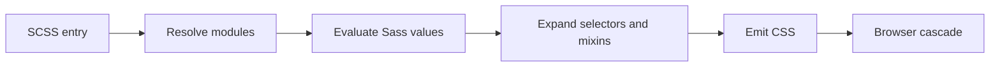

<TLDR>
  <TLDRCell label="what">
    Sass是一种<Term id="css-preprocessor">CSS预处理器（CSS preprocessor）</Term>；它在构建时把SCSS或缩进语法转换为浏览器可读取的CSS。
  </TLDRCell>
  <TLDRCell label="when">
    当样式代码需要显式模块边界、带参数的复用规则或基于映射生成有限的CSS时，Sass很合适；运行时主题值仍应交给CSS自定义属性。
  </TLDRCell>
  <TLDRCell label="how">
    新代码使用SCSS、`@use`、`@forward`和内置模块；编译实际入口文件，并审查生成的选择器与声明，而不只检查源文件。
  </TLDRCell>
</TLDR>

## 是什么，为什么存在

Sass是一种在构建阶段运行的样式语言。你编写`.scss`或`.sass`文件，Dart Sass解析模块、计算值、展开选择器，再输出普通CSS。浏览器不会执行Sass，也看不到`$variable`、`@mixin`或`@use`。

SCSS是目前更常见的语法，它使用CSS的花括号和分号。有效CSS基本可以直接放进SCSS文件，再逐步加入Sass功能。缩进语法使用`.sass`扩展名，语义相同，但用缩进代替花括号和分号；同一项目应明确选择一种格式。

Sass解决的是构建期复用与组织问题。它可以把设计值保存在映射中，通过<Term id="mixin">混入（mixin）</Term>接收参数，在编译期循环生成一组确定的规则，并用<Term id="sass-module">Sass模块（Sass module）</Term>控制名称来源。输出仍受普通<Term id="css-cascade">CSS层叠（CSS cascade）</Term>、继承和浏览器支持约束。

原生CSS已有自定义属性、嵌套、颜色函数和越来越多的计算能力，因此不是每个项目都需要Sass。若问题只是在浏览器中切换主题值，<Term id="css-custom-property">CSS自定义属性（CSS custom property）</Term>通常更直接。若你需要发布一套可配置的样式API、共享带参数的模式，或从结构化数据生成固定规则，Sass仍有清楚的用途。

你会在组件库、已有设计系统和构建工具的样式管线中遇到Sass。判断一段代码时要同时看两个层面：SCSS是否表达了清楚的模块契约，以及编译后的CSS是否具有预期的选择器、顺序和体积。

## 工作原理

Sass编译器从一个或多个入口文件开始。它解析`@use`和`@forward`指向的模块，求值变量、函数、条件和循环，随后把嵌套规则与混入展开成CSS。默认情况下，每个模块在一次编译中只加载一次。

这一过程没有浏览器运行时。Sass变量在编译后消失，条件分支只保留被选中的结果，循环变成一组实际规则。要在页面运行时响应属性、层叠或JavaScript，应输出CSS自定义属性、类或属性选择器，而不是期待Sass变量继续存在。



一次编译可以按下面的顺序理解：

1. 从入口文件读取顶层变量、`@use`与`@forward`。
2. 定位模块URL，并以各自命名空间加载模块。
3. 计算Sass值，执行函数、混入与控制指令。
4. 展开嵌套选择器，合并或复制复用的声明。
5. 按求值后的顺序输出CSS，交给后续工具和浏览器。

### 两种源文件语法

SCSS使用`.scss`扩展名，外形接近CSS，也是下面示例采用的格式。缩进语法使用`.sass`扩展名；它不是旧编译器，而是同一语言的另一种表示。文件扩展名决定解析器采用哪种语法。

不要把“Sass”只当作缩进语法的名称。Sass也是语言与工具链的总称，SCSS是其中一种语法。团队文档可以写清“项目使用Dart Sass编译SCSS”，避免三个名称混用。

### 编译期值

Sass值包括数字、字符串、颜色、列表、映射、布尔值和`null`。数字可以带单位，编译器会检查部分单位运算是否合理；映射适合存放一组可枚举的令牌或配置。使用`sass:map`、`sass:math`等内置模块时，调用来源在代码中很明确。

变量以`$`开头，表示Sass求值期间的绑定。`!default`允许模块使用方在首次`@use`时覆盖公开变量。它适合模块配置，不适合模拟浏览器层叠，也不会让值在页面加载后可变。

| 需求 | Sass值 | CSS自定义属性 |
| --- | --- | --- |
| 构建时生成有限规则 | 适合 | 不执行循环 |
| 运行时按DOM或主题改变 | 编译后不可变 | 适合 |
| 在媒体查询声明内计算 | 可生成结果 | 可由浏览器解析 |
| 被JavaScript更新 | 不可直接更新 | 可通过样式API更新 |

### 嵌套与父选择器

嵌套会把内层选择器和外层选择器组合起来。`&`表示当前外层选择器，可以形成伪类、伪元素或符合命名约定的后缀。它是源代码缩写，不会在CSS中留下层级关系。

嵌套越深，生成选择器越长，特异性与结构耦合也可能越高。最可靠的审查方式是查看输出，而不是规定一个适用于所有代码库的层数上限。若组件类本身已经足够明确，就让它保持顶层规则。

### 函数、混入与扩展

函数通过`@return`产生一个Sass值，适合单位转换、映射查询和经过校验的计算。混入通过`@include`发出声明或规则，还能通过`@content`接收一段内容。两者都可以接收位置参数、命名参数和默认值。

`@extend`的机制不同：它改写选择器关系，让一个选择器匹配另一个选择器的样式。占位选择器`%name`只有被扩展时才输出。扩展可以减少重复声明，但跨模块或复杂选择器中的结果不容易从调用点看出，因此必须检查生成的选择器列表。

| 工具 | 产物 | 适合的契约 |
| --- | --- | --- |
| `@function` | 一个Sass值 | 可校验的计算或查询 |
| `@mixin` | 声明与规则 | 带参数的样式模式 |
| `@extend` | 合并后的选择器 | 明确的“也是一种”选择器关系 |

### 模块边界

`@use`加载模块，并默认以文件名创建命名空间。模块的变量、函数和混入要通过该命名空间访问，这能说明成员来自哪里。以`_`或`-`开头的成员属于私有实现，不应从模块外访问。

`@forward`把另一个模块的公开成员转交给使用方，常用于建立一个稳定入口。它不会把这些成员自动放进转发文件自己的作用域；转发文件若也要使用成员，还需要`@use`。库可以用`show`、`hide`或前缀缩小公开表面。

`@use ... with (...)`只在模块首次加载时配置带`!default`的变量。同一次编译中，后来的代码不能用另一组配置重新加载同一模块。需要两套主题时，通常生成CSS自定义属性或分开编译入口，而不是试图实例化同一Sass模块两次。

## 示例

下面四个示例都由`/tmp/codewiki-run/sass/`中的Dart Sass 1.104.0实际编译。输出使用默认展开格式，并关闭source map，便于逐行对照。

### 变量、算术与嵌套

第一个入口用两个编译期变量生成卡片规则。`&__title`拼接组件后缀，`&:focus-within`则把伪类附加到`.card`。

<Depth level="quick">

```scss title="basics.scss"
$accent: #6750a4;
$space: 0.5rem;

.card {
  padding: $space * 3;
  border: 1px solid $accent;

  &__title {
    color: $accent;
  }

  &:focus-within {
    outline: 2px solid $accent;
    outline-offset: 2px;
  }
}
```

```text
.card {
  padding: 1.5rem;
  border: 1px solid #6750a4;
}
.card__title {
  color: #6750a4;
}
.card:focus-within {
  outline: 2px solid #6750a4;
  outline-offset: 2px;
}
```

</Depth>

输出中已经没有`$accent`和`$space`。两个嵌套块成为独立CSS规则，说明源文件的缩进不代表浏览器中的组件封装。

### 带校验的函数与混入

这个入口通过`sass:math`完成有意的除法，通过`sass:map`查找断点。函数拒绝非`px`输入，混入拒绝未知名称，让调用错误在构建阶段暴露。

```scss title="responsive.scss"
@use "sass:map";
@use "sass:math";

$breakpoints: (
  compact: 36rem,
  wide: 64rem,
);

@function rem($pixels) {
  @if math.unit($pixels) != "px" {
    @error "rem() expects a px value";
  }

  @return math.div($pixels, 16px) * 1rem;
}

@mixin from($name) {
  $width: map.get($breakpoints, $name);

  @if $width == null {
    @error "Unknown breakpoint: #{$name}";
  }

  @media (min-width: $width) {
    @content;
  }
}

.product-grid {
  display: grid;
  gap: rem(12px);

  @include from(wide) {
    grid-template-columns: repeat(3, minmax(0, 1fr));
  }
}
```

```text
.product-grid {
  display: grid;
  gap: 0.75rem;
}
@media (min-width: 64rem) {
  .product-grid {
    grid-template-columns: repeat(3, minmax(0, 1fr));
  }
}
```

`@content`中的声明被放进生成的媒体查询。`rem(12px)`已经求值为`0.75rem`，浏览器不会再次运行该函数。

### 配置本地模块

模块示例有两个局部模块和一个入口。`_tokens.scss`声明可配置值与混入；文件名前导下划线表示它通常作为局部文件使用，而引用时仍写作`"tokens"`。

```scss title="_tokens.scss"
$brand: #0f766e !default;
$radius: 0.375rem !default;
$focus-width: 3px !default;

@mixin focus-ring {
  outline: $focus-width solid $brand;
  outline-offset: 2px;
}
```

`_button.scss`只公开一个混入。它通过`tokens`命名空间读取模块成员，不依赖全局注入。

```scss title="_button.scss"
@use "tokens";

@mixin base {
  padding: 0.5rem 0.875rem;
  border: 0;
  border-radius: tokens.$radius;
  background: tokens.$brand;
  color: white;

  &:focus-visible {
    @include tokens.focus-ring;
  }
}
```

入口先配置`tokens`，再加载间接依赖它的`button`。这个顺序保证`button`看到同一个已配置模块。

```scss title="main.scss"
@use "tokens" with (
  $brand: #7c3aed,
  $radius: 0.75rem,
);
@use "button";

.button {
  @include button.base;
}
```

```text
.button {
  padding: 0.5rem 0.875rem;
  border: 0;
  border-radius: 0.75rem;
  background: #7c3aed;
  color: white;
}
.button:focus-visible {
  outline: 3px solid #7c3aed;
  outline-offset: 2px;
}
```

配置改变了品牌色与圆角，没有修改模块源文件。`$focus-width`保留默认值，因此输出仍是`3px`。

### 生成运行时主题令牌

最后一个入口用Sass映射枚举主题，但输出CSS自定义属性。枚举发生在构建时，主题选择则由浏览器根据`data-theme`在运行时完成。

```scss title="themes.scss"
@use "sass:meta";

$themes: (
  light: (
    surface: #ffffff,
    text: #1f2937,
  ),
  dark: (
    surface: #111827,
    text: #f9fafb,
  ),
);

@each $name, $tokens in $themes {
  [data-theme="#{$name}"] {
    @each $token, $value in $tokens {
      --#{$token}: #{meta.inspect($value)};
    }
  }
}

.panel {
  background: var(--surface);
  color: var(--text);
}
```

```text
[data-theme=light] {
  --surface: #ffffff;
  --text: #1f2937;
}

[data-theme=dark] {
  --surface: #111827;
  --text: #f9fafb;
}

.panel {
  background: var(--surface);
  color: var(--text);
}
```

这里的插值把Sass值写入自定义属性值。`.panel`保留`var()`，所以DOM上的主题属性变化后无需重新编译。

## 陷阱

### 继续使用`@import`和全局内置函数

> [!PITFALL]
> 旧教程常用`@import`、`map-get()`、`darken()`和其他全局名称。Dart Sass已弃用`@import`与全局内置函数；它们还会把成员放进难以追踪的全局命名空间。

**修复方法：** 用`@use`和`@forward`建立模块边界，并改用`map.get()`、`color.adjust()`等命名空间API。迁移时运行编译器，逐项处理弃用警告，不要只做字符串替换。

### 把Sass变量当成运行时变量

> [!PITFALL]
> `$brand`在编译后已经变成具体值。JavaScript无法在已加载页面中修改它，DOM祖先也无法通过层叠覆盖它。

**修复方法：** 把构建期结构留给Sass，把需要继承、主题切换或脚本更新的值输出为CSS自定义属性。审查最终CSS，确认需要动态变化的位置仍包含`var(--name)`。

### 让嵌套复制DOM结构

> [!PITFALL]
> 生成代码容易按照模板层级嵌套`.page .sidebar .card .title`。输出选择器会依赖具体容器并提高特异性，使同一组件换位置后失效。

**修复方法：** 以组件或职责作为规则边界，只在伪类、状态和确有父级语义时嵌套。每次改动后搜索编译结果中的长选择器，并在另一个容器中渲染组件。

### 无条件展开混入与循环

> [!PITFALL]
> 混入会在每个调用点发出内容，循环会为每次迭代生成规则。源文件看起来很短，编译后的重复声明和未使用工具类却可能持续增长。

**修复方法：** 先限定允许生成的名称，只输出产品实际使用的变体。把共同声明放进基础规则，让混入负责真正变化的部分，并在构建产物上比较规则数与体积。

### 隐式接受错误配置

> [!PITFALL]
> `map.get()`找不到键时返回`null`。若代码把结果继续传给颜色或数字函数，构建可能在更远位置报出难懂错误；某些声明还会因`null`被省略。

**修复方法：** 在公共函数和混入入口检查允许的键、单位与范围，并用`@error`给出领域名称。测试至少覆盖一个有效值、一个未知键和一个单位错误。

<Depth level="deep">

## 编译期值与浏览器值

Sass值只活在编译器的求值阶段。变量可以持有映射、函数可以检查单位、循环可以决定输出多少规则，但这些结构不会进入浏览器。最终CSS才是浏览器样式系统的输入。

CSS自定义属性是CSS声明，参与层叠与继承。它的值可以因选择器、媒体条件和元素关系而变化，也可以由JavaScript的样式API修改。浏览器在需要时解析`var()`，因此它能表达Sass变量不能表达的运行时关系。

两者可以配合，但边界要清楚。Sass映射适合保存构建阶段已知的主题集合，并生成一组自定义属性声明；组件消费这些属性时继续写`var()`。如果在组件规则里把映射值直接插入颜色声明，运行时覆盖入口就消失了。

自定义属性的值对Sass来说常像不透明的CSS文本。确实要把Sass值写入自定义属性时，可以显式插值；随后检查输出是否保留需要的空格、引号与函数。不要假设Sass的颜色对象、带单位数字和任意字符串在插值后都有相同语义。

## 模块加载与配置顺序

模块URL标识一次编译中的模块实例。第一个`@use`负责加载和求值；其他`@use`取得同一个实例及其公开成员。这避免了旧式导入反复输出同一模块CSS的常见问题。

配置必须发生在首次加载处。如果`button`先`@use "tokens"`，入口随后再写`@use "tokens" with (...)`，编译器会拒绝重新配置。入口应先配置底层模块，再加载依赖它的模块，或者由库提供一个清楚的配置入口。

`@forward`适合设计库的公开表面。一个索引文件可以转发颜色、排版和混入，同时隐藏内部辅助成员或加前缀。使用方只依赖这个入口，库内部文件移动时就不必修改所有调用点。

命名空间通配形式`as *`会把公开成员带入当前作用域。小型受控入口中可能方便，但多个模块使用它时又会失去来源信息并产生冲突。默认保留短而明确的命名空间，只有在公开API已严格控制时才考虑通配。

## 选择器展开与产物体积

Sass嵌套通过父选择器组合生成实际选择器。一个内层逗号列表会与外层列表形成组合，循环又可能重复整个结构。源代码行数因此不是产物复杂度的可靠指标。

混入复制的是生成内容。十个变体调用一个包含布局、排版与状态规则的混入，会得到十份相关声明。若只有颜色变化，把不变部分移到基础类，再让变体设置自定义属性或少量声明，通常更容易审查。

扩展不会简单复制声明，它会统一选择器可匹配关系。复杂扩展可能产生调用点没有写出的组合选择器，尤其当被扩展选择器带上下文时。占位选择器能避免输出无用基础类，却不能消除组合复杂度。

产物检查应以真实入口为单位。记录压缩前后的文件体积可以发现趋势，但不能说明运行时成本；规则匹配、未使用CSS和缓存还需要各自的工具与数据。没有测量时，只描述生成结构，不声称某种写法更快。

## 数字、单位与CSS计算

Sass数字保存数值与单位信息。兼容单位可以参与部分运算，不兼容单位会让编译器拒绝没有明确意义的计算。公共函数应先检查输入单位，再返回调用方期望的单位。

斜杠在现代CSS中承担分隔语义，Sass不再把所有`/`都当作除法。需要在Sass中计算商时使用`math.div()`，需要让浏览器计算时保留`calc()`。这两个选择分别表达构建期与运行时意图。

CSS数学函数可以混合Sass已知值与浏览器上下文值。例如，Sass能替换固定间距，而百分比或视口单位仍由浏览器求值。检查输出时要确认编译器没有提前折叠本应依赖布局的表达式。

颜色运算也应使用`sass:color`的命名空间函数，并明确操作通道与色彩空间。机械地用固定比例变亮或变暗不能证明文字对比度合格。可访问配色需要在最终前景与背景组合上单独验证。

## 迁移与构建边界

从旧Sass迁移时，先锁定编译器版本并收集完整警告。`@import`、全局内置函数和斜杠除法可能同时出现，批量修改其中一种后应重新编译所有入口。只有入口覆盖完整，间接模块中的警告才不会漏掉。

构建工具只是把文件交给Sass，并处理生成CSS。加载路径、附加源码和实现选项会改变模块如何解析，因此命令行单文件成功不等于应用构建成功。最终验证必须使用项目自己的生产构建配置。

不要用全局注入重新制造旧式全局命名空间。把变量和混入自动附加到每个文件会隐藏依赖，还可能让同一成员在测试与生产中来自不同路径。显式`@use`多写一行，却能把依赖留在源文件中。

升级完成后，把弃用警告当作构建信号保存下来。新警告应在引入它的变更中处理，不能长期淹没在日志里。对于发布给其他项目的Sass库，还要从最小使用方入口测试公开模块URL、配置变量和生成CSS。

</Depth>

<Checkpoint id="frontend/sass" />

## 延伸阅读

- [Sass `@use`文档](https://sass-lang.com/documentation/at-rules/use/)
- [Sass `@forward`文档](https://sass-lang.com/documentation/at-rules/forward/)
- [Sass混入文档](https://sass-lang.com/documentation/at-rules/mixin/)
- [Sass `@import`弃用说明](https://sass-lang.com/documentation/breaking-changes/import/)
- [Sass数字运算符文档](https://sass-lang.com/documentation/operators/numeric/)
- [Sass父选择器文档](https://sass-lang.com/documentation/style-rules/parent-selector/)
