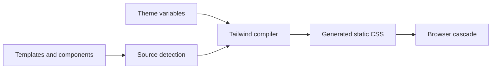

<TLDR>
  <TLDRCell label="what">
    Tailwind CSS scans source files for complete class candidates and generates static CSS for the utilities it recognizes. You compose small styling rules in markup instead of continually inventing semantic classes.
  </TLDRCell>
  <TLDRCell label="when">
    Tailwind fits teams that want to build interfaces directly from a constrained vocabulary of spacing, color, state, and breakpoint utilities. It doesn't replace HTML semantics, the CSS cascade, or accessibility design.
  </TLDRCell>
  <TLDRCell label="how">
    Tailwind CSS 4 uses `@import "tailwindcss"` in the stylesheet entry and usually builds through its Vite plugin or PostCSS integration. Class names must appear as complete text, while design tokens belong in `@theme`.
  </TLDRCell>
</TLDR>

## What it is and why it exists

Tailwind CSS is a <Term id="utility-first-css">utility-first CSS</Term> framework. A <Term id="utility-class">utility class</Term> usually expresses a small declaration set, such as `grid`, `p-6`, or `text-slate-900`; a component's final appearance comes from composing these classes. Tailwind generates ordinary CSS at build time, so no Tailwind styling engine has to run alongside the application in the browser.

Traditional component styling often asks you to invent a name such as `.product-card`, then maintain its declarations in another file. Tailwind places an existing design vocabulary beside the markup that uses it, reducing one-off class names and cross-file lookup. It still relies on CSS inheritance, cascade, and media queries, so utilities aren't a separate layout system outside CSS.

The utility-first approach fits a finite, shared design system: spacing, color, type, radius, and breakpoints come from one token set, and components select permitted combinations. Class-name text repeats, but the generated rule doesn't; the same candidate generally corresponds to one CSS rule. Plain CSS remains the right tool for complex selectors, content-driven styles, and third-party component overrides.

You encounter Tailwind class names in HTML templates, React or Vue components, and server-rendered templates. The framework doesn't understand the programming language in those files; it treats source as text, looks for possible class names, and tries to generate rules for valid candidates. That constraint explains Tailwind's most common production failure: a developer or model constructs at runtime a class name that never appears in full in source.

This page targets Tailwind CSS 4.3.3. Instructions such as `npx tailwindcss init`, a `content` array, and three `@tailwind` directives describe an earlier mainstream setup and aren't the default v4 installation path. Before migrating an old project, identify its actual major version and use the matching documentation.

## How it works

Tailwind's core is a build pipeline from candidate class names to CSS rules. The build tool loads the theme and directives, source detection collects candidate text, the compiler discards candidates it can't recognize, and it generates rules for the rest. The browser ultimately receives only CSS and doesn't need to know Tailwind produced it.



### From candidates to rules

You can understand one build in this order:

1. The CSS entry imports Tailwind and declares the project's theme variables or custom rules.
2. Source detection collects text that could be class names from templates and components.
3. The compiler separates `md:hover:bg-indigo-700` into a utility and conditional variants.
4. Theme namespaces supply values for color, spacing, breakpoint, or radius utilities.
5. The build output enters the ordinary CSS cascade, where the browser matches elements and current states.

<Term id="source-detection">Source detection</Term> is neither JavaScript evaluation nor AST type checking. It can see the string literal `bg-red-600`, but it can't infer the possible results of `` `bg-${tone}-600` ``. A candidate can produce a rule only when it is visible during detection or explicitly registered with `@source`.

### Utilities, variants, and arbitrary values

A candidate class name usually consists of optional <Term id="variant">variants</Term>, a utility name, and a modifier value. `hover:bg-indigo-700` applies the background utility only when the hover condition holds; `md:grid-cols-2` wraps the grid-column utility in a minimum-width media query. Variants can stack, but every part must still appear as complete text the compiler recognizes.

| Candidate | Intended generated rule | Condition |
| --- | --- | --- |
| `p-6` | Set padding from theme spacing | Always |
| `hover:bg-indigo-700` | Set the hover background | The device supports hover and the element is hovered |
| `focus-visible:outline-2` | Show a keyboard-relevant focus outline | The element matches `:focus-visible` |
| `md:grid-cols-2` | Create a two-column grid | The viewport is at least the `md` width |
| `opacity-[var(--panel-opacity)]` | Use an arbitrary CSS value | Always |

Bracketed arbitrary values express real exceptions the design system doesn't cover, such as a value supplied through a runtime CSS custom property. They aren't a shortcut around token design. Many near-duplicate colors, pixel widths, and complex expressions scatter an implicit design system through markup, making review and global change harder.

### Theme variables

A <Term id="theme-variable">theme variable</Term> is a special CSS variable declared in top-level `@theme`. It becomes a custom property in generated CSS and also controls which utilities exist; for example, `--color-brand-600` can enable color utilities such as `bg-brand-600`, while `--radius-card` can enable `rounded-card`.

An ordinary `:root` custom property has only browser semantics and doesn't create a Tailwind utility by itself. Use `@theme` when a token should map into the utility API; use `:root` or a component-scoped variable for values needed only in the runtime cascade. You can combine them, such as an arbitrary-value utility that reads `var(--panel-opacity)`.

Theme variables keep the utility vocabulary connected to design tokens, but their names remain a public interface. Removing or renaming a variable can make the matching candidate stop generating. Shared component libraries should document the theme namespaces they require and test them in a consumer's production build.

### Responsive and state conditions

Tailwind responsive variants use mobile-first minimum-width rules. An unprefixed utility is the baseline at every width, `md:` overrides from the `md` breakpoint, and `xl:` overrides again from a wider range. `sm:` does not mean “phone styles”; it is a condition that begins at the default theme's `sm` minimum width.

State variants encode pseudo-classes, media features, attributes, or structural relationships in a candidate. `hover:`, `focus-visible:`, `disabled:`, `dark:`, `motion-reduce:`, `group-*`, and `peer-*` activate utilities when their conditions hold. They can change visual rules only; they can't give a `div` button semantics, keyboard behavior, or an accessible name.

Responsive rules also shouldn't replace content-order design. `order-*`, Grid placement, and visibility utilities can change the visual result without automatically producing a correct DOM, reading, or focus order. Verify every breakpoint with real content, keyboard operation, and text zoom.

### Source and component boundaries

Tailwind v4 detects project sources automatically while ignoring files in `.gitignore`, dependency directories, binary files, CSS files, and common lockfiles. Classes in a monorepo workspace or external component package can fall outside the automatic boundary, so you can register a path relative to the stylesheet with `@source`. `source(none)` fits projects that need fully explicit control over several stylesheet entries.

Map dynamic states to complete static class names. A component can keep `toneClasses = { danger: 'bg-red-600', safe: 'bg-green-600' }`, then select a mapped value from its property. Detection sees the candidates, and code review can see the permitted finite states.

Prefer a framework component or template partial when markup repeats, because that preserves structure, behavior, and the styling contract together. `@apply` can inline existing utilities into custom CSS, but it reintroduces naming and stylesheet boundaries and shouldn't exist merely to shorten one `class` attribute. Plain CSS is often clearer for complex selectors or genuinely shared third-party overrides.

## Examples

The four fixtures below were executed with the local Tailwind CSS 4.3.3 compiler. `@source inline()` only makes the candidates deterministically visible in each isolated file; a real application normally detects these complete names from HTML or component source. The output retains the compiler's version banner and hasn't been edited by hand.

### Composing basic utilities

The first fixture defines the smallest theme its card needs and requests six complete candidates. It shows utilities referring to theme variables instead of copying spacing and color values into every component.

<Depth level="quick">

```css title="utility-card.css"
/* Isolated fixture; applications detect candidates in templates. */
@theme {
  --spacing: 0.25rem;
  --color-slate-100: oklch(96.8% 0.007 247.896);
  --color-slate-900: oklch(20.8% 0.042 265.755);
  --radius-xl: 0.75rem;
}

@source inline("grid gap-4 rounded-xl bg-slate-100 p-6 text-slate-900");
@tailwind utilities;
```

```text
/*! tailwindcss v4.3.3 | MIT License | https://tailwindcss.com */
:root, :host {
  --spacing: 0.25rem;
  --color-slate-100: oklch(96.8% 0.007 247.896);
  --color-slate-900: oklch(20.8% 0.042 265.755);
  --radius-xl: 0.75rem;
}
.grid {
  display: grid;
}
.gap-4 {
  gap: calc(var(--spacing) * 4);
}
.rounded-xl {
  border-radius: var(--radius-xl);
}
.bg-slate-100 {
  background-color: var(--color-slate-100);
}
.p-6 {
  padding: calc(var(--spacing) * 6);
}
.text-slate-900 {
  color: var(--color-slate-900);
}
```

<TryToBreak items={['remove --radius-xl and rebuild', 'replace bg-slate-100 with runtime concatenation', 'add the same candidate twice']} />

</Depth>

No matter how many times markup repeats `p-6`, this fixture still needs only one `.p-6` rule. On the other hand, a candidate may fail to generate when the theme lacks the corresponding namespace; that is the contract between token vocabulary and available utilities.

### Compiling interaction states

The second fixture adds hover, visible-focus, and disabled states. Colons in candidate names are escaped in the selector, while variants become media-query or pseudo-class conditions.

```css title="state-button.css"
/* Each complete token can be detected without evaluating JavaScript. */
@theme {
  --spacing: 0.25rem;
  --color-indigo-600: oklch(51.1% 0.262 276.966);
  --color-indigo-700: oklch(45.7% 0.24 277.023);
  --color-white: #fff;
  --radius-lg: 0.5rem;
}

@source inline("rounded-lg bg-indigo-600 px-4 py-2 text-white hover:bg-indigo-700 focus-visible:outline-2 disabled:opacity-50");
@tailwind utilities;
```

```text
/*! tailwindcss v4.3.3 | MIT License | https://tailwindcss.com */
@layer properties;
:root, :host {
  --spacing: 0.25rem;
  --color-indigo-600: oklch(51.1% 0.262 276.966);
  --color-indigo-700: oklch(45.7% 0.24 277.023);
  --color-white: #fff;
  --radius-lg: 0.5rem;
}
.rounded-lg {
  border-radius: var(--radius-lg);
}
.bg-indigo-600 {
  background-color: var(--color-indigo-600);
}
.px-4 {
  padding-inline: calc(var(--spacing) * 4);
}
.py-2 {
  padding-block: calc(var(--spacing) * 2);
}
.text-white {
  color: var(--color-white);
}
@media (hover: hover) {
  .hover\:bg-indigo-700:hover {
    background-color: var(--color-indigo-700);
  }
}
.focus-visible\:outline-2:focus-visible {
  outline-style: var(--tw-outline-style);
  outline-width: 2px;
}
.disabled\:opacity-50:disabled {
  opacity: 50%;
}
@property --tw-outline-style {
  syntax: "*";
  inherits: false;
  initial-value: solid;
}
@layer properties {
  @supports ((-webkit-hyphens: none) and (not (margin-trim: inline))) or ((-moz-orient: inline) and (not (color:rgb(from red r g b)))) {
    *, ::before, ::after, ::backdrop {
      --tw-outline-style: solid;
    }
  }
}
```

The compiler output hasn't added a `disabled` attribute or keyboard behavior to a button; HTML and component logic still own those. The hover rule is guarded by `@media (hover: hover)`, which also shows why testing mouse hover alone isn't enough.

### Building a mobile-first grid

The third fixture generates a one-column baseline and then overrides it at the `md` and `xl` minimum widths. The source defines `--breakpoint-lg` without a corresponding candidate, so this output contains no `lg` media query.

```css title="responsive-grid.css"
/* Unprefixed utilities are the mobile baseline. */
@theme {
  --spacing: 0.25rem;
  --breakpoint-md: 48rem;
  --breakpoint-lg: 64rem;
  --breakpoint-xl: 80rem;
}

@source inline("grid grid-cols-1 gap-4 md:grid-cols-2 xl:grid-cols-4");
@tailwind utilities;
```

```text
/*! tailwindcss v4.3.3 | MIT License | https://tailwindcss.com */
:root, :host {
  --spacing: 0.25rem;
}
.grid {
  display: grid;
}
.grid-cols-1 {
  grid-template-columns: repeat(1, minmax(0, 1fr));
}
.gap-4 {
  gap: calc(var(--spacing) * 4);
}
@media (width >= 48rem) {
  .md\:grid-cols-2 {
    grid-template-columns: repeat(2, minmax(0, 1fr));
  }
}
@media (width >= 80rem) {
  .xl\:grid-cols-4 {
    grid-template-columns: repeat(4, minmax(0, 1fr));
  }
}
```

Reading `md:grid-cols-2` as “medium widths only” produces the wrong test. It stays active from 48rem upward until a wider condition or another cascade rule overrides the same property.

### Connecting theme and runtime variables

The final fixture lets `@theme` create brand-color and radius utilities while keeping an ordinary `:root` variable as a runtime opacity input. An arbitrary-value utility reads that variable, so it doesn't need a new class for every opacity.

```css title="theme-card.css"
/* Theme variables create utilities; ordinary variables do not. */
@theme {
  --spacing: 0.25rem;
  --color-brand-600: oklch(52% 0.2 255);
  --radius-card: 0.75rem;
}

:root {
  --panel-opacity: 0.92;
}

@source inline("rounded-card bg-brand-600 p-6 opacity-[var(--panel-opacity)]");
@tailwind utilities;
```

```text
/*! tailwindcss v4.3.3 | MIT License | https://tailwindcss.com */
:root, :host {
  --spacing: 0.25rem;
  --color-brand-600: oklch(52% 0.2 255);
  --radius-card: 0.75rem;
}
:root {
  --panel-opacity: 0.92;
}
.rounded-card {
  border-radius: var(--radius-card);
}
.bg-brand-600 {
  background-color: var(--color-brand-600);
}
.p-6 {
  padding: calc(var(--spacing) * 6);
}
.opacity-\[var\(--panel-opacity\)\] {
  opacity: var(--panel-opacity);
}
```

If opacity varies per instance, a component can set `--panel-opacity` while the candidate class remains static. This boundary avoids creating endless one-off candidates such as `opacity-[0.913]` and lets the runtime value keep participating in the CSS cascade.

## Pitfalls

### Constructing class names at runtime

> [!PITFALL]
> `` `bg-${tone}-600` `` looks as though it will produce valid classes, but source detection doesn't execute template strings and never sees the complete candidates. A rule contributed accidentally by another file in development can also hide the bug until a production entry or shared package builds alone.

**Fix:** map finite inputs to complete strings, such as `{ danger: 'bg-red-600', safe: 'bg-green-600' }`. When a class must come from outside the detection boundary, register its source path precisely or use the narrowest practical `@source inline()` expression; don't hide unknown states behind a broad safelist.

### Treating breakpoint prefixes as device names

> [!PITFALL]
> `sm:` isn't the default phone range, and `md:` doesn't cover only one kind of tablet. They are minimum-width conditions active from theme breakpoints upward; writing only `sm:text-sm` leaves narrower widths without that font-size utility.

**Fix:** write an unprefixed baseline first, then add overrides where the content actually needs to change. Test one CSS pixel on either side of each threshold with long text, text zoom, and the real container width.

### Replacing semantics and focus with visual utilities

> [!PITFALL]
> Models often generate a `div` with `cursor-pointer`, or remove the only visible focus indicator with `focus:outline-none`. Utilities can only change presentation; they can't supply button roles, keyboard activation, disabled semantics, or accessible names.

**Fix:** use a native `button` for actions, a link with `href` for navigation, and an explicit `type`. Remove the default outline only after providing a verified `focus-visible` replacement, then test it with a keyboard and in high-contrast modes.

### Depending on class-attribute order

> [!PITFALL]
> Assuming the second class in `px-4 px-8` must win confuses HTML string order with CSS rule order. Tailwind's generated stylesheet ordering and the cascade decide the result; merging two component class sets also makes the intended conflict unclear.

**Fix:** emit one utility responsible for a property in each state. If a component permits caller overrides, define a clear merge contract and test final computed styles instead of trying to fix conflicts by reordering strings.

### Letting arbitrary values consume the design system

> [!PITFALL]
> A collection of `mt-[13px]`, `text-[#17324d]`, and near-duplicate widths bypasses shared tokens. The code still compiles, but reviewers can't tell which differences are intentional and which are random generated choices.

**Fix:** promote repeated or product-significant values to `@theme` tokens; pass high-cardinality runtime values through ordinary CSS custom properties. Count newly added arbitrary values during review and require a named constraint behind every exception.

### Copying v3 configuration into a v4 project

> [!PITFALL]
> Older answers commonly recommend `npx tailwindcss init -p`, a `content` array, and `@tailwind base; @tailwind components; @tailwind utilities;`. That isn't the current default Vite workflow for Tailwind CSS 4, and copying it can produce missing commands, wrong dependencies, or inert configuration.

**Fix:** confirm the major version from the lockfile first. A v4 Vite integration installs `tailwindcss` and `@tailwindcss/vite`, registers the plugin, and uses `@import "tailwindcss"` in CSS; migrate an older project item by item with the official upgrade guidance.

## In the AI era

**What generated code gets wrong here**

Models mix v3 and v4 installation steps, interpolate React props into `` `bg-${color}-600` ``, and then compensate with enormous safelists. They also emit conflicting utilities, random arbitrary values, `transition-all`, hover-only interaction, and `focus:outline-none`, or use `order-*` to rearrange visuals without checking keyboard focus. When a shared component sits outside automatic detection, generated code often changes only the package and forgets to register `@source` in the application stylesheet.

**Ask your AI to check**

- List every class produced through interpolation, concatenation, or backend data, then replace finite states with maps of complete candidates.
- Identify the Tailwind major version from the lockfile and verify the packages, Vite or PostCSS integration, CSS entry, and source boundary item by item.
- Report conflicting utilities, arbitrary values, focus removal, hover-only states, and visual reordering, with a computed-style and accessibility verification method for each.

**Review checklist**

- Search the production build output for the selectors required by every state, breakpoint, and shared package instead of checking only a development screenshot.
- Exercise real components around breakpoints, in dark mode, with reduced motion, under keyboard focus, and with touch input.
- Confirm that every `@theme` token has stable meaning, every arbitrary value has a reason, and every conflicting utility group has one owner.

**Prompt vocabulary**

Use the exact terms `utility-first CSS`, `candidate class`, `source detection`, `static class map`, `variant`, `mobile-first breakpoint`, `theme variable`, `arbitrary value`, and `computed style`. Ask for a candidate inventory, detection boundary, and breakpoint matrix; “convert this page to Tailwind” is too vague to expose production-build risk.

<Depth level="deep">

## Source detection is a build contract

Automatic detection removes path-list maintenance for ordinary projects, but “automatic” doesn't mean “understands every file.” Tailwind treats sources as plain text, discards invalid candidates, and ignores several file categories by default. Class names from generators, database content, dependencies, or another monorepo workspace can all sit outside the current stylesheet's candidate set.

Treat each stylesheet entry as owning an explicit candidate set. A single application entry can rely on automatic detection and add `@source` for an ignored shared package; multiple entries can use `source(none)` and register each scope individually so admin CSS doesn't accidentally include every site candidate. Resolving paths relative to the stylesheet also makes build-working-directory changes easier to control.

`@source inline()` is a precise forced-generation tool that supports brace-expanded variants and ranges. It fits finite sets that can't be scanned and deterministic test fixtures, not arbitrary CSS derived from unconstrained user input. When input chooses visual state, validate it into a finite business enum first and then select a complete static class.

Test the detection contract against an isolated production artifact. Remove caches, build from the real entry, and search for critical selectors; clicking through the development server can give false positives from hot-update history, another page, or a broad scan. Test a component library in a minimal consumer too, so a missing `@source` becomes immediately visible.

## Variants still become CSS cascade

Variants are syntax for generating selectors and at-rules; they don't bypass the CSS cascade. Origin, layer, importance, specificity, scoping proximity, and rule order can still change the result. The text order of classes in HTML usually doesn't decide which of two equal-priority utilities overrides the other.

Stacked variants describe several simultaneous conditions, as in `dark:md:hover:bg-fuchsia-600`. Expand one into a review matrix: how dark mode activates, where the breakpoint begins, whether the device supports hover, and which element receives the pseudo-class. A test missing any column may never exercise that path.

`group-*` depends on an ancestor marked `group`, while `peer-*` depends on a preceding sibling marked `peer`. A DOM refactor can leave generated CSS present but unable to match its target. Keep structural variants inside a component that preserves their DOM relationship and write behavior tests for expanded, validation, and disabled states.

Dark mode is likewise a condition strategy, not merely a `dark:` prefix. Default behavior, a manual selector strategy, system preference, and persistence script must agree without flashing the wrong theme during page load. A server-rendered application also needs its first response and post-hydration choice to match.

## Tokens, arbitrary values, and reuse boundaries

`@theme` namespaces map tokens into the utility API. Once components widely consume color, font, shadow, breakpoint, or radius names, those names form a cross-package contract. Changing a value generally preserves the API, while renaming a variable can remove its utility, so a migration must search candidates and build every consumer.

Ordinary CSS custom properties fit values that change after loading or belong to one instance. Drag coordinates, progress, and user-selected colors have high cardinality and shouldn't create a static utility for every possible value. One stable candidate reading a validated custom property is generally more reliable than continually constructing arbitrary-value strings.

The interface, not class-name length, decides the reuse boundary. When markup and behavior repeat together, a framework component best states the contract; when only declarations need to enter a complex selector, custom CSS or `@apply` may be clearer. Extracting `.btn` too early hides available variants without automatically adding types, semantics, or interaction states.

Utilities don't prove visual quality either. A token name doesn't guarantee color contrast, a fixed height doesn't guarantee that a long translation remains visible, and `truncate` doesn't guarantee access to the full information. Final review must cover real content, computed styles, and task completion paths.

## Migrating from a v3 mental model

A Tailwind v3 project commonly centers on JavaScript-configured `content` paths and `@tailwind` directives. A regular v4 entry centers on `@import "tailwindcss"`, automatic source detection, and CSS-based `@theme`, while Vite projects use the dedicated plugin. Both models can exist in a long-lived repository, so version identification must come from the lockfile and actual entry.

Don't delete old configuration wholesale in the name of modernization. Plugins, presets, shared themes, and dynamic safelists may still depend on a migration path; list the behavior each provides before finding its v4 counterpart. A minimal production build verifies completeness better than editing configuration files alone.

Evidence for a finished migration includes a successful real-entry build, present critical candidates, unchanged theme and dark-mode behavior, detected shared packages, and no layout or focus regression in the browser. Build time or CSS size is meaningful only when measured on the same project, entries, and environment, so this page makes no portable performance claim.

</Depth>

<Checkpoint id="frontend/tailwind-css" />

## Further reading

- [Tailwind CSS: installing with Vite](https://tailwindcss.com/docs/installation/using-vite)
- [Tailwind CSS: styling with utility classes](https://tailwindcss.com/docs/styling-with-utility-classes)
- [Tailwind CSS: detecting classes in source files](https://tailwindcss.com/docs/detecting-classes-in-source-files)
- [Tailwind CSS: theme variables](https://tailwindcss.com/docs/theme)
- [Tailwind CSS: hover, focus, and other states](https://tailwindcss.com/docs/hover-focus-and-other-states)
- [Tailwind CSS: responsive design](https://tailwindcss.com/docs/responsive-design)
