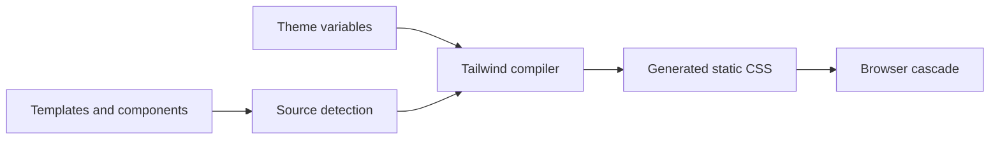

<TLDR>
  <TLDRCell label="what">
    Tailwind CSS 扫描源码中的完整候选类名，并为识别出的工具类生成静态 CSS。你在标记中组合小型样式规则，而不是不断创建新的语义类。
  </TLDRCell>
  <TLDRCell label="when">
    当团队希望直接使用受约束的间距、颜色、状态和断点词汇构建界面时，Tailwind 很合适。它不会替代 HTML 语义、CSS 层叠或无障碍设计。
  </TLDRCell>
  <TLDRCell label="how">
    Tailwind CSS 4 在样式入口中使用 `@import "tailwindcss"`，通常通过 Vite 插件或 PostCSS 集成构建。类名必须以完整文本出现，设计令牌则用 `@theme` 声明。
  </TLDRCell>
</TLDR>

## 是什么，为什么存在

Tailwind CSS 是一个工具优先 CSS（utility-first CSS）框架。一个 <Term id="utility-class">工具类（utility class）</Term>通常只表达一小组声明，例如 `grid`、`p-6` 或 `text-slate-900`；组件的最终外观来自这些类的组合。Tailwind 在构建期生成普通 CSS，浏览器里没有必须随应用运行的 Tailwind 样式引擎。

传统组件样式往往要求你先创造 `.product-card` 之类的名称，再去另一个文件维护声明。Tailwind 把已有的设计词汇放到使用它的标记旁边，减少一次性类名和跨文件查找。它仍然依赖 CSS 的继承、层叠和媒体查询，所以工具类不是独立于 CSS 的另一套布局系统。

工具优先方法最适合有限且共享的设计系统：间距、颜色、字号、圆角和断点来自同一套令牌，组件只选择允许的组合。重复的是类名文本，而不是生成后的规则；相同候选类通常只对应一条 CSS 规则。需要复杂选择器、内容驱动样式或第三方组件覆盖时，普通 CSS 仍然是正确工具。

你会在 HTML 模板、React 或 Vue 组件以及服务端模板中遇到 Tailwind 类名。框架不会理解这些文件的编程语言，它把源码当作文本寻找可能的类名，再尝试为有效候选项生成规则。这个约束解释了 Tailwind 最常见的生产故障：开发者或模型在运行时拼出一个从未以完整形式出现在源码里的类名。

本页针对 Tailwind CSS 4.3.3。旧教程中的 `npx tailwindcss init`、`content` 数组和三个 `@tailwind` 指令描述的是早期主流程，不能直接当作 v4 的默认安装方式。迁移旧项目时应先确认实际主版本，再选择对应文档。

## 工作原理

Tailwind 的核心是“候选类名到 CSS 规则”的构建流程。构建工具加载主题和指令，源码检测器收集候选文本，编译器丢弃无法识别的候选项，并为其余项目生成规则。最终浏览器只接收 CSS，不需要知道这些规则由 Tailwind 生成。



### 从候选类名到规则

一次构建可以按下面的顺序理解：

1. CSS 入口导入 Tailwind，并声明项目需要的主题变量或自定义规则。
2. 源码检测器从模板与组件中收集看起来可能是类名的文本。
3. 编译器把 `md:hover:bg-indigo-700` 拆成工具与条件变体。
4. 主题命名空间为颜色、间距、断点或圆角工具提供值。
5. 构建输出进入普通 CSS 层叠，由浏览器匹配元素与当前状态。

<Term id="source-detection">源码检测（source detection）</Term>不是 JavaScript 求值，也不是 AST 类型检查。检测器可以看见字符串字面量 `bg-red-600`，却不能推导 `` `bg-${tone}-600` `` 的可能结果。候选项只有在检测阶段可见，或通过 `@source` 明确注册，才有机会生成规则。

### 工具、变体与任意值

一个候选类名通常由可选 <Term id="variant">变体（variant）</Term>、工具名和修饰值组成。`hover:bg-indigo-700` 表示仅在悬停条件成立时应用背景色工具；`md:grid-cols-2` 把网格列数工具包在最小宽度媒体查询中。变体可以堆叠，但每一段仍须是编译器识别的完整文本。

| 候选类名 | 生成规则的意图 | 条件 |
| --- | --- | --- |
| `p-6` | 使用主题间距设置内边距 | 始终 |
| `hover:bg-indigo-700` | 设置悬停背景色 | 设备支持悬停且元素正被悬停 |
| `focus-visible:outline-2` | 显示键盘相关焦点轮廓 | 元素匹配 `:focus-visible` |
| `md:grid-cols-2` | 创建两列网格 | 视口宽度至少为 `md` |
| `opacity-[var(--panel-opacity)]` | 使用一个任意 CSS 值 | 始终 |

方括号中的任意值用于设计系统没有表达的真实例外，例如来自运行时 CSS 自定义属性的值。它们不是绕过令牌设计的快捷方式。大量近似颜色、像素宽度和复杂表达式会把隐含的设计系统分散到标记中，使审查与全局修改变难。

### 主题变量

<Term id="theme-variable">主题变量（theme variable）</Term>是在顶层 `@theme` 中声明的特殊 CSS 变量。它们既会成为生成 CSS 中的自定义属性，也会决定哪些工具存在；例如 `--color-brand-600` 可启用 `bg-brand-600` 等颜色工具，`--radius-card` 可启用 `rounded-card`。

普通 `:root` 自定义属性只有浏览器语义，不会单独创建 Tailwind 工具。需要一个令牌映射到工具 API 时用 `@theme`；只需要运行时层叠值时用 `:root` 或组件作用域变量。两者可以结合，例如任意值工具读取 `var(--panel-opacity)`。

主题变量让工具词汇与设计令牌保持联系，但命名仍是公共接口。删除或重命名变量可能让对应候选项不再生成。共享组件库应记录它要求的主题命名空间，并在使用方的生产构建中测试。

### 响应式与状态条件

Tailwind 的响应式变体采用移动优先的最小宽度规则。无前缀工具是所有宽度的基线，`md:` 从 `md` 断点开始覆盖，`xl:` 再从更宽的范围覆盖。`sm:` 不是“手机样式”，而是从默认主题的 `sm` 最小宽度开始生效的条件。

状态变体把伪类、媒体特性、属性或结构关系编码在候选项中。`hover:`、`focus-visible:`、`disabled:`、`dark:`、`motion-reduce:`、`group-*` 与 `peer-*` 都是在条件满足时激活工具。它们只能改变视觉规则，不能为 `div` 补出按钮语义、键盘行为或可访问名称。

响应式规则也不应代替内容顺序设计。`order-*`、Grid 定位或隐藏工具可以改变视觉结果，却不会自动产生正确的 DOM、阅读和焦点顺序。每个断点都应使用真实内容、键盘操作和文本缩放验证。

### 源码边界与组件边界

Tailwind v4 默认自动检测项目源码，同时忽略 `.gitignore` 文件、依赖目录、二进制文件、CSS 文件和常见锁文件。Monorepo 或外部组件包中的类可能落在自动边界之外，可以用相对于样式表的 `@source` 注册路径。`source(none)` 适合需要完全显式控制多个样式入口的项目。

动态状态应映射到完整的静态类名。组件可以维护 `toneClasses = { danger: 'bg-red-600', safe: 'bg-green-600' }`，再按属性选择映射值。这样检测器能看见候选项，代码审查也能看到允许的有限状态。

重复标记优先通过框架组件或模板局部封装，因为这会同时保存结构、行为和样式契约。`@apply` 可以把现有工具内联进自定义 CSS，但它会重新引入命名与样式表边界，不应只为缩短一处 `class` 属性而使用。复杂选择器或真正共享的第三方覆盖直接写 CSS 往往更清楚。

## 示例

下面四个夹具使用本地 Tailwind CSS 4.3.3 编译器执行。`@source inline()` 只负责让隔离文件的候选项确定可见；真实应用通常从 HTML 或组件源码自动检测这些完整类名。输出保留编译器生成的版本横幅，并且没有手工改写。

### 组合基础工具

第一个夹具定义卡片需要的最小主题，并请求六个完整候选项。它展示了工具如何引用主题变量，而不是把间距和颜色复制到每个组件中。

<Depth level="quick">

```css title="utility-card.css"
/* Isolated fixture; applications detect candidates in templates. */
@theme {
  --spacing: 0.25rem;
  --color-slate-100: oklch(96.8% 0.007 247.896);
  --color-slate-900: oklch(20.8% 0.042 265.755);
  --radius-xl: 0.75rem;
}

@source inline("grid gap-4 rounded-xl bg-slate-100 p-6 text-slate-900");
@tailwind utilities;
```

```text
/*! tailwindcss v4.3.3 | MIT License | https://tailwindcss.com */
:root, :host {
  --spacing: 0.25rem;
  --color-slate-100: oklch(96.8% 0.007 247.896);
  --color-slate-900: oklch(20.8% 0.042 265.755);
  --radius-xl: 0.75rem;
}
.grid {
  display: grid;
}
.gap-4 {
  gap: calc(var(--spacing) * 4);
}
.rounded-xl {
  border-radius: var(--radius-xl);
}
.bg-slate-100 {
  background-color: var(--color-slate-100);
}
.p-6 {
  padding: calc(var(--spacing) * 6);
}
.text-slate-900 {
  color: var(--color-slate-900);
}
```

<TryToBreak items={['删除 --radius-xl 后重新构建', '把 bg-slate-100 改成运行时拼接', '加入同一个候选类名两次']} />

</Depth>

标记中无论重复多少次 `p-6`，这个夹具仍只需要一条 `.p-6` 规则。另一方面，主题里没有相应命名空间时，候选项可能无法生成；这就是令牌词汇与可用工具之间的契约。

### 编译交互状态

第二个夹具加入悬停、可见焦点和禁用状态。候选类名中的冒号会在选择器中转义，变体则成为媒体查询或伪类条件。

```css title="state-button.css"
/* Each complete token can be detected without evaluating JavaScript. */
@theme {
  --spacing: 0.25rem;
  --color-indigo-600: oklch(51.1% 0.262 276.966);
  --color-indigo-700: oklch(45.7% 0.24 277.023);
  --color-white: #fff;
  --radius-lg: 0.5rem;
}

@source inline("rounded-lg bg-indigo-600 px-4 py-2 text-white hover:bg-indigo-700 focus-visible:outline-2 disabled:opacity-50");
@tailwind utilities;
```

```text
/*! tailwindcss v4.3.3 | MIT License | https://tailwindcss.com */
@layer properties;
:root, :host {
  --spacing: 0.25rem;
  --color-indigo-600: oklch(51.1% 0.262 276.966);
  --color-indigo-700: oklch(45.7% 0.24 277.023);
  --color-white: #fff;
  --radius-lg: 0.5rem;
}
.rounded-lg {
  border-radius: var(--radius-lg);
}
.bg-indigo-600 {
  background-color: var(--color-indigo-600);
}
.px-4 {
  padding-inline: calc(var(--spacing) * 4);
}
.py-2 {
  padding-block: calc(var(--spacing) * 2);
}
.text-white {
  color: var(--color-white);
}
@media (hover: hover) {
  .hover\:bg-indigo-700:hover {
    background-color: var(--color-indigo-700);
  }
}
.focus-visible\:outline-2:focus-visible {
  outline-style: var(--tw-outline-style);
  outline-width: 2px;
}
.disabled\:opacity-50:disabled {
  opacity: 50%;
}
@property --tw-outline-style {
  syntax: "*";
  inherits: false;
  initial-value: solid;
}
@layer properties {
  @supports ((-webkit-hyphens: none) and (not (margin-trim: inline))) or ((-moz-orient: inline) and (not (color:rgb(from red r g b)))) {
    *, ::before, ::after, ::backdrop {
      --tw-outline-style: solid;
    }
  }
}
```

编译结果没有为按钮添加 `disabled` 属性或键盘行为；这些仍由 HTML 与组件逻辑负责。悬停规则受 `@media (hover: hover)` 保护，也说明测试不能只模拟鼠标悬停。

### 建立移动优先网格

第三个夹具先生成单列基线，再在 `md` 与 `xl` 最小宽度上生成覆盖规则。源码里的 `--breakpoint-lg` 没有对应候选项，因此本次输出不包含 `lg` 媒体查询。

```css title="responsive-grid.css"
/* Unprefixed utilities are the mobile baseline. */
@theme {
  --spacing: 0.25rem;
  --breakpoint-md: 48rem;
  --breakpoint-lg: 64rem;
  --breakpoint-xl: 80rem;
}

@source inline("grid grid-cols-1 gap-4 md:grid-cols-2 xl:grid-cols-4");
@tailwind utilities;
```

```text
/*! tailwindcss v4.3.3 | MIT License | https://tailwindcss.com */
:root, :host {
  --spacing: 0.25rem;
}
.grid {
  display: grid;
}
.grid-cols-1 {
  grid-template-columns: repeat(1, minmax(0, 1fr));
}
.gap-4 {
  gap: calc(var(--spacing) * 4);
}
@media (width >= 48rem) {
  .md\:grid-cols-2 {
    grid-template-columns: repeat(2, minmax(0, 1fr));
  }
}
@media (width >= 80rem) {
  .xl\:grid-cols-4 {
    grid-template-columns: repeat(4, minmax(0, 1fr));
  }
}
```

把 `md:grid-cols-2` 误读为“仅在中等宽度”会产生错误测试。它从 48rem 开始持续生效，直到同属性的更宽条件或其他层叠规则覆盖它。

### 连接主题与运行时变量

最后一个夹具让 `@theme` 创建品牌色与圆角工具，同时保留普通 `:root` 变量作为运行时透明度输入。任意值工具引用变量，不需要为每个透明度生成新类。

```css title="theme-card.css"
/* Theme variables create utilities; ordinary variables do not. */
@theme {
  --spacing: 0.25rem;
  --color-brand-600: oklch(52% 0.2 255);
  --radius-card: 0.75rem;
}

:root {
  --panel-opacity: 0.92;
}

@source inline("rounded-card bg-brand-600 p-6 opacity-[var(--panel-opacity)]");
@tailwind utilities;
```

```text
/*! tailwindcss v4.3.3 | MIT License | https://tailwindcss.com */
:root, :host {
  --spacing: 0.25rem;
  --color-brand-600: oklch(52% 0.2 255);
  --radius-card: 0.75rem;
}
:root {
  --panel-opacity: 0.92;
}
.rounded-card {
  border-radius: var(--radius-card);
}
.bg-brand-600 {
  background-color: var(--color-brand-600);
}
.p-6 {
  padding: calc(var(--spacing) * 6);
}
.opacity-\[var\(--panel-opacity\)\] {
  opacity: var(--panel-opacity);
}
```

如果透明度随元素实例变化，组件可设置 `--panel-opacity`，候选类名保持静态。这个边界避免产生无限的 `opacity-[0.913]` 一次性候选项，也让运行时值继续参与 CSS 层叠。

## 陷阱

### 在运行时拼接类名

> [!PITFALL]
> `` `bg-${tone}-600` `` 看起来会产生合法类名，但源码检测器不会执行模板字符串，也看不到完整候选项。开发模式中由其他文件偶然提供的规则还可能掩盖问题，直到生产入口或共享包独立构建。

**修复：** 把有限输入映射到完整字符串，例如 `{ danger: 'bg-red-600', safe: 'bg-green-600' }`。必须引入检测边界外的类时，精确注册源码路径或使用范围尽可能小的 `@source inline()`，不要用宽泛保留列表掩盖未知状态。

### 把断点前缀当作设备名称

> [!PITFALL]
> `sm:` 不是默认手机范围，`md:` 也不是只覆盖一类平板。它们是从主题断点开始生效的最小宽度条件；只写 `sm:text-sm` 会让更窄宽度没有该字号工具。

**修复：** 先写无前缀基线，再从内容真正需要变化的位置添加覆盖。测试断点前后各一个 CSS 像素，并加入长文本、缩放文字和真实容器宽度。

### 用视觉工具替代语义和焦点

> [!PITFALL]
> 模型经常生成带 `cursor-pointer` 的 `div`，或用 `focus:outline-none` 删除唯一可见焦点。工具类只能改变呈现，不能补全按钮角色、键盘激活、禁用语义和可访问名称。

**修复：** 操作用原生 `button`，导航用带 `href` 的链接，并明确 `type`。只有提供经验证的 `focus-visible` 替代样式后才移除默认轮廓，同时用键盘和高对比模式检查。

### 依赖 `class` 属性中的先后顺序

> [!PITFALL]
> 把 `px-4 px-8` 的后一个类当作必然获胜，会把 HTML 字符串顺序误认为 CSS 规则顺序。Tailwind 生成样式表的排序和层叠决定结果；组件合并两个类集合时，冲突意图也变得不清楚。

**修复：** 每个状态只发出一个负责同一属性的工具。若组件允许调用方覆盖样式，应定义明确的合并契约并测试最终计算样式，而不是靠重排字符串修复冲突。

### 让任意值吞掉设计系统

> [!PITFALL]
> 大量 `mt-[13px]`、`text-[#17324d]` 和相近宽度会绕开共享令牌。代码仍能编译，却很难回答哪些值是故意差异、哪些是生成代码的随机选择。

**修复：** 真正重复或具有产品含义的值提升为 `@theme` 令牌；高基数运行时值通过普通 CSS 自定义属性传入。代码审查中统计新增任意值，并要求每个例外说明约束来源。

### 把 v3 配置复制到 v4 项目

> [!PITFALL]
> 旧答案常建议运行 `npx tailwindcss init -p`、维护 `content` 数组，再写 `@tailwind base; @tailwind components; @tailwind utilities;`。这不是 Tailwind CSS 4 使用 Vite 的当前默认流程，照抄会产生缺失命令、错误依赖或无效配置。

**修复：** 先从锁文件确认主版本。v4 的 Vite 集成安装 `tailwindcss` 与 `@tailwindcss/vite`、注册插件，并在 CSS 中使用 `@import "tailwindcss"`；旧项目迁移则按官方升级说明逐项处理。

## AI 时代

**生成代码在这里常犯的错误**

模型会混用 v3 和 v4 安装步骤，把 React 属性插入 `` `bg-${color}-600` ``，再用巨大的保留列表补救。它们还常输出互相冲突的工具、随机任意值、`transition-all`、悬停专用交互和 `focus:outline-none`，或者用 `order-*` 改变视觉顺序却不检查键盘焦点。共享组件放在自动检测边界之外时，生成代码通常只改组件包，不会在应用样式入口注册 `@source`。

**要求 AI 检查**

- 列出所有通过插值、拼接或后端数据产生的类名，并把有限状态改成完整候选项映射。
- 根据锁文件识别 Tailwind 主版本，逐项核对安装包、Vite 或 PostCSS 集成、CSS 入口和源码边界。
- 报告冲突工具、任意值、焦点移除、仅悬停状态与视觉重排，并说明每项的计算样式和无障碍验证方法。

**审查清单**

- 在生产构建产物中查找每个状态、断点和共享包需要的选择器，而不只查看开发服务器截图。
- 在断点两侧、深色模式、减少动态效果、键盘焦点和触摸输入下执行真实组件测试。
- 确认每个 `@theme` 令牌有稳定含义，每个任意值有明确理由，每组冲突工具只有一个所有者。

**提示词词汇**

使用准确术语 `utility-first CSS`（工具优先 CSS）、`candidate class`（候选类名）、`source detection`（源码检测）、`static class map`（静态类名映射）、`variant`（变体）、`mobile-first breakpoint`（移动优先断点）、`theme variable`（主题变量）、`arbitrary value`（任意值）和 `computed style`（计算样式）。要求模型给出候选项清单、检测边界与断点矩阵；“把页面改成 Tailwind”不足以暴露生产构建风险。

<Depth level="deep">

## 源码检测是一份构建契约

自动检测让常规项目无需维护路径列表，但“自动”不等于“理解所有文件”。Tailwind 把源码视为纯文本，忽略无效候选项，并默认跳过若干文件类别。生成器、数据库内容、依赖包或 monorepo 中另一工作区的类名，都可能不在当前 CSS 入口的检测集合里。

应把每个样式入口看成拥有一个明确候选项集合。单应用入口可以依赖自动检测，再用 `@source` 补上被忽略的共享包；多个入口则可用 `source(none)` 后逐一注册范围，防止管理后台 CSS 意外包含整站候选项。路径相对于样式表解析时，构建工作目录变化也更容易控制。

`@source inline()` 是精确强制生成工具，可使用大括号展开变体或范围。它适合无法扫描的有限集合和测试夹具，不适合为不受约束的用户输入生成任意 CSS。输入决定视觉状态时，应先把它验证到有限业务枚举，再选择静态完整类名。

测试检测契约需要查看独立生产产物。删除缓存，从真实入口构建，再搜索关键选择器；只在开发服务器点击页面可能因为热更新历史、另一页面或宽扫描范围而得到假阳性。组件库还应在最小使用方项目中测试，让遗漏的 `@source` 立即暴露。

## 变体最终仍是 CSS 层叠

变体是生成选择器和 at-rule 的语法，不会绕过 CSS 层叠。来源、层、重要性、特异性、作用域邻近性和规则顺序仍可能改变结果。HTML 中类名的文本顺序通常不决定两个同优先级工具谁覆盖谁。

堆叠变体描述多个同时成立的条件，例如 `dark:md:hover:bg-fuchsia-600`。审查时应把它展开成条件矩阵：深色条件如何触发，断点从哪里开始，设备是否支持悬停，哪个元素接收伪类。缺少任何一列的测试都可能让某条路径从未运行。

`group-*` 依赖带 `group` 标记的祖先，`peer-*` 依赖前面的兄弟元素与 `peer` 标记。DOM 重构可能让生成 CSS 仍存在，却不再匹配目标。将结构性变体封装在保留其 DOM 关系的组件里，并为展开、校验与禁用状态写行为测试。

深色模式同样是条件策略，而不仅是 `dark:` 前缀。默认行为、手动选择器策略、系统偏好与持久化脚本必须一致，并避免页面加载时主题闪烁。服务端渲染应用还要保证首个响应和水合后的主题选择相同。

## 令牌、任意值与复用边界

`@theme` 命名空间建立令牌到工具 API 的映射。颜色、字体、阴影、断点或圆角名称一旦被组件广泛使用，就构成跨包契约。修改值通常保留 API，重命名变量则可能删除对应工具，因此迁移要搜索候选项并构建每个消费者。

普通 CSS 自定义属性适合加载后变化或只属于单个实例的值。拖动坐标、进度和用户选择颜色拥有高基数，不应为每个可能值制造静态工具。一个稳定候选项读取经验证的自定义属性，通常比不断生成任意值字符串更可靠。

复用边界由接口决定，不由类名长度决定。只有标记和行为一起重复时，框架组件最能表达契约；只有一组声明需要进入复杂选择器时，自定义 CSS 或 `@apply` 才可能更清楚。过早抽出 `.btn` 会隐藏哪些变体可用，却没有自动提供类型、语义或交互状态。

工具类也不能证明视觉质量。令牌名称不保证颜色对比度，固定高度不保证长翻译可见，`truncate` 也不保证完整信息可访问。最终审查必须覆盖真实内容、计算样式和任务完成路径。

## 从 v3 心智模型迁移

Tailwind v3 项目通常以 JavaScript 配置的 `content` 路径和 `@tailwind` 指令为中心。v4 的常规入口以 `@import "tailwindcss"`、自动源码检测与 CSS 中的 `@theme` 为中心，Vite 项目使用专用插件。两套模型都可能出现在长期维护的仓库里，因此版本判断必须来自锁文件与实际入口。

不要为了“现代化”一次性删除旧配置。插件、预设、共享主题和动态保留规则可能仍依赖迁移路径；应先列出它们提供的行为，再为每项找到 v4 对应方式。最小生产构建比仅修改配置文件更能验证迁移是否完整。

迁移完成的证据包括：真实入口能构建，关键候选项存在，主题与深色策略保持一致，共享包被检测，浏览器没有布局或焦点回归。构建时间或 CSS 大小只有在同一项目、相同入口与相同环境下测量才有意义，本页不提供可移植的性能数字。

</Depth>

<Checkpoint id="frontend/tailwind-css" />

## 延伸阅读

- [Tailwind CSS：使用 Vite 安装](https://tailwindcss.com/docs/installation/using-vite)
- [Tailwind CSS：使用工具类设计样式](https://tailwindcss.com/docs/styling-with-utility-classes)
- [Tailwind CSS：检测源码中的类名](https://tailwindcss.com/docs/detecting-classes-in-source-files)
- [Tailwind CSS：主题变量](https://tailwindcss.com/docs/theme)
- [Tailwind CSS：悬停、焦点与其他状态](https://tailwindcss.com/docs/hover-focus-and-other-states)
- [Tailwind CSS：响应式设计](https://tailwindcss.com/docs/responsive-design)
