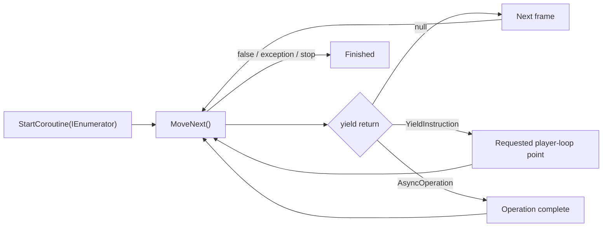

<TLDR>
  <TLDRCell label="what">
    A Unity <Term id="coroutine">coroutine</Term> is an `IEnumerator` that the main thread runs in segments; it pauses at `yield return` and resumes at the requested time.
  </TLDRCell>
  <TLDRCell label="trap">
    A coroutine is not a background thread. Blocking calls still stall the frame, while a bad clock or lifecycle assumption can make a wait never finish.
  </TLDRCell>
  <TLDRCell label="fix">
    Choose each yield instruction deliberately, retain the `Coroutine` handle, and put start, replacement, and stop policy in the `MonoBehaviour` that owns the flow.
  </TLDRCell>
</TLDR>

## What it is and why it exists

A Unity coroutine is a method that can suspend. The method returns `IEnumerator`, which Unity advances repeatedly; at `yield return`, Unity retains the execution position and any live local variables, then continues when the condition is met. Coroutines fit multi-frame flows such as fades, wave spawning, staged tutorials, and waiting for asynchronous assets.

An ordinary method keeps running until it returns. If one loop changes opacity from `1` to `0` during a single call, the renderer sees only the final value. A coroutine can make one change, yield control, and give intermediate states a chance to update and render.

A <Term id="coroutine">coroutine</Term> improves the shape of control flow; it does not provide compute parallelism. Synchronous code between two yields still runs on Unity's main thread. Putting `Thread.Sleep`, synchronous file reads, or a large loop in a coroutine still blocks that frame.

Coroutines are a natural fit when a flow follows frames, Unity time, or an `AsyncOperation`. For CPU-heavy work that must use other cores, consider the C# Job System. When you need to compose I/O, return values, exceptions, and cancellation, Unity's `Awaitable` or an appropriate `Task` is often clearer.

## How it works

After `StartCoroutine(routine)` is called, Unity advances `routine` until its first yield or until the method ends. `StartCoroutine` returns a `Coroutine` handle, which identifies that running instance rather than carrying a result. After each resumption, code continues until another yield, `yield break`, a normal return, or an unhandled exception.

The C# compiler rewrites a method containing `yield return` as a state machine. Parameters and local variables that remain live across a yield become fields on that object, along with the execution position. Local state can therefore survive across frames, but every call to the coroutine method creates a new iterator instance.



### Yield values select a resume condition

A <Term id="yield-instruction">yield instruction</Term> tells Unity when to advance the iterator again. Common choices are:

- `yield return null`: suspend until a later frame, suitable for frame-by-frame updates.
- `yield return new WaitForSeconds(seconds)`: wait using scaled time.
- `yield return new WaitForSecondsRealtime(seconds)`: wait using unscaled time.
- `yield return new WaitUntil(predicate)`: evaluate a delegate each frame until it returns `true`.
- `yield return new WaitForFixedUpdate()`: resume after the next physics update.
- `yield return asyncOperation`: resume when the asynchronous operation completes.

`WaitForSeconds` uses <Term id="scaled-time">scaled time</Term>, so it does not advance while `Time.timeScale = 0`. Pause-menu timers, real-world cooldowns, and connection timeouts usually need `WaitForSecondsRealtime`. This choice is not about which API is newer; it is about which clock governs the flow.

The requested duration is not an exact wall-clock deadline. `WaitForSeconds` begins waiting at the end of the current frame and resumes on the first eligible frame after the duration has elapsed. Long frames and frame boundaries can both make the actual resumption later than the supplied duration.

The `WaitUntil` delegate runs each frame after `Update` and before `LateUpdate`. Keep it cheap and free of side effects, and account for referenced objects being destroyed. If the check itself is expensive, let an event or a lower-frequency process update a simple flag instead.

### Starting, nesting, and interleaving

`StartCoroutine(Child())` starts the child, but the parent method continues immediately unless it yields that operation. With `yield return StartCoroutine(Child())`, the parent waits for the child to finish. Both forms are valid; the difference is whether the parent flow owns that dependency.

Two coroutines can take turns running during the same frame, but that does not make them parallel. Do not depend on a fixed completion order for coroutines that finish in the same frame; Unity's API provides no such guarantee. Shared state needs a single clear writer or an ordering constraint you can verify.

### Ownership and stopping

Every call to a coroutine method produces a new `IEnumerator`. If a button repeatedly calls `StartCoroutine(Fade())`, Unity runs several independent fade instances. To implement "latest request replaces the previous one," retain the `Coroutine` returned by `StartCoroutine`, stop the old instance, and then start the new one.

<Term id="cancellation">Cancellation</Term> here is a cooperative lifecycle decision. `StopCoroutine` stops one identified flow; `StopAllCoroutines` stops every coroutine on that `MonoBehaviour`, which is usually too broad. After stopping, do not assume that cleanup at the end of the coroutine will run; restore required state in the owner's stop path.

Unity has string, `IEnumerator`, and `Coroutine` overloads for stopping. The identifier used to start and stop must match; do not mix the forms. Retaining a `Coroutine` handle most directly expresses "stop this run" and avoids string spelling and argument restrictions.

### The real lifecycle rules

Setting `Behaviour.enabled` to `false` does not automatically stop coroutines that component already started. Generated code often gets this exact rule backward. If disabling a component means its work must stop, stop it explicitly and clean up in `OnDisable`.

Deactivating the owning `GameObject` stops its coroutines, as does destroying the `MonoBehaviour`. Reactivating the object does not resume the old coroutine from its suspended point. A flow that must outlive an object or a scene should belong to a genuinely longer-lived owner, not be quietly forwarded to a global manager.

## Examples

These three examples build from a minimal frame sequence to a replaceable real-time notice and then parent-child ordering. They require the Unity runtime. Unity Editor is unavailable in the local environment, so no console output has been fabricated.

### A minimal multi-frame sequence

`StartCoroutine` lets `OpenDoor` run to its first yield. The `open` message appears on a later frame, followed by a scaled-time wait. The log contents are deterministic, while their timestamps depend on the runtime frame rate.

<Depth level="quick">

```csharp title="DoorSequence.cs"
// # not executed here: Unity Editor 6.6 is not installed in the local toolchain.
using System.Collections;
using UnityEngine;

public sealed class DoorSequence : MonoBehaviour
{
    private void Start()
    {
        StartCoroutine(OpenDoor());
    }

    private IEnumerator OpenDoor()
    {
        Debug.Log("unlock");
        yield return null;

        Debug.Log("open");
        yield return new WaitForSeconds(0.5f);

        Debug.Log("ready");
    }
}
```

```text
# not executed here: Unity Editor 6.6 is not installed in the local toolchain.
```

</Depth>

If `Time.timeScale` becomes `0` between `open` and `ready`, the final message keeps waiting. That behavior suits a door animation governed by game pause. If the door must keep moving in a pause menu, use unscaled time and drive per-frame interpolation with `Time.unscaledDeltaTime`.

### Replacing an older notice

A pause-menu notice should disappear according to real time. When a new message arrives, the old timer must not hide it halfway through, so the code stops the old handle before starting and clears ownership on completion or disable.

```csharp title="PauseNotice.cs"
// # not executed here: Unity Editor 6.6 is not installed in the local toolchain.
using System.Collections;
using TMPro;
using UnityEngine;

public sealed class PauseNotice : MonoBehaviour
{
    [SerializeField] private TMP_Text label;
    private Coroutine hideRoutine;

    public void Show(string message)
    {
        if (hideRoutine != null)
            StopCoroutine(hideRoutine);

        label.text = message;
        label.gameObject.SetActive(true);
        hideRoutine = StartCoroutine(HideAfterDelay());
    }

    private IEnumerator HideAfterDelay()
    {
        yield return new WaitForSecondsRealtime(2f);
        label.gameObject.SetActive(false);
        hideRoutine = null;
    }

    private void OnDisable()
    {
        if (hideRoutine != null)
            StopCoroutine(hideRoutine);
        hideRoutine = null;
    }
}
```

```text
# not executed here: Unity Editor 6.6 is not installed in the local toolchain.
```

`PauseNotice` owns both the UI state and the coroutine handle. `OnDisable` does not depend on whether Unity happens to stop the coroutine; it enforces the component's own policy. Re-enabling the component also cannot leave a non-null field pointing at an obsolete run.

### Waiting for a child coroutine

The wave flow must finish spawning the current batch before its short intermission. The parent yields `StartCoroutine(SpawnWave(...))`, so `wave complete` follows the final `spawn` for that batch.

```csharp title="WaveSequence.cs"
// # not executed here: Unity Editor 6.6 is not installed in the local toolchain.
using System.Collections;
using UnityEngine;

public sealed class WaveSequence : MonoBehaviour
{
    [SerializeField] private GameObject enemyPrefab;
    [SerializeField] private Transform spawnPoint;

    private IEnumerator Start()
    {
        for (var wave = 1; wave <= 2; wave++)
        {
            Debug.Log($"wave {wave} start");
            yield return StartCoroutine(SpawnWave(3));
            Debug.Log($"wave {wave} complete");
            yield return new WaitForSeconds(1f);
        }
    }

    private IEnumerator SpawnWave(int count)
    {
        for (var index = 0; index < count; index++)
        {
            Instantiate(enemyPrefab, spawnPoint.position, spawnPoint.rotation);
            Debug.Log($"spawn {index + 1}");
            yield return new WaitForSeconds(0.25f);
        }
    }
}
```

```text
# not executed here: Unity Editor 6.6 is not installed in the local toolchain.
```

If this becomes `StartCoroutine(SpawnWave(3));` without yielding the return value, the parent logs `wave complete` immediately. That is concurrent startup, not sequential composition. During review, classify every child coroutine as either "start and continue" or "start and wait."

## Pitfalls

> [!PITFALL]
> Treating a coroutine as a background thread puts blocking I/O, `Thread.Sleep`, or a long CPU loop between two yields and stalls the main thread.

**Fix:** Keep each frame's work within its budget. Use the Job System for parallel CPU work; use a suitable `Awaitable` or `Task` for genuinely asynchronous I/O, and verify the thread context before returning to Unity APIs.

> [!PITFALL]
> Using `WaitForSeconds` in a pause screen means the wait does not finish while `Time.timeScale = 0`.

**Fix:** Name the required clock first. Use `WaitForSeconds` for game time and `WaitForSecondsRealtime` for real time; in frame-by-frame calculations, make the same choice between `Time.deltaTime` and `Time.unscaledDeltaTime`.

> [!PITFALL]
> Starting a fresh coroutine on every event without retaining its handle lets old and new flows mutate the same object together.

**Fix:** Choose an ignore, queue, parallel, or replace policy. A replacement policy retains the `Coroutine`, stops the old run before starting another, and clears the field on every ending path.

> [!PITFALL]
> Assuming that disabling a `MonoBehaviour` stops its coroutines, or that reactivating a `GameObject` resumes a stopped coroutine, contradicts Unity's lifecycle rules.

**Fix:** State the lifecycle contract around `OnDisable`, `OnEnable`, and `OnDestroy`. If work should resume, retain domain state and start a new coroutine rather than expecting the old iterator to revive.

> [!PITFALL]
> Treating `WaitForSeconds(1f)` as an exact one-second timer makes tests compare against idealized time.

**Fix:** Accept that resumption happens on frame boundaries and test long frames and low frame rates. For a deadline, compare the current clock with a target time instead of assuming one wait produces an exact callback instant.

> [!PITFALL]
> Code starts with `StartCoroutine(MyRoutine())`, then calls `MyRoutine()` again and passes that new iterator to `StopCoroutine`.

**Fix:** Retain the `Coroutine` returned at startup and stop with that same handle. Do not mix the string, iterator, and handle overloads.

<Depth level="deep">

## Iterator state machines and the PlayerLoop

A coroutine method looks like one continuous piece of code, but it executes through repeated `MoveNext()` calls. The C# compiler-generated state machine records its position and promotes parameters and local variables that live across a yield into fields. On resumption, the saved state sends execution to the right location.

That transformation explains both cross-frame locals and startup cost. The state machine is an object containing fixed control state plus the data it must retain. Its exact byte size varies with compiler, backend, and local variables, so a universal number would be meaningless without a measurement.

Initial and resumed code can appear in different places in the Unity Profiler. The section from the call site to the first yield appears beneath the startup call, while later resumptions normally appear beneath `DelayedCallManager` in the main loop. To investigate a coroutine's total CPU time, inspect both locations rather than only the frame that calls `StartCoroutine`.

### State is not a thread stack

The state machine retains execution data, but it does not move work to another thread. One `MoveNext()` must still finish its current segment before returning. If a segment takes too long, a yield later in the method cannot rescue the frame that has already been blocked.

Turning a large task into a coroutine helps only when the task can be split safely. For example, yielding after a fixed batch of grid cells can spread work across frames, but it does not reduce total CPU work. Measure the batch size against frame time on target hardware rather than copying a constant.

### Ending paths

When an iterator reaches its normal end, `MoveNext()` returns `false`. `yield break` also ends the current iterator. An unhandled exception terminates that coroutine and Unity logs it, but the method that called `StartCoroutine` does not later receive the exception the way an awaiting caller would.

That error-propagation difference can drive the API choice. If a caller must compose return values, centralize exception handling, or pass cancellation, an `Awaitable`-based interface is usually more explicit. If a flow mainly waits for player-loop points and mutates scene objects on the main thread, a coroutine remains direct and useful.

## Time, player-loop points, and conditions

`yield return null` promises only a resumption on a later frame, not a fixed number of milliseconds. `WaitForFixedUpdate` aligns work after a physics update, while `WaitForEndOfFrame` aligns it after rendering and GUI work. Choose these instructions from data dependencies, not from a desire to make code look more asynchronous.

`WaitUntil` wraps a delegate that Unity invokes once per frame. It suits a cheap state flag such as `isLoaded`, but not a full scene search on every call. When an event supplies the condition, let the event handler update a Boolean and have the coroutine read that value.

A condition also needs an ending policy. An object referenced by the predicate might be destroyed first; a network or service condition might never become true. Define a cancellation entry point, the clock used for timeout, and the UI state after failure so the lifecycle closes cleanly.

### Absolute deadlines

A series of `WaitForSeconds(0.1f)` calls carries each frame-boundary delay into the next interval. For a steadier cadence, retain the next target time and calculate the remainder from the current scaled or unscaled clock. Execution still lands only on the player-loop points Unity offers.

A countdown display should not infer real time remaining by "wait one second, then decrement." Long frames make that display drift. Retaining a deadline and recalculating the remainder from the current clock usually represents the player's actual wait more faithfully.

## Composition and ownership boundaries

When a parent yields a child coroutine, the structure expresses a sequential dependency. If a parent ends or is stopped, do not infer from syntax that every independently started child is cleaned up according to your domain policy. Every run that can proceed independently needs a named owner and stop rule.

A global "coroutine manager" does not remove lifecycle decisions. It moves ownership to a longer-lived object and can keep scene objects reachable through iterator fields or delegates. Use one only when the flow truly should survive scene changes, with explicit cancellation for scene unload and target destruction.

`StopAllCoroutines` affects only the `MonoBehaviour` that invokes it, yet can still stop unrelated flows on that component. Separate handles make ownership clearer when one component has several concurrent responsibilities. If the handle list grows rapidly, the component's responsibilities or state model probably need separation rather than another layer of string names.

### Allocation and profiling

The generated state machine retains data across yields, and constructing new yield-instruction objects can create managed allocations. That is not a reason to cache every `WaitForSeconds` mechanically; dynamic durations, concurrent reuse, and readability can change the design. Find visible allocation hotspots with the Unity Profiler on the target build first.

Optimize in an order that preserves behavior. Prevent accidental per-frame coroutine startup, reduce unnecessary nesting and short-lived objects, then measure whether caching produces a real benefit. Without frame-time, allocation, or GC evidence, describe the mechanism but do not claim a percentage improvement.

An infinite coroutine that runs every frame and shares exactly the `Update` lifecycle is not necessarily clearer than `Update`. Conversely, a flow with named stages and wait points often reads better as a coroutine. Choose the form that makes ownership, resumption conditions, and endings easiest to see.

## Boundaries with Awaitable and the Job System

Unity 6.6 includes both iterator-based coroutines and `Awaitable`. `Awaitable` uses C# `async`/`await` control flow and expresses return values, exceptions, and cancellation more naturally. Migration is not a keyword substitution: resumption threads, lifecycle, and pooled-awaitable rules also need review.

Neither a coroutine nor `Awaitable` automatically turns synchronous code into parallel computation. If the goal is to use multiple cores for independent data, evaluate the Job System and Burst. If the goal is only to wait for a frame, a delay, or a scene load, suspendable main-thread control flow is often enough.

Start the boundary decision with three facts: which thread executes the work, who cancels it, and how failures reach the caller. Coroutines are strongest when the first answer is "Unity's main thread" and a `MonoBehaviour` owns a short-lived flow. When those answers grow more complicated, an explicit asynchronous API or a job is often easier to verify.

## Testing coroutine behavior

Coroutine tests should assert observable transitions rather than exact scheduler internals. A useful test controls the owner, advances the required frame or time source, and then checks scene state or a log expectation. It should also prove that the state has not changed before the intended resume point.

Unity Test Framework supports `[UnityTest]` methods that return `IEnumerator`. That lets a test yield `null`, a yield instruction, or another supported test operation using the same frame-aware mechanism as runtime code. Keep editor-only setup separate from the runtime behavior under test.

### Test one transition at a time

Break a long sequence into named operations with visible postconditions. For a notice component, the essential transitions are hidden to visible, current message to replacement message, and visible to hidden. Tests can then fail at the boundary that violated the contract.

A replacement-policy test should:

- Show the first message and confirm that the panel is visible.
- Advance less than the full delay, then show a second message.
- Pass the first message's old deadline and confirm that the second remains visible.
- Pass the second deadline and confirm that the panel is hidden.

This test catches the stale-timer bug that a single successful run cannot reveal. It also establishes whether "two seconds" starts from the first request or the most recent request.

### Control clocks deliberately

A test involving `WaitForSeconds` must control `Time.timeScale` and restore it afterward, even when an assertion fails. A test involving `WaitForSecondsRealtime` should not expect scaled-time changes to speed it up. Mixing those assumptions creates slow or hanging test suites.

Cover at least these timing boundaries:

- Zero time scale before the coroutine begins waiting.
- A time-scale change while a scaled wait is pending.
- A long frame that crosses the requested duration.
- Completion on the first eligible frame, not at an exact sub-frame instant.

Avoid assertions against an exact floating-point timestamp unless the API promises one. Assert ordering and a reasonable bound derived from the controlled clock. The point is to verify the contract, not the workstation's frame cadence.

### Exercise owner shutdown

Lifecycle tests need separate cases for `enabled = false`, `gameObject.SetActive(false)`, and destruction. These operations do not have identical coroutine behavior. A test that covers only one cannot justify a general claim that "disable stops the coroutine."

For each shutdown path, inspect:

- Whether the coroutine can still mutate scene state.
- Whether the retained handle has been cleared.
- Whether partially applied UI or gameplay state was restored.
- Whether reactivation starts a new run only when policy requires it.

These checks expose ownership bugs better than waiting for an expected log line to disappear. They also force the component to define what cancellation means for its visible state.

### Read the profiler as two segments

Profile the frame that starts the coroutine and the frames that resume it. Startup work and resumed work appear under different call-tree locations, so looking at only one can hide the expensive half. Name coroutine methods after their responsibility so profiler samples remain recognizable.

Performance tests should record frame time and managed allocation on a target-like build. Change one design choice at a time, such as accidental repeated startup or a short-lived yield object, and compare the same workload. Without that evidence, keep the edit as a readability improvement rather than a performance claim.

</Depth>

<Checkpoint id="gamedev/unity-coroutines" />

## Further reading

- [Microsoft C# reference: `yield` statement](https://learn.microsoft.com/en-us/dotnet/csharp/language-reference/statements/yield)
- [Microsoft C# guide: Iterators](https://learn.microsoft.com/en-us/dotnet/csharp/programming-guide/concepts/iterators)
- [Microsoft .NET API: `IEnumerator`](https://learn.microsoft.com/en-us/dotnet/api/system.collections.ienumerator)
- [Microsoft C# guide: Asynchronous programming](https://learn.microsoft.com/en-us/dotnet/csharp/asynchronous-programming/)
