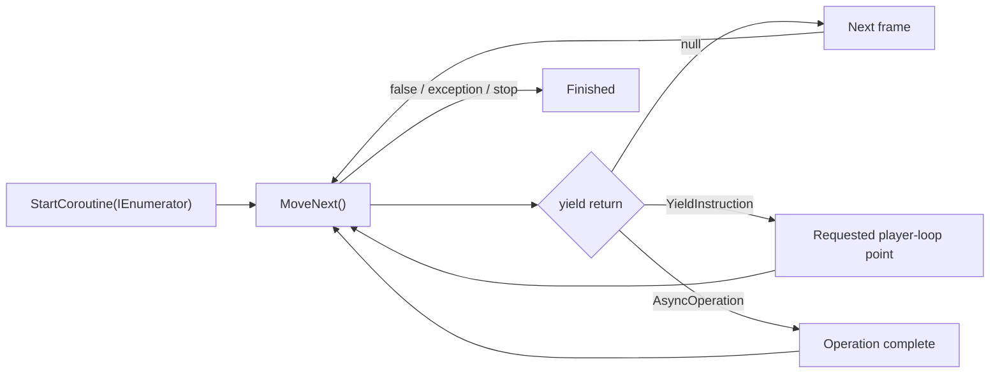

<TLDR>
  <TLDRCell label="what">
    Unity协程（coroutine）是由主线程分段执行的`IEnumerator`；它在`yield return`处暂停，并在指定时机继续。
  </TLDRCell>
  <TLDRCell label="trap">
    协程不是后台线程。阻塞调用仍会卡住帧，而错误的时钟或生命周期假设会让等待永远不结束。
  </TLDRCell>
  <TLDRCell label="fix">
    明确选择yield指令，保存`Coroutine`句柄，并把启动、替换和停止策略写在拥有该流程的`MonoBehaviour`中。
  </TLDRCell>
</TLDR>

## 是什么，为什么存在

Unity协程是一种可暂停的方法。方法返回`IEnumerator`，Unity反复推进这个迭代器；遇到`yield return`时，Unity保存执行位置和仍需使用的局部变量，等条件满足后再继续。协程适合表达淡入淡出、波次生成、分阶段教程和等待异步资源等跨帧流程。

普通方法会一直运行到返回。若一个循环在一次调用中把透明度从`1`改到`0`，渲染器只会看到最后的值。协程可以每次改一点后交还控制权，使中间状态有机会被更新和渲染。

<Term id="coroutine">协程（coroutine）</Term>解决的是控制流的可读性，不是计算并行。协程中两次yield之间的同步代码仍在Unity主线程执行。`Thread.Sleep`、同步文件读取和大循环放进协程后，照样会阻塞这一帧。

当流程天然围绕帧、Unity时间或`AsyncOperation`展开时，协程通常很顺手。需要把CPU密集工作并行到其他核心时，应考虑C# Job System；需要组合I/O、返回值、异常和取消时，Unity的`Awaitable`或适当的`Task`往往更清楚。

## 工作原理

调用`StartCoroutine(routine)`后，Unity会推进`routine`，直到第一次yield或方法结束。`StartCoroutine`返回一个`Coroutine`句柄；该句柄用于引用正在运行的实例，不是结果值。每次恢复后，代码继续执行到下一个yield、`yield break`、正常返回或未处理异常。

C#编译器会把带有`yield return`的方法改写成状态机。参数和跨yield仍然存活的局部变量成为状态机对象的字段，执行位置也存放在其中。因此，局部变量能跨帧保留，但每次调用协程方法都会创建一个新的迭代器实例。



### yield值决定恢复条件

<Term id="yield-instruction">Yield指令（yield instruction）</Term>告诉Unity何时再次推进迭代器。常用选择如下：

- `yield return null`：暂停到后续帧，适合逐帧更新。
- `yield return new WaitForSeconds(seconds)`：按缩放时间等待。
- `yield return new WaitForSecondsRealtime(seconds)`：按未缩放时间等待。
- `yield return new WaitUntil(predicate)`：每帧检查委托，直到它返回`true`。
- `yield return new WaitForFixedUpdate()`：在下一次物理更新结束后恢复。
- `yield return asyncOperation`：等异步操作完成后恢复。

`WaitForSeconds`使用<Term id="scaled-time">缩放时间（scaled time）</Term>，所以`Time.timeScale = 0`时不会推进。暂停菜单、现实时间冷却或连接超时通常需要`WaitForSecondsRealtime`。这不是哪个API更新，而是流程采用哪一种时钟的问题。

等待时长也不是精确的墙钟截止点。`WaitForSeconds`从当前帧结束处开始计算，并在目标时间过去后的第一个可恢复帧继续。长帧和帧边界都会让实际恢复晚于传入的秒数。

`WaitUntil`的委托在每帧`Update`之后、`LateUpdate`之前求值。委托应当便宜、无副作用，并且能处理引用对象已经销毁的情况。若条件检查本身昂贵，应由事件或较低频率的流程更新一个简单标志。

### 启动、嵌套与并行

`StartCoroutine(Child())`会启动子协程，但父方法若不yield它，就会立即继续。写成`yield return StartCoroutine(Child())`时，父协程会等子协程结束。两种写法都合理，区别在于父流程是否拥有这段依赖关系。

两个协程可以在同一帧中交错取得执行机会，但它们并不因此并行。不要依赖同一帧结束的协程具有固定完成顺序；Unity的API文档没有提供这种保证。共享状态需要明确的单一写入方或可验证的顺序约束。

### 所有权与停止

每次调用协程方法都会得到新的`IEnumerator`。若同一个按钮连续调用`StartCoroutine(Fade())`，Unity会运行多个独立淡出实例。要实现“最新请求取代旧请求”，应保存`StartCoroutine`返回的`Coroutine`，启动新实例前先停止旧实例。

<Term id="cancellation">取消（cancellation）</Term>在这里是协作式的生命周期决策。`StopCoroutine`只停止指定流程；`StopAllCoroutines`会停止这个`MonoBehaviour`上的全部协程，范围通常过大。停止后，不要假定协程尾部的清理代码会运行，应让所有者在停止路径中恢复必须成立的状态。

Unity提供字符串、`IEnumerator`和`Coroutine`三种停止重载。启动和停止必须使用相配的标识方式，不要混用。保存`Coroutine`句柄最能表达“停止这一次运行”，也能避开字符串拼写和参数限制。

### 与生命周期的真实关系

把`Behaviour.enabled`设为`false`不会自动停止该组件已经启动的协程。这一点很容易被生成代码写反。若禁用组件就意味着流程不应继续，应在`OnDisable`中显式停止并清理。

把所属`GameObject`设为非活动状态会停止协程，销毁该`MonoBehaviour`也会停止。之后重新激活对象不会让原协程从暂停位置恢复。需要跨对象或跨场景存活的流程，应由生命周期确实更长的对象拥有，而不是把协程偷偷转交给全局管理器。

## 示例

下面三个示例依次展示最小跨帧序列、基于真实时间的可替换提示，以及父子协程的顺序关系。它们都需要Unity运行时，当前本地环境没有Unity Editor，因此未伪造控制台输出。

### 最小跨帧序列

`StartCoroutine`会让`OpenDoor`先运行到第一个yield。下一帧才记录`open`，之后再按缩放时间等待。日志内容确定，具体时间戳取决于运行时帧率。

<Depth level="quick">

```csharp title="DoorSequence.cs"
// # not executed here: Unity Editor 6.6 is not installed in the local toolchain.
using System.Collections;
using UnityEngine;

public sealed class DoorSequence : MonoBehaviour
{
    private void Start()
    {
        StartCoroutine(OpenDoor());
    }

    private IEnumerator OpenDoor()
    {
        Debug.Log("unlock");
        yield return null;

        Debug.Log("open");
        yield return new WaitForSeconds(0.5f);

        Debug.Log("ready");
    }
}
```

```text
# not executed here: Unity Editor 6.6 is not installed in the local toolchain.
```

</Depth>

若在`open`与`ready`之间把`Time.timeScale`设为`0`，最后一条日志会继续等待。这个行为适合受游戏暂停影响的门动画。若门必须在暂停界面中继续变化，就应改用未缩放时间，并用`Time.unscaledDeltaTime`驱动逐帧插值。

### 最新提示取代旧提示

暂停菜单的提示应按现实时间消失。连续显示新消息时，旧计时器也不能在中途隐藏新消息，因此代码在启动前停止旧句柄，并在完成或禁用时清空所有权。

```csharp title="PauseNotice.cs"
// # not executed here: Unity Editor 6.6 is not installed in the local toolchain.
using System.Collections;
using TMPro;
using UnityEngine;

public sealed class PauseNotice : MonoBehaviour
{
    [SerializeField] private TMP_Text label;
    private Coroutine hideRoutine;

    public void Show(string message)
    {
        if (hideRoutine != null)
            StopCoroutine(hideRoutine);

        label.text = message;
        label.gameObject.SetActive(true);
        hideRoutine = StartCoroutine(HideAfterDelay());
    }

    private IEnumerator HideAfterDelay()
    {
        yield return new WaitForSecondsRealtime(2f);
        label.gameObject.SetActive(false);
        hideRoutine = null;
    }

    private void OnDisable()
    {
        if (hideRoutine != null)
            StopCoroutine(hideRoutine);
        hideRoutine = null;
    }
}
```

```text
# not executed here: Unity Editor 6.6 is not installed in the local toolchain.
```

这里由`PauseNotice`同时拥有UI状态和协程句柄。`OnDisable`不依赖Unity是否会自动停止协程，而是明确执行组件自己的策略。再次启用组件时，也不会保留一个指向旧运行实例的非空字段。

### 父协程等待子协程

波次流程需要等当前批次生成完毕，再进入短暂间隔。父协程yield `StartCoroutine(SpawnWave(...))`，因此`wave complete`一定出现在本批最后一个`spawn`之后。

```csharp title="WaveSequence.cs"
// # not executed here: Unity Editor 6.6 is not installed in the local toolchain.
using System.Collections;
using UnityEngine;

public sealed class WaveSequence : MonoBehaviour
{
    [SerializeField] private GameObject enemyPrefab;
    [SerializeField] private Transform spawnPoint;

    private IEnumerator Start()
    {
        for (var wave = 1; wave <= 2; wave++)
        {
            Debug.Log($"wave {wave} start");
            yield return StartCoroutine(SpawnWave(3));
            Debug.Log($"wave {wave} complete");
            yield return new WaitForSeconds(1f);
        }
    }

    private IEnumerator SpawnWave(int count)
    {
        for (var index = 0; index < count; index++)
        {
            Instantiate(enemyPrefab, spawnPoint.position, spawnPoint.rotation);
            Debug.Log($"spawn {index + 1}");
            yield return new WaitForSeconds(0.25f);
        }
    }
}
```

```text
# not executed here: Unity Editor 6.6 is not installed in the local toolchain.
```

若这里改成`StartCoroutine(SpawnWave(3));`而不yield返回值，父协程会立刻记录`wave complete`。那是并发启动，不是顺序组合。审查生成代码时，应逐个确认每个子协程是“启动后继续”还是“启动并等待”。

## 陷阱

> [!PITFALL]
> 把协程当作后台线程，在两次yield之间执行阻塞I/O、`Thread.Sleep`或很长的CPU循环，会卡住主线程。

**修复方法：** 把每帧工作限制在可接受预算内。CPU并行工作使用Job System；真正的异步I/O使用合适的`Awaitable`或`Task`，并在回到Unity API前确认线程上下文。

> [!PITFALL]
> 暂停界面使用`WaitForSeconds`，在`Time.timeScale = 0`时等待不会结束。

**修复方法：** 先为需求命名时钟。游戏时间用`WaitForSeconds`，现实时间用`WaitForSecondsRealtime`；逐帧计算也要分别选择`Time.deltaTime`或`Time.unscaledDeltaTime`。

> [!PITFALL]
> 每次事件触发都启动新协程，却不保存句柄，旧流程和新流程会同时修改同一对象。

**修复方法：** 明确采用忽略、排队、并行或替换策略。替换策略保存`Coroutine`，停止旧实例后再启动新实例，并在所有结束路径清空字段。

> [!PITFALL]
> 认为禁用`MonoBehaviour`会停止协程，或认为重新激活`GameObject`会恢复已经停止的协程。

**修复方法：** 在`OnDisable`、`OnEnable`和`OnDestroy`周围写出生命周期契约。需要恢复时保存领域状态并启动新协程，不要期待旧迭代器复活。

> [!PITFALL]
> 把`WaitForSeconds(1f)`当作精确的一秒定时器，测试只比较理想时间。

**修复方法：** 接受恢复发生在帧边界，并测试长帧与低帧率。需要截止时间时比较目标时间与当前时钟，而不是假定一次等待会在精确时刻回调。

> [!PITFALL]
> 用`StartCoroutine(MyRoutine())`启动，却重新调用`MyRoutine()`并把新的迭代器传给`StopCoroutine`。

**修复方法：** 保存启动时返回的`Coroutine`并用同一个句柄停止。不要混用字符串、迭代器和句柄三种重载。

<Depth level="deep">

## 迭代器状态机与PlayerLoop

协程方法的表面写法像一段连续代码，实际执行却分成多次`MoveNext()`。C#编译器生成的状态机记录当前位置，并把跨yield存活的参数和局部变量提升为字段。方法每次恢复时，根据保存的状态跳到正确位置。

这解释了局部变量为何能跨帧保留，也解释了启动成本来自哪里。状态机是一个对象，它携带固定控制状态和需要保留的数据。具体字节数取决于编译器、后端和局部变量，因此没有测量就不应写一个通用数字。

初始代码与恢复代码在Unity Profiler中可能出现在不同位置。从调用点到首次yield的部分归在启动调用下，后续恢复通常出现在主循环的`DelayedCallManager`下。排查一段协程的总CPU时间时，需要查看这两个位置，不能只看调用`StartCoroutine`的那一帧。

### 状态不是线程栈

状态机保存执行所需的数据，但不会把工作移到另一个线程。一次`MoveNext()`仍要在返回前完成当前片段。某段代码耗时过长时，后面有没有yield都救不了已经被阻塞的这一帧。

把大任务“做成协程”只有在任务可以安全拆成小片段时才有效。例如，每处理固定数量的网格单元后`yield return null`，可以把工作摊到多帧，但总CPU工作量没有减少。片段大小必须用目标设备上的帧时间测量，而不是照搬常数。

### 结束路径

迭代器正常走到末尾时，`MoveNext()`返回`false`。`yield break`也会结束当前迭代器。未处理异常会中止该协程并由Unity记录，但调用`StartCoroutine`的方法不会像await那样在之后收到这个异常结果。

这种错误传播差异会影响API选择。若调用方必须组合返回值、集中处理异常或传递取消，基于`Awaitable`的接口通常更明确。若流程主要是在主线程上等待帧点并修改场景对象，协程仍然直接而合适。

## 时间、帧点与条件

`yield return null`只承诺在后续帧恢复，不是“等待固定毫秒数”。`WaitForFixedUpdate`对齐到物理更新之后，`WaitForEndOfFrame`对齐到完成渲染与GUI之后。选择它们应来自数据依赖，而不是希望代码看起来更异步。

`WaitUntil`把条件包装成每帧调用的委托。它很适合等待一个便宜的状态标志，例如`isLoaded`，但不适合每帧搜索整个场景。条件来自事件时，可以在事件处理器中只更新布尔值，再让协程读取该值。

条件还需要终止策略。等待引用对象上的属性时，对象可能先被销毁；等待网络或外部服务时，条件可能永远不满足。为这类流程定义取消入口、超时所用时钟和失败后的UI状态，才能让生命周期闭合。

### 绝对截止时间

一连串`WaitForSeconds(0.1f)`会把每次帧边界误差带入后续节拍。需要接近固定节拍时，可以维护下一次目标时间，并根据当前缩放或未缩放时钟计算剩余量。即使如此，执行仍只能落在Unity提供的帧点上。

倒计时显示也不应靠“等待一秒后减一”推导真实剩余时间。长帧可能让显示漂移。保存截止时刻，用当前时钟重新计算剩余量，通常更能反映玩家实际等待了多久。

## 组合与所有权边界

父协程yield子协程时，代码结构表达了顺序依赖。父流程结束或被停止时，不要根据语法想当然地推断所有独立启动的子流程都会按业务需要清理。凡是能独立运行的实例，都需要明确所有者和停止策略。

全局“协程管理器”并不会自动解决生命周期问题。它只是把所有权移动到寿命更长的对象，还可能让场景对象被闭包或迭代器字段继续引用。只有流程确实应该跨场景存活时才这样做，并为场景卸载和目标销毁提供显式取消。

`StopAllCoroutines`只作用于调用它的`MonoBehaviour`，但仍可能误伤该组件上互不相关的流程。一个组件承担多种并行职责时，分别保存句柄更清楚。若句柄数量迅速增长，问题往往是组件职责或状态模型需要拆分，而不是再加一层字符串命名。

### 分配与分析

编译器生成的状态机需要保存跨yield数据，创建新的yield指令对象也可能产生托管分配。不要据此机械缓存所有`WaitForSeconds`：动态时长、并发复用和可读性都会改变方案。先在目标构建上用Unity Profiler找到可见的分配热点。

优化顺序应从行为正确开始。先避免每帧意外启动新协程，再减少不必要的嵌套和短命对象，最后测量缓存是否有实际收益。没有帧时间、分配量或GC记录，就只描述机制，不声称优化了多少。

每帧都运行、与`Update`生命周期完全一致的无限协程，不一定比`Update`更清楚。反过来，具有明确阶段和等待点的流程往往更适合协程。两者的选择应让所有权、恢复条件和结束路径更容易读懂。

## 与Awaitable和Job System的边界

Unity 6.6同时提供基于迭代器的协程和`Awaitable`。`Awaitable`能使用C#的`async`/`await`控制流，并更自然地表达返回值、异常与取消。迁移不是简单替换关键字，因为恢复线程、生命周期和池化awaitable的规则也必须一起审查。

协程和`Awaitable`都不会自动把同步代码变成并行计算。若目标是利用多个核心处理大量独立数据，应评估Job System与Burst。若目标只是等下一帧、等几秒或等场景加载，主线程上的可暂停控制流通常就够了。

选择边界时先写出三个事实：工作在哪个线程执行，谁负责取消，以及失败如何到达调用方。协程擅长第一个问题答案为“Unity主线程”、所有者是`MonoBehaviour`的短流程。答案更复杂时，显式异步API或作业往往更容易验证。

## 测试协程行为

协程测试应断言可观察的状态变化，不要绑定调度器内部细节。有效的测试会控制所有者，推进所需的帧或时钟，再检查场景状态或预期日志。它还应证明在目标恢复点之前，状态尚未发生变化。

Unity Test Framework支持返回`IEnumerator`的`[UnityTest]`方法。测试可以使用与运行时代码相同的帧感知机制，yield `null`、yield指令或其他受支持的测试操作。只在编辑器中使用的准备代码，应与被测运行时行为分开。

### 一次测试一个状态变化

把长流程拆成具有可见后置条件的命名操作。对于提示组件，核心变化是从隐藏到显示、从当前消息到替换消息，以及从显示到隐藏。这样，测试会在违反契约的边界上失败。

替换策略测试应执行以下操作：

- 显示第一条消息，并确认面板可见。
- 推进不足完整延迟的时间，再显示第二条消息。
- 越过第一条消息的旧截止时间，并确认第二条消息仍然可见。
- 越过第二条消息的截止时间，并确认面板已经隐藏。

这个测试能发现单次成功运行无法暴露的过期计时器错误。它也明确了“两秒”是从第一次请求开始计算，还是从最新请求开始计算。

### 明确控制时钟

涉及`WaitForSeconds`的测试必须控制`Time.timeScale`，并且即使断言失败也要恢复它。涉及`WaitForSecondsRealtime`的测试不应期待改变缩放时间来加速等待。混淆这两项假设，会产生缓慢或挂起的测试套件。

至少覆盖以下计时边界：

- 协程开始等待前，时间缩放已经为零。
- 缩放等待尚未结束时，时间缩放发生改变。
- 某个长帧跨过了请求的等待时长。
- 在第一个可用帧完成，而不是在精确的帧内时刻完成。

除非API承诺精确时间戳，否则不要断言某个浮点时间必须完全相等。应断言顺序，以及由受控时钟推导出的合理界限。测试的目标是验证契约，不是验证工作站的帧节奏。

### 覆盖所有者关闭路径

生命周期测试需要分别覆盖`enabled = false`、`gameObject.SetActive(false)`和销毁。三种操作对协程的影响并不相同。只测试其中一种，不能支持“禁用会停止协程”这种笼统结论。

对于每条关闭路径，都要检查：

- 协程是否还能修改场景状态。
- 保存的句柄是否已经清空。
- 已经应用一半的UI或游戏状态是否恢复。
- 重新激活是否只在策略要求时启动新实例。

这些检查比等待某条预期日志不再出现更容易暴露所有权错误。它们也迫使组件定义取消对可见状态的具体含义。

### 按两个片段读取Profiler

既要分析启动协程的帧，也要分析恢复协程的帧。启动工作与恢复工作出现在调用树的不同位置，只看一处可能漏掉昂贵的另一半。协程方法应按职责命名，让Profiler样本容易辨认。

性能测试应在接近目标的构建上记录帧时间和托管分配。每次只改变一个设计点，例如意外的重复启动或短命yield对象，再用同一工作负载比较。没有这些证据时，应把修改视为可读性改进，不要声称它提高了性能。

</Depth>

<Checkpoint id="gamedev/unity-coroutines" />

## 延伸阅读

- [Microsoft C#参考：`yield`语句](https://learn.microsoft.com/en-us/dotnet/csharp/language-reference/statements/yield)
- [Microsoft C#指南：迭代器](https://learn.microsoft.com/en-us/dotnet/csharp/programming-guide/concepts/iterators)
- [Microsoft .NET API：`IEnumerator`](https://learn.microsoft.com/en-us/dotnet/api/system.collections.ienumerator)
- [Microsoft C#指南：异步编程](https://learn.microsoft.com/en-us/dotnet/csharp/asynchronous-programming/)
