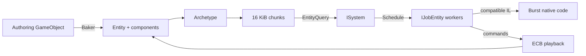

<TLDR>
  <TLDRCell label="what">
    Unity DOTS organizes runtime state as entities and components so systems can process data by component combination; the Job System schedules work, and Burst compiles compatible code to native machine code.
  </TLDRCell>
  <TLDRCell label="when">
    Consider DOTS when many objects perform similar CPU work and the Profiler has shown that data access or main-thread throughput is the bottleneck.
  </TLDRCell>
  <TLDRCell label="how">
    Design components and queries first, make job dependencies and structural-change playback points explicit, then confirm Burst and measure the result in a target build.
  </TLDRCell>
</TLDR>

## What it is and why it exists

Unity's Data-Oriented Technology Stack (DOTS) is a set of cooperating technologies. The Entities package provides an Entity Component System (ECS), the C# Job System schedules work on worker threads, and the Burst Compiler turns compatible .NET IL into machine code optimized for the target CPU. The three work well together, but Burst and the Job System don't require ECS.

An <Term id="entity-component-system">Entity Component System</Term> separates identity, data, and behavior. An entity is a versioned handle, a component stores state, and a system queries specific component combinations and runs logic. An entity isn't an object containing all of its fields and methods, and reducing it to "just an integer" misses its version semantics.

DOTS addresses bulk data processing. A conventional `MonoBehaviour` design may scatter fields of the same kind across many managed objects and update them through separate callbacks. Entities organizes data by component combination so a system can traverse tightly packed component arrays. This layout supports cache-friendly sequential access and gives the scheduler explicit read and write sets.

That doesn't make ECS the right model for every Unity project. UI, a few unique scene objects, editor tools, and logic dominated by object relationships are often clearer with `GameObject` and `MonoBehaviour`. DOTS suits numerous similarly shaped items whose CPU work can be expressed as data transformations. A Profiler capture on target hardware decides whether migration is worthwhile.

## How it works

A `World` owns entities, component storage, and systems. Every unique set of component types defines an <Term id="ecs-archetype">archetype</Term>, and entities in one archetype live in one or more <Term id="ecs-chunk">chunks</Term>. In Entities 1.4, a chunk is 16 KiB and holds one tightly packed array per component type plus an entity-ID array.

A system declares component access through a query. `SystemAPI.Query<RefRW<A>, RefRO<B>>()` means read and write `A`, but only read `B`; constraints such as `WithAll<T>()` and `WithNone<T>()` narrow the match. A query finds matching archetypes and chunks rather than scanning every entity and checking its types one at a time.



### Entities, components, and systems

A common runtime component is an unmanaged `struct` implementing `IComponentData`. Small components aren't a goal by themselves; boundaries should reflect data that systems actually read and write together. One large component containing fields that are never accessed together moves irrelevant data. Turning every scalar into a component makes archetypes and queries harder to reason about.

`ISystem` is the unmanaged system interface, and its lifecycle callbacks receive a `ref SystemState`. An ordinary `foreach` in `OnUpdate` still runs synchronously on the thread invoking that system. Work can reach worker threads only after a job is explicitly scheduled. Adding `[BurstCompile]` to a system doesn't make its loop parallel.

`SystemAPI` relies on source generation, so systems containing queries and `IJobEntity` types must be declared `partial`. Source-generated queries and access handles can produce compiler diagnostics under `Temp/GeneratedCode`. Diagnose the component access declared in your source; don't edit generated files.

### Job scheduling and dependencies

The parameters of `IJobEntity.Execute` define its query and access: `ref` means read-write, `in` means read-only, and an `Entity` passed by value supplies the current handle. Source generation turns `IJobEntity` into a chunk-oriented job. `ScheduleParallel` can distribute matching chunks across worker threads, but actual parallelism still depends on entity count, chunk count, batching, and other dependencies.

The returned `JobHandle` is a correctness contract. If this system's writes can overlap earlier jobs, the new job must depend on `state.Dependency`; after scheduling, the returned handle must be assigned back to `state.Dependency`. Missing either side hides the real dependency from later systems. Safety checks may catch that mistake, while builds without those checks can expose a race.

Calling `Complete()` in the middle of every frame makes the main thread wait. Some synchronization is necessary when main-thread code immediately consumes a job result, but mechanically completing every handle prevents the scheduler from overlapping work. Pass the dependency chain onward and complete it only at the boundary that actually needs the result.

### The Burst boundary

The <Term id="burst-compiler">Burst Compiler</Term> accepts the High-Performance C# subset. It works with value types, native containers such as `NativeArray`, and `Unity.Mathematics` operations. General managed objects, managed arrays, and arbitrary virtual calls don't belong in this compilation path. `[BurstCompile]` is a request, not proof of performance.

Editor Play mode and Player builds have different compilation paths. Development can temporarily execute a managed fallback while Burst compiles, so code running successfully doesn't prove that the target build used Burst. Inspect the Burst Inspector and compilation logs, then profile the target Player. Check that a managed field or unsupported call didn't push code out of the intended path.

### Structural changes and command buffers

Adding or removing a component and creating or destroying an entity are <Term id="structural-change">structural changes</Term>. When the component set changes, `EntityManager` moves the entity to another archetype and might allocate or release a chunk. Performing such changes carelessly while iterating a query can invalidate the storage being traversed.

An <Term id="entity-command-buffer">EntityCommandBuffer (ECB)</Term> records commands now and plays them back later at a defined system update. Jobs can record concurrently through `EntityCommandBuffer.ParallelWriter`; playback performs the actual storage changes. An ECB solves mutation timing and thread safety, but it doesn't remove the copying cost of the structural change itself.

For state that toggles frequently without changing shape, consider `IEnableableComponent`. Enabling or disabling one doesn't change the entity's archetype, and queries use its enabled bit to decide whether the entity matches. Low-frequency states that last many frames can still be better modeled by adding and removing a component. Converting every tag mechanically is not a useful rule.

### Baking turns authoring data into runtime data

A `MonoBehaviour` authoring component is convenient for designers, while a Baker converts it into entity components. Baking runs as part of the import and build data pipeline; it isn't a per-frame bridge that keeps a `GameObject` synchronized with an Entity. Runtime systems consume the baked result and shouldn't assume the authoring object remains present.

A Baker must declare dependencies on the Unity objects and assets it reads so incremental baking reruns when an input changes. Generated code often combines the old `ConvertToEntity` workflow with current Baker APIs. Even if that mixture looks like plausible Unity C#, it isn't the current Entities 1.4 workflow.

## Examples

These four examples start with baked data, then add a synchronous query, a parallel job, and a deferred structural change. They require the Unity Editor plus the Entities and Burst packages. The local toolchain has neither the Unity Editor nor those assemblies, so every block is marked unexecuted and no console output is fabricated.

### Define components and bake authoring data

`UnitAuthoring` holds editor input only. Its Baker gets an entity with dynamic transform usage and adds speed plus an enableable movement state as runtime components.

<Depth level="quick">

```csharp title="UnitAuthoring.cs"
// # not executed here: Unity Editor 6.6 and Entities 1.4.8 are unavailable.
using Unity.Entities;
using UnityEngine;

public struct MoveSpeed : IComponentData
{
    public float MetersPerSecond;
}

public struct Moving : IComponentData, IEnableableComponent
{
}

public sealed class UnitAuthoring : MonoBehaviour
{
    [Min(0f)] public float moveSpeed = 4f;

    public sealed class Baker : Baker<UnitAuthoring>
    {
        public override void Bake(UnitAuthoring authoring)
        {
            var entity = GetEntity(TransformUsageFlags.Dynamic);
            AddComponent(entity, new MoveSpeed
            {
                MetersPerSecond = authoring.moveSpeed
            });
            AddComponent<Moving>(entity);
        }
    }
}
```

```text
# not executed here: Unity Editor 6.6 and Entities 1.4.8 are unavailable.
```

</Depth>

`Moving` has no fields, but its enabled bit carries state. A system can pause a unit without removing the component, so pausing and resuming don't move the entity between archetypes. A conventional tag component may still be better if the state rarely changes.

### Query synchronously in an `ISystem`

This system walks the query directly in `OnUpdate`. `RefRW<LocalTransform>` declares a transform write and `RefRO<MoveSpeed>` declares a speed read. An entity with disabled `Moving` doesn't match the default query.

```csharp title="MovementSystem.cs"
// # not executed here: Unity Editor 6.6 and Entities 1.4.8 are unavailable.
using Unity.Burst;
using Unity.Entities;
using Unity.Mathematics;
using Unity.Transforms;

[BurstCompile]
public partial struct MovementSystem : ISystem
{
    [BurstCompile]
    public void OnUpdate(ref SystemState state)
    {
        var deltaTime = SystemAPI.Time.DeltaTime;

        foreach (var (transform, speed) in
                 SystemAPI.Query<RefRW<LocalTransform>, RefRO<MoveSpeed>>()
                     .WithAll<Moving>())
        {
            transform.ValueRW.Position += new float3(
                0f,
                0f,
                speed.ValueRO.MetersPerSecond * deltaTime);
        }
    }
}
```

```text
# not executed here: Unity Editor 6.6 and Entities 1.4.8 are unavailable.
```

Syntax doesn't tell you whether this loop should become a job. With few entities, scheduling overhead can erase the benefit. Schedule and measure when the main thread is over budget, the workload is large enough, and the access pattern permits parallel work.

### Schedule and preserve the dependency

Velocity integration can be expressed as an `IJobEntity`. The system passes the existing dependency to `ScheduleParallel` and retains the new handle so the next conflicting operation waits for it.

```csharp title="VelocitySystem.cs"
// # not executed here: Unity Editor 6.6 and Entities 1.4.8 are unavailable.
using Unity.Burst;
using Unity.Entities;
using Unity.Mathematics;
using Unity.Transforms;

public struct Velocity : IComponentData
{
    public float3 MetersPerSecond;
}

[BurstCompile]
public partial struct IntegrateVelocityJob : IJobEntity
{
    public float DeltaTime;

    private void Execute(ref LocalTransform transform, in Velocity velocity)
    {
        transform.Position += velocity.MetersPerSecond * DeltaTime;
    }
}

[BurstCompile]
public partial struct VelocitySystem : ISystem
{
    [BurstCompile]
    public void OnUpdate(ref SystemState state)
    {
        state.Dependency = new IntegrateVelocityJob
        {
            DeltaTime = SystemAPI.Time.DeltaTime
        }.ScheduleParallel(state.Dependency);
    }
}
```

```text
# not executed here: Unity Editor 6.6 and Entities 1.4.8 are unavailable.
```

There is no `Complete()` call here. As long as later access is also declared through ECS, the scheduler adds the necessary wait when the data is actually needed. Main-thread code that reads these transforms immediately would create a boundary where the matching dependency must be completed.

### Record a structural change from a parallel job

Adding a death tag changes the component set, so the job doesn't call `EntityManager` directly. It records commands through a parallel ECB and uses the chunk's query index as the sort key. `EndSimulationEntityCommandBufferSystem` plays the commands back later.

```csharp title="DeathSystem.cs"
// # not executed here: Unity Editor 6.6 and Entities 1.4.8 are unavailable.
using Unity.Burst;
using Unity.Entities;

public struct Health : IComponentData
{
    public float Value;
}

public struct Dead : IComponentData
{
}

[BurstCompile]
[WithNone(typeof(Dead))]
public partial struct MarkDeadJob : IJobEntity
{
    public EntityCommandBuffer.ParallelWriter Commands;

    private void Execute(
        [ChunkIndexInQuery] int chunkIndex,
        Entity entity,
        in Health health)
    {
        if (health.Value <= 0f)
            Commands.AddComponent<Dead>(chunkIndex, entity);
    }
}

[BurstCompile]
public partial struct DeathSystem : ISystem
{
    [BurstCompile]
    public void OnUpdate(ref SystemState state)
    {
        var commands = SystemAPI
            .GetSingleton<EndSimulationEntityCommandBufferSystem.Singleton>()
            .CreateCommandBuffer(state.WorldUnmanaged)
            .AsParallelWriter();

        state.Dependency = new MarkDeadJob { Commands = commands }
            .ScheduleParallel(state.Dependency);
    }
}
```

```text
# not executed here: Unity Editor 6.6 and Entities 1.4.8 are unavailable.
```

The sort key orders commands when playback merges the parallel streams. It isn't an entity ID and isn't stable across frames. If gameplay requires deterministic order, use explicit stable data rather than treating `ChunkIndexInQuery` as identity.

## Pitfalls

> [!PITFALL]
> Claiming code is faster just because it uses ECS, a job, or `[BurstCompile]` builds an architecture decision on an unmeasured assumption.

**Fix:** Find the specific CPU, synchronization, or allocation hotspot in the Unity Profiler first. Keep the workload and target hardware fixed, then compare Player builds before and after the change. Without measurements, describe the access pattern but don't publish multipliers or frame rates.

> [!PITFALL]
> Adding or removing components during query iteration can invalidate the view being traversed, while toggling components every frame repeatedly moves entities between archetypes.

**Fix:** Defer structural changes with an ECB during a job or iteration. Evaluate `IEnableableComponent` for frequently toggled state, keep normal add and remove operations for low-frequency persistent state, and inspect the structural-change cost in the Profiler.

> [!PITFALL]
> Scheduling a job without passing `state.Dependency` or without storing the returned handle loses ordering against other component readers and writers.

**Fix:** Pass the prior dependency into the schedule call and assign the result back to `state.Dependency`. Call `Complete()` only when a consumer needs the result immediately; don't use a frame-by-frame sync point to hide missing dependency declarations.

> [!PITFALL]
> A Burst job captures a `string`, managed array, `GameObject`, or ordinary `List<T>`, so it can't enter the expected Burst compilation path.

**Fix:** Put the Burst boundary around an unmanaged data transformation and use the appropriate native containers. Keep logging, object lookup, and other managed work outside that boundary, then confirm Burst is active in the target build.

> [!PITFALL]
> Treating an ECB like an immediate `EntityManager` reads entities or components that don't exist until playback, and the wrong playback point can add a frame of latency.

**Fix:** Name the producing system, playback system, and first consumer. A temporary entity created by an ECB can be referenced by later commands in that same buffer, but runtime state must be obtained after playback.

> [!PITFALL]
> Generated code mixes old tutorial APIs such as `Translation`, `ConvertToEntity`, or `Entities.ForEach` with Entities 1.4 APIs such as `LocalTransform`, Bakers, and `SystemAPI`.

**Fix:** State Entities 1.4.8 as the target and verify every symbol against that version's API or official samples. Use the upgrade guide for old code rather than replacing type names and assuming behavior stayed the same.

## In the AI era

**What generated code gets wrong here**

Models readily splice together different DOTS generations. They might generate the old `Entities.ForEach` API inside an `ISystem`, retain `Translation` after `LocalTransform` replaced it, omit `partial`, discard the handle returned by `ScheduleParallel()`, call `EntityManager` from a job, or create an ECB that is neither registered with an ECB system nor played back manually.

Other failures are subtler. A model treats `[BurstCompile]` as proof while adding managed fields to a job, uses `[EntityIndexInQuery]` as a cheap index despite its base-index calculation cost, mistakes a parallel ECB sort key for gameplay order, or adds and removes a component every frame for transient state. The result can pass ordinary C# parsing but fail during Unity source generation, Jobs safety checks, Burst compilation, or ECB playback.

**Ask your AI to check**

- List every system and job's component read/write set, then trace where `state.Dependency` enters, returns, and is first completed.
- Mark every structural change, the ECB that records it, the system that plays it back, and the first system that can observe the result.
- Verify every API against Entities 1.4.8 and Burst 1.8.30, and list any managed type or call that prevents Burst compilation.

**Review checklist**

- Run boundary cases with the Jobs Debugger and safety checks enabled, looking for undeclared read/write conflicts.
- Inspect every `Schedule` and `ScheduleParallel` return value, every ECB owner, and every playback point.
- Confirm Burst in a target Player and compare frame time, main-thread waits, and allocations under the same workload.

**Prompt vocabulary**

Use the exact terms `archetype`, `chunk`, `component access mode`, `job dependency`, `structural change`, `EntityCommandBuffer playback`, `enableable component`, and `Burst-compatible HPC#`. Put `Unity 6.6`, `Entities 1.4.8`, and `Burst 1.8.30` in the prompt. "Write DOTS code" alone invites version mixing.

<Depth level="deep">

## The cost model of archetypes and chunks

An archetype is defined by a set of component types, not component values. Two entities with different health values share an archetype when their component types match exactly. Adding `Dead` changes the type set and moves an entity to another archetype. Archetypes created during a world's lifetime remain until the `World` is destroyed, so unconstrained combinations of tags can make the archetype count grow.

A chunk holds one array per component type, with the same index identifying an entity across those arrays. Sequential query traversal lets the CPU read the fields a system needs contiguously. Larger components reduce the number of entities that fit in 16 KiB. Putting rarely used large fields in a hot component lowers chunk capacity and moves extra memory.

After an entity leaves a chunk, Entities can move the last entity into the empty slot. Chunk order is therefore not stable gameplay order, and an array position is not a persistent ID. If an operation requires deterministic ordering, store an explicit key and sort at an appropriate boundary instead of relying on current iteration order.

Shared components influence grouping by value, so many distinct values can fragment chunks. Use them when a shared value genuinely drives filtering or batching, not as free compression for ordinary components. Inspect occupancy, unused space, and query behavior in the Archetypes window and Profiler before choosing them.

### Enableable components and query masks

`IEnableableComponent` keeps component storage in place and changes only its enabled state. Default queries treat a disabled component as absent, so one component type set can represent frequently toggled state. This avoids archetype movement, but the system still processes enabled masks and the data still occupies chunk space.

A job with write access to an enableable component can make a main-thread query wait even when the job only changes enabled bits. The scheduler protects correctness according to declared write access. If a query introduces an unexpected sync point, inspect its access mode and timing rather than disabling safety restrictions.

A change filter records a chunk-level version; it doesn't prove that each entity's value changed. A system obtaining write access can update a change version even when it writes back the same value. Change filters can skip chunks known not to have been written, but they don't replace per-entity business change detection.

## Scheduling, dependencies, and sync points

The ECS scheduler derives dependencies from component types and access modes. Read-only jobs can overlap; a writer must be ordered against readers and writers of the same component. `state.Dependency` carries the relationships this system inherits, and the returned handle publishes this system's work to later systems.

A dependency expresses execution order, not a domain completion event. Even after a job completes, commands in an ECB don't change entity storage until the corresponding buffer system plays them back. Confusing "job complete" with "entity changed" is a common reason a later system observes old state.

Some main-thread APIs automatically complete conflicting jobs. That behavior preserves correctness but can create a hard-to-find wait spike. When the Profiler shows waiting, trace the first caller that requests protected data. Moving `Complete()` earlier only relocates the wait; it doesn't reduce the work.

Parallelism also has fixed costs: creating jobs, building or updating queries, dividing batches, and combining dependencies. A small loop left in a Burst-compiled `ISystem.OnUpdate` may be faster and clearer. Measurement is the only way to locate that boundary.

## ECB timing and order

An ECB separates deciding on a change from applying it. Between recording and playback, another system may destroy or reshape the target entity, so a command's preconditions must survive that interval. Use query constraints, system ordering, or validation at the boundary as needed; don't assume a condition observed at record time remains true.

`ParallelWriter` commands carry sort keys used to merge concurrent recording during playback. `ChunkIndexInQuery` fits the batching pattern shown in official samples, but it isn't a stable number across frames. When the domain meaning of two commands depends on order, encode priority explicitly or consolidate results before one stage records commands.

Choosing `BeginSimulation`, `EndSimulation`, or another ECB system changes when results become visible. Later playback can keep work parallel longer, but a consumer may not see the change until a later phase or frame. System groups plus `[UpdateBefore]` and `[UpdateAfter]` should express actual data dependencies, not merely make log messages look ordered.

An ECB can refer to an entity it created earlier in that same buffer. The placeholder handle can be used by later `AddComponent` or `SetComponent` commands in the buffer, but it isn't an entity present in `EntityManager` before playback. Storing it in an ordinary runtime collection and querying it immediately is a lifetime bug.

## The baking and runtime boundary

Authoring types express data for people and the editor; runtime components express access patterns for systems. The mapping needn't be one-to-one. One Baker can derive several components or entities from a hierarchy, prefab, and assets, and can fold editor-only fields into a precomputed result.

Baking must be repeatable. Equivalent inputs should produce equivalent entity data without depending on Play-mode time, global random state, or an implicit singleton outside the scene. A Baker that reads another object or asset should declare that dependency so incremental baking doesn't retain stale output after the input changes.

Managed components can bridge data that has to remain in the object world, but they restrict Burst, scheduling, and serialization choices. Separate plain data from managed references, then keep the small amount of bridge work in an explicit system. If every entity synchronizes with a `GameObject` in both directions every frame, the migration boundary is probably misplaced.

SubScenes and baking don't repair a poor data model. Component boundaries still need to follow query and write relationships. Entity references must also handle targets that aren't loaded yet or have already been unloaded, and streaming tests should cover those temporarily invalid references.

## Let measurements decide whether to use DOTS

The fixed frame rates, memory totals, and multipliers in the old drafts had no test project, hardware, build settings, or sampling method, so they were removed. DOTS performance depends on component size, entity count, access pattern, sync points, Burst status, and the target CPU. A universal multiplier without that context can't be reproduced.

A useful comparison fixes scene input, Player build, target device, frame-rate policy, and sampling interval. Record main-thread and worker time, waits, GC allocations, structural-change locations, and entity scale. Editor data helps locate a problem; the final conclusion should come from a build close to the shipping configuration.

Verify equivalent behavior before comparing performance. A faster implementation isn't comparable when update order, collision fidelity, or visible entity count differs. Warm up Burst compilation and asset loading so one-time costs don't contaminate steady-state frames.

If the bottleneck is on the GPU, in render submission, on the network, or on disk, rewriting an ECS system might not change frame time. DOTS is a CPU data-processing toolset, not a general speed switch. Start the optimization boundary where the Profiler points.

</Depth>

<Checkpoint id="gamedev/unity-dots" />

## Further reading

- [Official Unity samples: project setup](https://raw.githubusercontent.com/Unity-Technologies/EntityComponentSystemSamples/master/EntitiesSamples/Docs/project_setup.md)
- [Official Unity samples: entities and components](https://raw.githubusercontent.com/Unity-Technologies/EntityComponentSystemSamples/master/EntitiesSamples/Docs/entities-components.md)
- [Official Unity samples: systems](https://raw.githubusercontent.com/Unity-Technologies/EntityComponentSystemSamples/master/EntitiesSamples/Docs/systems.md)
- [Official Unity samples: entities and jobs](https://raw.githubusercontent.com/Unity-Technologies/EntityComponentSystemSamples/master/EntitiesSamples/Docs/entities-jobs.md)
- [Official Unity samples: entity command buffers](https://raw.githubusercontent.com/Unity-Technologies/EntityComponentSystemSamples/master/EntitiesSamples/Docs/entity-command-buffers.md)
- [Official Unity samples: baking](https://raw.githubusercontent.com/Unity-Technologies/EntityComponentSystemSamples/master/EntitiesSamples/Docs/baking.md)
