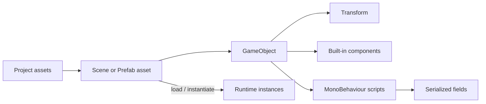

<TLDR>
  <TLDRCell label="what">
    Unity organizes scene content as GameObjects. Components provide rendering, physics, and custom behavior, while a Transform places each object in a hierarchy.
  </TLDRCell>
  <TLDRCell label="trap">
    Inspector values come from serialized data and may differ from field initializers in the script. Unity also gives no default lifecycle order across different objects.
  </TLDRCell>
  <TLDRCell label="fix">
    Compose behavior from small components, connect dependencies explicitly, distinguish local from world coordinates, and treat a Prefab asset, instance, and override as different states.
  </TLDRCell>
</TLDR>

## What it is and why it exists

Unity is a real-time engine with a visual editor. The engine handles scenes, asset import, rendering, physics, and platform builds, while game rules are usually expressed as C# components. You don't have to assemble the entire main loop, but your code must fit Unity's object model and callback timing.

A <Term id="game-object">GameObject</Term> is the basic object in a scene. Characters, cameras, lights, colliders, and empty organization nodes all appear as GameObjects. A GameObject mainly carries a name, activation state, tag, hierarchy position, and components; its useful behavior comes from the components attached to it.

A <Term id="unity-component">Unity component</Term> is one composable piece of functionality. A `MeshRenderer` draws a mesh, a `Collider` participates in collision detection, and a script derived from `MonoBehaviour` supplies project-specific behavior. Components let you assemble an object without growing an inheritance tree of enemy, flying enemy, and glowing flying enemy classes.

Every GameObject has exactly one `Transform`, and you can't remove it. The Transform records position, rotation, scale, and parent-child relationships. The boundary between GameObjects, components, and transforms is the common starting point for reading the Inspector, writing scripts, and diagnosing scene bugs.

You meet these concepts as soon as you arrange a scene, attach a script, configure a Prefab, respond to a collision, or move something each frame. Coroutines, Addressables, object pools, and DOTS all build on this model, but each brings separate design concerns that don't belong in an introductory fundamentals topic.

## How it works

A Unity project keeps editable content in `Assets/`, package dependencies in `Packages/`, and project-wide settings in `ProjectSettings/`. `Library/` contains imported results and caches that Unity can rebuild, so it isn't hand-maintained source. The Project window displays assets, while the Hierarchy displays GameObjects in the current scene; they aren't two views of the same tree.

The Scene view is where you edit the world. The Game view shows the output of active cameras. When you select an asset or scene object, the Inspector shows its editable data. The Console collects compiler errors, warnings, and `Debug.Log` output; when scripts don't compile, fix the first compiler error before chasing the ones that follow it.

A scene stores a GameObject hierarchy and the serialized state of its components. A Prefab stores a reusable GameObject hierarchy as a project asset. In Play mode, code works on loaded or instantiated objects. Stopping Play mode normally discards changes made to scene instances while the game was running.



### GameObjects and component composition

A GameObject owns its components. A component reaches its owner through `gameObject` and that owner's Transform through `transform`. By default, `GetComponent<T>()` and `TryGetComponent<T>()` only inspect the same GameObject; searching a parent or child requires the corresponding API.

When a script requires another component on the same object, `[RequireComponent(typeof(...))]` can state that minimum setup. Unity adds a missing dependency when the script is attached, but it doesn't revisit old instances when the script later gains a new requirement. Runtime code still needs a defined failure path for optional references and external input.

A component's enabled state and its GameObject's active state are separate layers. `Behaviour.enabled = false` stops that behavior from receiving ordinary update callbacks, but it doesn't hide the whole object. `gameObject.SetActive(false)` makes the object and its descendants inactive in the scene, even though a child may still report its own `activeSelf` as `true`.

Tags are suitable for a small set of stable categories. Layers are primarily consumed by systems such as rendering culling and physics filtering. Don't turn a name into an identity protocol. Renaming a scene object breaks code built on `GameObject.Find("Player")`, and you only discover the break at runtime.

Common built-in components each provide one part of an object's capability:

- `Transform` stores spatial relationships, and every GameObject has one.
- `MeshFilter` supplies mesh data, while `MeshRenderer` controls how it is drawn.
- `Rigidbody` and `Collider` make an object participate in 3D physics and collision detection.
- `Camera` defines a view and output, while `AudioSource` plays audio.
- A `MonoBehaviour` script connects project logic to Unity's messages and serialization system.

### Transform hierarchies and coordinates

`transform.position` and `transform.rotation` are in world space. `localPosition` and `localRotation` are relative to the parent Transform. With no parent, the position values usually agree. Once a parent moves, rotates, or scales, the same local value maps to a different world result.

Parenting expresses a spatial dependency and also propagates activation. A weapon attached to a character's hand, a UI element under a Canvas, and an effect attached to a hit point are sensible hierarchies. If you only want a tidier Hierarchy and don't want inherited transforms, parenting is the wrong organization tool.

Before changing a parent, decide whether world pose or local pose should stay fixed. `SetParent(parent, true)` tries to preserve world position, rotation, and scale; `SetParent(parent, false)` preserves values relative to the new parent. Generated code that leaves this decision implicit often makes an object jump when it is reparented.

Physics objects are usually driven through a `Rigidbody`, not by direct Transform writes that compete with the physics simulation every frame. Ordinary visual motion should use `Time.deltaTime`, while physics writes follow the appropriate fixed-update policy. Full timing and physics contracts belong to the `game-loop` and physics topics.

### MonoBehaviour fields and messages

A class derived from `MonoBehaviour` can be attached to a GameObject as a script component. Unity invokes messages such as `Awake`, `OnEnable`, `Start`, `Update`, and `OnDisable` by convention; your code doesn't assemble them into an ordinary call chain. If a method name or signature is wrong, the compiler doesn't necessarily report a failed interface implementation.

On one component's first activation, `Awake` normally runs before `OnEnable`, followed by `Start` before the first frame update. `OnEnable` may run many times, while `Start` runs only once during that instance's lifetime, after its first enable. A GameObject that begins a scene inactive delays `Awake` until activation.

Don't assume one GameObject's `Awake` runs before another GameObject's `Awake`. If initialization has an ordering dependency, establish it with an explicit bootstrapper, an event, or a documented Script Execution Order constraint. Treating a usual accident as a contract produces intermittent null references as a scene grows.

A <Term id="serialized-field">serialized field</Term> hands script data to Unity for storage and Inspector editing. A common declaration is `[SerializeField] private float speed = 3f;`: the field stays private while a designer can configure each instance. A public field should represent a real code API, not a workaround for Inspector visibility.

Serialized values belong to scene or asset data. After a component has stored `speed = 3`, changing the script initializer to `5` doesn't overwrite the existing instance's `3`. When "the new default in code" appears to do nothing, inspect the component value and Prefab overrides first.

### Prefab assets and instances

A <Term id="prefab">Prefab</Term> is a GameObject hierarchy saved as an asset. Enemies, pickups, projectiles, and repeated UI rows make good Prefabs because their structure, components, and default configuration can be maintained in one place. `Instantiate` creates an instance, not another Prefab asset.

A Prefab instance retains a connection to its asset. Changes to the Prefab asset flow to properties that an instance hasn't overridden, while instance overrides remain in place. Apply writes selected overrides back to the asset; Revert makes the instance use asset values again. Those operations move data in opposite directions.

Prefabs can be nested and can have Variants. Nesting works for real ownership relationships, while a Variant works for a small, stable set of differences. If two variants disagree on most of their structure, separate Prefabs are usually clearer than a long stack of overrides.

Runtime changes to an instance don't rewrite the Prefab asset in the project. Data that must survive between runs needs a deliberate save system; neither the Inspector nor a Prefab silently becomes a player save. ScriptableObjects can hold shared configuration, but their lifecycle and persistence semantics deserve their own topic.

## Examples

These four examples form a small coin pickup system. First a coin rotates, then a component stores the count, a trigger connects the two, and a spawner creates Prefab instances. They require the Unity runtime. The local toolchain has neither the Unity Editor nor the `UnityEngine` assemblies, so the blocks are marked unexecuted and no console output is invented.

### Give one component one job

`SpinPickup` is responsible only for visual rotation. Its speed comes from the Inspector, and it doesn't know how a coin is scored or destroyed.

<Depth level="quick">

```csharp title="SpinPickup.cs"
// # not executed here: Unity Editor 6.6 is not installed in the local toolchain.
using UnityEngine;

[DisallowMultipleComponent]
public sealed class SpinPickup : MonoBehaviour
{
    [SerializeField, Min(0f)]
    private float degreesPerSecond = 90f;

    private void Awake()
    {
        Debug.Log($"spin ready: {name} at {degreesPerSecond} deg/s");
    }

    private void Update()
    {
        var step = degreesPerSecond * Time.deltaTime;
        transform.Rotate(0f, step, 0f, Space.Self);
    }
}
```

```text
# not executed here: Unity Editor 6.6 is not installed in the local toolchain.
```

</Depth>

Once the script is attached to the coin Prefab root, `Update` only changes its owner's Transform. Multiplication by `Time.deltaTime` makes `degreesPerSecond` an angle per second rather than an angle per frame. `DisallowMultipleComponent` prevents two copies of the rotation behavior from being attached accidentally.

There is no global lookup and no assumption that a manager exists in the scene. The component only depends on its owning GameObject and Transform, both of which the component model guarantees.

### Keep domain state in a component

`CoinInventory` owns the coin count and exposes a narrow mutation method. The Inspector doesn't need to write the runtime count directly, so the property isn't serialized.

```csharp title="CoinInventory.cs"
// # not executed here: Unity Editor 6.6 is not installed in the local toolchain.
using System;
using UnityEngine;

public sealed class CoinInventory : MonoBehaviour
{
    public int Count { get; private set; }

    public void Add(int amount)
    {
        if (amount <= 0)
            throw new ArgumentOutOfRangeException(nameof(amount));

        Count += amount;
        Debug.Log($"coins: {Count}");
    }
}
```

```text
# not executed here: Unity Editor 6.6 is not installed in the local toolchain.
```

Other components can read `Count`, but only `CoinInventory` can change it. Rejecting a non-positive amount surfaces the error at the boundary instead of waiting until the UI displays a negative total.

If the count must persist to disk, put that concern behind a dedicated persistence boundary. Inspector visibility doesn't turn a field into a player save automatically.

### Compose components through a trigger

The coin component owns its value and one-shot collection state. The player component only forwards a trigger event to the coin; it doesn't mutate the coin's fields directly.

```csharp title="CoinPickup.cs"
// # not executed here: Unity Editor 6.6 is not installed in the local toolchain.
using UnityEngine;

[RequireComponent(typeof(Collider))]
public sealed class CoinPickup : MonoBehaviour
{
    [SerializeField, Min(1)]
    private int value = 1;

    private bool collected;

    private void Reset()
    {
        GetComponent<Collider>().isTrigger = true;
    }

    public bool TryCollect(CoinInventory inventory)
    {
        if (collected || inventory == null)
            return false;

        collected = true;
        inventory.Add(value);
        Debug.Log($"picked: {name}");
        Destroy(gameObject);
        return true;
    }
}
```

```text
# not executed here: Unity Editor 6.6 is not installed in the local toolchain.
```

`RequireComponent` ensures that an object has a Collider when the script is added, while `Reset` supplies the editor default for a newly added or manually reset component. Neither replaces Prefab validation: an old asset can still retain an unsuitable configuration.

The `collected` guard handles another trigger before `Destroy` takes effect. If this object later moves into a pool, its reuse entry point must reset that state. That extra lifecycle contract is part of pooled-object design.

The player side retrieves a dependency from the same object. This version requires the trigger Collider and `CoinPickup` to live on the same GameObject, and the Prefab should be built to that contract.

```csharp title="PlayerCollector.cs"
// # not executed here: Unity Editor 6.6 is not installed in the local toolchain.
using UnityEngine;

[RequireComponent(typeof(CoinInventory))]
public sealed class PlayerCollector : MonoBehaviour
{
    private CoinInventory inventory;

    private void Awake()
    {
        inventory = GetComponent<CoinInventory>();
    }

    private void OnTriggerEnter(Collider other)
    {
        if (other.TryGetComponent<CoinPickup>(out var pickup))
            pickup.TryCollect(inventory);
    }
}
```

```text
# not executed here: Unity Editor 6.6 is not installed in the local toolchain.
```

If the Collider lives on a child of the coin, make the contract explicit with `GetComponentInParent<CoinPickup>()` and test the nested hierarchy. Don't try same-object, parent, child, and scene-wide searches in succession "to make sure it works"; that hides a broken Prefab setup.

### Instantiate a Prefab

`CoinSpawner` receives a typed Prefab reference and a parent Transform. It assigns local coordinates explicitly after instantiation, so the position array is relative to `spawnRoot`.

```csharp title="CoinSpawner.cs"
// # not executed here: Unity Editor 6.6 is not installed in the local toolchain.
using UnityEngine;

public sealed class CoinSpawner : MonoBehaviour
{
    [SerializeField] private CoinPickup coinPrefab;
    [SerializeField] private Transform spawnRoot;
    [SerializeField] private Vector3[] localPositions =
    {
        new(-2f, 0.5f, 0f),
        new(0f, 0.5f, 0f),
        new(2f, 0.5f, 0f)
    };

    private void Start()
    {
        if (coinPrefab == null || spawnRoot == null)
        {
            Debug.LogError("CoinSpawner is not configured.", this);
            enabled = false;
            return;
        }

        foreach (var localPosition in localPositions)
        {
            var coin = Instantiate(coinPrefab, spawnRoot);
            coin.transform.SetLocalPositionAndRotation(
                localPosition,
                Quaternion.identity);
        }

        Debug.Log($"spawned: {localPositions.Length}");
    }
}
```

```text
# not executed here: Unity Editor 6.6 is not installed in the local toolchain.
```

The field type is `CoinPickup`, so the Inspector only accepts a compatible object that has that component. Unlike a string address, a direct reference also lets Unity see the resource connection when it builds dependencies.

The component validates cross-object references in `Start` and disables itself when configuration is missing. If the spawn count becomes high or instances are reused frequently, use Profiler evidence before adding a pool manager. Three startup instances don't justify that machinery.

## Pitfalls

> [!PITFALL]
> Calling `GameObject.Find`, `FindFirstObjectByType`, or hierarchy searches repeatedly in `Update` turns object wiring into a global query every frame. Renaming and activation state can also affect correctness.

**Fix:** Serialize stable references in the Inspector, or cache same-object components in `Awake`. When objects genuinely require dynamic discovery, define registration, unregistration, and missing-object behavior instead of falling back to a search every frame.

> [!PITFALL]
> Making every field `public` for Inspector visibility turns an editing requirement into permission for any code to mutate the state.

**Fix:** Default to `[SerializeField] private`. Expose a property or method only when callers genuinely need access, and enforce ranges, null handling, and state transitions at that boundary.

> [!PITFALL]
> Assuming `GetComponent<T>()` always succeeds means one missing Prefab component produces a `NullReferenceException` somewhere less useful.

**Fix:** State required same-object dependencies with `[RequireComponent]` and validate them in `Awake`; branch on optional capabilities with `TryGetComponent`. An error should name both the missing component and the misconfigured object.

> [!PITFALL]
> Implementing "units per second" as `transform.position += velocity` without a time increment makes speed depend on frame rate. Direct Transform writes can also fight the physics simulation on a Rigidbody object.

**Fix:** Decide whether this is ordinary Transform motion or Rigidbody motion before choosing the update phase and API. Ordinary per-second motion uses `Time.deltaTime`; physics behavior follows the fixed-timestep and Rigidbody contract.

> [!PITFALL]
> Treating `activeSelf` as the object's final scene state produces `true` even when an inactive parent suppresses it.

**Fix:** Use `activeSelf` for the local switch and `activeInHierarchy` for the effective hierarchy state. Test parent deactivation, local child deactivation, and reactivation as distinct paths.

> [!PITFALL]
> Treating a Prefab instance override as an asset default, or tuning an object in Play mode and immediately stopping, leaves the change at the wrong layer or loses it entirely.

**Fix:** Before editing, check whether the Inspector shows the Prefab asset or a scene instance. Apply overrides that should become defaults, keep instance-only differences as overrides, and record values that must move out of Play mode before you exit it.

## In the AI era

**What generated code gets wrong here**

Models often invent a global manager for every behavior, then call `GameObject.Find` from `Update` to reach it. They also expose all state publicly for the Inspector. Older training examples may use the string overload of `AddComponent`, assume a cross-object `Awake` order, or conflate a Prefab asset with a scene instance and a runtime clone. The nastiest failures compile cleanly but leave a Collider, tag, layer, or serialized reference unconfigured in the asset.

**Ask your AI to check**

- List every same-object component, external reference, tag, and layer required by each `MonoBehaviour`, then say where each dependency is validated.
- Trace every Transform write: local or world space, per frame or per second, and whether a Rigidbody also owns the object.
- Label every Prefab edit as an asset default, instance override, or runtime-only state change.

**Review checklist**

- Exercise missing required references, initially inactive objects, and a parent disabled at runtime.
- Search for per-frame object lookup, unconditional `GetComponent`, public mutable fields, and misspelled message signatures.
- Compare the Prefab asset with instance overrides, then re-enter Play mode and confirm that expected state still exists.

**Prompt vocabulary**

Use precise terms: `GameObject`, `component composition`, `serialized field`, `local space`, `world space`, `activeSelf`, `activeInHierarchy`, `Prefab instance`, and `Prefab override`. Ask for both the Inspector setup contract and the runtime failure path. "Write a Unity script" says nothing about the object graph the script expects.

<Depth level="deep">

## Serialization is an authoring boundary

Unity serialization isn't a general-purpose store for any C# object graph. It saves scenes, assets, and fields that meet Unity's rules. Common supported types include primitives, enums, selected Unity value types, references to `UnityEngine.Object`, serializable classes and structs, and a single-level array or `List<T>` of supported elements.

Static, constant, and readonly fields aren't serialized as ordinary instance data. A property doesn't appear in the Inspector merely because it has a public setter. You can target an auto-property's backing field with `[field: SerializeField]`, though an ordinary private field is often easier to read.

Unity doesn't directly serialize dictionaries, multidimensional arrays, jagged arrays, or nested containers by default. Translate those shapes into supported list data or implement serialization callbacks when necessary. Hiding everything in an opaque JSON string to bypass the Inspector costs reference validation, useful diffs, and editing ergonomics.

Ordinary custom classes are serialized inline by value by default. If two C# fields refer to the same ordinary managed object, that shared identity isn't necessarily preserved after serialization and loading. When polymorphic references, shared references, or cycles are requirements, study `[SerializeReference]` and its constraints instead of assuming ordinary C# reference semantics survive.

### Defaults, migration, and validation

A field initializer is only the starting value for a new component. Once a scene or Prefab stores the field, serialized data wins. Before changing a default across a project, separate the default for new instances from migration of existing assets; they are different operations.

Renaming a serialized field directly can disconnect old data from the field. Use Unity's field-rename migration attribute when the data must survive, then open and verify affected scenes and Prefabs. A type change also needs a migration plan; a successful compilation isn't evidence that authoring data survived.

`OnValidate` can clamp ranges or report invalid combinations when editor data changes, but it may run often and shouldn't own runtime initialization. `Awake` must still enforce invariants needed by a Player build. The two hooks protect different boundaries rather than replacing each other.

## Lifecycle is a per-instance timeline

Read Unity's message order separately for one instance and for different instances. One instance has useful phase relationships. Across different GameObjects, an order that wasn't configured should rarely enter the business contract. Scene loading, runtime instantiation, and reactivation also create different timelines.

`Awake` is a good place to establish references and invariants internal to one object. It isn't a good place to assume another object has already run its own `Awake`. `Start` occurs later, but an object instantiated afterward still breaks the global assumption that "all Start calls have finished."

`OnEnable` and `OnDisable` are natural pairs for event subscription and unsubscription. Because one instance can be enabled many times, the methods must tolerate repeated cycles. Subscribing without unsubscribing lets an inactive object keep receiving messages or creates duplicate handlers after reactivation.

### Activation, disabling, and destruction

Disabling a `MonoBehaviour` changes that behavior's enabled state; it isn't the same as disabling its whole GameObject. Deactivating a GameObject affects the effective active state of its descendants and invokes the corresponding disable messages. A review must name which layer an operation changes.

`Destroy` doesn't make an ordinary C# reference become a literal `null` immediately. `UnityEngine.Object` implements special equality behavior, so a destroyed object can compare equal to null while its managed wrapper still exists. Don't substitute intuition about the null-conditional operator for an explicit Unity object lifetime check.

Destruction and disabling also mean different things in the domain. Temporary hiding, suspended behavior, and permanent removal shouldn't share a vague `Deactivate()` method. A name should say whether the action is reversible, who reverses it, and whether the state must persist.

## A Prefab is an object graph with provenance

A Prefab is more than an object that is convenient to copy. It stores components, child hierarchies, serialized references, and defaults, while each instance can record overrides relative to its source. To review a Prefab defect, inspect the asset, scene instance, and runtime clone. The script alone can't reconstruct the full setup.

A Prefab asset can't depend on an object that only exists in one scene for its reusable configuration. A spawner, installer, or component that owns the scene context should inject that dependency after instantiation. Otherwise, the same Prefab enters another scene with a missing reference.

A typed field gives the editor more information than a broad `GameObject` field. If a spawner needs `CoinPickup`, declare `CoinPickup coinPrefab` so code and the Inspector state the same requirement. With only a `GameObject`, every use site has to search for and validate the component again.

### Verify the complete object graph

A component test shouldn't call only one method in isolation. Build the same component combination as the Prefab and exercise initial inactivity, an absent optional dependency, parent transforms, and repeated events before destruction. These cases expose wiring defects that a script-only test misses.

Prefab overrides belong in review as well. After a base Prefab changes a Collider or serialized value, an old instance override can continue to mask the fix. Compare the asset with its instance and make sure every surviving override has an owner and purpose.

Reload the scene after a Play mode check, then exercise the important path again. Behavior that only works on the first run often points to static state, a missing event unsubscription, or a runtime edit that wasn't restored. If it works in the editor but fails in a Player build, inspect editor-only APIs, resource references, and build inclusion.

</Depth>

<Checkpoint id="gamedev/unity-fundamentals" />

## Further reading

- [Unity C# reference: GameObject bindings](https://raw.githubusercontent.com/Unity-Technologies/UnityCsReference/master/Runtime/Export/Scripting/GameObject.bindings.cs)
- [Microsoft Learn: GameObjects and C# scripts in Unity](https://learn.microsoft.com/en-us/shows/beginners-series-to-unity/gameobjects-and-c-scripts-3-of-7)
- [Microsoft Learn: Beginner's Series to Unity](https://learn.microsoft.com/en-us/shows/beginners-series-to-unity/)
- [Microsoft Learn: Unity performance recommendations](https://learn.microsoft.com/en-us/windows/mixed-reality/develop/unity/performance-recommendations-for-unity)
- [Microsoft C# guide: fields](https://learn.microsoft.com/en-us/dotnet/csharp/programming-guide/classes-and-structs/fields)
- [Microsoft C# reference: general attributes](https://learn.microsoft.com/en-us/dotnet/csharp/language-reference/attributes/general)
