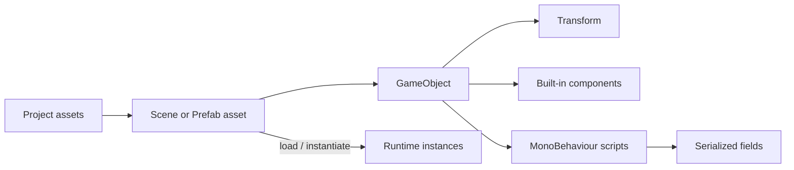

<TLDR>
  <TLDRCell label="what">
    Unity把场景内容组织成GameObject；组件提供渲染、物理与自定义行为，Transform则定义对象在层级中的位置。
  </TLDRCell>
  <TLDRCell label="trap">
    Inspector中的值来自序列化数据，不一定等于脚本里的字段初始值；跨对象的生命周期回调顺序也没有默认保证。
  </TLDRCell>
  <TLDRCell label="fix">
    用小组件组合行为，显式连接依赖，区分局部坐标与世界坐标，并把Prefab资源、实例和override当成三种不同状态。
  </TLDRCell>
</TLDR>

## 是什么，为什么存在

Unity是带有可视化编辑器的实时应用引擎。场景、资源导入、渲染、物理和平台构建由引擎负责，游戏规则通常用C#组件表达。你不需要自己搭建完整主循环，但必须按Unity的对象模型和回调时机组织代码。

<Term id="game-object">GameObject（游戏对象）</Term>是场景中的基本对象。角色、相机、灯光、碰撞体和空的组织节点都以GameObject出现。GameObject主要承载名称、激活状态、标签、层级和组件；真正的功能来自挂在它上面的组件。

<Term id="unity-component">Unity组件（Unity component）</Term>是一块可组合功能。`MeshRenderer`负责显示网格，`Collider`参与碰撞检测，继承`MonoBehaviour`的脚本则提供项目自己的行为。一个对象可以组合多种组件，而不必继承出一棵“敌人、飞行敌人、会发光的飞行敌人”类层级。

每个GameObject都有且只有一个不可移除的`Transform`。它记录位置、旋转、缩放与父子关系。理解GameObject、组件和Transform之间的边界，是阅读Inspector、编写脚本和定位场景问题的共同起点。

初次接触Unity时，你会在摆放场景对象、给对象挂脚本、配置Prefab、响应碰撞或逐帧移动时遇到这些概念。协程、Addressables、对象池和DOTS都建立在这套基础模型之上，但它们各自有独立的设计问题，不属于本主题的入门范围。

## 工作原理

Unity项目把可编辑内容放在`Assets/`，把包依赖记录在`Packages/`，把项目级设置放在`ProjectSettings/`。`Library/`是导入结果与缓存，可以由Unity重建，不应当作手写源文件。Project窗口显示资源，Hierarchy显示当前场景中的GameObject，两者不是同一棵树。

Scene视图用于编辑世界，Game视图显示活动相机的输出。选中资源或场景对象后，Inspector显示其可编辑数据。Console收集编译错误、警告与`Debug.Log`输出；脚本不能编译时，先处理第一条编译错误，因为后续错误常是连锁反应。

场景保存GameObject层级及其组件的序列化状态。Prefab则把一棵可复用的GameObject层级保存为项目资源。进入播放模式后，运行时操作的是加载或实例化出来的对象；停止播放通常会丢弃播放期间对场景实例做的修改。



### GameObject与组件组合

GameObject是组件的共同所有者。组件通过`gameObject`取得所属对象，通过`transform`取得该对象的Transform。`GetComponent<T>()`与`TryGetComponent<T>()`默认只检查同一个GameObject；查找父级或子级要显式使用对应API。

一个脚本依赖同对象上的另一组件时，可以用`[RequireComponent(typeof(...))]`表达最低配置要求。Unity在添加该脚本时补上缺失依赖，但不会回头修复已经存在、后来才出现新依赖要求的旧实例。运行时仍要为可选引用和外部输入定义失败路径。

组件是否启用与GameObject是否活动是两层状态。`Behaviour.enabled = false`会停止该行为接收常规更新回调，但不会让整个对象消失。`gameObject.SetActive(false)`会让对象及其子层级在场景中变为非活动状态，子对象自己的`activeSelf`仍可能是`true`。

标签适合表达少量稳定分类，层（layer）主要供渲染剔除与物理过滤等系统使用。不要把名称当作身份协议。场景中改名后，依赖`GameObject.Find("Player")`的代码会在运行时才暴露问题。

常见内置组件各自只负责一部分能力：

- `Transform`保存空间关系，每个GameObject必有一个。
- `MeshFilter`与`MeshRenderer`分别提供网格数据和绘制方式。
- `Rigidbody`与`Collider`让对象参与3D物理模拟和碰撞检测。
- `Camera`定义视图与输出，`AudioSource`播放音频。
- `MonoBehaviour`脚本把项目逻辑接入Unity的消息与序列化系统。

### Transform层级与坐标

`transform.position`和`transform.rotation`表示世界坐标；`localPosition`和`localRotation`表示相对父Transform的坐标。没有父级时，两组位置通常一致。一旦父级发生移动、旋转或缩放，同一个局部值会映射到新的世界结果。

父子关系表达空间依赖，也影响激活状态传播。武器挂在角色手部、UI元素挂在Canvas、粒子效果挂在命中点，都是合适的层级关系。若只是想整理Hierarchy，却不希望对象继承父级变换，就不应随意建立父子关系。

重新设置父级时，要先决定保留世界姿态还是保留局部姿态。`SetParent(parent, true)`尝试保持世界位置、旋转和缩放；`SetParent(parent, false)`保留相对新父级的局部值。生成代码若省略这个设计选择，经常会让对象在换父级时突然跳动。

物理对象通常由`Rigidbody`驱动，不应同时在每帧直接改Transform与物理系统争夺位置。普通视觉运动要乘`Time.deltaTime`，物理写入则按对应固定更新策略处理。更完整的时序与物理约束分别属于`game-loop`和物理主题。

### MonoBehaviour、字段与回调

继承`MonoBehaviour`的类可以作为脚本组件挂到GameObject。Unity按约定调用`Awake`、`OnEnable`、`Start`、`Update`和`OnDisable`等消息；它们不是由你的代码直接组成的一条普通调用链。方法名或签名写错时，编译器未必能把它当作接口实现错误提示出来。

同一组件上，首次激活时通常先执行`Awake`，再执行`OnEnable`，随后在第一次帧更新前执行`Start`。`OnEnable`可以反复出现，`Start`在该实例存活期间只在首次启用后调用一次。场景开始时处于非活动状态的GameObject，会推迟`Awake`，直到它被激活。

不要默认一个GameObject的`Awake`一定先于另一个GameObject的`Awake`。当对象间存在初始化依赖时，应通过显式引导器、事件或Script Execution Order中经过说明的约束建立顺序。把“通常碰巧如此”当作契约，会让场景规模扩大后出现间歇性空引用。

<Term id="serialized-field">序列化字段（serialized field）</Term>把脚本数据交给Unity保存，并在Inspector中提供编辑入口。常见写法是`[SerializeField] private float speed = 3f;`：字段保持私有，设计师仍能配置实例。公开字段应表示真实的代码API，而不是只为了让Inspector看见。

序列化值属于场景或资源数据。一个组件已经保存过`speed = 3`后，把脚本初始值改成`5`，不会自动覆盖现有实例中的`3`。因此，排查“代码明明写了新默认值”时，应先查看Inspector与Prefab override。

### Prefab资源与实例

<Term id="prefab">Prefab（预制体）</Term>是保存为资源的GameObject层级模板。敌人、拾取物、弹丸和重复UI行适合做成Prefab，因为结构、组件和默认配置可以集中维护。`Instantiate`创建的是实例，不是第二个Prefab资源。

Prefab实例保持与资源的连接。修改Prefab资源后，未被实例override的属性会反映变化；实例自己的override会保留。Apply把选定override写回资源，Revert则让实例重新采用资源值，这两个操作的影响方向相反。

Prefab也可以嵌套，并可创建Variant。嵌套适合真正的所有权关系，Variant适合少量稳定差异。若变体之间大部分结构不同，强行继承只会堆积难以追踪的override，此时独立Prefab更清楚。

运行时修改实例不会改写项目中的Prefab资源。若数据需要跨运行保存，应使用明确的存档系统，而不是期待Inspector或Prefab自动记录播放状态。ScriptableObject适合共享配置，但其生命周期和保存语义属于独立主题。

## 示例

下面四个示例构成一个小型硬币拾取系统：先让硬币旋转，再保存数量、处理触发器，最后从Prefab生成一组实例。它们依赖Unity运行时；本地工具链没有Unity Editor，也没有`UnityEngine`程序集，因此按约定标记为未执行，没有伪造日志。

### 让一个组件只做一件事

`SpinPickup`只负责视觉旋转。速度由Inspector配置，代码不需要知道硬币如何计分或销毁。

<Depth level="quick">

```csharp title="SpinPickup.cs"
// # not executed here: Unity Editor 6.6 is not installed in the local toolchain.
using UnityEngine;

[DisallowMultipleComponent]
public sealed class SpinPickup : MonoBehaviour
{
    [SerializeField, Min(0f)]
    private float degreesPerSecond = 90f;

    private void Awake()
    {
        Debug.Log($"spin ready: {name} at {degreesPerSecond} deg/s");
    }

    private void Update()
    {
        var step = degreesPerSecond * Time.deltaTime;
        transform.Rotate(0f, step, 0f, Space.Self);
    }
}
```

```text
# not executed here: Unity Editor 6.6 is not installed in the local toolchain.
```

</Depth>

将脚本挂到硬币Prefab根对象后，`Update`只改变所属Transform。乘上`Time.deltaTime`后，`degreesPerSecond`表示每秒角度，而不是每帧角度。`DisallowMultipleComponent`避免同一对象误挂两份旋转脚本。

这段代码没有全局查找，也没有假定场景中存在某个管理器。它的依赖只有所属GameObject与Transform，而这两项由组件模型保证。

### 用组件保存领域状态

`CoinInventory`拥有硬币数量，并为修改提供窄接口。Inspector不需要直接写入运行时计数，所以该属性没有序列化。

```csharp title="CoinInventory.cs"
// # not executed here: Unity Editor 6.6 is not installed in the local toolchain.
using System;
using UnityEngine;

public sealed class CoinInventory : MonoBehaviour
{
    public int Count { get; private set; }

    public void Add(int amount)
    {
        if (amount <= 0)
            throw new ArgumentOutOfRangeException(nameof(amount));

        Count += amount;
        Debug.Log($"coins: {Count}");
    }
}
```

```text
# not executed here: Unity Editor 6.6 is not installed in the local toolchain.
```

`Count`对其他组件可读，但只能由`CoinInventory`修改。拒绝非正数让错误靠近入口暴露，而不是等UI显示出负数后再猜来源。

若数量需要保存到磁盘，应把持久化放在专门边界。把字段显示在Inspector，并不等于它会自动成为玩家存档。

### 通过触发器组合组件

硬币组件拥有自己的价值与一次性领取状态。玩家组件只负责把触发器事件转交给硬币，不直接改写硬币内部字段。

```csharp title="CoinPickup.cs"
// # not executed here: Unity Editor 6.6 is not installed in the local toolchain.
using UnityEngine;

[RequireComponent(typeof(Collider))]
public sealed class CoinPickup : MonoBehaviour
{
    [SerializeField, Min(1)]
    private int value = 1;

    private bool collected;

    private void Reset()
    {
        GetComponent<Collider>().isTrigger = true;
    }

    public bool TryCollect(CoinInventory inventory)
    {
        if (collected || inventory == null)
            return false;

        collected = true;
        inventory.Add(value);
        Debug.Log($"picked: {name}");
        Destroy(gameObject);
        return true;
    }
}
```

```text
# not executed here: Unity Editor 6.6 is not installed in the local toolchain.
```

`RequireComponent`保证添加脚本时对象至少有一个Collider，`Reset`则为新添加或手动重置的组件设置编辑器默认值。它们不会替代Prefab验证：旧资源仍可能保留不合要求的配置。

`collected`在`Destroy`真正生效前挡住重复触发。若以后改用对象池，就需要在复用入口重置该状态；这正是池化对象额外承担的生命周期契约。

玩家侧通过同对象查找取得依赖。这个版本要求触发器Collider与`CoinPickup`位于同一个GameObject，Prefab结构应按这条契约搭建。

```csharp title="PlayerCollector.cs"
// # not executed here: Unity Editor 6.6 is not installed in the local toolchain.
using UnityEngine;

[RequireComponent(typeof(CoinInventory))]
public sealed class PlayerCollector : MonoBehaviour
{
    private CoinInventory inventory;

    private void Awake()
    {
        inventory = GetComponent<CoinInventory>();
    }

    private void OnTriggerEnter(Collider other)
    {
        if (other.TryGetComponent<CoinPickup>(out var pickup))
            pickup.TryCollect(inventory);
    }
}
```

```text
# not executed here: Unity Editor 6.6 is not installed in the local toolchain.
```

如果Collider放在硬币子对象，就应把查找契约明确改成`GetComponentInParent<CoinPickup>()`，并测试嵌套层级。不要同时尝试同对象、父级、子级和全场景查找来“确保能找到”，那会掩盖Prefab配置错误。

### 从Prefab创建实例

`CoinSpawner`接收类型化的Prefab引用与父Transform。生成后显式设置局部坐标，使位置数组相对`spawnRoot`表达。

```csharp title="CoinSpawner.cs"
// # not executed here: Unity Editor 6.6 is not installed in the local toolchain.
using UnityEngine;

public sealed class CoinSpawner : MonoBehaviour
{
    [SerializeField] private CoinPickup coinPrefab;
    [SerializeField] private Transform spawnRoot;
    [SerializeField] private Vector3[] localPositions =
    {
        new(-2f, 0.5f, 0f),
        new(0f, 0.5f, 0f),
        new(2f, 0.5f, 0f)
    };

    private void Start()
    {
        if (coinPrefab == null || spawnRoot == null)
        {
            Debug.LogError("CoinSpawner is not configured.", this);
            enabled = false;
            return;
        }

        foreach (var localPosition in localPositions)
        {
            var coin = Instantiate(coinPrefab, spawnRoot);
            coin.transform.SetLocalPositionAndRotation(
                localPosition,
                Quaternion.identity);
        }

        Debug.Log($"spawned: {localPositions.Length}");
    }
}
```

```text
# not executed here: Unity Editor 6.6 is not installed in the local toolchain.
```

字段类型是`CoinPickup`，所以Inspector只能接受含该组件的兼容对象。与字符串地址相比，直接引用还能让Unity在构建依赖关系时看到这个资源连接。

该组件在`Start`中验证跨对象依赖，并在配置缺失时停止自己。生成数量高或实例频繁复用时，再根据Profiler证据考虑对象池；三个启动实例不需要先引入池管理器。

## 陷阱

> [!PITFALL]
> 在`Update`中反复调用`GameObject.Find`、`FindFirstObjectByType`或层级搜索，会把对象连接变成每帧全局查询，也让改名与激活状态影响正确性。

**修复方法：** 在Inspector中序列化稳定引用，或在`Awake`中缓存同对象组件。必须动态发现对象时，定义注册、注销与缺失对象策略，不要依赖每帧搜索兜底。

> [!PITFALL]
> 为了显示Inspector而把所有字段改成`public`，会把编辑需求误写成对其他代码的修改权限。

**修复方法：** 默认使用`[SerializeField] private`。只有调用方确实需要读写时才公开属性或方法，并在入口维护范围、空值和状态转换规则。

> [!PITFALL]
> 假定`GetComponent<T>()`一定成功，Prefab少挂一个组件就会在更远的代码行触发`NullReferenceException`。

**修复方法：** 必需的同对象依赖用`[RequireComponent]`表达，并在`Awake`验证；可选能力使用`TryGetComponent`分支。错误信息应指出缺少哪个组件以及哪个对象配置错误。

> [!PITFALL]
> 用`transform.position += velocity`编写“每秒”移动，却没有乘时间增量，速度会随帧率变化；同时直接改物理对象Transform还可能与物理模拟冲突。

**修复方法：** 先确定是普通Transform运动还是Rigidbody运动，再选择更新阶段与API。按秒的普通运动使用`Time.deltaTime`，物理行为按固定时间步和Rigidbody契约实现。

> [!PITFALL]
> 把`activeSelf`当成对象在场景中的最终活动状态，父级禁用时仍可能读到`true`。

**修复方法：** 检查局部开关时用`activeSelf`，检查层级中的实际状态时用`activeInHierarchy`。测试父级禁用、子级局部禁用与重新激活三条路径。

> [!PITFALL]
> 把Prefab实例override当成资源默认值，或在播放模式中调好参数后直接停止，修改会留在错误层级或完全丢失。

**修复方法：** 修改前确认Inspector顶部显示的是Prefab资源还是场景实例。需要推广的override明确Apply，只属于当前实例的差异保留为override，并在退出播放模式前记录需要迁回编辑数据的值。

<Depth level="deep">

## 序列化是编辑数据边界

Unity序列化的目标不是保存任意C#对象图，而是保存场景、资源和可编辑字段。字段必须满足Unity支持的规则，常见可用类型包括基本值、枚举、部分Unity内置类型、`UnityEngine.Object`引用、可序列化类与结构，以及受支持元素的一层数组或`List<T>`。

静态字段、常量和只读字段不按普通实例字段序列化。属性也不会因为有公开setter就自动显示在Inspector。需要序列化自动属性的backing field时，可以显式使用`[field: SerializeField]`，但普通私有字段通常更容易看懂。

Unity默认不直接序列化字典、多维数组、锯齿数组或嵌套容器。需要这些形状时，可以把数据转成受支持的列表结构，或实现序列化回调。不要为绕过Inspector限制而直接换成不透明JSON字符串，那会牺牲引用检查、差异审查和编辑体验。

普通自定义类默认以内联值形式序列化。两个字段在C#中指向同一个普通托管对象，序列化再加载后不一定继续共享同一实例。确实需要多态引用、共享引用或循环图时，先研究`[SerializeReference]`的约束，不要假定C#引用语义会自动保留。

### 默认值、迁移与验证

字段初始值只为新建组件提供起点。场景或Prefab已经保存该字段后，序列化数据优先。批量调整默认值前，应区分新实例的默认值与现有资产迁移，这两件事需要不同操作。

直接重命名序列化字段可能让旧数据失去对应关系。需要保留数据时，使用Unity提供的字段重命名迁移属性，并实际打开受影响的场景和Prefab验证结果。类型变化同样需要迁移计划，不能只依赖编译通过。

`OnValidate`可以在编辑器数据变化时夹取范围或报告无效组合，但它可能频繁执行，也不应承担运行时初始化。`Awake`仍要维护Player构建真正依赖的不变量。两个入口服务于不同边界，不是二选一。

## 生命周期是每个实例的时间线

Unity的消息顺序应按“同一实例”与“不同实例”分别理解。同一实例有可依赖的阶段关系；不同GameObject之间，如果没有配置脚本执行顺序，顺序通常不应进入业务契约。场景加载、运行时实例化和重新激活还会产生不同时间线。

`Awake`适合建立本对象内部引用和不变量。它不适合假定另一个对象已经执行自己的`Awake`。`Start`发生得更晚，但运行时随后实例化的新对象仍可能打破“所有Start都已完成”这种全局假设。

`OnEnable`与`OnDisable`适合成对订阅和取消订阅事件。因为一个实例能被多次启用，这些方法必须允许重复周期。只订阅不取消，会让禁用对象继续收到消息，或在重新启用后形成重复处理器。

### 激活、禁用与销毁

禁用一个`MonoBehaviour`只改变该行为的enabled状态，不等同于禁用整个GameObject。禁用GameObject会沿层级影响子对象的实际活动状态，并触发相应的禁用消息。代码审查时必须指出操作的是哪一层。

`Destroy`不等于普通C#引用立即变成真正的`null`。`UnityEngine.Object`为相等比较实现了特殊语义，被销毁的对象在`== null`检查中可以表现为空，而托管包装对象仍可能存在。不要用空条件运算符的直觉替代Unity对象生命周期检查。

销毁与禁用也代表不同领域含义。临时隐藏、暂停行为和永久移除不应共用一个含糊的`Deactivate()`方法。名称应说明调用后是否能恢复、谁负责恢复，以及状态是否需要持久化。

## Prefab是带来源的对象图

一个Prefab不只是“方便复制的对象”。它保存组件、子层级、序列化引用与默认值，实例还记录相对来源的override。审查Prefab问题时，应同时查看资源、场景实例与运行时克隆，单看脚本无法还原完整配置。

Prefab资源不能依赖某个场景里才存在的对象来完成通用配置。场景依赖应由生成器、安装器或拥有场景上下文的组件在实例化后注入。否则，同一Prefab放到另一场景时就会缺引用。

类型化字段比宽泛的`GameObject`字段提供更多编辑期约束。需要`CoinPickup`时直接声明`CoinPickup coinPrefab`，能让代码和Inspector同时表达要求。若只声明`GameObject`，每个使用点都要再次查找和验证组件。

### 验证完整对象图

组件测试不应只调用一个方法。至少要构建与Prefab相同的组件组合，覆盖初始非活动、缺少可选依赖、父级变换以及销毁前重复事件。这样才能发现脚本单独测试时看不到的连接错误。

Prefab override也应进入审查。基础Prefab改了Collider或序列化值后，旧实例的override可能继续遮住修复。比较资源与实例差异，确认保留下来的每个override都有意图。

播放模式验证结束后重新加载场景，再运行一次关键路径。若行为只在第一次运行正确，通常存在静态状态、事件退订或运行时修改未恢复的问题。若编辑器里正确而Player构建失败，则应检查编辑器专用API、资源引用和构建包含关系。

</Depth>

<Checkpoint id="gamedev/unity-fundamentals" />

## 延伸阅读

- [Unity C#参考：GameObject bindings](https://raw.githubusercontent.com/Unity-Technologies/UnityCsReference/master/Runtime/Export/Scripting/GameObject.bindings.cs)
- [Microsoft Learn：Unity中的GameObject与C#脚本](https://learn.microsoft.com/en-us/shows/beginners-series-to-unity/gameobjects-and-c-scripts-3-of-7)
- [Microsoft Learn：Unity初学者系列](https://learn.microsoft.com/en-us/shows/beginners-series-to-unity/)
- [Microsoft Learn：Unity性能建议](https://learn.microsoft.com/en-us/windows/mixed-reality/develop/unity/performance-recommendations-for-unity)
- [Microsoft C#指南：字段](https://learn.microsoft.com/en-us/dotnet/csharp/programming-guide/classes-and-structs/fields)
- [Microsoft C#参考：通用特性](https://learn.microsoft.com/en-us/dotnet/csharp/language-reference/attributes/general)
