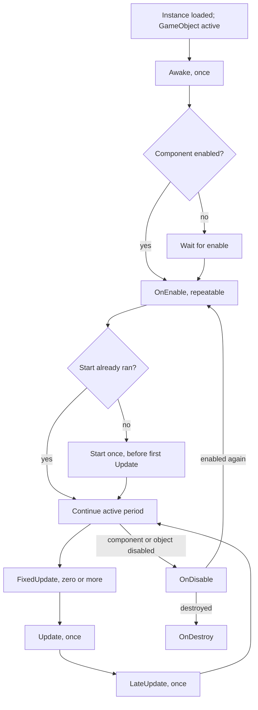

<TLDR>
  <TLDRCell label="what">
    `MonoBehaviour` is the base class for script components that attach to GameObjects. Unity invokes methods with recognized names and signatures when object state changes and at defined PlayerLoop phases.
  </TLDRCell>
  <TLDRCell label="trap">
    Similar callbacks on different objects have no default order, `OnEnable` can repeat, and disabling a MonoBehaviour does not automatically stop its coroutines.
  </TLDRCell>
  <TLDRCell label="fix">
    Initialize the component itself in `Awake`, acquire and release resources at matching lifecycle boundaries, and replace implicit cross-object ordering with explicit dependencies.
  </TLDRCell>
</TLDR>

## What it is and why it exists

`MonoBehaviour` derives from `Behaviour` and is a <Term id="unity-component">Unity component</Term>. A C# class that inherits it can attach to a <Term id="game-object">GameObject</Term> and receive engine messages such as `Awake`, `OnEnable`, `Start`, and `Update`. Not every Unity script derives from it: editor tools, `ScriptableObject` assets, ordinary C# classes, and DOTS systems use different base types or entry points.

Unity already owns the PlayerLoop, so scene scripts usually do not write the top-level `while` loop. `MonoBehaviour` supplies entry points: initialize when an object loads, acquire active-period resources when enabled, run game logic during frame phases, and release ownership when disabled or destroyed. The engine controls timing; the script keeps each callback focused and its behavior easy to reason about.

This model connects scene objects to the runtime loop. Designers configure components in the Inspector, while the GameObject's active state, the component's enabled state, and the current PlayerLoop phase determine which messages arrive at runtime. You meet this lifecycle in character controls, cameras, UI, scene services, object pools, and coroutine owners.

The lifecycle is not a global initialization scheduler. It guarantees some relationships inside one instance but does not, by default, say which of two GameObjects receives `Awake` first. When one object depends on another being ready, use an explicit bootstrap phase, registration event, constructed data, or a documented execution-order constraint.

## How it works

Unity recognizes a defined set of message names and signatures by convention. These methods are not virtual members on `MonoBehaviour` waiting to be overridden, so they are commonly written as `private void Awake()` rather than `override`. If you misspell a name or use the wrong parameters, the C# type system might not warn you; the method can compile and never receive an engine call.

Three pieces of state decide whether a message arrives: whether the GameObject is active in the hierarchy, whether `Behaviour.enabled` is `true`, and which phases this instance has already passed. `Behaviour.isActiveAndEnabled` combines the first two. Treating "exists," "active," and "enabled" as one Boolean idea is where many lifecycle bugs begin.

The usual first-run path looks like this. The diagram shows common script messages, not the complete PlayerLoop, and it does not imply a default order between different instances.



### Initialization phases

`Awake` runs at most once in an instance lifetime. It suits same-GameObject reference setup, private runtime state creation, and serialized-configuration validation. A component on an active GameObject receives `Awake` even when its own `enabled` flag is `false`; an initially inactive GameObject delays `Awake` until it is first activated. Do not rewrite "scene loading" as "Unity immediately calls Awake on every instance."

`OnEnable` runs when the component becomes both active and enabled. It runs on the first active period and again after every disable-enable cycle. That makes it a good home for listeners, registrations, and repeatable state that exist only during the active period, but a poor place to append one-time data unconditionally.

`Start` runs only once per instance and waits until the component is enabled, immediately before its first frame update. The initial path is usually `Awake`, `OnEnable`, then `Start`; later enables call only `OnEnable` again. If `Start` creates a subscription and `OnDisable` removes it, enabling the component again will not restore it.

For objects that are already active when a scene begins, Unity finishes those objects' `Awake` calls before any `Start` call. This guarantee is not a permanent, application-wide phase: instantiating objects during play introduces new `Awake` and `OnEnable` calls. Code should depend on local contracts, not assume that "all Awake calls are over forever."

### Per-frame phases

`FixedUpdate` is scheduled on a fixed timestep. There may be no fixed step before a rendered frame, or Unity may catch up with several; it is not "exactly once per frame." Code that applies forces or writes physics state through a `Rigidbody` should respect the physics boundary and use `Time.fixedDeltaTime` when a calculation needs an explicit time scale.

`Update` runs once per rendered frame on an active and enabled behaviour. Input sampling, non-physics state machines, and visual logic advanced by `Time.deltaTime` commonly live here. Scene searches, component lookups, logging, and allocations on this path should be judged with Profiler evidence, not the slogan that "Update is always slow."

`LateUpdate` runs after the normal `Update` phase and is commonly used to read a target pose already changed during the frame, as a following camera does. It provides a phase boundary; it does not automatically solve smoothing, physics interpolation, or order among different `LateUpdate` scripts. A camera still needs an explicit target, missing-target policy, and time model.

One-shot input must survive the boundary between `Update` and `FixedUpdate`. Setting a jump flag in `Update` and clearing it only after a fixed step consumes it prevents a mismatch in render and physics step counts from losing or duplicating the action. A continuous direction can simply retain its latest value for every fixed step.

### Disabling and destruction

`OnDisable` runs when a component stops being both active and enabled. That includes disabling the component, deactivating its GameObject, and destroying an active object. The message can occur many times, so cleanup should be safe to repeat. Release subscriptions, registrations, and temporary handles acquired in `OnEnable` here.

Disabling a `MonoBehaviour` does not stop a <Term id="coroutine">coroutine</Term> that it started. If the coroutine must not change state outside the active period, retain its `Coroutine` handle and stop it explicitly in `OnDisable`. Deactivating the GameObject does stop its coroutines, but reactivation does not resume an iterator that was stopped.

`OnDestroy` fits resources owned by the whole instance rather than one enabled period. Unity calls it only for objects on GameObjects that were active at least once, so it is not the sole safety net for a configured object that never activated. Native handles, files, and external connections also need an explicit ownership protocol instead of relying only on an application-shutdown callback.

## Examples

The next four components build from lifecycle observation to active-period subscriptions, fixed-step physics, and a post-update camera. They need the Unity runtime and scene configuration. This workspace has no Unity Editor, `UnityEngine` assemblies, or C# compiler, so every block is explicitly marked unexecuted and no console output is fabricated.

### Observe one instance's transitions

Attach `LifecycleTrace` to an empty GameObject, then toggle the component and object in the Inspector. It does not flood `Update` with logs, so every output corresponds to a lifecycle boundary.

<Depth level="quick">

```csharp title="LifecycleTrace.cs"
// # not executed here: Unity Editor 6.6 and UnityEngine are unavailable.
using UnityEngine;

public sealed class LifecycleTrace : MonoBehaviour
{
    private void Awake() => Write("Awake");

    private void OnEnable() => Write("OnEnable");

    private void Start() => Write("Start");

    private void OnDisable() => Write("OnDisable");

    private void OnDestroy() => Write("OnDestroy");

    private void Write(string message)
    {
        Debug.Log($"{name}: {message}", this);
    }
}
```

```text
# not executed here: Unity Editor 6.6 and UnityEngine are unavailable.
```

</Depth>

One initially active, enabled instance passes through `Awake`, `OnEnable`, and `Start` in that order. Disabling and enabling it later adds one `OnDisable`, `OnEnable` pair but does not print `Awake` or `Start` again. Logs from different objects can interleave and do not create a cross-object guarantee.

This probe is temporary diagnostic code, not a dependency mechanism. If a test must verify order, record structured entries and assert only the partial-order relationships documented by Unity.

### Tie a subscription to the active period

`SceneLoadLogger` receives scene-load events only while it is active. Acquisition and release occupy matching callbacks, so repeated enables do not leave duplicate subscriptions behind.

```csharp title="SceneLoadLogger.cs"
// # not executed here: Unity Editor 6.6 and UnityEngine are unavailable.
using UnityEngine;
using UnityEngine.SceneManagement;

public sealed class SceneLoadLogger : MonoBehaviour
{
    private void OnEnable()
    {
        SceneManager.sceneLoaded += HandleSceneLoaded;
    }

    private void OnDisable()
    {
        SceneManager.sceneLoaded -= HandleSceneLoaded;
    }

    private void HandleSceneLoaded(Scene scene, LoadSceneMode mode)
    {
        Debug.Log($"loaded: {scene.name} ({mode})", this);
    }
}
```

```text
# not executed here: Unity Editor 6.6 and UnityEngine are unavailable.
```

Choosing `OnEnable` and `OnDisable` declares that the component does not listen while disabled. If the requirement says a hidden component must keep listening, choose a longer ownership boundary and spell out its release path; do not move only the unsubscribe operation without defining the lifetime.

Removing an identical, currently unregistered handler with `-=` is safe, which helps cleanup remain idempotent. Symmetry still matters: subscribing with a lambda in `OnEnable` and creating a second lambda in `OnDisable` will not remove the original delegate instance.

### Drive a Rigidbody on fixed steps

`RigidbodyDriver` retains the latest direction received from an external input adapter and applies force to its own body in `FixedUpdate`. It does not care whether the command came from the legacy input API, the Input System package, or an AI controller.

```csharp title="RigidbodyDriver.cs"
// # not executed here: Unity Editor 6.6 and UnityEngine are unavailable.
using UnityEngine;

[RequireComponent(typeof(Rigidbody))]
public sealed class RigidbodyDriver : MonoBehaviour
{
    [SerializeField, Min(0f)]
    private float acceleration = 12f;

    private Rigidbody body;
    private Vector2 moveInput;

    private void Awake()
    {
        body = GetComponent<Rigidbody>();
    }

    public void SetMoveInput(Vector2 input)
    {
        moveInput = Vector2.ClampMagnitude(input, 1f);
    }

    private void FixedUpdate()
    {
        var direction = new Vector3(moveInput.x, 0f, moveInput.y);
        body.AddForce(direction * acceleration, ForceMode.Acceleration);
    }
}
```

```text
# not executed here: Unity Editor 6.6 and UnityEngine are unavailable.
```

`RequireComponent` declares a same-object dependency, and `Awake` caches the lookup once. The attribute helps add the dependency when the script is attached, but it does not retroactively repair every old Prefab after a requirement is introduced; teams still need Prefab validation and a clear diagnostic for invalid setup.

Direction is a continuous command, so retaining its latest value is enough. Edge events such as jump and fire need a separate buffer and consumption rule; never assume each `Update` is followed by exactly one `FixedUpdate`.

### Follow a target in LateUpdate

Finally, the camera reads a target pose after its normal frame logic has completed. The target is explicitly wired in the Inspector; if it is missing, the component reports which object is misconfigured and stops updating.

```csharp title="FollowCamera.cs"
// # not executed here: Unity Editor 6.6 and UnityEngine are unavailable.
using UnityEngine;

public sealed class FollowCamera : MonoBehaviour
{
    [SerializeField]
    private Transform target;

    [SerializeField]
    private Vector3 offset = new(0f, 5f, -8f);

    private void Awake()
    {
        if (target != null)
            return;

        Debug.LogError($"{name}: follow target is missing.", this);
        enabled = false;
    }

    private void LateUpdate()
    {
        transform.position = target.position + offset;
        transform.LookAt(target);
    }
}
```

```text
# not executed here: Unity Editor 6.6 and UnityEngine are unavailable.
```

This version deliberately does not claim that "LateUpdate removes jitter." When physics drives the target, camera quality also depends on Rigidbody interpolation, render timing, and the chosen smoothing algorithm. `LateUpdate` guarantees only that this camera logic follows the normal `Update` phase.

Validating a serialized target in `Awake` does not depend on the target's own initialization, so it creates no cross-object ordering issue. If this callback instead calls a runtime service on the target, the design must first define when that service becomes ready.

## Pitfalls

> [!PITFALL]
> Reading a singleton field set by another object's `Awake` creates an undeclared cross-object ordering dependency. As a scene grows, execution order changes, or an object is instantiated at runtime, that read can intermittently return `null`.

**Fix:** Keep `Awake` to the component itself and same-object dependencies. Use an explicit bootstrap, dependency injection, or ready event for cross-object services; if Script Execution Order is truly required, document the participating script classes and reason, then protect the constraint with a test.

> [!PITFALL]
> Subscribing in `Start` but unsubscribing in `OnDisable` disconnects the component permanently after its first disable. `Start` does not run again when the component is re-enabled.

**Fix:** Pair callbacks on the same ownership period. Use `OnEnable` and `OnDisable` for active-period subscriptions; an instance-period subscription needs a defined acquisition point, destruction cleanup, and policy for an object that never activates.

> [!PITFALL]
> Treating `enabled = false` as coroutine cancellation lets an existing coroutine keep changing state. Enabling the component later can then start a second instance alongside the first.

**Fix:** Retain the handle returned by `StartCoroutine`, stop it explicitly when ownership ends, and clear the field. State whether a repeat request is ignored, replaced, queued, or run in parallel, and test component disable, GameObject deactivation, and destruction separately.

> [!PITFALL]
> Applying physics forces in `Update`, or sampling a one-shot button only in `FixedUpdate`, mixes render-frame cadence with physics-step cadence. A slow frame can contain several fixed steps, while a fast frame can have none.

**Fix:** Sample and retain commands in their input phase, then consume physics commands in `FixedUpdate`. Continuous values keep their latest state; one-shot actions need an explicit buffering and clearing rule.

> [!PITFALL]
> Treating `OnDestroy` as a `finally` that every object must reach misses GameObjects that were never active and stakes external-resource correctness on application-shutdown behavior.

**Fix:** Release active-period resources early in `OnDisable` and give instance-period resources an idempotent, explicit ownership protocol. A non-Unity resource that must be released should have a directly testable close method; `OnDestroy` may call it but should not be its only entry point.

> [!PITFALL]
> Writing `OnEnabled`, giving `Awake` the wrong parameters, or generating `override void Start()` can silently omit a callback or fail compilation. A method that looks like a lifecycle hook is not necessarily a Unity message.

**Fix:** Check the exact name, return type, and parameters against the current Unity API, and remove nonexistent `override` modifiers. Trigger the state transition with a minimal probe or Play Mode test instead of treating an error-free editor as proof that the callback works.

## In the AI era

**What generated code gets wrong here**

Models often generalize from ordinary C# inheritance and produce `protected override void Awake()`, even though these messages are not virtual base-class members. They also put one-time initialization in repeatable `OnEnable`, or subscribe in `Start` and unsubscribe in `OnDisable`, making the second active period behave differently. More subtle failures assume a stable order for every object's `Awake`, or assume that disabling a component cancels coroutines and asynchronous work.

Generated movement code also treats `Update`, `FixedUpdate`, and `LateUpdate` as interchangeable names. The result may apply force per rendered frame, lose one-shot input, or make a camera read the target's earlier pose. Another real failure mode is an `async void` lifecycle method whose cancellation is not tied to the GameObject lifetime; after destruction, its continuation can still touch an invalid Unity object.

**Ask your AI to check**

- List the exact signature, maximum call count, and triggering state for every Unity message, then mark which initialization repeats after re-enable.
- Trace every subscription, coroutine handle, and asynchronous cancellation source from acquisition through disable, deactivation, destruction, and exception paths.
- Find every readiness assumption across GameObjects and say whether it comes from documentation, project settings, an explicit handshake, or merely the logs from the current scene.

**Review checklist**

- Test initially active, initially inactive, initially disabled, disable-enable, and destruction paths separately instead of using one path as the whole lifecycle.
- Check that physics writes, input sampling, and camera reads use the intended phases, and verify that a one-shot command is consumed once.
- Confirm that every acquisition has a release at the same lifecycle boundary and that re-enable does not multiply subscriptions, coroutines, or static state.

**Prompt vocabulary**

Use the exact terms `Unity message`, `PlayerLoop phase`, `activeInHierarchy`, `Behaviour.enabled`, `isActiveAndEnabled`, `fixed timestep`, `script execution order`, and `lifetime ownership`. Ask for a state-transition table and resource-ownership table; "optimize this MonoBehaviour" is too vague to expose incorrect assumptions.

<Depth level="deep">

## Execution-order boundaries

Most lifecycle guarantees are partial orders between phases, not a complete ordering of every script. For one initially active and enabled instance, you can rely on `Awake` preceding `OnEnable` and `Start` preceding its first `Update`. For scene objects that are already active at startup, you can rely on their `Awake` calls finishing before any `Start`, but not on the relative order of two `Awake` calls.

Frame phases likewise provide broad boundaries: fixed-step scripts, normal update scripts, and late-update scripts enter their corresponding PlayerLoop positions. The order of the same message across different instances should not become a business contract by default. Only configured script-class order or your own scheduler adds a finer constraint.

The common state transitions fit in this table. "Wait" means the message has not happened yet, not that Unity permanently skips it.

| Operation or initial state | `Awake` | `OnEnable` / `Start` | Frame callbacks | Leaving active period |
|---|---|---|---|---|
| Active object, enabled component | Once | `OnEnable`, then `Start` before first update | Received | `OnDisable` when disabled |
| Active object, disabled component | Still once | Wait for enable | Not received | Active period not entered |
| Initially inactive object | Wait for activation | Wait for activation and enable | Not received | Active period not entered |
| Started component disabled, then enabled | Does not repeat | `OnEnable` repeats; `Start` does not | Resume | Every disable has `OnDisable` |
| Active object destroyed | Does not repeat | Does not repeat | Stop | `OnDisable`, then `OnDestroy` |

### Where Script Execution Order applies

Script Execution Order in Project Settings and `[DefaultExecutionOrder]` can adjust the relative order of different `MonoBehaviour` subclasses for the same event category. They target script types rather than individual instances and do not turn scene dependencies into compile-time contracts. Two instances of the same type still should not divide ownership according to which callback happens first.

A global order table quickly becomes hidden coupling. Giving a service order `-1000` can make it receive a category of message earlier; it cannot prove that an asynchronous asset has loaded, a network has connected, or a runtime-created object has registered. Readiness is data and belongs in state, events, or awaitable operations.

When an order setting is necessary, keep its scope small. A bootstrap type might construct pure C# services before ordinary components retrieve dependencies from a frozen container. Tests should inspect the container contract, not compare frame numbers that two objects happened to print in the Console.

### Messages are not a virtual-method chain

Names such as `Awake` and `Update` resemble framework overrides, but `MonoBehaviour` does not declare one virtual method for every message. Unity's native PlayerLoop recognizes matching messages on a script and invokes them in the corresponding phase. The C# compiler therefore cannot prove, as it can for an interface implementation, that your component supplied the intended member.

Message entry points should usually stay `private`. Making one `public` does not help Unity find it, but it does let other code bypass engine timing and call it directly.

If the domain needs explicit reinitialization, do not call `Awake` or `Start` manually. Extract a named ordinary method with repeatable semantics and let both the message entry point and explicit caller use it.

This matters for custom base classes too. If a project wraps lifecycle behavior in a base class, do not assume Unity constructs an ordinary `base.Awake()` call chain for you. Put reusable logic in an ordinarily named method and call it from one clear message entry point; if you choose a virtual template method, define, override, and test that method in your own class hierarchy.

The details of reflection, native binding, and internal invocation lists can change across Unity versions. Application code should depend on the public message semantics and PlayerLoop phases, not on an unsupported claim such as "Unity uses reflection to find every method each frame."

## Lifecycle ownership and testing

Lifecycle callbacks really manage ownership. When a component acquires an event subscription, timer, coroutine, input map, or native handle, first decide whether it belongs to one enabled period or the whole instance lifetime. That choice determines the release point; the callback whose name sounds most like "cleanup" does not.

Active-period resources usually pair `OnEnable` with `OnDisable`. Instance-period resources can live beyond one enable cycle, but they still need a policy for never-activated objects, exceptional exits, and editor play-mode differences. If ordinary C# code can also own the resource, an explicit `Dispose` or `Close` path is easier to test.

### Test a state matrix

A minimum lifecycle test does more than start one scene. Cover initially active and enabled, active with the component disabled, initially inactive GameObject, one disable-enable cycle, and destruction. Record messages and resource counts on each path, then assert contracts such as "once only," "paired every time," or "unchanged while disabled."

Do not assert one complete log-string order for every object. Make local assertions about guaranteed relationships, such as one instance's `Awake` preceding its `Start`, and active-period subscription counts returning to baseline after `OnDisable`. This keeps the test from converting undocumented scheduling details into project rules.

### Test cross-object dependencies

A cross-object initialization test should deliberately vary creation order. Create the consumer before the service, delay service readiness by a frame, unregister and register again, and load an additive scene. If the consumer works only with the current Hierarchy arrangement, its dependency protocol is still incomplete.

Failure messages should name the missing service, the requesting object, and its current lifecycle state. Silently searching again every frame turns a setup error into ongoing work and can make a test pass incorrectly when it happens to find an object once.

### Test update phases

Fixed-step tests should control simulated input and time rather than hope the workstation produces a particular frame rate. Verify command consumption with no fixed step, one fixed step, and several fixed steps in one rendered frame. A camera test should compare the pose after the intended phase instead of combining visual smoothing and execution order in one assertion.

### Test repeated cleanup

A cleanup test should disable twice, changing some external state before the second operation. The goal is not to make Unity deliver the same message twice; call the cleanup path directly and verify that an already released handle, removed subscription, or empty reference remains safe.

Enable the component again and confirm that resource counts return to one active instance instead of growing on every cycle. For a static event, publish once and assert that the handler runs once; for a coroutine, record both the currently owned handle and its visible state changes.

Destruction should pass through the same idempotent release entry point. Then explicit close, `OnDisable`, and `OnDestroy` can occur next to one another in edge paths without creating a double-release bug.

Record performance conclusions only after finding a performance problem. Use a target-platform Player build with fixed scene input, then inspect main-thread time and allocations inside `Update`, `FixedUpdate`, and `LateUpdate`. Without measurements, deleting empty callbacks and repeated lookups can be a clarity improvement, but it does not justify a fabricated speedup percentage.

</Depth>

<Checkpoint id="gamedev/unity-monobehaviour" />

## Further reading

- [Unity C# reference: MonoBehaviour bindings](https://raw.githubusercontent.com/Unity-Technologies/UnityCsReference/master/Runtime/Export/Scripting/MonoBehaviour.bindings.cs)
- [Unity C# reference: Behaviour bindings](https://raw.githubusercontent.com/Unity-Technologies/UnityCsReference/master/Runtime/Export/Scripting/Behaviour.bindings.cs)
- [Unity C# reference: scripting attributes and DefaultExecutionOrder](https://raw.githubusercontent.com/Unity-Technologies/UnityCsReference/master/Runtime/Export/Scripting/Attributes.cs)
- [Unity C# reference: PlayerLoop types](https://raw.githubusercontent.com/Unity-Technologies/UnityCsReference/master/Runtime/Export/PlayerLoop/PlayerLoop.bindings.cs)
