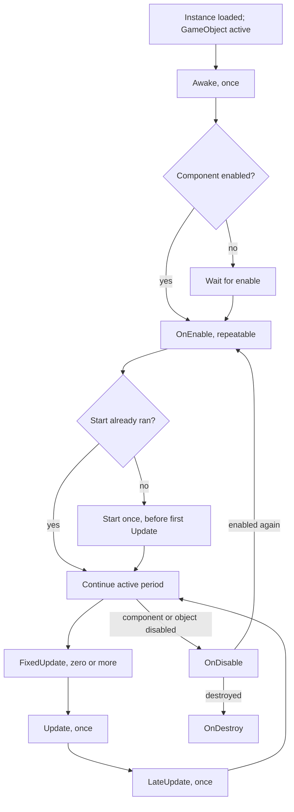

<TLDR>
  <TLDRCell label="what">
    `MonoBehaviour` 是可挂到 GameObject 上的脚本组件基类。Unity 会在对象状态变化和 PlayerLoop 的指定阶段调用名称与签名匹配的消息方法。
  </TLDRCell>
  <TLDRCell label="trap">
    不同对象的同类回调没有默认顺序，`OnEnable` 可以重复，而禁用 `MonoBehaviour` 也不会自动停止它启动的协程。
  </TLDRCell>
  <TLDRCell label="fix">
    把自身初始化放在 `Awake`，按同一生命周期边界配对获取与释放，并用显式依赖取代跨对象的隐含执行顺序。
  </TLDRCell>
</TLDR>

## 是什么，为什么存在

`MonoBehaviour` 是 `Behaviour` 的子类，也是一种<Term id="unity-component">Unity 组件（Unity component）</Term>。继承它的 C# 类可以作为脚本组件挂到<Term id="game-object">游戏对象（GameObject）</Term>上，接收 `Awake`、`OnEnable`、`Start`、`Update` 等引擎消息。并非所有 Unity 脚本都继承它：编辑器工具、`ScriptableObject`、普通 C# 类和 DOTS 系统都有不同的基类或入口。

Unity 已经拥有自己的 PlayerLoop，因此场景脚本通常不自行编写顶层 `while` 循环。`MonoBehaviour` 提供的是接入点：对象加载时初始化，启用时取得活动期资源，每帧执行游戏逻辑，禁用或销毁时释放所有权。引擎控制调用时机，脚本负责让每个回调保持明确、短小且可重复推理。

这种模型解决了场景对象与运行循环之间的连接问题。设计者可以在 Inspector 中配置组件，运行时则由对象的活动状态、组件的启用状态和 PlayerLoop 阶段决定哪些消息会到达。你在角色控制、相机、UI、场景服务、对象池和协程所有者中都会遇到这套生命周期。

生命周期不是全局初始化调度器。它能保证一个实例内部的一些先后关系，却不会默认保证两个 GameObject 上的 `Awake` 谁先运行。依赖另一个对象已经就绪时，需要显式的引导阶段、注册事件、构造数据或受文档约束的执行顺序。

## 工作原理

Unity 按约定识别一组消息名称与签名。这些方法不是 `MonoBehaviour` 上等待重写的虚方法，所以通常写成 `private void Awake()`，而不是 `override`。拼错名称或写错参数时，C# 类型系统不一定能提醒你；方法可能正常编译，却永远收不到引擎调用。

三个状态共同决定消息是否到达：GameObject 是否在层级中活动，`Behaviour.enabled` 是否为 `true`，以及实例此前经历过哪些阶段。`Behaviour.isActiveAndEnabled` 同时反映前两项。把「对象存在」「对象活动」「组件启用」混成一个布尔概念，是生命周期错误的常见起点。

典型首次运行路径如下。图中只表达最常用的脚本消息，不是完整 PlayerLoop，也不表示不同实例之间存在默认顺序。



### 初始化阶段

`Awake` 在一个实例的生命周期中最多运行一次，适合建立同一 GameObject 上的引用、创建私有运行时状态和验证序列化配置。活动 GameObject 上的组件即使 `enabled` 为 `false`，仍会收到 `Awake`；初始非活动的 GameObject 则会把 `Awake` 推迟到首次激活。不要把「场景加载」误写成对所有实例都立刻调用 `Awake`。

`OnEnable` 在组件变为活动且已启用时调用。它会在首次活动时运行，也会在每次禁用后重新启用时再次运行。因此，它适合注册只在活动期存在的监听器、开始活动期工作或重置可重复状态，不适合无条件追加只能创建一次的数据。

`Start` 只在实例生命周期中运行一次，而且要等组件启用后，才会在首次帧更新之前运行。首次路径通常是 `Awake`、`OnEnable`、`Start`；之后重新启用只会再次调用 `OnEnable`。如果 `Start` 建立订阅而 `OnDisable` 删除订阅，组件重新启用后不会自动恢复它。

对于场景开始时已经活动的对象，Unity 会在任何 `Start` 之前完成这些对象的 `Awake`。这个保证不能扩展成整个应用的永久阶段：运行中实例化的新对象会产生新的 `Awake` 与 `OnEnable`。代码应依赖局部契约，不应假定「所有 Awake 永远已经结束」。

### 每帧阶段

`FixedUpdate` 按固定时间步调度。一个渲染帧之前可能没有固定步，也可能补做多个固定步；它不是「每帧恰好一次」。通过 `Rigidbody` 施加力或写入物理状态时，应遵守物理系统的固定步边界，并使用 `Time.fixedDeltaTime` 表达需要显式时间尺度的计算。

`Update` 在活动且已启用的行为上每个渲染帧调用一次。输入采样、非物理状态机和按 `Time.deltaTime` 推进的视觉逻辑通常放在这里。每帧路径中的场景搜索、组件查询、日志和分配都应由 Profiler 数据判断，而不是靠「Update 一定很慢」这样的口号。

`LateUpdate` 在常规 `Update` 阶段之后运行，常用于读取本帧已经更新的目标姿态，例如相机跟随。它只提供阶段边界，不会自动解决平滑、物理插值或不同 `LateUpdate` 脚本之间的顺序。相机仍需要明确目标、缺失策略和时间模型。

一次性的输入动作需要在 `Update` 与 `FixedUpdate` 之间保存。若只在某次 `Update` 中把跳跃标志设为真，又在固定步消费后清除，就能避免渲染帧与物理步数量不同造成漏读或重复。持续方向则可以保存最新值，让每个固定步读取同一命令。

### 停用与销毁

`OnDisable` 在组件从活动且启用变为不满足该条件时调用，包括把组件禁用、把所属 GameObject 设为非活动以及销毁活动对象。这个消息可能出现多次，所以清理逻辑应能安全重复。与 `OnEnable` 配对的订阅、注册和临时句柄应在这里释放。

禁用 `MonoBehaviour` 不等于停止它启动的<Term id="coroutine">协程（coroutine）</Term>。如果活动期结束后协程不应再改状态，就在 `OnDisable` 中通过保存的 `Coroutine` 句柄显式停止它。把 GameObject 设为非活动会停止其协程，但重新激活不会从原位置恢复已停止的迭代器。

`OnDestroy` 适合释放真正属于实例生命周期、而非某次启用周期的资源。Unity 只会为此前活动过的 GameObject 上的对象调用它，因此它不应成为未激活配置对象的唯一安全网。原生句柄、文件和外部连接还应有自己的明确所有权协议，不能只依赖场景退出时的回调。

## 示例

下面四个组件逐步展示生命周期本身、活动期订阅、固定步物理和后更新相机。它们需要 Unity 运行时和场景配置。本地环境没有 Unity Editor、`UnityEngine` 程序集或 C# 编译器，因此每个块都明确标记为未执行，输出栏不会伪造日志。

### 记录一个实例的状态变化

先给空 GameObject 挂上 `LifecycleTrace`，在 Inspector 中切换组件与对象状态。它不会在 `Update` 中持续刷日志，因此输出只对应生命周期边界。

<Depth level="quick">

```csharp title="LifecycleTrace.cs"
// # not executed here: Unity Editor 6.6 and UnityEngine are unavailable.
using UnityEngine;

public sealed class LifecycleTrace : MonoBehaviour
{
    private void Awake() => Write("Awake");

    private void OnEnable() => Write("OnEnable");

    private void Start() => Write("Start");

    private void OnDisable() => Write("OnDisable");

    private void OnDestroy() => Write("OnDestroy");

    private void Write(string message)
    {
        Debug.Log($"{name}: {message}", this);
    }
}
```

```text
# not executed here: Unity Editor 6.6 and UnityEngine are unavailable.
```

</Depth>

一个初始活动且已启用的实例会先经过 `Awake`、`OnEnable`、`Start`。之后禁用再启用，只会增加一组 `OnDisable`、`OnEnable`，不会再次打印 `Awake` 或 `Start`。不同对象的日志可能交错，不能据此发明跨对象保证。

这个探针适合临时诊断，不应成为业务逻辑依赖。若测试需要验证顺序，把消息记录为结构化条目，并只断言文档保证的偏序关系。

### 让订阅跟随活动期

`SceneLoadLogger` 只在自身活动时接收场景加载事件。获取和释放位于对称的回调中，所以多次启用不会留下重复订阅。

```csharp title="SceneLoadLogger.cs"
// # not executed here: Unity Editor 6.6 and UnityEngine are unavailable.
using UnityEngine;
using UnityEngine.SceneManagement;

public sealed class SceneLoadLogger : MonoBehaviour
{
    private void OnEnable()
    {
        SceneManager.sceneLoaded += HandleSceneLoaded;
    }

    private void OnDisable()
    {
        SceneManager.sceneLoaded -= HandleSceneLoaded;
    }

    private void HandleSceneLoaded(Scene scene, LoadSceneMode mode)
    {
        Debug.Log($"loaded: {scene.name} ({mode})", this);
    }
}
```

```text
# not executed here: Unity Editor 6.6 and UnityEngine are unavailable.
```

选择 `OnEnable` 与 `OnDisable`，就是声明「禁用期间不接收通知」。如果需求要求隐藏组件仍然监听，应该改用更长的所有权边界，并写出相应的释放路径；不要只把取消订阅挪到别处而不说明生命周期。

使用 `-=` 删除当前未注册的相同处理器是安全的，这让清理易于保持幂等。不过，对称性仍很重要：在 `OnEnable` 中用 lambda 订阅、再在 `OnDisable` 中创建另一个 lambda，并不能移除原来的委托实例。

### 在固定步驱动 Rigidbody

`RigidbodyDriver` 接收外部输入适配器保存的最新方向，并在 `FixedUpdate` 中向本对象的刚体施力。它不关心输入来自旧输入系统、新 Input System 还是 AI 控制器。

```csharp title="RigidbodyDriver.cs"
// # not executed here: Unity Editor 6.6 and UnityEngine are unavailable.
using UnityEngine;

[RequireComponent(typeof(Rigidbody))]
public sealed class RigidbodyDriver : MonoBehaviour
{
    [SerializeField, Min(0f)]
    private float acceleration = 12f;

    private Rigidbody body;
    private Vector2 moveInput;

    private void Awake()
    {
        body = GetComponent<Rigidbody>();
    }

    public void SetMoveInput(Vector2 input)
    {
        moveInput = Vector2.ClampMagnitude(input, 1f);
    }

    private void FixedUpdate()
    {
        var direction = new Vector3(moveInput.x, 0f, moveInput.y);
        body.AddForce(direction * acceleration, ForceMode.Acceleration);
    }
}
```

```text
# not executed here: Unity Editor 6.6 and UnityEngine are unavailable.
```

`RequireComponent` 表达同对象依赖，`Awake` 只缓存一次引用。这个特性在添加脚本时帮助补齐组件，却不会自动修复后来才增加要求的所有旧 Prefab；团队仍应运行 Prefab 验证，并为异常配置定义清楚的诊断。

方向是持续命令，所以保存最新值即可。跳跃、开火这类边沿事件需要单独缓冲并消费，不能假设每个 `Update` 后恰好只有一个 `FixedUpdate`。

### 在 LateUpdate 跟随目标

最后，相机在 `LateUpdate` 读取目标完成本帧逻辑后的姿态。目标通过 Inspector 显式连接；缺失时，组件报告具体对象并停止继续更新。

```csharp title="FollowCamera.cs"
// # not executed here: Unity Editor 6.6 and UnityEngine are unavailable.
using UnityEngine;

public sealed class FollowCamera : MonoBehaviour
{
    [SerializeField]
    private Transform target;

    [SerializeField]
    private Vector3 offset = new(0f, 5f, -8f);

    private void Awake()
    {
        if (target != null)
            return;

        Debug.LogError($"{name}: follow target is missing.", this);
        enabled = false;
    }

    private void LateUpdate()
    {
        transform.position = target.position + offset;
        transform.LookAt(target);
    }
}
```

```text
# not executed here: Unity Editor 6.6 and UnityEngine are unavailable.
```

这个版本故意不宣称「LateUpdate 会消除抖动」。如果目标由物理系统驱动，相机质量还取决于 Rigidbody 插值、渲染时间和所选平滑算法。`LateUpdate` 只确保相机逻辑处在常规 `Update` 之后。

在 `Awake` 验证序列化目标不依赖目标自己的初始化，因此没有跨对象顺序问题。相反，若此处调用目标组件的运行时服务，就必须先定义目标何时进入可用状态。

## 陷阱

> [!PITFALL]
> 在一个对象的 `Awake` 中读取另一个对象由其 `Awake` 设置的单例字段，等于依赖没有声明的跨对象顺序。场景变大、执行顺序变化或运行时实例化后，这种代码可能偶发得到 `null`。

**修复方法：** `Awake` 只建立自身和同对象依赖。跨对象服务使用显式 bootstrap、依赖注入或「ready」事件；若确实使用 Script Execution Order，就把涉及的脚本类与原因写入项目文档，并用测试守住该约束。

> [!PITFALL]
> 在 `Start` 中订阅，却在 `OnDisable` 中取消订阅，会在第一次禁用后永久断开。`Start` 不会因重新启用而再次运行。

**修复方法：** 按同一所有权周期配对回调。活动期订阅使用 `OnEnable` 与 `OnDisable`；实例期订阅则需要明确建立时机、销毁清理和对象从未激活时的处理方式。

> [!PITFALL]
> 把 `enabled = false` 当成协程取消，会让已启动的协程继续改动状态。之后重新启用组件，还可能再启动第二个并行实例。

**修复方法：** 保存 `StartCoroutine` 返回的句柄，在所有权结束时显式停止并清空它。把重复启动策略写成「忽略、替换、排队或并行」之一，并为组件禁用、GameObject 非活动与销毁分别测试。

> [!PITFALL]
> 在 `Update` 中直接施加物理力，或在 `FixedUpdate` 中只读取一次性按键，会把渲染帧节奏与物理步节奏混在一起。低帧率下每帧可能补做多个固定步，高帧率下也可能出现没有固定步的帧。

**修复方法：** 在输入所属的阶段采样并缓存命令，在 `FixedUpdate` 消费物理命令。持续值保留最新状态，一次性动作则使用明确的缓冲和清除规则。

> [!PITFALL]
> 把 `OnDestroy` 当成任何对象都必到的 `finally` 会漏掉从未活动过的 GameObject，也会把外部资源的正确性押在应用退出路径上。

**修复方法：** 活动期资源尽早在 `OnDisable` 释放，实例期资源使用幂等的显式所有权协议。必须释放的非 Unity 资源应有可直接测试的关闭方法；`OnDestroy` 可以调用它，但不应是唯一入口。

> [!PITFALL]
> 把消息写成 `OnEnabled`、给 `Awake` 加上错误参数，或生成 `override void Start()`，都可能让回调缺失或直接编译失败。方法看起来像生命周期钩子，并不代表 Unity 会识别它。

**修复方法：** 对照当前 Unity API 检查确切名称、返回类型和参数，删除不存在的 `override`。用最小探针或 Play Mode 测试触发目标状态变化，不要只凭编辑器没有红线就认定回调有效。

## AI 时代

**生成代码在这里常犯的错**

模型经常从普通 C# 继承经验推导出 `protected override void Awake()`，但这些消息不是可重写的基类虚方法。它也会把一次性初始化放进可重复的 `OnEnable`，或者让 `Start` 订阅、`OnDisable` 取消，造成第二次启用时状态不同。更隐蔽的错误是默认所有对象的 `Awake` 有稳定顺序，以及默认禁用组件会取消协程或异步工作。

生成的移动代码还常把 `Update`、`FixedUpdate` 和 `LateUpdate` 当成可互换的函数名。结果可能是按帧施力、漏掉一次性输入，或让相机读取目标上一阶段的姿态。另一个真实失败模式是使用 `async void` 生命周期方法，却没有把取消与 GameObject 的生命周期连接起来；对象销毁后，continuation 仍可能访问失效的 Unity 对象。

**让 AI 检查**

- 列出每个 Unity 消息的确切签名、最大调用次数和触发状态，并标出哪些初始化会在重新启用时重复。
- 追踪每项订阅、协程句柄与异步取消源，从获取点走到禁用、非活动、销毁和异常路径。
- 找出所有跨 GameObject 的就绪顺序假设，说明它来自文档、项目设置、显式握手，还是仅来自当前场景中的偶然日志。

**审查清单**

- 分别测试初始活动、初始非活动、组件初始禁用、禁用后重启和销毁，不用单一路径代表整个生命周期。
- 检查物理写入、输入采样和相机读取各自位于正确阶段，并验证一次性命令只消费一次。
- 确认每个获取动作有同生命周期边界的释放动作，且重复启用不会增加订阅、协程或静态状态。

**提示词词汇**

提示中使用准确术语：`Unity message`（Unity 消息）、`PlayerLoop phase`（PlayerLoop 阶段）、`activeInHierarchy`（层级活动状态）、`Behaviour.enabled`（组件启用状态）、`isActiveAndEnabled`（活动且启用）、`fixed timestep`（固定时间步）、`script execution order`（脚本执行顺序）、`lifetime ownership`（生命周期所有权）。要求 AI 给出状态转换表和资源所有权表，比「优化这个 MonoBehaviour」更容易暴露错误假设。

<Depth level="deep">

## 执行顺序的边界

生命周期保证大多是阶段之间的偏序，不是所有脚本的完整排序。对一个初始活动且已启用的实例，可以依赖 `Awake` 先于 `OnEnable`，`Start` 先于其首次 `Update`。对场景开始时已经活动的对象，可以依赖这些对象的 `Awake` 在任何 `Start` 之前完成，但不能据此决定两个 `Awake` 的相对先后。

逐帧阶段也只给出大边界：固定步脚本、常规更新脚本和后更新脚本分别进入 PlayerLoop 的相应位置。同一消息在不同实例上的顺序默认不应成为业务契约。只有项目显式配置的脚本类顺序，或你自己的调度器，才能增加更细的约束。

常见状态转换可以压缩成下表。表中的「等待」表示消息尚未发生，而不是永久跳过。

| 操作或初始状态 | `Awake` | `OnEnable` / `Start` | 帧回调 | 离开活动期 |
|---|---|---|---|---|
| 活动对象、组件启用 | 一次 | `OnEnable`，再在首次更新前 `Start` | 接收 | 禁用时 `OnDisable` |
| 活动对象、组件禁用 | 仍会一次 | 等待启用 | 不接收常规更新 | 尚未进入活动期 |
| 对象初始非活动 | 等待激活 | 等待激活与启用 | 不接收 | 尚未进入活动期 |
| 已启动组件禁用后重启 | 不重复 | `OnEnable` 重复，`Start` 不重复 | 恢复 | 每次禁用都有 `OnDisable` |
| 活动对象被销毁 | 不重复 | 不重复 | 停止 | `OnDisable` 后进入 `OnDestroy` |

### Script Execution Order 的适用范围

Project Settings 中的 Script Execution Order 和 `[DefaultExecutionOrder]` 可以调整不同 `MonoBehaviour` 子类在同类事件中的相对顺序。它们针对脚本类型，不是某个具体实例，也不把场景依赖变成编译期契约。同一类型的两个实例仍不应靠调用先后来分配所有权。

全局顺序表很容易变成隐藏耦合。给一个服务设为 `-1000`，只能让它较早收到某类消息，不能证明异步资源已经加载、网络已经连接或运行时生成的对象已经注册。就绪条件是数据，应通过状态、事件或可等待操作表达。

确实需要顺序设置时，把范围压到最小。例如，一个 bootstrap 类型先创建纯 C# 服务，普通组件随后从已冻结的容器取得依赖。测试应检查容器契约，而不是比较 Console 中两个对象偶然出现的帧号。

### 消息不是虚方法链

`Awake`、`Update` 等名称看起来像框架重写点，但 `MonoBehaviour` 没有为每个消息声明一个虚方法。Unity 的原生 PlayerLoop 识别脚本上匹配的消息，并在相应阶段调用。因此，C# 编译器不能像实现接口那样证明你的组件覆盖了正确成员。

消息入口通常应保持 `private`。把它改成 `public` 不会让 Unity 更容易找到，反而允许其他代码绕过引擎时机直接调用。

若业务需要主动重新初始化，不要手动调用 `Awake` 或 `Start`。把可重复操作提取成具名普通方法，并让消息入口与显式调用方共同使用它。

这也影响基类设计。若项目用自定义基类封装生命周期，不要假设 Unity 会替你构造普通的 `base.Awake()` 调用链。把可复用逻辑放进名称不同的普通方法，由一个清楚的消息入口调用；若选择虚拟模板方法，则由项目自己的基类显式定义、重写并测试。

反射、原生绑定和内部调用列表的具体实现会随 Unity 版本变化。应用代码应依赖公开的消息语义和 PlayerLoop 阶段，不应依赖「Unity 每帧通过反射查找方法」这类未经保证的内部描述。

## 生命周期所有权与测试

生命周期回调真正管理的是所有权。一个组件取得事件订阅、计时器、协程、输入映射或原生句柄时，应先写明它属于一次启用周期，还是整个实例周期。释放点由这个选择决定，而不是由哪个回调名字听起来像「清理」。

活动期资源通常用 `OnEnable` / `OnDisable` 配对。实例期资源可以在一次性初始化后持有更久，但仍需要应对从未激活、异常中断和编辑器运行模式差异。若资源也能由普通 C# 代码拥有，提供显式的 `Dispose` 或 `Close` 路径会更容易测试。

### 测试状态矩阵

最小生命周期测试不只启动场景一次。它应覆盖初始活动且启用、活动但组件禁用、GameObject 初始非活动、一次禁用重启和销毁。每条路径记录消息与资源计数，断言「只运行一次」「每次成对」或「禁用期间不变化」等契约。

不要断言所有对象的完整日志字符串顺序。对保证的关系做局部断言，例如同一实例的 `Awake` 早于 `Start`，所有活动期订阅数在 `OnDisable` 后回到基线。这样测试不会把未承诺的调度细节固化成项目规则。

### 测试跨对象依赖

跨对象初始化测试应主动打乱创建顺序。先创建消费者再创建服务、让服务延迟一帧就绪、禁用后重新注册，并加载附加场景。若消费者只能在 Hierarchy 当前排列下工作，依赖协议仍然不完整。

测试失败消息应指出缺少哪个服务、哪个对象请求了它，以及当前生命周期状态。静默重试每帧查找会把配置错误拖成持续成本，也会让测试在某次碰巧找到对象时错误通过。

### 测试更新阶段

固定步测试应控制模拟输入与时间，而不是期待工作站恰好产生某个帧率。分别验证没有固定步、一个固定步和同一渲染帧内多个固定步时，持续命令与一次性命令的消费次数。相机测试则比较阶段后的姿态，不把视觉平滑和执行顺序混成一个断言。

### 测试重复清理

清理测试应连续执行两次禁用，并在第二次之前改变一部分外部状态。目标不是要求 Unity 重复发送同一消息，而是直接验证清理方法面对已释放句柄、已删除订阅或已经为空的引用时仍然安全。

随后重新启用组件，确认资源计数只回到一个活动实例，而不是每次循环再增加一个。对静态事件，可以让发布者发出一次通知并断言处理器只运行一次；对协程，则记录当前拥有的句柄和可见状态变更。

销毁路径也要经过同一个幂等释放入口。这样，显式关闭、`OnDisable` 和 `OnDestroy` 即使在边界情况下相邻发生，也不会形成双重释放错误。

只有发现性能问题时才记录性能结论。使用目标平台 Player 构建，固定场景输入，分别查看 `Update`、`FixedUpdate` 和 `LateUpdate` 中的主线程时间与分配。没有测量数据时，删除空回调和重复查找可以作为清晰度改进，但不要附上虚构的加速比例。

</Depth>

<Checkpoint id="gamedev/unity-monobehaviour" />

## 延伸阅读

- [Unity C# 参考：MonoBehaviour bindings](https://raw.githubusercontent.com/Unity-Technologies/UnityCsReference/master/Runtime/Export/Scripting/MonoBehaviour.bindings.cs)
- [Unity C# 参考：Behaviour bindings](https://raw.githubusercontent.com/Unity-Technologies/UnityCsReference/master/Runtime/Export/Scripting/Behaviour.bindings.cs)
- [Unity C# 参考：脚本特性与 DefaultExecutionOrder](https://raw.githubusercontent.com/Unity-Technologies/UnityCsReference/master/Runtime/Export/Scripting/Attributes.cs)
- [Unity C# 参考：PlayerLoop 类型](https://raw.githubusercontent.com/Unity-Technologies/UnityCsReference/master/Runtime/Export/PlayerLoop/PlayerLoop.bindings.cs)
