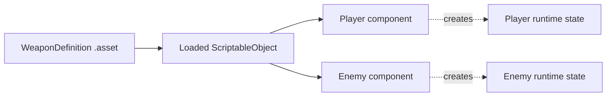

<TLDR>
  <TLDRCell label="what">
    A ScriptableObject is a Unity data object that exists independently of scene objects. Saved as an asset, it lets several components reference one project-level configuration.
  </TLDRCell>
  <TLDRCell label="trap">
    Consumers that reference one asset also share one loaded object. Putting current health, level progress, or listeners in the asset couples runtime state that should be independent.
  </TLDRCell>
  <TLDRCell label="fix">
    Keep authoring definitions in assets and runtime state in components or ordinary C# objects. When a mutable ScriptableObject is truly required, create and destroy a runtime instance explicitly.
  </TLDRCell>
</TLDR>

## What it is and why it exists

A <Term id="scriptable-object">ScriptableObject</Term> is a data object derived from `UnityEngine.Object`. Unlike a `MonoBehaviour`, it does not attach to a GameObject. It is usually saved as a `.asset` file and referenced by scenes, <Term id="prefab">Prefabs</Term>, or other assets. Weapon definitions, character templates, level rules, and item catalogs are common uses.

It solves the case where many instances need the same authoring data. If ten enemy components embed the same configuration, their Prefab instances each store values. If they reference one ScriptableObject asset, the configuration has one clear source that designers can edit separately in the Inspector. The gain comes from sharing data; using a ScriptableObject does not make every architecture faster.

A ScriptableObject also gives data an identity that Unity understands. It can reference materials, audio, Prefabs, and other ScriptableObjects while participating in Unity's serialization and asset workflow. An ordinary C# object is a better fit for short-lived in-memory state, while external JSON fits data produced or exchanged outside Unity.

Separating a definition from state is the central boundary. A sword's name, icon, and base damage belong to its definition; the durability of the sword held by one player is state. The former fits a shared asset. The latter usually belongs to a component, save model, or deliberately created runtime copy.

## How it works

A ScriptableObject class is only a type declaration. `CreateAssetMenu` adds a concrete derived type to the Assets/Create menu; selecting that item makes a persistent, referenceable asset instance. You can also call `ScriptableObject.CreateInstance<T>()` for a transient instance with no `.asset` file, or call `Object.Instantiate` to clone an existing object.

A <Term id="serialized-field">serialized field</Term> on a component stores a reference to the ScriptableObject asset. It does not embed a copy of every asset field in the component. After Unity loads that reference, two fields that point to the same asset read the same object. A runtime write is therefore visible immediately to every other consumer.

The diagram separates project data, its loaded object, and per-character runtime state. Solid arrows are shared references; dotted arrows create new state.



A typical data flow is:

1. An editor creates the asset and writes supported fields into project data.
2. A scene or Prefab stores a reference to that asset in a serialized field.
3. The runtime loads the asset, and all consumers read the same definition.
4. Each consumer creates or initializes its own mutable state from that definition.

### Assets, transient instances, and ordinary objects

These three carriers have different lifetimes. Do not swap them merely because their fields have similar shapes. Decide who creates, saves, and destroys the value before choosing its type.

| Carrier | Identity and storage | Suitable data |
|---|---|---|
| ScriptableObject asset | Project asset serialized by Unity | Shared definitions and editor-generated data |
| Runtime ScriptableObject | Created by `CreateInstance` or `Instantiate`; not written back automatically | Temporary data that must travel as a Unity object |
| Ordinary C# object or component field | Created by its owner and saved under application rules | Mutable state for one player, enemy, or session |

`CreateInstance<T>()` produces a new ScriptableObject instance, not an asset on disk. It becomes bound to a project file only when editor code calls an API such as `AssetDatabase.CreateAsset`. `AssetDatabase` belongs to `UnityEditor` and cannot leak into Player runtime code.

`Instantiate(template)` returns a clone of the template. Values on the cloned root object can be changed independently, but fields that point to other `UnityEngine.Object` assets still represent object references. Do not assume the whole dependency graph became private. If you only need a few counters, ordinary C# state is usually simpler.

### Serialization boundaries

Unity saves only fields it supports. Public fields are serialized by default, while private fields require `[SerializeField]`; a property is not automatically saved merely because it has a public getter. A `[NonSerialized]` field can hold a temporary cache, but the attribute does not turn an asset into a safe session-state container.

Unity 6.6 added native `Dictionary<TKey, TValue>` serialization. A dictionary field marked `[SerializeField]` can use supported key and value types, so parallel `List` wrappers are no longer universally necessary. Multidimensional arrays, jagged arrays, and directly nested collections remain unsupported; complicated graphs can still require wrapper types or `[SerializeReference]`.

A ScriptableObject asset stores data authored during development. In a deployed Player, changing the loaded object does not write back to the project's `.asset` file and cannot replace a save system. Data that must survive another launch should be converted to an explicit save DTO and written to an application-writable location.

## Examples

These four examples progress through shared definitions, isolated runtime state, an explicit runtime clone, and stable save IDs. They require the Unity 6.6 Editor, `UnityEngine` assemblies, and scene configuration. Those tools are unavailable locally, so every block is marked unexecuted and no Console output is fabricated.

### Create a shared weapon definition

`WeaponDefinition` exposes a read-only interface. A designer creates an asset through Assets/Create and assigns that same asset to several `Weapon` components.

<Depth level="quick">

```csharp title="WeaponDefinition.cs"
// # not executed here: Unity Editor 6.6 and UnityEngine are unavailable.
using UnityEngine;

[CreateAssetMenu(fileName = "Weapon", menuName = "Game/Weapon Definition")]
public sealed class WeaponDefinition : ScriptableObject
{
    [SerializeField] private string stableId = "";
    [SerializeField] private string displayName = "Unnamed weapon";
    [SerializeField, Min(0)] private int damage = 1;

    public string StableId => stableId;
    public string DisplayName => displayName;
    public int Damage => damage;

    private void OnValidate()
    {
        damage = Mathf.Max(0, damage);
    }
}

public sealed class Weapon : MonoBehaviour
{
    [SerializeField] private WeaponDefinition definition;

    public void Fire()
    {
        if (definition == null)
        {
            Debug.LogError($"{name}: weapon definition is missing.", this);
            return;
        }

        Debug.Log($"{definition.DisplayName}: {definition.Damage}", this);
    }
}
```

```text
# not executed here: Unity Editor 6.6 and UnityEngine are unavailable.
```

</Depth>

Private serialized fields keep Inspector authoring without accidentally adding a public mutation API. `OnValidate` only constrains the asset to an allowed damage range. It is not a runtime input validator or a session initializer.

Two `Weapon` components that reference the same asset read the same name and damage. If a level needs a weapon with different values, create another definition or establish an explicit modifier rule instead of quietly changing the shared asset from one weapon instance.

### Keep current health on the component

`ActorDefinition` stores a shareable maximum health, while `Actor` stores current health for its own GameObject. This boundary stops two enemies from damaging each other.

```csharp title="Actor.cs"
// # not executed here: Unity Editor 6.6 and UnityEngine are unavailable.
using UnityEngine;

[CreateAssetMenu(fileName = "Actor", menuName = "Game/Actor Definition")]
public sealed class ActorDefinition : ScriptableObject
{
    [SerializeField, Min(1)] private int maxHealth = 100;

    public int MaxHealth => maxHealth;
}

public sealed class Actor : MonoBehaviour
{
    [SerializeField] private ActorDefinition definition;

    public int CurrentHealth { get; private set; }

    private void Awake()
    {
        if (definition == null)
        {
            Debug.LogError($"{name}: actor definition is missing.", this);
            enabled = false;
            return;
        }

        CurrentHealth = definition.MaxHealth;
    }

    public void TakeDamage(int amount)
    {
        if (amount <= 0 || !enabled)
            return;

        CurrentHealth = Mathf.Max(0, CurrentHealth - amount);
    }
}
```

```text
# not executed here: Unity Editor 6.6 and UnityEngine are unavailable.
```

The definition is read only during `Awake`. Every `Actor` in the scene gets an independent `CurrentHealth`, and that state ends with its owning GameObject. If a save must preserve it, export the value rather than trying to modify `ActorDefinition`.

This shape also makes the right test obvious: give two instances the same definition, damage one, and assert that the other did not change. A single-instance test cannot expose misplaced shared state.

### Clone when an API requires a Unity object

Some existing APIs require a ScriptableObject. In that case, a template can be cloned, but a clear owner must initialize and destroy the copy.

```csharp title="SessionRulesOwner.cs"
// # not executed here: Unity Editor 6.6 and UnityEngine are unavailable.
using System;
using UnityEngine;

[CreateAssetMenu(fileName = "SessionRules", menuName = "Game/Session Rules")]
public sealed class SessionRules : ScriptableObject
{
    [SerializeField, Min(0)] private int retryLimit = 3;
    [NonSerialized] private int remainingRetries;

    public int RemainingRetries => remainingRetries;

    public void BeginSession() => remainingRetries = retryLimit;

    public bool TryUseRetry()
    {
        if (remainingRetries == 0)
            return false;

        remainingRetries--;
        return true;
    }
}

public sealed class SessionRulesOwner : MonoBehaviour
{
    [SerializeField] private SessionRules template;
    public SessionRules RuntimeRules { get; private set; }

    private void Awake()
    {
        if (template == null)
            throw new InvalidOperationException("Session rules template is missing.");

        RuntimeRules = Instantiate(template);
        RuntimeRules.BeginSession();
    }

    private void OnDestroy()
    {
        if (RuntimeRules != null)
            Destroy(RuntimeRules);
    }
}
```

```text
# not executed here: Unity Editor 6.6 and UnityEngine are unavailable.
```

`BeginSession` initializes nonserialized state explicitly, so correctness does not depend on when the asset receives `OnEnable`. The owner retains the clone and destroys it when its own lifetime ends. The template remains read only.

If the caller does not require a `UnityEngine.Object`, an ordinary session object is a lighter home for `remainingRetries`. Cloning is a lifetime decision, not the default response to every mutable field.

### Rebuild save references from stable IDs

The save record contains only a project-defined `itemId` and quantity. On load, the catalog resolves that ID back to an asset reference, so the format does not depend on an object instance from one run.

```csharp title="ItemCatalog.cs"
// # not executed here: Unity Editor 6.6 and UnityEngine are unavailable.
using System;
using System.Collections.Generic;
using UnityEngine;

[CreateAssetMenu(fileName = "Item", menuName = "Game/Item Definition")]
public sealed class ItemDefinition : ScriptableObject
{
    [SerializeField] private string stableId = "";
    [SerializeField] private string displayName = "Unnamed item";

    public string StableId => stableId;
    public string DisplayName => displayName;
}

[Serializable]
public sealed class InventoryRecord
{
    public string itemId = "";
    public int quantity;
}

[CreateAssetMenu(fileName = "ItemCatalog", menuName = "Game/Item Catalog")]
public sealed class ItemCatalog : ScriptableObject
{
    [SerializeField]
    private Dictionary<string, ItemDefinition> itemsById = new();

    public bool TryResolve(InventoryRecord record, out ItemDefinition item)
    {
        item = null;
        if (record == null || string.IsNullOrWhiteSpace(record.itemId))
            return false;

        return itemsById.TryGetValue(record.itemId, out item);
    }
}
```

```text
# not executed here: Unity Editor 6.6 and UnityEngine are unavailable.
```

This dictionary form targets Unity 6.6. The project still has to validate that IDs are nonempty and unique, and it needs a migration policy for deleted or renamed IDs. A failed load should produce a diagnostic result instead of silently choosing an arbitrary item.

Do not write `GetInstanceID()` into a save file. It distinguishes objects in the current run; it is not a persistent identifier promised by the project. A stable ID must be owned by the content pipeline and checked for duplicates before release.

## Pitfalls

> [!PITFALL]
> Putting `currentHealth`, current level, or cooldown state in an asset makes every consumer share it. A one-instance test can pass, with cross-talk appearing only after a second consumer exists.

**Fix:** Label every field as authoring definition, runtime state, or cache. Put runtime state in a component, ordinary C# state object, or runtime clone with a named owner, then test two instances that share one definition for isolation.

> [!PITFALL]
> Constructing a ScriptableObject with `new WeaponDefinition()` bypasses Unity's object creation path. Generated code often treats it as an ordinary C# DTO and then produces invalid object behavior or an engine diagnostic.

**Fix:** Use `ScriptableObject.CreateInstance<T>()` for an empty transient instance, `Object.Instantiate` to copy a template, and the editor menu or `AssetDatabase` for a project asset. The three paths have different storage and ownership semantics.

> [!PITFALL]
> Calling `UnityEditor.AssetDatabase` from Player runtime code introduces an editor-only API into the build. A path that works in Editor Play mode does not prove that the Player can compile it or write an asset.

**Fix:** Put asset-generation tools in an editor-only assembly or `Editor` directory. Runtime saves use an application-writable location and separate DTOs; a `.asset` file is not a player's save file.

> [!PITFALL]
> Assuming that leaving Play mode reliably undoes every asset write makes tests depend on editor reload settings. New Unity 6.6 projects do not reload the script domain by default, so caches and callbacks especially cannot rely on old lifecycle habits.

**Fix:** Treat runtime templates as read only, and snapshot or reload assets around tests. Give temporary state explicit `BeginSession`, `ResetState`, and release paths. Do not use `OnEnable` to mean "exactly once per game session."

> [!PITFALL]
> Changing a C# field initializer can leave existing `.asset` files with their old serialized value. A code review that sees only the new default can wrongly conclude that all content has changed.

**Fix:** Treat bulk changes as data migrations. Scan existing assets, record a migration version, show which objects will change, and inspect the YAML or Inspector diff before committing.

> [!PITFALL]
> Repeating an old tutorial's claim that Unity cannot serialize dictionaries creates redundant parallel lists and synchronization code in a 6.6 project. The opposite claim, that any nested collection now works, is also wrong.

**Fix:** Check the serialization rules for the target Unity version. Unity 6.6 supports compatible dictionary fields marked `[SerializeField]`, while multidimensional arrays, jagged arrays, and directly nested collections still need another representation and a save-reload test.

<Depth level="deep">

## Asset identity, loading, and change

### References preserve object identity

Unity serializes fields derived from `UnityEngine.Object` by reference. When a component refers to a `WeaponDefinition`, it stores a relationship to that asset object rather than copying the weapon fields into the component. If several fields point to one object, a save and reload should preserve that shared relationship.

An ordinary `[Serializable]` class uses inline serialization by default, which has different semantics. If two inline fields refer to the same ordinary object, they can deserialize as separate objects with equal data. Consider `[SerializeReference]` only when an ordinary managed graph needs polymorphism or shared references, and include its migration cost in the design.

Shared identity makes global edits easy and accidental writes dangerous. Read-only properties on a ScriptableObject constrain ordinary callers, but Unity still serializes into private fields and editor tools can change them. Read-only treatment is a project protocol that validation and tests must enforce together.

### A reference is not a loading policy

ScriptableObject defines an object and serialization model. It does not by itself decide how the entire project is packaged or streamed. A direct serialized reference creates a content dependency; projects using another content-loading system must also obey that system's handle, release, and failure rules. Do not treat "it is a ScriptableObject" as a promise that it never unloads or is always resident.

While a runtime object retains an asset reference, that reference remains relevant to its lifetime. If a cache, static event, or long-lived service retains the reference, unloading a scene may not end business ownership. To diagnose asset lifetime, trace root references through the final consumer instead of looking only at the scene where the asset first appeared.

### Asset evolution is data migration

Once an asset is saved, serialized values are content. Changing a field initializer only affects objects created later or objects that have not stored that field; it is not a migration for existing assets. Renaming or removing serialized fields also needs an explicit compatibility plan and data check.

A reliable migration tool scans and reports before it writes. Each migration should recognize its old version, reject data it cannot classify, and reload the result after writing. Asset diffs belong in code review and should not be buried beneath unrelated automated formatting.

Stable content IDs need the same discipline. Once an ID appears in saves, telemetry, or backend data, renaming an asset must not casually change it. When a definition is removed, decide whether old saves fail, map to a replacement, or keep a compatibility asset.

## Unity 6.6 serialization and lifecycle boundaries

### Dictionary support has limits

Unity 6.6 can natively serialize a `Dictionary<TKey, TValue>` marked `[SerializeField]`. Its keys and values must still satisfy serialization rules, and the serialization rules analyzer helps detect some unsupported signatures. Dictionary support did not remove every collection restriction.

Multidimensional arrays, jagged arrays, and directly nested collections still need a wrapper. When a data structure grows into several mapping layers and polymorphic nodes, first ask whether it still belongs in the Inspector. An external data file, import step, or dedicated editor may make the contract clearer.

Before migrating an established parallel-list format to a dictionary, inspect serialization order, duplicate keys, and version-control readability. A new API removes a general limitation; it does not force an immediate rewrite of a stable format. Migration should buy fewer synchronization bugs or a better authoring workflow, not merely newer syntax.

### Callbacks are not a session protocol

`OnEnable` describes an engine event when a ScriptableObject is loaded; it does not mean "a new game began." Editor compilation, asset reloads, and Play mode configuration can change the sequence you observe. Resetting business state there ties game rules to tool lifecycle.

Session state needs a domain entry point such as `BeginSession(saveData)`. That entry point should specify initial data, repeated-call behavior, and failure handling, and the object that owns the session should call it. `OnDisable` or `OnDestroy` can assist with transient cleanup but cannot replace normal completion and explicit cancellation paths.

`OnValidate` fits editor-time range constraints, missing-reference checks, and content diagnostics. A Player must still defend against invalid save, network, or dynamic-content input because that data may never pass through the Inspector. Editor validation cannot be the only proof of runtime correctness.

### Test sharing and reload boundaries

A minimum test matrix needs at least two consumers that share one asset. Mutate component state, a runtime clone, and the template separately, asserting that only the intended object changes. Then destroy one consumer and confirm that the other still reads the definition and no transient clone remains.

Serialization tests must actually save and reload the asset. Looking only at the current Inspector cannot expose unsupported fields, stale serialized values, or identity changes after reconstruction. Dictionary tests should cover an empty dictionary, duplicate content IDs, missing asset values, and order-independent behavior.

A save test reconstructs its DTO from text or bytes before resolving assets through a catalog. Passing the original in-memory object directly across the assertion proves only that the reference still exists, not that a cross-process format works. Keep at least one unknown-ID case and verify that its error includes the ID and save location.

Editor tests should also cover the Enter Play Mode configurations the project supports. The goal is not identical callback logs under every configuration. It is proof that explicit session initialization, cache cleanup, and subscription ownership do not depend on one reload mode.

</Depth>

<Checkpoint id="gamedev/unity-scriptableobjects" />

## Further reading

- [Unity 6.6 Manual: ScriptableObject](https://docs.unity3d.com/6000.6/Documentation/Manual/class-ScriptableObject.html)
- [Unity 6.6 API: ScriptableObject.CreateInstance](https://docs.unity3d.com/6000.6/Documentation/ScriptReference/ScriptableObject.CreateInstance.html)
- [Unity 6.6 API: CreateAssetMenuAttribute](https://docs.unity3d.com/6000.6/Documentation/ScriptReference/CreateAssetMenuAttribute.html)
- [Unity 6.6 API: Object.Instantiate](https://docs.unity3d.com/6000.6/Documentation/ScriptReference/Object.Instantiate.html)
- [Unity 6.6 Manual: script serialization rules](https://docs.unity3d.com/6000.6/Documentation/Manual/script-serialization-rules.html)
- [Unity 6.6 Manual: new in Unity 6.6](https://docs.unity3d.com/6000.6/Documentation/Manual/WhatsNewUnity66.html)
