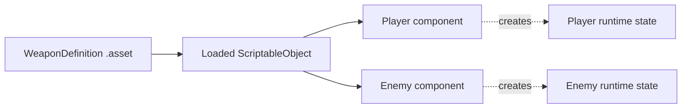

<TLDR>
  <TLDRCell label="what">
    ScriptableObject 是独立于场景对象的 Unity 数据对象；保存成资源后，多个组件可以引用同一份项目配置。
  </TLDRCell>
  <TLDRCell label="trap">
    引用同一资源的使用方也共享同一个已加载对象。把当前生命值、关卡进度或监听器写进资源，会把本应独立的运行时状态串在一起。
  </TLDRCell>
  <TLDRCell label="fix">
    让资源保存编辑期定义，让组件或普通 C# 对象保存运行时状态；确实需要可变 ScriptableObject 时，显式创建并销毁运行时实例。
  </TLDRCell>
</TLDR>

## 是什么，为什么存在

<Term id="scriptable-object">ScriptableObject</Term> 是继承自 `UnityEngine.Object` 的数据对象。它不像 `MonoBehaviour` 那样挂在 GameObject 上，而是通常保存成项目中的 `.asset` 资源，再由场景、<Term id="prefab">Prefab</Term> 或其他资源引用。最常见的用途是武器定义、角色模板、关卡规则和物品目录。

它解决的是「许多实例需要同一份编辑期数据」的问题。若十个敌人的组件都内嵌同一组配置，Prefab 实例会各自保存一份值；若组件引用同一个 ScriptableObject 资源，配置有一个明确来源，设计人员也能在 Inspector 中单独编辑它。这里的收益来自共享数据，不等于任何使用 ScriptableObject 的架构都会更快。

ScriptableObject 也给数据一个 Unity 能识别的对象身份。它可以引用材质、音频、Prefab 和其他 ScriptableObject，并通过 Unity 的资源工作流参与序列化。普通 C# 对象更适合只在内存中存在的短期状态；外部 JSON 更适合需要在 Unity 之外生产或交换的数据。

把「定义」和「状态」分开是这项工具的核心边界。剑的名称、图标和基础伤害属于定义；某位玩家手里这把剑的耐久度属于状态。前者适合共享资源，后者通常属于组件、存档模型或专门创建的运行时副本。

## 工作原理

一个 ScriptableObject 类只是类型声明。`CreateAssetMenu` 把具体派生类型加入 Assets/Create 菜单；创建菜单项后，Unity 才会生成可保存、可引用的资源实例。也可以用 `ScriptableObject.CreateInstance<T>()` 创建不绑定 `.asset` 文件的临时实例，或用 `Object.Instantiate` 克隆现有对象。

组件上的 <Term id="serialized-field">序列化字段</Term>保存的是对 ScriptableObject 资源的引用，不会把资源的所有字段内嵌复制到组件中。Unity 加载引用后，两个字段若指向同一资源，读取到的是同一个对象。任何运行时写入也会立即被其他引用者看到。

下面的图把项目数据、加载后的对象和每个角色的运行时状态分开。虚线表示创建新状态，实线表示共享引用。



一次典型的数据流如下：

1. 编辑器创建资源，并把支持的字段写入项目数据。
2. 场景或 Prefab 在序列化字段中保存对该资源的引用。
3. 运行时加载资源，所有引用者读取同一份定义。
4. 每个使用方根据定义创建或初始化自己的可变状态。

### 资源、临时实例与普通对象

这三种载体的生命周期不同，不能只因为字段形状相似就互换。先确定谁创建它、谁保存它、谁销毁它，再决定类型。

| 载体 | 身份与保存位置 | 合适的数据 |
|---|---|---|
| ScriptableObject 资源 | 项目资源，由 Unity 序列化 | 共享定义、编辑器生成的数据 |
| 运行时 ScriptableObject | `CreateInstance` 或 `Instantiate` 创建，不自动写回资源 | 必须以 Unity 对象身份传递的临时数据 |
| 普通 C# 对象或组件字段 | 由拥有者创建，按应用规则保存 | 每个玩家、敌人或会话的可变状态 |

`CreateInstance<T>()` 创建的是新的 ScriptableObject 实例，不是磁盘资源。只有编辑器代码调用 `AssetDatabase.CreateAsset` 等 API 后，实例才会绑定到项目文件。`AssetDatabase` 属于 `UnityEditor`，不能混进 Player 运行时代码。

`Instantiate(template)` 会返回模板的克隆。克隆根对象上的值可以独立修改，但其中指向其他 `UnityEngine.Object` 的字段仍表达对象引用，不能假定整个依赖图都变成私有副本。若只是要保存几个计数器，普通 C# 状态通常更简单。

### 序列化边界

Unity 只保存它支持的字段。公开字段默认参与序列化，私有字段需要 `[SerializeField]`；属性本身不会因为有公开 getter 就自动保存。`[NonSerialized]` 字段可以放临时缓存，但它不会把资源自动变成安全的会话状态容器。

Unity 6.6 新增了原生 `Dictionary<TKey, TValue>` 序列化。受支持的键和值类型可以放在带 `[SerializeField]` 的字典字段中，不再一律需要平行 `List` 包装器。不过，多维数组、交错数组和直接嵌套的集合仍不受支持；复杂图还需要包装类型或 `[SerializeReference]`。

ScriptableObject 资源保存的是开发期间制作的数据。在已部署的 Player 中，修改已加载对象不会把更改写回项目中的 `.asset` 文件，也不能代替存档系统。需要跨启动保留的数据，应转成明确的存档 DTO，并写入应用可写位置。

## 示例

下面四个示例依次展示共享定义、独立运行时状态、显式运行时克隆和稳定存档标识。它们需要 Unity 6.6 的编辑器、`UnityEngine` 程序集和场景配置；本地环境没有这些工具，因此每个代码块都明确标记为未执行，输出栏不会伪造 Console 日志。

### 创建共享武器定义

`WeaponDefinition` 只暴露读取接口。设计人员通过 Assets/Create 创建资源，再把同一个资源拖给多个 `Weapon` 组件。

<Depth level="quick">

```csharp title="WeaponDefinition.cs"
// # not executed here: Unity Editor 6.6 and UnityEngine are unavailable.
using UnityEngine;

[CreateAssetMenu(fileName = "Weapon", menuName = "Game/Weapon Definition")]
public sealed class WeaponDefinition : ScriptableObject
{
    [SerializeField] private string stableId = "";
    [SerializeField] private string displayName = "Unnamed weapon";
    [SerializeField, Min(0)] private int damage = 1;

    public string StableId => stableId;
    public string DisplayName => displayName;
    public int Damage => damage;

    private void OnValidate()
    {
        damage = Mathf.Max(0, damage);
    }
}

public sealed class Weapon : MonoBehaviour
{
    [SerializeField] private WeaponDefinition definition;

    public void Fire()
    {
        if (definition == null)
        {
            Debug.LogError($"{name}: weapon definition is missing.", this);
            return;
        }

        Debug.Log($"{definition.DisplayName}: {definition.Damage}", this);
    }
}
```

```text
# not executed here: Unity Editor 6.6 and UnityEngine are unavailable.
```

</Depth>

私有序列化字段保留 Inspector 编辑能力，却不会无意间增加公开写入 API。`OnValidate` 只把资源修正到允许的伤害范围；它不是运行时输入验证器，也不应承担会话初始化。

两个 `Weapon` 若引用同一资源，就会读到相同名称与伤害。若关卡需要一把数值不同的武器，应创建另一个定义资源或建立明确的修饰规则，而不是在某个武器实例上偷偷改共享资源。

### 把当前生命值留给组件

`ActorDefinition` 保存可共享的最大生命值，`Actor` 保存每个 GameObject 自己的当前生命值。这个边界避免了两个敌人互相扣血。

```csharp title="Actor.cs"
// # not executed here: Unity Editor 6.6 and UnityEngine are unavailable.
using UnityEngine;

[CreateAssetMenu(fileName = "Actor", menuName = "Game/Actor Definition")]
public sealed class ActorDefinition : ScriptableObject
{
    [SerializeField, Min(1)] private int maxHealth = 100;

    public int MaxHealth => maxHealth;
}

public sealed class Actor : MonoBehaviour
{
    [SerializeField] private ActorDefinition definition;

    public int CurrentHealth { get; private set; }

    private void Awake()
    {
        if (definition == null)
        {
            Debug.LogError($"{name}: actor definition is missing.", this);
            enabled = false;
            return;
        }

        CurrentHealth = definition.MaxHealth;
    }

    public void TakeDamage(int amount)
    {
        if (amount <= 0 || !enabled)
            return;

        CurrentHealth = Mathf.Max(0, CurrentHealth - amount);
    }
}
```

```text
# not executed here: Unity Editor 6.6 and UnityEngine are unavailable.
```

定义在 `Awake` 中只被读取。场景中的每个 `Actor` 都有独立的 `CurrentHealth`，销毁 GameObject 时状态随拥有者结束。存档需要保留它时，应导出数值，而不是尝试修改 `ActorDefinition`。

这个写法也让测试更直接：给两个实例同一份定义，伤害其中一个，然后断言另一个不变。只检查单个实例无法发现共享状态放错位置的问题。

### 必须传递 Unity 对象时克隆

有些现有 API 要求传入 ScriptableObject。此时可以克隆模板，但要让一个明确的拥有者负责初始化和销毁副本。

```csharp title="SessionRulesOwner.cs"
// # not executed here: Unity Editor 6.6 and UnityEngine are unavailable.
using System;
using UnityEngine;

[CreateAssetMenu(fileName = "SessionRules", menuName = "Game/Session Rules")]
public sealed class SessionRules : ScriptableObject
{
    [SerializeField, Min(0)] private int retryLimit = 3;
    [NonSerialized] private int remainingRetries;

    public int RemainingRetries => remainingRetries;

    public void BeginSession() => remainingRetries = retryLimit;

    public bool TryUseRetry()
    {
        if (remainingRetries == 0)
            return false;

        remainingRetries--;
        return true;
    }
}

public sealed class SessionRulesOwner : MonoBehaviour
{
    [SerializeField] private SessionRules template;
    public SessionRules RuntimeRules { get; private set; }

    private void Awake()
    {
        if (template == null)
            throw new InvalidOperationException("Session rules template is missing.");

        RuntimeRules = Instantiate(template);
        RuntimeRules.BeginSession();
    }

    private void OnDestroy()
    {
        if (RuntimeRules != null)
            Destroy(RuntimeRules);
    }
}
```

```text
# not executed here: Unity Editor 6.6 and UnityEngine are unavailable.
```

`BeginSession` 显式初始化非序列化状态，因此正确性不依赖资源何时收到 `OnEnable`。拥有者保存克隆引用，并在自身结束时销毁它；模板始终只读。

若调用方并不要求 `UnityEngine.Object`，把 `remainingRetries` 放进普通会话对象会更轻。克隆是生命周期选择，不是看到可变字段后的默认动作。

### 用稳定 ID 重建存档引用

存档只保存项目定义的 `itemId` 和数量。加载时由目录把 ID 解析回资源引用，存档格式不会依赖某次运行的对象实例。

```csharp title="ItemCatalog.cs"
// # not executed here: Unity Editor 6.6 and UnityEngine are unavailable.
using System;
using System.Collections.Generic;
using UnityEngine;

[CreateAssetMenu(fileName = "Item", menuName = "Game/Item Definition")]
public sealed class ItemDefinition : ScriptableObject
{
    [SerializeField] private string stableId = "";
    [SerializeField] private string displayName = "Unnamed item";

    public string StableId => stableId;
    public string DisplayName => displayName;
}

[Serializable]
public sealed class InventoryRecord
{
    public string itemId = "";
    public int quantity;
}

[CreateAssetMenu(fileName = "ItemCatalog", menuName = "Game/Item Catalog")]
public sealed class ItemCatalog : ScriptableObject
{
    [SerializeField]
    private Dictionary<string, ItemDefinition> itemsById = new();

    public bool TryResolve(InventoryRecord record, out ItemDefinition item)
    {
        item = null;
        if (record == null || string.IsNullOrWhiteSpace(record.itemId))
            return false;

        return itemsById.TryGetValue(record.itemId, out item);
    }
}
```

```text
# not executed here: Unity Editor 6.6 and UnityEngine are unavailable.
```

这里的字典写法针对 Unity 6.6。项目仍要验证 ID 非空且唯一，并为已删除或重命名的 ID 定义迁移策略。加载失败应产生可诊断结果，不能静默换成任意物品。

不要把 `GetInstanceID()` 写进存档。它用于区分当前运行中的对象，不是项目承诺的持久标识；稳定 ID 必须由内容管线拥有，并在发布前检查重复。

## 陷阱

> [!PITFALL]
> 把 `currentHealth`、当前关卡或冷却时间放进资源，会让所有引用者共享状态。单实例测试可能正常，第二个使用方出现后才暴露串扰。

**修复方法：** 先给每个字段标注「编辑期定义」或「运行时状态」。后者放进组件、普通 C# 状态对象或有明确拥有者的运行时克隆，并用两个共享同一定义的实例做隔离测试。

> [!PITFALL]
> 用 `new WeaponDefinition()` 创建 ScriptableObject 绕过了 Unity 的对象创建路径。生成代码常把它当成普通 C# DTO，随后得到无效对象行为或引擎诊断。

**修复方法：** 临时空实例使用 `ScriptableObject.CreateInstance<T>()`，从模板复制使用 `Object.Instantiate`，项目资源则由编辑器菜单或 `AssetDatabase` 创建。三条路径对应不同的保存和所有权语义。

> [!PITFALL]
> 在 Player 运行时代码中调用 `UnityEditor.AssetDatabase`，会让构建引用编辑器专用 API。即使代码在 Editor 播放时能走通，也不能证明 Player 能编译或写入资源。

**修复方法：** 把资源生成工具放进仅编辑器程序集或 `Editor` 目录。运行时存档使用应用可写目录和独立 DTO，不把 `.asset` 当作玩家保存文件。

> [!PITFALL]
> 假定退出 Play mode 会可靠撤销所有资源写入，会让测试结果依赖编辑器重载设置。Unity 6.6 新项目默认不重载脚本域，缓存与回调的存活边界尤其不能靠旧习惯猜测。

**修复方法：** 运行时把模板视为只读，并在测试前后对资源做快照或重新加载。临时状态使用显式 `BeginSession`、`ResetState` 和释放路径，不把 `OnEnable` 当作「每局恰好一次」。

> [!PITFALL]
> 修改 C# 字段初始值后，已有 `.asset` 仍可能保留旧序列化值。代码审查只看到新默认值，很容易误判所有内容已经更新。

**修复方法：** 把批量变化当作数据迁移。扫描现有资源，记录迁移版本，显示将要修改的对象，并在提交前检查 YAML 或 Inspector 差异。

> [!PITFALL]
> 沿用旧教程断言「Unity 不序列化 Dictionary」，会在 6.6 项目里生成多余的双列表和同步代码。反过来，假定任意嵌套集合都能保存也不正确。

**修复方法：** 对照目标 Unity 版本检查序列化规则。6.6 支持带 `[SerializeField]` 的受支持字典字段，但多维数组、交错数组和直接嵌套集合仍需要改造，并应做保存后重新加载测试。

<Depth level="deep">

## 资源标识、加载与变更

### 引用保存对象身份

Unity 对继承自 `UnityEngine.Object` 的字段按引用序列化。一个组件引用 `WeaponDefinition` 时，保存的是指向该资源对象的关系，而不是把武器字段复制进组件。多个字段指向同一对象时，重新加载后仍应表达共享关系。

普通 `[Serializable]` 类默认采用内联序列化，语义不同。同一个普通对象若被两个内联字段引用，保存和重新加载后可能成为两个数据相同的对象。确实需要普通托管对象的多态或共享引用时，才考虑 `[SerializeReference]`，并把迁移成本纳入设计。

共享身份使全局修改很容易，也使意外写入更危险。把 ScriptableObject 公开属性设计成只读只能约束常规调用方，Unity 仍会通过序列化写入私有字段，编辑器工具也可能修改它。只读是项目协议，需要验证工具和测试共同守住。

### 引用不等于加载策略

ScriptableObject 解决的是对象与序列化模型，不自动决定整个项目如何打包和流式加载。一个直接序列化引用会建立内容依赖；项目采用其他内容加载系统时，还要遵守该系统的句柄、释放和失败规则。不要把「它是 ScriptableObject」当成永不卸载或总在内存中的保证。

运行时对象持有资源引用，就会让该引用在对象可达期间有意义。若缓存表、静态事件或长期服务保留了引用，场景卸载未必等于业务所有权结束。诊断资源寿命时，应从根引用追到最后一个使用方，而不是只看资源最初在哪个场景出现。

### 资源演进是数据迁移

资源一旦保存，序列化值就成为内容。修改字段初始器只影响之后创建或尚未保存该字段的对象，不能充当已有资源迁移。重命名或删除序列化字段也需要明确的兼容方案和数据检查。

稳妥的迁移工具先扫描并报告，再执行修改。每次迁移应能识别旧版本、拒绝无法判定的数据，并在写入后重新加载验证。版本控制中的资源差异是审查对象，不应被大量无关的自动格式变化淹没。

稳定内容 ID 同样需要迁移纪律。ID 一旦进入存档、遥测或后端数据，就不能因资源改名而顺手变化。删除定义时，要决定旧存档是拒绝加载、映射到替代项，还是保留兼容资源。

## Unity 6.6 的序列化与生命周期边界

### 字典支持有明确范围

Unity 6.6 可以原生序列化带 `[SerializeField]` 的 `Dictionary<TKey, TValue>`。键和值仍必须满足序列化规则，序列化规则分析器会帮助发现部分不支持的签名。字典支持并没有取消所有集合限制。

多维数组、交错数组以及直接嵌套的集合仍需要包装。若数据结构已经复杂到需要多层映射和多态节点，先问它是否仍适合 Inspector 编辑；外部数据文件、导入步骤或专用编辑器可能更清楚。

从旧双列表迁移到字典前，也要检查序列化顺序、重复键和版本控制可读性。新 API 消除了通用限制，不代表现有稳定格式必须立刻重写。迁移价值应来自更少的同步错误或更好的编辑体验，而不是追逐新语法。

### 回调不是会话协议

`OnEnable` 描述 ScriptableObject 被加载的引擎时机，不描述「新游戏开始」。编辑器重编译、资源重新加载和 Play mode 配置都可能改变你观察到的调用序列。把业务重置放进去，会把游戏规则绑到工具生命周期。

会话状态需要业务入口，例如 `BeginSession(saveData)`。这个入口应明确初始数据、重复调用策略和失败行为，并由拥有会话的对象调用。`OnDisable` 或 `OnDestroy` 可以协助清理临时对象，但不能替代正常完成和主动取消路径。

`OnValidate` 适合在编辑器中限制数值范围、检查缺失引用并给出内容诊断。Player 仍应防御来自存档、网络或动态内容的无效输入，因为这些数据不一定经过 Inspector。不要让编辑器验证成为运行时正确性的唯一证据。

### 测试共享与重载边界

最小测试矩阵至少需要两个共享同一资源的消费者。分别修改组件状态、运行时克隆和模板资源，断言只有预期对象变化。随后销毁一个消费者，确认另一个仍能读取定义，而且临时克隆没有残留。

序列化测试要真正保存并重新加载资源。只在当前 Inspector 中观察字段，无法发现不支持的字段、旧序列化值或重建后身份变化。字典测试还应覆盖空字典、重复内容 ID、缺失资源值和顺序无关性。

存档测试从字符串或字节重新构建 DTO，再通过目录解析资源。不要把内存中的原对象直接传到断言另一侧，那只证明引用仍存在，没有证明跨进程格式可用。至少保留一个未知 ID 用例，验证错误信息包含 ID 和存档位置。

编辑器测试还应覆盖项目采用的 Enter Play Mode 配置。目标不是让所有配置表现出完全相同的回调日志，而是证明显式会话初始化、缓存清理和订阅所有权不依赖某一种重载方式。

</Depth>

<Checkpoint id="gamedev/unity-scriptableobjects" />

## 延伸阅读

- [Unity 6.6 手册：ScriptableObject](https://docs.unity3d.com/6000.6/Documentation/Manual/class-ScriptableObject.html)
- [Unity 6.6 API：ScriptableObject.CreateInstance](https://docs.unity3d.com/6000.6/Documentation/ScriptReference/ScriptableObject.CreateInstance.html)
- [Unity 6.6 API：CreateAssetMenuAttribute](https://docs.unity3d.com/6000.6/Documentation/ScriptReference/CreateAssetMenuAttribute.html)
- [Unity 6.6 API：Object.Instantiate](https://docs.unity3d.com/6000.6/Documentation/ScriptReference/Object.Instantiate.html)
- [Unity 6.6 手册：脚本序列化规则](https://docs.unity3d.com/6000.6/Documentation/Manual/script-serialization-rules.html)
- [Unity 6.6 手册：Unity 6.6 新功能](https://docs.unity3d.com/6000.6/Documentation/Manual/WhatsNewUnity66.html)
