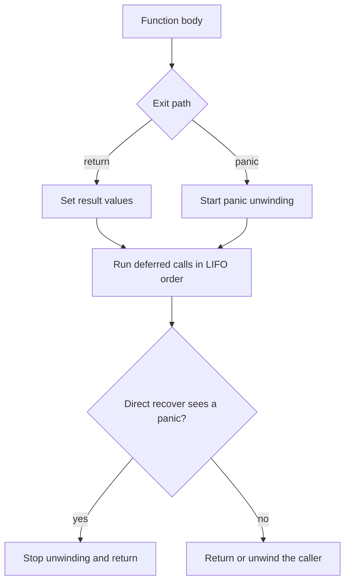

<TLDR>
  <TLDRCell label="what">
    `defer` postpones a call until the current function exits; `panic` unwinds the current goroutine's call stack; a direct call to `recover` in a deferred function can stop that unwinding.
  </TLDRCell>
  <TLDRCell label="trap">
    A deferred call's function value and arguments are evaluated immediately, though its body runs later; `recover` also cannot catch across goroutines or through an ordinary helper function.
  </TLDRCell>
  <TLDRCell label="fix">
    Register cleanup as soon as you acquire a resource, reserve `panic` for abnormal states, and recover only at an explicit goroutine or API boundary.
  </TLDRCell>
</TLDR>

## What it is and why it exists

`defer` is a statement that registers a <Term id="deferred-call">deferred call</Term>. Registered calls run before the current function actually exits, whether it returns normally, reaches the end of its body, or exits because of a panic. This keeps acquiring a resource close to arranging its release, reducing the chance that an early return forgets to close a file, unlock a mutex, or restore state.

`panic` and `recover` are predeclared functions, not alternative syntax for error returns. A panic says the current control flow cannot continue, perhaps because the runtime detected an out-of-bounds access or the program found a broken internal invariant. Ordinary failures should still return an `error`: a missing file, an invalid request, or a remote timeout is a result the caller may handle.

After a panic, Go begins <Term id="panic-unwinding">panic unwinding</Term>. The runtime executes deferred calls in the current function, then works up the same goroutine's call stack and executes callers' deferred calls. If nothing recovers, the program reports the panic value and stack information, then terminates.

`recover` lets code turn a panic into a controlled result at a deliberate <Term id="recovery-boundary">recovery boundary</Term>. It fits task isolation, server request entry points, or a package API that converts a known internal panic into a public `error`. It is not a catch operation that works anywhere, and it does not resume after the statement that panicked.

## How it works

When `defer f(x)` executes, Go immediately evaluates the function value `f` and argument `x`, then saves them for this particular execution. The call itself waits until the current function exits. If the deferred call is a function literal, its body reads captured variables only when it eventually runs, so an argument snapshot and a later closure read can produce different values.

### Function values and method receivers

Immediate evaluation also applies to function values and method receivers. If `cleanup` is pointed at another function after registration, the registered call still uses the original function value; `defer object.Close()` likewise determines `object` at registration. This keeps "release the object just acquired" stable even if the variable is reassigned later.

Evaluation is not invocation. If a deferred call saves a nil function value, registration does not panic; calling that nil function when the current function exits does. Any side effect or panic produced while evaluating the arguments happens immediately as the `defer` statement executes.

Deferred calls in one function run in reverse registration order: last in, first out. A normal `return` assigns result parameters first, runs deferred calls, and only then gives the results to the caller. A deferred closure can therefore change named results; keep that capability inside short, obvious finalization logic.

A panic stops ordinary statements in the current function but does not skip its deferred calls. As unwinding reaches a function `G`, a function directly deferred by `G` can call `recover`, obtain the panic value, and stop the sequence. `G` then returns to its caller; discarded intermediate stack frames do not come back.

The flow below covers both a normal return and a panic path. Recovery happens while deferred calls are running, not at the point that triggered the panic.



Two conditions make `recover` effective: its caller must be executing as a deferred call, and the panic must belong to the same goroutine. A `recover()` in an ordinary function call returns `nil`; a parent goroutine's deferred function cannot observe a child goroutine's panic. Install the boundary on the execution stack that can panic.

### Four exit mechanisms

Several similar-looking exit APIs have different cleanup and recovery semantics. Keeping them separate explains why some cleanup code never gets a chance to run.

| Exit mechanism | Runs deferred calls | Stoppable by `recover` | Result |
|---|---|---|---|
| Normal `return` | Yes | Not applicable | Returns to caller |
| `panic` | Yes | Yes, with a direct call in the same goroutine | Recovers or terminates program |
| `runtime.Goexit` | Yes | No | Terminates current goroutine |
| `os.Exit` | No | No | Terminates process immediately |

`return` and `panic` are the two exit paths most ordinary Go code encounters. `Goexit` is mainly used by runtime and testing infrastructure, while `os.Exit` controls the process; treating either one as an ordinary function return creates false cleanup assumptions.

A panic value can have any type, but a boundary needs to log and classify it consistently. Application code often uses an internal type that implements `error` and preserves its error chain at an API boundary where conversion is allowed. Do not classify recoverable panics by a changeable string prefix.

## Examples

### Evaluation time and LIFO

This example puts a deferred call with direct arguments beside a deferred closure that captures a variable. Its output separates evaluation at registration from a read at function exit.

<Depth level="quick">

```go title="defer_order.go"
package main

import "fmt"

func main() {
	label := "draft"
	defer fmt.Println("argument:", label)
	defer func() {
		fmt.Println("closure:", label)
	}()

	label = "final"
	fmt.Println("body:", label)
}
```

```text
body: final
closure: final
argument: draft
```

</Depth>

The argument to `fmt.Println` was saved when the first `defer` executed, so it still prints `draft` at the end. The closure has no argument snapshot; it reads `label` at exit and sees `final`. It was registered later, so it runs first.

In real code, pass or select the resource handle directly when cleanup only needs the handle itself. Let a deferred closure read changing variables only when finalization genuinely needs their exit-time state.

### Preserve close errors

A successful write does not prove that data was flushed or closed successfully. This `saveReport` function uses a named result so its deferred function can combine a write error with a close error without replacing either one.

```go title="close_errors.go"
package main

import (
	"errors"
	"fmt"
	"io"
)

type reportSink struct {
	writeErr error
	closeErr error
}

func (s *reportSink) Write(p []byte) (int, error) {
	if s.writeErr != nil {
		return 0, s.writeErr
	}
	return len(p), nil
}

func (s *reportSink) Close() error { return s.closeErr }

func saveReport(sink io.WriteCloser) (err error) {
	defer func() {
		err = errors.Join(err, sink.Close())
	}()

	if _, err = sink.Write([]byte("weekly totals\n")); err != nil {
		return fmt.Errorf("write report: %w", err)
	}
	return nil
}

func main() {
	closeOnly := &reportSink{closeErr: errors.New("flush failed")}
	both := &reportSink{
		writeErr: errors.New("disk full"),
		closeErr: errors.New("flush failed"),
	}

	fmt.Printf("close only: %v\n", saveReport(closeOnly))
	fmt.Printf("both:\n%v\n", saveReport(both))
}
```

```text
close only: flush failed
both:
write report: disk full
flush failed
```

`errors.Join` ignores `nil`, so a successful close does not create an error. When both operations fail, the returned error wraps both failures, and callers can inspect either chain with `errors.Is` or `errors.As`. The fake sink exists only to reproduce both paths deterministically.

Named results add implicit state, so keep the deferred function small. If an API explicitly makes a close error irrelevant, as is often the case after reading a read-only file, plain `defer file.Close()` may be enough; writers and transactions require you to check their specific close or commit contract.

### Unwind and recover

The next program shows a panic running cleanup at each level before it reaches the recovery function. After recovery, `run` returns to `main`; it does not resume at the statement after `loadIndex()`.

```go title="unwind.go"
package main

import "fmt"

func loadIndex() {
	defer fmt.Println("loadIndex cleanup")
	panic("invalid index")
}

func run() {
	defer func() {
		if value := recover(); value != nil {
			fmt.Println("recovered:", value)
		}
	}()
	defer fmt.Println("run cleanup")

	loadIndex()
	fmt.Println("unreachable")
}

func main() {
	fmt.Println("start")
	run()
	fmt.Println("continued")
}
```

```text
start
loadIndex cleanup
run cleanup
recovered: invalid index
continued
```

The recovery function was registered first in `run`, so it executes after `run cleanup`. It calls `recover` directly and receives the string panic value. Remove that one deferred function and unwinding continues past `main`, terminating the program.

This teaching example prints the panic value. A production boundary usually also records `runtime/debug.Stack()`, attaches a task or request identifier, and decides whether the current state is safe to continue using; if it is not, the code should not recover.

### Guard a goroutine entry point

One goroutine cannot recover another goroutine's panic. To isolate independent tasks, put the recovery function near the new goroutine's entry point and return the failure to its owner through an explicit result channel.

```go title="goroutine_boundary.go"
package main

import "fmt"

type result struct {
	name string
	err  error
}

func guarded(name string, job func(), out chan<- result) {
	var err error
	defer func() {
		if value := recover(); value != nil {
			err = fmt.Errorf("panic: %v", value)
		}
		out <- result{name: name, err: err}
	}()

	job()
}

func main() {
	results := make(chan result, 2)
	go guarded("email", func() {}, results)
	go guarded("index", func() { panic("negative shard") }, results)

	byName := make(map[string]error)
	for range 2 {
		outcome := <-results
		byName[outcome.name] = outcome.err
	}

	fmt.Printf("email: %v\n", byName["email"])
	fmt.Printf("index: %v\n", byName["index"])
}
```

```text
email: <nil>
index: panic: negative shard
```

The two goroutines may finish in either order, so the example stores results by name before printing them in a fixed order. The buffered channel also lets a deferred function send its result without depending on `main` already receiving. A real task system still needs cancellation, capacity limits, and stack capture; `recover` supplies none of those responsibilities.

Catching every panic here is part of this task isolator's stated contract, not a wrapper for arbitrary business code. If a panic means shared state is corrupt, rewriting it as an `error` keeps the process alive with unknown state; the boundary must define which failures are safe to isolate.

## Pitfalls

> [!PITFALL]
> Deferring each resource close directly inside a long loop retains all resources until the outer function ends, not until the current iteration ends.

**Fix:** Extract one iteration into a function and register the close there. Each call then releases its resource when it finishes. Do not replace `defer` with duplicated manual cleanup paths, which reintroduce leaks on early returns.

> [!PITFALL]
> `log.Fatal` ultimately calls `os.Exit(1)`, and `os.Exit` terminates the process immediately without running deferred calls.

**Fix:** Return errors from lower layers and let the outermost owner of process policy decide what to log and which status to return. If `main` needs its own deferred cleanup, let it return normally; calling `os.Exit` inside `main` skips those calls too.

> [!PITFALL]
> A broad `recover` around a large section of business logic disguises nil dereferences, bounds errors, and broken invariants as ordinary failures, after which the process may keep using corrupt state.

**Fix:** Recover only at an explicit task, request, or package API boundary, and record the original panic value and stack. If a package uses a private panic type to simplify recursive unwinding, convert only that known type and re-panic on unknown values.

> [!PITFALL]
> A `recover` deferred in a parent goroutine cannot catch a child panic, and a deferred function cannot delegate `recover` to an ordinary helper function.

**Fix:** In the goroutine that may panic, directly use `defer func() { value := recover(); ... }()`. The goroutine wrapper should also report a result so recovery does not silently lose the task.

> [!PITFALL]
> Ignoring errors from `Close`, `Flush`, or transaction commit can report unpersisted data as success; always replacing the earlier error instead loses the original failure.

**Fix:** Read the concrete interface contract. Where close failure matters, use a named result or explicit finalization to combine errors while preserving their chains. Operations such as mutex `Unlock` that return no error can be deferred directly.

> [!PITFALL]
> Declaring a nil function variable and then writing `defer cleanup()` does not fail at registration; it panics when the nil function is invoked during exit.

**Fix:** Validate an optional callback before registration, or register it only when it is non-nil. Do not expect a later assignment to "fill in" the function because `defer` has already saved the function value from registration time.

<Depth level="deep">

## Recovery boundary details

### `panic(nil)`

The Go 1.27 specification guarantees that `recover` returns a non-nil value when a goroutine is panicking and a deferred function calls it directly. The usual `if value := recover(); value != nil` therefore distinguishes an effective recovery from ordinary execution. Passing an untyped `nil` or a nil interface value to `panic` still causes a run-time panic, and the recovery side observes a non-nil value.

That guarantee is not a reason to use `panic(nil)`. A panic value should carry useful failure context, usually as an error or a stable internal type. Do not classify runtime faults by matching their error strings at a boundary; the strings may change with the implementation and do not support `errors.Is`.

### `Goexit` and `os.Exit`

`runtime.Goexit` terminates the goroutine that calls it and runs every deferred call on that goroutine's stack, but it is not a panic. Every deferred call to `recover` returns `nil`. Calling `Goexit` in the main goroutine leaves other goroutines running; if none can make progress, the runtime eventually reports a deadlock failure.

`os.Exit` is more direct: it terminates the process with the given status immediately, and no deferred call runs. `log.Fatal` prints its message and then calls it. A `defer` is therefore not a process-level finally mechanism; it covers normal function or goroutine return and panic unwinding.

### Control flow after recovery

Suppose function `G` defers recovery function `D`, then a deeper function called by `G` panics. When `D` recovers successfully, the function state between the panic point and `G` has already been discarded, and `G` does not continue after the original call. Any of `G`'s remaining deferred calls run in reverse order, then `G` returns to its caller.

This rule determines where a recovery boundary belongs. Put it too low and local code may pretend success after an invariant breaks; put it too high and one task may terminate the process. Define the disposable unit of work, how its failure is reported, and which state remains trustworthy after recovery.

## Designing a recovery contract

Recovery begins as an ownership decision. An HTTP server may treat one request as disposable, and a worker pool may treat one job as disposable, but neither fact proves that a shared cache, lock-protected data, or transaction remains valid. Comments and types at the boundary should name what it isolates.

Recovery also needs a complete failure channel. Logging alone makes the caller believe the task succeeded, while returning only `fmt.Errorf("panic: %v", value)` drops the stack. A boundary usually reports failure to the owner, records `debug.Stack()`, and attaches a request or task identifier.

Keep the recovery function small and predictable. It should not rely on complicated state that the failure may just have damaged, nor perform formatting or network calls that may panic while a lock is held. Restore minimal invariants and release local resources first, then hand diagnostic data to outer infrastructure.

### Choose the boundary height

Start with the smallest independent unit of work: after it fails, can the caller continue with one explicit failure value and without reusing partially changed state? If yes, its entry point is a candidate boundary; if not, let the panic continue unwinding.

A library's public API is another common boundary, but only for internal panic types the library deliberately uses and can identify. An unknown runtime panic usually indicates a defect in the caller or library, and converting it erases that distinction. A service framework's outer fallback should still record complete diagnostics and mark the current request as failed.

### Test the recovery contract

A test should prove more than "the process did not crash." It should establish that deferred-call order, call counts, error preservation, and task completion signals match the boundary contract.

- Let the worker return normally and confirm that the recovery path creates no error.
- Let the worker return an ordinary error and confirm that code does not promote it to a panic.
- Inject a known panic and confirm that the boundary reports its value and stack while completing the task exactly once.
- Inject a cleanup failure and confirm that the original failure is neither replaced nor silently lost.

Concurrent tests should also wait for every task and run under the race detector. `go test -race` cannot prove a recovery policy is correct, but it can expose data races when code keeps using shared state after recovery. Test process-exit behavior in a subprocess so `os.Exit` cannot terminate the test runner.

</Depth>

<Checkpoint id="go/defer-panic-recover" />

## Further reading

- [Go specification: Defer statements](https://go.dev/ref/spec#Defer_statements)
- [Go specification: Handling panics](https://go.dev/ref/spec#Handling_panics)
- [Go 1.27 release notes](https://go.dev/doc/go1.27)
- [`errors.Join` documentation](https://pkg.go.dev/errors#Join)
- [`runtime.Goexit` documentation](https://pkg.go.dev/runtime#Goexit)
- [`os.Exit` documentation](https://pkg.go.dev/os#Exit)
