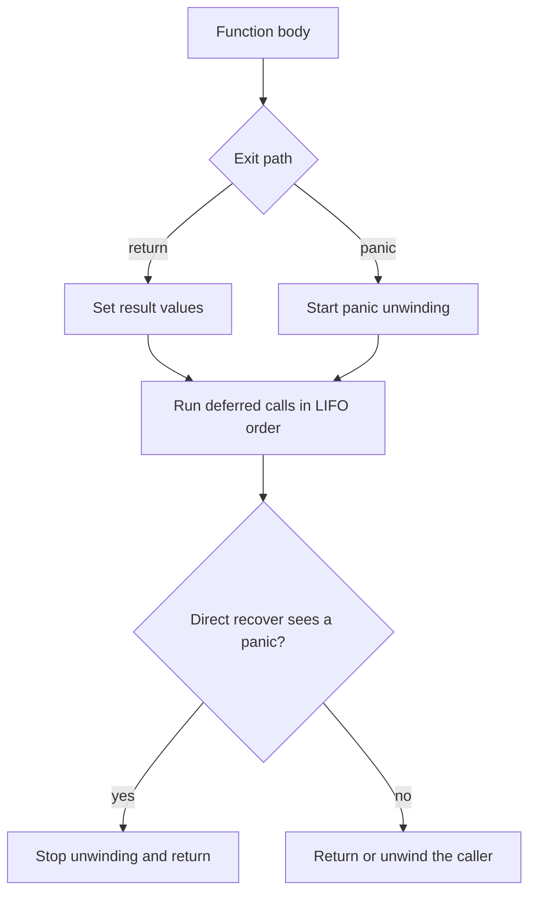

<TLDR>
  <TLDRCell label="what">
    `defer`把调用推迟到当前函数退出；`panic`沿当前goroutine的调用栈展开；直接在延迟函数中调用`recover`可以停止这次展开。
  </TLDRCell>
  <TLDRCell label="trap">
    `defer`的函数值和实参立即求值，但函数体稍后才运行；`recover`也不能跨goroutine或通过普通辅助函数捕获panic。
  </TLDRCell>
  <TLDRCell label="fix">
    获取资源后立即注册清理，把`panic`留给异常状态，并只在明确的goroutine或API边界恢复。
  </TLDRCell>
</TLDR>

## 是什么，为什么存在

`defer`是一条语句，它注册一个<Term id="deferred-call">延迟调用（deferred call）</Term>。当前函数无论正常返回、执行到函数体末尾，还是因`panic`退出，已注册的调用都会在函数真正退出前运行。它把“取得资源”和“安排释放”放在一起，减少早返回路径漏掉文件关闭、解锁或状态复原的机会。

`panic`和`recover`是预声明函数，不是错误返回值的替代语法。`panic`表示当前控制流不能继续，例如运行时检测到切片越界，或程序发现内部不变量已经被破坏。普通失败仍应返回`error`：文件不存在、请求无效或远端超时，都属于调用者可能处理的结果。

发生panic后，Go会开始<Term id="panic-unwinding">panic展开（panic unwinding）</Term>。运行时先执行当前函数的延迟调用，再沿同一个goroutine的调用栈逐层执行调用者的延迟调用。若一直没有恢复，程序会报告panic值和栈信息并终止。

`recover`让代码在一个刻意设置的<Term id="recovery-boundary">恢复边界（recovery boundary）</Term>把panic转成受控结果。它适合隔离任务、保护服务器请求入口，或把包内部已知的panic转成公开的`error`。它不等同于其他语言中可在任意位置使用的`catch`，也不会从触发panic的语句之后继续执行。

## 工作原理

执行`defer f(x)`时，Go会立即求出函数值`f`和实参`x`，并为这一次执行保存它们。实际调用要等当前函数退出。若延迟的是函数字面量，函数体运行时才读取它捕获的变量，因此“参数快照”和“闭包稍后读取”可能得到不同结果。

### 函数值与方法接收者

立即求值也适用于函数值和方法接收者。若变量`cleanup`在注册后指向另一个函数，已注册的调用仍使用原函数值；`defer object.Close()`也会在注册时确定接收者`object`。这让“释放刚取得的那个对象”保持稳定，不受变量后来重新赋值影响。

求值不等于调用。若延迟调用保存的函数值为`nil`，注册时不会panic；当前函数退出并尝试调用它时才会panic。任何实参求值本身产生的副作用或panic则发生在执行`defer`语句的当下。

同一函数内的延迟调用按注册顺序的逆序运行，也就是后进先出。正常`return`会先给结果参数赋值，再执行延迟调用，最后把结果交给调用者。因此，延迟闭包可以修改命名结果；这种能力应局限在短小、明确的收尾逻辑中。

`panic`会停止当前函数的普通语句，但不会跳过它的延迟调用。展开到某个函数`G`时，如果`G`直接延迟的函数调用了`recover`，`recover`会取得panic值并停止展开。`G`随后返回给自己的调用者；已经丢弃的中间栈帧不会恢复。

下面的流程同时覆盖正常返回和panic路径。恢复发生在延迟调用阶段，而不是触发panic的位置。



`recover`只有两个关键前提：调用它的函数必须正在作为延迟调用执行，而且panic必须来自同一个goroutine。普通函数调用中的`recover()`返回`nil`；父goroutine的延迟函数也看不到子goroutine的panic。边界必须安装在可能发生panic的那条执行栈上。

### 四种退出方式

几个看似相近的退出API对延迟调用和恢复有不同语义。区分它们能解释为什么某些清理代码根本没有机会运行。

| 退出方式 | 执行延迟调用 | `recover`能停止 | 结果 |
|---|---|---|---|
| 正常`return` | 是 | 不适用 | 返回调用者 |
| `panic` | 是 | 是，同一goroutine且直接调用 | 恢复或终止程序 |
| `runtime.Goexit` | 是 | 否 | 终止当前goroutine |
| `os.Exit` | 否 | 否 | 立即终止进程 |

`return`和`panic`是普通Go代码中最常见的两条退出路径。`Goexit`主要由运行时和测试基础设施使用，`os.Exit`则属于进程控制；把后二者当成普通函数返回会得到错误的清理假设。

panic值可以是任意类型，但边界需要能稳定记录和分类它。应用代码通常使用实现`error`的内部类型，并在确实允许转换的API边界保留其错误链。不要用易变的字符串前缀区分哪些panic可以恢复。

## 示例

### 求值时机与后进先出

这个例子把直接传参的延迟调用与捕获变量的延迟闭包放在一起。输出区分了注册时求值和退出时读取。

<Depth level="quick">

```go title="defer_order.go"
package main

import "fmt"

func main() {
	label := "draft"
	defer fmt.Println("argument:", label)
	defer func() {
		fmt.Println("closure:", label)
	}()

	label = "final"
	fmt.Println("body:", label)
}
```

```text
body: final
closure: final
argument: draft
```

</Depth>

`fmt.Println`的实参在第一条`defer`执行时已经保存，所以最后仍打印`draft`。闭包没有参数快照，它退出时读取`label`，看到的是`final`。闭包后注册，所以先运行。

实际代码中，如果清理需要资源句柄本身，直接把句柄作为接收者或参数通常更容易判断。只有当收尾逻辑确实需要退出时的状态，才让延迟闭包读取会变化的变量。

### 保留关闭错误

写入成功不代表数据已经成功刷新或关闭。下面的`saveReport`用命名结果让延迟函数合并写入错误与关闭错误，避免后一个错误覆盖前一个错误。

```go title="close_errors.go"
package main

import (
	"errors"
	"fmt"
	"io"
)

type reportSink struct {
	writeErr error
	closeErr error
}

func (s *reportSink) Write(p []byte) (int, error) {
	if s.writeErr != nil {
		return 0, s.writeErr
	}
	return len(p), nil
}

func (s *reportSink) Close() error { return s.closeErr }

func saveReport(sink io.WriteCloser) (err error) {
	defer func() {
		err = errors.Join(err, sink.Close())
	}()

	if _, err = sink.Write([]byte("weekly totals\n")); err != nil {
		return fmt.Errorf("write report: %w", err)
	}
	return nil
}

func main() {
	closeOnly := &reportSink{closeErr: errors.New("flush failed")}
	both := &reportSink{
		writeErr: errors.New("disk full"),
		closeErr: errors.New("flush failed"),
	}

	fmt.Printf("close only: %v\n", saveReport(closeOnly))
	fmt.Printf("both:\n%v\n", saveReport(both))
}
```

```text
close only: flush failed
both:
write report: disk full
flush failed
```

`errors.Join`会忽略`nil`，因此关闭成功时不会制造错误。如果写入和关闭都失败，返回的错误同时包装两者，调用者可用`errors.Is`或`errors.As`检查任意一条错误链。这里的模拟sink只为让两条路径稳定复现。

命名结果会增加隐式状态，所以延迟函数应保持短小。若API明确规定关闭错误无意义，例如只读文件在读取结束后的关闭，简单的`defer file.Close()`可能已经足够；写入器和事务则需要检查各自的提交或关闭契约。

### 展开并恢复

下一段代码展示panic如何先触发各层清理，再到达恢复函数。恢复之后，`run`返回到`main`，不会重新执行`loadIndex()`后面的语句。

```go title="unwind.go"
package main

import "fmt"

func loadIndex() {
	defer fmt.Println("loadIndex cleanup")
	panic("invalid index")
}

func run() {
	defer func() {
		if value := recover(); value != nil {
			fmt.Println("recovered:", value)
		}
	}()
	defer fmt.Println("run cleanup")

	loadIndex()
	fmt.Println("unreachable")
}

func main() {
	fmt.Println("start")
	run()
	fmt.Println("continued")
}
```

```text
start
loadIndex cleanup
run cleanup
recovered: invalid index
continued
```

恢复函数在`run`中最先注册，因此在`run cleanup`之后才运行。它直接调用`recover`，取得字符串panic值。若删除这一个延迟函数，展开会继续越过`main`，程序最终终止。

示例为了展示机制而打印panic值。生产边界通常还要记录`runtime/debug.Stack()`，关联任务或请求标识，并决定当前状态能否安全继续；若答案是否定的，就不应恢复。

### 保护goroutine入口

一个goroutine不能恢复另一个goroutine的panic。要隔离独立任务，恢复函数必须放在新goroutine的入口附近，并通过明确的结果通道把失败交还给所有者。

```go title="goroutine_boundary.go"
package main

import "fmt"

type result struct {
	name string
	err  error
}

func guarded(name string, job func(), out chan<- result) {
	var err error
	defer func() {
		if value := recover(); value != nil {
			err = fmt.Errorf("panic: %v", value)
		}
		out <- result{name: name, err: err}
	}()

	job()
}

func main() {
	results := make(chan result, 2)
	go guarded("email", func() {}, results)
	go guarded("index", func() { panic("negative shard") }, results)

	byName := make(map[string]error)
	for range 2 {
		outcome := <-results
		byName[outcome.name] = outcome.err
	}

	fmt.Printf("email: %v\n", byName["email"])
	fmt.Printf("index: %v\n", byName["index"])
}
```

```text
email: <nil>
index: panic: negative shard
```

两个goroutine的完成顺序不确定，所以示例先按名称保存结果，再按固定顺序打印。缓冲通道也让延迟函数发送结果时不依赖`main`已经开始接收。真实任务系统还需要取消、容量限制和栈记录，这些职责不能靠`recover`自动获得。

这里捕获所有panic是任务隔离器的既定契约，不适合包住任意业务函数。如果panic表示共享状态已经损坏，仅把它改写成`error`会让进程带着未知状态继续运行；边界必须明确哪些失败允许隔离。

## 陷阱

> [!PITFALL]
> 在长循环中直接`defer`关闭每个资源，会把全部资源保留到外围函数结束，而不是本轮迭代结束。

**修复：** 把一次迭代提取成函数，并在该函数内注册关闭。这样每次调用结束就释放资源。不要为了避开`defer`而复制多条手工清理路径，那会重新引入早返回泄漏。

> [!PITFALL]
> `log.Fatal`最终调用`os.Exit(1)`，`os.Exit`会立即终止程序，不执行任何延迟调用。

**修复：** 底层函数返回错误，让拥有进程退出策略的最外层决定如何记录和返回退出码。若`main`需要执行自己的延迟清理，就让它正常返回；在`main`中调用`os.Exit`同样会跳过这些清理。

> [!PITFALL]
> 用一个宽泛的`recover`包住大量业务代码，会把空指针、越界和不变量破坏伪装成普通失败，进程随后可能继续使用损坏状态。

**修复：** 只在任务、请求或包API的明确边界恢复，并记录原始panic值与栈。包内部若用私有panic类型简化递归展开，只转换该已知类型；遇到未知值时重新`panic`。

> [!PITFALL]
> 在父goroutine中注册`recover`，或从延迟函数再调用一个封装`recover`的普通辅助函数，都无法捕获目标panic。

**修复：** 在可能panic的同一个goroutine中直接`defer func() { value := recover(); ... }()`。创建goroutine的封装器应同时负责汇报结果，避免恢复后悄悄丢失任务。

> [!PITFALL]
> 忽略`Close`、`Flush`或事务提交的错误，可能把尚未持久化的数据当作成功；反过来，无条件覆盖原错误又会丢失更早的失败。

**修复：** 阅读具体接口契约。关闭失败有意义时，用命名结果或显式收尾合并错误，并保留原始错误链。对锁的`Unlock`等不返回错误的操作，直接延迟调用即可。

> [!PITFALL]
> 先声明一个nil函数变量，再写`defer cleanup()`，不会在注册时失败，而会在退出阶段调用nil函数时panic。

**修复：** 在注册前验证可选回调，或只在它非nil时注册。不要依赖后面的赋值来“补上”函数，因为`defer`已经保存了注册时的函数值。

<Depth level="deep">

## 恢复边界的细节

### `panic(nil)`

Go 1.27规范保证：当goroutine正在panicking，且`recover`由延迟函数直接调用时，返回值不会是`nil`。因此，`if value := recover(); value != nil`可以可靠地区分有效恢复与普通执行。向`panic`传入无类型`nil`或值为nil的接口仍会触发运行时panic，恢复方会看到非nil值。

这种保证不意味着应使用`panic(nil)`。panic值应携带足够的故障上下文，通常是错误值或能稳定格式化的内部类型。边界不要依赖运行时错误字符串做类型判断；字符串可能随实现调整，也无法让`errors.Is`工作。

### `Goexit`与`os.Exit`

`runtime.Goexit`会终止调用它的goroutine，同时执行该goroutine栈上的全部延迟调用，但它不是panic。任何延迟函数中的`recover`都会返回`nil`。在`main` goroutine调用`Goexit`会让其他goroutine继续；当没有goroutine能继续执行时，运行时会以死锁故障终止程序。

`os.Exit`的行为更直接：进程立即以给定状态码退出，延迟调用完全不运行。`log.Fatal`先输出日志再调用它。因此，把`defer`当作进程级finally是错误的；它只约束Go函数和goroutine的正常返回或panic展开路径。

### 恢复后的控制流

设函数`G`延迟了恢复函数`D`，然后`G`调用的更深层函数发生panic。`D`成功恢复时，panic点与`G`之间的函数状态已被丢弃，`G`不会从原调用之后继续。`G`的其他尚未执行的延迟调用仍按逆序运行，然后`G`返回自己的调用者。

这个规则决定了恢复边界应放在哪里。边界太低，局部代码可能在不变量破坏后假装成功；边界太高，一个任务的失败可能终止整个进程。选择边界时要写清楚可丢弃的工作单元、失败结果的传递方式，以及恢复后仍可信的状态。

## 恢复契约的设计

恢复首先是一项所有权决定。HTTP服务器可以把单次请求当作可丢弃单元，工作池可以把单个任务当作可丢弃单元，但两者都不能据此假设共享缓存、锁保护的数据或事务仍然有效。边界的注释和类型应说清楚它隔离的对象。

恢复还需要一条完整的失败通道。只写日志会让调用者误以为任务成功，只返回`fmt.Errorf("panic: %v", value)`又会丢失栈。边界通常同时向所有者返回失败、记录`debug.Stack()`，并附上请求或任务标识。

恢复函数本身必须足够可靠。它不应依赖刚刚可能被破坏的复杂状态，也不应在持锁状态下执行可能再次panic的格式化或网络调用。先恢复最小不变量和释放本地资源，再把诊断数据交给外层设施。

### 选择边界高度

可以从最小的独立工作单元开始判断：该单元失败后，调用者能否用一个明确的失败值继续，而且不会复用它修改到一半的状态。答案为“能”时，入口是候选边界；答案为“不能”时，应让panic继续展开。

库的公开API是另一种常见边界，但只适用于库主动使用且能识别的内部panic。运行时产生的未知panic通常表示调用者或库本身的缺陷，贸然转换会抹掉故障类别。服务框架最外层的兜底恢复仍应记录完整诊断，并把当前请求标记为失败。

### 测试恢复契约

测试不能只断言“进程没有崩溃”。它应证明延迟调用的顺序、调用次数、错误保留和任务完成信号都符合边界契约。

- 让工作函数正常返回，确认恢复路径没有制造错误。
- 让工作函数返回普通错误，确认代码没有把它升级成panic。
- 注入一个已知panic，确认边界报告值与栈，并且只完成一次任务。
- 在清理函数中注入失败，确认原始失败不会被覆盖或静默丢弃。

并发测试还应等待所有任务结束，并在竞态检测器下运行。`go test -race`不能证明恢复策略正确，但能发现恢复后继续访问共享状态时暴露的数据竞争。针对进程退出行为的测试应放在子进程中，避免`os.Exit`终止测试进程。

</Depth>

<Checkpoint id="go/defer-panic-recover" />

## 延伸阅读

- [Go语言规范：Defer statements](https://go.dev/ref/spec#Defer_statements)
- [Go语言规范：Handling panics](https://go.dev/ref/spec#Handling_panics)
- [Go 1.27发布说明](https://go.dev/doc/go1.27)
- [`errors.Join`文档](https://pkg.go.dev/errors#Join)
- [`runtime.Goexit`文档](https://pkg.go.dev/runtime#Goexit)
- [`os.Exit`文档](https://pkg.go.dev/os#Exit)
