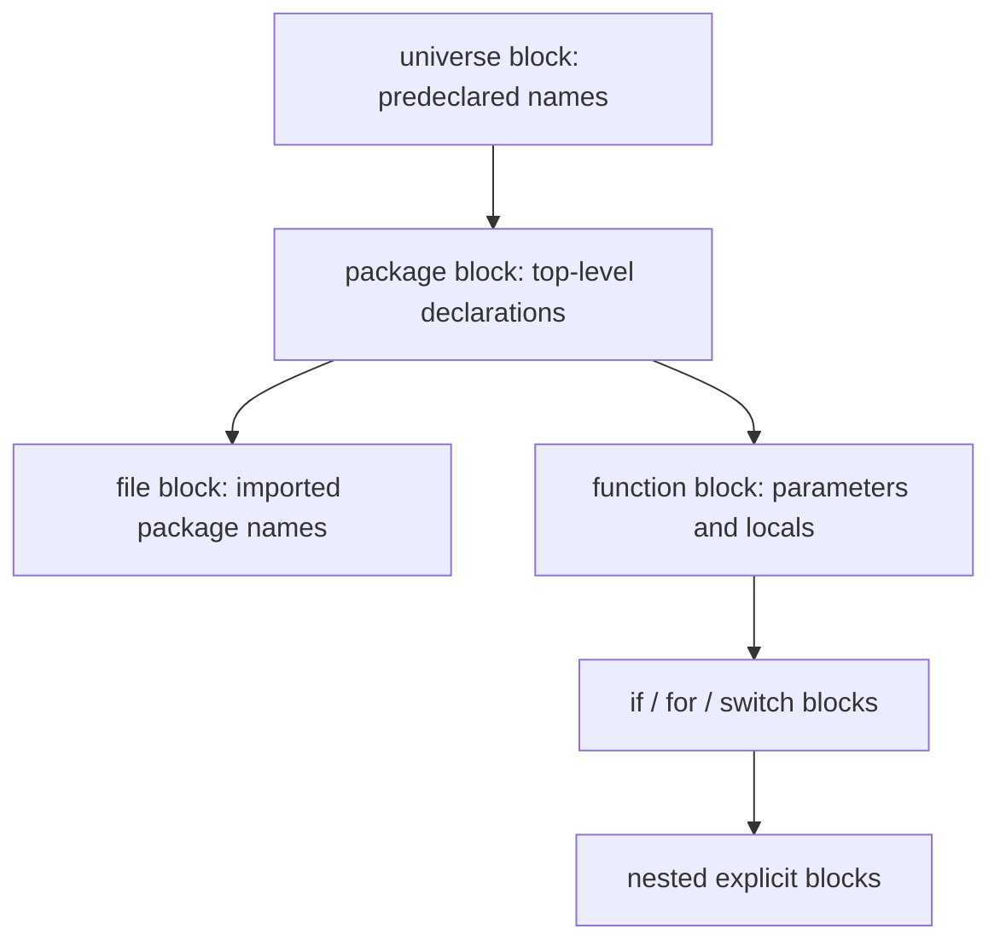

<TLDR>
  <TLDRCell label="what">
    Go fundamentals are the core rules that make a source file compile: packages, typed values, declarations, functions, and structured control flow.
  </TLDRCell>
  <TLDRCell label="trap">
    `:=` can create a same-named variable in an inner scope, while `len(string)` counts bytes; both can leave compiling code with the wrong result.
  </TLDRCell>
  <TLDRCell label="fix">
    Identify every name's scope and type first. Use `=` to update an existing variable, and use `range` or `unicode/utf8` when text must be processed as Unicode code points.
  </TLDRCell>
</TLDR>

## What it is and why it exists

Go is a strongly typed, garbage-collected, compiled language with direct support for concurrency. An executable Go program consists of packages; the `main` function in package `main` is its entry point. Go fundamentals are the smallest useful language model for reading and writing such programs, not a catalog of standard-library APIs.

The model has straightforward constraints: every value has a type, every name has a scope, and a small set of statements controls execution. The compiler rejects unused local variables and imports, assignments with incompatible types, and many ambiguous forms. That feedback is strict, but it removes a class of mechanical errors before the program runs.

You meet these rules in your first command-line program, test file, and service entry point. Slices, maps, structs, methods, interfaces, error handling, and goroutines all build on the same rules for declarations, expressions, functions, and scope, but each deserves separate treatment.

This topic covers source-file structure, basic types, variables and constants, functions, and `if`, `switch`, and `for` control flow. It does not expand on `defer`, `panic`, methods, or concurrency because sibling topics cover their individual contracts.

## How it works

### Files, packages, and the entry point

Every non-empty Go source file begins by declaring its package, such as `package main`. Files in one directory that take part in a build normally belong to the same package and jointly define its package-level names. The package clause can be followed by imports, then top-level declarations such as constants, variables, types, and functions.

An import path identifies another package, and code selects its exported names through the package name, as in `fmt.Println`. Whether an identifier begins with a Unicode uppercase letter determines whether another package can access it; Go has no `public` or `private` modifier here. An import is available only in its source file, even when another file in the package already imports the same package.

An executable uses `package main` and defines `func main()` with no parameters or results. A library package has no such entry point and is imported by other packages. A module controls import paths and dependency versions, while a package is a compilation and namespace unit; they are not the same concept.

### Values always have types

A type determines a set of values and the operations available on them. Predeclared basic types include `bool`, `string`, signed and unsigned integers, floating-point numbers, and complex numbers. The width of `int` and `uint` is implementation-dependent, so protocols, file formats, and fixed layouts should use explicit widths such as `int32` or `uint64`.

`byte` is an alias for `uint8` and usually expresses a raw byte. A <Term id="rune">rune</Term> is an alias for `int32` and usually expresses a Unicode code point. An alias does not declare a new type, so `byte` and `uint8` are two names for one type, as are `rune` and `int32`.

A string is an immutable byte sequence. It commonly holds UTF-8 text, but the language permits arbitrary bytes. Indexing a string produces one byte; ranging over it decodes Unicode code points and reports the byte index where each code point starts. One user-perceived character can contain several code points, so a rune count is not necessarily a grapheme count.

Arrays, slices, maps, structs, pointers, functions, interfaces, and channels are composite types. They still follow the same rule: a variable can hold only values assignable to its static type. Interface values also have a runtime dynamic type, but that belongs in the interfaces topic.

### Declarations, assignment, and scope

A variable is a storage location that holds a value. A declaration can state its type or let the compiler perform <Term id="type-inference">type inference</Term>. Inference determines a compile-time type; assigning a different kind of value later cannot change that type.

The common declaration forms differ as follows:

| Form | Type source | Initial value | Where it works |
| --- | --- | --- | --- |
| `var count int` | Explicit `int` | The zero value of `int` | Package level or inside a function |
| `var count = 3` | Inferred from the initializer | `3` | Package level or inside a function |
| `count := 3` | Inferred from the right side | `3` | Inside a function only |
| `const limit = 3` | Remains untyped until context requires a type | Exact constant value `3` | Package level or inside a function |

A variable without an explicit initializer receives its type's <Term id="zero-value">zero value</Term>. Numbers use `0`, booleans use `false`, and strings use `""`; the zero value of pointers, slices, maps, functions, interfaces, and channels is `nil`. A zero value is always valid, but whether a particular operation can safely use it still depends on the type.

The <Term id="short-variable-declaration">short variable declaration</Term> `:=` declares and initializes names, and it works only inside a function body. In the same block, at least one non-blank name on the left must be new; the other names may receive new values. A same-named declaration in an inner `if` or `for` block creates another variable.

`=` assigns to variables that already exist; it does not declare names. Braces create explicit blocks, while function bodies and `if`, `switch`, and `for` constructs introduce their associated scopes. To decide whether a line updates existing state or creates new state, inspect both the operator and the block containing it.

### Name lookup and shadowing

An identifier's declaration determines the entity its name denotes. When code reads a name, the compiler searches outward from the innermost scope. An inner declaration can temporarily hide an outer declaration with the same name; this is shadowing. The declarations refer to two variables, and the outer variable and its old value remain after the inner block ends.

The common scopes have the nesting shown below. An arrow means that code in the inner scope can continue looking outward for a name that has not been shadowed.



A package-level name belongs to the package block and can be referenced from another file in that package. An imported package name belongs only to the file block containing that import, so another file cannot borrow it. Parameters, result parameters, and local variables belong to a function or a smaller inner block.

Scope also depends on where a declaration appears. Most local variables enter scope after their declaration ends, so a same-named reference on the right side of an initializer may still refer to an outer entity. This rule is particularly easy to misread when a short declaration handles several names at once.

Shadowing is not a syntax error. Sometimes a short-lived inner value can reasonably reuse a short name, but shadowing `err`, a result variable, or a state flag often changes control flow. Judge the name in the context of ownership and where later reads occur.

### Expressions and explicit conversions

Go does not automatically convert between ordinary numeric variables. Before multiplying an `int` by a `float64`, you must write an explicit conversion such as `float64(quantity)`. A conversion produces a new value of the target type and may discard information; it does not change the source variable's type.

Constants are more flexible. An untyped numeric constant can retain an exact value until assignment, an explicit conversion, a function call, or another context requires a concrete type. The value must be representable by the target type, so `var level uint8 = 255` compiles while assigning the constant `256` to `uint8` fails at compile time.

Operators accept only the operand combinations defined by the language. Go has no truthiness rule that treats `0` or an empty string as a boolean; a condition must have type `bool`. `++` and `--` are statements, so they cannot appear inside an expression or function argument.

### Assignment evaluates the right side first

A multi-value assignment first determines the left operands and evaluates every right-side expression, then performs assignments from left to right. This makes `left, right = right, left` a valid swap without a temporary variable. It also means you must review a multi-value assignment as a unit rather than assume its first assignment has affected the calculation of a later right-side expression.

Compound assignments such as `+=` and `-=` require an existing left operand and combine its read, operation, and write into one statement. They do not declare a variable. `count++` and `count--` likewise update an existing variable and produce no result for another expression to consume.

Several values returned by a function can directly fill a multi-value assignment, as in `cost, supported = shippingCost(country, subtotal)`. If the left side instead uses `:=`, the short declaration rule still requires at least one new name in the current block. The mere presence of several names does not make all of them new variables.

### Functions and control flow

A function signature states parameter and result types. Adjacent parameters of one type can be written as `func add(left, right int) int`, and a function can return several results. Multiple results commonly deliver a domain value together with a status boolean or an `error`.

An `if` can execute a short statement before its condition, as in `if value, err := read(); err != nil { ... }`. Names declared there are visible only throughout that `if` and its branches. Declaring a result there when later code still needs it causes a scope error.

A `switch` chooses the first matching branch and exits after executing it; individual branches need no `break`. One `case` can list several expressions, and a `switch` without an expression can replace a less readable `if`/`else if` chain. `fallthrough` unconditionally enters the next branch body, so ordinary grouping does not require it.

Go has only the `for` loop statement, with three common forms: a loop with initialization, condition, and post statement; a condition-only loop; and iteration with `range`. `break` ends a loop or `switch`, while `continue` starts the next iteration. A label can target an outer loop, but simple control flow rarely needs one.

### Toolchain feedback

`gofmt` applies standard whitespace, indentation, and import grouping so the syntax is easier to review. It is not a type checker and does not prove behavior; a successfully formatted file can still fail to compile.

`go run file.go` compiles and runs a small program, which suits the standalone examples in this topic. Project code usually uses `go test ./...` to compile packages and run tests together. Resolve scope, type, and unused-name diagnostics from the compiler before assessing the business failures exposed by tests.

Run build commands from the correct module directory because the module file affects language versions and dependency selection. Copying generated code into an isolated temporary file verifies only that file; it does not replace a build and test in the real package.

Tool output is evidence about syntax and behavior, not decoration to reconstruct from memory.

## Examples

The four programs below add concepts in sequence. Each code block can be saved separately and run with `go run filename`; the displayed output came from the local Go toolchain.

### Produce a result from declarations

This program combines a package, an import, an untyped constant, a zero-valued variable, short declarations, and an explicit conversion. `pendingOrders` starts at its zero value, while the other local variables infer types from their initializers.

<Depth level="quick">

```go run title="declarations.go"
package main

import "fmt"

const taxRate = 0.20

func main() {
	var pendingOrders int
	item := "keyboard"
	quantity := 2
	unitPrice := 75.0

	subtotal := float64(quantity) * unitPrice
	total := subtotal * (1 + taxRate)
	pendingOrders++

	fmt.Println("item:", item)
	fmt.Println("pending before shipment:", pendingOrders)
	fmt.Printf("subtotal: %.2f\n", subtotal)
	fmt.Printf("total: %.2f\n", total)
}
```

```text
item: keyboard
pending before shipment: 1
subtotal: 150.00
total: 180.00
```

</Depth>

The inferred type of `quantity` is `int`, while the inferred type of `unitPrice` is `float64`. They cannot be multiplied directly, so the program explicitly converts the quantity to `float64`. `taxRate` is representable as `float64` in the multiplication context and needs no separate conversion.

Here `pendingOrders++` is a complete statement. Writing `fmt.Println(pendingOrders++)` would fail to compile because increment is not an expression that produces a value.

### Express one decision with a function

`shippingCost` returns both a cost and whether the destination is supported. The caller handles the unsupported case before using the cost. This is clearer than making a special cost value mean both an ordinary result and failure.

```go run title="shipping.go"
package main

import "fmt"

func shippingCost(country string, subtotal int) (int, bool) {
	if subtotal >= 100 {
		return 0, true
	}

	switch country {
	case "FR", "DE":
		return 8, true
	case "GB":
		return 12, true
	default:
		return 0, false
	}
}

func main() {
	countries := [3]string{"FR", "GB", "CA"}
	subtotals := [3]int{120, 75, 50}

	for index, country := range countries {
		cost, supported := shippingCost(country, subtotals[index])
		if !supported {
			fmt.Printf("%s: unavailable\n", country)
			continue
		}
		fmt.Printf("%s: subtotal=%d shipping=%d\n", country, subtotals[index], cost)
	}
}
```

```text
FR: subtotal=120 shipping=0
GB: subtotal=75 shipping=12
CA: unavailable
```

The first order qualifies for free shipping because its subtotal reaches `100`, so the function returns before the `switch`. The second matches `GB`, and the third reaches `default`. Each matching branch here returns, but Go's `switch` would not automatically enter the next branch even without those returns.

The loop uses `index` to read the subtotal in the corresponding position, while `country` is a copy of that array element. A real program would usually put related fields in one struct. The parallel arrays here keep the example focused on functions and control flow.

### Separate bytes, code points, and decimal text

The string below contains two ASCII characters and two Chinese code points. The program also compares converting an integer to a string with formatting that integer as decimal text. Those operations have different meanings.

```go run title="strings.go"
package main

import (
	"fmt"
	"strconv"
	"unicode/utf8"
)

func main() {
	label := "Go语言"

	fmt.Println("bytes:", len(label))
	fmt.Println("runes:", utf8.RuneCountInString(label))
	for byteIndex, codePoint := range label {
		fmt.Printf("byte %d: %c\n", byteIndex, codePoint)
	}

	code := 65
	fmt.Println("string(65):", string(code))
	fmt.Println("strconv.Itoa(65):", strconv.Itoa(code))
}
```

```text
bytes: 8
runes: 4
byte 0: G
byte 1: o
byte 2: 语
byte 5: 言
string(65): A
strconv.Itoa(65): 65
```

`len(label)` returns the `8` bytes in its UTF-8 encoding. The `range` indices are therefore `0`, `1`, `2`, and `5`, not consecutive code-point positions. `utf8.RuneCountInString` decodes the string and reports `4` code points.

`string(code)` interprets the integer `65` as Unicode code point U+0041, so its result is `A`. `strconv.Itoa(code)` is the operation that writes the integer as decimal text, `"65"`.

## Pitfalls

### `:=` shadows the variable you meant to update

> [!PITFALL]
> Using `:=` in an inner block can create a same-named variable. The outer variable keeps its old value while the code still compiles.

A common case writes `result, err := operation()` inside an `if`, then assumes that the function's outer `result` was updated. **Fix:** declare names in the scope that needs them and assign with `=`. Also enable compiler or editor shadow diagnostics and test the value actually returned on the success path.

### Treating a byte index as a character index

> [!PITFALL]
> `text[index]` returns a byte and `len(text)` returns a byte count, so slicing UTF-8 text with those results can cut through an encoded code point.

**Fix:** use `[]byte` explicitly when a protocol deals in bytes. Use `range` or `[]rune` when it deals in Unicode code points. If the boundary is a user-perceived grapheme cluster, use a dedicated Unicode segmentation implementation; counting runes is still insufficient.

### Assuming a conversion is lossless

> [!PITFALL]
> Writing `T(value)` requests a conversion; it does not promise to preserve the numeric range, precision, or original meaning.

Converting a floating-point value to an integer discards its fractional part, and narrower numeric types cannot represent every source value. **Fix:** check the accepted range before conversion and test boundary values. For number-to-text conversion, use `strconv` or formatting rather than the code-point semantics of `string(integer)`.

### Using the blank identifier to hide errors

> [!PITFALL]
> The blank identifier `_` can satisfy the compiler's requirement to use local values, but `value, _ := strconv.Atoi(raw)` silently turns invalid input into a zero-valued result.

**Fix:** discard a result only when both the API contract and the calling context prove it irrelevant. Handle or return an `error` explicitly. Do not mechanically replace diagnostics with `_` just to make generated code compile.

### Expecting `switch` to fall through

> [!PITFALL]
> Code translated from C, Java, or JavaScript may rely on cases falling through automatically, but Go exits the `switch` after the matching branch.

**Fix:** list values in one case when they share behavior, as in `case "FR", "DE":`. Use `fallthrough` only when the next branch body must execute unconditionally, and do not use it to simulate complex conditions.

## In the AI era

**What generated code gets wrong here**

Models often carry surface syntax from other languages into Go, including `while`, the `?:` ternary operator, `count++` inside an expression, or implicit arithmetic between `int` and `float64`. Those errors usually do not compile. More dangerous failures do compile: shadowing a result or `err` with `:=` inside an `if`, treating string indices as character positions, and discarding parse errors with `_`.

**Ask your AI to check**

- List every name on the left of `:=` and say whether it is new in the current block, reassigned, or shadowing an outer name.
- For every numeric conversion, state the source type, target type, allowed range, and handling for out-of-range or fractional input.
- Mark every string index, slice, and `len` call, then state whether the domain unit is bytes, Unicode code points, or grapheme clusters.

**Review checklist**

- Compile the real code with `gofmt` and `go test` or `go run`; do not accept a model's account of the syntax as verification.
- Inspect the scope of short declarations and `if` initializer statements, confirming that later reads reach the intended variable.
- Exercise input paths with empty strings, invalid numbers, boundary values, and non-ASCII text.

**Prompt vocabulary**

Use the exact terms `short variable declaration`, `shadowing`, `zero value`, `untyped constant`, `representability`, `explicit conversion`, `byte index`, and `rune`. Asking the model to name each identifier's block and each expression's static type exposes concrete mistakes better than asking it to "make the code more Go-like."

<Depth level="deep">

## Untyped constants and representability

A Go constant is not a read-only variable. An <Term id="untyped-constant">untyped constant</Term> can retain an exact value within the precision required by the language and does not have the fixed type of an ordinary variable until a concrete context appears. Integer, rune, floating-point, complex, Boolean, and string constants each have a default type.

The default type is used only when a context needs an ordinary type. For example, `value := 3` gives the untyped integer constant its default type, `int`, while assigning the same constant directly to a `uint8` variable supplies a `uint8` context. An `any` parameter supplies no more specific target type, so the constant takes its default type there too.

### Context supplies the type

Below, `maxRetries` can be assigned to `uint8` because that type can represent the value `8`. `exactThird` remains an exact constant until assignment to `float32` rounds it. Passing it directly to `fmt.Printf` instead applies its default type, `float64`.

```go run title="constants.go"
package main

import "fmt"

const (
	maxRetries = 1 << 3
	exactThird = 1.0 / 3.0
)

func main() {
	var retries uint8 = maxRetries
	var rounded float32 = exactThird

	fmt.Printf("retries: %d (%T)\n", retries, retries)
	fmt.Printf("rounded: %.9f\n", rounded)
	fmt.Printf("default type: %T\n", exactThird)
}
```

```text
retries: 8 (uint8)
rounded: 0.333333343
default type: float64
```

Representability of a constant assignment is checked at compile time. Changing `maxRetries` to `1 << 8` makes `var retries uint8 = maxRetries` fail because `256` is outside the value set of `uint8`. The failure cannot be deferred until runtime.

Conversions of ordinary variables follow different rules. A variable already has a concrete type and value, and an explicit conversion can lose information at runtime. The fact that the compiler rejects an analogous constant assignment does not imply that every variable conversion receives the same protection.

### Loop variables after Go 1.22

Since Go 1.22, a variable declared with `:=` in a `for` initializer has a separate instance for each iteration. Iteration variables declared with `:=` in a `range` clause have the same per-iteration semantics. The `value := value` closure-capture workaround common in older material is generally redundant in new code compiled with the Go 1.22 or later language version.

The behavior still depends on the declaration form and the Go language version selected by the module. A `range` clause that uses `=` to assign variables declared outside the loop continues to reuse those variables. When reviewing generated concurrent callbacks, inspect the `go` directive in `go.mod` and the loop spelling before deciding whether capture is wrong.

### The boundary of strict compiler checks

The Go compiler rejects unused imports and local variables inside functions, but it permits unused package-level declarations. The blank identifier can explicitly discard values and can request an import solely for side effects. Both forms should communicate real intent rather than serve as universal ways to erase diagnostics.

Successful compilation proves only that code satisfies language and type rules. It does not prove that units are correct, input was validated, errors were retained, or string boundaries match the product's definition of a "character." Pair basic syntax checks with tests of inputs and behavior.

</Depth>

<Checkpoint id="go/fundamentals" />

## Further reading

- [The Go programming language specification](https://go.dev/ref/spec)
- [Effective Go](https://go.dev/doc/effective_go)
- [A Tour of Go](https://go.dev/tour/)
- [`unicode/utf8` package](https://pkg.go.dev/unicode/utf8)
