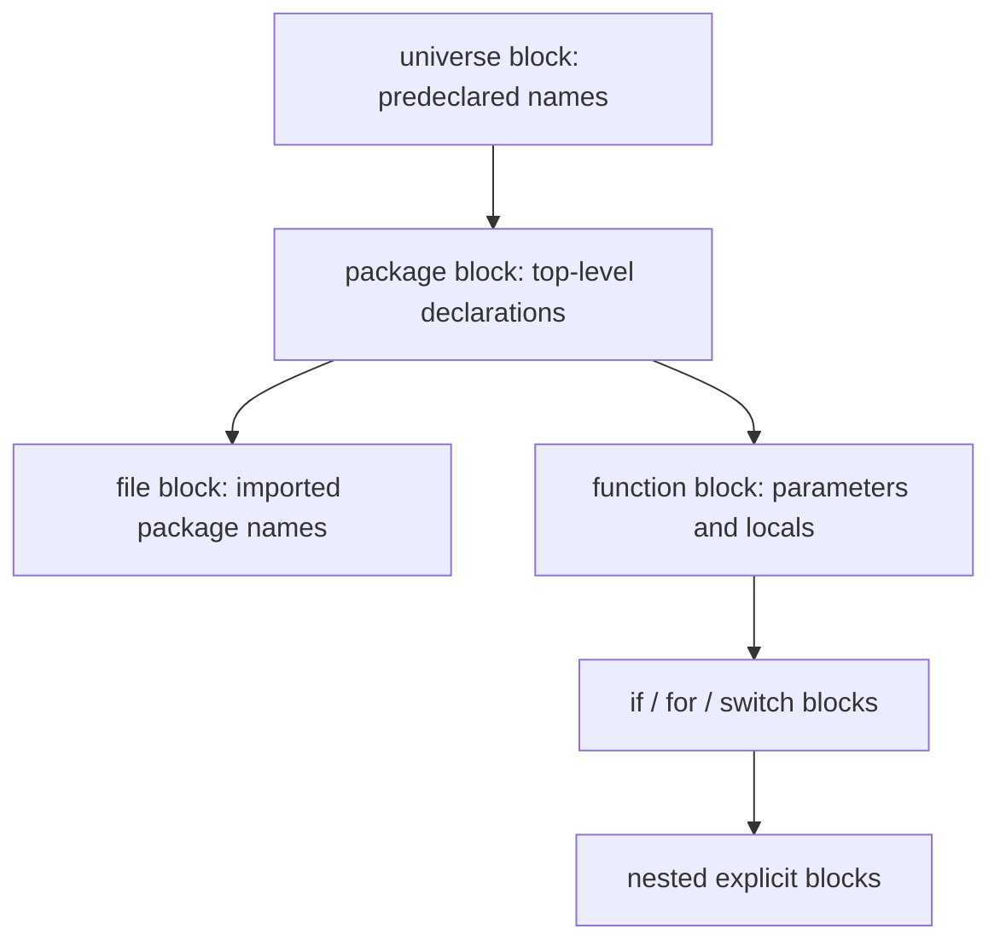

<TLDR>
  <TLDRCell label="what">
    Go 基础是一组能让源文件编译运行的核心规则：包、带类型的值、声明、函数和结构化控制流。
  </TLDRCell>
  <TLDRCell label="trap">
    `:=` 可能在内层作用域创建同名变量，`len(string)` 计算的又是字节数；两者都容易让能编译的代码产生错误结果。
  </TLDRCell>
  <TLDRCell label="fix">
    先明确每个名称的作用域与类型；需要更新已有变量时用 `=`，按 Unicode 码点处理文本时用 `range` 或 `unicode/utf8`。
  </TLDRCell>
</TLDR>

## 是什么，为什么存在

Go 是一门强类型、带垃圾回收并直接支持并发的编译型语言。一个可执行 Go 程序由包组成；`main` 包中的 `main` 函数是入口。Go 基础就是读写这类程序所需的最小语言模型，而不是标准库 API 的清单。

这个模型的核心约束很直接：每个值都有类型，每个名称都有作用域，控制流由少量语句组成。编译器会拒绝未使用的局部变量和导入、类型不匹配的赋值以及许多模糊写法。反馈严格，但它能在运行前消除一批机械错误。

你会在第一个命令行程序、测试文件和服务入口中遇到这些规则。切片、map、结构体、方法、接口、错误处理和 goroutine 都建立在同一套声明、表达式、函数与作用域规则之上，但它们各自需要单独学习。

本主题只覆盖源文件结构、基本类型、变量与常量、函数，以及 `if`、`switch`、`for` 控制流。`defer`、`panic`、方法和并发不放在这里展开，因为对应主题会讲清它们各自的契约。

## 工作原理

### 文件、包与入口

每个非空 Go 源文件先声明所属包，例如 `package main`。同一目录中参与一次构建的文件通常属于同一个包，并共同定义包级名称。包声明之后可以是导入，再之后是常量、变量、类型和函数等顶层声明。

导入路径标识另一个包，代码通过包名选择其导出名称，例如 `fmt.Println`。标识符首字母是否为 Unicode 大写字母决定它能否从其他包访问；这不是类中的 `public` 或 `private` 修饰符。导入只在当前源文件中可用，即使同包的另一个文件已经导入过它。

可执行程序使用 `package main`，并定义无参数、无返回值的 `func main()`。库包没有这个入口，供其他包导入。模块决定导入路径和依赖版本，包则是编译与命名空间单位，两者不是同一概念。

### 值始终有类型

类型决定值的集合以及可执行的操作。预声明基本类型包括 `bool`、`string`、各种有符号与无符号整数、浮点数和复数。`int` 与 `uint` 的宽度由实现决定，编写协议、文件格式或固定布局时应使用 `int32`、`uint64` 等明确宽度。

`byte` 是 `uint8` 的别名，通常用来表达原始字节。<Term id="rune">符文（rune）</Term>是 `int32` 的别名，通常用来表达 Unicode 码点。别名不会创建新类型，因此 `byte` 与 `uint8`、`rune` 与 `int32` 分别是同一类型的两个名字。

字符串是不可变的字节序列，通常保存 UTF-8 文本，但语言允许其中出现任意字节。对字符串索引会得到一个字节；用 `range` 遍历字符串会解码 Unicode 码点，并给出每个码点起始处的字节索引。用户眼中的一个字符还可能由多个码点组成，因此 rune 数也不等于字形数。

数组、切片、map、结构体、指针、函数、接口和通道属于复合类型。它们仍遵守同一条原则：变量只能保存可赋给其静态类型的值。接口值还带有运行时动态类型，但这属于接口主题的范围。

### 声明、赋值与作用域

变量是保存值的存储位置。声明可以明确写出类型，也可以让编译器进行<Term id="type-inference">类型推断（type inference）</Term>。推断只决定编译期类型；变量之后不能因为赋入另一种值而改变类型。

常用声明形式的差别如下：

| 形式 | 类型来源 | 初始值 | 可用位置 |
| --- | --- | --- | --- |
| `var count int` | 明确写出 `int` | `int` 的零值 | 包级或函数内 |
| `var count = 3` | 从初始化表达式推断 | `3` | 包级或函数内 |
| `count := 3` | 从右侧推断 | `3` | 仅函数内 |
| `const limit = 3` | 保持为无类型常量，直到上下文要求类型 | 精确常量值 `3` | 包级或函数内 |

没有显式初始化的变量会得到其类型的<Term id="zero-value">零值（zero value）</Term>。数值是 `0`，布尔值是 `false`，字符串是 `""`；指针、切片、map、函数、接口和通道的零值是 `nil`。零值始终是合法值，但某个操作是否能安全使用它仍取决于具体类型。

<Term id="short-variable-declaration">短变量声明（short variable declaration）</Term> `:=` 同时声明并初始化名称，而且只能出现在函数体中。在同一个代码块里，左侧非空白名称中至少要有一个是新的；其余名称可以接收新值。进入 `if` 或 `for` 的内层块后，同名声明会创建另一个变量。

`=` 给已经声明的变量赋值，不会创建名称。花括号形成显式代码块，函数体、`if`、`switch` 和 `for` 还会引入相应作用域。判断一行代码是更新状态还是创建新状态，必须同时看运算符和它所在的代码块。

### 名称查找与遮蔽

标识符的声明决定名称指向哪个实体。读取一个名称时，编译器从当前最内层作用域向外查找；内层声明可以让同名外层声明暂时不可见，这就是遮蔽（shadowing）。两个声明对应两个变量，退出内层块后，外层变量及其原值仍然存在。

常见作用域可以画成下面的嵌套关系。箭头表示更内层的代码可以继续向外查找尚未被同名声明遮蔽的名称。



包级名称属于整个包块，可以由同包其他文件引用。导入的包名只属于写出该导入的文件块，因此另一个文件不能借用它。参数、结果参数和局部变量则属于函数或更小的内部块。

作用域还受声明位置影响。多数局部变量从声明结束处开始可见，所以初始化表达式右侧的同名名称可能仍指向外层实体。短变量声明同时处理多个名称时，这条规则尤其容易让审查者看错。

遮蔽本身不是语法错误。有时内层短生命周期值正适合复用一个简短名称，但 `err`、结果变量和状态标记被遮蔽时，经常改变控制流。命名是否合理要结合所有权和之后的读取位置判断。

### 表达式与显式转换

Go 不会在普通变量之间自动执行数值类型转换。把 `int` 与 `float64` 相乘前，必须明确写出 `float64(quantity)` 之类的转换。转换会产生目标类型的新值，并可能舍弃信息；它不会改变源变量的类型。

常量的规则更灵活。无类型数值常量可以保持精确值，直到赋值、显式转换或函数调用等上下文要求具体类型。只有值能由目标类型表示时，这种使用才合法，因此 `var level uint8 = 255` 可以编译，而把常量 `256` 赋给 `uint8` 会在编译期失败。

运算符只接受语言规定的操作数组合。Go 没有用 `0` 或空字符串代替布尔值的 truthiness 规则，条件必须是 `bool`。`++` 和 `--` 是语句，不能嵌在表达式或函数实参中。

### 赋值先计算右侧

多重赋值先确定左侧操作数并计算全部右侧表达式，再按从左到右的顺序完成赋值。因此 `left, right = right, left` 可以交换两个变量，无需临时变量。它也意味着一条多重赋值应作为整体审查，不能假设第一项已经影响第二项右侧的计算。

`+=`、`-=` 等复合赋值要求左侧已经存在，并把读取、运算和写回组合为一条语句。它们不会声明变量。`count++` 与 `count--` 同样只更新现有变量，而且没有可供另一个表达式使用的结果值。

函数返回的多个值可以直接填入多重赋值，例如 `cost, supported = shippingCost(country, subtotal)`。如果左侧改用 `:=`，仍要应用短变量声明的「当前块中至少一个新名称」规则；不能只凭左侧有多个名称就认定它们全部是新变量。

### 函数与控制流

函数签名写明参数和结果类型。相邻的同类型参数可以合写成 `func add(left, right int) int`，函数也可以返回多个结果。多返回值常用来把业务结果与状态布尔值或 `error` 一起交给调用方。

`if` 可以在条件前执行一个简短语句，例如 `if value, err := read(); err != nil { ... }`。该语句声明的名称只在这一整条 `if` 及其分支中可见。把之后仍要使用的结果声明在这里，会造成作用域错误。

`switch` 默认选择首个匹配分支，执行后退出，不需要逐个写 `break`。一个 `case` 可以列出多个表达式；没有表达式的 `switch` 相当于更清楚的 `if`/`else if` 链。`fallthrough` 会无条件进入下一个分支的语句体，语义很强，普通分组不需要它。

Go 只有 `for` 循环语句，但它有三种常见形式：带初始化、条件和后置语句的循环；只有条件的循环；配合 `range` 的遍历。`break` 结束循环或 `switch`，`continue` 进入下一轮。标签可以指定外层循环，但简单控制流通常不需要标签。

### 工具链反馈

`gofmt` 按统一规则重排空白、缩进和导入分组，让语法结构更容易审查。它不是类型检查器，也不会证明代码行为正确；格式化成功的文件仍可能无法编译。

`go run file.go` 会编译并运行一个小程序，适合验证本主题中的独立示例。项目代码通常通过 `go test ./...` 同时编译包和运行测试。先处理编译器报告的作用域、类型与未使用名称问题，再判断测试暴露的业务错误。

编译命令应从正确的模块目录运行，因为模块文件会影响语言版本和依赖选择。复制生成代码到孤立的临时文件，只能验证该文件本身；它不能代替在真实包中的构建和测试。

工具输出是语法和行为的证据，不是可以凭印象补写的示例装饰。

## 示例

下面四个程序按顺序增加概念。每个代码块都可以单独保存并用 `go run 文件名` 执行；显示的输出来自本地 Go 工具链。

### 从声明得到第一个结果

这个程序同时使用包、导入、无类型常量、零值变量、短变量声明和显式转换。`pendingOrders` 从零值开始，其他局部变量从初始化表达式推断类型。

<Depth level="quick">

```go run title="declarations.go"
package main

import "fmt"

const taxRate = 0.20

func main() {
	var pendingOrders int
	item := "keyboard"
	quantity := 2
	unitPrice := 75.0

	subtotal := float64(quantity) * unitPrice
	total := subtotal * (1 + taxRate)
	pendingOrders++

	fmt.Println("item:", item)
	fmt.Println("pending before shipment:", pendingOrders)
	fmt.Printf("subtotal: %.2f\n", subtotal)
	fmt.Printf("total: %.2f\n", total)
}
```

```text
item: keyboard
pending before shipment: 1
subtotal: 150.00
total: 180.00
```

</Depth>

`quantity` 的推断类型是 `int`，`unitPrice` 的推断类型是 `float64`。两者不能直接相乘，所以程序明确把数量转换为 `float64`。`taxRate` 在乘法上下文中可以表示为 `float64`，无需单独转换。

这里的 `pendingOrders++` 是一条完整语句。写成 `fmt.Println(pendingOrders++)` 会编译失败，因为递增不是一个会产生值的表达式。

### 用函数表达一项决策

`shippingCost` 返回费用和是否支持该目的地两个结果。调用方先处理不支持的情况，再使用费用；这比用某个特殊费用值同时表示正常结果和失败更清楚。

```go run title="shipping.go"
package main

import "fmt"

func shippingCost(country string, subtotal int) (int, bool) {
	if subtotal >= 100 {
		return 0, true
	}

	switch country {
	case "FR", "DE":
		return 8, true
	case "GB":
		return 12, true
	default:
		return 0, false
	}
}

func main() {
	countries := [3]string{"FR", "GB", "CA"}
	subtotals := [3]int{120, 75, 50}

	for index, country := range countries {
		cost, supported := shippingCost(country, subtotals[index])
		if !supported {
			fmt.Printf("%s: unavailable\n", country)
			continue
		}
		fmt.Printf("%s: subtotal=%d shipping=%d\n", country, subtotals[index], cost)
	}
}
```

```text
FR: subtotal=120 shipping=0
GB: subtotal=75 shipping=12
CA: unavailable
```

首个订单因为小计达到 `100` 而免运费，所以函数在进入 `switch` 前返回。第二个订单匹配 `GB`，第三个订单落入 `default`。每个匹配分支执行 `return`，即使没有返回，Go 的 `switch` 也不会自动进入下一分支。

循环的 `index` 用来读取同位置的小计，`country` 是该数组元素的副本。真实程序更适合用一个结构体把相关字段放在一起；这里并排使用数组，是为了把示例重点留在函数和控制流。

### 分清字节、码点与十进制文本

下面的字符串含两个 ASCII 字符和两个中文码点。程序还对比了把整数转换为字符串与把整数格式化成十进制文本，这两个操作的含义不同。

```go run title="strings.go"
package main

import (
	"fmt"
	"strconv"
	"unicode/utf8"
)

func main() {
	label := "Go语言"

	fmt.Println("bytes:", len(label))
	fmt.Println("runes:", utf8.RuneCountInString(label))
	for byteIndex, codePoint := range label {
		fmt.Printf("byte %d: %c\n", byteIndex, codePoint)
	}

	code := 65
	fmt.Println("string(65):", string(code))
	fmt.Println("strconv.Itoa(65):", strconv.Itoa(code))
}
```

```text
bytes: 8
runes: 4
byte 0: G
byte 1: o
byte 2: 语
byte 5: 言
string(65): A
strconv.Itoa(65): 65
```

`len(label)` 返回 UTF-8 编码后的 `8` 个字节。`range` 的索引因此是 `0`、`1`、`2` 和 `5`，不是连续的码点序号。`utf8.RuneCountInString` 解码后得到 `4` 个码点。

`string(code)` 把整数 `65` 解释为 Unicode 码点 U+0041，所以结果是 `A`。`strconv.Itoa(code)` 才把整数写成十进制数字文本 `"65"`。

## 陷阱

### `:=` 遮蔽了要更新的变量

> [!PITFALL]
> 在内层代码块使用 `:=`，可能创建一个同名新变量；外层变量保持原值，而代码仍能编译。

常见情况是在 `if` 中写 `result, err := operation()`，随后误以为函数外层的 `result` 已更新。**修复方法：** 先在需要的作用域声明名称，再用 `=` 赋值；同时让编译器或编辑器显示遮蔽警告，并测试成功路径实际返回的值。

### 把字节索引当作字符索引

> [!PITFALL]
> `text[index]` 返回字节，`len(text)` 返回字节数；按这两个结果切割 UTF-8 文本可能从一个编码序列中间切开。

**修复方法：** 如果协议处理的是字节，就明确使用 `[]byte`。如果处理的是 Unicode 码点，就用 `range` 或 `[]rune`；如果边界是用户看到的字形簇，则需要专门的 Unicode 分段实现，不能只数 rune。

### 把转换当作无损操作

> [!PITFALL]
> 显式写出 `T(value)` 只表示请求一次转换，并不保证保留数值范围、精度或原始含义。

浮点数转换为整数会丢弃小数部分，较窄的数值类型也无法表示所有源值。**修复方法：** 在转换前检查允许范围，并用边界值测试；数字转文本时使用 `strconv` 或格式化函数，而不是依赖 `string(integer)` 的码点语义。

### 用空白标识符藏起错误

> [!PITFALL]
> 空白标识符 `_` 能满足「必须使用局部值」的编译规则，但 `value, _ := strconv.Atoi(raw)` 会把无效输入悄悄变成零值结果。

**修复方法：** 只有在 API 契约和调用上下文都证明某个结果无关时才丢弃它。对 `error` 应明确处理或返回；不要为了让生成代码通过编译而批量替换成 `_`。

### 假设 `switch` 自动贯穿

> [!PITFALL]
> 从 C、Java 或 JavaScript 改写的代码可能依赖 case 自动贯穿，但 Go 会在匹配分支结束后退出 `switch`。

**修复方法：** 多个值执行同一逻辑时，把它们写在同一个 `case` 中，例如 `case "FR", "DE":`。只有确实要无条件执行下一分支的语句体时才使用 `fallthrough`，而且不要拿它模拟复杂条件。

## AI 时代

**生成代码在这里常犯的错**

模型经常把其他语言的表面语法带进 Go，例如 `while`、三元运算符 `?:`、表达式中的 `count++`，或 `int` 与 `float64` 的隐式混算。这些问题通常不能编译。更危险的是能编译的错误：在内层 `if` 用 `:=` 遮蔽结果或 `err`，把字符串索引当字符位置，以及用 `_` 丢掉解析错误。

**让 AI 检查**

- 列出每个 `:=` 左侧名称，说明它在当前代码块中是新声明、重新赋值，还是遮蔽外层名称。
- 为每次数值转换写出源类型、目标类型、允许范围，以及超出范围或包含小数时的处理方式。
- 标出所有字符串索引、切片和 `len` 调用，说明业务单位究竟是字节、Unicode 码点还是字形簇。

**审查清单**

- 用 `gofmt` 和 `go test` 或 `go run` 编译真实代码，不把语言模型的语法解释当作验证。
- 检查短声明和 `if` 初始化语句的作用域，确认之后读取的是预期变量。
- 用空字符串、无效数字、边界数值和非 ASCII 文本运行输入路径。

**提示词词汇**

使用准确术语：`short variable declaration`（短变量声明）、`shadowing`（遮蔽）、`zero value`（零值）、`untyped constant`（无类型常量）、`representability`（可表示性）、`explicit conversion`（显式转换）、`byte index`（字节索引）和 `rune`（符文）。要求模型给出每个名称的代码块与每个表达式的静态类型，比「让代码更 Go 风格」更容易暴露具体问题。

<Depth level="deep">

## 无类型常量与可表示性

Go 的常量不是只读变量。<Term id="untyped-constant">无类型常量（untyped constant）</Term>可以在语言要求的精度范围内保持精确值，而且在具体上下文出现前没有普通变量那样的固定类型。整数、rune、浮点数、复数、布尔值和字符串常量各有默认类型。

默认类型只在上下文需要普通类型时使用。例如 `value := 3` 让无类型整数常量采用默认类型 `int`；把同一个常量直接赋给 `uint8` 时，目标声明提供 `uint8` 上下文。传给 `any` 参数时没有更具体的目标类型，所以常量也会采用默认类型。

### 上下文赋予类型

下面的 `maxRetries` 可以赋给 `uint8`，因为值 `8` 可由该类型表示。`exactThird` 先保持精确常量值，赋给 `float32` 时才舍入；直接传给 `fmt.Printf` 时采用默认类型 `float64`。

```go run title="constants.go"
package main

import "fmt"

const (
	maxRetries = 1 << 3
	exactThird = 1.0 / 3.0
)

func main() {
	var retries uint8 = maxRetries
	var rounded float32 = exactThird

	fmt.Printf("retries: %d (%T)\n", retries, retries)
	fmt.Printf("rounded: %.9f\n", rounded)
	fmt.Printf("default type: %T\n", exactThird)
}
```

```text
retries: 8 (uint8)
rounded: 0.333333343
default type: float64
```

常量赋值的可表示性在编译期检查。把 `maxRetries` 改为 `1 << 8` 后，`var retries uint8 = maxRetries` 会失败，因为 `256` 不在 `uint8` 的值集合中。这类失败不会等到运行时。

普通变量转换遵循另一组规则。变量已经有具体类型和值，显式转换可能在运行时丢失信息；不能因为对应的常量赋值会被编译器拒绝，就推断所有变量转换也会得到同样的保护。

### Go 1.22 之后的循环变量

从 Go 1.22 起，由 `for` 初始化语句以 `:=` 声明的变量会在每轮迭代拥有独立实例，`range` 子句用 `:=` 声明的迭代变量也遵循逐轮变量语义。针对旧版本常见的闭包捕获修复 `value := value`，在以 Go 1.22 或更高语言版本编译的新代码中通常已经多余。

语义取决于声明方式和模块采用的 Go 语言版本。若 `range` 左侧用 `=` 给循环外已声明的变量赋值，循环仍会复用那些变量。审查生成的并发回调时，应先确认 `go.mod` 的 `go` 指令和循环写法，再判断是否存在捕获问题。

### 编译器严格检查的边界

Go 编译器会拒绝未使用的导入和函数内局部变量，但允许未使用的包级声明。空白标识符可以显式丢弃值，也能触发仅为副作用而进行的导入；这两种写法都应表达真实意图，不是清理诊断信息的万能工具。

编译成功只证明代码满足语言和类型规则。它不会证明单位正确、输入经过验证、错误没有被忽略，或字符串边界符合产品对「字符」的定义。基础语法检查应与针对输入和行为的测试配套。

</Depth>

<Checkpoint id="go/fundamentals" />

## 延伸阅读

- [Go 语言规范](https://go.dev/ref/spec)
- [Effective Go](https://go.dev/doc/effective_go)
- [Go 语言之旅](https://go.dev/tour/)
- [`unicode/utf8` 包文档](https://pkg.go.dev/unicode/utf8)
