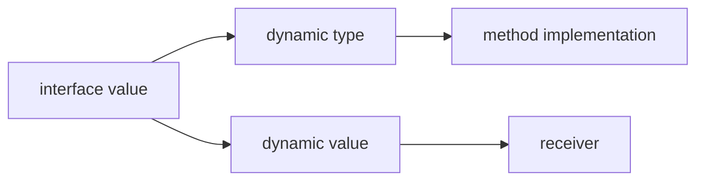

<TLDR>
  <TLDRCell label="what">
    A Go interface is a type that describes the behavior a caller needs with a method set; a type implicitly satisfies the interface when it has those methods.
  </TLDRCell>
  <TLDRCell label="trap">
    An interface value carries both a dynamic type and a dynamic value; after you store a nil pointer, the interface itself usually isn't `nil`.
  </TLDRCell>
  <TLDRCell label="fix">
    Define the smallest interface at the point of use, check method sets with compile-time assignments, and return a literal `nil` interface on success.
  </TLDRCell>
</TLDR>

## What it is and why it exists

A Go interface is a type that describes a set of types through interface elements.
The most common interfaces list only methods: any non-interface type with all the required methods
implements the interface.
The relationship needs no `implements` declaration, and the two types needn't be in the same package.

Implicit satisfaction puts the dependency on behavior instead of a particular struct.
A function that reads configuration can require only `Read([]byte) (int, error)`,
so callers can pass a file, network response, memory buffer, or test double.
The implementer doesn't import the consuming package, which also keeps package dependencies pointing one way.

Interfaces work best at boundaries where callers genuinely need to substitute implementations.
Standard-library types such as `io.Reader`, `fmt.Stringer`, and the built-in `error` are small interfaces;
they tell an algorithm only about the methods it needs to finish its work.
If a function accepts one concrete implementation and no caller needs a substitute, adding an interface early just adds a name and another jump.

The predeclared identifier `any` is an alias for `interface{}`.
It can hold any non-interface value, but it doesn't conjure methods for that value;
reading the dynamic value still requires a type assertion, type switch, or reflection.
If every input shares a behavior, use an interface that names that behavior instead of `any`.

## How it works

### A method list is also a type set

An interface containing only methods represents every non-interface type whose method set contains those methods.
For example, `interface { String() string }` contains every type with a matching `String` method.
The method name, parameter types, and result types must match; an almost identical signature doesn't count.

Go checks this relationship when you assign, pass, or return an interface value.
The common compile-time assertion `var _ Notifier = EmailSender{}` creates no useful runtime value;
it asks the compiler to prove immediately that the type on the right implements the interface.
If the interface or receiver methods later change, the error appears close to the assertion.

### Interface values have a dynamic type and value

The static type of an ordinary interface variable is fixed at compile time.
At runtime, its <Term id="interface-value">interface value</Term> can be understood as a pair:
the dynamic type stored in it and that type's dynamic value.
On an interface method call, the runtime selects the concrete method from the dynamic type and uses the dynamic value as its receiver.



The zero value of an interface has neither a dynamic type nor a dynamic value, so it equals `nil`.
If you put a pointer of type `*ParseError` whose value is `nil` into an `error`,
the interface now has the dynamic type `*ParseError` and no longer equals `nil`.
This is the <Term id="typed-nil">typed nil</Term> trap.

### Receivers determine method sets

A type's <Term id="method-set">method set</Term> determines which interfaces it can satisfy.
For a defined non-interface type `T`, the method set of `T` contains methods with receiver `T`;
the method set of `*T` contains methods with receiver `T` or `*T`.
When a method has only a pointer receiver, therefore, usually only `*T` satisfies an interface that requires it.

An addressable variable can sometimes call a pointer-receiver method with value syntax
because the compiler takes the address for `value.Method()` automatically.
That call convenience doesn't change the method set of `T`.
Interface assignments use method sets, not whether one call site can take an address automatically.

### Assertions inspect the dynamic type

The expression `value.(T)` asserts that an interface value's dynamic type satisfies `T`.
The single-result form panics on failure; the two-result form `result, ok := value.(T)`
returns the zero value of `T` and `false` instead.
Ordinary control flow should usually use the two-result form.

A type switch writes a series of assertions as `switch current := value.(type)`.
Within each case, `current` is used as that case's type.
This is appropriate for a finite set of heterogeneous values at a format boundary,
but it shouldn't replace dynamic dispatch that an interface method could provide.

### Composition keeps interfaces small

An interface can embed other interfaces.
`io.ReadWriter` embeds `io.Reader` and `io.Writer`,
so its type set is the intersection of types satisfying both.
Composition copies no implementation and creates no class hierarchy.

A consuming function should require the smallest interface it actually uses.
Only a function that calls both `Read` and `Write` needs `io.ReadWriter`;
a read-only function should keep accepting `io.Reader`, allowing more concrete types and test doubles.
This is a direct application of the <Term id="interface-segregation-principle">Interface Segregation Principle</Term> in Go.

## Examples

### Define behavior at the point of use

The order delivery function needs one capability, so its interface has one method.
`EmailSender` doesn't declare that it implements `Notifier`; the matching method is enough.
The compile-time assertion records that expectation next to the implementation.

<Depth level="quick">

```go
package main

import "fmt"

type Notifier interface {
	Notify(orderID string) string
}

type EmailSender struct {
	From string
}

func (sender EmailSender) Notify(orderID string) string {
	return fmt.Sprintf("%s sent receipt for %s", sender.From, orderID)
}

var _ Notifier = EmailSender{}

func DeliverReceipt(notifier Notifier, orderID string) {
	fmt.Println(notifier.Notify(orderID))
}

func main() {
	DeliverReceipt(EmailSender{From: "billing@example.test"}, "A-104")
}
```

```text
billing@example.test sent receipt for A-104
```

</Depth>

`DeliverReceipt` doesn't know how the message is sent; it knows only that it can call `Notify`.
A test can provide a double that records the order ID, while production code can substitute another sender.
If the caller later needs cancellation too, first decide whether that capability belongs to the same role,
then either extend this interface or add a separate parameter.

### Preserve state with a pointer receiver

`Next` changes the sequence, so it uses a pointer receiver.
The right side of the compile-time assertion must also be `(*Sequence)(nil)`;
changing it to `Sequence{}` produces a compile error for the missing `Next` method.

```go
package main

import "fmt"

type Counter interface {
	Next() int
}

type Sequence struct {
	current int
}

func (sequence *Sequence) Next() int {
	sequence.current++
	return sequence.current
}

var _ Counter = (*Sequence)(nil)

func TakeTwo(counter Counter) (int, int) {
	return counter.Next(), counter.Next()
}

func main() {
	sequence := Sequence{current: 40}
	first, second := TakeTwo(&sequence)
	fmt.Println(first, second)
	fmt.Println(sequence.current)
}
```

```text
41 42
42
```

`TakeTwo` receives an interface value, but its dynamic value points to the original `sequence`.
Both calls mutate the same object, so `sequence.current` is `42` after the function returns.
Passing the pointer here both satisfies the method set and says that the counter has identity and mutable state.

### Accept a standard-library interface

`CountNonemptyLines` needs no file name, path, or close operation.
It only reads bytes, so its parameter is an `io.Reader`.
The caller constructs a concrete `*strings.Reader` and retains control of the resource lifetime.

```go
package main

import (
	"bufio"
	"fmt"
	"io"
	"strings"
)

func CountNonemptyLines(reader io.Reader) (int, error) {
	scanner := bufio.NewScanner(reader)
	count := 0
	for scanner.Scan() {
		if scanner.Text() != "" {
			count++
		}
	}
	return count, scanner.Err()
}

func main() {
	input := strings.NewReader("paid\n\nshipped\ndelivered\n")
	count, err := CountNonemptyLines(input)
	fmt.Println(count, err)
}
```

```text
3 <nil>
```

The same function can read an `*os.File`, `bytes.Buffer`, or HTTP response body,
provided the caller handles errors and closing according to each value's contract.
The function doesn't return an `io.Reader` because it doesn't create one.
`Accept interfaces, return concrete types` is useful advice, not a syntax rule that overrides the actual API contract.

### Use a type switch at a heterogeneous boundary

Some boundaries genuinely accept values with different shapes, such as structured log fields or loosely decoded data.
This function handles an exact `string` first, then types that implement `fmt.Stringer`.
Case order is part of the behavior because a named string type may also implement `String`.

```go
package main

import "fmt"

type OrderID string

func (id OrderID) String() string {
	return string(id)
}

func Label(value any) string {
	switch current := value.(type) {
	case string:
		return "text:" + current
	case fmt.Stringer:
		return "stringer:" + current.String()
	default:
		return fmt.Sprintf("other:%T", current)
	}
}

func main() {
	fmt.Println(Label("ready"))
	fmt.Println(Label(OrderID("A-104")))
	fmt.Println(Label(42))
}
```

```text
text:ready
stringer:A-104
other:int
```

The type switch keeps this heterogeneous policy in one visible place.
If callers can all supply `String() string`, accepting `fmt.Stringer` directly is clearer
and rejects unsupported types at compile time.
`any` is accurate only when the boundary protocol really allows arbitrary values.

## Pitfalls

> [!PITFALL]
> A value being able to call a pointer-receiver method doesn't mean the value type implements an interface containing that method.

The compiler takes an address automatically only for method calls on addressable values; interface assignment doesn't do this.
**Fix:** decide whether the method mutates or shares receiver state,
then check the intended method set precisely with `var _ Interface = (*Type)(nil)` or `Type{}`.

> [!PITFALL]
> Returning a nil concrete error pointer produces an `error` interface that isn't `nil`.

The interface has recorded a dynamic type, so the caller enters its `if err != nil` branch;
formatting the error may also panic if `Error` dereferences the nil receiver.
**Fix:** return a literal `nil` on the success path and construct the concrete error only on a failure path.

> [!PITFALL]
> A single-result type assertion turns normal input variation into a panic.

Decoding, plugin, and message boundaries routinely receive unexpected dynamic types.
**Fix:** use `value, ok := input.(T)` or a type switch with a `default`,
then return a contextual error on failure; reserve the single-result form for mismatches that prove a program invariant is broken.

> [!PITFALL]
> Defining a large interface beside its implementation makes every consumer depend on methods it doesn't need.

Such interfaces are hard to fake, and adding one method breaks every implementation at once.
**Fix:** derive a small interface from methods used at the call site and keep it in the consuming package;
compose roles through embedding only when a consumer genuinely needs them together.

> [!PITFALL]
> Two interface values being comparable doesn't make every comparison safe.

If both interfaces have the same non-comparable dynamic type, such as `[]int`, evaluating `left == right` panics.
**Fix:** don't use interfaces carrying arbitrary dynamic values as stable map keys;
when a boundary needs equality, restrict it to concrete comparable keys or define an explicit comparison operation.

<Depth level="deep">

## Interface values, nil, and equality

The dynamic type of an interface value is always a non-interface type.
Assigning one interface value to another preserves its existing dynamic type and dynamic value;
it doesn't wrap the source interface type as a new dynamic type.
An interface method call therefore ends at a method implemented by a concrete non-interface type.

An interface value equals `nil` only when it has no dynamic type.
If its dynamic type is `*Worker` and its dynamic value is a nil pointer, the interface remains non-nil;
whether a method call panics depends on whether that concrete method can handle nil without dereferencing the receiver.
Don't read “non-nil interface” as “safe-to-dereference underlying pointer.”

When two interface values are compared, their dynamic values are compared only if their dynamic types are identical.
Different dynamic types produce unequal values, while two nil interfaces are equal.
If the shared dynamic type isn't comparable, the comparison panics.
An interface type being statically comparable therefore doesn't make every dynamic comparison safe.

Reflection APIs expose views of the dynamic type and value through `reflect.TypeOf` and `reflect.ValueOf`.
That can help diagnose boundary data, but ordinary dispatch should prefer interface methods,
while finite branching should prefer type assertions or type switches.
Reflection's extra complexity is justified only when an algorithm must inspect arbitrary type structure.

## Method sets, addressability, and embedding

The receiver spelling in a method declaration directly affects interface satisfaction.
A method with receiver `T` belongs to the method sets of both `T` and `*T`;
a method with receiver `*T` belongs only to the method set of `*T`.
This rule lets a pointer receiver signal that an operation depends on identity or must mutate the original value.

Method calls have a separate selector convenience.
If a variable `item` is addressable and the method set of `&item` contains `Update`,
the compiler may interpret `item.Update()` as `(&item).Update()`.
Map elements are generally not addressable, so the same syntax may not work there; interface assignments never borrow this rewrite.

An embedded field promotes methods and can change the outer type's method set.
Embedding `T` doesn't always promote the same methods to outer values and pointers as embedding `*T`.
When promotion decides whether the outer type satisfies an interface, write compile-time assertions
and check the outer value and pointer types separately.

Interface embedding is different.
It intersects several interface elements into a new interface, stores no field, and inherits no implementation.
If two methods have the same name but different signatures, the composed interface is invalid;
methods with identical signatures may overlap because they express the same requirement.

## Ordinary and constraint-only interfaces

Since Go 1.18, an interface may contain type terms, approximation terms, and unions as well as methods.
These elements define the interface's <Term id="type-set">type set</Term>,
which constrains the non-interface types allowed as type arguments.
An interface containing only methods also has a type set, but it can normally be used as an ordinary value type too.

An interface containing non-method type elements can be used only as a type constraint, not as an ordinary variable type.
For example, `interface { ~int | ~int64 }` can constrain a generic function's type parameter,
but it can't be the type of a variable holding runtime integers.
Don't pass a constraint interface into business code just to reuse a name; those are different abstraction layers.

`comparable` is also a predeclared constraint interface.
It represents the set of strictly comparable non-interface types and can't be used as an ordinary runtime value type.
A generic algorithm that needs `==` or map keys may choose it,
but an ordinary interface value can still hold a non-comparable dynamic value.

Interfaces and generics overlap, but they preserve information differently.
An ordinary interface packages a concrete static type as a runtime dynamic type;
a type parameter preserves one static type within an instantiation and can relate inputs to results.
Choose an ordinary interface for behavioral substitution, and consider generics when you must preserve type relationships.

</Depth>

<Checkpoint id="go/interfaces" />

## Further reading

- [Go specification: interface types](https://go.dev/ref/spec#Interface_types)
- [Effective Go: interfaces and other types](https://go.dev/doc/effective_go#interfaces_and_types)
- [Go FAQ: why is my nil error value not equal to nil?](https://go.dev/doc/faq#nil_error)
- [The Go Blog: The Laws of Reflection](https://go.dev/blog/laws-of-reflection)
