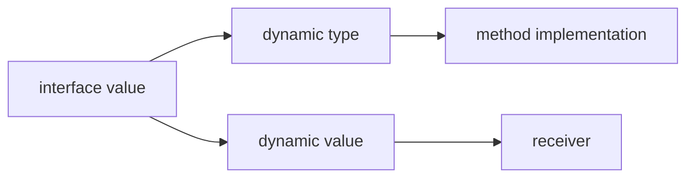

<TLDR>
  <TLDRCell label="what">
    Go 接口是一种类型，它用方法集合描述调用方需要的行为；类型只要拥有这些方法，就会隐式满足接口。
  </TLDRCell>
  <TLDRCell label="trap">
    接口值同时携带动态类型和动态值；装入 nil 指针后，接口本身通常不等于 `nil`。
  </TLDRCell>
  <TLDRCell label="fix">
    在使用方定义最小接口，用编译期赋值检查方法集，并在成功路径直接返回 `nil` 接口。
  </TLDRCell>
</TLDR>

## 是什么，为什么存在

Go 接口（interface）是一种通过接口元素描述类型集合的类型。
最常见的接口只列出方法：任何非接口类型只要拥有接口要求的全部方法，
就实现了这个接口。
实现关系不需要 `implements` 声明，也不要求两个类型位于同一个包。

这种隐式实现把依赖放在行为上，而不是放在某个具体结构体上。
读取配置的函数可以只要求 `Read([]byte) (int, error)`，
调用方于是可以传入文件、网络响应、内存缓冲区或测试替身。
实现者不必导入消费它的包，因此包依赖也能保持单向。

接口最适合放在真正需要替换实现的边界上。
标准库中的 `io.Reader`、`fmt.Stringer` 和内置的 `error` 都是小接口；
它们让算法只知道完成工作所需的方法。
如果函数只接受一种具体实现，而且没有调用方需要替换它，提前加接口只会增加名字和跳转。

预声明标识符 `any` 是 `interface{}` 的别名。
它可以保存任意非接口值，但不会凭空提供该值的方法；
读取动态值时仍需要类型断言、类型开关或反射。
如果各输入共享某个行为，应该用表达该行为的接口，而不是用 `any`。

## 工作原理

### 方法列表也是类型集合

只含方法的接口表示所有方法集包含这些方法的非接口类型。
例如，`interface { String() string }` 包含所有拥有匹配 `String` 方法的类型。
方法名、参数类型和结果类型都必须一致；签名“差不多”并不算实现。

Go 在赋值、传参或返回接口值时检查这层关系。
常见的编译期断言 `var _ Notifier = EmailSender{}` 不创建有用的运行时值，
它只是要求编译器立即证明右侧类型实现了接口。
如果接口或接收者方法后来发生变化，错误会出现在断言附近。

### 接口值有动态类型和动态值

一个普通接口变量的静态类型在编译期确定。
运行时，它的<Term id="interface-value">接口值（interface value）</Term>可以理解为一对信息：
装入其中的动态类型，以及该类型的动态值。
调用接口方法时，运行时依据动态类型选择具体方法，并把动态值作为接收者。



接口的零值同时没有动态类型和动态值，因此等于 `nil`。
如果把类型为 `*ParseError`、值为 `nil` 的指针装入 `error`，
接口已经有动态类型 `*ParseError`，所以不再等于 `nil`。
这就是<Term id="typed-nil">带类型的 nil（typed nil）</Term>陷阱。

### 接收者决定方法集

类型的<Term id="method-set">方法集（method set）</Term>决定它能满足哪些接口。
对已定义的非接口类型 `T`，`T` 的方法集包含接收者为 `T` 的方法；
`*T` 的方法集则同时包含接收者为 `T` 和 `*T` 的方法。
因此，只用指针接收者实现方法时，通常只有 `*T` 满足相应接口。

可寻址变量有时能用值语法调用指针接收者方法，
因为编译器会为 `value.Method()` 自动取地址。
这个调用便利不会改变 `T` 的方法集。
接口赋值看的是方法集，而不是某个调用点能否自动取地址。

### 断言读取动态类型

表达式 `value.(T)` 断言接口值的动态类型满足 `T`。
单结果形式失败时会 panic；双结果形式 `result, ok := value.(T)`
会在失败时返回 `T` 的零值和 `false`。
普通控制流里通常应使用双结果形式。

类型开关把一串断言写成一个 `switch current := value.(type)`。
每个分支中的 `current` 都按该分支的类型使用。
它适合处理格式边界中的有限异构值，
但不该替代本可由接口方法完成的动态分派。

### 组合保留小接口

接口可以嵌入其他接口。
`io.ReadWriter` 嵌入 `io.Reader` 和 `io.Writer`，
所以其类型集合是同时满足两者的类型交集。
组合不会复制实现，也不会建立类继承层次。

消费函数应要求它实际使用的最小接口。
只有同时调用 `Read` 和 `Write` 的函数才需要 `io.ReadWriter`；
只读函数继续接受 `io.Reader`，能让更多具体类型和测试替身参与调用。
这也是<Term id="interface-segregation-principle">接口隔离原则（Interface Segregation Principle）</Term>在 Go 中的直接用法。

## 示例

### 由使用方定义行为

订单发送函数只需要一项能力，所以接口只有一个方法。
`EmailSender` 没有声明自己实现 `Notifier`；匹配的方法已经足够。
编译期断言把这种预期留在实现旁边。

<Depth level="quick">

```go
package main

import "fmt"

type Notifier interface {
	Notify(orderID string) string
}

type EmailSender struct {
	From string
}

func (sender EmailSender) Notify(orderID string) string {
	return fmt.Sprintf("%s sent receipt for %s", sender.From, orderID)
}

var _ Notifier = EmailSender{}

func DeliverReceipt(notifier Notifier, orderID string) {
	fmt.Println(notifier.Notify(orderID))
}

func main() {
	DeliverReceipt(EmailSender{From: "billing@example.test"}, "A-104")
}
```

```text
billing@example.test sent receipt for A-104
```

</Depth>

`DeliverReceipt` 不知道消息如何发送，只知道它能调用 `Notify`。
测试可以提供记录订单号的替身，而生产代码可以换成另一个发送器。
如果调用方后来还需要取消操作，应先确认这项能力确实属于同一个角色，
再决定扩展接口还是增加另一个参数。

### 指针接收者保留状态

`Next` 会修改序列，因此使用指针接收者。
编译期断言右侧也必须写成 `(*Sequence)(nil)`；
改成 `Sequence{}` 会得到缺少 `Next` 的编译错误。

```go
package main

import "fmt"

type Counter interface {
	Next() int
}

type Sequence struct {
	current int
}

func (sequence *Sequence) Next() int {
	sequence.current++
	return sequence.current
}

var _ Counter = (*Sequence)(nil)

func TakeTwo(counter Counter) (int, int) {
	return counter.Next(), counter.Next()
}

func main() {
	sequence := Sequence{current: 40}
	first, second := TakeTwo(&sequence)
	fmt.Println(first, second)
	fmt.Println(sequence.current)
}
```

```text
41 42
42
```

`TakeTwo` 接收的是接口值，但其中的动态值指向原来的 `sequence`。
两次调用修改同一个对象，所以函数返回后 `sequence.current` 为 `42`。
这里传指针不仅为了满足方法集，也表达了计数器具有身份和可变状态。

### 接受标准库接口

`CountNonemptyLines` 不需要文件名、路径或关闭操作。
它只读取字节，因此参数使用 `io.Reader`。
调用方用具体的 `*strings.Reader` 构造输入，并保留资源生命周期的控制权。

```go
package main

import (
	"bufio"
	"fmt"
	"io"
	"strings"
)

func CountNonemptyLines(reader io.Reader) (int, error) {
	scanner := bufio.NewScanner(reader)
	count := 0
	for scanner.Scan() {
		if scanner.Text() != "" {
			count++
		}
	}
	return count, scanner.Err()
}

func main() {
	input := strings.NewReader("paid\n\nshipped\ndelivered\n")
	count, err := CountNonemptyLines(input)
	fmt.Println(count, err)
}
```

```text
3 <nil>
```

同一个函数也可以读取 `*os.File`、`bytes.Buffer` 或 HTTP 响应体，
前提是调用方按各自契约管理错误与关闭操作。
函数没有返回 `io.Reader`，因为它根本不创建读取器。
“接受接口，返回具体类型”是常见经验，不是必须压过真实 API 契约的语法规则。

### 在异构边界使用类型开关

有些边界确实接收不同形状的值，例如结构化日志字段或解码后的松散数据。
下面的函数先处理精确的 `string`，再处理实现 `fmt.Stringer` 的类型。
分支顺序属于行为的一部分，因为一个命名字符串类型也可能实现 `String`。

```go
package main

import "fmt"

type OrderID string

func (id OrderID) String() string {
	return string(id)
}

func Label(value any) string {
	switch current := value.(type) {
	case string:
		return "text:" + current
	case fmt.Stringer:
		return "stringer:" + current.String()
	default:
		return fmt.Sprintf("other:%T", current)
	}
}

func main() {
	fmt.Println(Label("ready"))
	fmt.Println(Label(OrderID("A-104")))
	fmt.Println(Label(42))
}
```

```text
text:ready
stringer:A-104
other:int
```

类型开关让这条异构策略集中且可见。
如果调用者本来都能提供 `String() string`，直接接收 `fmt.Stringer` 会更清楚，
也能把不支持的类型挡在编译期。
只有边界协议真的允许任意值时，`any` 才是准确的参数类型。

## 陷阱

> [!PITFALL]
> 值能调用指针接收者方法，不代表值类型实现了包含该方法的接口。

编译器只会在可寻址值的方法调用处自动取地址，接口赋值不会这样做。
**修复：**先决定方法是否需要修改或共享接收者状态，
然后用 `var _ Interface = (*Type)(nil)` 或 `Type{}` 精确检查预期的方法集。

> [!PITFALL]
> 返回 nil 的具体错误指针，会得到不等于 `nil` 的 `error` 接口。

接口此时已经记录动态类型，调用方的 `if err != nil` 会进入错误分支；
如果 `Error` 方法解引用 nil 接收者，格式化错误还可能 panic。
**修复：**成功路径直接 `return nil`，只在失败分支构造具体错误值。

> [!PITFALL]
> 单结果类型断言把正常的输入差异变成 panic。

解码、插件或消息边界通常会收到意外动态类型。
**修复：**使用 `value, ok := input.(T)` 或带 `default` 的类型开关，
并让失败路径返回带上下文的错误；只有不匹配能证明为程序不变量时才用单结果形式。

> [!PITFALL]
> 在实现方旁边预先定义大接口，会迫使每个使用方依赖并不需要的方法。

这种接口难以伪造，新增方法还会一次破坏所有实现。
**修复：**从调用点实际使用的方法推导小接口，并把它放在消费包中；
多个角色确实需要合并时，再通过嵌入组合它们。

> [!PITFALL]
> 两个接口值都可比较，不代表比较一定安全。

如果两个接口的动态类型相同但不可比较，例如 `[]int`，执行 `left == right` 会 panic。
**修复：**不要把携带任意动态值的接口当作稳定 map 键；
边界需要相等语义时，应限制到可比较的具体键或定义显式比较操作。

<Depth level="deep">

## 接口值、nil 与相等性

接口值的动态类型始终是非接口类型。
把一个接口值赋给另一个接口时，新的接口保留其中原有的动态类型和动态值，
而不是把源接口类型套成新的动态类型。
接口方法调用因此最终落到某个具体非接口类型的方法实现上。

接口值仅在没有动态类型时等于 `nil`。
若动态类型为 `*Worker` 而动态值是 nil 指针，接口仍非 nil；
调用方法是否 panic 则取决于具体方法能否在不解引用接收者的情况下处理 nil。
不要把“接口非 nil”误解为“底层指针可安全解引用”。

两个接口值比较时，只有动态类型相同才会继续比较动态值。
如果动态类型不同，结果为不相等；如果两边都是 nil 接口，结果为相等。
动态类型相同但该类型不可比较时，比较会 panic。
因此，接口类型在静态上可比较，并不能保证每次动态比较都安全。

反射 API 用 `reflect.TypeOf` 和 `reflect.ValueOf` 暴露动态类型与动态值的视图。
这能帮助诊断边界数据，但普通分派应优先使用接口方法，
有限分支应优先使用类型断言或类型开关。
只有算法真的需要检查任意类型结构时，反射的额外复杂度才有理由存在。

## 方法集、可寻址性与嵌入

方法声明的接收者写法直接影响接口满足关系。
接收者为 `T` 的方法属于 `T` 和 `*T` 的方法集；
接收者为 `*T` 的方法只属于 `*T` 的方法集。
这个规则使指针接收者可以明确表示操作依赖对象身份或需要修改原值。

方法调用另有选择器便利规则。
如果变量 `item` 可寻址，而且 `&item` 的方法集包含 `Update`，
编译器可以把 `item.Update()` 解释为 `(&item).Update()`。
map 元素通常不可寻址，所以相同写法未必适用；接口赋值也从不借用这条改写规则。

嵌入字段会提升方法，并可能改变外层类型的方法集。
嵌入 `T` 时，外层值和指针得到的提升方法并不总与嵌入 `*T` 相同。
当提升决定外层类型是否满足接口时，最稳妥的做法是写出编译期断言，
并分别检查外层值类型和指针类型。

接口嵌入则是另一回事。
它把多个接口元素交集到一个新接口中，不保存字段，也没有实现继承。
若两个同名方法的签名不一致，组合接口无效；
签名完全相同的方法可以重叠，因为它们表达同一要求。

## 普通接口与约束接口

从 Go 1.18 起，接口不只可以包含方法，还可以包含类型项、近似项和 union。
这些元素定义接口的<Term id="type-set">类型集（type set）</Term>，
用于约束允许作为类型实参的非接口类型。
只包含方法的接口也有类型集，只是通常还能作为普通值类型。

含有非方法类型项的接口只能用作类型约束，不能声明普通变量。
例如，`interface { ~int | ~int64 }` 可以约束泛型函数的类型参数，
却不能作为保存运行时整数的变量类型。
不要为了复用名字而把约束接口传进业务函数；那是两个不同的抽象层次。

`comparable` 也是预声明的约束接口。
它表示严格可比较的非接口类型集合，不能作为普通运行时值类型使用。
泛型算法需要用 `==` 或 map 键时可以选择它，
但普通接口值内部仍可能携带不可比较的动态值。

接口与泛型解决的问题有重叠，但信息保留方式不同。
普通接口把具体静态类型封装成运行时动态类型；
类型参数则在一次实例化中保留同一个静态类型，并能把输入与结果关联起来。
需要行为替换时选普通接口，需要保留类型关系时再考虑泛型。

</Depth>

<Checkpoint id="go/interfaces" />

## 延伸阅读

- [Go 语言规范：接口类型](https://go.dev/ref/spec#Interface_types)
- [Effective Go：接口与其他类型](https://go.dev/doc/effective_go#interfaces_and_types)
- [Go FAQ：为什么 nil 错误值不等于 nil](https://go.dev/doc/faq#nil_error)
- [Go 博客：反射定律](https://go.dev/blog/laws-of-reflection)
