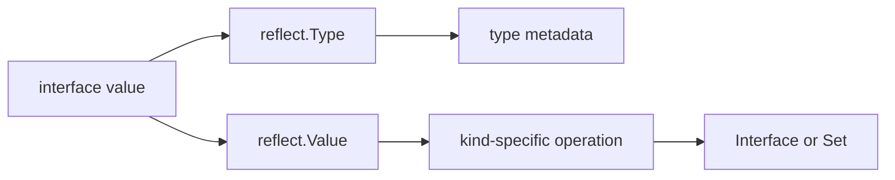

<TLDR>
  <TLDRCell label="what">
    <Term id="reflection">Reflection</Term> lets code inspect the concrete type, structure, and contents of any value at runtime, then modify values or call methods under strict conditions.
  </TLDRCell>
  <TLDRCell label="trap">
    Most `reflect.Value` methods accept only particular kinds and states; invalid values, nils, unsettable fields, and wrong arguments cause immediate panics.
  </TLDRCell>
  <TLDRCell label="fix">
    Check `IsValid`, `Kind`, `CanInterface`, `CanSet`, and exact type relationships before each operation; prefer interfaces or generics when types are known at compile time.
  </TLDRCell>
</TLDR>

## What it is and why it exists

Go reflection is a set of runtime APIs in the standard `reflect` package.
It represents the dynamic type and value inside an interface as `reflect.Type` and `reflect.Value`, so code can inspect structure without knowing a concrete type name.
Packages such as `encoding/json` use this capability to read fields and tags from arbitrary structs.

Static typing still supplies the main rules.
The compiler checks concrete types, interfaces, and generic code, while reflection postpones some checks until runtime.
That postponement adds runtime work, and a reflection method that doesn't apply to the current `Kind` usually panics instead of returning an error.

Reflection has a clear role when the data shape can only be known at runtime.
Common boundaries include serializers, struct validators, dependency injection containers, RPC dispatchers, and test tools.
When business logic already knows its types, ordinary field access, interfaces, or generics are usually clearer and preserve more compile-time checking.

Reflection isn't a back door around Go's visibility and type rules.
Normal reflection APIs can't extract an unexported field as `any` or modify it, and assignment still has to satisfy type relationships.
An operation that needs `unsafe` isn't ordinary use of `reflect`.

## How it works

### Interface values are the entry point

Both `reflect.TypeOf(input)` and `reflect.ValueOf(input)` accept `any`.
The call puts a concrete value into an <Term id="interface-value">interface value</Term>, which stores a dynamic type and a dynamic value.
`TypeOf` reads the type part, while `ValueOf` returns a handle for inspecting the dynamic value.

`Value.Interface()` performs the reverse conversion by packing an exportable, valid `Value` back into `any`.
Its result has the static type `any`, but retains the original dynamic type.
Calling `Interface` on a value obtained from an unexported field panics, so boundary code should check `CanInterface()` first.



### Type and Kind answer different questions

`reflect.Type` describes complete type identity, including the name, package path, element type, fields, and methods.
Two named types remain different `Type` values even if they share an <Term id="underlying-type">underlying type</Term>.
Use `AssignableTo`, `ConvertibleTo`, or `Implements` when checking assignment, conversion, or interface implementation.

`Kind` gives only the broad underlying representation, such as `Int64`, `Struct`, `Slice`, or `Pointer`.
A custom `UserID` can have the `Int64` kind without being identical to `int64`.
Use `Kind` to choose an applicable operation, not as a substitute for type checking.

`TypeOf(nil)` returns `nil` because an empty interface has no dynamic type.
When code needs a compile-time type without a value, Go has provided `reflect.TypeFor[T]()` since Go 1.22.
For example, `reflect.TypeFor[error]()` represents the interface type directly, without a nil-pointer expression.

### Value carries type and state

A `reflect.Value` records more than a type and value: it also has states such as validity, addressability, settability, and exportability.
`ValueOf(nil)` returns an invalid `Value`; its `IsValid()` is `false` and its `Kind()` is `Invalid`.
Except for the few methods whose contracts explicitly allow it, continuing to operate on an invalid value panics.

A value of kind `Pointer` or `Interface` can expose its contents through `Elem()`.
But `Elem()` on a nil pointer or nil interface returns an invalid `Value`, not a zero value that can be dereferenced again.
First confirm that the current value is valid, has an applicable kind, and handles nil according to the API contract.

`IsNil()` isn't a universal nil test either.
It applies only to `Chan`, `Func`, `Interface`, `Map`, `Pointer`, and `Slice`.
Calling it on a `Struct`, `Int`, or invalid value panics, so code must branch on `Kind` first.

### Modification requires a settable value

`ValueOf(record)` observes the copy placed in an interface and normally can't use `Set` to modify the caller's variable.
To modify a value owned by the caller, pass a non-nil pointer and use `Elem()` to reach the variable it points to.
That variable must also have an appropriate type, and a target field must be exported.

`CanAddr()` and `CanSet()` answer different questions.
Addressability means an address can be taken; settability is also restricted by origin and visibility.
Check `CanSet()` before writing and `CanInterface()` before extracting a value as an interface.

`Set` requires the source value to be assignable to the destination type.
Methods such as `SetInt` and `SetString` still require a compatible destination kind, and a numeric value may violate business range rules even when the method accepts it.
A boundary parser should validate format, range, and permission before entering the reflection layer.

### Struct metadata and methods

A struct `Type` exposes metadata through methods such as `NumField`, `Field`, `FieldByName`, and `VisibleFields`.
A `StructField` contains the field name, type, index path, export status, and <Term id="struct-tag">struct tag</Term>.
A tag is only a string; packages such as `json`, `xml`, or your own library define what it means.

`StructTag.Get` can't distinguish a missing key from a present key with an empty value.
Use the boolean returned by `Lookup` when that distinction changes behavior.
Embedded fields can also introduce promotion or naming conflicts, so general-purpose libraries should retain `StructField.Index` instead of assuming every field is at the top level.

A type's <Term id="method-set">method set</Term> determines which methods reflection can find.
`T` and `*T` have different method sets, so passing a value to `MethodByName` may miss a method available only on the pointer receiver.
`Call` also requires exact argument counts and types, and propagates a panic from the called function unchanged.

## Examples

The examples start with read-only inspection and add mutation, method calls, and nil handling in turn.
The first only reads types and values, the second modifies a field after validation, the third constrains a dynamic method signature, and the last separates several nil states that are easy to confuse.
Every shown output came from running the program with the local Go toolchain.

### Read types, kinds, and tags

`Account` combines a named integer type, tags, and an unexported field.
The loop reads field metadata from the `Type`, then reads contents from the corresponding `Value`.
`CanInterface` keeps the unexported field inside the reflection boundary.

<Depth level="quick">

```go
package main

import (
	"fmt"
	"reflect"
)

type UserID int64

type Account struct {
	ID     UserID `json:"id"`
	Email  string `json:"email,omitempty"`
	secret string
}

func main() {
	account := Account{ID: 7, Email: "ada@example.test", secret: "token"}
	typ := reflect.TypeOf(account)
	value := reflect.ValueOf(account)

	fmt.Println(typ.Name(), typ.Kind(), typ.NumField())
	for index := 0; index < typ.NumField(); index++ {
		fieldType := typ.Field(index)
		tag, present := fieldType.Tag.Lookup("json")
		fieldValue := value.Field(index)
		fmt.Printf("%s type=%v kind=%v exported=%t tag=%q present=%t",
			fieldType.Name, fieldType.Type, fieldType.Type.Kind(), fieldType.IsExported(), tag, present)
		if fieldValue.CanInterface() {
			fmt.Printf(" value=%v", fieldValue.Interface())
		}
		fmt.Println()
	}
}
```

```text
Account struct 3
ID type=main.UserID kind=int64 exported=true tag="id" present=true value=7
Email type=string kind=string exported=true tag="email,omitempty" present=true value=ada@example.test
secret type=string kind=string exported=false tag="" present=false
```

</Depth>

The complete type of `ID` is `main.UserID`, while its kind is `int64`.
That's why code can't decide assignability from `Kind` alone.
The unexported field still has metadata, but `CanInterface()` stops code from exposing its value as `any`.

### Modify a field after validation

`SetField` accepts a pointer because the caller needs to observe the change.
It checks the pointer, struct, field settability, and exact assignment relationship in order.
Failure paths return errors instead of treating a `reflect` panic as input validation.

```go
package main

import (
	"fmt"
	"reflect"
)

type Limits struct {
	Host   string
	Port   int
	secret string
}

func SetField(target any, name string, replacement any) error {
	root := reflect.ValueOf(target)
	if root.Kind() != reflect.Pointer || root.IsNil() {
		return fmt.Errorf("target must be a non-nil pointer")
	}
	value := root.Elem()
	if value.Kind() != reflect.Struct {
		return fmt.Errorf("target must point to a struct")
	}
	field := value.FieldByName(name)
	if !field.IsValid() || !field.CanSet() {
		return fmt.Errorf("field %q cannot be set", name)
	}
	next := reflect.ValueOf(replacement)
	if !next.IsValid() || !next.Type().AssignableTo(field.Type()) {
		return fmt.Errorf("%s expects %v, got %T", name, field.Type(), replacement)
	}
	field.Set(next)
	return nil
}

func main() {
	limits := Limits{Host: "api.internal", Port: 8080, secret: "token"}
	fmt.Println(SetField(&limits, "Port", 9090), limits)
	fmt.Println("type:", SetField(&limits, "Host", 42))
	fmt.Println("secret:", SetField(&limits, "secret", "changed"))
}
```

```text
<nil> {api.internal 9090 token}
type: Host expects string, got int
secret: field "secret" cannot be set
```

`Port` passes every check, so the original struct is updated.
An ordinary `int` isn't assignable to a `string`, and the unexported field isn't settable even though it is addressable.
Production code would usually build an allowlist from tags as well, rather than letting external input select Go field names directly.

### Constrain a dynamic method call

A dynamic dispatcher can't call a method as soon as it finds a matching name.
This adapter accepts only the signature `func(string) string` and compares exact types with `TypeFor[string]()`.
A broader RPC system also needs authentication, argument decoding, result handling, and a panic boundary.

```go
package main

import (
	"fmt"
	"reflect"
)

type Commands struct{}

func (Commands) Status(orderID string) string {
	return "ready: " + orderID
}

func CallStringMethod(receiver any, name, argument string) (string, error) {
	method := reflect.ValueOf(receiver).MethodByName(name)
	if !method.IsValid() {
		return "", fmt.Errorf("no supported method %q", name)
	}
	typ := method.Type()
	stringType := reflect.TypeFor[string]()
	if typ.NumIn() != 1 || typ.In(0) != stringType ||
		typ.NumOut() != 1 || typ.Out(0) != stringType {
		return "", fmt.Errorf("method %q must have type func(string) string", name)
	}
	output := method.Call([]reflect.Value{reflect.ValueOf(argument)})
	return output[0].String(), nil
}

func main() {
	status, err := CallStringMethod(Commands{}, "Status", "A-104")
	fmt.Println(status, err)
	_, err = CallStringMethod(Commands{}, "Delete", "A-104")
	fmt.Println("missing:", err)
}
```

```text
ready: A-104 <nil>
missing: no supported method "Delete"
```

The method value's `Type` already has a bound receiver, so `NumIn()` counts only the explicit `orderID` parameter.
A missing method produces an invalid `Value`, hence the early `IsValid()` check.
Even with a matching signature, the called method itself may panic; the dispatch boundary must decide separately whether to recover.

### Separate invalid values, typed nils, and empty slices

A nil interface, an interface holding a nil pointer, a nil slice, and a non-nil slice of length zero are four distinct states.
Reflection doesn't collapse them into one notion of "empty."
The output below shows what validity, `Kind`, interface comparison, and `IsNil` each answer.

```go
package main

import (
	"fmt"
	"reflect"
)

type Problem struct{}

func (*Problem) Error() string { return "problem" }

func main() {
	invalid := reflect.ValueOf(nil)
	fmt.Println("nil interface:", invalid.IsValid(), invalid.Kind())

	var problem *Problem
	var err error = problem
	typedNil := reflect.ValueOf(err)
	fmt.Println("typed nil:", err == nil, typedNil.Kind(), typedNil.IsNil())

	empty := reflect.ValueOf([]string{})
	nilSlice := reflect.ValueOf([]string(nil))
	fmt.Println("empty slice:", empty.IsNil(), empty.Len())
	fmt.Println("nil slice:", nilSlice.IsNil(), nilSlice.Len())
}
```

```text
nil interface: false invalid
typed nil: false ptr true
empty slice: false 0
nil slice: true 0
```

`err` is a <Term id="typed-nil">typed nil</Term>: its dynamic type is `*Problem` and its dynamic pointer is nil, so the interface itself isn't `nil`.
Both slices have length zero, but only one is nil.
Serialization or patch semantics that distinguish "missing" from "empty collection" must preserve that difference.

## Pitfalls

> [!PITFALL]
> Calling `Type()`, `Elem()`, or `Interface()` before checking validity.
> `ValueOf(nil)`, a failed `FieldByName`, and `Elem()` on a nil pointer can all produce an invalid `Value`.
>
> **Fix:** Check `IsValid()` immediately after every API that may return an invalid value; call `IsNil()` or `Elem()` only after confirming an applicable `Kind`.

> [!PITFALL]
> Treating `CanAddr()` as `CanSet()`, or assuming code in the same package can reflectively modify an unexported field.
> An addressable value may still be restricted by visibility, and a direct `Set` will panic.
>
> **Fix:** Check `CanSet()` before writing and `CanInterface()` before extracting `any`; expose mutable state through exported fields, constructors, or methods.

> [!PITFALL]
> Comparing only `Kind`, then using `Convert` unconditionally.
> Named types with the same `Int64` kind can carry different domain meanings, and numeric conversion can truncate; `ConvertibleTo` proves that Go permits a conversion, not that the data is valid.
>
> **Fix:** Require `AssignableTo` by default; when conversion is necessary, list accepted source types and validate ranges and business rules first.

> [!PITFALL]
> Looking for a pointer-only method on a value receiver.
> `MethodByName` returns an invalid `Value`, and calling it directly afterward panics.
>
> **Fix:** State whether callers must provide `T` or `*T`, check the result with `IsValid()`, then validate the complete function signature and result count.

> [!PITFALL]
> Passing a request parameter directly to `FieldByName` or `MethodByName`.
> This turns every reachable exported field or method into an unreviewed external operation, enabling mass assignment or unauthorized calls.
>
> **Fix:** Map external names to allowed field indexes or methods with a fixed table, and finish authentication, authorization, and input validation before entering reflection code.

> [!PITFALL]
> Repeating field discovery, tag parsing, and method lookup in a loop whose types are already stable.
> The code becomes harder to read and repeats the same metadata work.
>
> **Fix:** First check whether ordinary code, an interface, or generics express the need more directly; when reflection is necessary, cache an immutable plan keyed by `reflect.Type` and benchmark the real workload before optimizing.

## In the AI era

**What generated code gets wrong here**

Models often begin with `reflect.ValueOf(input).Elem()`, dropping the paths where input is nil, isn't a pointer, or holds a nil pointer.
They also mistake equal kinds for assignable types, treat `ConvertibleTo` as business validation, or modify an unexported field once `CanAddr()` is true.
The more dangerous form in dynamic APIs feeds user-provided names directly into `FieldByName` or `MethodByName`, accidentally expanding the set of mutable state and callable methods.

Older training material also leads models to emit `reflect.PtrTo`, which is deprecated in Go 1.27 in favor of `reflect.PointerTo`.
Another common error calls `IsNil()` on every `Value`, so an integer, struct, or invalid input triggers a second panic on an error path.
These bugs often compile and surface only with unusual input or at an authorization boundary.

**Ask your AI to check**

- List the `IsValid`, `Kind`, `CanInterface`, and `CanSet` preconditions for every `reflect.Value` on each branch, and identify every call that may panic.
- For every `Set`, `Convert`, and `Call`, write down the exact source and destination `reflect.Type`, then check numeric ranges, argument counts, and result counts.
- Trace every field or method name originating in a request, configuration, or model output, and confirm that a fixed allowlist and authorization check come first.

**Review checklist**

- Exercise failure paths with a nil interface, typed nil, wrong kind, unexported field, missing field, and mismatched method arguments.
- Confirm external input can't select arbitrary exported fields or methods, and that logs and errors don't disclose sensitive reflected values.
- Check generated symbol names and deprecation status against the Go 1.27 docs, then benchmark representative repeated metadata discovery.

**Prompt vocabulary**

Use `reflection`, `reflect.Type`, `reflect.Value`, `Kind`, `addressable`, `settable`, `invalid Value`, `typed nil`, `method set`, and `assignable versus convertible`.
Also ask to "enumerate every panic precondition" and require that "external names map through an allowlist"; "use reflection safely" is too vague to constrain the result.

<Depth level="deep">

## Type relationships are stricter than Kind

`AssignableTo` represents assignment without an explicit conversion and is usually the safest default for reflective writes.
`ConvertibleTo` represents the broader set of explicit conversions allowed by the language.
Integer types, for example, can be convertible even when the destination width changes the value, so a general configuration parser can't treat "convertible" as "acceptable."

`Implements` reports whether a type implements an interface.
Direction matters: call `concrete.Implements(interfaceType)`, and the right side must be an interface type.
When no runtime value exists, `reflect.TypeFor[MyInterface]()` is more direct than `reflect.TypeOf((*MyInterface)(nil)).Elem()`.

Type identity also affects map keys, method selection, and zero-value creation.
`reflect.Zero(typ)` creates the zero value of that exact type instead of selecting a predeclared type by kind.
`reflect.New(typ)` returns a pointer `Value` to a new zero value; `Elem()` reaches the variable inside it.

## Metadata caches and dynamic calls

`reflect.Type` values are comparable, so they are often used as metadata-cache keys.
A struct processor can save field indexes, parsed tags, and decoder functions once per type, leaving only value operations for each input.
Cache immutable plans, not a mutable `reflect.Value` from one request.

The shared cache still needs safe publication or synchronization.
Whether a `Value` can be used by several goroutines at once depends on whether the underlying Go value supports the equivalent concurrent operations.
Reflection doesn't add locks to an ordinary map, struct field, or slice element.

`Value.Call` is the final operation, not a validator.
Before it, prove that the method name belongs to an allowlist, argument counts match, every argument is assignable to its parameter, and the caller may perform the operation.
A panic inside the called function crosses `Call`; only a boundary that owns request or task failure policy should consider `recover`.

## The Go 1.27 API boundary

The Go 1.27 `reflect` docs include `TypeFor[T]` and `TypeAssert[T]`.
`TypeAssert[T](value)` is semantically equivalent to the two-result form of `value.Interface().(T)`, returning a target-typed value and a success flag.
It doesn't remove the rules around validity, exportability, or interface assertions themselves.

The current docs deprecate `PtrTo` and direct new code to `PointerTo`.
Other deprecated low-level representation APIs don't belong in ordinary application code either.
Review generated reflection code against the target Go version instead of retaining a symbol merely because it appears in older examples.

</Depth>

<Checkpoint id="go/reflect" />

## Further reading

- [Go `reflect` package documentation](https://pkg.go.dev/reflect)
- [Go Blog: The Laws of Reflection](https://go.dev/blog/laws-of-reflection)
- [Go specification: properties of types and values](https://go.dev/ref/spec#Properties_of_types_and_values)
- [Go specification: method sets](https://go.dev/ref/spec#Method_sets)
