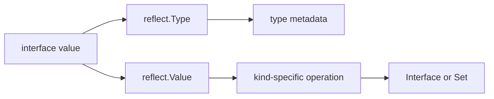

<TLDR>
  <TLDRCell label="what">
    <Term id="reflection">反射（reflection）</Term>让代码在运行时读取任意值的具体类型、结构和内容，并在满足严格条件时修改值或调用方法。
  </TLDRCell>
  <TLDRCell label="trap">
    `reflect.Value` 的大部分方法只接受特定 `Kind` 和状态；无效值、nil、不可设置字段或错误参数都会让调用直接 panic。
  </TLDRCell>
  <TLDRCell label="fix">
    先检查 `IsValid`、`Kind`、`CanInterface`、`CanSet` 和精确类型关系，再执行对应操作；类型在编译期已知时优先用接口或泛型。
  </TLDRCell>
</TLDR>

## 是什么，为什么存在

Go 反射是标准库 `reflect` 提供的一组运行时 API。
它把接口中的动态类型和值表示为 `reflect.Type` 与 `reflect.Value`，让代码在不知道具体类型名称时仍能检查结构。
`encoding/json` 一类的包正是靠这项能力读取任意结构体的字段和标签。

静态类型仍然是规则的主体。
编译器能检查具体类型、接口和泛型代码，而反射把一部分检查推迟到运行时。
检查推迟到运行时会增加运行期开销；不适用于当前 `Kind` 的反射方法通常会 panic，而不是返回错误。

当数据形状只能在运行时得知时，反射才有明确用途。
常见边界包括序列化器、结构体校验器、依赖注入容器、RPC 调度器和测试工具。
业务逻辑已经知道类型时，普通字段访问、接口或泛型通常更清楚，也保留更多编译期检查。

反射不是绕过 Go 可见性和类型规则的后门。
未导出字段不能通过常规反射接口取出为 `any` 或修改，赋值也必须满足类型关系。
需要 `unsafe` 才能完成的操作不属于 `reflect` 的正常用法。

## 工作原理

### 接口值是入口

`reflect.TypeOf(input)` 和 `reflect.ValueOf(input)` 都接收 `any`。
传参时，具体值被装入一个<Term id="interface-value">接口值（interface value）</Term>，其中保存动态类型和动态值。
`TypeOf` 读取类型部分，`ValueOf` 则返回一个可检查该动态值的句柄。

`Value.Interface()` 完成反方向的转换，把可导出的有效 `Value` 重新装成 `any`。
它返回的静态类型是 `any`，动态类型仍是原类型。
对来自未导出字段的值调用 `Interface` 会 panic，所以边界代码应先看 `CanInterface()`。



### Type 与 Kind 回答不同问题

`reflect.Type` 描述完整类型身份，包括名称、包路径、元素类型、字段和方法。
两个命名类型即使共享同一个<Term id="underlying-type">底层类型（underlying type）</Term>，它们的 `Type` 仍然不同。
需要判断赋值、转换或接口实现关系时，应使用 `AssignableTo`、`ConvertibleTo` 或 `Implements`。

`Kind` 只给出底层表示的大类，例如 `Int64`、`Struct`、`Slice` 或 `Pointer`。
自定义的 `UserID` 可以有 `Int64` 这个 `Kind`，但它并不因此等于 `int64`。
`Kind` 适合选择可调用的方法，不适合代替类型检查。

`TypeOf(nil)` 返回 `nil`，因为空接口中没有动态类型。
如果代码需要在没有值时取得编译期类型，Go 1.22 起提供 `reflect.TypeFor[T]()`。
例如，`reflect.TypeFor[error]()` 能直接表示接口类型，不需要构造带 nil 指针的表达式。

### Value 同时带有类型与状态

`reflect.Value` 不只有类型和值，还记录有效性、可寻址性、可设置性和可导出性等状态。
`ValueOf(nil)` 返回无效 `Value`；它的 `IsValid()` 为 `false`，`Kind()` 为 `Invalid`。
除了少数明确允许的方法外，对无效值继续操作会 panic。

种类为 `Pointer` 或 `Interface` 的值可以用 `Elem()` 取得其内容。
但 nil 指针或 nil 接口的 `Elem()` 会得到无效 `Value`，并非一个可继续解引用的零值。
调用前要先确认当前值有效、种类合适，并按 API 契约处理 nil。

`IsNil()` 也不是通用 nil 检查。
它只适用于 `Chan`、`Func`、`Interface`、`Map`、`Pointer` 和 `Slice`。
把它用于 `Struct`、`Int` 或无效值会 panic，因此必须先根据 `Kind` 分支。

### 修改需要可设置值

`ValueOf(record)` 观察的是装入接口的副本，通常不能用 `Set` 修改原变量。
要修改调用方持有的值，应传入非 nil 指针，再通过 `Elem()` 取得所指向的变量。
该变量还必须有合适的类型，并且目标字段必须导出。

`CanAddr()` 与 `CanSet()` 不是同一个问题。
可寻址只表示可以取得地址；可设置还受来源和可见性限制。
真正写入前应检查 `CanSet()`，读取为接口前则检查 `CanInterface()`。

`Set` 要求来源值可赋给目标类型。
`SetInt`、`SetString` 等方法仍要求目标具有兼容 `Kind`，也可能因为溢出策略不符合业务规则而产生错误数据。
边界解析应在进入反射层前完成格式、范围和权限校验。

### 结构体元数据与方法

结构体的 `Type` 提供 `NumField`、`Field`、`FieldByName` 和 `VisibleFields` 等元数据入口。
`StructField` 包含字段名、类型、索引路径、导出状态和<Term id="struct-tag">结构体标签（struct tag）</Term>。
标签只是字符串；`json`、`xml` 或自定义包各自定义其语义。

`StructTag.Get` 无法区分“键不存在”和“键存在但值为空”。
当这一区别会改变行为时，应使用 `Lookup` 返回的布尔值。
嵌入字段还可能产生提升或名称冲突，通用库应保存 `StructField.Index`，而不是假设字段都在顶层。

类型的<Term id="method-set">方法集（method set）</Term>决定反射能找到哪些方法。
`T` 与 `*T` 的方法集不同，因此把值传给 `MethodByName` 可能找不到只属于指针接收者的方法。
`Call` 还要求参数数量和类型准确匹配，并把被调用函数的 panic 原样传播出来。

## 示例

下面四个程序依次加入只读检查、修改、方法调用与 nil 处理。
第一个只读类型和值，第二个在验证后修改字段，第三个约束动态方法签名，最后一个区分几种容易混淆的 nil 状态。
每段输出都由本地 Go 工具链实际运行得到。

### 读取类型、Kind 与标签

`Account` 同时包含命名整数类型、标签和未导出字段。
循环从 `Type` 读取字段元数据，再从对应的 `Value` 读取内容。
`CanInterface` 让未导出字段留在反射边界内。

<Depth level="quick">

```go
package main

import (
	"fmt"
	"reflect"
)

type UserID int64

type Account struct {
	ID     UserID `json:"id"`
	Email  string `json:"email,omitempty"`
	secret string
}

func main() {
	account := Account{ID: 7, Email: "ada@example.test", secret: "token"}
	typ := reflect.TypeOf(account)
	value := reflect.ValueOf(account)

	fmt.Println(typ.Name(), typ.Kind(), typ.NumField())
	for index := 0; index < typ.NumField(); index++ {
		fieldType := typ.Field(index)
		tag, present := fieldType.Tag.Lookup("json")
		fieldValue := value.Field(index)
		fmt.Printf("%s type=%v kind=%v exported=%t tag=%q present=%t",
			fieldType.Name, fieldType.Type, fieldType.Type.Kind(), fieldType.IsExported(), tag, present)
		if fieldValue.CanInterface() {
			fmt.Printf(" value=%v", fieldValue.Interface())
		}
		fmt.Println()
	}
}
```

```text
Account struct 3
ID type=main.UserID kind=int64 exported=true tag="id" present=true value=7
Email type=string kind=string exported=true tag="email,omitempty" present=true value=ada@example.test
secret type=string kind=string exported=false tag="" present=false
```

</Depth>

`ID` 的完整类型是 `main.UserID`，而 `Kind` 是 `int64`。
这正是不能只按 `Kind` 判断可赋值性的原因。
未导出字段仍有元数据，但 `CanInterface()` 阻止代码把其值暴露为 `any`。

### 验证后修改字段

`SetField` 接受指针，是因为调用方需要看到修改结果。
它依次验证指针、结构体、字段可设置性和精确赋值关系。
失败路径返回错误，不把 `reflect` 的 panic 当作输入校验机制。

```go
package main

import (
	"fmt"
	"reflect"
)

type Limits struct {
	Host   string
	Port   int
	secret string
}

func SetField(target any, name string, replacement any) error {
	root := reflect.ValueOf(target)
	if root.Kind() != reflect.Pointer || root.IsNil() {
		return fmt.Errorf("target must be a non-nil pointer")
	}
	value := root.Elem()
	if value.Kind() != reflect.Struct {
		return fmt.Errorf("target must point to a struct")
	}
	field := value.FieldByName(name)
	if !field.IsValid() || !field.CanSet() {
		return fmt.Errorf("field %q cannot be set", name)
	}
	next := reflect.ValueOf(replacement)
	if !next.IsValid() || !next.Type().AssignableTo(field.Type()) {
		return fmt.Errorf("%s expects %v, got %T", name, field.Type(), replacement)
	}
	field.Set(next)
	return nil
}

func main() {
	limits := Limits{Host: "api.internal", Port: 8080, secret: "token"}
	fmt.Println(SetField(&limits, "Port", 9090), limits)
	fmt.Println("type:", SetField(&limits, "Host", 42))
	fmt.Println("secret:", SetField(&limits, "secret", "changed"))
}
```

```text
<nil> {api.internal 9090 token}
type: Host expects string, got int
secret: field "secret" cannot be set
```

`Port` 通过全部检查，所以写入原结构体。
普通 `int` 不能赋给 `string`，而未导出字段即使可寻址也不能设置。
生产代码通常还会用标签建立允许修改的字段清单，避免让外部输入直接选择 Go 字段名。

### 约束动态方法调用

动态调度器不能在找到同名方法后立刻调用。
这里的适配器只接受 `func(string) string` 这一种签名，并使用 `TypeFor[string]()` 做精确比较。
一个更宽的 RPC 系统还需要认证、参数解码、返回值处理和 panic 边界。

```go
package main

import (
	"fmt"
	"reflect"
)

type Commands struct{}

func (Commands) Status(orderID string) string {
	return "ready: " + orderID
}

func CallStringMethod(receiver any, name, argument string) (string, error) {
	method := reflect.ValueOf(receiver).MethodByName(name)
	if !method.IsValid() {
		return "", fmt.Errorf("no supported method %q", name)
	}
	typ := method.Type()
	stringType := reflect.TypeFor[string]()
	if typ.NumIn() != 1 || typ.In(0) != stringType ||
		typ.NumOut() != 1 || typ.Out(0) != stringType {
		return "", fmt.Errorf("method %q must have type func(string) string", name)
	}
	output := method.Call([]reflect.Value{reflect.ValueOf(argument)})
	return output[0].String(), nil
}

func main() {
	status, err := CallStringMethod(Commands{}, "Status", "A-104")
	fmt.Println(status, err)
	_, err = CallStringMethod(Commands{}, "Delete", "A-104")
	fmt.Println("missing:", err)
}
```

```text
ready: A-104 <nil>
missing: no supported method "Delete"
```

方法值的 `Type` 已经绑定接收者，所以 `NumIn()` 只计算显式的 `orderID` 参数。
不存在的方法返回无效 `Value`，因此先检查 `IsValid()`。
即便签名匹配，被调方法本身仍可能 panic；调度边界必须单独决定是否恢复。

### 区分 invalid、typed nil 与空切片

空接口、装有 nil 指针的接口、nil 切片和长度为零的非 nil 切片是四种不同状态。
反射不会把它们折叠成一个“空”概念。
下面的输出显示有效性、`Kind`、接口比较与 `IsNil` 各自回答什么。

```go
package main

import (
	"fmt"
	"reflect"
)

type Problem struct{}

func (*Problem) Error() string { return "problem" }

func main() {
	invalid := reflect.ValueOf(nil)
	fmt.Println("nil interface:", invalid.IsValid(), invalid.Kind())

	var problem *Problem
	var err error = problem
	typedNil := reflect.ValueOf(err)
	fmt.Println("typed nil:", err == nil, typedNil.Kind(), typedNil.IsNil())

	empty := reflect.ValueOf([]string{})
	nilSlice := reflect.ValueOf([]string(nil))
	fmt.Println("empty slice:", empty.IsNil(), empty.Len())
	fmt.Println("nil slice:", nilSlice.IsNil(), nilSlice.Len())
}
```

```text
nil interface: false invalid
typed nil: false ptr true
empty slice: false 0
nil slice: true 0
```

`err` 是<Term id="typed-nil">带类型的 nil（typed nil）</Term>：动态类型为 `*Problem`，动态指针为 nil，所以接口本身不等于 `nil`。
两个切片长度都为零，但只有一个切片为 nil。
序列化或补丁语义若区分“缺失”与“空集合”，这项差异必须保留下来。

## 陷阱

> [!PITFALL]
> 在检查有效性前调用 `Type()`、`Elem()` 或 `Interface()`。
> `ValueOf(nil)`、失败的 `FieldByName`，以及 nil 指针的 `Elem()` 都可能产生无效 `Value`。
>
> **修复：** 每次使用可能返回无效值的 API 后立即检查 `IsValid()`；只有已确认合适的 `Kind` 后才调用 `IsNil()` 或 `Elem()`。

> [!PITFALL]
> 把 `CanAddr()` 当成 `CanSet()`，或认为同包代码能反射修改未导出字段。
> 可寻址值仍可能受可见性限制，直接 `Set` 会 panic。
>
> **修复：** 写入前检查 `CanSet()`，取出为 `any` 前检查 `CanInterface()`；需要修改的状态通过导出字段、构造函数或方法公开。

> [!PITFALL]
> 只比较 `Kind`，随后无条件使用 `Convert`。
> 同为 `Int64` 的命名类型可以有不同领域含义，数值转换还可能截断；`ConvertibleTo` 证明语言允许转换，不证明数据有效。
>
> **修复：** 默认要求 `AssignableTo`；确需转换时列出允许的源类型，并在转换前做范围和业务校验。

> [!PITFALL]
> 用值接收者查找只存在于指针方法集中的方法。
> `MethodByName` 会返回无效 `Value`，随后直接 `Call` 就会 panic。
>
> **修复：** 明确要求调用方传 `T` 还是 `*T`，对返回值检查 `IsValid()`，再验证完整函数签名和返回值数量。

> [!PITFALL]
> 让请求参数直接成为 `FieldByName` 或 `MethodByName` 的名称。
> 这会把所有可达的导出字段或方法变成未审查的外部操作面，形成批量赋值或越权调用。
>
> **修复：** 用固定映射把外部名称转换为允许的字段索引或方法，并在进入反射层前完成认证、授权和输入校验。

> [!PITFALL]
> 在类型已经确定的循环中反复发现字段、解析标签和查找方法。
> 代码更难读，也重复执行相同的元数据工作。
>
> **修复：** 先确认接口、泛型或普通代码不能更直接地表达需求；必须反射时，以 `reflect.Type` 为键缓存不可变的解析计划，并用实际基准判断是否值得优化。

<Depth level="deep">

## 类型关系比 Kind 更严格

`AssignableTo` 对应无需显式转换的赋值关系，通常是反射写入最稳妥的默认条件。
`ConvertibleTo` 对应语言允许的显式转换，范围更宽。
例如，整数类型之间可以转换，但目标宽度较小时可能改变数值，因此通用配置解析器不能把“可转换”当成“可接受”。

`Implements` 判断一个类型是否实现接口。
调用方向也很重要：应写 `concrete.Implements(interfaceType)`，而且右侧必须是接口类型。
没有运行时值时，`reflect.TypeFor[MyInterface]()` 比 `reflect.TypeOf((*MyInterface)(nil)).Elem()` 更直接。

类型身份还影响映射键、方法选择和零值创建。
`reflect.Zero(typ)` 创建该精确类型的零值，而不是只按 `Kind` 选择某个预声明类型。
`reflect.New(typ)` 返回指向新零值的指针 `Value`，需要 `Elem()` 才能访问其中的变量。

## 元数据缓存与动态调用

`reflect.Type` 值可比较，所以常被用作元数据缓存的键。
结构体处理器可以为每个类型预先保存字段索引、标签解析结果和解码函数，然后让每个输入只执行值操作。
缓存应保存不可变计划，而不是保存某个请求的可变 `reflect.Value`。

共享缓存本身仍需要安全发布或同步。
一个 `Value` 能否被多个 goroutine 同时使用，取决于底层 Go 值能否承受等价的并发操作。
反射不会给普通 map、结构体字段或切片元素自动加锁。

`Value.Call` 是最后一步，而不是验证器。
调用前要确定方法名来自允许集合，参数数量正确，每个参数都可赋给对应类型，并且调用者有权执行该操作。
被调用函数的 panic 会穿过 `Call`；只有明确拥有请求或任务失败策略的边界才适合 `recover`。

## Go 1.27 的 API 边界

Go 1.27 的 `reflect` 文档包含 `TypeFor[T]` 和 `TypeAssert[T]`。
`TypeAssert[T](value)` 在语义上等价于 `value.Interface().(T)` 的双结果形式，返回目标类型的值与成功标志。
它没有取消有效性、可导出性或接口断言本身的规则。

当前文档把 `PtrTo` 标为弃用，并要求新代码使用 `PointerTo`。
同样被弃用的低层表示 API 不应出现在普通业务代码中。
审查模型生成的反射代码时，应按目标 Go 版本检查符号，而不是因为代码能从旧语料中找到就保留它。

</Depth>

<Checkpoint id="go/reflect" />

## 延伸阅读

- [Go `reflect` 包文档](https://pkg.go.dev/reflect)
- [Go Blog：The Laws of Reflection](https://go.dev/blog/laws-of-reflection)
- [Go 语言规范：类型和值的属性](https://go.dev/ref/spec#Properties_of_types_and_values)
- [Go 语言规范：方法集](https://go.dev/ref/spec#Method_sets)
