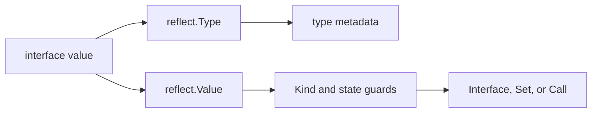

<TLDR>
  <TLDRCell label="what">
    <Term id="reflection">Reflection</Term> lets code inspect the concrete type, structure, and contents of any value at runtime, and modify values or invoke methods under strict conditions.
  </TLDRCell>
  <TLDRCell label="trap">
    Most `reflect.Value` operations accept only particular `Kind` values and states; invalid values, nil, unsettable fields, or wrong call arguments cause panics.
  </TLDRCell>
  <TLDRCell label="fix">
    Check `IsValid`, `Kind`, `CanInterface`, `CanSet`, and exact type relationships before acting; prefer interfaces or generics when types are known at compile time.
  </TLDRCell>
</TLDR>

## What it is and why it exists

Go's `reflect` package provides runtime reflection. It represents the dynamic type and value inside an interface as `reflect.Type` and `reflect.Value`, allowing a library to inspect data structures whose concrete type names were unknown at compile time. Encoders, validators, and RPC dispatchers may all need this ability.

Reflection doesn't remove static typing. It moves some checks from compile time to runtime, so mistakes often appear as panics instead of compiler errors. That tradeoff is justified only when the data shape truly can't be known until runtime.

When the type set is known, ordinary field access, a narrow interface, or generics is usually a better fit. Those choices let the compiler verify more of the contract and make control flow easier to follow. Reflection belongs at a concentrated framework boundary, not scattered through business logic.

Reflection isn't a back door around visibility or type rules either. Unexported fields can't be extracted as `any` or modified through the normal reflection API, and assignment must still satisfy Go's type relationships. A design that requires `unsafe` has moved beyond the normal boundary of `reflect`.

## How it works

### Interface values are the entry point

Both `reflect.TypeOf(input)` and `reflect.ValueOf(input)` accept `any`. A call first packages the concrete value into an <Term id="interface-value">interface value</Term> containing its dynamic type and dynamic value. `TypeOf` reads the type part, while `ValueOf` returns a handle for operating on the dynamic value.

`Value.Interface()` makes the reverse conversion by packaging an exported, valid `Value` as `any`. The result's static type is `any`, while its dynamic type remains the original type. A value obtained from an unexported field can't safely perform this operation, so check `CanInterface()` first.



This is the basis of the so-called three laws of reflection: an interface value can become reflection objects, a reflection object can become an interface value, and modification requires a settable target. Those statements are a direction map, not a complete safety check. Validity, visibility, exact types, and business authorization still need separate validation.

### Type and Kind answer different questions

`reflect.Type` describes full type identity, including its name, package path, element type, fields, and methods. Two named types remain different `Type` values even if they share an <Term id="underlying-type">underlying type</Term>. Use `AssignableTo`, `ConvertibleTo`, or `Implements` to reason about assignment, conversion, or interface implementation.

`Kind` represents only the underlying storage category, such as `Int64`, `Struct`, `Slice`, or `Pointer`. A custom `UserID` can have `Int64` as its `Kind` without being the same type as `int64`. Use `Kind` to select an applicable `Value` method, not as a substitute for a type check.

`TypeOf(nil)` returns `nil` because an empty interface has no dynamic type. To represent an interface type without a runtime value, you can use a type token such as `reflect.TypeOf((*error)(nil)).Elem()`. The nil pointer carries `*error` type information here and is never dereferenced as application data.

### Value also carries operational state

A `reflect.Value` carries more than a type and value: it records validity, addressability, settability, and exportability. `ValueOf(nil)` returns an invalid `Value`; its `IsValid()` is `false` and its `Kind()` is `Invalid`. Except for the few methods documented to allow it, operating further on that value panics.

A value with `Pointer` or `Interface` kind can expose its contents through `Elem()`. But calling `Elem()` on a nil pointer or nil interface produces an invalid `Value`, not a zero value that can be dereferenced again. Check the result after every dereference.

`IsNil()` isn't a universal nil check. It applies only to `Chan`, `Func`, `Interface`, `Map`, `Pointer`, and `Slice`. Calling it on an integer, struct, or invalid value panics, so branch on `Kind` first.

### Modification requires settability

`ValueOf(record)` observes the copy placed in an interface; `Set` can't use it to modify the original variable. To make a change visible to the caller, pass a non-nil pointer and use `Elem()` to reach the variable it points to. A destination field must also be exported and writable.

`CanAddr()` and `CanSet()` answer different questions. Addressability only means an address can be taken; settability is also constrained by origin and visibility rules. Check `CanSet()` before writing and `CanInterface()` before extracting a value into an interface.

`Set` requires the source value to be assignable to the destination type. Specialized methods such as `SetInt` and `SetString` still require a compatible destination `Kind`, and language-permitted numeric operations may violate a business range. Validate format, range, and authorization before the reflective write.

### Struct metadata and method sets

A struct `Type` exposes metadata through `NumField`, `Field`, `FieldByName`, and `VisibleFields`. A `StructField` contains the field name, type, index path, export status, and <Term id="struct-tag">struct tag</Term>. A tag is only a string; packages such as `json`, `xml`, or your own library define its meaning.

`StructTag.Get` can't distinguish an absent key from a present key with an empty value. Use the boolean returned by `Lookup` when that distinction changes behavior. Embedded fields can also introduce promotion and name conflicts, so a general library should preserve `StructField.Index` instead of assuming every field is at the top level.

A type's <Term id="method-set">method set</Term> determines which methods reflection can find. `T` and `*T` have different method sets, so a value may not expose a method that belongs only to a pointer receiver. `Call` also requires the argument count and types to match exactly, and it propagates a panic from the called function.

## Examples

The four programs below add read-only inspection, field modification, dynamic invocation, and nil classification in sequence. They keep reflection inside a small boundary and put every failure check before a dangerous operation. Every output shown was produced with the local Go toolchain.

### Reading Type, Kind, and tags

`Account` contains a named integer type, tags, and an unexported field. The loop reads field metadata from `Type` and contents from the corresponding `Value`. `CanInterface` keeps the unexported field inside the reflection boundary.

<Depth level="quick">

```go
package main

import (
	"fmt"
	"reflect"
)

type UserID int64

type Account struct {
	ID     UserID `json:"id"`
	Email  string `json:"email,omitempty"`
	secret string
}

func main() {
	account := Account{ID: 7, Email: "ada@example.test", secret: "token"}
	typ := reflect.TypeOf(account)
	value := reflect.ValueOf(account)

	fmt.Println(typ.Name(), typ.Kind(), typ.NumField())
	for index := 0; index < typ.NumField(); index++ {
		fieldType := typ.Field(index)
		tag, present := fieldType.Tag.Lookup("json")
		fieldValue := value.Field(index)
		fmt.Printf("%s type=%v kind=%v exported=%t tag=%q present=%t",
			fieldType.Name, fieldType.Type, fieldType.Type.Kind(), fieldType.IsExported(), tag, present)
		if fieldValue.CanInterface() {
			fmt.Printf(" value=%v", fieldValue.Interface())
		}
		fmt.Println()
	}
}
```

```text
Account struct 3
ID type=main.UserID kind=int64 exported=true tag="id" present=true value=7
Email type=string kind=string exported=true tag="email,omitempty" present=true value=ada@example.test
secret type=string kind=string exported=false tag="" present=false
```

</Depth>

`ID` has the complete type `main.UserID` while its `Kind` is `int64`. That demonstrates why equal kinds don't prove that two values are directly assignable. Metadata still exists for the unexported field, but `CanInterface()` prevents exposing its value as `any`.

### Modifying a field after validation

`SetField` accepts a pointer because the caller needs to observe the change. It validates the pointer, struct, field settability, and exact assignment relationship in order. Failure paths return errors instead of using reflection panics as input validation.

```go
package main

import (
	"fmt"
	"reflect"
)

type Limits struct {
	Host   string
	Port   int
	secret string
}

func SetField(target any, name string, replacement any) error {
	root := reflect.ValueOf(target)
	if root.Kind() != reflect.Pointer || root.IsNil() {
		return fmt.Errorf("target must be a non-nil pointer")
	}
	value := root.Elem()
	if value.Kind() != reflect.Struct {
		return fmt.Errorf("target must point to a struct")
	}
	field := value.FieldByName(name)
	if !field.IsValid() || !field.CanSet() {
		return fmt.Errorf("field %q cannot be set", name)
	}
	next := reflect.ValueOf(replacement)
	if !next.IsValid() || !next.Type().AssignableTo(field.Type()) {
		return fmt.Errorf("%s expects %v, got %T", name, field.Type(), replacement)
	}
	field.Set(next)
	return nil
}

func main() {
	limits := Limits{Host: "api.internal", Port: 8080, secret: "token"}
	fmt.Println(SetField(&limits, "Port", 9090), limits)
	fmt.Println("type:", SetField(&limits, "Host", 42))
	fmt.Println("secret:", SetField(&limits, "secret", "changed"))
}
```

```text
<nil> {api.internal 9090 token}
type: Host expects string, got int
secret: field "secret" cannot be set
```

`Port` passes every check, so the write reaches the original struct. An ordinary `int` isn't assignable to `string`, and an unexported field remains unsettable even when addressable. Production code usually adds a tag-based allowlist so external input can't choose Go field names directly.

### Constraining a dynamic method call

A dynamic dispatcher can't call a method immediately after finding its name. This adapter accepts exactly one signature, `func(string) string`, and compares it with a type token. A broader RPC system also needs authentication, argument decoding, return handling, and a panic boundary.

```go
package main

import (
	"fmt"
	"reflect"
)

type Commands struct{}

func (Commands) Status(orderID string) string {
	return "ready: " + orderID
}

func CallStringMethod(receiver any, name, argument string) (string, error) {
	receiverValue := reflect.ValueOf(receiver)
	if !receiverValue.IsValid() {
		return "", fmt.Errorf("receiver is nil")
	}
	method := receiverValue.MethodByName(name)
	if !method.IsValid() {
		return "", fmt.Errorf("no supported method %q", name)
	}
	typ := method.Type()
	stringType := reflect.TypeOf("")
	if typ.NumIn() != 1 || typ.In(0) != stringType ||
		typ.NumOut() != 1 || typ.Out(0) != stringType {
		return "", fmt.Errorf("method %q must have type func(string) string", name)
	}
	output := method.Call([]reflect.Value{reflect.ValueOf(argument)})
	return output[0].String(), nil
}

func main() {
	status, err := CallStringMethod(Commands{}, "Status", "A-104")
	fmt.Println(status, err)
	_, err = CallStringMethod(Commands{}, "Delete", "A-104")
	fmt.Println("missing:", err)
}
```

```text
ready: A-104 <nil>
missing: no supported method "Delete"
```

A method value's `Type` already has its receiver bound, so `NumIn()` counts only the explicit `orderID` parameter. A missing method returns an invalid `Value`, which is why `IsValid()` comes first. Even with a matching signature, the method body can still panic; the dispatch boundary needs a separate recovery policy.

### Distinguishing invalid, typed nil, and an empty slice

An empty interface, an interface holding a nil pointer, a nil slice, and a non-nil zero-length slice are four different states. Reflection doesn't collapse them into one idea of “empty.” The output below shows what validity, `Kind`, interface comparison, and `IsNil` each answer.

```go
package main

import (
	"fmt"
	"reflect"
)

type Problem struct{}

func (*Problem) Error() string { return "problem" }

func main() {
	invalid := reflect.ValueOf(nil)
	fmt.Println("nil interface:", invalid.IsValid(), invalid.Kind())

	var problem *Problem
	var err error = problem
	typedNil := reflect.ValueOf(err)
	fmt.Println("typed nil:", err == nil, typedNil.Kind(), typedNil.IsNil())

	empty := reflect.ValueOf([]string{})
	nilSlice := reflect.ValueOf([]string(nil))
	fmt.Println("empty slice:", empty.IsNil(), empty.Len())
	fmt.Println("nil slice:", nilSlice.IsNil(), nilSlice.Len())
}
```

```text
nil interface: false invalid
typed nil: false ptr true
empty slice: false 0
nil slice: true 0
```

`err` is a <Term id="typed-nil">typed nil</Term>: its dynamic type is `*Problem` and its dynamic pointer is nil, so the interface itself isn't equal to `nil`. Both slices have length zero, but only one is nil. A serializer or patch contract must preserve that difference when it distinguishes “absent” from “empty collection.”

## Pitfalls

> [!PITFALL]
> Calling `Type()`, `Elem()`, or `Interface()` before checking validity. `ValueOf(nil)`, a failed `FieldByName`, and `Elem()` on a nil pointer can all produce an invalid `Value`.

**Fix:** check `IsValid()` immediately after every API that may return an invalid value; call `IsNil()` or `Elem()` only after confirming an appropriate `Kind`.

> [!PITFALL]
> Treating `CanAddr()` as `CanSet()`, or assuming same-package code can modify an unexported field through reflection. An addressable value can still be restricted by visibility, and a direct `Set` panics.

**Fix:** check `CanSet()` before writing and `CanInterface()` before extracting as `any`; expose state that needs modification through exported fields, constructors, or methods.

> [!PITFALL]
> Comparing only `Kind` and then using `Convert` unconditionally. Named `Int64` types can carry different domain meanings, and a numeric conversion can also change the value.

**Fix:** require `AssignableTo` by default; when conversion is intentional, enumerate allowed source types and validate ranges and domain constraints first. `ConvertibleTo` proves language permission, not data validity.

> [!PITFALL]
> Looking up a pointer-receiver-only method on a value receiver. `MethodByName` returns an invalid `Value`, and calling it directly then panics.

**Fix:** state whether callers must pass `T` or `*T`, check that the method value is valid, and then verify its full function signature. Dynamic calls also need argument-count, result-count, and panic policies.

> [!PITFALL]
> Passing a request parameter directly to `FieldByName` or `MethodByName`. This turns every reachable exported field or method into an unreviewed external operation surface.

**Fix:** translate external names through a fixed mapping to allowed field indexes or methods, and complete authentication, authorization, and input validation before reflection. Error messages shouldn't expose sensitive field values either.

> [!PITFALL]
> Repeating field discovery, tag parsing, and method lookup in a loop whose type is already fixed. This obscures business intent and repeats the same metadata work.

**Fix:** first confirm that ordinary code, an interface, or generics can't express the need more directly; when reflection is necessary, cache an immutable plan by `reflect.Type` and use benchmarks to decide whether optimization matters.

## In the AI era

**What generated code gets wrong here**

Models often start with `reflect.ValueOf(input).Elem()` and omit the nil interface, non-pointer, or typed nil pointer paths. They also mistake equal `Kind` values for assignable types, treat `ConvertibleTo` as business validation, or try to modify an unexported field when `CanAddr()` is true. Such code usually compiles and panics only on error inputs.

The risk is larger in dynamic interfaces. Generated code may pass a user-supplied name directly to `FieldByName` or `MethodByName`, unintentionally exposing administrative fields or dangerous methods to a requester. Another failure mode caches request-scoped `reflect.Value` objects “for speed,” extending object lifetimes and introducing concurrent access problems.

**Ask your AI to check**

- List the `IsValid`, `Kind`, `CanInterface`, and `CanSet` preconditions of every `reflect.Value` in each branch, and identify every call that can panic.
- For each `Set`, `Convert`, and `Call`, write the exact source and destination `reflect.Type`, then check numeric ranges, argument counts, and result counts.
- Trace field and method names from requests, configuration, or model output, confirming that they pass through a fixed allowlist and authorization check first.

**Review checklist**

- Exercise failure paths with a nil interface, typed nil, wrong `Kind`, unexported field, missing field, and mismatched arguments.
- Confirm that external input can't select arbitrary exported fields or methods, and that logs and errors don't reveal sensitive reflected values.
- Check generated symbols against the Go 1.27 documentation and run a representative benchmark around repeated metadata discovery.

**Prompt vocabulary**

Use the exact terms `reflection`, `reflect.Type`, `reflect.Value`, `Kind`, `addressable`, `settable`, `invalid Value`, `typed nil`, `method set`, and `assignable versus convertible`. Ask the model to “list every panic precondition” and explain how external names map through an `allowlist`; “use reflection safely” is too vague to constrain the result.

<Depth level="deep">

## Type relationships are stricter than Kind

`AssignableTo` corresponds to assignment without an explicit conversion and is usually the safest default for reflective writes. `ConvertibleTo` corresponds to the broader set of language-permitted explicit conversions. Integer types may be convertible even when the destination width changes the value, so a configuration parser can't treat “convertible” as “acceptable.”

`Implements` tests whether one type implements an interface. The direction is `concrete.Implements(interfaceType)`, and the right side must be an interface type. Without a runtime value, `reflect.TypeOf((*MyInterface)(nil)).Elem()` obtains that interface type. This expression describes a type and shouldn't be confused with dereferencing application data.

Type identity also affects map keys, method selection, and zero-value creation. `reflect.Zero(typ)` creates the zero value of that exact type instead of choosing a predeclared type by `Kind`. `reflect.New(typ)` returns a pointer `Value` to a new zero value, so `Elem()` is needed to access the variable inside.

### Assignment, conversion, and specialized setters

`Value.Set(source)` follows assignment rules, so the source must be assignable to the target. `Value.Convert(targetType)` performs explicit conversion rules and can panic when conversion isn't allowed. A general boundary should decide whether conversion is part of its policy instead of automatically performing every `ConvertibleTo` case.

`SetInt` accepts an `int64` but can write destinations of several signed integer widths. `OverflowInt` can report whether the target would overflow. Language-level permission and domain-level range checks remain separate; a port number, for example, must still fit the application's allowed range.

Named types make a vague policy especially visible. `type Celsius int` and `type UserID int` may share a `Kind` but shouldn't be converted into each other. An allowlist should be based on exact `Type` values and field meaning, not the underlying integer representation.

## Invalid values, nil, and zero values

An invalid `Value` represents the absence of a value. It can come from `ValueOf(nil)`, a failed lookup, or `Elem()` on a nil pointer. It differs from the zero value of a concrete type, which has a valid `Type` and can be constructed with `reflect.Zero(typ)`.

A typed nil has both a dynamic type and a nil dynamic value. Interface comparison sees the dynamic type, so an interface storing a nil `*T` isn't equal to nil. Reflection code must check validity first and call `IsNil()` only for the six nil-capable kinds.

A nil slice and a non-nil empty slice both satisfy `Len() == 0`, but differ under `IsNil()`. Serialization, PATCH, or database boundaries sometimes interpret them as “not provided” and “explicitly clear.” Reflection can reveal the distinction but can't choose the application's semantics.

### Dereference loops need stopping conditions

To accept `T`, `*T`, or nested pointers, generated code often writes a loop that repeatedly calls `Elem()`. Each iteration must first confirm that the current value is valid, that its `Kind` is `Pointer` or `Interface`, and that it isn't nil. Otherwise the error path itself panics.

Unlimited dereferencing can also erase information carried at the interface boundary. If a call contract explicitly requires `*Config`, dereferencing exactly once is usually clearer than accepting arbitrary depth. The wider the accepted input shape, the larger the test matrix and error semantics become.

A typed nil inside an interface may still expose methods. Some nil pointer receiver methods handle nil deliberately, while others dereference and panic. Reflection doesn't change the method body's contract, so a dispatch boundary can't infer safety from a successful `MethodByName` alone.

## Field discovery and metadata caches

Embedded fields can give a top-level name several index paths. `FieldByName` follows Go's promotion rules and fails on ambiguity. A serializer usually needs its own conflict policy, so it should traverse `VisibleFields` or build a recursive field plan first and preserve full `Index` paths.

A struct tag isn't trusted input validation. `Get("json")` returns a string without checking whether the consuming package supports its options. A custom tag parser must define behavior for empty values, duplicate keys, invalid syntax, and unknown options, and report configuration errors while building the cached plan.

`reflect.Type` values are comparable and work well as cache keys. A cache can store immutable field indexes, parsed tags, and conversion functions so each record performs only value operations. Don't cache a request's `reflect.Value`: it can retain data and carry lifetime or concurrency problems into a global cache.

### Concurrency comes from the underlying value

Reflection doesn't add locking to underlying data. If an ordinary map can't tolerate a group of concurrent reads and writes, a `reflect.Value` pointing to it can't either. A map used for metadata caching also needs safe publication or synchronization unless it becomes read-only after construction.

A settable `Value` is only a handle to another storage location. Passing it to multiple goroutines shares the same state, and safety depends entirely on whether equivalent direct operations would be safe. Concurrency tests must cover the underlying object, not only cache initialization.

If a reflection boundary needs high throughput, benchmark to locate the cost first. Measure field discovery, tag parsing, conversion, and the actual business call separately, then decide what to cache. Without measurements, you can name possible cost sources but shouldn't claim a multiplier.

## Dynamic invocation is an authorization boundary

`MethodByName` proves only that an exported method exists in the current method set; it doesn't prove that a requester may call it. Using an unmodified request string as the method name turns the type's public method set into a remote operation surface. External commands should map to a fixed set of internal handlers or approved methods first.

After finding a method, validate its full signature. A method value already binds the receiver, so its `Type` omits the receiver parameter; a `Method` obtained from the type lists the receiver as its first input. Confusing the two forms leads to incorrect argument counts.

`Value.Call` propagates a panic from the called function. Recovery belongs only at a boundary that owns the unit-of-work failure policy, and that boundary must record a stack, release resources, and distinguish expected errors from programming defects. Wrapping every reflective call in a function that swallows all panics disguises defects as success or routine failure.

### Choosing reflection, generics, or code generation

Generics fit cases where the type set is expressible at compile time and the algorithm is the same for every type. Interfaces fit cases where a caller needs only a set of behaviors. Both preserve more compile-time checking than dynamic field names.

Code generation fits known structures with substantial boilerplate when the build process can manage generated artifacts. The generator itself may use reflection or syntax trees while the runtime path remains static. The tradeoff is a generation step, reviewable diffs, and version synchronization.

Reflection fits genuinely open runtime type boundaries, such as a general encoding library. Mature designs also combine the three: reflection discovers a type plan once, cached functions perform repeated work, and a generic or interface-based public API keeps types clear. The deciding question is when the type becomes knowable, not which technique looks more flexible.

</Depth>

<Checkpoint id="go/reflection" />

## Further reading

- [Go `reflect` package](https://pkg.go.dev/reflect)
- [The Go Blog: The Laws of Reflection](https://go.dev/blog/laws-of-reflection)
- [Go specification: properties of types and values](https://go.dev/ref/spec#Properties_of_types_and_values)
- [Go specification: method sets](https://go.dev/ref/spec#Method_sets)
